<div align="center">
    <h1>Linux Learning Notes</h1>
</div>


[TOC]

## 开发环境

- **PC 端系统**：Windows 11

- **虚拟机软件**：VMWare Workstation 17 Pro
    - **虚拟机系统**：Ubuntu 20.04

- **远程登陆工具**：Tabby 1.0.215 / Visual Studio Code - Remote SSH

- **IDE**：Visual Studio Code

- **Markdown 编辑工具**：Typora 1.9.5

- **版本控制系统**：Git

- **代码托管平台**：GitHub

- **Linux 开发板**：LubanCat 4

    

    - **核心**：Rockchip RK3588S

    - **装载系统**：Debian GNU/Linux 11 (bullseye) aarch64 (kernel : 5.10.198-rk3588)

    - **硬件标注**：

        - 正面视图

        

        - 背面视图

        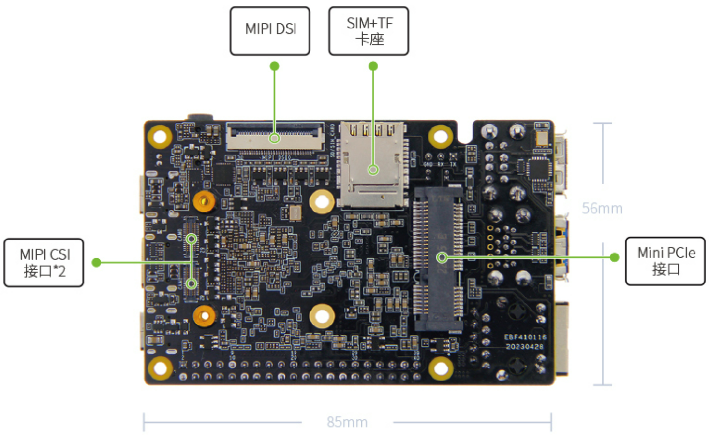


## 一. VMWare 虚拟机安装

>  **所选系统：** Ubuntu 20.04
>
>  **VMware 版本：** Workstation 17 Pro
>
>  **参考博客：** [VMware虚拟机安装Ubuntu20.04详细图文教程](https://blog.csdn.net/weixin_41805734/article/details/120698714)

### 1. 系统镜像下载

[Ubuntu 20.04.6](https://releases.ubuntu.com/focal/)


### 2. VMWare 安装 Ubuntu

#### 2.1 新建虚拟机及其相关配置

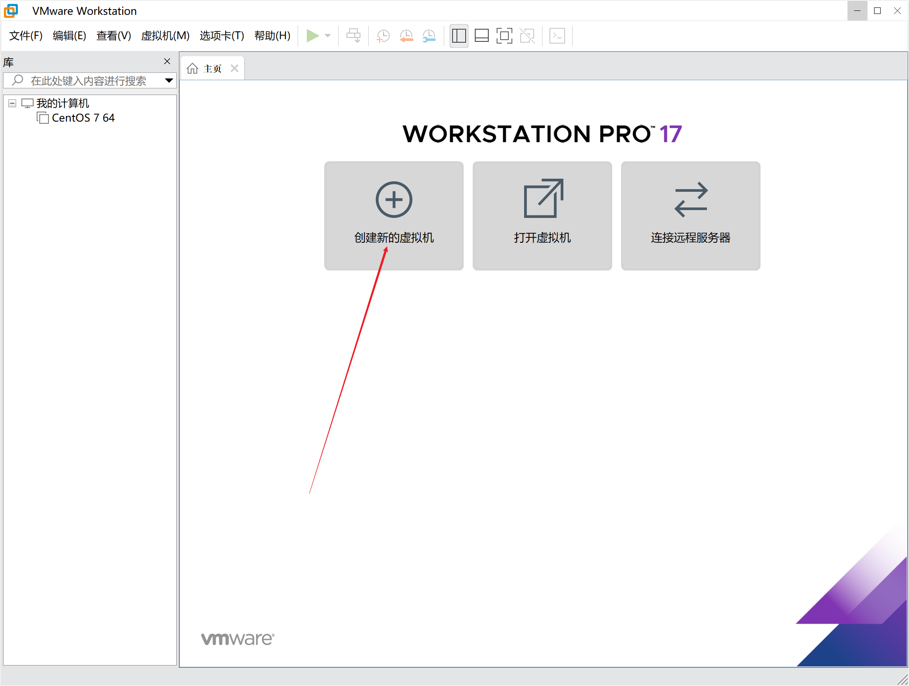


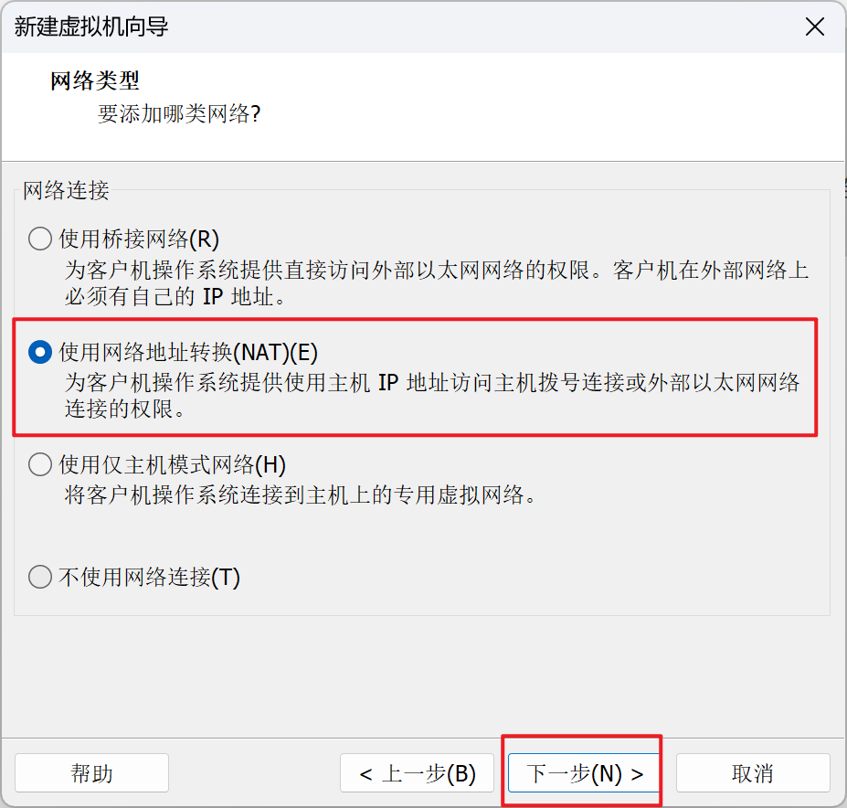


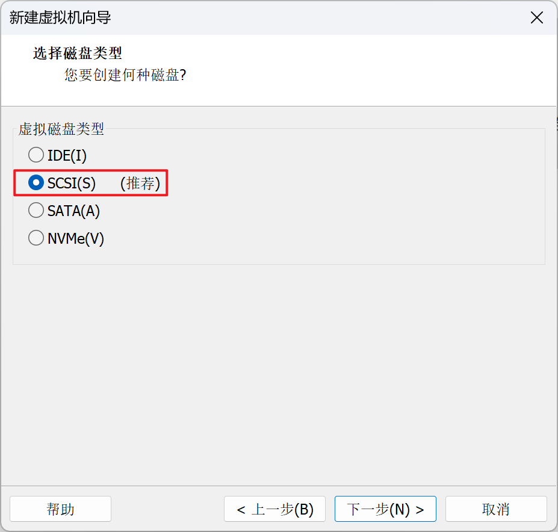


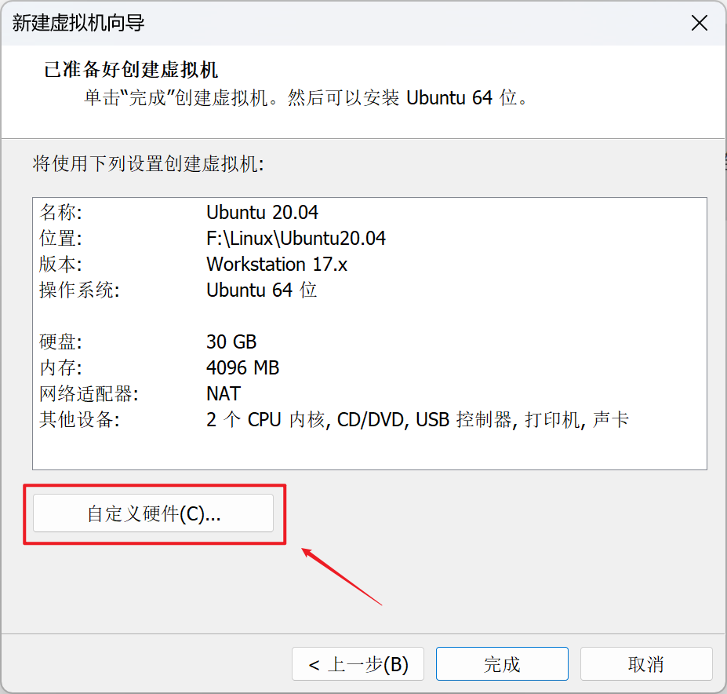


#### 2.2 Ubuntu系统安装

##### 2.2.1 启动虚拟机


##### 2.2.2 语言及键盘配置


##### 2.2.3 Ubuntu 显示分辨率调整

新启动的 Ubuntu 系统可能显示区域大小与 VMWare 窗口不匹配，通过以下方法调整。

1. 先退出安装窗口


2. 右上角打开设置页面


3. 找到显示器选项，更改为任意分辨率即可


##### 2.2.4 继续完成安装


重启后会停留在一个黑屏页面，显示一串英文 “Please remove ... , then press ENTER”，直接按回车键即可。

耐心等待重启后即可进入登陆页面，选中自己的账户，输入之前设置的密码，然后回车


显示以下界面即安装成功。


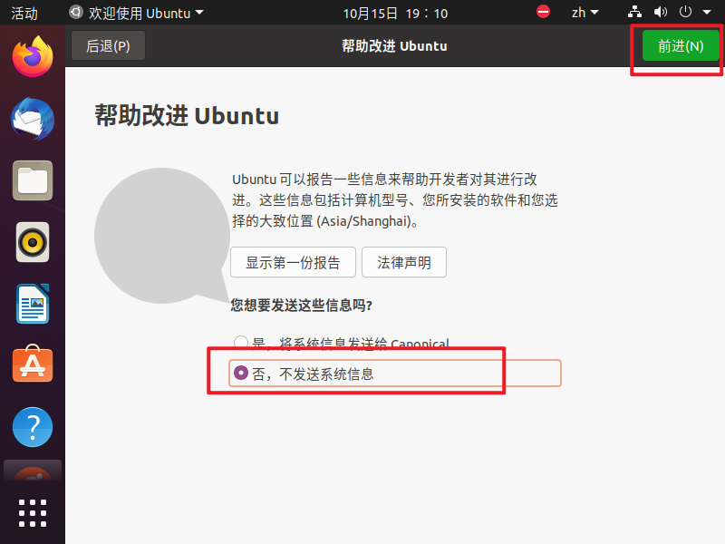


#### 2.3 更改 Ubuntu 软件源

Ubuntu 默认使用国外软件源，将其更改为国内软件源可提高下载速度


### 3. 设置共享文件夹

#### 3.1 添加共享文件夹

左上菜单栏找到 虚拟机 -> 设置，打开设置页面


点击添加后，根据引导完成设置即可。

#### 3.2 访问共享文件夹

**共享文件夹挂载位置：** `/mnt/hgfs`

1. 列出全部已共享文件夹 `ls /mnt/hgfs`

```shell
sprinec@sprinec-virtual-machine:/$ ls /mnt/hgfs
LinuxLearn
```

2. 进入共享文件夹

```shell
cd /mnt/hgfs/LinuxLearn
```

3. 复制虚拟机中文件到共享文件夹

```shell
cp -Rf /home/database/* /mnt/hgfs/LinuxLearn
```


## 二. Linux 基础与应用开发

> **参考书籍：** [[野火]《Linux基础与应用开发实战指南—基于LubanCat-RK系列板卡》](https://doc.embedfire.com/linux/rk356x/linux_base/zh/latest/index.html)
>
> **使用板卡：** LubanCat 4 RK3588S
>
> **板卡系统：** Debian 11 ( kernel : 5.10.198-rk3588 ) 
>
> **PC 系统：** Windows 11

### 1. 配置网络

#### 1.1 WIFI连接

需配合 USB 无线网卡或者 Mini PCIe 接口的网卡使用，若 USB 无线网卡不是免驱版则与 Mini PCIe 网卡一样，可能需要安装其对应的驱动才可使用。硬件准备好后在 Ubuntu 桌面右上角点击找到 WIFI 连接选择连接的网络输入密码连接即可。

- 免驱 USB 无线网卡

    

- inter5100AGN Mini PCIe 网卡 ( [驱动文件](./drivers/inter5100AGN Driver) / [驱动安装指南](./drivers/inter5100AGN Driver/README.md) )

    

#### 1.2 网口连接

网线连接后 PC 端需进行配置共享网络

1. 打开设置，选择网络和 Internet ，按照下图指示进入高级网络设置页面


2. 选择 PC 端需共享的网络

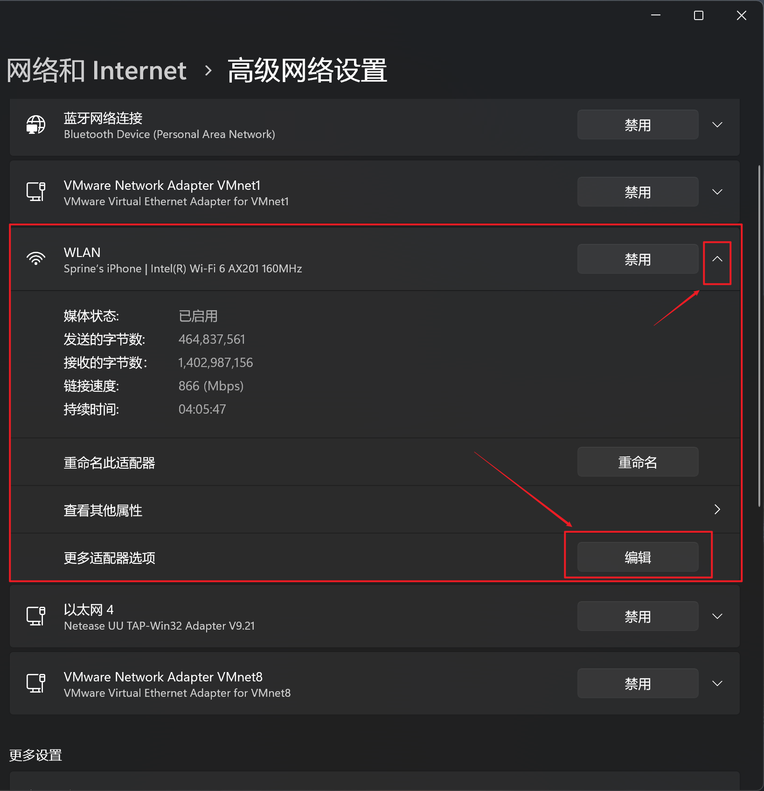

3. 按如图所示操作，家庭网络连接项选择 Linux 板卡所连接的网络端口即可

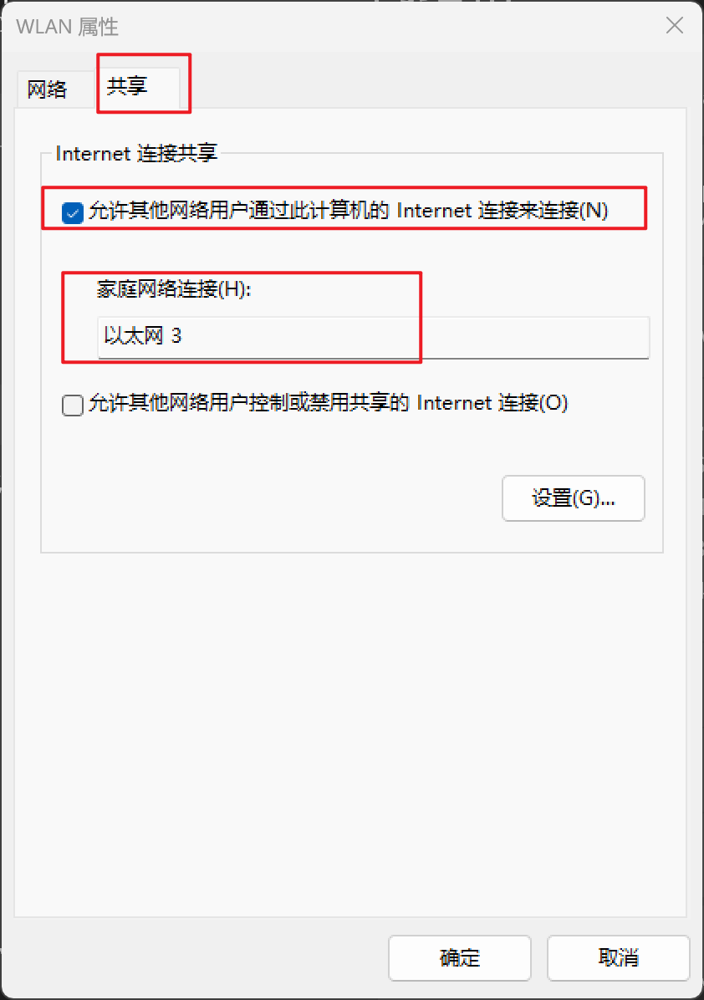

配置好 WIFI 或者网口的任意网络后，可使用以下命令查看板卡 IP 地址，从而在 PC 端进行 ssh 连接：

```bash
ifconfig
```

- 有线网口显示为 `ethx` ，x 为 0，1， 2 ...

- USB 无线网卡一般显示为 `wlanx` ，x 为 0，1， 2 ...
- Mini PCIe 接口网卡一般显示为网卡的驱动型号，如 `wlp4p65s0`

`inet` 后面跟的 xxx.xxx.xxx.xxx 即为板卡 IP 地址。

#### 1.3 配置 SSH 连接

Windows 10 及更高版本系统自带 OpenSSH 客户端，需要确保 Linux 端已经安装 OpenSSH 服务器，可通过以下命令安装：

```bash
sudo apt update
sudo apt install openssh-server
```

安装后启动 SSH 服务：

```bash
sudo systemctl start ssh
sudo ststemctl enable ssh
```

检查 SSH 服务状态，确保其运行正常:

```bash
sudo systemctl status ssh
```

如有需要可能还需配置防火墙，确保服务器的防火墙允许 SSH 流量，通常 SSH 使用端口 22，可以使用以下命令打开端口：

```bash
sudo ufw allow ssh
```

然后即可通过命令 `ssh username@server_ip` 从客户端连接到板卡/虚拟机/服务器了，也可通过 Tabby、MobaXterm、PuTTY、electerm、FinalShell、Hyper、SecureCRT、Termius 或是安装了 Remote SSH 插件的 VScode 进行 SSH 远程连接。

比较推荐 [Tabby](https://github.com/Eugeny/tabby)、[Termius](https://termius.com/) 和安装了 Remote SSH 插件的 VScode。其中若想给 VSCode 配置 SSH 免密远程登陆可查看 **OTHER - [VSCode 配置 SSH 免密远程登陆](#VSCode 配置 SSH 免密远程登陆)** 。

- Tabby

    

- Termius

    

- VSCode Remote SSH

    

### 2. Linux 命令行

**命令的格式：** `command [-options] [argument]`

#### 2.1 常用命令

- `ls` ：列出当前目录的文件
    - `ls [目录名]` ：列出其他文件的目录
    - `-a` ：显示所有文件及目录 (ls 内定将文件名或目录名称开头为 “ . ” 的视为隐藏档，不会列出)
    - `-l` ：除文件名称外，将文件型态、权限、拥有者、文件大小等信息详细列出
    - `-t` ：将文件依建立时间之先后次序列出
    - `-A` ：同 -a ,但不列出 “ . ” (当前目录) 及 “ .. ” (父目录)
    - `-R` ：若目录下有文件，则该目录下的文件也会列出，即递归显示
    
- `pwd` ：列出当前目录的位置

- `cd` ：切换到家目录
    - `cd [目录名]` ：切换到指定目录
    - `cd -` ：切换上次切换的目录
    - `cd ~` ：切换到家目录
    - `cd ..` ：切换上一层目录
    - `cd /` ：切换到根目录
    
- `mkdir [name]` ：创建名为 name 的文件夹
    - `-p [name1/name2]` ：递归创建
    
- `touch [name1, name2, ...]` ：更新/创建多个文件，命名分别为 name1, name2, ...

    `touch` 有两个功能：

    1. 把已存在文件的时间标签更新为系统当前的时间（默认方式）它们的数据将原封不动地保留下来.
    2. 用来创建新的空文件。

- `cp -r a b` ：复制 *a* 文件夹重命名为 *b*

    - `-R/r` ：递归处理

- `rm [-option] [一个或多个文件/文件夹名]` ：删除一个或多个文件或目录
  
    - `-R/r` ：递归处理
    - `-i` ：删除文件或文件夹前，终端会逐一询问确认
    - `-f` ：强制删除文件或目录
    
- `which [xxx]` ：查找并显示给定命令的绝对路径

- `echo` ：输出指定的字符串或者变量

- `cat [文件名]` ：连接多个文件并打印到标准输出

- `>`，`>>` ：输出重定向到文件
    - `命令 > 文件名` ：直接用输出覆盖原文件
    - `命令 >> 文件名` ：把输出追加到原文件的末尾

- `su [用户名]` ：用于切换用户

- `clear` ：清除当前屏幕终端上的任何信息

- `reboot` ：系统重启

- `poweroff` ：系统关机

- `chmod` ：用来变更文件或目录的权限


- `ps` ：报告当前系统的进程状态

- `df` ：显示磁盘的相关信息
    - `-h` ：以可读性较高的方式来显示信息

- `id` ：查看当前用户的 UID 值

- `dpkg` ：是 Debian Linux 系统用来安装、创建和管理软件包的实用工具。
    - `-L` ：显示于软件包关联的文件


- `sudo` ：管理员权限
    - `sudo !!` ：使用 sudo 权限重新执行上一条指令
    - `sudo -i` ：切换到 root 账户
- `sudo apt update` ：更新软件
- `sudo apt upgrade` ：安装更新的软件
- `sudo apt install xxx` ：软件安装
- `sudo apt remove xxx` ：软件卸载
- `su` ：切换到 root 账户

#### 2.2 其他软件

- `sudo nmtui` ： WiFi 连接图形化配置

### 3. 快捷键

#### Ubuntu 系统快捷键

- `Ctrl + Alt + t` ：打开终端（桌面系统适用）
- `Ctrl + c` ：取消输入的命令/中止命令

### 4. 用户与文件

#### 4.1 用户及用户组

在 Linux 中,每个用户都有一个特定的编号——UID，用于标识一个系统用户。

可通过 `id` 命令查看当前用户的 UID 值。

```bash
id
```


上图中的 gid 用于标识当前用户所在的分组(Group)，每个用户可以对应多个分组。

Linux 系统拥有多个分组，每个用户分组就相当社团，用户如果是多个用户组 的成员，就可以访问其他分组对应的文件，前提是该分组的文件允许其他用户访问，这就需要了解另一个知识点：文件权限。


#### 4.2 文件

Linux 一切皆文件

**Linux 的文件属性：**可以分为读权限、写权限、执行权限。

**Linux 文件权限**分三种情况：文件拥有者 ( owner )，分组成员 ( groups )  以及其他分组成员 ( other )。

使用以下命令查看当前目录的文件权限

```bash
ls -l
```


可以看到文件和文件夹的开头都有一串字符字符，例如：

```shell
drwxr-xr-x 2 cat cat 4096 Feb 14 2019 Desktop
```

各个字段的说明如下：


- 第一字段：文件属性

    文件属性共有十个字符，第一个字符代表文件的类型

    - `-` ：表示该文件是一个普通文件
    - `d` ：dirtectory（目录）的首字符，表示该文件是一个目录
    - `I` ：表示该文件是个链接文件

    后面的九个字符，每三个为一组，分别表示**文件拥有者的权限**、**文件所属组拥有的权限**以及**其他用户拥有的权限**。

    - `r` ：读（ read ）权限
    - `w` ：写（ write）权限
    - `x` ：执行（execute）权限

- 第二字段：链接占用的节点/子目录的个数

    第二字段的含义，主要取决该文件的类型,如果是文件的话，则表示该文件所具有的硬连接数。某个文件的第二字段如果等于 1 的话，代表没有其他指向该文件的硬连接。

    根据 Linux 系统存储文件的特点，链接的方式可以分为两种，分别是**硬链接**和**软连接**（符号连接）。软链接，类似于 Windows 操作系统的快捷方式。而硬链接，则是相当于把该文件复制一份，同时加上自动更新。当我们修改了硬链接文件的内容，源文件也会被修改。当为  某个文件创建硬链接时，该字段的值便会加 1。可以使用 `ln` 命令创建软链接和硬链接。

    对于文件夹来说，第二字段则表示该文件夹下有多少个子目录。空文件夹的话，该值默认等于 2，这是因为包含了 “ . ” 和 “ .. ” 子目录。

- 第三字段和第四字段：文件拥有者和文件所在的组

#### 4.3 chmod 命令

文件的权限由三部分组成，每个部分都对应着三种文件权限，可读、可写、可执行。

`rwx` 在二进制中的数值可以看成

- `r` ：100 - 4
- `w` ：010 - 2
- `x` ：001 - 1

因此，若文件的权限是 `rwx` ，它的数值表达式为 7，如果是 `rw-`，数值表达为 6，则有：

- `rwx` ：7 
- `rw-` ：6
- `r-x` ：5
- `r--` ：4
- `-wx` ：3
- `-w-` ：2
- `--x` ：1
- `---` ：0

若想要修改文件的所有权限则可使用以下命令：

```shell
sudo chmod xxx [文件名]
```

- `xxx = 777` 则文件权限变为了 `-rwxrwxrwx`
- `xxx = 666` 则文件权限变为了 `-rw-rw-rw-`

若要单独给用户、组、其他用户设置权限则使用以下命令

```shell
sudo chmod [ugoa][+-][rwx] [文件名]
```

- [ugoa]
    - `u` ：使用者
    - `g` ：用户所在的组
    - `o` ：其他用户
    - `a` ：所有用户

- [+-]
    - `+` ：增加权限
    - `-` ：移除权限

- [rwx]
    - `r` ：读
    - `w` ：写
    - `x` ：执行


举例：

```shell
# 给所有用户移除可执行的权限
sudo chmod a-x hello

# 给其他用户减少可写的权限
sudo chmod o-w hello

# 给 root 用户减少可写的权限
sudo chmod u-w hello

# 给 root 用户增加可写的权限
sudo chmod u+w hello													
```

### 5. Linux 文件目录

#### 5.1 根目录与家目录

**根目录**是 Linux 下所有文件和目录的起点，它的路径用斜杠符号 “ / ” 来表示。

```shell
ls /
```


当使用普通登陆用户（sprine）登陆时会默认进入**家目录** `/home/sprine`，当我们使用 root 用户登录时会进入 `/root` 目录，root 用户家目录就是 `/root`。


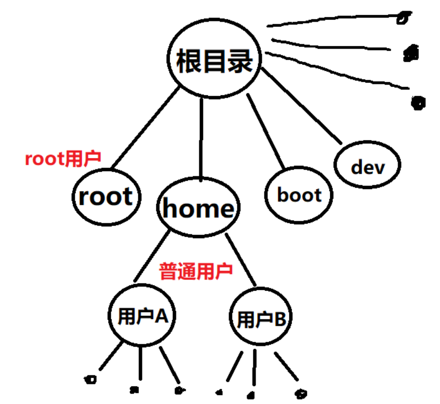

#### 5.2 根目录结构

整个 Linux 系统有且只有一棵从根目录开始的目录树，如下图所示。

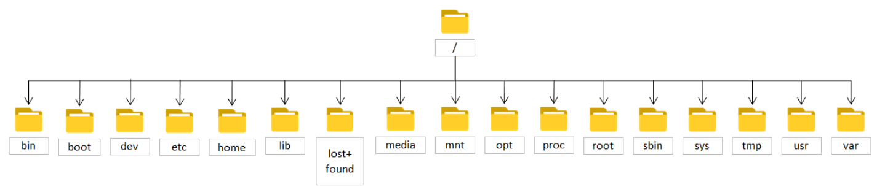

|    目录    | 目录放置的内容                                               |
| :--------: | :----------------------------------------------------------- |
|    bin     | 存放系统命令的目录，如命令 `cat`，`cp`，`mkdir`              |
|    boot    | 存放开机启动过程所需的内容，如开机管理程序 grub2             |
|    dev     | 所有设备文件的目录（如声卡、硬盘、光驱）                     |
|    etc     | 系统的主要配置文件                                           |
|    home    | 用户家目录数据的存放目录                                     |
|    lib     | 存放 sbin 和 bin 目录下命令所需的库文件                      |
| lib32/ib64 | 存放二进制函数库，支持 32 位 / 64 位                         |
| lost+found | 在 EXT3/4 系统中，当系统意外崩溃或意外关机时，会产生一些碎片文件在这个目录下面，系统启动 fcsk 工具会检查这个目录，并修复已损坏的文件。 |
|   media    | 用于挂载光盘，软盘和 DVD 等设备                              |
|    mnt     | 同 media 作用一样，用于临时挂载存储设备                      |
|    opt     | 第三方软件安装存放目录                                       |
|    proc    | 进程及内核信息存放目录，不占用硬盘空间                       |
|    root    | root 用户的家目录                                            |
|    run     | 是一个临时文件系统，存储系统启动以来的信息。当系统重启时，这个目录下的文件应该被删掉或清除 |
|    sbin    | root 用户使用的命令存放目录                                  |
|    srv     | 一些网络服务所需要的数据文件                                 |
|    sys     | 同 proc 目录，用于记录 CPU 与系统硬件的相关信息              |
|    tmp     | 程序运行时产生的临时文件存放目录                             |
|    usr     | 系统存放程序的目录，类似于在 windows 下的文件夹 programefiles |
|    var     | 存放内容常变动的文件目录，如系统日志文件                     |

### 6. Vi/Vim 编辑器

大部分 Linux 系统中都会自带 Vi 编辑器已方便用户在终端上编辑文件，而 Vim 是 Vi 的升级版本，它在 Vi 的基础上改进和增加了很多特性,是一个功能更强大、高度可定制的文本编辑器。

#### 6.1 Vim 使用演示

##### 6.1.1 安装 Vim

```shell
sudo apt install vim
```

##### 6.1.2 打开 Vi/Vim

```shell
vi
vi 文件名
```

```shell
vim
vim 文件名
```

##### 6.1.3 退出 Vi/Vim

1. `Ctrl + z` 直接强制退出

    该模式下退出后再次使用 vim 进入会报类似如下的提示

    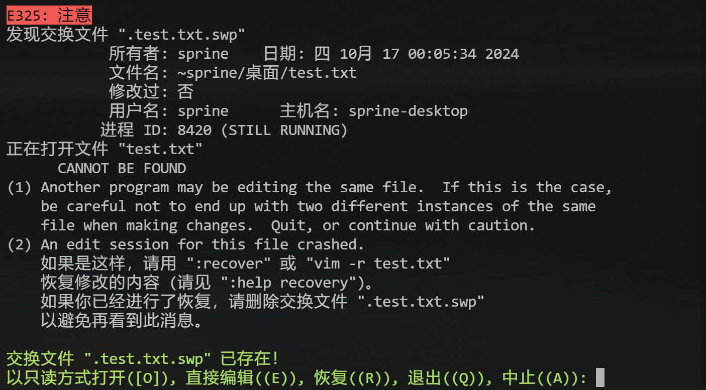

    具体处理方式请看 **ERROR LOG - [Vim Ctrl+z 强制退出后再次进入显示 E325：注意](#Vim Ctrl+z 强制退出后再次进入显示 E325：注意)**

2. 在**命令行模式**下输入退出命令退出

    1. 按下退出键 `Esc`，Vim 会进入到 *一般模式* 
    2. 输入英文冒号 `:` ，Vim 会进入到 *命令行模式* 

    3. 输入强制退出命令 `q!`  ，即字母 `q` 及英文叹号 `!` 

    4. 按回车执行命令，会退出 Vim，返回到终端

##### 6.1.4 输入内容

Vim 打开后默认是在**一般模式**，在该模式下的所有输入就如同在其它常用编辑器中按了快捷键。

可通过以下步骤进入到 **插入模式** 输入内容并保存文件：

1. 按下退出键 `Esc` 进入*一般模式*
2. 直接按字母 `i` ，进入*插入模式*
3. 输入内容
4. 按下退出键 `Esc` ，再次进入*一般模式*
5. 输入英文冒号 `:` ，Vim 会进入到 *命令行模式* 
6. 输入保存退出命令 `wq`
7. 按回车执行命令，会退出 Vim，返回到终端

#### 6.2 Vim 的三种模式

- **一般模式**（normal mode）：一般模式用来浏览文本，查找内容，但是不可以编辑，在该模式下的键盘输入会被当成快捷键，如复制粘贴等。打开 Vim 时，默认是工作在一般模式。
- **插入模式**（insert mode）：插入模式下具有普通编辑器的功能，该模式下的键盘输入会被当成文本内容。
- **命令行模式**（command-line mode）：命令行模式支持保存、退出、替换等命令，以及 Vim 的高级功能。

三种模式的切换图：


##### 6.2.1 插入模式

进入/退出插入模式的快捷键：

| 快捷键 | 功能描述                                           |
| :----: | -------------------------------------------------- |
|   i    | 在当前光标所在位置插入文本                         |
|   a    | 在当前光标所在位置的下一个字符插入文本             |
|   o    | 在光标所在位置后插入新行                           |
|   r    | 替换当前光标所在位置的字符                         |
|   R    | 可以替换当前光标所在位置之后的字符,按下“Esc”则退出 |
|  ESC   | 退出插入模式                                       |

##### 6.2.2 一般模式

在任意模式下按按键 `Esc` 可进入到一般模式。

一般模式快捷键：

|                          |        快捷键        | 功能描述                                                     |
| :----------------------: | :------------------: | ------------------------------------------------------------ |
|         光标移动         |        k / ↑         | 光标向上移动                                                 |
|                          |        j / ↓         | 光标向下移动                                                 |
|                          |        h / ←         | 光标向左移动                                                 |
|                          |        l / →         | 光标向右移动                                                 |
|                          |        PageUp        | 向上翻页                                                     |
|                          |       PageDown       | 向下翻页                                                     |
|                          |          nG          | 跳转到第 n 行                                                |
|      文本查找与替换      |        /word         | 在文件中搜索关键字 word                                      |
|                          |          n           | 查找下一个关键字                                             |
|                          |          N           | 查找上一个关键字                                             |
|                          | :1,$s/word1/word2/gc | 将文本中的所有关键字 word1 用 word2 进行替换，需要用户进行确认。（ 使用 `:1,$s/word1/word2/g` 则直接全部替换 ）。这实际是运行在命令模式。 |
|         撤销重做         |          u           | 撤销上一步的操作，等价于 Windows 的 `Ctrl+Z`                 |
|                          |       Ctrl + r       | 重做上一步的操作                                             |
| 删除、剪切、  复制、粘贴 |          d           | 删除光标所选的内容                                           |
|                          |          dd          | 删除当前行                                                   |
|                          |         ndd          | 删除光标后 n 行                                              |
|                          |          x           | 剪切光标选中的字符                                           |
|                          |          y           | 复制光标所选的内容                                           |
|                          |          yy          | 复制当前行                                                   |
|                          |         nyy          | 复制当前行后 n 行                                            |
|                          |          p           | 将复制的数据粘贴在当前行的下一行                             |
|                          |          P           | 将复制的数据粘贴在当前行的上一行                             |
|         区块操作         |          v           | 选择多个字符                                                 |
|                          |          V           | 可以选择多行                                                 |
|                          |       Ctrl + v       | 可以选择多列                                                 |

##### 6.2.3 命令行模式

在一般命令模式下，按下键盘的冒号键 `:` ，就可以进入命令行模式，继续输入要执行的命令按  回车即可执行。

命令行模式快捷键：

|    快捷键    | 功能描述                                            |
| :----------: | --------------------------------------------------- |
|      w       | 保存文档                                            |
| w <filename> | 另存为以 <filename> 为文件名的文档                  |
| r <filename> | 读取文件名为 <filename> 的文档                      |
|      q       | 直接退出软件，前提是文档未做任何修改                |
|      q!      | 不保存修改，直接退出软件                            |
|      wq      | 保存文档，并退出软件                                |
|    set nu    | 在行首加入行号                                      |
|   set nonu   | 不显示行号                                          |
| set hlsearch | 搜索结果高亮显示                                    |
|  ! command   | 回到终端窗口，执行 command 命令，按回车键可切回 vim |


#### 6.3 用 Vi/Vim 软件编写简单的 sh 脚本

在终端执行下列命令：

```shell
vim hello_world.sh
```

进入文件后输入以下内容：

```shell
echo "hello world,this is a script test!"
```

Vim 退出后回到终端，通过 `source` 命令运行刚刚编写的脚本文件：

```shell
sudo chmod u+x hello_world.sh
source hello_world.sh
```

### 7. Git 项目版本管理

#### 7.1 Git 安装与配置

1. 安装 Git，在终端输入下列命令：

    ```shell
    sudo apt-get install git -y
    ```

    - `-y` ：询问是否安装时默认选择 Yes

2. 用户配置，配置用户名和邮箱

    ```shell
    git config --global user.email xxx
    git config --global user.name xxx
    ```

    - `--global` ： 配置 `~/.gitconfig` 文件，对当前用户下的所有仓库有效
    - `--system` ：配置 `/etc/gitconfig` 文件，对当前系统下的所有用户有效
    - 无参数：配置 `.git/config` 文件，只对当前仓库有效

#### 7.2 Git 本地项目管理简单使用流程

1. 创建本地仓库

    ```shell
    git init [仓库名称]
    ```

2. 添加/修改文件

    ```shell
    cd [仓库名称]
    touch FILE1, FILE2, FILE3, ...
    vim FILE1
    ...
    ```

3. 将文件的修改变化保存到仓库的暂存区

    保存单个/多个文件修改：

    ```shell
    git add FILE1, FILE2
    ```

    保存全部修改：

    ```
    git add .
    ```

4. 将保存到暂存区的修改提交到本地仓库

    ```shell
    git commit -m "The changes you want to add"
    ```

    - `-m "MESSAGE"` ：提交信息

5. 查看提交历史

    ```shell
    git log
    ```

    - `git log` 页面按 `q` 退出

6. 根据提交的 ID 查看某一个提交的详细信息

    ```shell
    git show COMMIT_ID
    ```

#### 7.3 Git 线上托管项目管理简单使用流程

GitHub 和 Gitee 是一个基于 Git 的在线项目托管平台，它提供了 web 界面,，用户可以在上面创建远程仓库来存放自己的项目。所有的开发者可以基于这个远程仓库共同协作，不断地维护和完善该项目。

> 该节以 GitHub 为例，Gitee 同理

##### 7.3.1 GitHub 获取线上项目方式比较

在 GitHub 上克隆或者管理项目时，常用的方式一般有以下三种：

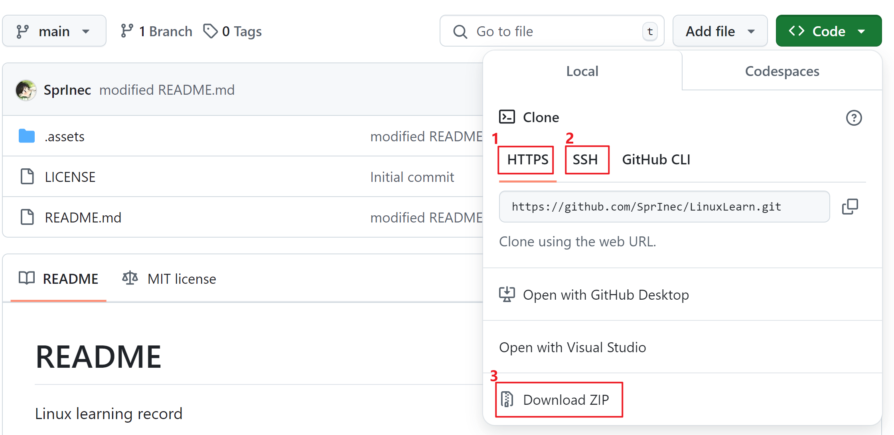

1. **HTTPS**
    - 简单易用，不需要额外配置，直接使用用户名和密码（或 token），但 GitHub 近期似乎不再支持使用用户名和密码进行身份验证，使用 Personal Access Token 进行替代。
    - GitHub 网速在国内受限，可能会出现多次下载失败的现象（需要科学上网）。
    - 安全性相对较低：密码可能被窃取，尤其在不安全的网络上。
    - 每次操作都需输入密码（如果未缓存）。
2. **SSH**
    - 安全性高，使用密钥对进行身份验证，避免密码泄露风险。
    - 方便，一旦设置好，推送和拉取时无需输入密码。
    - 相较于 HTTPS，在国内下载项目速度更快。
    - 初始配置较复杂，需要生成密钥并添加到 GitHub。
3. **ZIP 下载**
    - 简单直观，用户只需点击下载链接，操作非常简单，不需要安装 Git 或配置身份验证。
    - 缺乏版本控制，下载 ZIP 只会获取当前代码快照，不能方便地进行版本管理和更新。
    - 不能执行 Git 操作，无法进行常规的 Git 操作（如分支管理、合并等），需要手动管理文件。

总结比较：

- **SSH** 和 **HTTPS** 更适合需要频繁更新和版本控制的开发者，能够轻松进行 Git 操作。
- **ZIP 下载** 更适合不熟悉 Git 的用户或临时需要代码快照的情况，但不适合长期开发使用。

这里我们采用 SSH 方式。

##### 7.3.2 生成 SSH 密钥

终端输入以下命令：

```shell
ssh-keygen -t rsa -b 4096 -C "your_email@example.com"
```

在密钥生成过程中会出现以下询问：

```shell
Enter file in which to save the key (/home/username/.ssh/id_rsa): 
```

可以直接按 Enter 键，以使用默认的文件路径 `/home/username/.ssh/id_rsa` 保存 SSH 密钥。这样会在这个位置生成一个新的密钥文件。如果你希望使用不同的名称或路径，可以输入新的文件名，然后按 Enter 键。通常情况下，使用默认路径即可。

```shell
Enter passphrase (empty for no passphrase): 
```

在这个提示中，你可以选择输入一个密码短语（passphrase）来保护你的 SSH 密钥。这个密码短语在你每次使用密钥时会要求你输入，以增加安全性。如果你不想每次都输入密码短语，可以直接按 Enter 键留空。

生成密钥后，你会看到一个公钥文件 `id_rsa.pub`。记得将这个公钥添加到你的 GitHub 账户中，以便进行 SSH 连接。你可以用以下命令查看公钥内容：

```
cat ~/.ssh/id_rsa.pub
```

- 确保复制的内容包括开头的 `ssh-rsa`，后面是长字符串，最后是你的邮箱地址。

##### 7.3.3 GitHub 上添加 SSH 密钥

1. 点击右上角头像打开菜单栏，进入设置页面

    

2. 找到 SSH and GPG keys，点击 New SSH key

    

3. Title 任取，将 `id_rsa.pub` 中复制的密钥粘贴在 Key 栏中，后点击 Add SSH key 即可

    

4. 后续可在 SSH and GPG keys 页面管理自己的密钥

    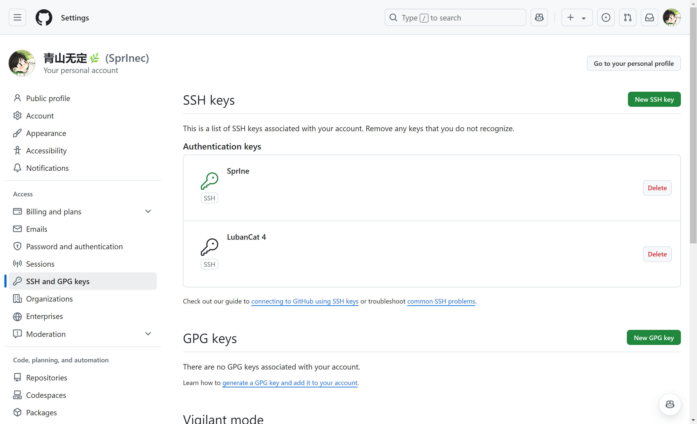


##### 7.3.4 通过 SSH 从线上仓库克隆项目

在 GitHub 或者 Gitee 网站上,找到需要下载的项目，复制该项目的 SSH 链接。


在终端 `cd` 到合适的目录运行下列命令：

```shell
git clone git@github.com:SprInec/LinuxLearn.git
```

第一次使用 SSH 克隆项目回车后可能会看到如下提示

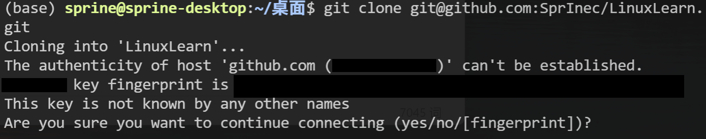

这是 SSH 连接的安全提示，询问你是否信任 GitHub 的服务器。输入 `yes` 并按 Enter 键，系统将会将 GitHub 的主机密钥添加到你的 `~/.ssh/known_hosts` 文件中，之后就不会再出现这个提示。

继续后续操作，`git clone` 会开始下载仓库，稍作等待即可在当前目录下看到克隆的项目文件夹。

##### 7.3.5 进行项目更改及推送

下面的操作和在本地进行项目管理的操作基本一致，只是多了 `push` 和 `pull` 两个进行线上和本地同步的操作。

1. 进入项目仓库

    ```shell
    cd [仓库名称]
    ```

2. 拉取远程仓库的最新更改

    ```shell
    git pull
    ```

3. 添加/修改文件

    ```shell
    touch FILE1, FILE2, FILE3, ...
    vim FILE1
    ...
    ```
    
4. 将文件的修改变化保存到仓库的暂存区

    保存单个/多个文件修改：

    ```shell
    git add FILE1, FILE2
    ```

    保存全部修改：

    ```
    git add .
    ```

5. 将保存到暂存区的修改提交到本地仓库

    ```shell
    git commit -m "The changes you want to add"
    ```

    - `-m "MESSAGE"` ：提交信息

6. 再次拉取远程更新

    ```bash
    git pull
    ```


7. 将本地提交推送到远程仓库

    ```shell
    git push
    ```

8. 查看提交历史

    ```shell
    git log
    ```

    - `git log` 页面按 `q` 退出

9. 根据提交的 ID 查看某一个提交的详细信息

    ```shell
    git show COMMIT_ID
    ```

#### 7.4 Git 项目管理的一般步骤

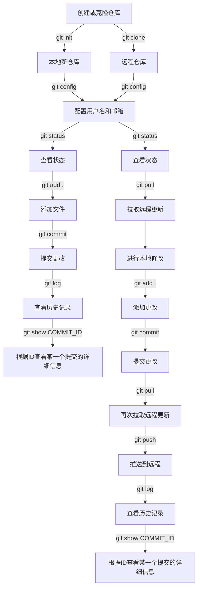
```mermaid
graph TD;
    A[创建或克隆仓库] -->|git init| B[本地新仓库]
    A -->|git clone| C[远程仓库]
    
    B -->|git config| E[配置用户名和邮箱]
    E -->|git status| F[查看状态]
    F -->|git add .| G[添加文件]
    G -->|git commit| H[提交更改]
    H --> |git log| R1[查看历史记录]
    R1 --> |git show COMMIT_ID| S1[根据ID查看某一个提交的详细信息]
    
    C -->|git config| E
    E -->|git status| L[查看状态]
    L -->|git pull| M[拉取远程更新]
    M --> N[进行本地修改]
    N -->|git add .| O[添加更改]
    O -->|git commit| P[提交更改]
    P --> |git pull| M2[再次拉取远程更新]
    M2 -->|git push| Q[推送到远程]
    Q -->|git log| R2[查看历史记录]
    R2 --> |git show COMMIT_ID| S2[根据ID查看某一个提交的详细信息]
```

**1. 创建或克隆仓库**

- 使用 `git init` 创建新的本地仓库。
- 使用 `git clone <repo-url>` 克隆现有的远程仓库。

**2. 配置用户信息**（如果是新仓库）

```bash
git config --global user.name "Your Name"
git config --global user.email "your_email@example.com"
```

**3. 查看状态**

使用 `git status` 查看当前工作区和暂存区的状态。

**4. 拉取远程更新**

使用 `git pull origin <branch-name>`  在进行本地修改之前，先拉取远程仓库的最新更改，以确保你的本地代码是最新的。这有助于避免后续推送时发生冲突。

**5. 添加更改**

使用 `git add <file>` 将更改添加到暂存区，或使用 `git add .` 添加所有更改。

**6. 提交更改**

使用 `git commit -m "Commit message"` 提交暂存区的更改。

**7. 再次拉取远程更新**

使用 `git pull` 再次拉取远程仓库更新。

**8. 推送到远程**

使用 `git push origin <branch-name>` 将本地提交推送到远程仓库。

**9. 处理分支**（可选）

- 创建新分支：`git branch <branch-name>`
- 切换分支：`git checkout <branch-name>`
- 合并分支：`git merge <branch-name>`

**10. 解决冲突**（如有）

在合并过程中可能会出现冲突，手动解决后，重新添加和提交。

**11. 查看历史记录**

使用 `git log` 查看提交历史，`git log`  页面按 `q` 退出。

**12. 根据某个 ID 查看详细的提交信息**

从`git log` 显示的信息中获取想要查看的 `COMMIT_ID` 使用  `git show COMMIT_ID` 命令进行查看。

#### 7.5 Git 本地项目上传到 GitHub

将本地通过 `git init` 创建的新仓库推送到 GitHub 的步骤如下：

##### 1. 创建 GitHub 仓库

- 登录到 GitHub，点击左上角的 `New` 图标。

    

- 输入仓库名称，选择是否公开或私有，最后点击 `Create repository`。

    

- 若没有勾选 `Add a README file` 创建好仓库后可能会显示以下页面

    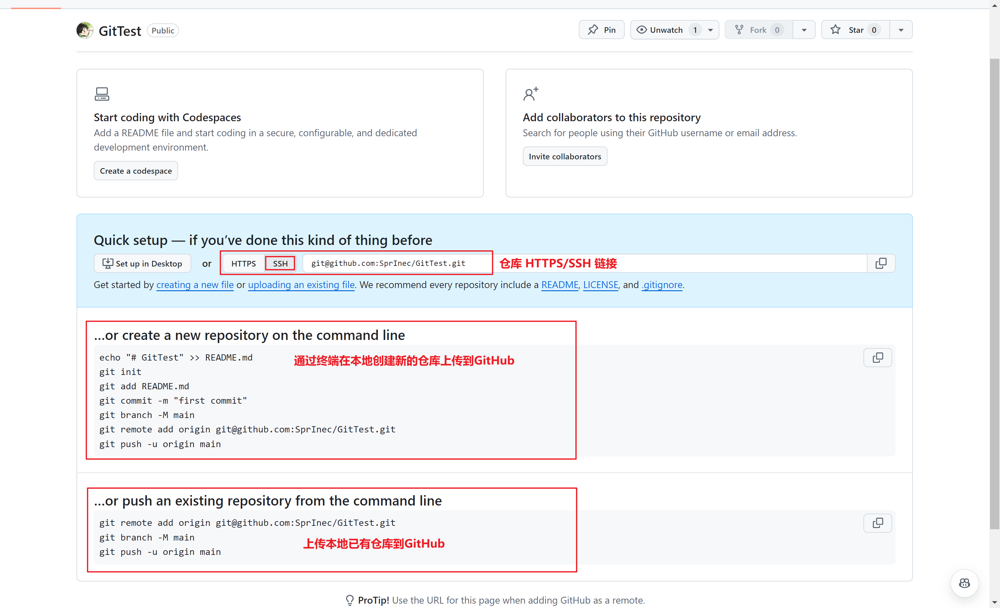

##### 2. 在本地仓库中添加远程仓库

在本地仓库中，使用以下命令将 GitHub 仓库设置为远程仓库：

```bash
git remote add origin git@github.com:你的用户名/仓库名.git
```

- 替换 `你的用户名` 和 `仓库名` 为你实际的 GitHub 用户名和创建的仓库名。

- `git@github.com:你的用户名/仓库名.git` 为 SSH 链接

##### 3. 添加文件并提交

如果还没有添加文件，可以按照以下步骤进行：

```bash
git add .
git commit -m "first commit"
```

##### 4. 查看当前所有分支

若不清楚当前仓库的分支情况，可使用以下命令查看当前仓库所有分支：

```bash
git branch
```

##### 5. 推送到 GitHub

使用以下命令将本地仓库的更改推送到 GitHub：

```bash
git push -u origin master
```

- `-u` ：它的作用是在首次推送一个分支时，建立本地分支与远程分支之间的跟踪关系。之后可以简单地使用 `git push` 和 `git pull` 而不用每次都指定远程仓库和分支名称，Git 会自动知道该推送或拉取到哪个分支。

如果使用的是 `main` 分支，替换为：

```bash
git push -u origin main
```

> [!TIP]
>
> **1首次推送到新的远程分支：** 可以使用 `git push -u origin <分支名>`，这样会创建本地分支与远程分支之间的跟踪关系。
>
> ```bash
> git push -u origin feature-branch
> ```
>
> 之后，在这个分支上只需要输入 `git push` 就可以推送到远程的 `feature-branch`。
>
> **2. 仅推送一次到特定分支：** 如果不想建立长期跟踪关系，只想推送一次到远程分支，可以省略 `-u`，直接执行：
>
> ```bash
> git push origin feature-branch
> ```
>
> **3. 推送本地分支到远程不同名称的分支：** 如果本地分支和远程分支名称不同，可以使用以下命令：
>
> ```bash
> git push origin <本地分支名>:<远程分支名>
> ```
>
> 例如，将本地的 `dev-branch` 推送到远程的 `main` 分支：
>
> ```bash
> git push origin dev-branch:main
> ```

#### 7.6 常用 Git 命令

- `git init` ：初始化一个新的 Git 仓库

- `git clone <repo-url>` ：克隆一个远程仓库到本地

- `git status` ：查看当前工作区和暂存区的状态

- `git log` ：查看提交历史

- `git add <file>` ：将指定文件添加到暂存区

- `git add .` ：将当前目录及其所有子目录下的所有文件添加到暂存区
- `git add *`：将当前目录下的所有文件（不包括子目录中的文件）添加到暂存区

- `git commit -m "Commit message"` ：提交暂存区的更改，并附上提交信息

- `git branch` ：列出所有本地分支

- `git branch <branch-name>` ：创建一个新分支

- `git checkout <branch-name>` ：切换到指定分支

- `git merge <branch-name>` ：将指定分支合并到当前分支

- `git pull origin <branch-name>` ：从远程仓库拉取并合并指定分支的更新

- `git push origin <branch-name>` ：将本地分支的更改推送到远程仓库

- `git remote -v` ：查看当前配置的远程仓库

- `git rev-parse --abbrev-ref HEAD` ：查看当前所在的分支

- `git checkout -- <file>` ：撤销未暂存的修改

- `git reset HEAD~1` ：撤销最近一次提交（保留修改）

### 8. 程序编译

#### 8.1 GCC 编译工具链

GCC 编译工具链（toolchain）是指以 GCC 编译器为核心的一整套工具，用于把源代码转化成可  执行应用程序。它主要包含以下三部分内容:

- `gcc-core`：即 GCC 编译器,用于完成预处理和编译过程，例如把 C 代码转换成汇编代码。
- `Binutils`：除 GCC 编译器外的一系列小工具包括了链接器 `ld`，汇编器 `as`，目标文件格式查看器 `readelf` 等。
- `glibc`：包含了主要的 C 语言标准函数库，C 语言中常常使用的打印函数 `printf`、`malloc` 函数就在 `glibc` 库中

在很多场合下会直接用 GCC 编译器来指代整套 GCC 编译工具链。

##### 8.1.1 GCC 编译器

GCC（GNU Compiler Collection）是由 GNU 开发的编程语言编译器。是历史上最优秀的编译器，其执行效率与一般的编译器相比平均效率要高 20%~30%。

安装 gcc 编译器：

```bash
sudo apt install gcc
```

查看 gcc 版本及所在位置：

```bash
gcc -v
which gcc
```


- `Target: aarch64-linux-gnu` ：表示该 GCC 的目标平台为 ARM64 位架构，表示它编译生成的应用程序只适用于 ARM 板卡平台，不适用于 x86 架构。

- `gcc version 11.4.0` ：表明该 GCC 的版本为 11.4.0，部分程序可能会对编译器版本有要求，同样的，编译指定版本的 uboot、Linux 内核的时候可能会对 GCC 有版本要求。

##### 8.1.2 Binutils 工具集

Binutils（ bin utility ），是 GNU 二进制工具集，通常跟 GCC 编译器一起打包安装到系统，它的官方说明网站地址为:https://www.gnu.org/software/binutils/ 。

在进行程序开发的时候通常不会直接调用这些工具，而是在使用 GCC 编译指令的时候由 GCC 编  译器间接调用。下面是其中一些常用的工具：

- `as` ：**汇编器**，把汇编语言代码转化为机器码（目标文件）。
- `ld` ：**链接器**，把编译生成的多个目标文件组织成最终的可执行文件。
- `readelf` ：可用于查看目标文件或可执行程序文件的信息。
- `nm` ：可用于查看目标文件中出现的符号。
- `objcopy` ：可用于目标文件格式转换，如 `.bin` 转换为 `.elf` 、`.elf` 转换成 `.bin` 等。
- `objdump` ：可用于查看目标文件的信息，最主要的作用是**反汇编**。
- `size` ：可用于查看目标文件不同部分的尺寸和总尺寸，例如代码段大小、数据段大小、使用的静态内存、总大小等。

系统默认的 Binutils 工具集位于 `/usr/bin`  目录下，可使用如下命令查看系统中存在的 Binutils 工具集：

```bash
ls /usr/bin/ | grep linux-gnu-
```


图中列出的是 Binutils 工具的完整名字，在终端中使用时通常直接使用它们的别名即可。

##### 8.1.3 glibc 库

glibc 库是 GNU 组织为 GNU 系统以及 Linux 系统编写的 C 语言标准库，因为绝大部分 C 程序都依赖该函数库，该文件甚至会直接影响到系统的正常运行，例如常用的文件操作函数 `read`、`write`、  `open`，打印函数 `printf`、动态内存申请函数 `malloc` 等。

在 Ubuntu 系统下，`libc.so.6` 是 glibc 的库文件，可直接执行该库文件查看版本，在主机上执行如下命令:

```bash
# 以下是 Ubuntu 64 位机的 glibc 库文件路径, 可直接执行
/lib/aarch64-linux-gnu/libc.so.6
```

glibc 的官网地址为：https://www.gnu.org/software/libc/

#### 8.2 Hello World

##### 8.2.1 创建工作目录

使用以下命令构建工作目录结构：

```bash
mkdir base_linux
cd base_linux

mkdir hello
cd hello

mkdir hello hello_arg hello_opt
```

工作目录结构如下:

```bash
base_linux
└── hello <-当前位置
    ├── hello
    ├── hello_arg
    └── hello_opt
```

##### 8.2.2 编写代码文件

进入目标目录 `base_linux/hello/hello`：

```bash
cd hello
```

使用 Vim 新建一个名为 `hello.c` 的文件：

```bash
vim hello.c
```

输入以下代码并保存：

```c
#include "stdio.h"

int main()
{
        int i;
        printf("hello, world! This is a C program.\n");
        for (int i = 0; i < 10; i++){
                printf("output i=%d\n",i);
        }

        return 0;
}
```

##### 8.2.3 编译并执行

使用 gcc 把 `hello.c` 编译成 `hello` 程序

```bash
gcc hello.c -o hello
```

查看目录下文件：

```bash
ls
```


执行生成的 `hello` 程序：

```bash
./hello
```


#### 8.3 GCC 编译过程

##### 8.3.1 基本语法

GCC 命令语法如下：

```bash
gcc <option> <file_name>
```

常用选项 <option>：

- `-o` ：小写字母 `o`，指定生成的可执行文件的名字，不指定的话生成的可执行文件名为 `a.out`。
- `-E` ：只进行预处理，既不编译，也不汇编。
- `-S` ：只编译、不汇编。
- `-c` ：编译并汇编，但不进行链接。
- `-g` ：生成的可执行文件带调试信息，方便使用 `gdb` 进行调试。
- `-Ox` ：大写字母 `O` 加数字，设置程序的优化等级，如 `-O0`  `-O1`  `-O2`  `-O3`，数字越大代码的优化等级越高，编译出来的程序一般会越小，但有可能会导致程序不正常运行。

##### 8.3.2 编译过程

GCC 编译选项除了`-g` 和 `-Ox` 选项，其它选项实际上都是编译的分步骤，即只进行某些编译过程。

直接编译成可执行文件：

```bash
gcc hello.c -o hello
```

以上命令等价于执行以下全部操作：

1. **预处理**，可理解为把头文件的代码汇总成 C 代码，把 `*.c` 转换得到 `*.i` 文件

    ```bash
    gcc -E hello.c -o hello.i
    ```

2. **编译**，可理解为把 C 代码转换为汇编代码，把 `*.i` 转换得到 `*.s` 文件

    ```bash
    gcc -S hello.i -o hello.s
    ```

    也可直接以 C 文件作为输入进行编译，与上面的命令是等价的：

    ```bash
    gcc -S hello.c -o hello.s
    ```

3. **汇编**，可理解为把汇编代码转换为机器码，把 `*.s` 转换得到 `*.o`，即目标文件

    ```bash
    gcc -c hello.s -o hello.o
    ```

    也可以直接以 C 文件作为输入进行汇编，与上面的命令是等价的：

    ```bash
    gcc -c hello.c -o hello.o
    ```

    - `.o` 是为了让计算机阅读的，如果直接使用编辑器打开，只会看到乱码。

    - Linux 下生成的 `*.o` 目标文件、`*.so` 动态库文件以及下一小节链接阶段生成最终的可执行文件都是 `elf` 格式的，可以使用 `readelf` 工具来查看它们的内容。

        ```bash
        readelf -a hello.o
        ```

        从 readelf 的工具输出的信息，可以了解到目标文件包含 ELF 头、程序头、节等内容

4. **链接**，把不同文件之间的调用关系链接起来，把一个或多个 `*.o` 转换成最终的可执行文件

    ```bash
    gcc hello.o -o hello
    ```

GCC 编译工具链在编译一个 C 源文件时需要经过以下 4 步:

1. **预处理**：在预处理过程中，对源代码文件中的文件包含 (include)、预编译语句 (如宏定义  define 等) 进行展开，生成 `.i`  文件。可理解为把头文件的代码、宏之类的内容转换成更纯粹的 C 代码，不过生成的文件以 `.i` 为后缀。
2. **编译**：把预处理后的 `.i` 文件通过编译成为汇编语言，生成 `.s` 文件，即把代码从 C 语言转换成汇编语言，这是 GCC 编译器完成的工作。
3. **汇编**：将汇编语言文件经过汇编，生成目标文件`.o` 文件，每一个源文件都对应一个目标文件。即把汇编语言的代码转换成机器码，这是 `as` 汇编器完成的工作。
4. **链接**：最后将每个源文件对应的 `.o` 文件链接起来，就生成一个可执行程序文件，这是链接  器 `ld` 完成的工作。


##### 8.3.3 链接的两种类型

- **动态链接**：GCC 编译时的默认选项。动态是指在应用程序运行时才去加载外部的代码库,  例如 `printf` 函数的 C 标准代码库 `*.so` 文件存储在 Linux 系统的某个位置，`hello` 程序执行时调用库文件 `*.so` 中的内容，不同的程序可以共用代码库。所以动态链接生成的程序比较小，占用较少的内存。

    ```bash
    gcc hello.c -o hello
    ```

- **静态链接**：链接时使用选项 `–static`，它在编译阶段就会把所有用到的库打包到自己的可  执行程序中。所以静态链接的优点是具有较好的兼容性，不依赖外部环境，但是生成的程序比较大。

    ```bash
    gcc hello.c -o hello_static --static
    ```

    

在 Ubuntu 下，可以使用 `ldd` 工具查看动态文件的库依赖：

```bash
ldd hello
ldd hello_static
```


可以看到，动态链接生成的 `hello` 程序依赖于库文件 `linux-vdso.so.1`、`libc.so.6` 以及 `ld-linuxaarch64.so.1`，其中的 `libc.so.6` 就是 C 标准代码库，程序中调用了它的 `printf`  库函数。 

 静态链接生成的 `hello_static` 没有依赖外部库文件。

#### 8.4 Hello World Pro-1

main 函数传参：

```c
int main(int argc, char **argv)
```

例：命令端执行

```bash
./hello aaa bbb ccc
```

- `int argc` ：保存参数的个数，上例中 argc = 4
- `char **argv` ：保存传入的参数的指向字符串数组的指针
    1. argv[0] = ./hello
    2. argv[1] = aaa
    3. argv[2] = bbb
    4. argv[3] = ccc

进入目录 `base_linux/hello/hello_arg`

```bash
cd base_linux/hello/hello_arg
```

使用 Vim 创建并编辑文件 `hello_arg.c`

```bash
vim hello_arg.c
```

```C
#include <stdio.h>

int main(int argc, char **argv)
{       
        int i;
        if (argc >= 2)
        {
                printf("you enter: \"");
                for (i = 0; i < argc; i++)
                {
                        printf("%s", argv[i]);
                }
                printf("\"\n");
                printf("you enter %d strings\n", argc);
        }       
        else
        {       
                printf("hello, world! This is a C program.\n");
        }       

        return 0;
}
```

编译并执行文件：

```bash
gcc hello_arg.c -o hello_arg
```

```bash
./hello_arg 1 2 3 4 5
```

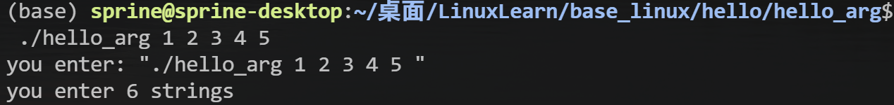

> [!NOTE]
>
> 输入的参数都是以字符串的形式保存，如果输入数字的话，需要字符串转成数字类型才能使用

#### 8.5 Hello World Pro-2

增加选项配置，像我们平常用的 ls 命令，我们可以在后面加入不同的选项就可以实现不一样的  功能。

进入目录 `base_linux/hello/hello_opt` 

```bash
cd base_linux/hello/hello_opt
```

使用 Vim 创建并编辑文件 `hello_opt.c`

```bash
vim hello_opt.c
```

```c
#include <stdio.h>
#include <getopt.h>
#include <stdlib.h>
#include <string.h>

/**
 * @brief: 打印帮助信息
 */
void usage(const char *argv_0)
{
        printf("\nUsage %s: [-option] \n", argv_0);
        printf("[-a] hello!\n");
        printf("[-b] I am LubanCat\n");
        printf("[-c <str>] str\n");
        printf("[-d <num>] printf num of '*' (num<100)\n");
        printf("[-h] get help\n");
        exit(1);
}

/**
 * @brief: 打印 n 个 * 号
 */
void d_option(char *num_str)
{
        int num, i;
        int ge, shi;

        shi = (char)num_str[0] - 48;
        ge = (char)num_str[1] - 48;
        num = shi * 10 + ge;

        for (i = 0; i < num; i++)
        {
                printf("*");
        }
        printf("*\n");
}

int main(int argc, char **argv)
{
        int i;
        int opt;

        while ((opt = getopt(argc, argv, "c:d:abh")) != -1)
        {
                switch (opt)
                {
                        case 'a':
                                printf("hello!\n");
                                break;
                        case 'b':
                                printf("I am LubanCat\n");
                                break;
                        case 'c':
                                if (optarg)
                                {
                                        if (optarg[0] == '-')
                                        {
                                                usage(argv[0]);
                                        }
                                        else
                                        {
                                                printf("%s\n", optarg);
                                        }
                                }
                                else
                                {
                                        usage(argv[0]);
                                }
                                break;
                        case 'd':
                                if (optarg)
                                {
                                        if (optarg[0] == '-')
                                        {
                                                usage(argv[0]);
                                        }
                                        else
                                        {
                                                if (strlen(optarg))
                                                {
                                                        d_option(optarg);
                                                }
                                                else
                                                {
                                                        usage(argv[0]);
                                                }
                                        }
                                }
                                else
                                {
                                        usage(argv[0]);
                                }
                                break;
                        default: 
                                usage(argv[0]);
                                break;
                }
        }

        return 0;
}
```

编译并执行：

```bash
gcc hello_opt.c -o hello_opt
```

```bash
./hello_opt
./hello_opt -a
./hello_opt -b
./hello_opt -c helloworld
./hello_opt -d num
./hello_opt -abcd
./hello_opt -h
```


### 9. Linux 系统下的程序

#### 9.1 裸机下的 Hello World

单片机中 `hello_world` 程序的流程图：

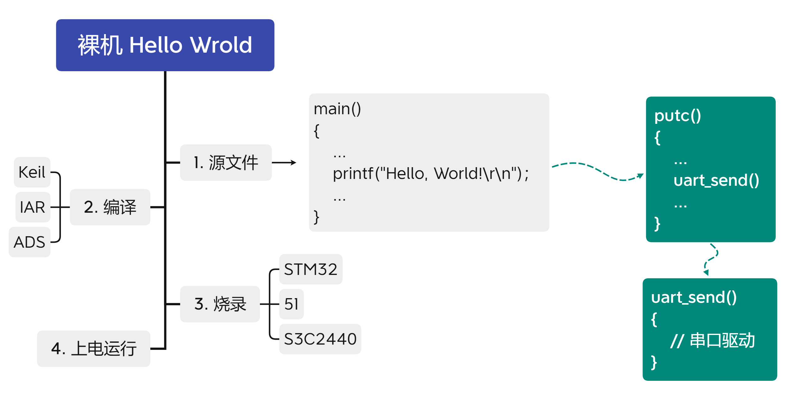

- 第一步：进行源代码的编写，其中关键的点在于 `printf` 函数的实现，它需要依赖单片机的串口驱动程序。
- 第二步：借助一些集成开发环境进行程序的编译。一键编译，无需学习编译链接相关知识。
- 第三步：借助烧录工具烧录到具体芯片上。一键烧录，无需学习芯片的 flash 和各种各样启  动方式。
- 第四步：上电启动板卡，串口输出 “ Hello World ” 字符串。

#### 9.2 Linux 系统下的 Hello World

Linux 系统下， `hello_world` 程序的流程图如下：

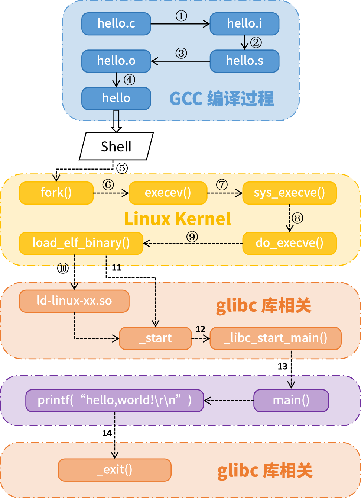

- 第一部分，浅蓝色外框部分为程序的编译。
- 第二部分，浅黄色外框部分为 Linux 内核提供的服务。
- 第三部分，橘色外框部分为 `glibc` 库提供的服务。
- 第四部分，浅紫色外框部分，为用户程序。

针对每个子步骤的进一步讲解：

1. 预处理 `hello.c`，主要是处理程序里面的文件包含、处理宏定义、条件编译。

2. 把 c 文件编译成为汇编文件 (.s)，其中进行了词法分析，语法分析，语义分析、生成中间代  码、对代码进行优化等工作。

3. 把汇编文件 (.s) 编译成可重定位文件 (.o)。

4. 把可重定位文件 (.o) 链接成为可执行文件，其中链接可分为静态链接和动态链接。

    - **静态链接**：在编译阶段就会把所有用到的库打包到自己的可执行程序中，其优点是具有较好的兼容性，不依赖外部环境，但是生成的程序比较大。

    - **动态链接**：在应用程序运行时，链接器去加载外部的共享库，并完成共享库和动态编译程序之间的链接。不同的程序可以共用代码库，节省内存空间。

5. 控制台输入 `./hello`  命令后，Shell 会创建一个新的进程来执行该程序。`fork()` 函数就是用于创建一个新的进程的。这里的进程可以先简单理解为程序的容器。

6. `exeve()` 函数可以理解为向上一步新建的进程，填充一个可执行程序 (hello)。

7. `sys_execve()` 函数为 linux 系统调用，被 `exeve()` 函数调用，这里的系统调用可以理解为是操作系统系统开放给用户的最底层接口。

8. `do_exeve()` 函数是 `sys_execve()` 函数的核心。

9. `load_elf_binary()` 函数会去文件系统中读取 `hello`  程序到内存，然后判断它是否是动态链接的可执行程序，如果不是，则进一步判断是否是静态链接的文件。

10. `ld-linux-xx.so` 是 `glibc` 库中的动态连接器。如果 `hello` 程序是动态链接程序，该动态链接器会去加载共享库，并完成共享库和程序的链接工作，然后准备真正开始执行 `hello` 程序。

11. 相反，如果 `hello` 程序是静态编译的程序，则无需再加载链接共享库，直接开始准备执行  `hello` 程序。

    - 第 10 和 11 步分别执行之后，都会开始执行 `hello` 程序，`_start` 是程序的真正入口，而该符号在 `glibc` 中。也就是说程序的真正入口在 `glibc`。

12. `__libc_start_main()` 也是 `glibc` 中的函数，用于在执行用户程序前进行一些初始化工作。

13. 调用用户程序中的 `mian()` 函数,开始执行 `printf` 打印函数。

14. 程序执行完了之后，调用 `glibc` 库中的 `_exit()` 函数，来结束当前进程。

### 10. Makefile

#### 10.1 Makefile 是什么

在编译单个文件时，使用以下命令即可：

```bash
gcc hello.c -o hello
```

当一个工程中有很多 C 源文件和 H 头文件时，再直接使用编译器指令就非常麻烦了，如下例:

```bash
gcc hello.c aaa.c bbb.c -o hello
```

而且哪怕只是修改一个文件，也需要重新编译所有的文件，白白浪费了很多开发时间。

解决这个问题最好的方式就是把工程的编译规则写下来，让编译器自动加载该规则进行编译。解决方法就是使用 make 和 Makefile，这两个工具是搭配使用的：

- **make 工具**：可以帮助我们找出项目里面修改变更过的文件，并根据依赖关系，找出受修改影响的其他相关文件，然后对这些文件按照规则进行单独的编译，这样一来就能避免重新编译项目的所有的文件。
- **Makefile 文件**：上面提到的规则、依赖关系主要是定义在这个 Makefile 文件中的，在其中合理地定义好文件的依赖关系之后，make 工具就能精准地进行编译工作。


管理一个项目工程，实质上就是管理项目文件间的依赖关系。在学习和使用 Makefile 的时候，一定要牢牢抓住它这种面向依赖的思想，心里一定要谨记，**Makefile 中所有的复杂、晦涩的语法都是更好地为解决依赖问题而存在的**。

当工程复杂度再上一个台阶的时候，会觉得手写 Makefile 也很麻烦，那个时候可以用 CMake、autotools 等工具来帮忙生成 Makefile。

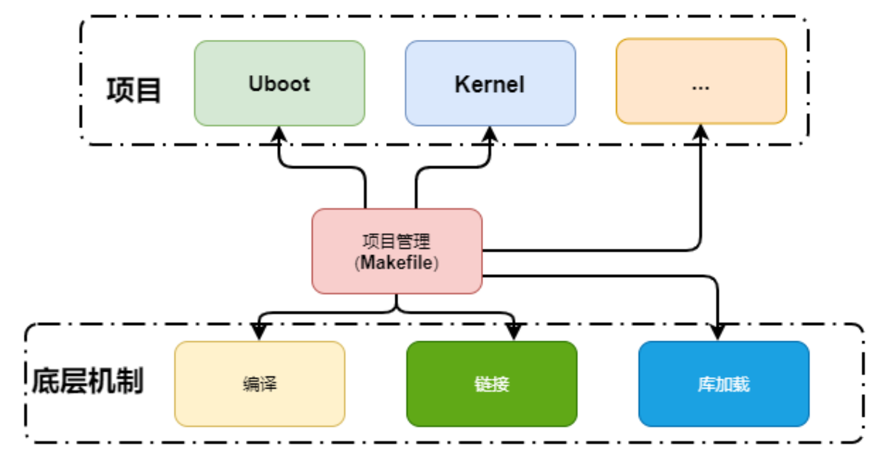

#### 10.2 常用的 Makefile 知识点


1. **基础语法** ：描述目标和依赖的特定格式，Makefile 的核心。
2. **变量**：记录特定的信息，避免重复输入原始信息，尤其是当需要手动输入的信息很长时。
3. **分支判断**：灵活控制多个不同的编译过程，方便兼容不同属性。
4. **头文件依赖**：监控头文件的变化，头文件也是程序的关键内容。
5. **隐含规则**：利用 Makefile 的一些默认规则，可以减少编写 Makefile 的工作量。
6. **自动化变量**：利用 Makefile 的默认的自动化变量，可以减少编写 Makefile 的工作量。
7. **模式规则**：灵活使用正则表达式，减少编写 Makefile 的工作量。
8. **函数**：使用 Makefile 的各种函数，可以更方便地实现 Makefile 的功能。

Makefile 的核心在于基础语法，用来描述目标和依赖的关系。其他语法的目的，是为了减少编写 Makefile 工作量，让开发人员能够以更加优雅、更加简洁、更好维护的方式来实现 Makefile 的功能。

#### 10.3 使用 Makefile 控制编译

使用以下命令安装 Makefile 工具:

```bash
sudo apt install make
```

本节的代码目录为 `./base_linux/makefile` 。

##### 10.3.1 Makefile 小实验

```makefile
# path: base_linux/makefile/test1/Makefile
targeta: targetc targetb
        ls -lh

targetb:
        touch test.txt

targetc: 
        pwd

targetd:
        rm -f test.txt
```

- 这个 Makefile 文件主要是定义了四个目标操作

- 第一个目标 `targeta`，是最终目标及 make 的默认目标

- `targeta: targetc targetb` ：目标 a，依赖于目标 `targetc` 和 `targetb`

    ` Tab ls -lh` ：目标要执行的 shell 命令 `ls -lh`，列出目录下的内容

- `targetb:` ：目标 b，无依赖

    `Tab touch test.txt` ：目标要执行的 shell 命令，使用 `touch` 创建 `test.txt` 文件

- `targetc:` ：目标 c，无依赖

    `Tab pwd` ：目标要执行的 shell 命令，`pwd` 显示当前路径

- `targetd` ：目标 d，无依赖

    由于 abc 目标都不依赖于目标 d，所以直接 make 时目标 d 不会被执行

    可以使用 `make targetd` 命令执行

make 程序会根据 Makefile 中描述的目标与依赖关系，执行达成目标需要的 shell 命令。简单来说，Makefile 就是用来指导 make 程序如何干某些事情的清单。

##### 10.3.2 使用 Makefile 编译程序

###### 10.3.2.1 使用 GCC 编译多个文件

使用 vim 在指定路径下创建并编写以下文件：

```c
// path: base_linux/makefile/test2/hello_main.c
#include "hello_func.h"

int main(void)
{
    hello_func();
    return 0;
}
```

```c
// path: base_linux/makefile/test2/hello_func.c
#include <stdio.h>
#include "hello_func.h"

void hello_func(void)
{
        printf("hello, world! This is a C program.\n");
        for (int i = 0; i < 10; i++)
        {
                printf("output i = %d\n", i);
        }
}
```

```c
// path: base_linux/makefile/test2/hello_func.h
void hello_func(void);
```

编写完成后在 `/makefile/test2/` 目录下使用 GCC 进行编译：

```bash
gcc hello_main.c hello_func.c -o hello_main -I .
```

- `-I .`  ：告诉编译器头文件路径，让它在编译时可以在 “.” (当前目录)寻找头文件

运行生成的 `hello_main` 程序：

```bash
./hello_main
```

 

###### 10.3.2.2 使用 Makefile 编译

使用 vim 创建 Makefile 文件并编写如下代码:

```makefile
# path: base_linux/makefile/test2/Makefile
hello_main: hello_main.c hello_func.c
	gcc -o hello_main hello_main.c hello_func.c -I .

clean:
	rm -f *.o hello_main
```

使用 `make` 命令编译程序：

```bash
rm hello_main # 移除上一节 gcc 编译的程序
ls

make # 使用 make 进行编译
ls

make # 再次使用 make 编译

touch hello_func.c # 更新 hello_func.c 文件时间为当前系统时间

make # 再次编译

make clean # 调用 make clean 清除程序
ls
```

- make 会对目标文件和依赖进行更新检查，当依赖文件有改动时，才会再次执行命令更新目标文件。

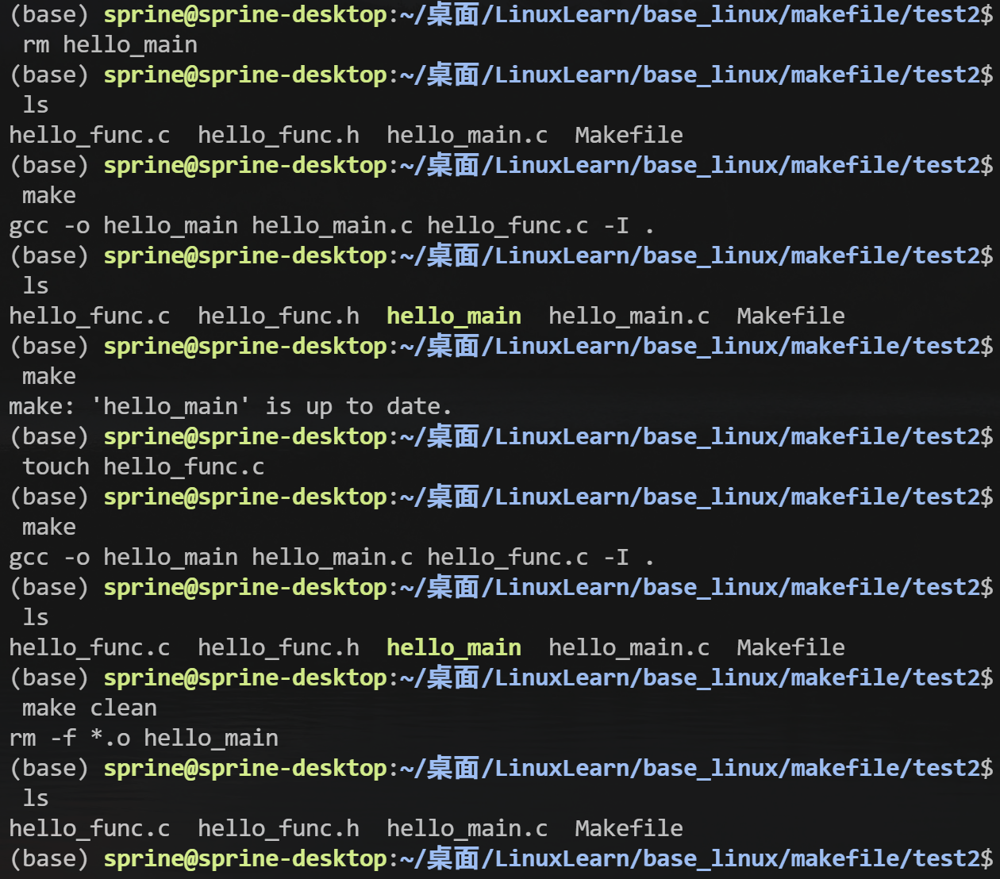

#### 10.4 目标与依赖

Makefile 中跟目标相关的语法：

```makefile
[目标 1]: [依赖]
	[命令 1]
	[命令 2]
[目标 2]: [依赖]
	[命令 1]
	[命令 2]
```

- **目标** ：指 make 要做的事情，可以是一个简单的代号，也可以是目标文件，需要顶格书写，  前面不能有空格或 Tab。

    一个 Makefile 可以有多个目标，写在最前面的第一个目标，会被  Make 程序确立为 *默认目标*，例如前面的 `targeta`、`hello_main`。

- **依赖** ：要达成目标需要依赖的某些文件或其它目标。例如前面的 `targeta` 依赖于 `targetb` 和  `targetc`，又如在编译的例子中，`hello_main` 依赖于 `hello_main.c`、`hello_func.c` 源文件，若这些文件更新了会重新进行编译。

- **命令 1，命令 2 ⋯ 命令 n** ：make 达成目标所需要的命令。只有当目标不存在或依赖文件的修改时间比目标文件还要新时，才会执行命令。要特别注意**命令的开头要用 `Tab` 键，不能使用空格代替**，有的编辑器会把 `Tab` 键自动转换成空格导致[出错](#make 编译报错 *** missing separator.  Stop.)，若出现这种情况请检查自己的编辑器配置。**OTHER - [VSCode 中将默认的空格缩进更改为 Tab 缩进](#VSCode 中将默认的空格缩进更改为 Tab 缩进)**

#### 10.5 伪目标

前面我们在 Makefile 中编写的目标，在 make 看来其实都是目标文件，例如 make 在执行的时候由于在目录找不到 `targeta` 文件，所以每次 `make targeta` 的时候，它都会去执行 `targeta` 的命令，期待执行后能得到名为 `targeta` 的同名文件。如果目录下真的有 `targeta`、`targetb`、`targetc` 的文件，即假如目标文件和依赖文件都存在且是最新的，那么 `make targeta` 就不会被正常执行了，这会引起误会。

Makefile 使用 **`.PHONY`** 前缀来区分目标代号和目标文件，并且这种目标代号被称为**伪目标**，phony 单词翻译过来本身就是假的意思。

也就是说，只要我们不期待生成目标文件，就应该把对应的目标定义成伪目标。

前面 [10.3.1](#10.3.1 Makefile 小实验) 的演示代码修改如下：

```makefile
 # path: base_linux/makefile/test1/Makefile
.PHONY: targeta
targeta: targetc targetb
	ls -lh

.PHONY: targetb
targetb:
	touch test.txt
	
.PHONY: targetc
targetc:
	pwd
	
.PHONY: targetd
targetd:
	rm -f test.txt
```

```bash
cd /base_linux/makefile/
cp -r test2 test3
cd test3
touch clean
```

[10.3.2.2](#10.3.2.2 使用 Makefile 编译) 的演示代码修改如下:

```makefile
# path: base_linux/makefile/test3/Makefile
hello_main: hello_main.c hello_func.c
	gcc -o hello_main hello_main.c hello_func.c -I .

.PHONY: clean
clean:
	rm -f *.o hello_main
```

如果以上代码中不写 `.PHONY:clean` 语句，并且在目录下创建一个名为 `clean` 的文件，那么当  执行 `make clean` 时，`clean` 的命令并不会被执行。

#### 10.6 默认规则

GCC 的整个编译过程包含如下步骤，make 在执行时也是使用同样的流程，不过在 Makefile 的实际应用中，通常会把编译和最终的链接过程分开。


```mermaid
graph LR;
	A[hello.c] --> |编译|B[hello.o] --> |链接|C[hello]
	B --> |make 默认依赖|A
	C --> |依赖|B
```


即我们的 `hello_main` 目标文件本质上并不是依赖 `hello_main.c` 和 `hello_func.c` 文件，而是依赖于 `hello_main.o` 和 `hello_func.o`，把这两个文件链接起来就能得到我们最终想要的 `hello_main`  目标文件。

make 有一条默认规则，当找不到 `xxx. o` 文件时，会查找目录下的同名  `xxx.c` 文件进行编译。根据这样的规则，我们可把 Makefile 改修改如下。

```makefile
# path: base_linux/makefile/test4/Makefile
hello_main: hello_main.o hello_func.o
	gcc -o hello_main hello_main.o hello_func.o

# 以下是 make 的默认规则，可以不写
#hello_main.o: hello_main.c
#	gcc -c hello_main.c
	
#hello_func.o: hello_func.c
#	gcc -c hello_func.c
```

最终使用 make 的编译结果如下：

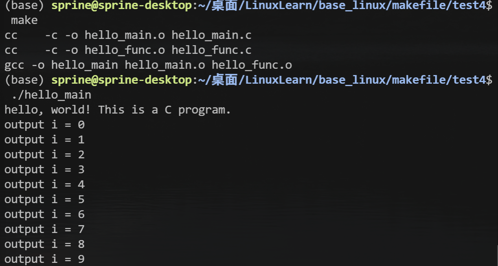

从 make 的输出可看到，它先执行了两条额外的 `cc` 编译命令，这是由 make 默认规则执行的，  它们把 C 代码编译生成了同名的 `.o` 文件，然后 make 根据 Makefile 的命令链接这两个文件得到最终目标文件 `hello_main`。

#### 10.7 使用变量

使用 C 自动编译成 `*.o` 的默认规则有个缺陷，由于没有显式地表示 `*.o` 依赖于`.h` 头文件，假如我们修改了头文件的内容，那么 `*.o` 并不会更新，这是不可接受的。并且默认规则使用固定的 `cc`  进行编译，假如我们想使用 ARM-GCC 进行交叉编译，那么系统默认的 `cc` 会导致编译错误。  要解决这些问题并且让 Makefile 变得更加通用，需要引入变量和分支进行处理。

##### 10.7.1 基本语法

在 Makefile 中的变量，有点像 C 语言的宏定义，在引用变量的地方使用变量值进行替换。变量的命名可以包含字符、数字、下划线,区分大小写，定义变量的方式有以下四种：

- `=` ：延时赋值，该变量只有在调用的时候，才会被赋值。
- `:=` ：直接赋值，与延时赋值相反，使用直接赋值的话，变量的值定义时就已经确定了。
- `?=` ：若变量的值为空，则进行赋值，通常用于设置默认值。
- `+=` ：追加赋值，可以往变量后面增加新的内容。

当我们想使用变量时，其语法如下：

```makefile
$(变量名)
```

实验代码：

```makefile
# path: base_linux/makefile/test5/Makefile
VAR_A = FILEA
VAR_B = $(VAR_A)
VAR_C := $(VAR_A)
VAR_A += FILEB
VAR_D ?= FILED

.PHONY: check
check:
	@echo "VAR_A:" $(VAR_A)
	@echo "VAR_B:" $(VAR_B)
	@echo "VAR_C:" $(VAR_C)
	@echo "VAR_D:" $(VAR_D)
```

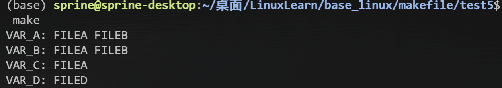

执行完 make 命令后，只  有 VAR_C 是 `FILEA`。这是因为 VAR_B 采用的延时赋值，只有当调用时，才会进行赋值。当调  用 VAR_B 时，VAR_A 的值已经被修改为 `FILEA FILEB`，因此 VAR_B 的变量值也就等于 `FILEA  FILEB`。

##### 10.7.2 改造默认规则

下面使用变量对 [hello_main](#10.3.2.2 使用 Makefile 编译) 的 Makefile 进行大改造：

```makefile
# path: base_linux/makefile/test6/Makefile
# 定义变量
CC = gcc
CFLAGS = -I .
DEPS = hello_func.h

# 目标文件
hello_main: hello_main.o hello_func.o
	$(CC) -o hello_main hello_main.o hello_func.o
	
# *.o 文件的生成规则
%.o: %.c $(DEPS)
	$(CC) -c -o $@ $< $(CFLAGS)

# 伪目标
.PHONY: clean
clean:
	rm -f *.o hello_main
```

- 代码的 3~5 行：分别定义了 CC、CFLAGS、DEPS 变量，变量的值就是等号右侧的内容，定  义好的变量可通过 `$(变量名)` 的形式引用，如后面的 `$(CC)`、`$( CFLAGS)`、`$(DEPS)`  等价于定义时赋予的变量值 `gcc`、`-I.` 和 `hello_func.h`。

- 代码的第 9 行：使用 `$(CC)` 替代了 `gcc`，这样编写的 Makefile 非常容易更换不同的编译器，如要进行交叉编译，只要把开头的编译器名字修改掉即可。

- 代码的第 12 行：`%` 是一个通配符，功能类似 `*`，如 `%.o` 表示所有以 `.o` 结尾的文件。

    即等价于 o 文件依赖于 c 文件的默认规则。不过这行代码后面的 `$(DEPS)` 表示它除了依赖 c 文件，还依赖于变量 `$(DEPS)` 表示的头文件，所以当头文件修改的话 `.o` 文件也会被重新编译。

- 代码的第 13 行：这行代码出现了特殊的变量 `$@` 、`$<` ，可理解为 Makefile 文件保留的关键字，是系统保留的自动化变量:

    - `$@` 代表了目标文件
    - `$<` 代表了第一个依赖文件

    即 `$@` 表示 `%.o`，`$<` 表示 `%.c` ，所以当第 11 行的 `%` 匹配的字符为 `hello_func` 的话，第 13 行代码等价于：

    ```makefile
    $(CC) -c -o $@ $< $(CFLAGS)
    # 等价于
    gcc -c -o hello_func.o hello_func.c -I .
    ```

    也就是说 makefile 可以利用变量及自动化变量，来重写 `.o` 文件的默认生成规则，以及增加头文件的依赖。

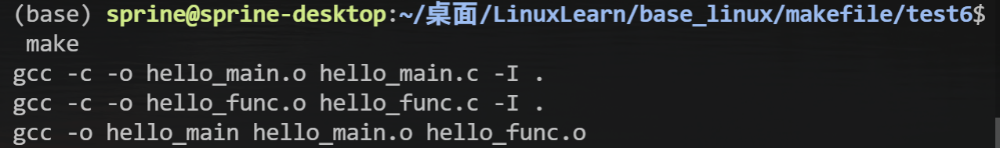

##### 10.7.3 改造链接规则

与 *.o 文件的默认规则类似，我们也可以使用变量来修改生成最终目标文件的链接规则，具体参  考如下代码。

```makefile
# path: base_linux/makefile/test7/Makefile
# 定义变量
TARGET = hello_main
CC = gcc
CFLAGS = -I .
DEPS = hello_func.h
OBJS = hello_main.o hello_func.o

# 目标文件
$(TARGET): $(OBJS)
	$(CC) -o $@ $^ $(CFLAGS)

# *.o 文件的生成规则
%.o: %.c $(DEPS)
	$(CC) -c -o $@ $< $(CFLAGS)
	
# 伪目标
.PHONY: clean
clean:
	rm -f *.o hello_main
```

- 代码的第 3 行：定义了 `TARGET` 变量，它的值为目标文件名 `hello_main`。
- 代码的第 7 行：定义了 `OBJS` 变量，它的值为依赖的各个 o 文件，如 `hello_main.o`、`hello_func.o`  文件。
- 代码的第 10 行：使用 `TARGET` 和 `OBJS` 变量替换原来固定的内容。
- 代码的第 11 行：使用自动化变量 `$@` 表示目标文件 `$(TARGET)` ，使用自动化变量 `$^`  表示所有的依赖文件即 `$(OBJS)`。

以上代码中的 Makefile 把编译及链接的过程都通过变量表示出来了，非常通用。使用这样的 Makefile 可以针对不同的工程直接修改变量的内容就可以使用。

##### 10.7.4 其他自动化变量

| 符号 | 意义                                               |
| :--: | -------------------------------------------------- |
|  $@  | 匹配目标文件                                       |
|  $%  | 与 `$@` 类似，但 `$%` 仅匹配 “ 库 ” 类型的目标文件 |
|  $<  | 依赖中的第一个目标文件                             |
|  $^  | 所有的依赖目标，如果依赖中有重复的，只保留一份     |
|  $+  | 所有依赖的目标，即使依赖中有重复的也原样保留       |
|  $?  | 所有比目标要新的依赖目标                           |

#### 10.8 使用函数

在更复杂的工程中，头文件、源文件可能会放在二级目录，编译生成的 `*.o` 或可执行文件也放到  专门的编译输出目录方便整理，如下图所示。示例中 `*.h` 头文件放在 `includes` 目录下，`*.c` 文件放在 `sources` 目录下，编译输出存放在 `build` 中。

实现这些复杂的操作通常需要使用 Makefile 函数。

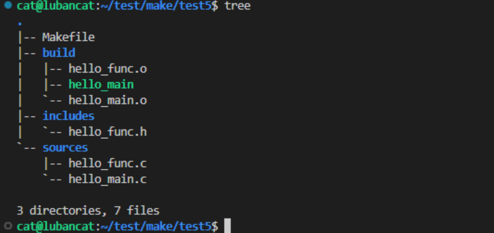

##### 10.8.1 函数格式及示例

在 Makefile 中调用函数的方法跟变量的使用类似，以 `$()` 或 `${}` 符号包含函数名和参数，具  体语法如下：

```makefile
$(函数名 参数)
# or
${函数名 参数}
```

###### 10.8.1.1 notdir 函数

**`notdir`** 函数用于去除文件路径中的目录部分，其格式如下：

```makefile
$(notdir 文件名)
```

例如输入参数 `./sources/hello_func.c`，函数执行后的输出为 `hell_func.c`，也就是说它会把输入中的 `./sources/` 路径部分去掉，保留文件名。使用范例如下:

```makefile
$(notdir ./source/hello_func.c)
```

上面的函数执行后会把路径中的 `./sources/` 部分去掉，输出为 `hello_func.c`

###### 10.8.1.2 wildcard 函数

**`wildcard`** 函数用于获取文件列表，并使用空格分隔开，其格式如下：

```makefile
$(wildcard 匹配规则)
```

例如函数调用 `$(wildcard *.c)` ，函数执行后会把当前目录的所有 c 文件列出。假设我们在  上图中的 Makefile 目录下执行该函数，使用范例如下:

```makefile
# 在 sources 目录下有 hello_func.c、hello_main.c、test.c 文件
$(wilecard sources/*.c)
# 函数的输出为：
sources/hello_func.c sources/hello_main.c sources/test.c
```

###### 10.8.1.3 patsubst 函数

**`patsubst`** 函数功能为模式字符串替换。它的格式如下:

```makefile
$(patsubst 匹配规则，替换规则，输入的字符串) 
```

当输入的字符串符合匹配规则，那么使用替换规则来替换字符串，当匹配规则中有 `%` 号时，替换规则也可以例程 `%` 号来提取 `%` 匹配的内容加入到最后替换的字符串中。示例如下：

```makefile
$(patsubst %.c, build_dir/%.o, hello_main.c)
# 函数的输出为:
build_dir/hello_main.o
# 执行如下函数
$(patsubst %.c, build_dir/%.o, hello_main.xxx)
# 由于 hello_main.xxx 不符合匹配规则 "%.c",所以函数没有输出
```

第一个函数调用中，由于 `hello_main.c` 符合 `%.c` 的匹配规则 ( `%` 在 Makefile 中的类似于 `*` 通配符 )，而且 `%` 从 `hello_main.c` 中提取出了 `hello_main` 字符，把这部分内容放到替换规  则 `build_dir/%.o` 的 `%` 号中，所以最终的输出为 `build_di r/hello_main.o`。 

 第二个函数调用中，由于由于 `hello_main.xxx` 不符合 `%.c` 的匹配规则，`.xxx` 与 `.c` 对  不上，所以不会进行替换，函数直接返回空的内容。

##### 10.8.2 多级结构工程的Makefile

接下来我们使用上面三个函数修改我们的 Makefile，以适应包含多级目录的工程，修改后的内容如下所示：

```makefile
# path: base_linux/makefile/test8/Makefile
# Defining variables
TARGET = hello_main

# Path to store intermediate files
BUILD_DIR = build

# Path to store the source files
SRC_DIR = sources

# Path to store the include files
INC_DIR = includes .

# Source files
SRCS = $(wildcard $(SRC_DIR)/*.c)

# Object files (*.o)
OBJS = $(patsubst %.c, $(BUILD_DIR)/%.o, $(notdir $(SRCS)))

# Header files
DEPS = $(wildcard $(INC_DIR)/*.h)

# Specify the path to the header files
CFLAGS = $(patsubst %, -I %, $(INC_DIR))

# Target file
$(BUILD_DIR)/$(TARGET): $(OBJS)
	$(CC) -o $@ $^ $(CFLAGS)

# Generation rules for *.o files
$(BUILD_DIR)/%.o: $(SRC_DIR)/%.c $(DEPS)

# Create a compilation directory to store process files
# The command is preceded by '@', which means it will not be 
# output on the terminnal.
	@mkdir -p $(BUILD_DIR)
	$(CC) -c -o $@ $< $(CFLAGS)

# Phony target
.PHONY: clean cleanall

# Delete the output folder
clean: 
	rm -rf $(BUILD_DIR)
	
# Delete all
cleanall: 
	rm -rf $(BUILD_DIR)
```

目录结构如下：

```bash
.
├── includes
│   └── hello_func.h
├── Makefile
└── sources
    ├── hello_func.c
    └── hello_main.c
```

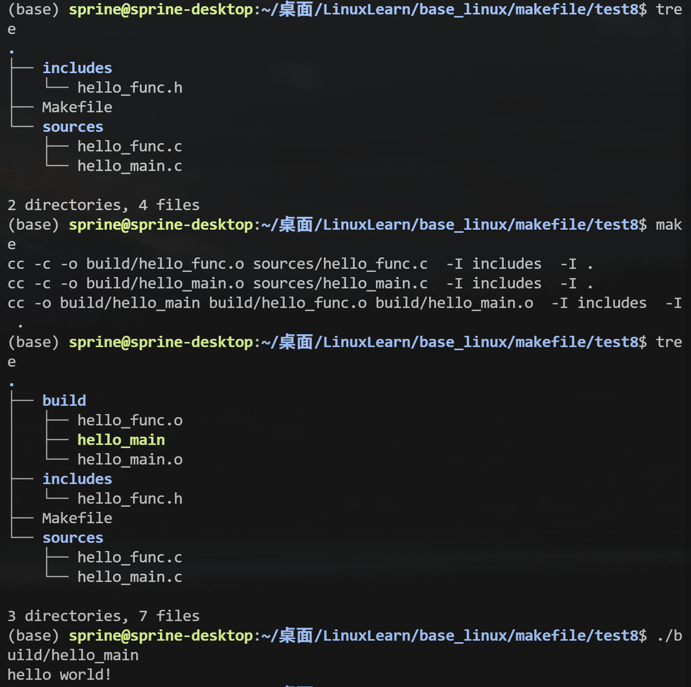

#### 10.9 使用分支

为方便直接切换 GCC 编译器，我们还可以使用条件分支增加切换编译器的功能。在 Makefile 中  的条件分支语法如下：

```makefile
ifeq (arg1, arg2)
分支 1
else
分支 2
endif
```

分支会比较括号内的参数 `arg1` 和 `arg2` 的值是否相同，如果相同，则为真，执行分支 1 的内容，否则的话，执行分支 2 的内容，参数 `arg1` 和 `arg2` 可以是变量或者是常量。

使用分支切换 GCC 编译器的 Makefile 如下所示：

```makefile
# path: base_linux/makefile/test9/Makefile
# Defining variables
# ARCH default to x86, using the gcc compiler
# Otherwise use the arm compiler
ARCH ?= arm
TARGET = hello_main

# Path to store intermediates files
BUILD_DIR = build_$(ARCH)

# Path to store the source files
SRC_DIR = sources

# Path to store the includes files
INC_DIR = includes .

# The source files
SRCS = $(wildcard $(SRC_DIR)/*.c)

# The objects files
OBJS = $(patsubst %.c, $(BUILD_DIR)/%.o, $(notdir $(SRCS)))

# The header files
DEPS = $(wildcard $(INC_DIR)/*.h)

# Specity the path to the header files
CFLAGS = $(patsubst %, -I %, $(INC_DIR))

# Select compiler based on input ARCH variable
# ARCH = arm, use gcc
# ARCH = aarch64, use arm-gcc
ifeq ($(ARCH), arm)
CC = gcc
else
CC = aarch64-linux-gnu-gcc
endif

# Target file
$(BUILD_DIR)/$(TARGET): $(OBJS)
	$(CC) -o $@ $^ $(CFLAGS)

# Generation rules for the *.o files
$(BUILD_DIR)/%.o: $(SRC_DIR)/%.c $(DEPS)
	@mkdir -p $(BUILD_DIR)
	$(CC) -c -o $@ $< $(CFLAGS)
	
# Phony targets
.PHONY: clean cleanall

# Delete by Schema
clean:
	rm -rf $(BUILD_DIR)
	
# Delete all
cleanall:
	rm -rf build_aarch64 build_arm
```

- arm 交叉编译工具链 `aarch64-linux-gnu-gcc` 的获取与配置见：**[五. Linux驱动开发 - 2.1 获取编译工具链](#2.1 获取编译工具链)**
- 本示例中的 Makefile 目前只支持使用一个源文件目录，如果有多个源文件目录还需要改进。

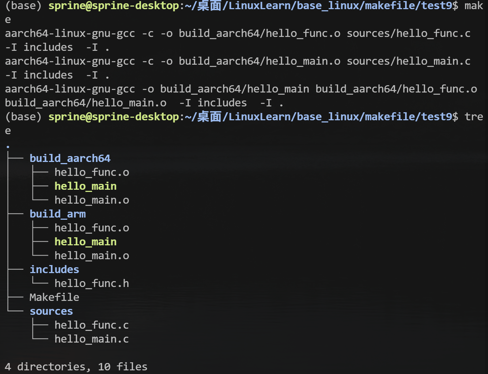

### 11. 文件操作与系统调用

在 Linux 系统中有一个重要的概念：一切皆文件，它把一切资源都看作是文件，包括硬件设备，  通常称为设备文件。

本节的代码目录为 `./base_linux/file_io`

#### 11.1 存储设备文件系统

为了高效地存储和管理数据，文件系统在存储介质上建立了一种组织结构，这些结构包括操作系  统引导区、目录和文件，就如同图书馆给不同类的书籍进行分类、编号，放在不同的书架上。不  同的管理理念引出了不同的文件系统标准，上述的 FAT32、NTFS、exFAT、ext2/3/4 就是指不同类型的标准，除此之外，还有专门针对 NAND 类型设备的文件系统 jffs2、yaffs2 等等。

各种不同标准文件系统的特性：

- **FAT32 格式**：兼容性好，STM32 等 MCU 也可以通过 Fatfs 支持 FAT32 文件系统，大部分  SD 卡或 U 盘出厂默认使用的就是 FAT32 文件系统。它的主要缺点是技术老旧，单个文件  不能超过 4GB，非日志型文件系统。
- **NTFS 格式**：单个文件最大支持 256TB、支持长文件名、服务器文件管理权限等，而且 NTFS  是日志型文件系统。但由于是日志型文件系统，会记录详细的读写操作，相对来说会加快 FLASH 存储器的损耗。文件系统的日志功能是指，它会把文件系统的操作记录在磁盘的某个分区，当系统发生故障时，能够尽最大的努力保证数据的完整性。
- **exFAT 格式**：基于 FAT32 改进而来，专为 FLASH 介质的存储器设计 ( 如 SD 卡、U 盘)，空  间浪费少。单个文件最大支持16EB，非日志文件系统。
- **ext2 格式**：简单,文件少时性能较好，单个文件不能超过 2TB，非日志文件系统。
- **ext3 格式**：相对于 ext2 主要增加了支持日志功能。
- **ext4 格式**：从 ext3 改进而来，ext3 实际是 ext4 的子集。它支持 1EB 的分区，单个文件最大支持 16TB，支持无限的子目录数量，使用延迟分配策略优化了文件的数据块分配，允许自主控制是否使用日志的功能。
- **jffs2 和 yaffs2 格式**：jffs2 和 yaffs2 是专为 FLASH 类型存储器设计的文件系统，它们针对  FLASH 存储器的特性加入了擦写平衡和掉电保护等特性。由于 Nor、NAND FLASH 类型存  储器的存储块的擦写次数是有限的 ( 通常为 10 万次 ) ，使用这些类型的文件系统可以减少  对存储器的损耗。

总的来说，在 Linux 下，ext2 适用于 U 盘 ( 但为了兼容，使用得比较多的还是 FAT32 或 exFAT），  日常应用推荐使用 ext4，而 ext3 使用的场景大概就只剩下对 ext4 格式的稳定性还有疑虑的用户了，但 ext4 从 2008 年就已结束实验期，进入稳定版了，可以放心使用。

Linux 内核本身也支持 FAT32 文件系统，而使用 NTFS 格式则需要安装额外的工具如 ntfs-3g。所以使用板卡出厂的默认 Linux 系统时，把 FAT32 格式的 U 盘直接插入到板卡是可以自动挂载的，而 NTFS 格式的则不支持。

主机上的 Ubuntu 对于 NTFS 或 FAT32 的 U 盘都能自动识别并挂载,  因为 U buntu 发行版安装了相应的支持。目前微软已公开 exFAT 文件系统的标准，且已把它开源至 Linux，未来 Linux 可能也默认支持 exFAT。

对于非常在意 FLASH 存储器损耗的场合，则可以考虑使用 jffs2 或 yaffs2 等文件系统。

在 Linux 下，可以通过如下命令查看系统当前存储设备使用的文件系统：

```bash
df -T
```

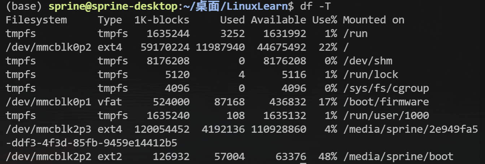

#### 11.2 伪文件系统

除了前面介绍的专门用于存储设备记录文件的文件系统外，Linux 内核还提供了 procfs、sysfs 和  devfs 等伪文件系统。

伪文件系统存在于内存中，通常不占用硬盘空间，它以文件的形式，向用户提供了访问系统内核  数据的接口。用户和应用程序可以通过访问这些数据接口，得到系统的信息，而且内核允许用户  修改内核的某些参数。

##### 11.2.1 procfs 文件系统

procfs 是 process filesystem 的缩写，所以它也被称为进程文件系统，procfs 通常会自动挂载在根目录下的/proc 文件夹。procfs 为用户提供内核状态和进程信息的接口，功能相当于 Windows 的任务管理器。

使用如下命令可以查看 proc 文件系统的内容：

- 查看 CPU 信息

    ```bash
    cat /proc/cpuinfo
    ```

    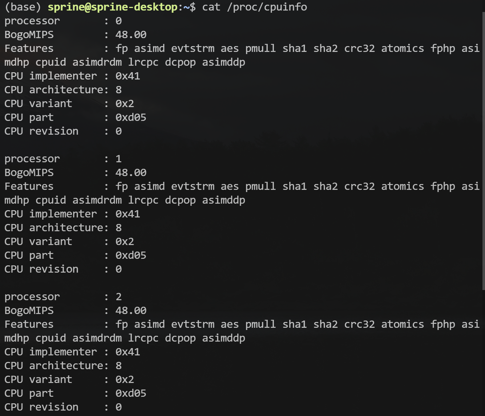

- 查看 proc 目录

    ```bash
    ls /proc
    ```

    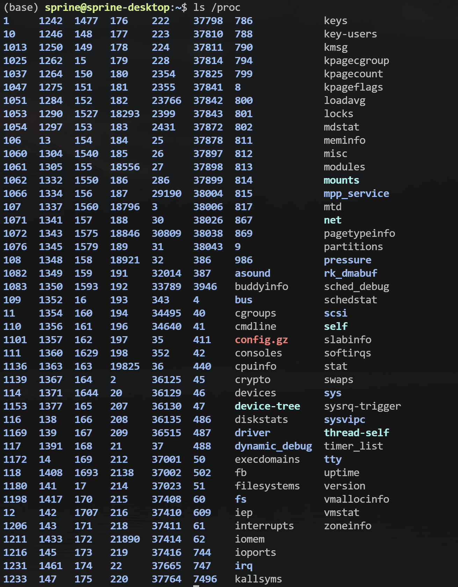

`ls /proc`  包含了非常多以数字命名的目录，这些数字就是进程的 PID 号，其它文件或目录的一些说明见下表：

`/proc` 各个文件的作用：

|   文件名    | 作用                                                         |
| :---------: | ------------------------------------------------------------ |
|    pid*     | * 表示的是进程的 PID 号，系统中当前运行的每一个进程都有对应的一个目录，用于记录进程所有相关信息。对于操作系统来说，一个应用程序就是一个进程。 |
|    self     | 该文件是一个软链接，指向了当前进程的目录，通过访问 `/proc/self/` 目录来获取当前进程的信息，就不用每次都获取 pid。 |
| threadself  | 该文件也是一个软链接，指向了当前线程，访问该文件，等价于访问 “ 当前进程 `pid/task/` 当前线程 `tid` ” 的内容。一个进程，可以包含多个线程，但至少需要一个进程，这些线程共同支撑进程的运行。 |
|   version   | 记录了当前运行的内核版本，通常可以使用命令 `uname –r` 。     |
|   cpuinfo   | 记录系统中 CPU 的提供商和相关配置信息。                      |
|   modules   | 记录了目前系统加载的模块信息。                               |
|   meminfo   | 记录系统中内存的使用情况，`free` 命令会访问该文件，来获取系统内存的空闲和已使用的数量。 |
| filesystems | 记录内核支持的文件系统类型，通常 `mount` 一个设备时，如果没有指定文件系统并且它无法确定文件系统类型时，mount 会尝试包含在该文件中的文件系统，除了那些标有 `nodev` 的文件系统。 |

使用如下命令来查看当前 `bash` 进程的 PID 号：

```bash
ps
```

每个人的计算机运行运行状况不一样，所以得到的进程号也是不一样，如下图所示，当前得到  `bash` 进程的 pid 是 `38006` :

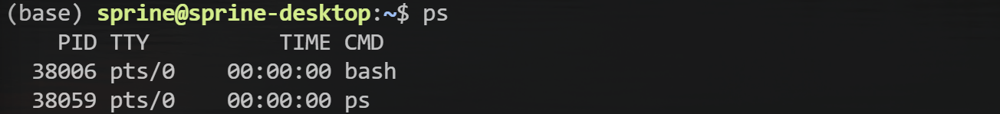

根据这个 pid 号，查看 `proc/38006` 目录的内容，它记录了进程运行过程的相关信息：

```bash
ls /proc/38006
```

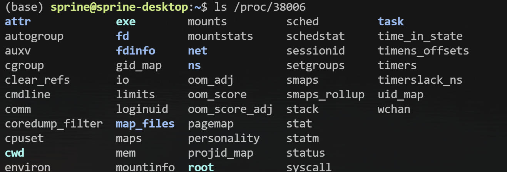

该目录下的一些文件夹和文件的意义如下表：

|  文件名   | 文件内容                                                     |
| :-------: | ------------------------------------------------------------ |
|  cmdline  | 只读文件，记录了该进程的命令行信息，如命令以及命令参数       |
|   comm    | 记录了进程的名字                                             |
|  environ  | 进程使用的环境变量                                           |
|    exe    | 软连接文件，记录命令存放的绝对路径                           |
|    fd     | 记录进程打开文件的情况，以文件描述符作为目录名               |
|  fdinfo   | 记录进程打开文件的相关信息，包含访问权限以及挂载点，由其文件描述符命名 |
|    io     | 记录进程读取和写入情况                                       |
| map_files | 记录了内存中文件的映射情况，以对应内存区域起始和结束地址命名 |
|   maps    | 记录当前映射的内存区域，其访问权限以及文件路径               |
|   stack   | 记录当前进程的内核调用栈信息                                 |
|  status   | 记录进程的状态信息                                           |
|  syscall  | 显示当前进程正在执行的系统调用，第一列记录了系统调用号       |
|   task    | 记录了该进程的线程信息                                       |
|   wcham   | 记录当前进程处于睡眠状态，内核调用的相关函数                 |

如果是文件，可以直接使用 `cat` 命令输出对应文件的内容可查看，如查看进程名：

```bash
cat /proc/38006/comm
```


前面的 `ps` 命令也是通过 proc 文件系统获取到相关进程信息的。

##### 11.2.2 sysfs 文件系统

Linux 内核在 2.6 版本中引入了 sysfs 文件系统，sysfs 通常会自动挂载在根目录下的 `sys` 文件夹。

sys 目录下的文件/文件夹向用户提供了一些关于设备、内核模块、文件系统以及其他内核组件的  信息，如子目录 `block` 中存放了所有的块设备，而 `bus` 中存放了系统中所有的总线类型，有 `i2c`、  `usb`、`sdi o`、`pci` 等。

下图中的虚线表示软连接，可以看到所有跟设备有关的文件或文件夹都链接 到了 `device` 目录下，类似于将一个大类，根据某个特征分为了无数个种类，这样使得 `/sys` 文件夹的结构层次清晰明了：


`/sys` 各个文件的作用：

| 文件名  | 作用                                                         |
| :-----: | ------------------------------------------------------------ |
|  block  | 记录所有在系统中注册的块设备，这些文件都是符号链接，都指向了`/sys/devices` 目录。 |
|   bus   | 该目录包含了系统中所有的总线类型，每个文件夹都是以每个总线的类型来进行命名。 |
|  class  | 包含了所有在系统中注册的设备类型，如块设备、声卡、网卡等。文件夹下的文件同样也是一些链接文件，指向了 `/sys/devices` 目录。 |
| devices | 包含了系统中所有的设备，到跟设备有关的文件/文件夹，最终都会指向该文件夹。 |
| module  | 该目录记录了系统加载的所有内核模块，每个文件夹名以模块命名。 |
|   fs    | 包含了系统中注册文件系统。                                   |

概括来说，sysfs 文件系统是内核加载驱动时，根据系统上的设备和总线构成导出的分级目录，它是系统上设备的直观反应，每个设备在 sysfs 下都有唯一的对应目录，用户可以通过具体设备目  录下的文件访问设备。

##### 11.2.3 devfs 文件系统

在 Linux 2.6 内核之前一直使用的是 devfs 文件系统管理设备，它通常挂载于 `/dev` 目录下。

devfs 中的每个文件都对应一个设备，用户也可以通过 `/dev` 目录下的文件访问硬件。在 sysfs 出现之前，devfs 是在制作根文件系统的时候就已经固定的，这不太方便使用，而当代的 devfs 通常会在系统运行时使用名为 `udev` 的工具根据 sysfs 目录生成 devfs 目录。在后面学习制作根文件系统时，就会接触到静态 devfs 以及使用 `udev` 动态生成 devfs 的选项。

#### 11.3 虚拟文件系统

除了前面提到的存储器文件系统 FAT32、ext4,伪文件系统/proc、/sys、/dev 外，还有内存文件系统  ramfs，网络文件系统 nfs 等等，不同的文件系统标准，需要使用不同的程序逻辑实现访问，对外提供的访问接口可能也稍有差异。但是我们在编写应用程序时，大都可以通过类似 `fopen`、`fread`、  `fwrite` 等 C 标准库函数访问文件，这都是虚拟文件系统的功劳。

Linux 内核包含了文件管理子系统组件，它主要实现了虚拟文件系统 ( Virtual File System , VFS)，虚拟文件系统屏蔽了各种硬件上的差异以及具体实现的细节，为所有的硬件设备提供统一的接口，从而达到设备无关性的目的，同时文件管理系统还为应用层提供统一的 API 接口。

在 Linux 下，一个与文件操作相关的应用程序结构如下图所示：

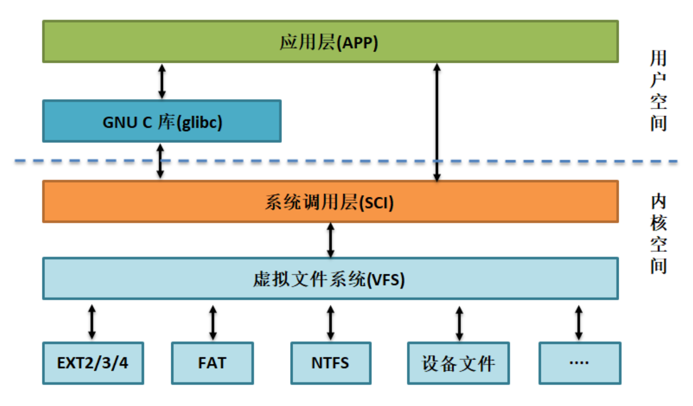

上图解构如下：

- 应用层指用户编写的程序，如我们的 `hello.c`。

- GNU C 库 ( glibc ) 即 C 语言标准库，例如在编译器章节介绍的 [`libc.so.6`](#8.1.3 glibc 库) 文件，它包含了

    `printf`、`malloc`，以及本章使用的 `fopen`、`fread`、`fwrite` 等文件操作函数。

- 用户程序和 glibc 库都是属于用户空间的，本质都是用户程序。
- 应用层的程序和 glibc 可能会调用到 “ 系统调用层 ( SCI ) ” 的函数，这些函数是 Linux 内核  对外提供的函数接口，用户通过这些函数向系统申请操作。例如 C  库的 `printf` 函数使用了  系统的 `vsprintf` 和 `write` 函数，C 库的 `fopen`、`fread`、`fwrite` 分别调用了系统的 `open`、`read`、`write` 函数，具体可以阅读 glibc 的源码了解。
- 由于文件系统种类非常多，跟文件操作相关的 `open`、`read`、`write` 等函数经过虚拟文件系统层，再访问具体的文件系统。

总的来说，为了使不同的文件系统共存，Linux 内核在用户层与具体文件系统之前增加了虚拟文  件系统中间层，它对复杂的系统进行抽象化，对用户提供了统一的文件操作接口。无论是 ext2/3/4、  FAT32、NTFS 存储的文件，还是 `/proc`、`/sys` 提供的信息还是硬件设备，无论内容是在本地还是网络上，都使用一样的 `open`、`read`、`write` 来访问，使得 “ 一切皆文件 ” 的理念被实现，这也正是软件中间层的魅力。

#### 11.4 Linux 系统调用

从上图可了解到，系统调用 ( System Call ) 是操作系统提供给用户程序调用的一组 “ 特殊 ” 函数  接口 API，文件操作就是其中一种类型。实际上，Linux 提供的系统调用包含以下内容：

- 进程控制：如 `fork`、`clone`、`exit` 、`setpriority` 等创建、中止、设置进程优先级的操作。
- 文件系统控制：如 `open`、`read`、`write` 等对文件的打开、读取、写入操作。
- 系统控制：如 `reboot`、`stime`、`init_module` 等重启、调整系统时间、初始化模块的系统操作。
- 内存管理：如 `mlock`、`mremap` 等内存页上锁重、映射虚拟内存操作。
- 网络管理：如 `sethostname`、`gethostname` 设置或获取本主机名操作。
- socket 控制：如 `socket`、`bind`、`send` 等进行 TCP、UDP 的网络通讯操作。
- 用户管理：如 `setuid`、`getuid` 等设置或获取用户 ID 的操作。
- 进程间通信：包含信号量、管道、共享内存等操作。

从逻辑上来说，系统调用可被看成是一个 Linux 内核与用户空间程序交互的中间人，它把用户进  程的请求传达给内核，待内核把请求处理完毕后再将处理结果送回给用户空间。它的存在就是为  了对用户空间与内核空间进行隔离，要求用户通过给定的方式访问系统资源，从而达到保护系统  的目的。

也就是说，我们心心念念的 Linux 应用程序与硬件驱动程序之间，就是各种各样的系统调用，所  以无论出于何种目的，系统调用是学习 Linux 开发绕不开的话题。

#### 11.5 文件操作（C 标准库）

本小节讲解使用通用的 C 标准库接口访问文件，标准库实际是对系统调用再次进行了封装。使  用 C 标准库编写的代码，能方便地在不同的系统上移植。

例如 Windows 系统打开文件操作的系统 API 为 `OpenFile`，Linux 则为 `open`，C 标准库都把它们封装为 `fopen`，Windows 下的 C 库会通过 `fopen` 调用 `OpenFile` 函数实现操作，而 Linux 下则通过 glibc  调用 `open` 打开文件。用户代码如果使用 `fopen`，那么只要根据不同的系统重新编译程序即可，而不需要修改对应的代码。

##### 11.5.1 常用文件操作（C 标准库）

在开发时，遇到不熟悉的库函数或系统调用，要**善用 man 手册**，而不要老是从网上查找。C 标准库提供的常用文件操作简介如下：

###### 11.5.1.1 fopen 函数

`fopen` 库函数用于打开或创建文件，返回相应的文件流。它的函数原型如下：

```c
#include <stdio.h>
FILE *fopen(const char *pathname, const char *mode);
```

- `pathname` 参数用于指定要打开或创建的文件名

- `mode` 参数用于指定文件的打开方式，注意该参数是一个字符串，输入时需要带双引号：
    - `"r"` ：以只读方式打开，文件指针位于文件的开头。
    - `“r+”` ：以读和写的方式打开，文件指针位于文件的开头。
    - `“w”` ：以写的方式打开，不管原文件是否有内容都把原内容清空掉，文件指针位于文件的开头。
    - `“w+”` ：同上，不过当文件不存在时，前面的 `“w”` 模式会返回错误，而此处的 `“w+”` 则会创建新文件。
    - `“a”` ：以追加内容的方式打开，若文件不存在会创建新文件，文件指针位于文件的末尾。与  `“w+”` 的区别是它不会清空原文件的内容而是追加。
    - `“a+”` ：以读和追加的方式打开，其它同上。
    - `fopen` 的返回值是 FILE 类型的文件文件流，当它的值不为 NULL 时表示正常，后续的 `fread`、 `fwrite` 等函数可通过文件流访问对应的文件。

###### 11.5.1.2 fread 函数

`fread` 库函数用于从文件流中读取数据。它的函数原型如下：

```c
#include <stdio.h>
size_t fread(void *ptr, size_t size, size_t nmemb, FILE *stream);
```

`stream` 是使用 `fopen` 打开的文件流，`fread` 通过它指定要访问的文件，它从该文件中读取 `nmemb` 项数据，每项的大小为 `size`，读取到的数据会被存储在 `ptr` 指向的数组中。`fread` 的返回值为成功读取的项数 ( 项的单位为 `size` ) 。

###### 11.5.1.3 fwrite 函数

`fwrite` 库函数用于把数据写入到文件流。它的函数原型如下：

```c
#include <stdio.h>
size_t fwrite(void *ptr, size_t size, size_t nmemb, FILE *stream);
```

 它的操作与 `fread` 相反，把 `ptr` 数组中的内容写入到 `stream` 文件流，写入的项数为 `nmemb`，每项大小为 `size`，返回值为成功写入的项数 ( 项的单位为 `size` ) 。

###### 11.5.1.4 fclose 函数

`fclose` 库函数用于关闭指定的文件流，关闭时它会把尚未写到文件的内容都写出。因为标准库会对数据进行缓冲，所以需要使用 `fclose` 来确保数据被写出。它的函数原型如下：

```c
#include <unistd.h>
int close(int fd);
```

###### 11.5.1.5 fflush 函数

`fflush` 函数用于把尚未写到文件的内容立即写出。常用于确保前面操作的数据被写入到磁盘上。  `fclose` 函数本身也包含了 `fflush` 的操作。`fflush` 的函数原型如下：

```c
#include <stdio.h>
int fflush(FILE *stream);
```

###### 11.5.1.6 fseek 函数

`fseek` 函数用于设置下一次读写函数操作的位置。它的函数原型如下：

```c
#include <stdio.h>
int fseek(FILE *stream, long offset, int whence);
```

其中的 `offset` 参数用于指定位置，`whence` 参数则定义了 `offset` 的意义，`whence` 的可取值如下：

- SEEK_SET：`offset` 是一个绝对位置。
- SEEK_END：`offset` 是以文件尾为参考点的相对位置。

- SEEK_CUR：`offset` 是以当前位置为参考点的相对位置。

##### 11.5.2 实验代码分析

```c
// path: base_linux/file_io/stdio/stdio.c
#include <stdio.h>
#include <string.h>

// The string to be written
const char buf[] = "filesystem_test: Hello World!\n";
//　File Descriptors
FILE *fp;
char str[100];

int main(void)
{
    // Create a file
    fp = fopen("filesystem_test.txt", "w+");
    // Return the file pointer normally
    // Exception returns NULL
    if (NULL == fp){
        printf("Fail to Open File\n");
        return 0;
    }
    // Write the contents of buf to a file
    // Write 1 byte at a time, the total length is given by strlen
    fwrite(buf, 1, strlen(buf), fp);
    
    // Writing to 'SprInec'
    // Write 1 byte at a time, the total length is given by strlen
    fwrite("SprInec\n", 1, strlen("SprInec\n"), fp);
    
    // Write the buffer data to the file immediately
    fflush(fp);
    
    // At this point, the file pointer is at the end of the file.
    // Use the `fseek` function to return the file pointer to the
    // beginning of the file.
    fseek(fp, 0, SEEK_SET);
    
    // Read the contents from the file into `str`
    // Read 100 bytes each time, read 1 time
    fread(str, 100, 1, fp);
    
    printf("File content: \n%s \n", str);
    
    fclose(fp);
    
    return 0;   
}
```

其中的 `fopen` 函数调用时使用了参数 `“w+”`，表示每次都创建新的空文件，且带上读权限打开，函数调用后得到文件描述符 `fp`，在它后面的 `fwrite`、`fread`、`fflush` 等函数都是通过这个 `fp` 文件描述符访问该文件的。

与下一小节中差异最大的就是此处 `fwrite` 和 `fread` 之间的 `fflush` 函数，C 标准库的文件系统带缓冲区，而系统调用的文件操作不带缓冲区，所以没有相应的 `flush` 函数。

##### 11.5.3 Makefile 说明

```makefile
# path: base_linux/file_io/stdio/Makefile
# Defining Variables
TARGET = stdio

# Defining the Compiler
CC = gcc

# Define the path of the header files
CFLAGS = -I .

# Define the header files
DEPS = 

# Define the object file
OBJS = $(TARGET).o

# Define the path of the object files
BUILD_DIR = build

# Target file
$(TARGET): $(OBJS)
        $(CC) -o $@ $^ $(CFLAGS)
# Create a compilation output folder
        @mkdir -p $(BUILD_DIR)
# Move the .o file to the output folder
        @mv *.o $(BUILD_DIR)
# Copy the executable program to the output folder
        @cp $(TARGET) $(BUILD_DIR)

# Generation rules for *.o files
%.o: %.c $(DEPS)
        $(CC) -c -o $@ $< $(CFLAGS)

# Phony target
.PHONY: clean

# make clean: Deleate the compilation results
clean:
# Delete the executable program
        rm -f $(TARGET)
# Delete the output folder
        rm -rf $(BUILD_DIR)
# Delete files created by program
        rm -f filesystem_test.txt 
```

##### 11.5.4 编译及测试

使用 make 编译程序：

```bash
make
```

执行程序：

```bash
./stdio
```

查看创建的文件：

```bash
cat filesystem_test.txt
```

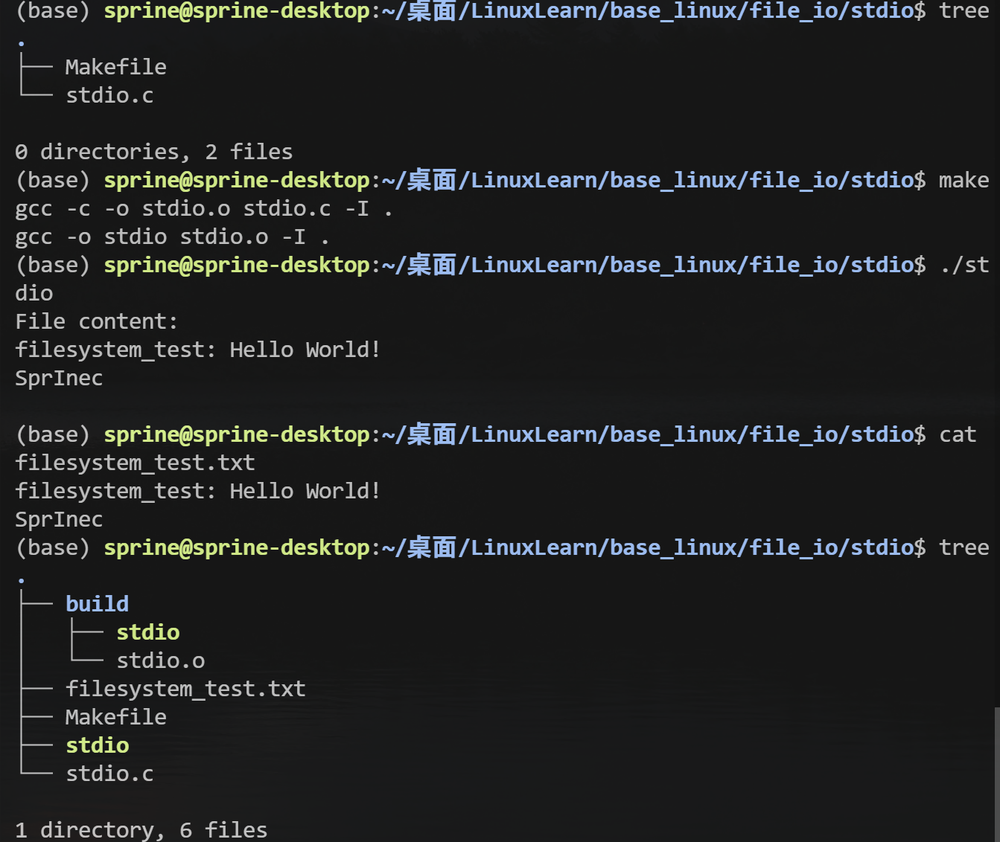

#### 11.6 文件操作（系统调用）

Linux 提供的文件操作系统调用常用的有 `open`、`write`、`read`、`lseek`、`close` 等。

##### 11.6.1 open 函数

```c
#include <sys/types.h>
#include <sys/stat.h>
#include <fcntl.h>
int open(const char *pathname, int flags);
int open(const char *pathname, int flags, mode_t mode);
```

Linux 使用 `open` 函数来打开文件，并返回该文件对应的文件描述符。函数参数的具体说明如下:

- `pathname` ：要打开或创建的文件名

- `flag` ：指定文件的打开方式，具体有以下参数：

    |  标志位  | 含义                                                         |
    | :------: | ------------------------------------------------------------ |
    | O_RDONLY | 以只读的方式打开文件，该参数与 `O_WRONLY` 和 `O_RDWR` 只能三选一 |
    | O_WRONLY | 以只写的方式打开文件                                         |
    |  O_RDWR  | 以读写的方式打开文件                                         |
    | O_CREAT  | 创建一个新文件                                               |
    | O_APPEND | 将数据写入到当前文件的结尾处                                 |
    | O_TRUNC  | 如果 `pathname` 文件存在，则清除文件内容                     |

C 库函数 `fopen` 的 `mode` 参数与系统调用 `open` 的 `flags` 参数有如下表中的等价关系：

| fopen 的 mode 参数 |       open 的 flags 参数        |
| :----------------: | :-----------------------------: |
|         r          |            O_RDONLY             |
|         w          | O_WRONLY \| O_CREAT \| O_TRUNC  |
|         a          | O_WRONLY \| O_CREAT \| O_APPEND |
|         r+         |             O_RDWR              |
|         w+         |   O_RDWR \|O_CREAT \| O_TRUNC   |
|         a+         |  O_RDWR \| O_CREAT \| O_APPEND  |

- `mode` ：当 `open` 函数的 `flag` 值设置为 `O_CREAT` 时，必须使用 `mode` 参数来设置文件与用户相关的权限。`mode` 可用的权限如下表所示，表中各个参数可使用 `|` 来组合:

    |     \      | 标志位  | 含义                                     |
    | :--------: | :-----: | ---------------------------------------- |
    |  当前用户  | S_IRUSR | 用户拥有读权限                           |
    |     \      | S_IWUSR | 用户拥有写权限                           |
    |     \      | S_IXUSR | 用户拥有执行权限                         |
    |     \      | S_IRWXU | 用户拥有读、写、执行权限                 |
    | 当前用户组 | S_IRGRP | 当前用户组的其他用户拥有读权限           |
    |     \      | S_IWGRP | 当前用户组的其他用户拥有写权限           |
    |     \      | S_IXGRP | 当前用户组的其他用户拥有执行权限         |
    |     \      | S_IRWXG | 当前用户组的其他用户拥有读、写、执行权限 |
    |  其他用户  | S_IROTH | 其他用户拥有读权限                       |
    |     \      | S_IWOTH | 其他用户拥有写权限                       |
    |     \      | S_IXOTH | 其他用户拥有执行权限                     |
    |     \      | S_IRWXO | 其他用户拥有读、写、执行权限             |

##### 11.6,2 read 函数

```c
#include <unistd.h>
ssize_t read(int fd, void *buf, size_t count);
```

`read` 函数用于从文件中读取若干个字节的数据，保存到数据缓冲区 `buf` 中，并返回实际读取的字节数,具体函数参数如下：

- `fd` ：文件对应的文件描述符，可以通过 `fopen` 函数获得。另外，当一个程序运行时，Linux  默认有 0、1、2 这三个已经打开的文件描述符，分别对应了标准输入、标准输出、标准错误输出，即可以直接访问这三种文件描述符
- `buf` ：指向数据缓冲区的指针
- `count` ：读取多少个字节的数据

##### 11.6.3 write 函数

```c
#include <unistd.h>
ssize_t write(int fd, const void *buf, size_t count);
```

`write` 函数用于往文件写入内容，并返回实际写入的字节长度，具体函数参数如下：

- `fd` ：文件对应的文件描述符，可以通过 `fopen` 函数获得
- `buf` ：指向数据缓冲区的指针
- `count` ：往文件中写入多少个字节

##### 11.6.4 close 函数

```c
int close(int fd);
```

当我们完成对文件的操作之后，想要关闭该文件，可以调用 `close` 函数，来关闭该 `fd` 文件描述符对应的文件。

##### 11.6.5 lseek 函数

`lseek` 函数可以用与设置文件指针的位置，并返回文件指针相对于文件头的位置。其函数原型如下：

```c
off_t lseek(int fd, off_t offset, int whence);
```

它的用法与 `flseek` 一样，其中的 `offset` 参数用于指定位置，`whence` 参数则定义了 `offset` 的意义，  `whence` 的可取值如下：

- SEEK_SET：`offset` 是一个绝对位置。
- SEEK_END：`offset` 是以文件尾为参考点的相对位置。
- SEEK_CUR：`offset` 是以当前位置为参考点的相对位置。

#### 11.7 实验代码分析（系统调用）

```c
// path: base_linux/file_io/systemcall/systemcall.c
#include <sys/stat.h>
#include <unistd.h>
#include <fcntl.h>
#include <stdio.h>
#include <string.h>

// File Descriptors
int fd;
char str[100];

int main(void)
{
    // Create a file
    fd = open("testscript.sh", O_RDWR|O_CREAT|O_TRUNC, S_IRWXU);
    // The file descriptor `fd` is a non-negative integer
    if (fd < 0){
        printf("Fail to Open File\n");
        return 0;
    }
    
    // Write string `pwd`
    write(fd, "pwd\n", strlen("pwd\n"));
    
    // Write string `ls`
    write(fd, "ls\n", strlen("ls\n"));
    
    // At this point, the file pointer is at the end of the file.
    // Use the `lseek` function to return the file pointer to the
    // beginning of the file.
    lseek(fd, 0, SEEK_SET);
    
    // Read 100 byte from file into str, this function returns the
    // number of bytes actually read
    read(fd, str, 100);
    
    printf("File content:\n%s \n", str);
    
    close(fd);
    
    return 0;
}
```

##### 11.7.1 执行流程

本实验与 C 库文件操作类似，也是创建文件、写入内容然后读出，不过此处使用的都是系统调用函数如 `open`、`write`、`lseek`、`read`、`close`，具体说明如下：

- 代码中先调用了 `open` 函数以可读写的方式打开一个文本文件，并且 `O_CREAT` 指定如果文  件不存在，则创建一个新的文件，文件的权限为 `S_IRWXU`，即当前用户可读可写可执行，当前用户组和其他用户没有任何权限。
- `open` 与 `fopen` 的返回值功能类似，都是文件描述符，不过 `open` 使用非负整数来表示正常，失败时返回 `-1`，而 `fopen` 失败时返回 `NULL`。
- 创建文件后调用 `write` 函数写入了 `”pwd\n“`、`“ls\n”` 这样的字符串，实际上就是简单的 Shell  命令。
- 使用 `read` 函数读取内容前，先调用 `lseek` 函数重置了文件指针至文件开头处读取。与 C 库文件操作的区别 `write` 和 `read` 之间不需要使用 `fflush` 确保缓冲区的内容并写入，因为系统调用的文件操作是没有缓冲区的。
- 最后关闭文件,释放文件描述符。

##### 11.7.2 头文件目录

在 Linux 中，大部分的头文件在系统的 `/usr/include` 目录下可以找到，它是系统自带的 GCC 编译器默认的头文件目录，如下图所示，如果把该目录下的 `stdio.h` 文件删除掉或更改名字 ( 想尝试请备份 ) ，那么使用 GCC 编译 `hello world` 的程序会因为找不到 `stdio.h` 文件而报错。

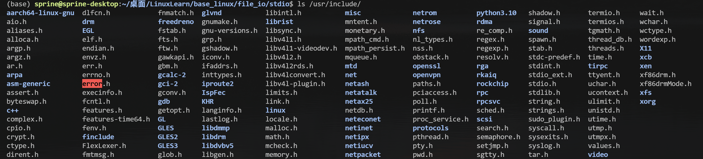

代码中一些头文件前包含了某个目录，比如 `sys/stat.h`，这些头文件可以在编译器文件夹中的目录下找到。我们通常可以使用 `locate` 命令来搜索，如：

安装 `locate` 工具：

```bash
sudo apt install locate
```

更新数据：

```bash
sudo updatedb
```

使用 `locate` 查找头文件路径：

```bash
locate sys/stat.h
```

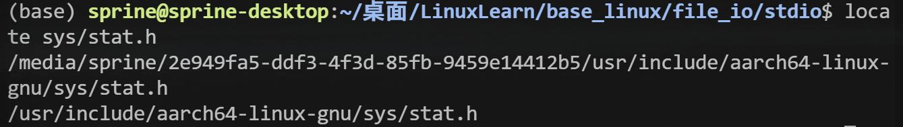

- `/media/sprine/2e949fa5-ddf3-4f3d-85fb-9459e14412b5/usr/include/aarch64-linux-gnu/sys/stat.h  `，该开发板自带 128G 的 emmc，出厂内置系统，该路径为 emmc 内置系统路径。
- `/usr/include/aarch64-linux-gnu/sys/stat.h `，该路径为本开发板目前使用的 64G tf卡内置系统路径。

##### 11.7.3 常用头文件

我们常常会用到以下头文件，此处进行简单说明，若想查看具体的头文件内容,  使用 `locate` 命令找到该文件目录后打开即可：

- `stdio.h` ：C 标准输入与输出 ( standard input & output ) 头文件，我们经常使用的打印  函数 `printf` 函数就位于该头文件中。
- `stdlib.h` ：C 标准库 ( standard library ) 头文件，该文件包含了常用的 `malloc` 函数、`free`  函数。
- `sys/stat.h` ：包含了关于文件权限定义，如 `S_IRWXU`、`S_IWUSR`，以及函数 `fstat` 用于  查询文件状态。涉及系统调用文件相关的操作，通常都需要用到 `sys/stat.h` 文件。
- `unistd.h` ：UNIX C 标准库头文件，unix，linux 系列的操作系统相关的 C 库，定义了  unix 类系统 POSIX 标准的符号常量头文件，比如 Linux 标准的输入文件描述符 ( STDIN ) ，标准输出文件描述符 ( STDOUT ) ，还有 `read`、`write` 等系统调用的声明。
- `fcntl.h` ：unix 标准中通用的头文件，其中包含的相关函数有 `open`，`fcntl`，`close` 等操作。
- `sys/types.h` ：包含了 Unix/Linux 系统的数据类型的头文件，常用的有 `size_t`，`time_t`，  `pid_t` 等类型。

#### 11.8 编译及测试（系统调用）

本实验使用的 Makefile 与 [C 标准库实验的 Makefile](#11.5.3 Makefile 说明) 几乎一模一样：

```makefile
# path: base_linex/file_io/systemcall/Makefile
# Defining Variables
TARGET = systemcall

# Defining the Compiler
CC = gcc

# Define the path of the header files
CFLAGS = -I .

# Define the header files
DEPS = 

# Define the object file
OBJS = $(TARGET).o

# Define the path of the object files
BUILD_DIR = build

# Target file
$(TARGET): $(OBJS)
        $(CC) -o $@ $^ $(CFLAGS)
# Create a compilation output folder
        @mkdir -p $(BUILD_DIR)
# Move the .o file to the output folder
        @mv *.o $(BUILD_DIR)
# Copy the executable program to the output folder
        @cp $(TARGET) $(BUILD_DIR)

# Generation rules for *.o files
%.o: %.c $(DEPS)
        $(CC) -c -o $@ $< $(CFLAGS)

# Phony target
.PHONY: clean

# make clean: Deleate the compilation results
clean:
# Delete the executable program
        rm -f $(TARGET)
# Delete the output folder
        rm -rf $(BUILD_DIR)
# Delete files created by program
        rm -f testscript.sh 
```

在终端输入以下命令进行编译与运行：

```bash
make
tree
./systemcall
ls
cat testscript.sh
./testscript.sh
```

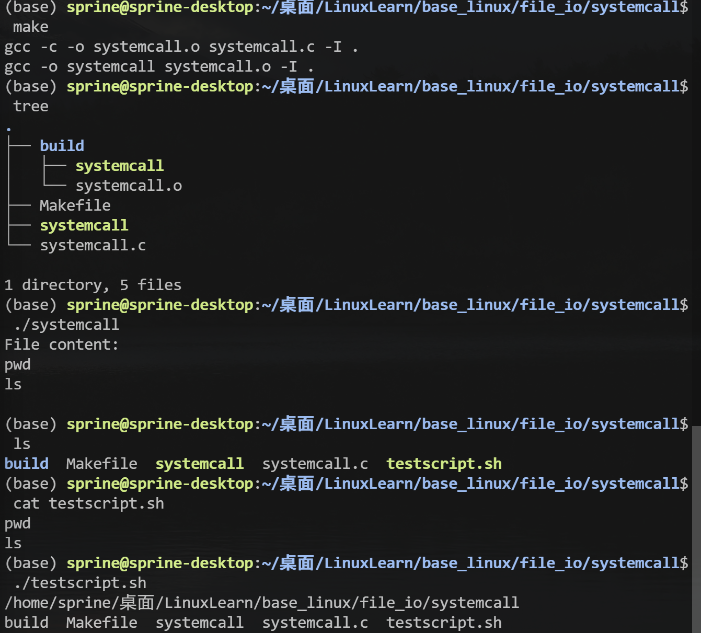

从上图可看到，`systemcall` 程序执行后，它创建的 `testscript.sh` 文件带有可执行权限，运行 `./testscript.sh` 可执行该脚本。

#### 11.9 如何抉择

既然 C 标准库和系统调用都能够操作文件，那么应该选择哪种操作呢？考虑的因素如下：

- 使用系统调用会影响系统的性能。执行系统调用时，Linux 需要从用户态切换至内核态，执  行完毕再返回用户代码，所以减少系统调用能减少这方面的开销。如库函数写入数据的文件操作 `fwrite` 最后也是执行了 `write` 系统调用，**如果是写少量数据的话，直接执行 `write` 可能会更高效，但如果是频繁的写入操作，由于 `fwrite` 的缓冲区可以减少调用 `write` 的次数,  这种情况下使用 `fwrite` 能更节省时间。**
- 硬件本身会限制系统调用本身每次读写数据块的大小。如针对某种存储设备的 `write` 函数每次可能必须写 4kB 的数据，那么当要写入的实际数据小于 4kB 时，`write` 也只能按 4kB 写入，浪费了部分空间，而带缓冲区的 `fwrite` 函数面对这种情况，会尽量在满足数据长度要求时才执行系统调用，减少空间开销。
- 也正是由于库函数带缓冲区，使得我们无法清楚地知道它何时才会真正地把内容写入到硬件上，所以在**需要对硬件进行确定的控制时，我们更倾向于执行系统调用**。

### 12. 调试工具

#### 12.1 gdb

经典的调试工具，功能很强大。

注意若要使用 gdb 调试，编译的时候需要增加 `-g` 选项,并用 `-Og` 进行优化。多线程下可以 `attach` 到进程来调试。  在命令行中输入 `gdb` 进入 gdb 命令行模式。 

gdb 具有大量命令调试，这里不能将其一一列举，介绍一些常用的基础命令：

表 12.1 - 1：

|   命令    | 缩写 |      用法       | 作用                                                         |
| :-------: | :--: | :-------------: | ------------------------------------------------------------ |
|   start   |      |      start      | 开始执行程序，在 `main` 函数的第一条语句前面停下来           |
|   file    |      |    file xxx     | 打开调试的文件                                               |
|    run    |  r   |       ru        | 运行程序（ 第一条语句开始运行 ）                             |
|   break   |  b   | 见下表 12.1 - 2 | 设置断点                                                     |
| continue  |  c   |        c        | 继续程序的运行，直到遇到下一个断点                           |
|   list    |  l   | 见下表 12.1 - 3 | 显示多行源代码                                               |
|   step    |  s   |        s        | 执行下一条语句，如果该语句为函数调用，则进入函数执行其中的第一条语句 |
|   next    |  n   |        n        | 执行下一条语句，如果该语句为函数调用，不会进入函数内部执行 ( 即不会一步步地调试函数内部语句 ) |
|  display  | disp |     disp n      | 跟踪查看某个变量，每次停下来都显示它的值                     |
|   print   |  p   |     p / p n     | 打印内部变量值                                               |
|   watch   |      |      watch      | 监视变量值的变化                                             |
| backtrace |  bt  |       bt        | 查看函数调用信息 (堆栈)                                      |
|   frame   |  f   |        f        | 查看栈帧                                                     |
|   quit    |  q   |        q        | 退出 GDB 环境                                                |
|   kill    |  k   |        k        | 终止正在调试的程序                                           |
| 设置变量  |      |   set var = x   | 设置变量的值                                                 |
|  return   |      |    return x     | 结束当前调用函数并返回指定值，到上一层函数调用处停止程序执行 |
|  finish   |  fi  |       fi        | 结束当前正在执行的函数，并在跳出函数后暂停程序的执行         |
|   jump    |  j   |       j x       | 结束当前调用函数井返回指定值，到上一层函数调用处停止程序执行 |

表 12.1 - 2：

|         命令         | 功能                                                     |
| :------------------: | -------------------------------------------------------- |
|       break n        | 设置第几行作为断点（ 搭配 `list` 使用 ）                 |
|   info breakpoints   | 列出所加的断点                                           |
| delete breakpoints n | 删除第 n 个断点 ( n 为 `info breakpoints` 获得的断点号 ) |
|   disable/enable n   | 表示使得编号为 n 的断点暂时失效或有效                    |

表 12.1 - 3：

|       命令        | 功能                                                         |
| :---------------: | ------------------------------------------------------------ |
|       list        | 默认情况下， 一次显示 10 行，第一次使用时，从代码其实位置显示 |
|      list n       | 显示以第 n 行为中心的 10 行代码                              |
| list functionname | 显示以 `functionname` 的函数为中心的 10 行代码               |
|      list -       | 显示刚才打印过的源代码之前的代码                             |

#### 12.2 strace

strace 是一个用来跟踪系统调用的简易工具。

它最简单的用途就是跟踪一个程序整个生命周期里所有的系统调用，并把调用参数和返回值以  文本的方式输出。Strace 还可以跟踪发给进程的信号，支持 `attach` 正在运行的进程 `strace -p <pid>`。

当多线程环境下，需要跟踪某个线程的系统调用，可以先 `ps -efL | grep <Process Name>`  查找出该进程下的线程，然后调用 `strace –p <pid>` 进行分析。

安装 strace 工具：

```bash
sudo apt install strace
```

下面是使用 strace 跟踪 [8.2 hello world](#8.2.2 编写代码文件) 程序的演示：

```bash
strace ./hello
```


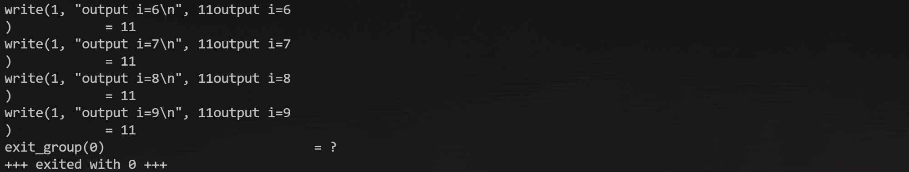

以下输出内容为配置程序的运行环境，以及调用相应的库：

```bash
execve("./hello", ["./hello"], 0xffffdb9e98a0 /* 47 vars */) = 0
brk(NULL)                               = 0xaaab239fb000
...
openat(AT_FDCWD, "/lib/aarch64-linux-gnu/libc.so.6", O_RDONLY|O_CLOEXEC)=3
...
getrandom("\xc0\x64\xf7\x77\xd5\x0a\xb0\x58", 8, GRND_NONBLOCK) = 8
brk(NULL)                               = 0xaaab239fb000
brk(0xaaab23a1c000)                     = 0xaaab23a1c000
```

- `/lib/aarch64-linux-gnu/libc.so.6` 就是我们前面章节所说的 glibc 的库文件，这些配置环境的操作，保护了我们的系统免受程序的干扰。

- 比如，有些软件想改写我们的系统文件或者破坏我们的系统，在这些保护环境下，系统不会允许程序运行超过系统规定的运行空间，即便是程序无意改写系统的文件 ( 超出了运行空间 ) ，系统会阻止它。如果程序进入死循环或崩溃了，系统可以依赖这些保护措施免受干扰并可以直接终止程序的运行。

以下是我们的程序主体部分：

```bash
write(1, "hello, world! This is a C progra"..., 35hello, world! This is a C program.
) = 35
write(1, "output i=0\n", 11output i=0
)            = 11
...
...
...
write(1, "output i=9\n", 11output i=9
)            = 11
exit_group(0)                           = ?
+++ exited with 0 +++
```

代码输出格式有误，可能是多线程导致格式有点问题，正确的格式如下：

```bash
write(1, "hello, world! This is a C program.\n", 35) = 35
hello, world! This is a C program.

write(1, "output i=0\n", 11) = 11
output i=0
```

- 为什么 `write(1, “hello, world! This is a C program.n”, 35)=35` 就可以向屏幕输出文字呢，因为 linux 系统把输出到命令行抽象成文件描述符，操作文件描述符就可以操作该设备。

    查看描述符：

    ```bash
    ls -l /dev/std*
    ```

    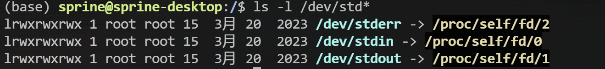

    - `stdin` 标准输入 ​ `fd=0`  从终端设备输入内容
    - `stdout` 标准输出 `fd=1` 从终端设备输出内容
    - `stderr` 标准错误 `fd=2` 从终端设备输出命令的错误消息

    ```bash
    write(1, "output i=0\n", 11) = 11
    output i = 0
    ```

    - `write` ：写入东西
    - `1` ：文件描述符，这里表示标准输出，即向终端输出东西
    - `“output i=0\n”` ：要输出的内容
    - `11` ：输出内容的字节大小，加上空格和换行符刚好 11 个
    - `= 11` ：`write` 函数返回值，表示写入了多少个字节

我们也可以用 `write` 代替 `printf` 试试：

```c
// path: base_linux/hello/hello_sys/hello_sys.c
#include <unistd.h>

int main(void)
{
	write(1, "hello, world! This is a C program.\n", 35);
	write(1, "output i=0\n", 11);
	return 0;
}
```

```makefile
# path: base_linux/hello/hello_sys/Makefile
TARGET = hello_sys
CC = gcc
CFLAGS = -I .
DEPS = 
OBJS = $(TARGET).o
BUILD_DIR = build

$(TARGET): $(OBJS)
        $(CC) -o $@ $^ $(CFLAGS)
        @mkdir -p $(BUILD_DIR)
        @mv *.o $(BUILD_DIR)
        @cp $(TARGET) $(BUILD_DIR)

%.o: %.c $(DEPS)
        $(CC) -c -o $@ $< $(CFLAGS)

.PHONY: clean

clean:
        rm -f $(TARGET)
        rm -rf $(BUILD_DIR)
```

在终端输入命令进行编译与运行：

```bash
make
./hello_sys
tree
```

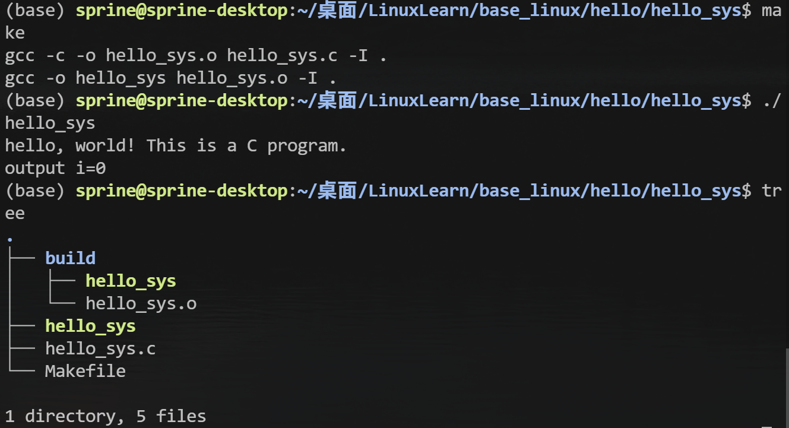

结果与 `printf` 一样。

### 13. GPIO 子系统

本节的代码目录为：`base_linux/gpio/`

LubanCat 4 RK3588S 的 40Pin 引脚对照表如下所示：

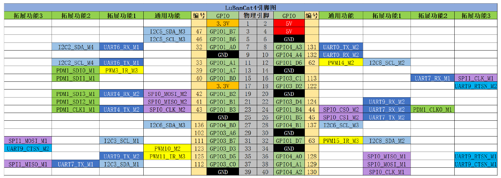

#### 13.1 GPIO 简介

GPIO 是 General Purpose I/O 的缩写，即通用输入输出端口，简单来说就是 MCU/CPU 可控制的引脚，这些引脚通常有多种功能，最基本的是高低电平输入检测和输出，部分引脚还会与主控器的片上外设绑定，如作为串口、I2C、网络、电压检测的通讯引脚。

Linux 提供了GPIO 子系统驱动框架，使用该驱动框架可以把 CPU 的 GPIO 引脚导出到用户空间，用户通过访问 `/sys` 文件系统进行控制，GPIO 子系统支持把引脚用于基本的输入输出功能，其中输入功能还支持中断检测。在 Linux 内核源码的 `Documentation/gpio` 目录可找到关于 GPIO 子系统的说明。

##### 13.1.1 GPIO 设备目录

GPIO 驱动子系统导出到用户空间的目录是 `/sys/class/gpio` 。

可使用以下命令查看：

切换到 root 用户：

```bash
sudo -i
```

导出 GPIO 到用户空间：

```bash
echo 42 > /sys/class/gpio/export
```

查看目录变化，增加了 `gpio42` 目录：

```bash
ls /sys/class/gpio/
```

把 `gpio42` 从用户空间取消导出：

```bash
echo 42 > /sys/class/gpio/unexport
```

查看目录变化， `gpio42` 目录消失了：

```bash
ls /sys/class/gpio/
```

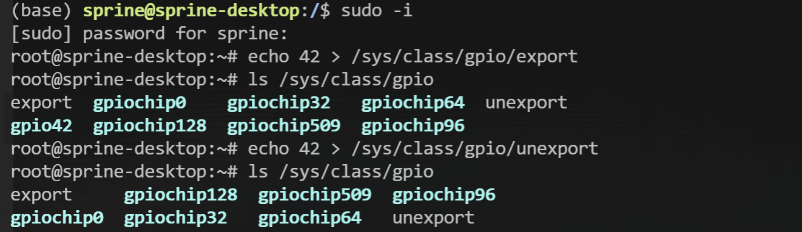

- `export` ：导出GPIO，该文件只能写不能读，用户向该文件写入GPIO 的编号 N 可以向
    内核申请将该编号的 GPIO 导出到用户空间，若内核本身没有把该 GPIO 用于其它功能，那
    么在 `/sys/class/gpio` 目录下会新增一个对应编号的 `gpioN` 目录，如上图一导出了`gpio42`。
- `unexport` ：`export` 的相反操作，取消导出GPIO，该文件同样只能写不能读。上图演示
    了往 `unexport` 写入42 后，`gpio42` 目录消失了。

- `gpiochipX` ：该目录是指 GPIO 控制器外设。
- `gpioN` ：通过 `export` 导出的具体 GPIO 引脚的控制目录，如上图中的 `gpio42` 目录下会包含有控制该引脚的相应文件。

##### 13.1.2 GPIO 设备属性

`gpioN` 目录下相关的设备文件，可以使用以下命令查看：

```bash
echo 42 > /sys/class/gpio/export
cd /sys/class/gpio/gpio42

ls -lh
```

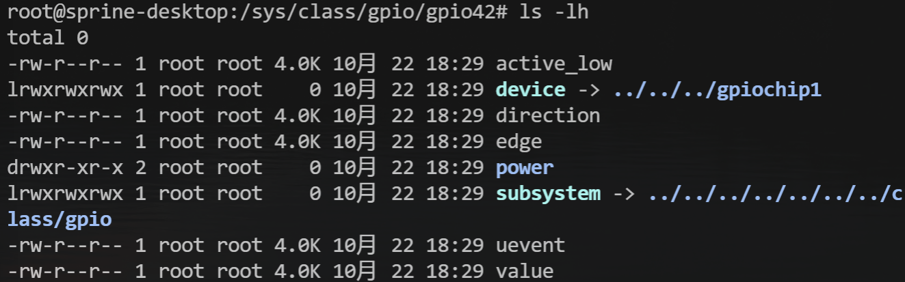

- **`direction`** ：表示GPIO 引脚的方向，它的可取值如下：
    1. `in` ：引脚为输入模式
    2. `out` ：引脚为输出模式，且默认输出电平为低
    3. `low` ：引脚为输出模式，且默认输出电平为低
    4. `high` ：引脚为输出模式，且默认输出电平为高

- **`value`** ：表示 GPIO 的电平，1 表示高电平，0 表示低电平。GPIO 被配置为输出模式，那么修改该文件的内容可以改变引脚的电平。
- **`edge`** ：用于配置 GPIO 的中断触发方式，当 GPIO 被配置为中断时，可以通过系统的 `poll` 函数监听。`edge` 文件可取如下的属性值：
    1. `none` ：没有使用中断模式
    2. `rising` ：表示引脚为中断输入模式，上升沿触发
    3. `falling` ：表示引脚为中断输入模式，下降沿触发
    4. `both` ：表示引脚为中断输入模式，边沿触发

如果该引脚会被设备占用，它的功能在用户空间是无法再被修改的，而使用 GPIO 子系统的设备则可以在用户空间灵活配置作为输入、输出或中断模式。

#### 13.2 引脚编号转换

Rockchip Pin 的 ID 按照控制器 ( bank ) + 端口 ( port ) + 索引序号 ( pin ) 组成。

- 控制器和GPIO 控制器数量一致
- 端口固定 A、B、C 和 D，每个端口仅有 8 个索引号，( A = 0, B = 1, C = 2, D = 3 )
- 索引序号固定 0、1、2、3、4、5、6、7

作为GPIO 功能时，端口行为由 GPIO 控制器寄存器配置。如 `gpio0_xx`，`gpio1_xx`，`gpio2_xx`，`gpio3_xx`，`gpio4_xx` 。

`GPIO1_A4` 表达的意思为第 1 组控制器，端口号为A，索引号为4。该引脚号的计算公式为 
$$
32 * 1 + 0 * 8 + 4 = 36
$$

> [!CAUTION]
>
> 并不是所有的引脚都能通过 `export` 文件导出到用户空间的，在使用的引脚是不能被导出的
>
> 

#### 13.3 GPIO sysfs 接口控制 gpio

##### 13.3.1 命令行

在板卡上执行以下命令，执行时需确保当前用户为 root 用户：

```bash
# Enable pin
echo 42 > /sys/class/gpio/export

# Set the pin to input mode
echo in > /sys/class/gpio/gpio42/direction
# Read the value of the pin
cat /sys/class/gpio/gpio42/value

#　Set the pin to output mode
echo out > /sys/class/gpio/gpio42/direction
# Set the pin to low level
echo 0 > /sys/class/gpio/gpio42/value
# Set the pin to high level
echo 1 > /sys/class/gpio/gpio42/value

# Reset the pin
echo 42 > /sys/class/gpio/unexport
```

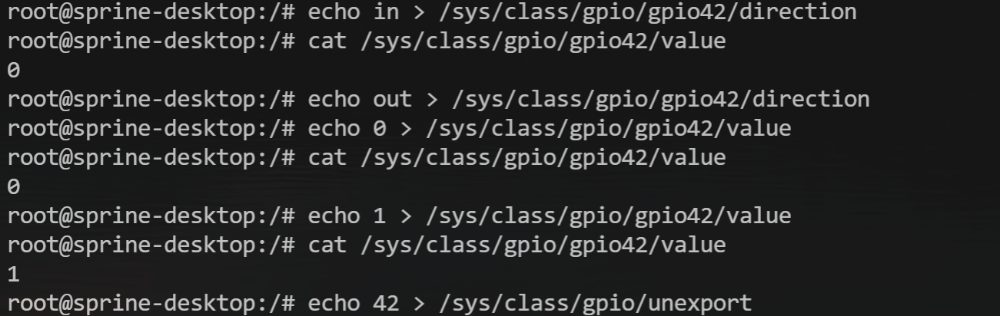

- 把 GPIO 的编号写入到 `export` 文件，导出 GPIO 设备。

- 修改 GPIO 设备属性 `direction` 文件值为 `out`，把 GPIO 设置为输出方向。

- 修改 GPIO 设备属性文件 `value` 的值为 1 或 0，控制 GPIO 高电平或低电平。

##### 13.3.2 程序编写

退出 root 账户：

```bash
exit
```

编写以下代码：

```c
// path: base_linux/gpio/gpio_sys/gpio_sys.c
#include <string.h>
#include <sys/stat.h>
#include <fcntl.h>
#include <unistd.h>
#include <stdio.h>

#define GPIO_INDEX "42"

static char gpio_path[75];

int gpio_init(char *name)
{
    int fd;
    // index config

    sprintf(gpio_path, "/sys/class/gpio/gpio%s", name);
    if (access("gpio_path", F_OK))
    {
        fd = open("/sys/class/gpio/export", O_WRONLY);
        if (fd < 0){
            return 1;
        }

        write(fd, name, strlen(name));
        close(fd);

        // direction config
        sprintf(gpio_path, "/sys/class/gpio/gpio%s/direction", name);
        fd = open(gpio_path, O_WRONLY);
        if (fd < 0){
            return 2;
        }

        write(fd, "out", strlen("out"));
        close(fd);
    }

    return 0;
}

int gpio_deinit(char *name)
{
    int fd;
    fd = open("/sys/class/gpio/unexport", O_WRONLY);
    if (fd < 0){
        return 1;
    }

    write(fd, name, strlen(name));
    close(fd);

    return 0;
}

int gpio_set(char *name, int value)
{
    int fd;
    sprintf(gpio_path, "/sys/class/gpio/gpio%s/value", name);
    if (fd < 0){
        printf("open %s wrong\n", gpio_path);
        return -1;
    }

    if (1 == value)
    {
        if (2 != write(fd, "1", sizeof("1"))){
            printf("wrong set\n");
        }
    }
    else if (0 == value)
    {
        if (2 != write(fd, "0", sizeof("0"))){
            printf("wrong set\n");
        }
    }
    close(fd);

    return 0;
}

int main(int argc, char *argv[])
{
    char buf[10];
    int res;

    // Verify the parameters
    if (2 != argc){
        printf("usage: %s <PinNum>\n", argv[0]);
        return -1;
    }

    res = gpio_init(argv[1]);
    if (res){
        printf("gpio init error, code = %d\n", res);
        return 0;
    }

    while(1){
        printf("Please input the value: 0--low 1--high q--exit\n");
        scanf("%10s", buf);

        switch (buf[0])
        {
        case '0':
            gpio_set(argv[1], 0);
            break;

        case '1':
            gpio_set(argv[1], 1);
            break;

        case 'q':
            gpio_deinit(argv[1]);
            printf("Exit\n");
            return 0;

        default:
            break;
        }
    }

    return 0;
}
```

本代码要特别注意的是 `export` 和 `unexport` 文件是只有写权限的，所以通过 `open` 打开时要使用 `O_WRONLY` 标志以写入方式打开，不能使用 `O_RDWR` 等带读模式的标志。

编写 Makefile 文件：

```makefile
# path: base_linux/gpio/gpio_sys/Makefile
TARGET = gpio_sys
CC = gcc
CFLAGS = -I .
DEPS = 
OBJS = $(TARGET).o
BUILD_DIR = build

$(TARGET): $(OBJS)
	$(CC) -o $@ $^ $(CFLAGS)
	@mkdir -p $(BUILD_DIR)
	@mv *.o $(BUILD_DIR)
	@cp $(TARGET) $(BUILD_DIR)

%.o: %.c $(DEPS)
	$(CC) -c -o $@ $< $(CFLAGS)

.PHONY: clean

clean:
	rm -f $(TARGET)
	rm -rf $(BUILD_DIR)
```

编译并运行程序：

```bash
make
sudo ./gpio_sys 36
```

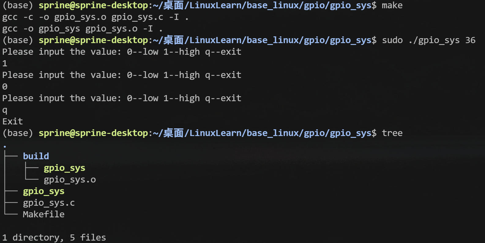

#### 13.4 使用 libgpiod 控制 IO

libgpiod 是一种字符设备接口，GPIO 访问控制是通过操作字符设备文件（ 如 `/dev/gpiodchip0` ）实现的，并通过 libgpiod 提供一些命令工具、c  库以及 python 封装。

想要使用 libgpiod，需要在板卡上安装 libgpiod 库。

```bash
# 安装 libgpiod 库及头文件
sudo apt install libgpiod-dev

# 安装 gpiod 命令行工具
sudo apt install gpiod
```

##### 13.4.1 命令行控制

常用的命令行如下，可使用 `-h` 查看命令相对应的使用说明（以 GPIO1_A4 为例）：

|    命令    | 作用                       |      使用举例      | 说明                                |
| :--------: | -------------------------- | :----------------: | ----------------------------------- |
| gpiodetect | 列出所有的 GPIO 控制器     | gpiodetect(无参数) | 列出所有的 GPIO 控制器              |
|  gpioinfo  | 列出 gpio 控制器的引脚情况 |     gpioinfo 1     | 列出第一组控制器引脚组情况          |
|  gpioset   | 设置 gpio                  |   gpioset 1 4=0    | 设置第一组控制器编号 4 引脚为低电平 |
|  gpioget   | 获取 gpio 引脚状态         |    gpioget 1 4     | 获取第一组控制器编号 4 的引脚状态   |
|  gpiomon   | 监控 gpio 的状态           |    gpiomon 1 4     | 监控第一组控制器编号 4 的引脚状态   |

> [!IMPORTANT]
>
> Rockchip Pin 的 ID 按照控制器 ( bank ) + 端口 ( port ) + 索引序号 ( pin ) 组成。其中端口号和索引号会合并成一个数值传入到 gpiod 里去并不是所有的引脚都能够使用 libgpiod 控制，例如 led 之类的一些已经被使用的引脚。

##### 13.4.2 使用 libgpiod 编程

可通过以下命令找到头文件：

```bash
dpkg -L libgpiod-dev
```

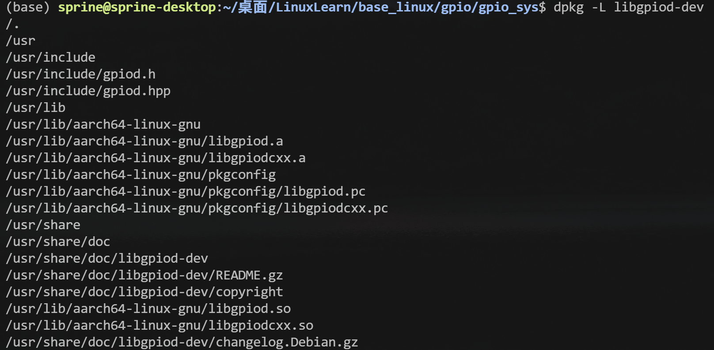

查找结果中的 `gpiod.h`、`libgpiod.so` 和 `libgpiod.a` 就是板卡使用的头文件、动态和静态链接库。

常用的 libgpiod API ( C 库 ) 如下所示：

```c
//成员变量
struct gpiod_chip; //GPIO 组句柄
struct gpiod_line; //GPIO 引脚句柄

//获取GPIO 控制器(GPIO 组)
struct gpiod_chip *gpiod_chip_open(const char *path);

//获取GPIO 引脚
struct gpiod_line *gpiod_chip_get_line(struct gpiod_chip *chip, unsigned
int offset);

//设置引脚方向为输入模式
int gpiod_line_request_input(struct gpiod_line *line,const char *consumer);

//设置引脚为输出模式
int gpiod_line_request_output(struct gpiod_line *line,const char *consumer, int default_val)

//设置引脚的高低电平
int gpiod_line_set_value(struct gpiod_line *line, int value);

//读取引脚状态
int gpiod_line_get_value(struct gpiod_line *line);

//释放GPIO 引脚
void gpiod_line_release(struct gpiod_line *line);

//关闭GPIO 组句柄并释放所有分配的资源。
void gpiod_chip_close(struct gpiod_chip *chip);
```

##### 13.4.3 程序编写

```c
// path: base_linux/gpio/gpio_lib/gpio_lib.c
#include <gpiod.h>
#include <stdio.h>
#include <unistd.h>
#include <stdlib.h>

int main(int argc, char **argv)
{
    int i;
    int ret;
    char buf[10];

    // GPIO Controller Handle
    struct gpiod_chip *chip;
    //  GPIO Pin Handle
    struct gpiod_line *line;

    // Get GPIO Controller
    chip = gpiod_chip_open("/dev/gpiochip1");
    if (NULL == chip){
        printf("gpiod_chip_open error\n");
        return -1;
    }

    // Get GPIO Pin
    line = gpiod_chip_get_line(chip, 8);
    if (NULL == line){
        printf("gpiod_chip_get_line error\n");
        goto release_line;
    }

    // Set GPIO to output mode
    ret = gpiod_line_request_output(line, "led", 0);
    if (ret < 0){
        printf("gpiod_line_request_output error\n");
        goto release_chip;
    }

    for (i = 0; i < 10; i++)
    {
        gpiod_line_set_value(line, 1);
        printf("set pin value to 1.\n");
        usleep(500000);
        printf("set pin value to 0.\n");
        gpiod_line_set_value(line, 0);
        usleep(500000);
    }

release_line: 
    // Release GPIO pin
    gpiod_line_release(line);
release_chip:
    // Release GPIO controller
    gpiod_chip_close(chip);

    return 0;
}
```

- `usleep()` ：是一个在 Linux 中用于暂停执行的函数，其功能是将当前线程挂起指定的微秒数。

安装 `pkg-config` 工具：

```bash
sudo apt install pkg-config
```

编写 Makefile 文件:

```makefile
# path: base_linux/gpio/gpio_lib/Makefile
# Defining variables
TARGET = gpio_lib

# Defining compiler
CC = gcc

# Defining the path of the header files
CFLAGS = -I .

# Defining the objects files
OBJS = $(TARGET).o

# Defining the include files
DEPS = 

# Defining the storage location of .o files
BUILD_DIR = build

# Adding additional libraries
LIBGPIOD = `pkg-config --cflags libgpiod` `pkg-config --libs libgpiod`

$(TARGET): $(OBJS)
	$(CC) -o $@ $^ $(CFLAGS) $(LIBGPIOD)
	@mkdir -p $(BUILD_DIR)
	@mv *.o $(BUILD_DIR)
	@cp $(TARGET) $(BUILD_DIR)

%.o: %.c $(DEPS)
	$(CC) -c -o $@ $< $(CFLAGS) $(LIBGPIOD)

.PHONY: clean

clean:
	rm -f $(TARGET)
	rm -rf $(BUILD_DIR)
```

编译并运行：

```bash
make
sudo ./gpio_lib
```

或者使用 `gcc` 命令编译：

```bash
gcc gpio_lib.c -o gpio_lib `pkg -config --cflags libgpiod` `pkg -config --libs libgpiod`
sudo ./gpio_lib
```

#### 13.5 systerm 编程

```c
// path: base_linux/gpio/gpio_system/gpio_system.c
#include <sys/types.h>
#include <unistd.h>
#include <stdio.h>
#include <stdlib.h>

int main(void)
{
    pid_t result;
    int i;
    for (i = 0; i < 10; i++)
    {
        result = system("gpioset 1 8=1");
        usleep(500000);
        result = system("gpioset 1 8=0");
        usleep(500000);
    }

    return result;
}
```

该代码的原理是在 C 程序中使用 `system()` 相当于在 shell 终端里使用命令，需要 root 权限执行。

缺点：这种方法控制 `io` 会涉及到内核的上下文切换，会影响到内核的处理。因此，不推荐使用
这种方法在短时间内多次操作 GPIO。如果对 GPIO 有多次操作，可以使用 [`gpio_lib.c`](#13.4.3 程序编写)，速度更快，效率更高。

Makefile 文件：

```makefile
# path: base_linux/gpio/gpio_system/Makefile
TARGET = gpio_system
CC = gcc
CFLAGS = -I .
DEPS = 
BUILD_DIR = build
OBJS = $(TARGET).o

$(TARGET): $(OBJS)
	$(CC) -o $@ $^ $(CFLAGS)
	@mkdir -p $(BUILD_DIR)
	@mv *.o $(BUILD_DIR)
	@cp $(TARGET) $(BUILD_DIR)

%.o: %.c $(DEPS)
	$(CC) -c -o $@ $< $(CFLAGS)

.PHONY: clean

clean:
	rm -f $(TARGET)
	rm -rf $(BUILD_DIR)
```

编译并执行:

```bash
make
sudo ./gpio_system
```

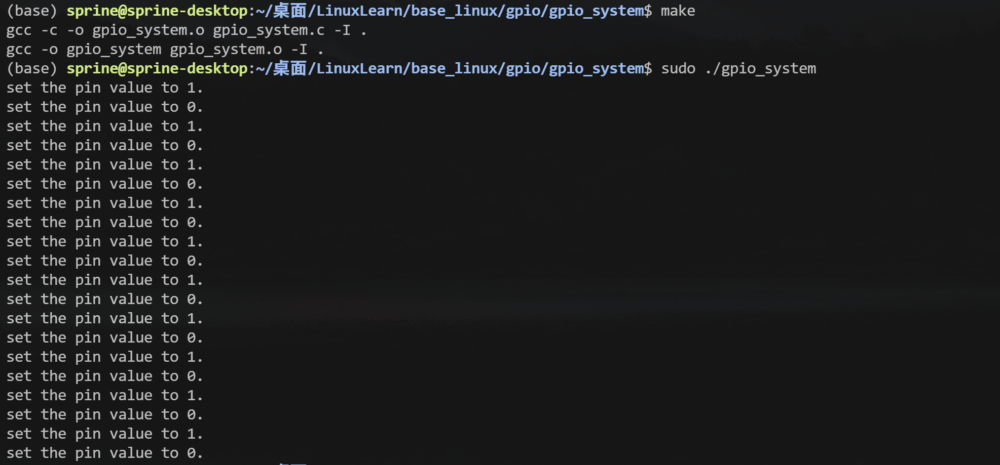

### 14. input 子系统

本节的代码目录为：`base_linux/ev_test`

#### 14.1 input 子系统简介

input 子系统是 Linux 对输入设备提供的统一驱动框架。

如按键、键盘、触摸屏和鼠标等输入设备的驱动方式是类似的，当出现按键、触摸等操作时，硬件产生中断，然后 CPU 直接读取引脚电平，或通过 SPI、I2C 等通讯方式从设备的寄存器读取具体的按键值或触摸坐标，然后把这些信息提交给内核。

使用 input 子系统驱动的输入设备可以通过统一的数据结构提交给内核，该数据结构包括输入的时间、类型、代号以及具体的键值或坐标，而内核则通过 `/dev/input` 目录下的文件接口传递给用户空间。

在Linux 内核源码的 `Documentation/input` 目录包含了input 子系统相关的说明。

在板卡默认的出厂镜像中，按键、触摸屏、鼠标、键盘都使用了 input 子系统驱动。

#### 14.2 input 事件目录

##### 14.2.1 使用 evtest 工具测试

在开发 input 子系统驱动时，常常会使用 `evtest` 工具进行测试，我们可以通过该工具来了解板卡上的输入设备。

```bash
sudo apt install evtest
sudo evtest
```

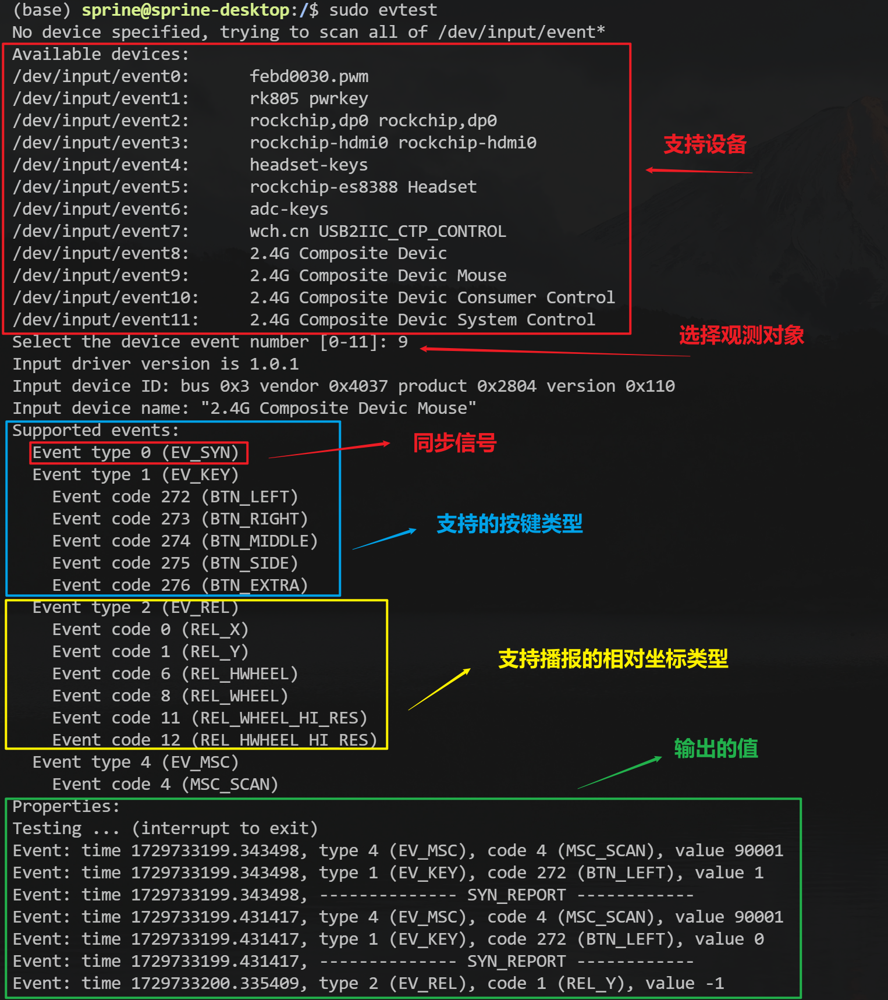

- 运行 `evtest` 工具，它列出了系统当前可用的 `/dev/input/event0~11` 输入事件文件，并且列出了这些事件对应的设备名。
- 输入要测试的设备编号后它列出了 `event9` 的一些设备信息，包括驱动版本、设备ID、设备名、支持的事件类型、事件代号以及输入值的取值范围。
- 移动 2.4G 鼠标，可以看到它输出了详细的事件信息。输出信息中每一行包含了鼠标上报事件的具体时间 `time`、事件类型 `type 2`（EV_REL）、事件代号 `code1` 或 `code0`（REL_Y  或 REL_X）和具体的值 `value`，该值就是鼠标 X/Y 的坐标。

##### 14.2.2 input 事件结构

evtest 工具的原理并不神秘，学习本章节后也可以尝试自己使用代码实现它的部分功能。列出可
用事件时，它就是通过查看目录 `/dev/input/` 实现的。本示例中主机的 `/dev/input` 目录的内容如下图所示。


可看到 `/dev/input` 目录下，有各种 `event` 设备暴露到用户空间的访问接口文件，读取这些文件的内容可获取到设备上报的信息。

在前面 GPIO 子系统中，`direction` 等设备文件直接使用字符串来记录具体的信息，所以使用 `cat` 命令输出文件的内容时，字符串的形式非常方便我们阅读。但是 `event` 文件包含的信息较多，使用字符串不方便其它程序处理，它**采用了纯粹的内核事件数据结构来记录内容，其它程序使用时应把读取到的内容按数据的结构进行格式化转换**，该数据结构定义如下所示：

```c
struct input_event 
{
	struct timeval time;
	__u16 type;
	__u16 code;
	__s32 value;
}
```

- `time` ：该变量用于记录事件产生的时间戳，既 `evtest` 输出的 `time` 值。

- `type` ：输入设备的事件类型。系统常用的默认类型有 `EV_KEY`、`EV_REL` 和 `EV_ABS`，分别用于表示按键状态改变事件、相对坐标改变事件及绝对坐标改变事件，特别地，`EV_SYN` 用于分隔事件，无特别意义。如果选择鼠标（本章第一个图）`evtest` 输出的 `type` 类型为`EV_ABS`。相关的枚举值可以参考内核文件 `include/uapi/linux/input-event-codes.h`。
- `code` ：事件代号，它以更精确的方式表示事件。例如在 `EV_KEY` 事件类型中，`code` 的值常用于表示键盘上具体的按键，其取值范围在0~127 之间，例如按键 Q 对应的是 KEY_Q，该枚举变量的值为16。如果选择鼠标，`evtest` 输出内容的 `code` 分别有 `ABS_X`/`ABS_Y`，表示上报的是X 或Y 坐标。

- `value` ：事件的值。对于 `EV_KEY` 事件类型，当按键按下时，该值为1；按键松开时，该值为0。如果选择鼠标，中 `evtest` 输出的内容里，ABS_X 事件类型中的 `value` 值表示X 坐标，ABS_Y 类型中的 `value` 值表示Y 坐标。

如果同样使用 `cat` 命令查看事件文件，当事件出现时，`cat` 把内容转化成字符串，会看到乱码，使用这样的方式可以简单地查看设备是否上报了事件。

可以使用以下方式进行测试：

```bash
sudo cat /dev/input/event9
```


与其它文件不同，通常 `cat` 命令读取文件内容后就会返回，而此处读取 `event` 文件时，命令会持续地等待输入。

我们还可以使用 `hexdump` 命令来查看输出的命令：

```bash
hexdump /dev/input/event9
```

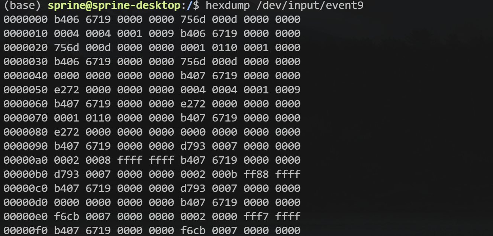

二进制的数据可能会因为驱动的不一样而很难对其进行有效的分析。

##### 14.2.3 input 事件设备名

`/dev/input/event*` 的事件编号与设备的联系不是固定的，它通常按系统检测到设备的先后顺序安排 `event` 文件的编号，这对编写应用程序控制不太方便，我们可以通过 `/dev/input/by-id` 或 `/dev/input/by-path` 目录查看具体的硬件设备，如下图所示：

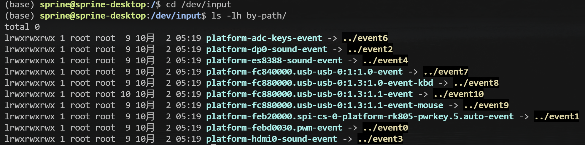

图中列出了 `by-path` 目录下的内容，该目录下的文件实际上都是链接，访问链接文件就是访问对应的事件设备，而且该文件名与硬件的关系是固定的，后面我们一般采用这样的方式。

由于 `/dev` 下的设备都是通过 `/sys` 导出的，所以也可以通过 `/sys/class/input`目录查看，如下图所示：


`/sys/class/input` 下包含了各个以事件命名的目录，其对应目录下的 `device/name` 文件包含了事件对应的设备名。


`evtest` 工具列出的事件与设备名的关系，就是从这里读取的。

#### 14.3 板卡按键检测实验

##### 14.3.1 实验代码分析

在输入事件检测的应用中，通常使用主线程直接循环读取 `/dev/input/event*` 设备文件获取事件的数据结构，然后通过消息队列通知其它子线程，从而响应输入操作。

```c
// path: base_linux/ev_test/ev_test.c
#include <stdio.h>
#include <unistd.h>
#include <stdlib.h>
#include <sys/types.h>
#include <sys/stat.h>
#include <fcntl.h>
#include <linux/input.h>
#include <linux/input-event-codes.h>

const char default_path[] = "/dev/input/by-path/platform-fc880000.usb-usb-0:1.3:1.0-event-kbd";

int main(int argc, char **argv)
{
    int fd;
    struct input_event event;
    char *path;

    printf("This is a input device demo.\n");

    // if not input parameters are given, the default
    // event device is used.
    if (argc > 1)
        path = argv[1];
    else
        path = (char *)default_path;

    fd = open(path, O_RDONLY);
    if (fd < 0){
        printf("Fail to open device: %s. \n "
               "Please confirm the path or you have permission to do this.\n", path);
        exit(1);
    }

    printf("Test device: %s.\nWatting for input...\n", path);

    while (1) {
        if (read(fd, &event, sizeof(event)) == sizeof(event))
        {
            if (event.type != EV_SYN){
                printf("Event: time %ld.%ld, type %d, code %d, value %d\n",
                       event.time.tv_sec, event.time.tv_usec,
                       event.type,
                       event.code,
                       event.value);
            }
        }
    }
    close(fd);

    return 0;
}
```

- `fd = open(path, O_RDONLY);`  ：使用 `O_RDONLY` 模式打开事件设备文件，`O_RDONLY` 模式默认是阻塞型的，而且**事件设备文件支持阻塞操作**，也就是说，若后面使用 `read` 函数读取时，它会等待事件上报，一直等待至读取成功或失败才会返回。
- 在 `while` 循环里通过 `read` 系统调用读取事件文件，读取到的内容存储在 `struct input_event` 类型的 `event` 变量中，`struct input_event` 类型就是前面介绍的内核事件数据结构。若成功读取，我们就可以通过该变量的结构体成员访问到事件的时间戳、类型、代号和值。
- 输出读取到的 `event` 变量的各个成员值，在上报的事件中，通常会有很多类型为 `EV_SYN` 的事件，这种事件是用于分隔的，无特别意义，所以代码中不输出这类型事件的内容。

值得思考的是，若没有上报事件，第 35 行的 `read` 读取事件设备文件操作会被阻塞，简单来说就是即使第 40 行的 `printf` 代码不注释掉，它也**不会在持续地在循环里输出**，而只有当出现了事件，触发 `read`退出，后面的 `printf` 函数才有机会被执行一次，然后重新 `read` 事件再次阻塞。**在这种阻塞的过程中，进程会休眠，释放它对 CPU 的占用。**

假如我们使用的是 GPIO 子系统框架来编写按键驱动程序，在应用层的操作中，需要使用 `/sys/class/gpio/gpio*/direction` 文件配置为输入方向，然后使用循环读取 `/sys/class/gpio/gpio*/value`文件的值来获得按键的状态，但由于**对 `value` 文件的 `read` 读取操作不会阻塞，所以进程会不停地读取文件内容来判断按键值，占用 CPU 宝贵的运算资源。**

由于 `read` 事件文件操作会阻塞，那么采用这种方式就无法同时检测两个输入设备了，这种时候
可以通过 `select` 或 `poll` 等 IO 多路复用的操作达成目的。

Makefile 文件：

```makefile
# path: base_linux/ev_test/Makefile
TARGET = ev_test
CC = gcc
CFLAGS = -I .
OBJS = $(TARGET).o
DEPS = 
BUILD_DIR = build

$(TARGET): $(OBJS)
	$(CC) -o $@ $^ $(CFLAGS)
	@mkdir -p $(BUILD_DIR)
	@mv *.o $(BUILD_DIR)
	@cp $(TARGET) $(BUILD_DIR)

%.o: %.c $(DEPS)
	$(CC) -c -o $@ $< $(CFLAGS)

.PHONY: clean

clean:
	rm -f $(TARGET)
	rm -rf $(BUILD_DIR)
```

编译并运行文件：

```bash
make
sudo ./ev_test
```

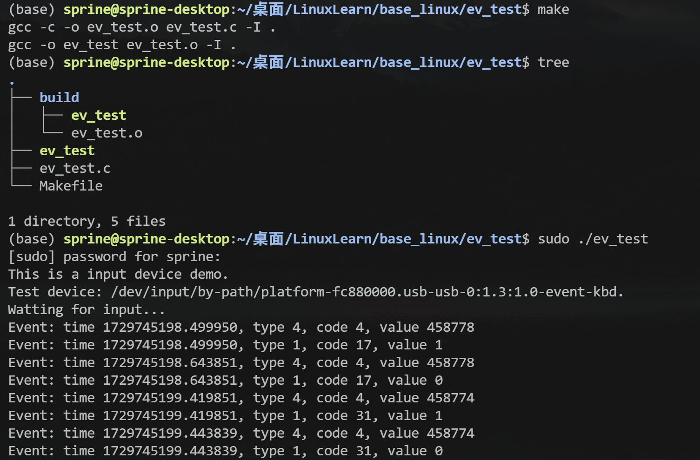

### 15. 串口通讯

通用异步收发器（Universal Asynchronous Receiver/Transmitter )，通常称作 UART，是一种串行、异步、全双工的通信协议，在嵌入式领域应用的非常广泛。

LubanCat-RK3588 系列板子的通用 uart 设备有1 个（如 15.1 图所示），除此之外其他的 GPIO 也可以复用成 uart 设备，需要自行根据引脚复用图去配置，LubanCat-4 的 40pin 引脚最大可支持 5 个 uart 接口使用。

LubanCat-RK 系列板卡的uart 控制器支持下列功能

- 支持5、6、7、8 bits 数据位
- 支持奇校验和偶校验，不支持 mark 校验和 space 校验
-  支持接收 FIFO 和发送 FIFO，一般为 32 字节或者 64 字节
-  支持最高 4M 波特率，实际支持波特率需要芯片时钟分频策略配合
-  支持中断传输模式和 DMA 传输模式
-  支持硬件自动流控，RTS + CTS

本节的代码目录为：`base_linux/uart`

#### 15.1 串口引脚关系

|  串口   | 引脚 |    功能    |
| :-----: | :--: | :--------: |
| **TXD** |  8   | 发送信号线 |
| **RXD** |  10  | 接受信号线 |

对应板卡的 40Pin 接口：

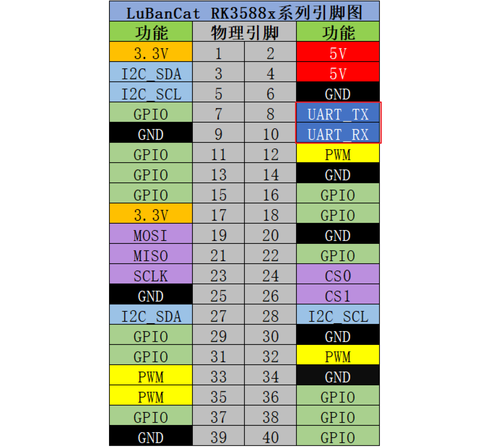

- LubanCat-4 使用的是 uart0

#### 15.2 使能串口接口

串口在默认情况是关闭状态的，需要使能才能使用。

##### 15.2.1 方法一

适用于 LubanCat Debian 系统。

进入工具配置：

```bash
sudo fire-config
```

移动键盘上下键选择 `外设` 后回车：

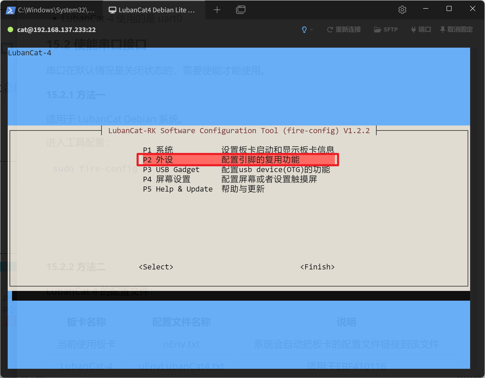

找到 `uart0-m2` ，单击空格键选中，然后按回车键

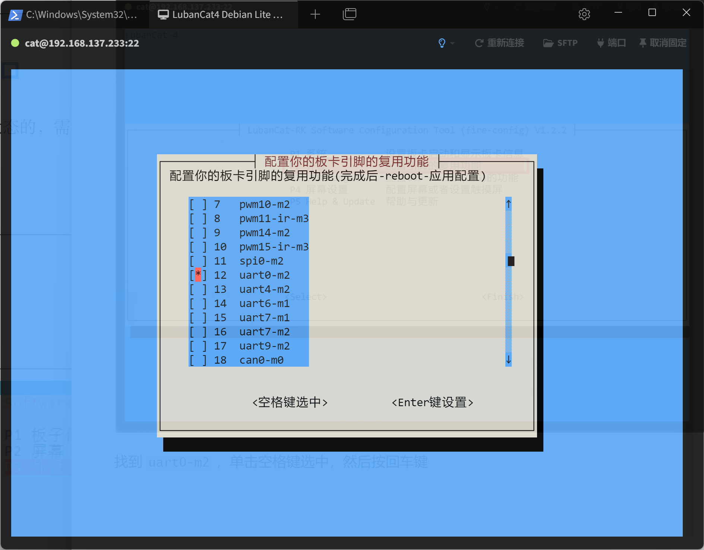

移动键盘左键到 <Finish> 后回车退出 fire-config 工具。

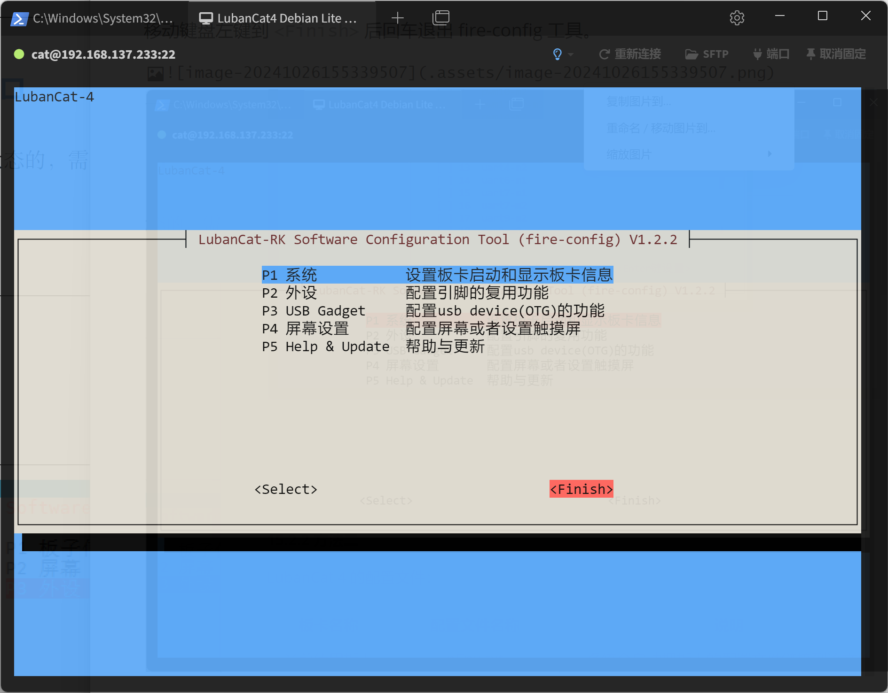

然后重启系统即可：

```bash
sudo reboot
```

##### 15.2.2 方法二

LubanCat 4 的配置文件：

|   板卡名称   |   配置文件名称    |                  说明                  |
| :----------: | :---------------: | :------------------------------------: |
| 当前使用板卡 |     nEnv.txt      | 系统会自动把板卡的配置文件链接到该文件 |
|  LubanCat-4  | uEnvLubanCat4.txt |            适用于EBF410116             |

可以通过打开 `/boot/uEnv/board.txt` （ `board` 是你所用的板子的名称），一般第一次启动已经初始化将板级 `uEnv.txt` 软连接到了 `/boot/uEnv/uEnv.txt`，可以直接修改该文件。

查看是否启用了 uart 相关设备设备树插件。编辑文件，将带有 uart 的那一行的注释符号去掉如下图：

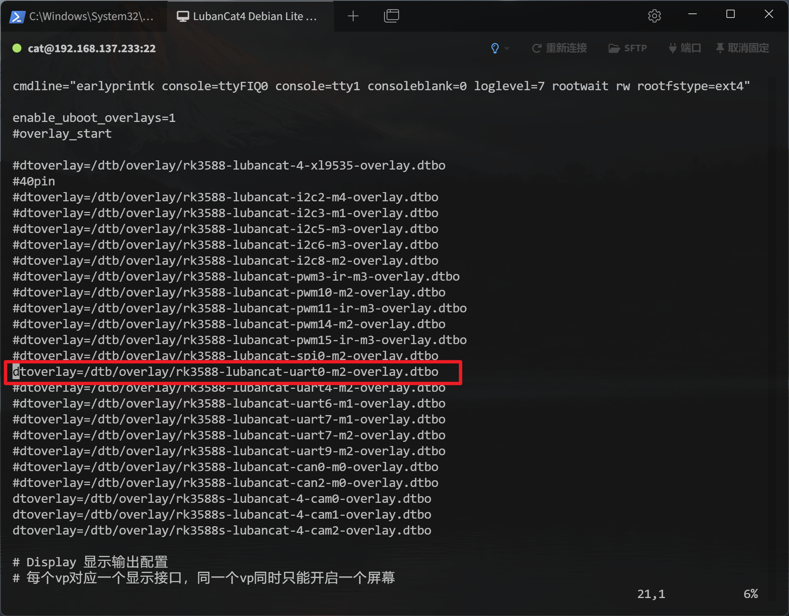

然后保存退出后重启系统即可：

```bash
:wq
sudo reboot
```

#### 15.3 检查串口设备

查看串口是否成功使能：

```bash
ls /dev/tty*
```

LubanCat4 为 `ttyS0`：

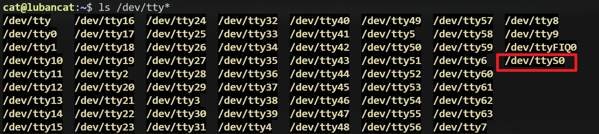

#### 15.4 串口通讯实验（Shell）

对 `tty` 的设备文件直接读写就可以控制设备通过串口接收或发送数据，下面我们使用板卡配合Windows 下的串口调试助手或 Linux 下的 minicom 进行测试。

##### 15.4.1 连接串口

实验前需要使用串口线或USB 转串口线把它与板卡与电脑连接起来。

-  板子  —  电脑
-  TXD  —   RXD
-  RXD  —   TXD
-  GND —  GND

##### 15.4.2 查询串口的通信参数

```bash
stty -F /dev/ttyS0
```


##### 15.4.3 修改串口波特率

```bash
stty -F /dev/ttyS0 ispeed 115200 ospeed 115200
```

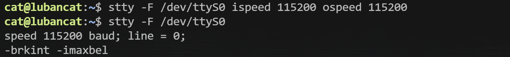

##### 15.4.4 关闭回显

默认串口是开启回显的可以使用以下命令关闭回显：

```bash
stty -F /dev/ttyS0 -echo
```

##### 15.4.5 与 Windows 主机通讯

###### 15.4.5.1 串口通讯实验

```bash
echo hello! > /dev/ttyS0
echo "I'm SprIne." > /dev/ttyS0
```


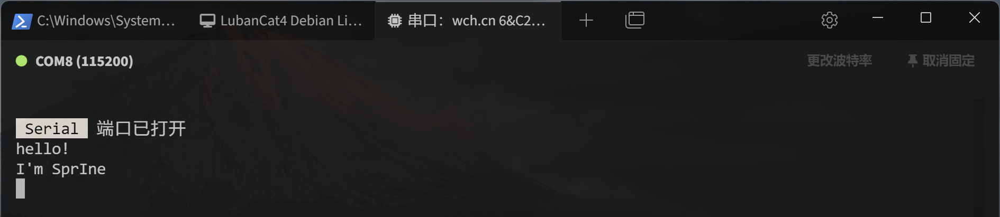

可以看到，往 `/dev/ttyS0` 设备文件写入的内容会直接通过串口线发送至 Winodws 的主机。

读取设备文件则可接收 Winodws 主机发往板卡的内容，可以使用 `cat` 命令来读取：

```bash
cat /dev/ttyS0
```

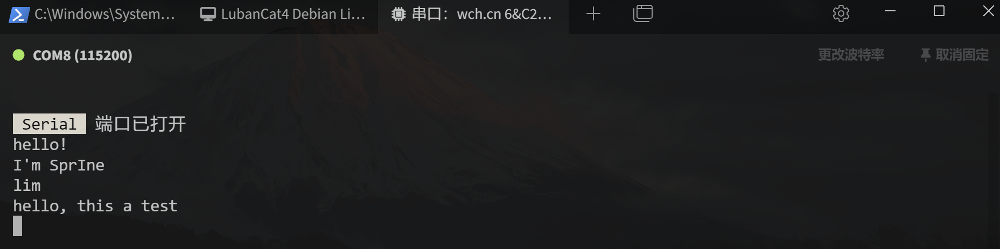


###### 15.4.5.2 minicom 通讯

安装 `minicom` 软件包：

```bash
sudo apt install minicom
```

设置串口：

```bash
sudo minicom -s
```

1. 通过鼠标上下键移动到下图所示选项按回车选择进入配置页面：

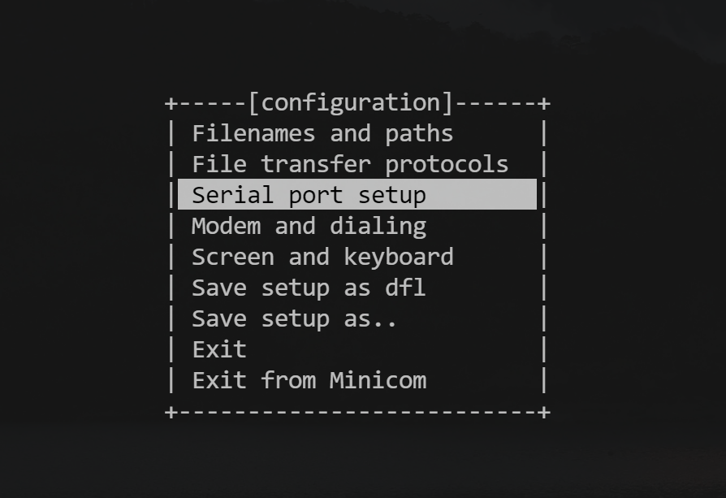

2. 通过按各参数前面的字母跳转到对应参数进行配置，配置完成后单击回车跳转到底部 `Change which setting?` 选项再次回车保存并退出配置：

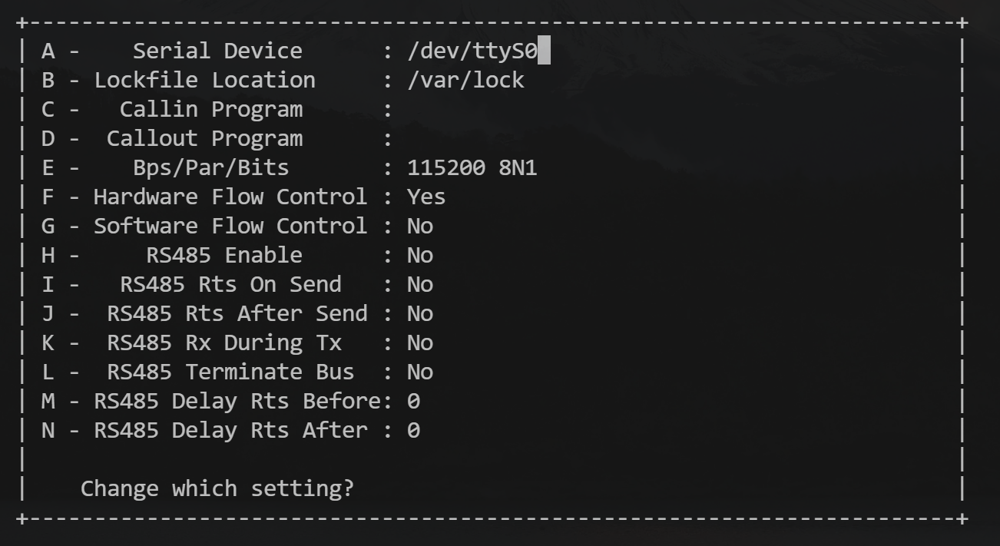

3. 通过键盘上下键移动到下图选项后回车将刚刚的设置保存为默认设置：

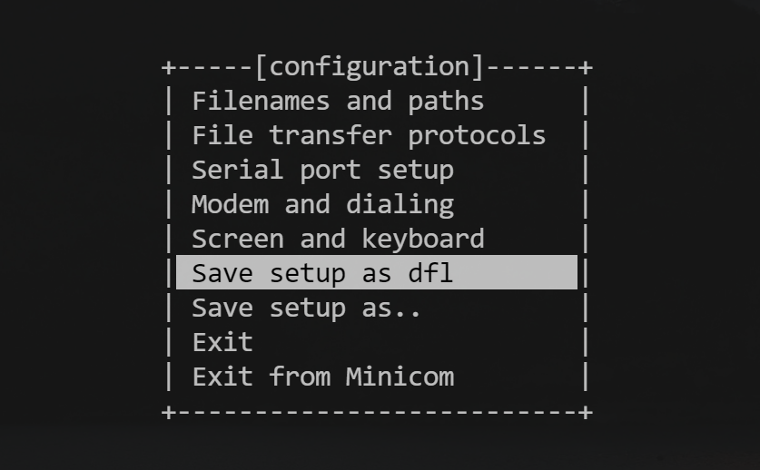

4. 移动到 `Exit` 选项后回车退出配置页面：

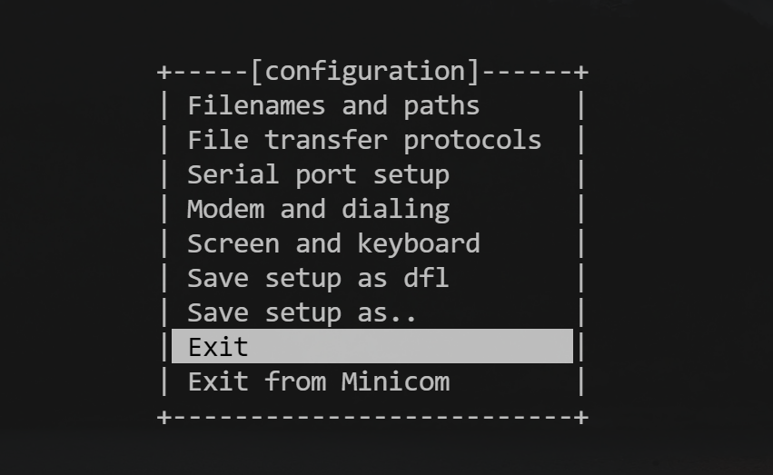

5. 进入通讯页面：

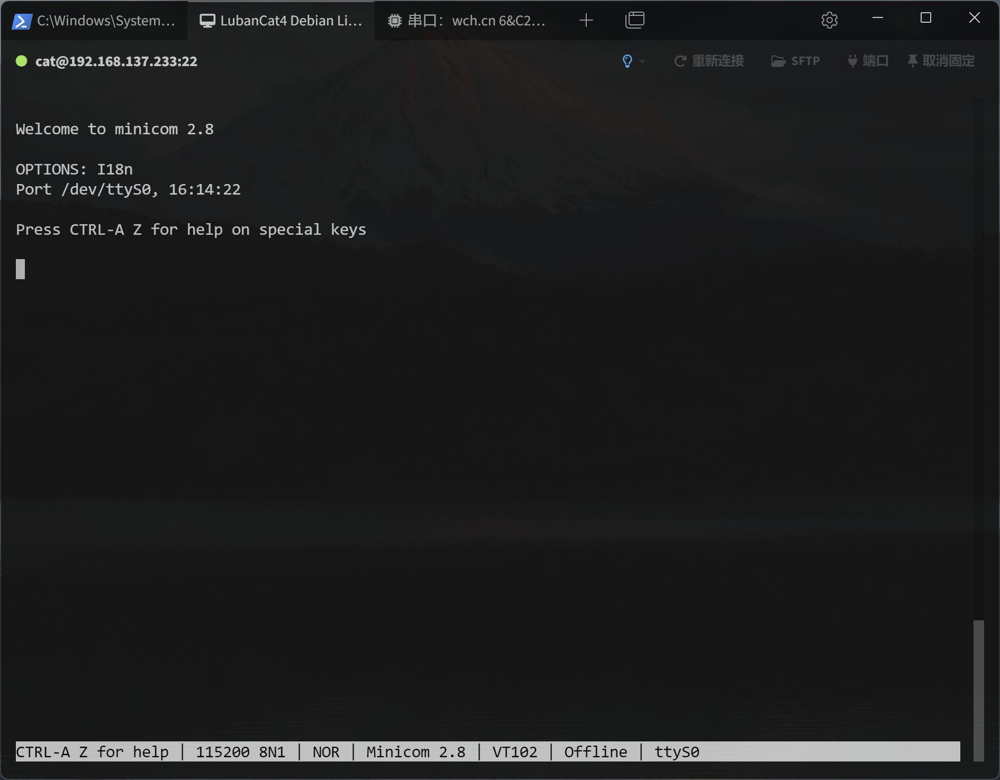

若输入字母屏幕上没有显示，可通过 `Ctrl+A` + `Z` 进入菜单：

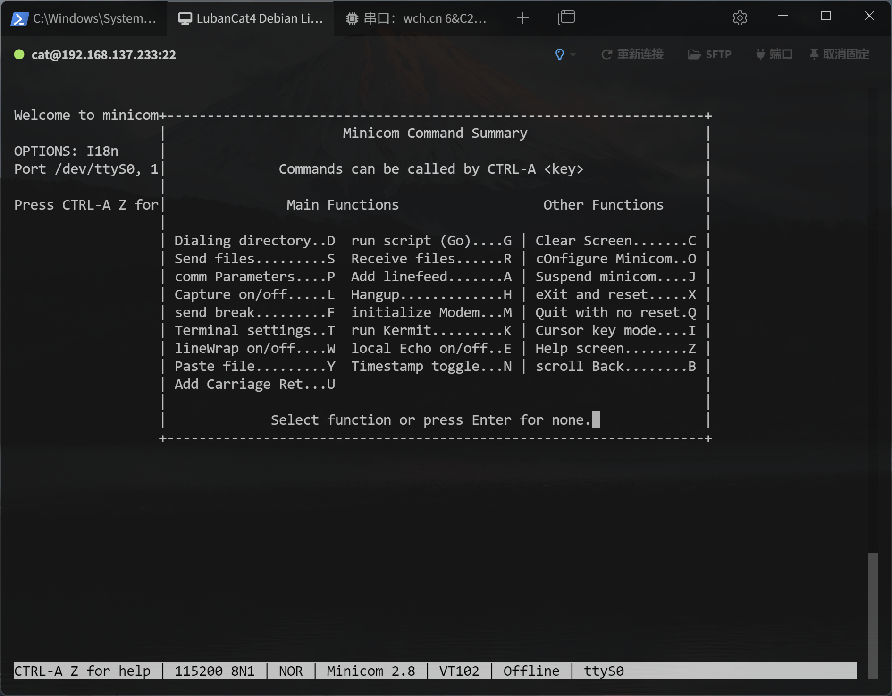

按下 `E`  可打开回显。然后测试通信即可：

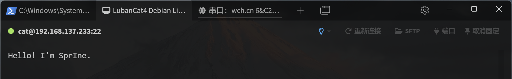

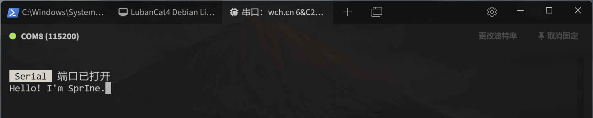

minicom 菜单命令：

| 命令 | 功能                                                   |
| :--: | ------------------------------------------------------ |
|  s   | 发送文件                                               |
|  p   | 设置通讯参数，包括一些预设的波特率，数据格式，数据位等 |
|  l   | 就可以将 log 信息保存到一个文件中了, 方便查看          |
|  t   | 设置终端参数，以及键位设置                             |
|  w   | 超出一行的数据后自动换行                               |
|  r   | 接收文件                                               |
|  a   | 换行发送时会增加时间戳                                 |
|  n   | 增加时间戳                                             |
|  c   | 清除屏幕                                               |
|  o   | 设置 minicom，相当于 `sudo minicom -s`                 |
|  j   | 休眠状态                                               |
|  x   | 退出的同时复位                                         |
|  q   | 退出                                                   |

也可以不用通过按 `ctrl + a` + `z` + `?` 的方式设置，而是直接使用 `ctrl + a` + `?`

#### 15.5 串口通讯实验（系统调用）

如果只是想通过串口终端设备收发数据，那么使用 `open`、`read`、`write` 等系统调用能轻易实现，操作的原理和前面的 `led`、`gpio`、`input` 设备并无区别，都是读写设备文件。但是 `led`、`gpio` 和 `input` 除了主设备文件，还有众多的属性文件配合用于设置设备的运行参数，如 `led` 的 `trigger` 文件，`gpio` 的 `direction` 文件，而终端设备却没有其它的属性文件，那么 `stty` 命令和 `minicom` 工具是如何配置终端设备参数的呢？

##### 15.5.1 实验

```c
// path: base_linux/uart/uart_t/uart_t.c
#include <stdio.h>
#include <stdlib.h>
#include <string.h>
#include <unistd.h>
#include <fcntl.h>
#include <termios.h>
#include <sys/stat.h>
#include <sys/types.h>
#include <sys/ioctl.h>

const char default_path[] = "/dev/ttyS0";

int main(int argc, char *argv[])
{
    int fd;
    int res;
    char *path;
    char buf[1024] = "tty send test.\n";

    // Get the device path from command line argument
    // If no argument, use default path
    if (argc > 1) {
        path = argv[1];
    } 
    else {
        path = default_path;
    }

    // Get the device file descriptor
    printf("This is tty/usart demo.\n");
    fd = open(path, O_RDWR);
    if (fd < 0){
        printf("Fail to Open %s device.\n", path);
        return 0;
    }

    struct termios opt;
    // Clear the UART buffer
    tcflush(fd, TCIOFLUSH);
    // Get the UART parameters opt
    tcgetattr(fd, &opt);
    // Set the baud rate to 9600
    cfsetispeed(&opt, B9600);
    cfsetospeed(&opt, B9600);

    // Set the data bits to 8
    opt.c_cflag &= ~CSIZE;
    opt.c_cflag |= CS8;
    // Set the parity bit to none
    opt.c_cflag &= ~PARENB;
    opt.c_cflag &= ~INPCK;
    // Set the stop bit to 1
    opt.c_cflag &= ~CSTOPB;
    // Update the UART parameters
    tcsetattr(fd, TCSANOW, &opt);
    printf("Device %s is set to 9600bps, 8N1.\n", path);

    do {
        // Send the data to the device
        write(fd, buf, strlen(buf));
        // Receive the data from the device
        res = read(fd, buf, 1024);
        if (res > 0) {
            // Add '\0' to the end of the string
            buf[res] = '\n';
            buf[res+1] = '\0';
            printf("Receive res = %d bytes data: %s", res, buf);
        }
    } while (res >= 0);

    printf("read error, res = %d", res);
    close(fd);
    return 0;
}
```

Makefile 文件：

```makefile
# path: base_linux/uart/uart_t/Makefile
TARGET = uart_t
CC = gcc
CFLAGS = -I .
OBJS = $(TARGET).o
BUILD_DIR = build
DEPS = 

$(TARGET): $(OBJS)
        $(CC) -o $@ $^ $(CFLAGS)
        @mkdir -p $(BUILD_DIR)
        @mv *.o $(BUILD_DIR)
        @cp $(TARGET) $(BUILD_DIR)

%.o: %.c $(DEPS)
        $(CC) -c -o $@ $< $(CFLAGS)

.PHONY: clean

clean:
        rm -rf $(BUILD_DIR) $(TARGET)
```

编译运行：

```bash
make
sudo ./uart_t
```

PC 端串口助手输入字符进行测试：

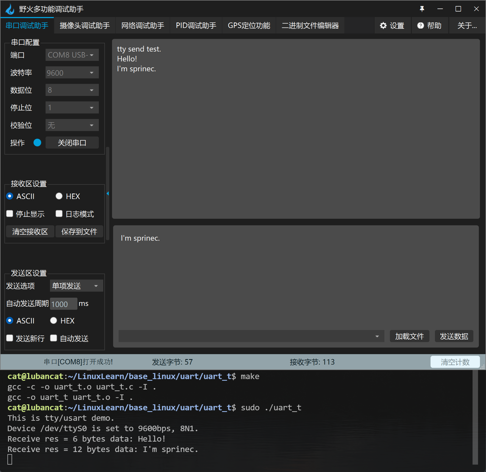

##### 15.5.2 代码分析

- **SECTION 1** ：定义了默认使用的串口终端设备路径及其它一些变量。
- **SECTION 2** ：根据 `main` 是否有输入参数确认使用哪个设备路径，并通过 `open` 的 `O_RDWR` 读写模式打开该设备。
- **SECTION 3** ：定义了一个结构体 `termios` 用于获取、设置终端设备的参数，包括波特率、数据位数、校验位等。
- **SECTION 4** ：在 `while` 循环中对终端设备使用 `read`  和 `write` 进行读写，从而控制串口收发数据。代码中在接收到的内容末尾加了 `’0’` 结束符，主要是为了方便使用字符串的方式处理内容。

###### 15.5.2.1 termios 结构体

SECTION 3，使用了 `termios` 结构体，它是在 POSIX 规范中定义的标准接口。Linux系统利用 `termios` 来设置串口的参数，它是在头文件 `<termios.h>` 包含的`<bits/termios.h>` 中定义的，该文件中还包含了各个结构体成员可使用的宏值，可使用 `locate` 命令查找该文件打开来阅读，关于 `termios` 结构体的定义摘录如下所示。

```c
// path: /usr/include/bits/termios.h
struct termios {
    tcflag_t c_iflag; /* input mode flags */
	tcflag_t c_oflag; /* output mode flags */
	tcflag_t c_cflag; /* control mode flags */
	tcflag_t c_lflag; /* local mode flags */
	cc_t c_line; /* line discipline */
	cc_t c_cc[NCCS]; /* control characters */
	speed_t c_ispeed; /* input speed */
	speed_t c_ospeed; /* output speed */
	#define _HAVE_STRUCT_TERMIOS_C_ISPEED 1
	#define _HAVE_STRUCT_TERMIOS_C_OSPEED 1
};
```

- `c_iflag` ：输入（ input ）模式标志，用于控制如何对串口输入的字符进行处理，常用的选项值见下表。

    | 选项值 | 作用                     |
    | :----: | :----------------------- |
    | INPCK  | 启用输入奇偶检测         |
    | IGNPAR | 忽略帧错误和奇偶检验错误 |
    | IGNCR  | 忽略输入中的回车         |
    |  IXON  | 开启 XON/XOFF 流控制     |
    | IXOFF  | 关闭 XON/XOFF 流控制     |

- `c_oflag` ：输出（ output ）模式标志，用于控制串口的输出模式，常用的选项值见下表。

    | 选项值 | 作用                                   |
    | :----: | :------------------------------------- |
    | ONCLR  | 将输出中的换行符 NL 映射为回车-换行 CR |
    | OCRNL  | 将输出的回车映射为换行符               |
    | ONLRET | 不输出回车                             |
    | OFILL  | 发送填充字符串                         |

- `c_cflag` ：控制（ control ）模式标志，用于控制串口的基本参数，如数据位、停止位等，常用配置见下表，特别地，`c_cflag` 结构体成员还包含了波特率的参数。

    | 选项值 | 作用                                           |
    | :----: | ---------------------------------------------- |
    | CSIZE  | 设置数据位长度，可以配置为CS5、CS6、CS7、CS8。 |
    | CSTOPB | 如果设置 CSTOPB 标志，则使用两位停止位         |
    | PARENB | 使能奇偶检验                                   |
    | PARODD | 设置为奇校验                                   |

- `c_lflag` ：本地（ local ）模式标志，主要用于控制驱动程序与用户的交互，在串口通信中，实际上用不到该成员变量。

    | 选项值 | 作用                                                         |
    | :----: | ------------------------------------------------------------ |
    |  ISIG  | 如果设置 ISIG 标志，当接收到字符 INTR、QUIT 等字符，系统会产生相应的信号。 |
    |  ECHO  | 是否需要回显字符。                                           |
    | ICANON | 若设置了 ICANON 标志，则表示终端处于规范式输入状态，允许使用特殊字符 EOF、KILL 等。 |
    | ECHONL | 若该标志位和 ICANON 标志位同时被设置，则回显换行符 NL。      |

- `c_cc[NCCS]` : 该数组包含了终端的所有特殊字符，可以修改特殊字符对应的键值（ Ctrl+C 产生的 ^C，ASCII 码为 0x03 ），部分内容如下表。

    | 数组的下标值 | 作用                                                         |
    | :----------: | ------------------------------------------------------------ |
    |    VINTR     | 中断字符，若接收到该字符时，会发送 `SIGINT` 信号。当设置了`c_lflag` 的 `ISIG` 标志位时，该字母不再作为输入传递。 |
    |    VERASE    | 删除字符，删除上一个字符。                                   |
    |     VIM      | 设置非标准模式读取的最小字节数                               |
    |     VTIM     | 设置非标准模式读取时的延时值，单位为十分之一秒。             |

- `c_ispeed` 和 `c_ospeed` ：记录串口的输入和输出波特率（ input speed 和 output speed ），部分可取值如下代码所示，宏定义中的数字以 `“0”` 开头，在 C 语言中这是表示 8 进制数字的方式。

```c
// 以 0 开头的数字在是 C 语言的 8 进制数字形式
#define B1200 000011
#define B1800 000012
#define B2400 000013
#define B4800 000014
#define B9600 000015
#define B19200 000016
#define B38400 000017
```

- `termios` ：结构体内部有 `_HAVE_STRUCT_TERMIOS_C_ISPEED` 和 `_HAVE_STRUCT_TERMIOS_C_OSPEED` 两个宏定义， 它们的宏值都为 1， 表示它支持 `c_ispeed` 和 `c_ospeed` 表示方式，部分标准中不支持使用这两个结构体成员表示波特率，而只使用 `c_cflag` 来表示。

直接看结构体的定义比较抽象，下面以修改串口波特率、数据位、校验位和停止位的代码进行讲解。接下来几个小节的代码，是从野火配套代码仓库 `/linux_app/tty/c_full/sources/bsp_uart.c` 文件截取的，该文件以比较完善的方式封装了串口的配置，此处提取出了代码中的重点进行分析。

1. 配置串口波特率

    修改终端中串口波特率的实例代码如下：

    ```c
    struct termios opt;
    // 获取串口参数
    tcgetattr(fd, &opt);
    // 设置串口输出波特率
    cfsetospeed(&opt, B9600);
    // 设置串口输入波特率
    cfsetispeed(&opt, B9600);
    // 更新配置
    tcsetattr(fd, TCSANOW, &opt);
    ```

    代码中使用到了头文件 `termios.h` 的库函数 `tcgetattr`、`cfsetispeed`、`cfsetospeed` 和 `tcsetattr`。

    其中 `tcgetattr` 和 `tcsetattr` 函数分别用于读取和设置串口的参数，原型如下：

    ```c
    #include <termios.h>
    #include <unistd.h>
    
    int tcgetattr(int fd, struct termios *termios_p);
    int tcsetattr(int fd, int optional_actions, const struct termios *termios_p);
    ```

    - `fd` ：指定串口设备文件的文件描述符。

    - `termios_p` ：指向串口参数的结构体 `termios`，`tcgetattr` 读取到的参数会保存在该结构体中，而 `tcsetattr` 则根据该结构体配置设备参数。

    - `optional_actions` ：仅 `tcsetattr` 函数有这个参数，它用于指示配置什么时候生效，它支持的配置参数如下：

        - `TCSANOW` 表示立即生效。
        - `TCSADRAIN` 表示待所有数据传输结束后配置生效。
        - `TCSAFLUSH` 表示输入输出缓冲区为空时配置有效。

        通常都使用选项TCSANOW，让写入的参数配置立马生效。

    代码中的 `cfsetispeed` 和 `cfsetospeed` 函数分别用于设置 `termios` 结构体的输入和输出波特率，另外还有 `cfsetspeed` 函数可以同时设置输入和输出波特率参数为相同的值，原型如下：

    ```c
    int cfsetispeed(struct termios *termios_p, speed_t speed);
    int cfsetospeed(struct termios *termios_p, speed_t speed);
    int cfsetspeed(struct termios *termios_p, speed_t speed);
    ```

    使用这些函数要注意两点：

    - `speed` 参数需要使用类似前面代码定义的宏值。
    - 这三个函数只是修改了 `termios` 的 `opt` 变量的内容，并没有写入到设备文件，因此在修改完它的内容后，还需要调用 `tcsetattr` 函数，把 `opt` 变量中的配置写入到设备，使它生效。

    这就是修改终端设备参数的过程，读取原配置、修改 `termios` 参数、写入 `termios` 参数。

2. 配置串口停止位

    `c_cflag` 中的标志位 `CSTOPB`，用于设置串口通信停止位的长度。若该值为 `0`，则停止位的长度为 1 位；若设置该位为 `1`，则停止位的长度为两位，具体实现如下所示：

    ```c
    // 在 bits/termios.h 文件中关于 CSTOPB 的定义
    // 注意以 0 开头的数字在是 C 语言的 8 进制数字形式
    #define CSTOPB 0000100
    
    // 设置停止位示例
    // 定义termios 型变量opt
    struct termios opt;
    // 获取串口参数opt
    tcgetattr(fd, &opt);
    
    /* 设置停止位*/
    switch (stopbits)
    {
    	// 设置停止位为1 位
    	case 1:
    		opt.c_cflag &= ~CSTOPB;
    		break;
    	//设置停止位为2 位
    	case 2:
    		opt.c_cflag |= CSTOPB;
    		break;
    }
    
    // 更新配置
    tcsetattr(fd, TCSANOW, &opt);
    ```

    修改配置的代码中使用了 `&=~` 、`|=` 这种位操作方法，主要是为了避免影响到变量中的其它位，因为在 `c_cflag` 的其它位还包含了校验位、数据位和波特率相关的配置，如果直接使用 `=` 赋值，那其它配置都会受到影响，而且操作不方便。

3. 配置串口校验位

    配置串口的校验位涉及到 `termios` 成员 `c_cflag` 的标志位 `PARENB`、`PARODD` 以及 `c_iflag` 的标志位 `INPCK`，其中 `PARENB` 和 `INPCK` 共同决定是否使能奇偶校验，而 `PARODD` 决定使用奇校验还是偶校验，配置的示例代码如下所示。

    ```c
    // bits/termios.h 的位定义
    // 注意以 0 开头的数字在是 C 语言的 8 进制数字形式
    /* c_cflag bit meaning */
    #define PARENB 0000400
    #define PARODD 0001000
    /* c_iflag bits */
    #define INPCK 0000020
    
    // 定义termios 型变量opt
    struct termios opt;
    
    // 获取串口参数opt
    tcgetattr(fd, &opt);
    
    switch (parity)
    {
    	case 'n':
    	case 'N':
    		options.c_cflag &= ~PARENB; /* 不使用奇偶校验*/
    		options.c_iflag &= ~INPCK; /* 禁止输入奇偶检测*/
    		break;
    
    	case 'o':
    	case 'O':
    		options.c_cflag |= PARENB; /* 启用奇偶效验*/
    		options.c_iflag |= INPCK; /* 启用输入奇偶检测*/
    		options.c_cflag |= PARODD ; /* 设置为奇效验*/
    		break;
    
    	case 'e':
    	case 'E':
    		options.c_cflag |= PARENB; /* 启用奇偶效验*/
    		options.c_iflag |= INPCK; /* 启用输入奇偶检测*/
    		options.c_cflag &= ~PARODD; /* 设置为偶效验*/
    		break;
    }
    
    // 更新配置
    tcsetattr(fd, TCSANOW, &opt);
    ```

    不校验时同时把 `PARENB` 和 `INPCK` 位清零，启用校验时把 `PARENB` 和 `INPCK` 同时置 1，而 `PARODD` 为1 时指定为奇校验，为0 时是偶校验。

4. 配置串口数据位

    串口的数据位是由 `c_cflag` 中的 `CSIZE` 配置的，由于串口支持5、6、7、8 位的配置，一共有四种，所以在 `c_cflag` 中使用了两个数据位进行配置，在配置前我们需要先对 `CSIZE` 数据位清零，然后再赋予5、6、7、8 的宏配置值，具体代码如下所示。

    ```c
    // bits/termios.h 的位定义
    // 注意以 0 开头的数字在是 C 语言的 8 进制数字形式
    #define CSIZE 0000060
    #define CS5 0000000
    #define CS6 0000020
    #define CS7 0000040
    #define CS8 0000060
    
    // 定义termios 型变量opt
    struct termios opt;
    // 获取串口参数opt
    tcgetattr(fd, &opt);
    
    // 先清除CSIZE 数据位的内容
    opt.c_cflag &= ~CSIZE;
    
    switch (databits) /* 设置数据位数 */
    {
    	case 5:
    		opt.c_cflag |= CS5;
    		break;
    	case 6:
    		opt.c_cflag |= CS6;
    		break;
    	case 7:
    		opt.c_cflag |= CS7;
    		break;
    	case 8:
    		opt.c_cflag |= CS8;
    		break;
    }
    // 更新配置
    tcsetattr(fd, TCSANOW, &opt);
    ```

#### 15.6 ioctl 系统调用

而且按照传统的认知，文件操作大都是跟内容挂勾的，上一章节的 `inpu`t 事件设备文件记录了上报的事件信息，而 `tty` 设备的文件却不是记录串口终端的配置参数，因为对文件的 `write` 操作是对外发送数据，而 `read` 则是读取接收到的数据，也就是说，`tty*` 文件并没有记录串口终端的配置信息，那么 `tcgetattr`、`tcsetattr` 这两个函数究竟做了什么神仙操作？
它们实际上都是对 `ioctl`  系统调用的封装。

##### 15.6.1 ioctl 原型

ioctl 系统调用的功能是向设备文件发送命令，控制一些特殊操作，它的函数原型如下：

```c
#include <sys/ioctl.h>
int ioctl(int fd, unsigned long request, ...);
```

- `fd` ：与 `write`、`read` 类似，`fd` 文件句柄指定要操作哪个文件。
- `reques` ：操作请求的编码，它是跟硬件设备驱动相关的，不同驱动设备支持不同的编码，驱动程序通常会使用头文件提供可用的编码给上层用户。
- `⋯` ：这是一个没有定义类型的指针，它与 `printf` 函数定义中的 `⋯` 类似，不过`ioctl` 此处只能传一个参数。部分驱动程序执行操作请求时可能需要配置参数，或者操作完成时需要返回数据，都是通过此处传的指针进行访问的。

##### 15.6.2 使用 ioctl 代替 tcgetattr 和 tcsetattr

```c
// path: base_linux/uart/uart_i/uart_i.c
#include <stdio.h>
#include <stdlib.h>
#include <unistd.h>
#include <fcntl.h>
#include <sys/stat.h>
#include <sys/types.h>
#include <sys/ioctl.h>
#include <termios.h>
#include <string.h>

const char default_path[] = "/dev/ttyS0";

int main(int argc, char *argv[])
{
    int fd;
    int res;
    struct termios opt;
    char *path;
    char buf[1024] = "SprInec tty send test.\n";

    // Get device path from command line argument
    // or use default path /dev/ttyS0
    if (argc > 1){
        path = argv[1];
    }
    else {
        path = (char *)default_path;
    }

    // Open device file
    printf("This is tty/usart demo.\n");
    fd = open(path, O_RDWR);
    if (fd < 0){
        printf("Fail to Open %s device\n",path);
        return 0;
    }

    // Clearn uart description buffer
    tcflush(fd, TCIOFLUSH);

    // Get current uart parameters
    // tcgetattr(fd, TCGETS, &opt);
    res = ioctl(fd, TCGETS, &opt);
    opt.c_ispeed = opt.c_cflag & (CBAUD | CBAUDEX);
    opt.c_ospeed = opt.c_cflag & (CBAUD | CBAUDEX);

    // Print define baud rate macro
    printf("Macro B9600 = %#o\n", B9600);
    printf("Macro B115200 = %#o\n", B115200);

    // Print the value read from ictl TCGETS
    printf("ioctl TCGETS, opt.c_ospeed = %#o\n", opt.c_ospeed);
    printf("ioctl TCGETS, opt.c_ispeed = %#o\n", opt.c_ispeed);
    printf("ioctl TCGETS, opt.c_cflag = %#x\n", opt.c_cflag);
    speed_t change_speed = B9600;

    if (opt.c_ospeed == B9600){
        change_speed = B115200;
    }

    cfsetospeed(&opt, change_speed);
    cfsetispeed(&opt, change_speed);

    opt.c_cflag &= ~CSIZE;
    opt.c_cflag |= CS8;

    opt.c_cflag &= ~PARENB;
    opt.c_iflag &= ~INPCK;

    opt.c_cflag &= ~CSTOPB;

    // Update uart parameters
    // tcsetattr(fd, TCSETSW, &opt);
    res = ioctl(fd, TCSETS, &opt);

    // Read again uart parameters
    res = ioctl(fd, TCGETS, &opt);
    opt.c_ispeed = opt.c_cflag & (CBAUD | CBAUDEX);
    opt.c_ospeed = opt.c_cflag & (CBAUD | CBAUDEX);
    printf("ioctl TCGETS after TCSETS\n");

    // Print the value read from ictl TCGETS
    printf("ioctl TCGETS, opt.c_ospeed = %#o\n", opt.c_ospeed);
    printf("ioctl TCGETS, opt.c_ispeed = %#o\n", opt.c_ispeed);
    printf("ioctl TCGETS, opt.c_cflag = %#x\n", opt.c_cflag);

    do {
        write(fd, buf, strlen(buf));
        res = read(fd, buf, sizeof(buf));
        if (res > 0){
            buf[res] = '\n';
            buf[res+1] = '\0';
            printf("Receive res = %d bytes data : %s\n", res, buf);
        }
    } while (res > 0);

    printf("read error, res = %d\n", res);
    close(fd);
    return 0;
}
```

Makefile 文件：

```makefile
TARGET = uart_i
CC = gcc
CFLAGS = -I .
OBJS = $(TARGET).o
BUILD_DIR = build
DEPS = 

$(TARGET): $(OBJS)
	$(CC) -o $@ $^ $(CFLAGS)
	@mkdir -p $(BUILD_DIR)
	@mv *.o $(BUILD_DIR)
	@cp $(TARGET) $(BUILD_DIR)

%.o: %.c $(DEPS)
	$(CC) -c -o $@ $< $(CFLAGS)

.PHONY: clean

clean:
	rm -rf $(BUILD_DIR) $(TARGET)
```

编译运行：

```bash
make

# 查看当前波特率
stty -F /dev/ttyS0

# 运行程序
sudo ./uart_i

# Ctrl + C 退出程序

# 查看当前波特率
stty -F /dev/ttyS0
```

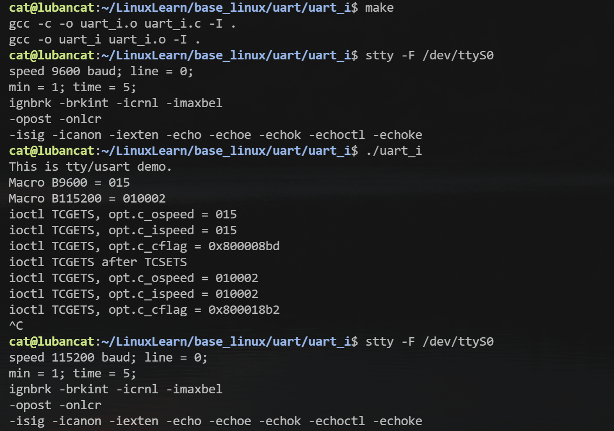

#### 15.7 查看 glibc 源码

怎么知道这些的 `tcgetattr.c` 和 `tcsetattr.c` 是通过 `ioctl` 系统调用实现的，又是如何知道 `c_ispeed` 和 `c_ospeed` 需要通过 `c_cflag` 成员运算得出的？答案是查看源码，我们一直在强调 Linux 是开放的，就看我们如何挖掘这些宝藏了。

既然它们是库函数，那我们就到 glibc 的源码中找找，`glibc` 的源码可以到其官网下载：http://www.gnu.org/software/libc/，下载到源码后，使用 `VS Code` 编辑器的搜索功能，就可以搜到相关的内容，如下图所示。

这两个函数的定义位于`glibc` 源码的如下目录 `glibc/sysdeps/unix/sysv/linux/，`该目录中的 `tcgetattr.c` 和 `tcsetattr.c` 文件分别定义了这两个函数。

```c
int
__tcgetattr (int fd, struct termios *termios_p)
{
  struct __kernel_termios k_termios;
  int retval;

  retval = INLINE_SYSCALL (ioctl, 3, fd, TCGETS, &k_termios);

  if (__glibc_likely (retval == 0))
    {
      termios_p->c_iflag = k_termios.c_iflag;
      termios_p->c_oflag = k_termios.c_oflag;
      termios_p->c_cflag = k_termios.c_cflag;
      termios_p->c_lflag = k_termios.c_lflag;
      termios_p->c_line = k_termios.c_line;
#if _HAVE_STRUCT_TERMIOS_C_ISPEED
# if _HAVE_C_ISPEED
      termios_p->c_ispeed = k_termios.c_ispeed;
# else
      termios_p->c_ispeed = k_termios.c_cflag & (CBAUD | CBAUDEX);
# endif
#endif
#if _HAVE_STRUCT_TERMIOS_C_OSPEED
# if _HAVE_C_OSPEED
      termios_p->c_ospeed = k_termios.c_ospeed;
# else
      termios_p->c_ospeed = k_termios.c_cflag & (CBAUD | CBAUDEX);
# endif
#endif
      if (sizeof (cc_t) == 1 || _POSIX_VDISABLE == 0
	  || (unsigned char) _POSIX_VDISABLE == (unsigned char) -1)
	memset (__mempcpy (&termios_p->c_cc[0], &k_termios.c_cc[0],
			   __KERNEL_NCCS * sizeof (cc_t)),
		_POSIX_VDISABLE, (NCCS - __KERNEL_NCCS) * sizeof (cc_t));
      else
	{
	  memcpy (&termios_p->c_cc[0], &k_termios.c_cc[0],
		  __KERNEL_NCCS * sizeof (cc_t));

	  for (size_t cnt = __KERNEL_NCCS; cnt < NCCS; ++cnt)
	    termios_p->c_cc[cnt] = _POSIX_VDISABLE;
	}
    }

  return retval;
}
```

### 16. I2C 通讯

#### 16.1 I2C 通讯协议简介

I2C 通讯协议 ( Inter － Integrated Circuit ) 是由 Phiilps 公司开发的，由于它==引脚少，硬件实现简单，可扩展性强，不需要 USART、CAN 等通讯协议的外部收发设备==，被广泛地使用在多个集成电路 ( IC ) 间的通讯。

##### 16.1.1 I2C 物理层

I2C 通讯设备之间的常用连接方式如下图：

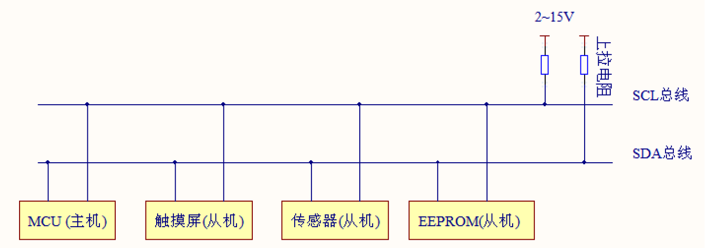

它的物理层有如下特点：

- 它是一个支持多设备的总线。“ 总线 ” 指多个设备共用的信号线。在一个 I2C 通讯总线中，可连接多个 I2C 通讯设备，**支持多个通讯主机及多个通讯从机**。
- 一个 I2C 总线只使用两条总线线路，一条双向串行数据线 ( SDA ) ，一条串行时钟线( SCL )。数据线即用来表示数据，时钟线用于数据收发同步。
- 每个连接到总线的设备都有一个独立的设备地址，主机可以利用这个地址进行不同设备之间的访问。其中地址是一个七位或十位的数字。
- 总线通过上拉电阻接到电源。**当 I2C 设备空闲时，会输出高阻态**，而当所有设备都空闲，都输出高阻态时，由上拉电阻把总线拉成高电平。
- 多个主机同时使用总线时，为了防止数据冲突，会利**用仲裁方式决定由哪个设备占用总线**。
- 具有三种传输模式：标准模式传输速率为100kbit/s ，快速模式为400kbit/s ，高速模式下可达3.4Mbit/s，但目前大多I2C 设备尚不支持高速模式。
- 连接到相同总线的 IC 数量受到总线的最大电容 400pF 限制。

##### 16.1.2 I2C 协议层

I2C 的协议定义了通讯的起始和停止信号、数据有效性、响应、仲裁、时钟同步和地址广播等环节。

###### 16.1.2.1 I2C 基本读写过程

I2C 通讯过程的基本结构，它的通讯过程常有如下三种方式：


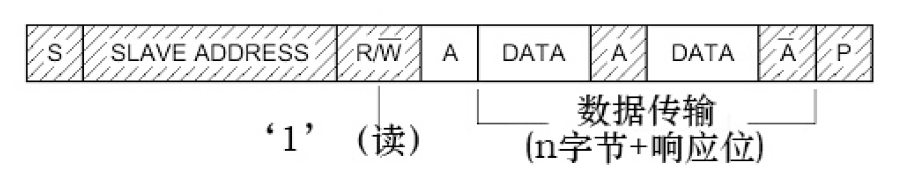

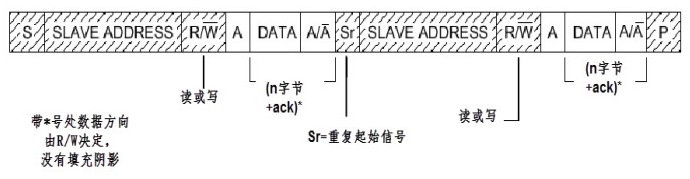

图例：


这些图表示的是主机和从机通讯时，SDA 线的数据包序列。

1. 其中S 表示由主机的 I2C 接口产生的传输起始信号 ( S )，这时连接到 I2C 总线上的所有从机都会接收到这个信号。
2. 起始信号产生后， 所有从机就开始等待主机紧接下来广播的从机地址信号
    ( SLAVE_ADDRESS )。在 I2C 总线上，每个设备的地址都是唯一的，当主机广播的地址与某个设备地址相同时，这个设备就被选中了，没被选中的设备将会忽略之后的数据信号。根据 I2C 协议，这个从机地址可以是 7 位或 10 位。
3. 在地址位之后，是传输方向的选择位，该位为 0，表示后面的数据传输方向是由主机传输至从机，即主机向从机写数据。该位为 1，则相反，即主机由从机读数据。
4. 从机接收到匹配的地址后，主机或从机会返回一个应答 ( ACK ) 或非应答 ( NACK ) 信号，只有接收到应答信号后，主机才能继续发送或接收数据。

写数据方向：

若配置的方向传输位为 “ 写数据 ” 方向，即第一幅图的情况，广播完地址，接收到应答信号后，主机开始正式向从机传输数据 ( DATA ) ，==数据包的大小为 8 位，主机每发送完一个字节数据，都要等待从机的应答信号 ( ACK )，重复这个过程，可以向从机传输 N 个数据，这个 N 没有大小限制==。当数据传输结束时，主机向从机发送一个停止传输信号( P )，表示不再传输数据。

读数据方向：

若配置的方向传输位为 “ 读数据 ” 方向，即第二幅图的情况，广播完地址，接收到应答信号后，从机开始向主机返回数据 ( DATA ) ，数据包大小也为 8 位，从机每发送完一个数据，都会等待主机的应答信号 ( ACK )，重复这个过程，可以返回 N 个数据，这个 N 也没有大小限制。==当主机希望停止接收数据时，就向从机返回一个非应答信号(NACK)，则从机自动停止数据传输。==

复合格式：

除了基本的读写，I2C 通讯更常用的是复合格式，即第三幅图的情况，该传输过程有==两次起始信号 ( S )== 。一般在第一次传输中，主机通过 SLAVE_ADDRESS 寻找到从设备后，发送一段 “ 数据 ”，这段数据通常用于表示从设备内部的寄存器或存储器地址 ( 注意区分它与 SLAVE_ADDRESS 的区别 )；在第二次的传输中，对该地址的内容进行读或写。也就是说，==第一次通讯是告诉从机读写地址，第二次则是读写的实际内容。==

以上通讯流程中包含的起始、停止、数据有效性、地址和数据方向以及响应的说明按小节如下。

###### 16.1.2.2 通讯的起始和停止信号

前文中提到的起始 ( S ) 和停止 ( P ) 信号是两种特殊的状态，起始和停止信号一般由主机产生。如下图：

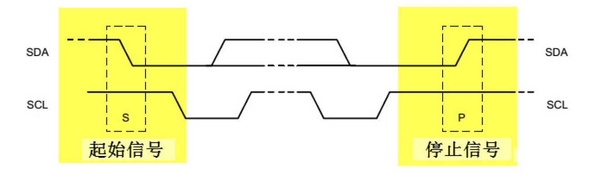

- 当 **SCL 线是高电平**时 **SDA 线从高电平向低电平切换**，这个情况表示通讯的起始。

- 当 **SCL 是高电平**时 **SDA 线由低电平向高电平切换**，表示通讯的停止。

###### 16.1.2.3 数据有效性

I2C 使用 SDA 信号线来传输数据，使用 SCL 信号线进行数据同步，如下图。SDA 数据线在 SCL 的每个时钟周期传输一位数据。

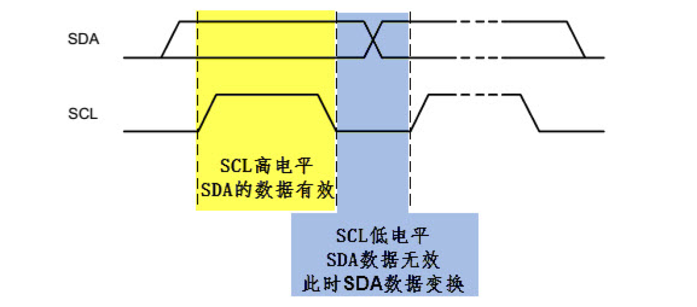

- 传输时，SCL 为高电平的时候 SDA 表示的数据有效，即此时的 SDA 为高电平时表示数据 “ 1 ”，为低电平时表示数据 “ 0 ”。
- 当SCL 为低电平时，SDA 的数据无效，一般在这个时候 SDA 进行电平切换，为下一次表示数据做好准备。

每次数据传输都以字节为单位，每次传输的字节数不受限制。

###### 16.1.2.4 地址及数据方向

I2C 总线上的每个设备都有自己的独立地址，主机发起通讯时，通过 SDA 信号线发送设备地址 ( SLAVE_ADDRESS ) 来查找从机。I2C 协议规定设备地址可以是 7 位或 10 位，实际中 7 位的地址应用比较广泛。

紧跟设备地址的一个数据位用来表示数据传输方向，它是数据方向位 ( R/ )，第 8 位或第 11 位。**数据方向位为 “ 1 ” 时表示主机由从机读数据，该位为 “ 0 ” 时表示主机向从机写数据。**

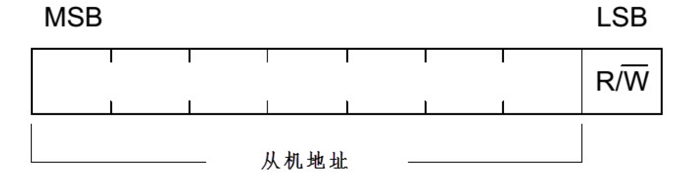

- 读数据方向时，主机会释放对 SDA 信号线的控制，由从机控制 SDA 信号线，主机接收信号。
- 写数据方向时，SDA 由主机控制，从机接收信号。

###### 16.1.2.5 响应

I2C 的数据和地址传输都带响应。响应包括 “ 应答( ACK ) ” 和 “ 非应答 ( NACK ) ” 两种信号。作为数据接收端时，当设备 ( 无论主从机 ) 接收到 I2C 传输的一个字节数据或地址后：

- 若希望对方**继续发送数据**，则需要向对方发送 “ **应答( ACK )** ” 信号，发送方会继续发送下一个数据；
- 若接收端希望**结束数据传输**，则向对方发送 “ **非应答( NACK )** ” 信号，发送方接收到该信号后会产生一个停止信号，结束信号传输。如下图。

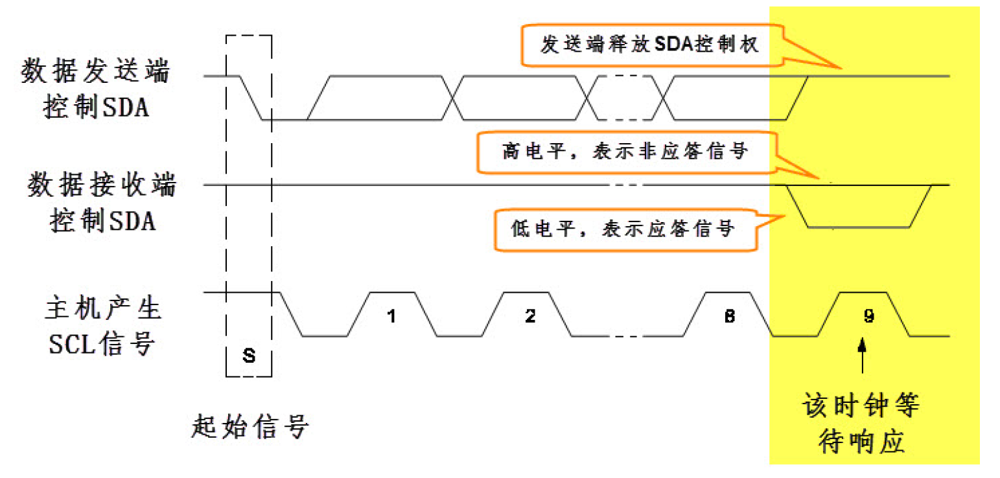

传输时主机产生时钟，在第 9 个时钟时，数据发送端会释放 SDA 的控制权，由数据接收端控制 SDA，若 SDA 为高电平，表示非应答信号 ( NACK )，低电平表示应答信号( ACK )。

#### 16.2 LubanCat4 板卡 I2C 引脚

LubanCat 4 板子有 5 个 I2C 外设，分别是 I2C-2, I2C-3, I2C-5, I2C-6, I2C-8。

|   I2C    | 物理引脚 | 功能              |
| :------: | :------: | ----------------- |
| I2C2-SCL |    11    | I2C2 的时钟信号线 |
| I2C2-SDA |    7     | I2C2 的数据线     |
| I2C3-SCL |    31    | I2C3 的时钟信号线 |
| I2C3-SDA |    37    | I2C3 的数据线     |
| I2C5-SCL |    5     | I2C5 的时钟信号线 |
| I2C5-SDA |    3     | I2C5 的数据线     |
| I2C6-SCL |    28    | I2C6 的时钟信号线 |
| I2C6-SDA |    27    | I2C6 的数据线     |
| I2C8-SCL |    12    | I2C8 的时钟信号线 |
| I2C8-SDA |    32    | I2C8 的数据线     |

如下图：

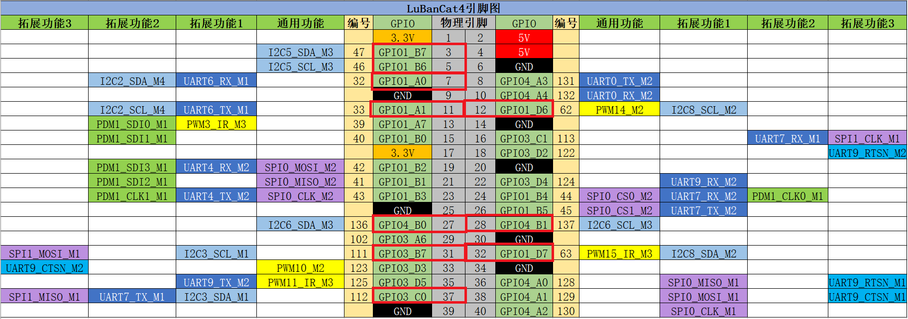

#### 16.3 使能 IIC 通信接口

IIC 接口在默认情况是关闭状态的，需要使能才能使用

###### 方法一

使用 `fire-config` 可视化配置工具：

```bash
sudo fire-config
```

###### 方法二

配置 `/boot/uEnv/board.txt` 文件，启用 I2C 相关设备树插件。

两个方法任选其一配置完后重启系统：

```bash
sync
sudo reboot
```

#### 16.4 检查 IIC 设备

```bash
ls /dev/i2c-*
```


#### 16.5 连接设备

> 以 MPU6050 为例

```tex
  板子      ------   MPU6050
 3.3V(1)   ------     VCC
 GND(6)    ------     GND
 SCL(11)   ------     SCL
 SDA(7)    ------     SDA
```

#### 16.6 IIC 第三方工具 - i2c-tools

使用 i2c-tools 工具包提供了一些非常方便的工具来对系统的 I2C 总线进行调试，在板卡的终端中可直接执行以下命令进行安装：

```bash
sudo apt install i2c-tools wget gcc -y
```

安装后可使用的命令有 `i2cdetect`、`i2cdump`、`i2cset` 以及 `i2cget`, 用于扫描 I2C 总线上的设备、读写指定设备的寄存器等。

##### 16.6.1 i2cdetect 其他命令

- `i2cdetect -F i2cbus` ：查询 I2C 总线的功能，参数 `i2cbus` 表示 I2C 总线
- `i2cdetect -V`：打印软件的版本
- `i2cdetect -l`：检测当前系统有几组 I2C 总线

###### 16.6.1.1 i2cget 命令

`i2cget` ： 读取指定 IIC 设备的某个寄存器的值

```bash
i2cget [-f] [-y] i2cbus chip-address [data-address [mode]]
```

参数说明：

- `f` ：强制访问设备。
- `y` ：关闭交互模式，使用该参数时，不会提示警告信息。

- `i2cbus` ：指定 i2c 总线的编号
- `chip-address` ：i2c 设备地址
- `data-address` ：设备的寄存器的地址
- `mode` ：参考 `i2cdump` 命令。

###### 16.6.1.2 i2cset 命令

`i2cset` : 写入指定 IIC 设备的某个寄存器的值

```
i2cset [-f] [-y] [-m mask] [-r] i2cbus chip-address data-address [value] ⋯[mode]
```

参数说明：

- `f` ：强制访问设备。
- `y` ：关闭交互模式，使用该参数时，不会提示警告信息。
- `m` ：
- `r` ：写入后立即回读寄存器值，并将结果与写入的值进行比较。
- `i2cbus` ：指定 i2c 总线的编号
- `chip-address` ：i2c 设备地址
- `data-address` ：设备的寄存器的地址
- `value` ：要写入寄存器的值
- `mode` ：参考 `i2cdump` 命令

###### 16.6.1.3 i2cdump 命令

`i2cdump` ：读取指定设备的全部寄存器的值。

```
i2cdump [-f] [-r first-last] [-y] i2cbus address [mode [bank [bankreg]]]
```

参数说明：

- `r` ：指定寄存器范围，只扫描从first 到last 区域；
- `f` ：强制访问设备。
- `y` ：关闭人机交互模式；
- `i2cbus` ：指定i2c 总线的编号
- `address` ：指定设备的地址
- `mode`：指定读取的大小，可以是 b, w, s 或i，分别对应了字节，字，SMBus 块, I2C 块

`i2cdump -V` ：打印软件的版本号

查看挂载在 `i2c-2`  上的器件情况，输出内容如下所示：

```bash
sudo -i
i2cdetect -a 2
```

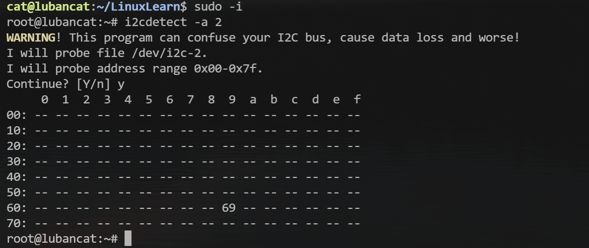

其中 `69` 是为 MPU6050 的设备地址，常用的命令还有以下几个：

检测当前系统有几组 i2c 总线：

```bash
i2cdetect -l
```

查看 i2c-2 接口上的设备：

```bash
i2cdetect -a 2
```

读取指定设备的全部寄存器的值：

```bash
i2cdump -f -y 3 0x68
```

读取指定 IIC 设备的某个寄存器的值，如下读取地址为 `0x68` 器件中的 `0x01` 寄存器值：

```
i2cget -f -y 3 0x68 0x01
```

写入指定 IIC 设备的某个寄存器的值，如下设置地址为 `0x68` 器件中的 `0x01` 寄存器值为 `0x6f`：

```
i2cset -f -y 3 0x68 0x01 0x6f
```

#### 16.7 读取陀螺仪传感器（MPU6050）数据实验

##### 16.7.1 ioctl 函数

在编写应用程序时需要使用 `ioctl` 函数设置 i2c 相关配置，其函数原型如下：

```c
#include <sys/ioctl.h>

int ioctl(int fd, unsigned long request, ...);
```

其中对于终端 `request` 的值常用的有以下几种：

|       值        | 功能                                      |
| :-------------: | ----------------------------------------- |
|   I2C_RETRIES   | 设置收不到 ACK 时的重试次数，默认为1      |
|   I2C_TIMEOUT   | 设置超时时限的 jiffies                    |
|    I2C_SLAVE    | 设置从机地址                              |
| I2C_SLAVE_FORCE | 强制设置从机地址                          |
|   I2C_TENBIT    | 选择地址长度 0 为 7 位地址，非 0 为 10 位 |

##### 16.7.2 编写应用程序

根据 ioctl 相关参数即可编写与 i2c 相关的接口函数，读取 mpu6050 原始数据程序如下：

```c
// path: bash_linux/i2c/i2c_mpu6050/i2c_mpu6050.h
#ifndef   __I2C_MPU6050_H__
#define   __I2C_MPU6050_H__

#include <stdint.h>

/* Register Map */
#define SMPLRT_DIV 0x19
#define PWR_MGMT_1 0x6B
#define CONFIG 0x1A
#define ACCEL_CONFIG 0x1C

#define ACCEL_XOUT_H 0x3B
#define ACCEL_XOUT_L 0x3C
#define ACCEL_YOUT_H 0x3D
#define ACCEL_YOUT_L 0x3E
#define ACCEL_ZOUT_H 0x3F
#define ACCEL_ZOUT_L 0x40
#define GYRO_XOUT_H 0x43
#define GYRO_XOUT_L 0x44
#define GYRO_YOUT_H 0x45
#define GYRO_YOUT_L 0x46
#define GYRO_ZOUT_H 0x47
#define GYRO_ZOUT_L 0x48

// Slave Address MPU6050
#define Address 0x69

// Function Prototypes
int mpu6050_init(int fd, uint8_t addr);
int i2c_write(int fd, uint8_t addr, uint8_t reg, uint8_t val);
int i2c_read(int fd, uint8_t addr, uint8_t reg, uint8_t *val);
short GetData(int fd, uint8_t addr, unsigned char REG_Adddress);

#endif // __I2C_MPU6050_H__
```

```c
// path: bash_linux/i2c/i2c_mpu6050/i2c_mpu6050.c
#include <stdio.h>
#include <stdlib.h>
#include <unistd.h>
#include <sys/types.h>
#include <sys/stat.h>
#include <fcntl.h>
#include <linux/i2c.h>
#include <linux/i2c-dev.h>
#include <sys/ioctl.h>
#include "i2c_mpu6050.h"

int main(int argc, char *argv[])
{
    int fd;
    fd = I2C_SLAVE;

    if (argc < 2) {
        printf("Wrong use!!!\n");
        printf("Usage: %s <dev>\n", argv[0]);
        return -1;
    }

    // Open file and enable read and write operations
    fd = open(argv[1], O_RDWR);
    if (fd < 0){
        printf("Error opening file: %s\n", argv[1]);
        exit(1);
    }

    mpu6050_init(fd, Address);

    while(1)
    {
        usleep(1000 * 10);
        printf("ACCE_X: %6d\n", GetData(fd, Address, ACCEL_XOUT_H));
        usleep(1000 * 10);
        printf("ACCE_Y: %6d\n", GetData(fd, Address, ACCEL_YOUT_H));
        usleep(1000 * 10);
        printf("ACCE_Z: %6d\n", GetData(fd, Address, ACCEL_ZOUT_H));
        usleep(1000 * 10);
        printf("GTRO_X: %6d\n", GetData(fd, Address, GYRO_XOUT_H));
        usleep(1000 * 10);
        printf("GTRO_Y: %6d\n", GetData(fd, Address, GYRO_YOUT_H));
        usleep(1000 * 10);
        printf("GTRO_Z: %6d\n\n", GetData(fd, Address, GYRO_ZOUT_H));
        sleep(1);
    }

    close(fd);
    return 0;
}

/**
 * @brief MPU6050 Init
 *
 * @param fd device file descriptor
 * @param addr address of the device
 * @return int 
 */
int mpu6050_init(int fd, uint8_t addr)
{
    i2c_write(fd, addr, PWR_MGMT_1, 0x00);
    i2c_write(fd, addr, SMPLRT_DIV, 0x07);
    i2c_write(fd, addr, CONFIG, 0x06);
    i2c_write(fd, addr, ACCEL_CONFIG, 0x01);
    return 0;
}

/**
 * @brief I2C write function
 * 
 * @param fd device file descriptor
 * @param addr address of the device
 * @param reg register address
 * @param val value to be written
 * @return int returns 0 if successful, -1 otherwise
 */
int i2c_write(int fd, uint8_t addr, uint8_t reg, uint8_t val)
{
    int retries;
    uint8_t data[2];

    data[0] = reg;
    data[1] = val;

    // Set address length: 0 express 7 bit address
    ioctl (fd, I2C_TENBIT, 0);

    // Set slave address
    if (ioctl(fd, I2C_SLAVE, addr) < 0)
    {
        printf("Error setting slave address\n");
        close(fd);
        return -1;
    }


    ioctl(fd, I2C_RETRIES, 5);

    if (write(fd, data, 2) == 2){
        return 0;
    }
    else{
        return -1;
    }
}

/**
 * @brief I2C read function
 *
 * @param fd device file descriptor
 * @param addr address of the device
 * @param reg register address
 * @param val values
 * @return int returns 0 if successful, -1 otherwise
 */
int i2c_read(int fd, uint8_t addr, uint8_t reg, uint8_t *val)
{
    int retries;

    // Set address length: 0 express 7 bit address
    ioctl(fd, I2C_TENBIT, 0);

    // Set slave address
    if (ioctl(fd, I2C_SLAVE, addr) < 0)
    {
        printf("Error setting slave address\n");
        close(fd);
        return -1;
    }

    ioctl(fd, I2C_RETRIES, 5);

    if (write(fd, &reg, 1) == 1){
        if (read(fd, val, 1) == 1){
            return 0;
        }
    }
    else{
        return -1;
    }
}

/**
 * @brief Get the Data object
 *
 * @param fd device file descriptor
 * @param addr address of the device
 * @param REG_Address 
 * @return short 
 */
short GetData(int fd, uint8_t addr, unsigned char REG_Address)
{
    char H, L;

    i2c_read(fd, addr, REG_Address, &H);
    usleep(1000);
    i2c_read(fd, addr, REG_Address + 1, &L);
    return (H << 8) + L;
}
```

Makefile 文件：

```makefile
TARGET = i2c_mpu6050
CC = gcc
CFLAGS = -I .
OBJS = $(TARGET).o
BUILD_DIR = build
DEPS = $(TARGET).h

$(TARGET): $(OBJS)
	$(CC) -o $@ $^ $(CFLAGS)
	@mkdir -p $(BUILD_DIR)
	@mv *.o $(BUILD_DIR)
	@cp $(TARGET) $(BUILD_DIR)

%.o: %.c $(DEPS)
	$(CC) -c -o $@ $< $(CFLAGS)

.PHONY: clean

clean:
	rm -rf $(BUILD_DIR) $(TARGET)
```

编译并运行：

```bash
make
sudo ./i2c_mpu6050 /dev/i2c-2
```

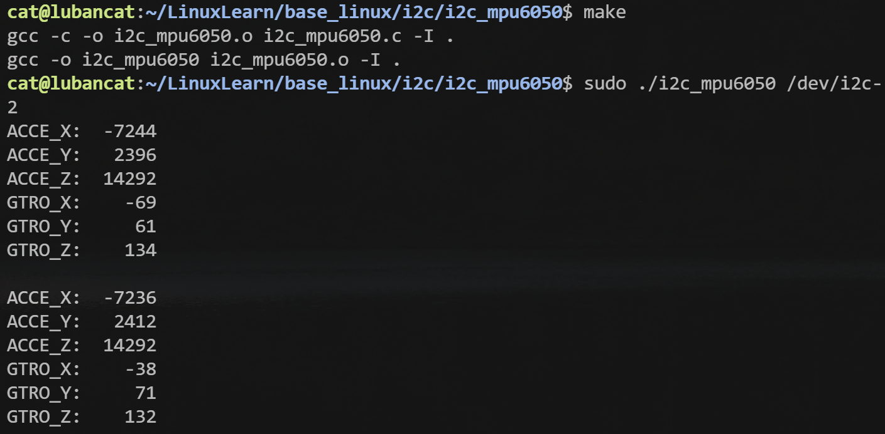

### 17. SPI 通信

#### 17.1 SPI 通讯协议简介

SPI 协议是由摩托罗拉公司提出的通讯协议 ( Serial Peripheral Interface )，即串行外围设备接口，是一种高速全双工的通信总线。它被广泛地使用在 ADC、LCD 等设备与 MCU 间，要求通讯速率较高的场合。

##### 17.1.1 SPI 物理层

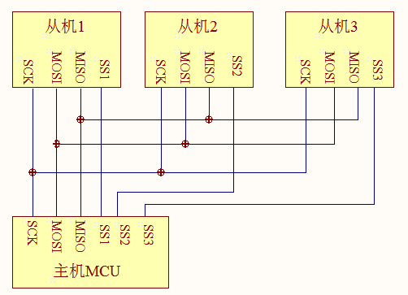

SPI 通讯使用 3 条总线及片选线，3 条总线分别为 SCK、MOSI、MISO，片选线为，它们的作用介绍如下：

- **( Slave Select )** ：从设备选择信号线，常称为片选信号线，也称为 NSS、CS，以下用 NSS 表示。当有多个 SPI 从设备与 SPI 主机相连时，设备的其它信号线 SCK、MOSI 及 MISO 同时并联到相同的 SPI 总线上，即无论有多少个从设备，都共同只使用这3 条总线；而每个从设备都有独立的这一条 NSS 信号线，本信号线独占主机的一个引脚，即有多少个从设备，就有多少条片选信号线。I2C 协议中通过设备地址来寻址、选中总线上的某个设备并与其进行通讯；而 SPI 协议中没有设备地址，它**使用 NSS 信号线来寻址**，当主机要选择从设备时，把该从设备的NSS 信号线设置为低电平，该从设备即被选中，即片选有效，接着主机开始与被选中的从设备进行 SPI 通讯。所以 SPI 通讯**以 NSS 线置低电平为开始信号，以 NSS 线被拉高作为结束信号。**
- **SCK (Serial Clock)** ：时钟信号线，用于通讯数据同步。它由通讯主机产生，决定了通讯的速率，不同的设备支持的最高时钟频率不一样，如 RT1052 的SPI 时钟频率最大为 $f_{pclk}/2$，两个设备之间通讯时，通讯速率受限于低速设备。
- **MOSI (Master Output，Slave Input)** ：主设备输出/从设备输入引脚。主机的数据从这条信号线输出，从机由这条信号线读入主机发送的数据，即这条线上数据的方向为**主机到从机**。
- **MISO(Master Input,，Slave Output)** ：主设备输入/从设备输出引脚。主机从这条信号线读入数据，从机的数据由这条信号线输出到主机，即在这条线上数据的方向为**从机到主机**。

##### 17.1.2 SPI 协议层

与 I2C 的类似，SPI 协议定义了通讯的起始和停止信号、数据有效性、时钟同步等环节。

###### 17.1.2.1 SPI 基本通讯过程

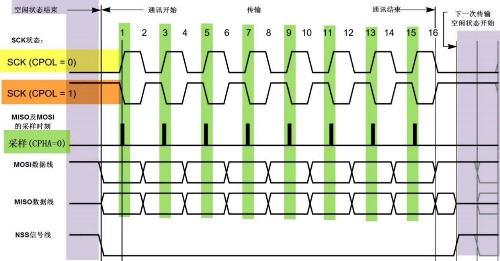

这是一个主机的通讯时序。NSS、SCK、MOSI 信号都由主机控制产生，而 MISO 的信号由从机产生，主机通过该信号线读取从机的数据。MOSI 与 MISO 的信号只在 NSS 为低电平的时候才有效，在 SCK 的每个时钟周期 MOSI 和 MISO 传输一位数据。

###### 17.1.2.2 通讯的起始和停止信号

在上图中的标号处，NSS 信号线由高变低，是 SPI 通讯的起始信号。NSS 是每个从机各自独占的信号线，当从机检在自己的 NSS 线检测到起始信号后，就知道自己被主机选中了，开始准备与主机通讯。在图中的标号处，NSS 信号由低变高，是 SPI 通讯的停止信号，表示本次通讯结束，从机的选中状态被取消。

###### 17.1.2.3 数据有效性

SPI 使用 MOSI 及 MISO 信号线来传输数据，使用 SCK 信号线进行数据同步。MOSI 及 MISO 数据线在 SCK 的每个时钟周期传输一位数据，且数据输入输出是同时进行的。数据传输时，MSB 先行或 LSB 先行并没有作硬性规定，但要保证两个 SPI 通讯设备之间使用同样的协定，一般都会采用上图中的 MSB 先行模式。

观察图中的标号处，MOSI 及 MISO 的数据在 SCK 的上升沿期间变化输出，在SCK 的下降沿时被采样。即在 SCK 的下降沿时刻，MOSI 及 MISO 的数据有效，高电平时表示数据 “1”，为低电平时表示数据 “0”。在其它时刻，数据无效，MOSI 及 MISO 为下一次表示数据做准备。SPI 每次数据传输可以 8 位或 16 位为单位，每次传输的单位数不受限制。

###### 17.1.2.4 CPOL/CPHA 及通讯模式

上面讲述的图中的时序只是 SPI 中的其中一种通讯模式，SPI 一共有四种通讯模式，它们的主要区别是总线空闲时 SCK 的时钟状态以及数据采样时刻。为方便说明，在此引入 “ 时钟极性 CPOL ” 和 “ 时钟相位 CPHA ” 的概念。

- 时钟极性 CPOL 是指 SPI 通讯设备处于空闲状态时，SCK 信号线的电平信号 ( 即 SPI 通讯开始前、NSS 线为高电平时 SCK 的状态)。CPOL=0 时，SCK 在空闲状态时为低电平，CPOL=1 时，则相反。
- 时钟相位 CPHA 是指数据的采样的时刻，当 CPHA=0 时，MOSI 或 MISO 数据线上的信号将会在 SCK 时钟线的 “ **奇数边沿** ” 被采样。当 CPHA=1 时，数据线在 SCK 的 “ **偶数边沿** ” 采样。

如下图：

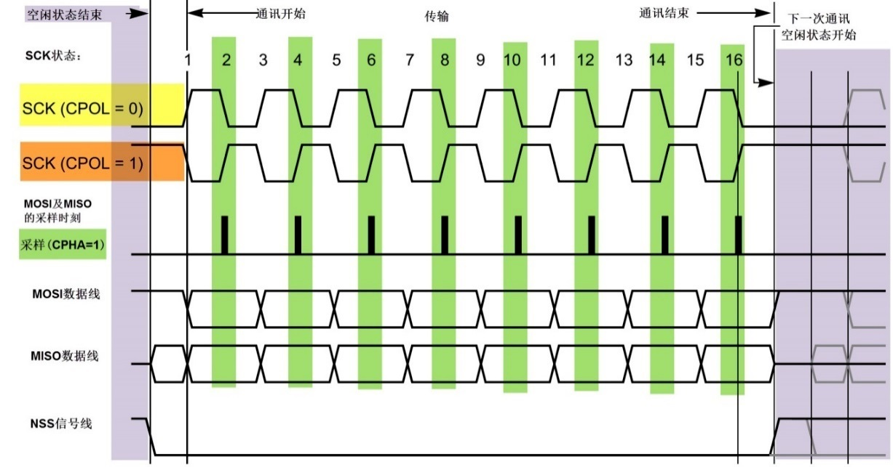

我们来分析这个 CPHA=0 的时序图。首先，根据 SCK 在空闲状态时的电平，分为两种情况。SCK 信号线在空闲状态为低电平时，CPOL=0；空闲状态为高电平时，CPOL=1。

无论 CPOL=0 还是 =1，因为我们配置的时钟相位 CPHA=0，在图中可以看到，采样时刻都是在 SCK 的奇数边沿。注意当 CPOL=0 的时候，时钟的奇数边沿是上升沿，而 CPOL=1 的时候，时钟的奇数边沿是下降沿。所以 SPI 的采样时刻不是由上升/下降沿决定的。MOSI 和 MISO 数据线的有效信号在 SCK 的奇数边沿保持不变，数据信号将在 SCK 奇数边沿时被采样，在非采样时刻，MOSI 和MISO 的有效信号才发生切换。

类似地，当 CPHA=1 时，不受 CPOL 的影响，数据信号在 SCK 的偶数边沿被采样。

如下图：

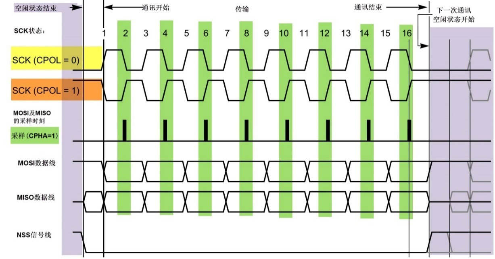

由 CPOL 及 CPHA 的不同状态，SPI 分成了四种模式，见下表，主机与从机需要工作在相同的模式下才可以正常通讯，实际中采用较多的是 “ 模式 0 ” 与 “ 模式 3 ”。

| SPI 模式 | CPOL | CPHA | 空闲时 SCK 时钟 | 采样时刻 |
| :------: | :--: | :--: | :-------------: | :------: |
|    0     |  0   |  0   |     低电平      | 奇数边沿 |
|    1     |  0   |  1   |     低电平      | 偶数边沿 |
|    2     |  1   |  0   |     高电平      | 奇数边沿 |
|    3     |  1   |  1   |     高电平      | 偶数边沿 |

##### 17.1.3 扩展SPI 协议（Single/Dual/Quad/Octal SPI）

以上介绍的是经典 SPI 协议的内容，这种也被称为标准 SPI 协议（ Standard SPI ）或单线SPI 协议（ Single SPI ），其中的单线是指该 SPI 协议中使用单根数据线 MOSI 进行发送数据，单根数据线 MISO 进行接收数据。

为了适应更高速率的通讯需求，半导体厂商扩展 SPI 协议，主要发展出了Dual/Quad/Octal SPI 协议，加上标准 SPI 协议（ Single SPI ），这四种协议的**主要区别是数据线的数量及通讯方式**，具体见下表。

|         协议          |  数据线数量及功能   | 通讯方式 |
| :-------------------: | :-----------------: | :------: |
| Single SPI（标准SPI） | 1 根发送，1 根接收  |  全双工  |
|  Dual SPI（双线SPI）  | 收发共用 2 根数据线 |  半双工  |
|  Quad SPI（四线SPI）  | 收发共用 4 根数据线 |  半双工  |
| Octal SPI（八线SPI）  | 收发共用 8 根数据线 |  半双工  |

扩展的三种 SPI 协议都是半双工的通讯方式，也就是说它们的数据线是分时进行收发数据的。例如，标准 SPI（Single SPI）与双线 SPI（Dual SPI）都是两根数据线，但标准 SPI（Single SPI）的其中一根数据线只用来发送，另一根数据线只用来接收，即全双工；而双线 SPI（Dual SPI）的两根线都具有收发功能，但在同一时刻只能是发送或者是接收，即半双工，四线 SPI（Quad SPI）和八线 SPI（Octal SPI）与双线 SPI（Dual SPI）类似，只是数据线量的区别。

###### 17.1.3.1 SDR 和 DDR 模式

扩展的 SPI 协议还增加了 SDR 模式（ 单倍速率Single Data Rate ）和 DDR 模式（ 双倍速率DoubleData Rate）。例如在标准 SPI 协议的 SDR 模式下，只在 SCK 的单边沿进行数据传输，即一个 SCK时钟只传输一位数据；而在它的 DDR 模式下，会在 SCK 的上升沿和下降沿都进行数据传输，即一个 SCK 时钟能传输两位数据，传输速率提高一倍。

#### 17.2 SPI 相关数据结构与 ioctl 函数

编写应用程序需要使用到 `spi_ioc_transfer` 结构体，如下所示：

```c
struct spi_ioc_transfer {
	__u64 tx_buf; //发送数据缓存
	__u64 rx_buf; //接收数据缓存
    __u32 len; //数据长度
	__u32 speed_hz; //通讯速率

	__u16 delay_usecs; //两个spi_ioc_transfer 之间的延时，微秒
	__u8 bits_per_word; //数据长度
	__u8 cs_change; //取消选中片选
	__u8 tx_nbits; //单次数据宽度(多数据线模式)
	__u8 rx_nbits; //单次数据宽度(多数据线模式)
	__u16 pad;
};
```

在编写应用程序时还需要使用 `ioctl` 函数设置 `spi` 相关配置，其函数原型如下:

```c
#include <sys/ioctl.h>

int ioctl(int fd, unsigned long request, ...);
```

其中对于终端 request 的值常用的有以下几种：

|        request 值        | 功能                                                         |
| :----------------------: | ------------------------------------------------------------ |
|    SPI_IOC_RD_MODE32     | 设置读取 SPI 模式(对应上文的 SPI 的四种模式的表格，SPI_MODE_x) |
|    SPI_IOC_WR_MODE32     | 设置写入 SPI 模式(对应上文的 SPI 的四种模式的表格，SPI_MODE_x) |
|   SPI_IOC_RD_LSB_FIRST   | 设置 SPI 读取数据模式 ( LSB 先行返回 1 )                     |
|   SPI_IOC_WR_LSB_FIRST   | 设置 SPI 写入数据模式。( 0 : MSB，非 0 ：LSB)                |
| SPI_IOC_RD_BITS_PER_WORD | 设置 SPI 读取设备的字长                                      |
| SPI_IOC_WR_BITS_PER_WORD | 设置 SPI 写入设备的字长                                      |
| SPI_IOC_RD_MAX_SPEED_HZ  | 设置读取 SPI 设备的最大通信频率                              |
| SPI_IOC_WR_MAX_SPEED_HZ  | 设置写入 SPI 设备的最大通信速率                              |
|    SPI_IOC_MESSAGE(N)    | 一次进行双向/多次读写操作                                    |

SPI 的读取和写入可以设置为不同的参数。

#### 17.3 LubanCat4 板卡 spi 接口

40pin 引脚中只有一组 spi 接口 SCK，MOSI，MISO, 有两个默认片选信号CS0，CS1。

LubanCat4 使用 `spi0`。`spidev0.0` 控制 `CS0`，`spidev0.1` 控制 `CS1`

|  SPI  | 物理引脚 | 功能                  |
| :---: | :------: | --------------------- |
| MOSI  |    19    | 主设备输出/从设备输入 |
| MISO  |    21    | 主设备输入/从设备输出 |
| CLOCK |    23    | 时钟信号线            |
|  CS0  |    24    | 片选信号线 0          |
|  CS1  |    26    | 片选信号线 1          |

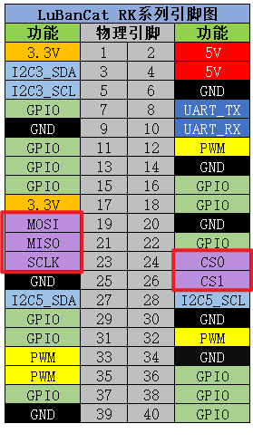

##### 17.3.1 使能 SPI 通信接口

SPI 接口在默认情况是关闭状态的，需要使能才能使用：

```bash
sudo fire-config
```

进入 fire-config 可视化配置界面开启 `spi0-m2` 选项，保存退出后重启系统。

```bash
sudo reboot
```

##### 17.3.2 检查 SPI 设备

```
sudo -i
ls /dev/spi*
```

SPI_0 对应的设备文件是 `spidev0.0` 和 `spidev0.1`:

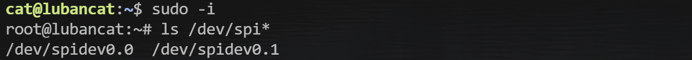`spidev0.0` 和 `spidev0.1` 的区别在于片选信号的不同，`spidev0.0` 使用 CS0 , `spidev0.1` 使用 CS1。

#### 17.4 SPI 回环通讯测试实验

##### 17.4.1 硬件连接

只需要将 SPI0 的 MIOS 与 MOSI 引脚 ( 板卡上的19 和 21) 使用跳线帽短接即可。

##### 17.4.2 编写程序

SPI 代码与上一章的 IIC 非常类似。首先打开 SPI 对应的设备文件，然后写入配置参数，这样就完成了 SPI 的初始化，后面的具体功能实现只需要调用对应的 API 函数即可。

```c
// path: base_linux/spi/spi_selftest/spi_selftest.c
#include <sys/ioctl.h>
#include <sys/types.h>
#include <sys/stat.h>
#include <fcntl.h>
#include <unistd.h>
#include <stdio.h>
#include <stdlib.h>
#include <stdint.h>
#include <linux/spi/spidev.h>

#define SPI_DEV_PATH "/dev/spidev0.0"

unsigned char tx_buffer[100] = "hello the world!";
unsigned char rx_buffer[100];

int fd; /* SPI 控制 */

static unsigned mode = SPI_MODE_2; /* SPI 模式 */
static uint8_t bits = 8;		   /* 通讯过程中一个字节所占的位数 */
static uint32_t speed = 10000000;  /* 通信波特率 */
static uint16_t delay;			   /* 如果不为零则用于设置两次传输之间的时间延迟 */

void transfer(int fd, uint8_t const *tx, uint8_t const *rx, size_t len)
{
    int ret;

    struct spi_ioc_transfer tr = {
        .tx_buf = (unsigned long)tx,
        .rx_buf = (unsigned long)rx,
        .len = len,                   /* 一次传输的数据长度 */
        .delay_usecs = delay,
        .speed_hz = speed,
        .bits_per_word = bits,
        .tx_nbits = 1,                /* 写数据宽度，支持1,2,4位宽度,默认1或0(0表示宽度为1) */
        .rx_nbits = 1
    };

    ret = ioctl(fd, SPI_IOC_MESSAGE(1), &tr); /* SPI_IOC_MESSAGE(1)中的1表示传输次数 */
    if (ret < 1)
        printf("can't send spi message\n");
}

void spi_init(void)
{
    int ret = 0;

    fd = open(SPI_DEV_PATH, O_RDWR);
    if (fd < 0)
        printf("can't open %s\n", SPI_DEV_PATH);

    ret = ioctl(fd, SPI_IOC_WR_MODE32, &mode);
    if (ret == -1)
        printf("can't set spi mode\n");

    ret = ioctl(fd, SPI_IOC_WR_BITS_PER_WORD, &bits);
    if (ret == -1)
        printf("can't set bits per word\n");

    ret = ioctl(fd, SPI_IOC_WR_MAX_SPEED_HZ, &speed);
    if (ret == -1)
        printf("can't set max speed hz\n");

    printf("spi mode: 0x%x\n", mode);
    printf("bits per word: %d\n", bits);
    printf("max speed: %d Hz (%d KHz)\n", speed, speed / 1000);
}

int main(int argc, char *argv[])
{
    spi_init();

    transfer(fd, tx_buffer, rx_buffer, sizeof(tx_buffer));

    printf("tx_buffer: \n %s\n", tx_buffer);
    printf("rx_buffer: \n %s\n", rx_buffer);

    close(fd);
    return 0;
}

```

Makefile 文件：

```makefile
# path: base_linux/spi/spi_selftest/Makefile
TARGET = spi_selftest
CC = gcc
CFLAGS = -I .
OBJS = $(TARGET).o
BUILD_DIR = build
DEPS = 

$(TARGET): $(OBJS)
	$(CC) -o $@ $^ $(CFLAGS)
	@mkdir -p $(BUILD_DIR)
	@mv *.o $(BUILD_DIR)
	@cp $(TARGET) $(BUILD_DIR)

%.o: %.c $(DEPS)
	$(CC) -c -o $@ $< $(CFLAGS)

.PHONY: clean

clean:
	rm -rf $(BUILD_DIR) $(TARGET)
```

##### 17.4.3 编译 & 运行

```bash
make
sudo ./spi_selftest
```

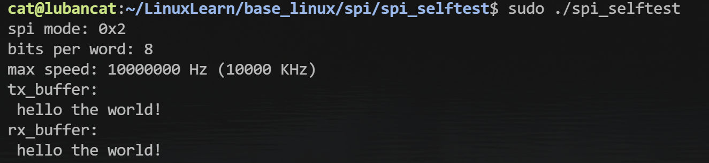

###  18. PWM（脉宽调制）

#### 18.1 脉宽调制

##### 18.1.1 什么是 PWM

PWM（Pulse Width Modulation）简称脉宽调制，是利用微处理器的数字输出来对模拟电路进行控制的一种非常有效的技术，广泛应用在测量、通信、工控等方面。

##### 18.1.2 PWM 的频率

是指在 1 秒钟内，信号从高电平到低电平再回到高电平的次数，也就是说一秒钟 PWM 有多少个周期，单位 Hz。

##### 18.1.3 PWM 的周期

$T=1/f$，$T$ 是周期，$f$ 是频率。

如果频率为 50Hz ，也就是说一个周期是 20ms，那么一秒钟就有 50 次 PWM 周期。

##### 18.1.4 占空比

是一个脉冲周期内，高电平的时间与整个周期时间的比例，单位是 % (0%-100%)

一个周期的长度，如下图所示：

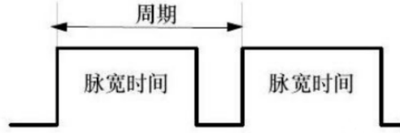

其中，周期是一个脉冲信号的时间，1s 内的周期 $T$ 次数等于频率 $f$，**脉宽时间是指高电平时间**。上图中，脉宽时间占总周期时间的比例，就是占空比。比方说，周期的时间是10ms，脉宽时间是 8ms，那么占空比是 8/10= 80%，这就是占空比为80%的脉冲信号。PWM 就是脉冲宽度调制，通过调节占空比就可以调节脉冲宽度。

##### 18.1.5 PWM 原理

假设高电平为 5V、低电平则为 0V，那么要输出不同的模拟电压就要用到 PWM。通过改变 IO 口输出的方波的占空比，从而获得使用数字信号模拟成的模拟电压信号。电压是以一种脉冲序列被加到模拟负载上去的，接通时是高电平1，断开时是低电平0。接通时直流供电输出，断开时直流供电断开。通过对接通和断开时间的控制，理论上来讲，可以输出任意不大于最大电压值 5V 的模拟电压。比方说，占空比为 50% 那就是高电平时间一半，低电平时间一半。在一定的频率下，就可以得到模拟的 2.5V 输出电压。那么 75% 的占空比，得到的电压就是 3.75V，如下图所示。


#### 18.2 LubanCat4 PWM 引脚

|    板卡    | PIN 12 | PIN 32 | PIN 33 | PIN 35 |
| :--------: | :----: | :----: | :----: | :----: |
| LubanCat 4 | pwm 14 | pwm 15 | pwm 10 | pwm 11 |

##### 18.2.1 使能 PWM 接口功能

```bash
sudo fire-config
sudo reboot
```

使能 `pwm10-m2` 和 `pwm11-ir-m3`：

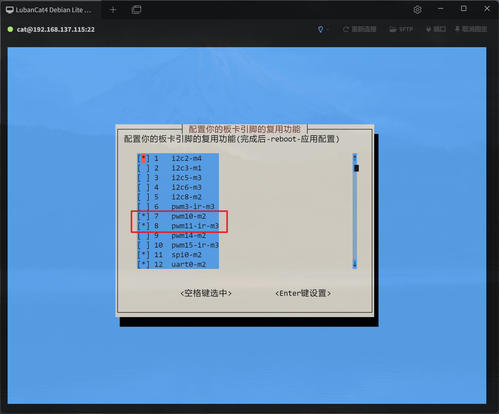

##### 18.2.2 检查 PWM 设备

使能 pwm 通信接口后，可以用以下命令查看 pwm 是否开启：

```bash
ls /sys/class/pwm/
cat /sys/kernel/debug/pwm
```

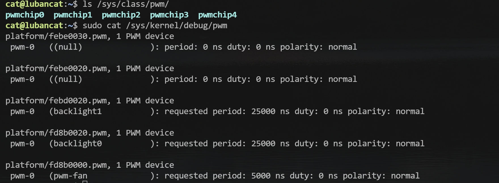

`pwmchip0` 为屏幕的背光，系统默认开启，当开启多个 pwm 设备树插件时，pwm 控制器值越小，系统分配的 pwmchip 越小。

例如同时开启了 `pwm10`，`pwm11`， `pwm14`， 那么会出现以下对应关系：

```
pwm4 -> pwmchip0 (屏幕背光)
pwm10 -> pwmchip1
pwm11 -> pwmchip2
pwm14 -> pwmchip3
```

LubanCat4 系统默认开启风扇的 PWM，以及两个 mipi 屏幕的背光 PWM，如果打开 PWM10
和 PWM11 设备树插件后，效果如上图。

```
pwm0 -> pwmchip0 -> 风扇
pwm2 -> pwmchip1 -> 屏幕背光1
pwm6 -> pwmchip2 -> 屏幕背光2
pwm10 -> pwmship3
pwm11 -> pwmchip4 
```

#### 18.3 PWM 控制方式 (Shell)

下面以 pwm10 为例：

```bash
# 将 pwm10 导出到用户空间
echo 0 > /sys/class/pwm/pwmchip3/export

# 设置 pwm 周期单位为 ns
echo 1000000 > /sys/class/pwm/pwmchip3/pwm0/period

# 设置占空比
echo 500000 > /sys/class/pwm/pwmchip3/pwm0/duty_cycle

# 设置 pwm 极性
echo "normal" > /sys/class/pwm/pwmchip3/pwm0/polarity

# 使能 pwm
echo 1 > /sys/class/pwm/pwmchip3/pwm0/enable

# 如果需要关闭 PWM 则将 pwm10 导出到用户空间
echo 0 > /sys/class/pwm/pwmchip3/unexport
```

##### 18.4 PWM 控制方式 (系统调用)

```c
#include <stdio.h>
#include <stdlib.h>
#include <sys/types.h>
#include <sys/stat.h>
#include <fcntl.h>
#include <unistd.h>
#include <string.h>

static char pwm_path[75];

static int pwm_config(const char *attr, const char *val)
{
    char file_path[100];
    int len;
    int fd;

    sprintf(file_path, "%s/%s", pwm_path, attr);
    if ((fd = open(file_path, O_WRONLY)) < 0) {
        perror("open error");
        return fd;
    }

    len = strlen(val);
    if (len != write(fd, val, len)) {
        perror("write error");
        close(fd);
        return -1;
    }

    close(fd);

    return 0;
}

int main(int argc, char *argv[])
{
    if (4 != argc) {
        fprintf(stderr, "Usage: $s <id> <period> <duty>\n", argv[0]);
        exit(-1);
    }

    printf("PWM config: id<%s>, period<%%s>, duty<%%s>\n", argv[1], argv[2], argv[3]);

    sprintf(pwm_path, "/sys/class/pwm/pwmchip%s/pwm0", argv[1]);
    if (access(pwm_path, F_OK)){
        char temp[100];
        int fd;
        sprintf(temp, "/sys/class/pwm/pwmchip%s/export", argv[1]);
        if (0 > (fd = open(temp, O_WRONLY))) {
            perror("open error");
            exit(-1);
        }

        if (1 != write(fd, "0", 1)) {
            perror("write error");
            close(fd);
            exit(-1);
        }
    }

    if (pwm_config("period", argv[2]))
        exit(-1);

    if (pwm_config("duty_cycle", argv[3]))
        exit(-1);

    pwm_config("enable", "1");
    getchar();

    exit(0);
}
```

- `perror` 用于输出一个描述最近发生错误的错误信息。它将 `errno` 的值转化为相应的错误信息，并将其输出到标准错误（stderr）。通常用在系统调用失败后，帮助开发者了解出错的原因。

- `exit` 用于终止程序的执行，并返回一个状态码给操作系统。状态码通常是 0 表示成功，非 0 表示出错。

    `exit` 与 `return` 的区别：

    **`exit`**：

    - 直接终止程序的执行。
    - 可以在程序的任何地方调用。
    - 不会执行任何在其后定义的代码，包括局部变量的析构。
    - 可以返回到操作系统。

    **`return`**：

    - 用于从函数返回值，特别是在 `main` 函数中，它会结束程序并返回控制给操作系统。
    - 只能在函数内部使用。
    - 会执行函数的返回语句后续的代码（如局部变量的析构等）。

Makefile 文件：

```makefile
TARGET = pwm_test
CC = gcc
CFLAGS = -I .
OBJS = $(TARGET).o
BUILD_DIR = build
DEPS = 

$(TARGET): $(OBJS)
	$(CC) -o $@ $^ $(CFLAGS)
	@mkdir -p $(BUILD_DIR)
	@mv *.o $(BUILD_DIR)
	@cp $(TARGET) $(BUILD_DIR)

%.o: %.c $(DEPS)
	$(CC) -c -o $@ $< $(CFLAGS)

.PHONY: clean

clean:
	rm -rf $(BUILD_DIR) $(TARGET)
```

编译：

```bash
make
```

运行：

```bash
#./pwm_test pwmchip3 周期 占空比
sudo ./pwm_test 3 1000000 500000
```

### 19. 摄像头


### 20. 音频


### 21. 屏幕与触摸


### 22. 屏幕显示（framebuffer）

#### 22.1 framebuffer 介绍

FrameBuffer 中文译名为帧缓冲驱动，它是出现在 2.2.xx 内核中的一种驱动程序接口。主设备号为 29，次设备号递增。

Linux 抽象出 FrameBuffer 这个设备来供用户态进程实现直接写屏。FrameBuffer 机制模仿显卡的功能，将显卡硬件结构抽象掉，可以通过 FrameBuffer 的读写直接对显存进行操作。用户可以将 FrameBuffer 看成是显示内存的一个映像，将其映射到进程地址空间之后，就可以直接进行读写操作，而写操作可以立即反应在屏幕上。这种操作是抽象的，统一的。

用户不必关心物理显存的位置、换页机制等等具体细节，这些都是由 FrameBuffer 设备驱动来完成的。

FrameBuffer 实际上就是嵌入式系统中专门为 GPU 所保留的一块连续的物理内存，LCD 通过专门的总线从 framebuffer 读取数据，显示到屏幕上。

FrameBuffer 本质上是一块显示缓存，往显示缓存中写入特定格式的数据就意味着向屏幕输出内容。所以说FrameBuffer 就是一块白板。

屏幕位置从上到下，从左至右与内存地址是顺序的线性关系：

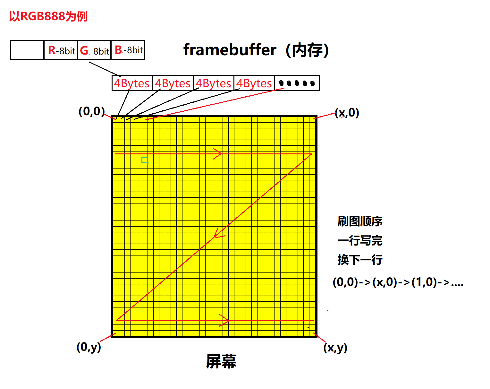

屏幕除了RGB888 的格式外，还具有其他的格式：

```
ARGB888:|AAAAAAAAA|RRRRRRRRR|GGGGGGGG|BBBBBBBB|
RGB888: |         |RRRRRRRRR|GGGGGGGG|BBBBBBBB|
RGB565: |RRRRRRGGG|GGGBBBBB|
RGB555: | RRRRRGGG|GGGBBBBB|
```

#### 22.2 framebuffer 应用程序

> [!NOTE]
>
> 如果使用的是带桌面版的镜像，在使用 framebuffer 前要注意先把图形界面关闭，不然会出现触摸后屏幕不断闪烁的情况。

关闭用户图形界面：

```bash
sudo systemctl set-default multi-user.target
sudo reboot
```

开启用户图形界面：

```bash
sudo systemctl set-default graphical.target
sudo reboot
```

```c
// path: base_linux/screen/framebuffer/framebuffer.c
#include <stdio.h>
#include <sys/types.h>  // open 需要的头文件
#include <sys/stat.h>
#include <fcntl.h>      // 打开文件需要的头文件
#include <unistd.h>     // write read 系统调用头文件
#include <sys/types.h>  
#include <sys/mman.h>   // mmap 内存映射相关函数库
#include <stdlib.h>     // malloc free 动态内存申请和释放函数头文件
#include <string.h>
#include <linux/fb.h>   // 包含 framebuffer 相关的头文件
#include <sys/ioctl.h>  // ioctl 系统调用头文件

// 32 位的颜色
#define Black 0x00000000
#define White 0xFFFFFFFF
#define Red   0xFFFF0000
#define Green 0xFF00FF00
#define Blue  0xFF99FFFF

int fd;
unsigned int *fb_mem = NULL; // 设置显存的位数为 32 位
struct fb_var_screeninfo var;
struct fb_fix_screeninfo fix;

int main(void)
{
    unsigned int i;
    int ret;
    char input_char;

    // 打开 framebuffer 设备
    fd = open("/dev/fb0", O_RDWR);
    if (fd == -1) {
        perror("Open LCD");
        return -1;
    }

    // 获取屏幕的可变参数
    ioctl(fd, FBIOGET_VSCREENINFO, &var);
    // 获取屏幕的固定参数
    ioctl(fd, FBIOGET_FSCREENINFO, &fix);


    // 打印分辨率
    printf("xres = %d, yres = %d\n", var.xres, var.yres);
    // 打印总字节数和每行的长度
    printf("line_length = %d, smem_len = %d\n", fix.line_length, fix.smem_len);
    printf("xpanstep = %d, ypanstep = %d\n", fix.xpanstep, fix.ypanstep);

    // 获取显存, 映射内存
    fb_mem = (unsigned int *)mmap(NULL, var.xres * var.yres * 4, PROT_READ | PROT_WRITE, MAP_SHARED, fd, 0);
    
    if (fb_mem == MAP_FAILED){
        perror("Mmap LCD");
        return -1;
    }
 
    // 清屏
    memset(fb_mem, 0xff, var.xres * var.yres * 4);
    sleep(1);

    for (char j = 0; j < 5; j++)
    {
        // 将屏幕填充为白色
        for (i = 0; i < var.xres * var.yres; i++)
            fb_mem[i] = White;
        sleep(1);

        // 将屏幕填充为红色
        for (i = 0; i < var.xres * var.yres; i++)
            fb_mem[i] = Red;
        sleep(1);

        // 将屏幕填充为绿色
        for (i = 0; i < var.xres * var.yres; i++)
            fb_mem[i] = Green;
        sleep(1);

        // 将屏幕填充为蓝色
        for (i = 0; i < var.xres * var.yres; i++)
            fb_mem[i] = Blue;
        sleep(1);
    }

    // 清屏
    memset(fb_mem, 0x00, var.xres * var.yres * 4);

    // 映射后的地址, 通过 mmap 返回的值
    munmap(fb_mem, var.xres * var.yres * 4);

    close(fd); // 关闭 fb0 设备文件
    return 0;
}
```

编译：

```bash
gcc -o framebuffer framebuffer.c
```

运行：

```bash
./framebuffer
```

##### 代码分析

操作屏幕一共需要四步就可以操作整个屏幕：

1. 打开 framebuffer 设备

    ```c
        fd = open("/dev/fb0", O_RDWR);
        if (fd == -1) {
            perror("Open LCD");
            return -1;
        }
    ```

    这一步是打开 framebuffer 设备，这一步成功后会返回文件描述符 –fd，我们后面可以操作这个文件描述符操作该设备。

2. 获取屏幕参数

    ```c
    	// 获取屏幕的可变参数
        ioctl(fd, FBIOGET_VSCREENINFO, &var);
        // 获取屏幕的固定参数
        ioctl(fd, FBIOGET_FSCREENINFO, &fix);
    
    
        // 打印分辨率
        printf("xres = %d, yres = %d\n", var.xres, var.yres);
        // 打印总字节数和每行的长度
        printf("line_length = %d, smem_len = %d\n", fix.line_length, fix.smem_len);
        printf("xpanstep = %d, ypanstep = %d\n", fix.xpanstep, fix.ypanstep);
    ```

    - 获取屏幕的可变参数 `ioctl(fd, FBIOGET_VSCREENINFO, &var)` ;
    
    - 获取屏幕的固定参数 `ioctl(fd, FBIOGET_FSCREENINFO, &fix)` ;
    
    - 这两个目的是获取 `fb_var_screeninfo`，`fb_fix_screeninfo` 结构体。
    
        结构体所包含的内容:
    
        ```c
        // 固定参数
        struct fb_fix_screeninfo {
            char id[16];               /* identification string eg "TTBuiltin" */
        	unsigned long smem_start;  /* mmap 后内存的首地址*/
        	                           /* (physical address) */
        	__u32 smem_len;            /* framebuffer mmap 的最大长度*/
        	__u32 type;                /* see FB_TYPE_* */
        	__u32 type_aux;            /* Interleave for interleavedPlanes */
        	__u32 visual;              /* see FB_VISUAL_* */
        	__u16 xpanstep;            /* zero if no hardware panning */
        	__u16 ypanstep;            /* zero if no hardware panning */
        	__u16 ywrapstep;           /* zero if no hardware ywrap */
        	__u32 line_length;         /* 每行像素的长度*/
            unsigned long mmio_start;  /* Start of Memory Mapped I/O */
        	                           /* (physical address) */
        	__u32 mmio_len;            /* Length of Memory Mapped I/O */
        	__u32 accel;               /* Indicate to driver which */
        	                           /* specific chip/card we have */
        	__u16 capabilities;        /* see FB_CAP_* */
        	__u16 reserved[2];         /* Reserved for futurecompatibility */
        };
        
        // 可变参数
        struct fb_var_screeninfo {
        	__u32 xres;                /* x 轴的可视区域--x 轴实际像素*/
        	__u32 yres;                /* y 轴的可视区域--y 轴实际像素*/
        	__u32 xres_virtual;        /* x 轴的虚拟区域，可用于双缓冲设计*/
        	__u32 yres_virtual;        /* y 轴的虚拟区域，可用于双缓冲设计*/
        	__u32 xoffset;             /* x 轴偏移量-默认为零，可用于双缓冲设计*/
        	__u32 yoffset;             /* x 轴偏移量-默认为零，可用于双缓冲设计*/
        
        	__u32 bits_per_pixel;      /* 每个像素占用的字节*/
        	__u32 grayscale;           /* 0 = color, 1 = grayscale,>1 FOURCC*/
        
        	struct fb_bitfield red;    /* bitfield in fb mem if truecolor, */
        	struct fb_bitfield green;  /* else only length is significant */
        	struct fb_bitfield blue;
        	struct fb_bitfield transp; /* transparency */
        	__u32 nonstd;              /* != 0 Non standard pixelformat */
        
        	__u32 activate;            /* see FB_ACTIVATE_* */
        
        	__u32 height;              /* height of picture in mm */
        	__u32 width;               /* width of picture in mm */
        
        	__u32 accel_flags;         /* (OBSOLETE) see fb_info.flags */
        
        	/* Timing: All values in pixclocks, except pixclock (of course) */
        	__u32 pixclock;            /* pixel clock in ps (picoseconds) */
            __u32 left_margin;         /* time from sync to picture */
        	__u32 right_margin;        /* time from picture to sync */
        	__u32 upper_margin;        /* time from sync to picture */
        	__u32 lower_margin;
        	__u32 hsync_len;           /* length of horizontal sync */
        	__u32 vsync_len;           /* length of vertical sync */
        	__u32 sync;                /* see FB_SYNC_* */
        	__u32 vmode;               /* see FB_VMODE_* */
        	__u32 rotate;              /* angle we rotate counterclockwise */
        	__u32 colorspace;          /* colorspace for FOURCC-based modes */
        	__u32 reserved[4];         /* Reserved for future compatibility */
        };
        ```
    
        更多详细的内容可以阅读内核源码以及查看手册位置 `kernel/Documentation/fb/api.txt`
    
        **ioctl** : 在 `framebuffer` 里除了 `FBIOGET_VSCREENINFO`, `FBIOGET_FSCREENINFO` 还有其他的选项进行配置
    
        | 选项名              | 功能                               | 用法                                                         |
        | ------------------- | ---------------------------------- | ------------------------------------------------------------ |
        | FBIOGET_VSCREENINFO | ioctl(fd,FBIOGET_VSCREENINFO,&var) | 获取屏幕可变参数                                             |
        | FBIOPUT_VSCREENINFO | ioctl(fd,FBIOPUT_VSCREENINFO,&var) | 修改屏幕的可变参数                                           |
        | FBIOGET_FSCREENINFO | ioctl(fd,FBIOGET_FSCREENINFO,&fix) | 获取屏幕的固定参数                                           |
        | FBIOPAN_DISPLAY     | ioctl(fd,FBIOPAN_DISPLAY,&var);)   | 平移显示，设置屏幕的显示，可用于双缓冲 framebuffer 设计      |
        | 其他                | ioctl(fd, xxxxxx, &xxx);           | 其他参数可以阅读内核源码：`/kernel/drivers/video/fbdev/core/fbmem.c` 1113 行~1267 行 |

3. 把设备的内存映射到用户空间里

    ```c
        // 获取显存, 映射内存
        fb_mem = (unsigned int *)mmap(NULL, var.xres * var.yres * 4, PROT_READ | PROT_WRITE, MAP_SHARED, fd, 0);
        
        if (fb_mem == MAP_FAILED){
            perror("Mmap LCD");
            return -1;
        }
    ```

    这一步操作是把设备的内存映射到用户空间里，用户只需要对着这块内存操作就可以改变屏幕的内容，与传统的`write` 函数相比，数据传输的速度以及便捷性都得到了大幅的提高。

    第一行设置 `fb_mem` 为 32 位，可以让我能够方便的使用 32 位的数据操作 24 位屏幕数据 RGB888，如果使用想要节省空间的话，可以使用 `unsigned char` 型，不过颜色分量就需要解析，然后分别改写。

    `mmap` 原型如下：

    ```c
    caddr_t mmap (caddr_t addr, size_t len, int prot, int flags, int fd, off_toffset);
    ```

    - 返回值为地址。
    - **addr** : 申请的地址，如果为空，系统会自动分配地址空间
    - **len** : 申请内存空间的大小，单位为字节
    - **prot** : `prot` 参数指定访问权限，可取如下几个值的 “ 或 ” ：`PROT_READ`（可读）、`PROT_WRITE`（可写）、`PROT_EXEC`（可执行）和 `PROT_NONE`（不可访问）
    - **flags** : 两个参数可以选择：`MAP_PRIVATE` 和 `MAP_SHARED` 
        1. `MAP_PRIVATE` - 创建一个私人写时复制映射，映射的更新对映射相同文件的其他进程不可见，而且并不是通向底层文件。
        2.  `MAP_SHARED` - 分享该映射，映射的更新对映射此文件的其他进程可见，并被带到底层文件。
    - **fd** : 文件描述符，`fd=-1`, 匿名映射
    - **offset** : 映射文件的偏移量，从文件的哪里开始操作

    与之相对应的是第 64 行的 `munmap(fb_mem,var.xres*var.yres*4)` ;

    ```c
    // 函数功能：释放内存空间
    int munmap(void *addr, size_t length);
    ```

    - **addr** : `mmap` 返回的地址
    - **length** : 要回收的内存空间大小

4. 设置屏幕颜色

    ```c
    	// 清屏
        memset(fb_mem, 0xff, var.xres * var.yres * 4);
        sleep(1);
    
        for (char j = 0; j < 5; j++)
        {
            // 将屏幕填充为白色
            for (i = 0; i < var.xres * var.yres; i++)
                fb_mem[i] = White;
            sleep(1);
    
            // 将屏幕填充为红色
            for (i = 0; i < var.xres * var.yres; i++)
                fb_mem[i] = Red;
            sleep(1);
    
            // 将屏幕填充为绿色
            for (i = 0; i < var.xres * var.yres; i++)
                fb_mem[i] = Green;
            sleep(1);
    
            // 将屏幕填充为蓝色
            for (i = 0; i < var.xres * var.yres; i++)
                fb_mem[i] = Blue;
            sleep(1);
        }
    
        // 清屏
        memset(fb_mem, 0x00, var.xres * var.yres * 4);
    ```

    该操作就可以直接通过操作 framebuffer 就可以控制屏幕了。`i` 对应的数值就是屏幕中像素点的位置。

#### 22.3 双缓冲 framebuffer 设计

##### 22.3.1 前言

本小结仅提供双缓冲 framebuffer 的应用程序设计思路，想在 LubanCat-RK 系列板卡中实现这个功能需要自行修改内核源码适配

双缓冲的设计在 drm 中有较高的支持，推荐使用 drm 应用编程替代 framebuffer，如果不想修改内核源码，但是想体验双缓冲 framebuffer，可以前往下一章节学习

##### 22.3.2 双缓冲

在计算机上的动画与实际的动画有些不同：实际的动画都是先画好了，播放的时候直接拿出来显示就行。计算机动画则是画一张，就拿出来一张，再画下一张，再拿出来。如果所需要绘制的图形很简单，那么这样也没什么问题。但一旦图形比较复杂，绘制需要的时间较长，问题就会变得突出。让我们把计算机想象成一个画图比较快的人，假如他直接在屏幕上画图，而图形比较复杂，则有可能在他只画了某幅图的一半的时候就被观众看到。而后面虽然他把画补全了，但观众的眼睛却又没有反应过来，还停留在原来那个残缺的画面上。也就是说，有时候观众看到完整的图象，有时却又只看到残缺的图象，这样就造成了屏幕的闪烁。如何解决这一问题呢？我们设想有两块画板，画图的人在旁边画，画好以后把他手里的画板与挂在屏幕上的画板相交换。这样以来，观众就不会看到残缺的画了。这一技术被应用到计算机图形中，称为双缓冲技术。即：在存储器（很有可能是显存）中开辟两块区域，一块作为发送到显示器的数据，一块作为绘画的区域，在适当的时候交换它们。由于交换两块内存区域实际上只需要交换两个指针，这一方法效率非常高，所以被广泛的采用。

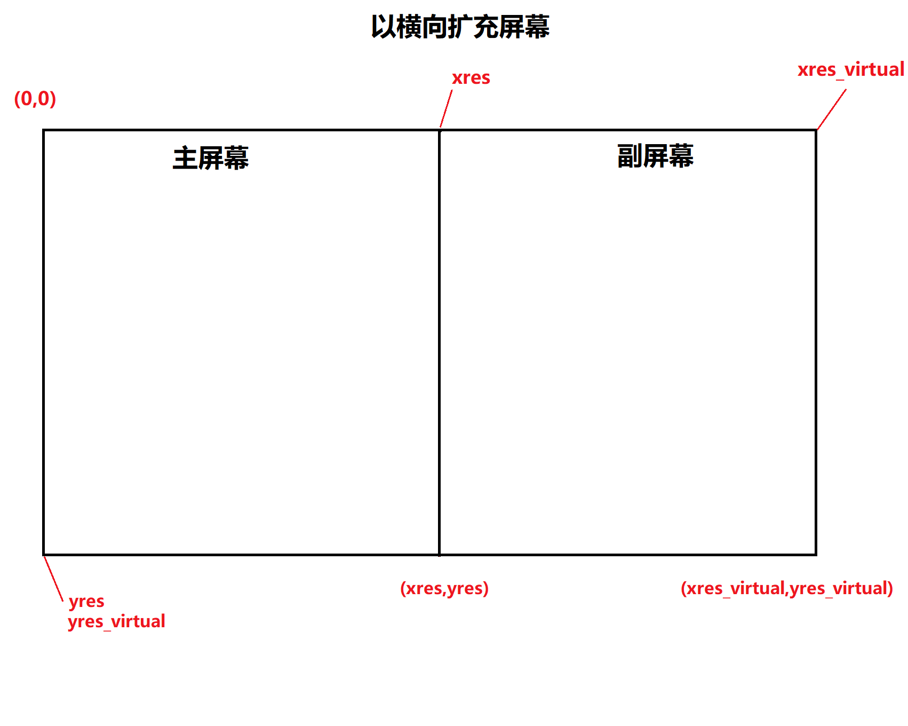

以横向扩充为例。

##### 22.3.3 实现思路

内核修改：
1. 修改 `fb_fix_screeninfo.smem_len` 这个参数，而固定参数不能在应用层修改，所以需要在内
    核里扩充它的长度
2. 修改内核中 `mmap` 函数的分配内存的长度，dma 的传输范围
3. 修改内核中 `fb_pan_display`，以适配显示

应用层修改：

1. 在应用层需要把 `xres_virtual` 扩充到 `xres` 的两倍
2. 如果想在主屏幕上显示的话，需要设置 `fb_var_screeninfo.xoffset=0`; 在副屏幕上显示的话，需
    要设置 `fb_var_screeninfo.xoffset=xres`;
3. 通过 `ioctl(fd, FBIOPUT_VSCREENINFO, &var);` 修改参数
4. 通过 `ioctl(fd, FBIOPAN_DISPLAY, &var);`  把参数传入到内核里，就可以切换屏幕了

> 设计思路参考文章：https://blog.csdn.net/louiswangbing/article/details/6606849

### 23. 屏幕显示（DRM）介绍

> 本章节基于[《DRM(Direct Rendering Manager)》](https://blog.csdn.net/hexiaolong2009/category_9281458.html)进行DRM 的应用开发的讲解，该专栏还具有GPU, DRM 驱动开发等图形学的相关教程及理论分析

#### 23.1 DRM 介绍

DRM 是 Linux 目前主流的图形显示框架，相比 FB（framebuffer） 架构，DRM 更能适应当前日益更新的显示硬件。比如 FB 原生不支持多层合成，不支持 VSYNC，不支持 DMA-BUF，不支持异步更新，不支持 fence 机制等，而这些功能 DRM 原生都支持。同时 DRM 可以统一管理 GPU 和 Display 驱动，使得软件架构更为统一，方便管理和维护。

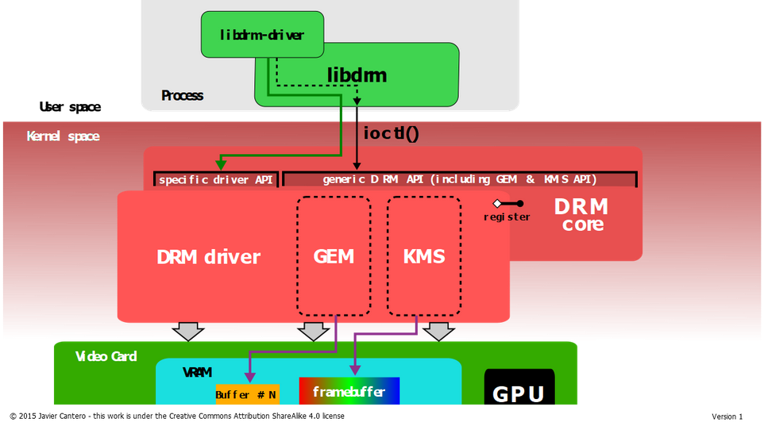

DRM 的图像系统可以分为两部分：

- 应用层 – **libdrm**
- 内核驱动层 - **GEM** , **KMS**

**libdrm** : 对底层接口进行封装，向上层提供通用的 API 接口，主要是对各种 IOCTL 接口进行封装。

**KMS** (Kernel Mode Setting) 即 Mode setting：更新画面和设置显示参数。

1. 更新画面：显示 buffer 的切换，多图层的合成方式，以及每个图层的显示位置。
2. 设置显示参数：包括分辨率、刷新率、电源状态（休眠唤醒）等。

**GEM** (Graphic Execution Manager): 主要负责显示 buffer 的分配和释放，内存管理与同步。

#### 23.2 DRM 显示

> 参考：[《drm-kms.pdf》](https://events.static.linuxfound.org/sites/events/files/slides/brezillon-drm-kms.pdf)

##### 23.2.1 DRM 与 framebuffer 的区别

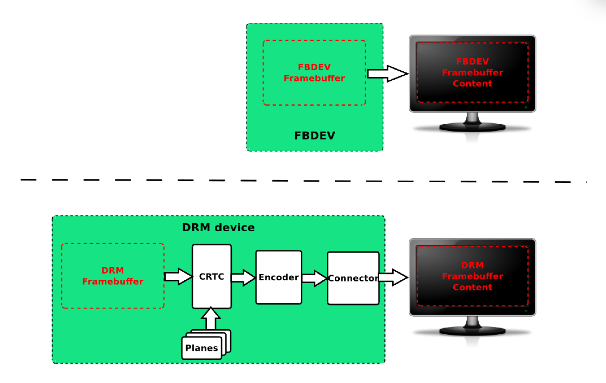

- framebuffer 的使用十分简单，只需要在用户空间定义一个 framebuffer 的内存空间，只要直
    接操作这块内存就可以轻易的改变屏幕的显示。
- 对于 DRM 而言，在 framebuffer 与显示器之间有四个部件，framebuffer 的数据经过几个部件
    的联合处理最终把图像输出到显示器中

除此之外，DRM 相比 framebuffer 而言有更多的优势：

1. DRM 具有更多的社区维护者
2. DRM 为显示提供更多的设置
3. DRM 在用户空间能够享受更广泛的运用

不过 framebuffer 在图像并不复杂的场景下的开发难度更优于 DRM 显示系统。

##### 23.2.2 DRM 显示系统分析

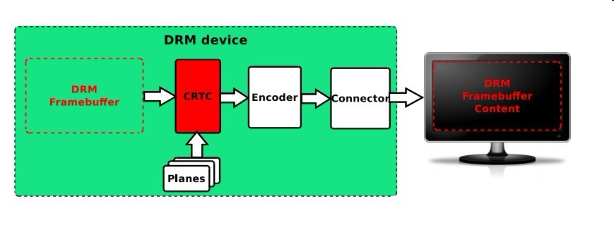

###### 23.2.2.1 DRM Framebuffer

与上一章节的 framebuffer 一样， 是一片存放图像的内存区域， 需要设置图像的格式 (RGB888,YUV,C8 等) 以及画布的大小。

###### 23.2.2.2 CRTC

CRTC 的名字来源于 Cathode Ray Tube Controller，中文名为阴极射线显像管控制器。
世界上第一台彩色电视正是 CRT 显示器，取这个名字的主要原因这个部件很像阴极射线显像管控制器，电子枪打出的电子撞击到屏幕上的荧光物质使其发光。只要控制电子枪从左到右扫完一行(也就是扫描一行)，然后从上到下扫描完所有行，这样一帧图像就显示出来了。也就是说，显示一帧图像电子枪是按照 ‘Z’ 形在运动，当扫描速度很快的时候看起来就是一幅完成的画面了。

在 DRM 显示系统中 CRTC 会配置 display timings 和显示分辨率 ( Planes 提供 ) 来扫描 framebuffer 上的内容，传给 Encoder。

display timings : 扫描 framebuffer 的时序，因为 LCD 屏的显示并不像 0.96 寸的屏幕那样，直接把所有的显示数据写进去就可以显示东西，LCD 屏需要一定的时序才能正确显示东西，因此，CRTC 在这里就有很重要的作用，生成视频模式定时信号, 输出内容到 Encoder 中，Encoder 和 Connector 则只作为数据的转换和传输

> 关于LCD 屏幕时序，这篇文章有详细介绍 [《LCD 基础概念（一）：LCD timing 时序参数总结》](https://blog.csdn.net/wending1986/article/details/106837597/)

###### 23.2.2.3 Planes

普遍翻译为平面，野火觉得译为图层更合适，Planes 是一个包含向 CRTC 发送数据的缓存块的内存对象，每个 CRTC 必须关联一个 Planes，它是 CRTC 决定采用哪种视频模式的根据—显示分辨率（宽度和高度），像素大小，像素格式，刷新率等。

Planes 会分为三种类型：

1. DRM_PLANE_TYPE_PRIMARY : 主要图层，显示背景或者图像内容，每个 CRTC 中含一个
2. DRM_PLANE_TYPE_OVERLAY：用于显示叠加、缩放，每个 CRTC 中含一个以上
3. DRM_PLANE_TYPE_CURSOR：用于显示鼠标，每个 CRTC 中含 0-N 个

通常驱动会把 framebuffer 绑定到 DRM_PLANE_TYPE_PRIMARY 上。

LubanCat-RK 系列板卡图层包含三个， 一个 DRM_PLANE_TYPE_PRIMARY 和两个 DRM_PLANE_TYPE_OVERLAY （其中一个无法正常使用）。

Planes 叠加的现象如下：

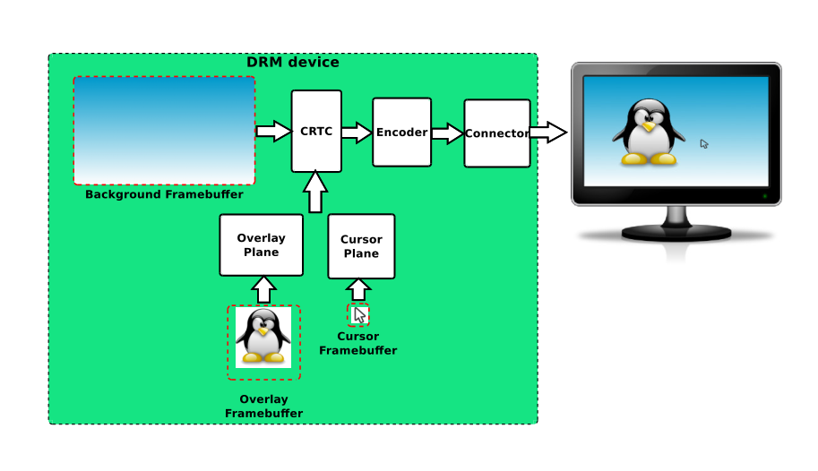

###### 23.2.2.4 Encoder

译为编码器。它的作用就是将 pixel 像素编码（转换）为显示器所需要的信号。

如果我们要把图像输出到不同的显示器上显示，需要将其转化为不同的电信号，比如DVID、VGA、YPbPr、CVBS、Mipi、eDP 等。
所以它的作用：负责将帧转换为适当的格式，通过连接器传输。

比如说：HDMI connector 需要使用 TMDS 格式的数据才能驱动，因此需要一个能够把像素格式转换为 TMDS 的编码器。

###### 23.2.2.5 Connector

译为连接器。Connector 常常对应于物理连接器 (VGA, DVI, FPD-Link, HDMI, DisplayPort, S-Video⋯) 他会连接一个物理显示输出设备(monitor, laptop panel, ⋯) 。与当前物理连接的输出设备相关的信息（如连接状态，EDID 数据，DPMS 状态或支持的视频模式）也存储在 Connector 内。

##### 23.2.3 LubanCat-RK 系列 drm 分析

RK3588 的板卡支持 4 屏异显

###### 23.2.3.1 查看 drm 相关信息

安装测试工具

```bash
sudo apt install libdrm-tests
```

> [!NOTE]
>
> 此处 `libdrm-tests` 的 modetest 组件与 rktoolkit 的 modetest 组件冲突，必须移除一个才可使用，这里放弃 libdrm-tests 的安装，使用 rktoolkit 的 modetest 进行 DRM 的测试分析。
>
> rktoolkit  是由 Rockchip 提供的一组工具，通常用于开发和调试基于 Rockchip 处理器（如 RK3399、RK3288 、RK3588 等）的嵌入式系统。这些工具可以帮助开发者在 Rockchip 的硬件平台上执行特定的操作，比如显示测试、驱动程序调试和硬件配置。

```bash
cat@lubancat:~$ modetest 
Encoders:
id      crtc    type    possible crtcs  possible clones
205     0       Virtual 0x0000000f      0x00000001
207     85      TMDS    0x00000001      0x00000002
223     0       TMDS    0x00000002      0x00000004

Connectors:
id      encoder status          name            size (mm)       modes   encoders
208     207     connected       HDMI-A-1        470x260         27      207
  modes:
        index name refresh (Hz) hdisp hss hse htot vdisp vss vse vtot
  #0 1024x600 59.82 1024 1068 1156 1344 600 603 609 625 50250 flags: phsync, nvsync; type: preferred, driver
  #1 1920x1080 60.00 1920 2008 2052 2200 1080 1084 1089 1125 148500 flags: phsync, pvsync; type: driver
  #2 1920x1080 59.94 1920 2008 2052 2200 1080 1084 1089 1125 148352 flags: phsync, pvsync; type: driver
  #3 1920x1080i 30.00 1920 2008 2052 2200 1080 1084 1094 1125 74250 flags: phsync, pvsync, interlace; type: driver
  #4 1920x1080i 29.97 1920 2008 2052 2200 1080 1084 1094 1125 74176 flags: phsync, pvsync, interlace; type: driver
  #5 1920x1080 50.00 1920 2448 2492 2640 1080 1084 1089 1125 148500 flags: phsync, pvsync; type: driver
  #6 1920x1080i 25.00 1920 2448 2492 2640 1080 1084 1094 1125 74250 flags: phsync, pvsync, interlace; type: driver
  #7 1280x1024 75.02 1280 1296 1440 1688 1024 1025 1028 1066 135000 flags: phsync, pvsync; type: driver
  #8 1280x720 60.00 1280 1390 1430 1650 720 725 730 750 74250 flags: phsync, pvsync; type: driver
  #9 1280x720 59.94 1280 1390 1430 1650 720 725 730 750 74176 flags: phsync, pvsync; type: driver
  #10 1280x720 50.00 1280 1720 1760 1980 720 725 730 750 74250 flags: phsync, pvsync; type: driver
  #11 1024x768 75.03 1024 1040 1136 1312 768 769 772 800 78750 flags: phsync, pvsync; type: driver
  #12 1024x768 70.07 1024 1048 1184 1328 768 771 777 806 75000 flags: nhsync, nvsync; type: driver
  #13 1024x768 60.00 1024 1048 1184 1344 768 771 777 806 65000 flags: nhsync, nvsync; type: driver
  #14 832x624 74.55 832 864 928 1152 624 625 628 667 57284 flags: nhsync, nvsync; type: driver
  #15 800x600 75.00 800 816 896 1056 600 601 604 625 49500 flags: phsync, pvsync; type: driver
  #16 800x600 72.19 800 856 976 1040 600 637 643 666 50000 flags: phsync, pvsync; type: driver
  #17 800x600 60.32 800 840 968 1056 600 601 605 628 40000 flags: phsync, pvsync; type: driver
  #18 800x600 56.25 800 824 896 1024 600 601 603 625 36000 flags: phsync, pvsync; type: driver
  #19 720x576 50.00 720 732 796 864 576 581 586 625 27000 flags: nhsync, nvsync; type: driver
  #20 720x480 60.00 720 736 798 858 480 489 495 525 27027 flags: nhsync, nvsync; type: driver
  #21 720x480 59.94 720 736 798 858 480 489 495 525 27000 flags: nhsync, nvsync; type: driver
  #22 640x480 75.00 640 656 720 840 480 481 484 500 31500 flags: nhsync, nvsync; type: driver
  #23 640x480 72.81 640 664 704 832 480 489 492 520 31500 flags: nhsync, nvsync; type: driver
  #24 640x480 60.00 640 656 752 800 480 490 492 525 25200 flags: nhsync, nvsync; type: driver
  #25 640x480 59.94 640 656 752 800 480 490 492 525 25175 flags: nhsync, nvsync; type: driver
  #26 720x400 70.08 720 738 846 900 400 412 414 449 28320 flags: nhsync, pvsync; type: driver
  props:
        1 EDID:
                flags: immutable blob
                blobs:

                value:
                        00ffffffffffff0012e50021502d3101
                        1c130103812f1a782e3585a656489a24
                        125054afef0001010101010101010101
                        010101010101a1130040415819202c58
                        3600dc0c1100001a000000ff00300a0a
                        0a0a0a0a0a0a0a0a0a0a000000fd0038
                        4b1e5315000a202020202020000000fc
                        0048444d490a0a0a0a0a0a0a0a0a01f9
                        020321714e0607020315961112130414
                        051f90230907078301000065030c0010
                        008c0ad090204031200c405500b98821
                        000018011d8018711c1620582c2500b9
                        882100009e011d80d0721c1620102c25
                        80b9882100009e011d00bc52d01e20b8
                        285540b9882100001e023a80d072382d
                        40102c4580b9882100001e00000000d0
        2 DPMS:
                flags: enum
                enums: On=0 Standby=1 Suspend=2 Off=3
                value: 0
        5 link-status:
                flags: enum
                enums: Good=0 Bad=1
                value: 0
        6 non-desktop:
                flags: immutable range
                values: 0 1
                value: 0
        4 TILE:
                flags: immutable blob
                blobs:

                value:
        209 color_depth:
                flags: enum
                enums: Automatic=0 24bit=8 30bit=10
                value: 8
        210 color_format:
                flags: enum
                enums: rgb=0 ycbcr444=1 ycbcr422=2 ycbcr420=3 ycbcr_high_subsampling=4 ycbcr_low_subsampling=5 invalid_output=6
                value: 1
                ...
                ...
                ...
```

- id 为 207 和 223 的 TMDS 为 HDMI 屏幕
- type 为 DSI 的是 MIPI 屏幕

可以看到 CRTC Planes Connectors 都有列举，省略的部分包含部分绑定信息，可以查看源码分析。

### 24. DRM 应用编程 - legacy 接口

该接口是过时了的 DRM 编程的应用开发接口，但是该接口可以增加我们对于DRM 的理解，所以先以 legacy 接口作为指导，了解一下 DRM 编程的具体流程以及 DRM 的实验，下一章讲述主流的接口 atomic 接口。

> 参考：[《DRM(Direct Rendering Manager)》](https://blog.csdn.net/hexiaolong2009/category_9281458.html)

#### 24.1 最简单 DRM（drm-single）

以下使用伪代码的方式，简单介绍如何编写一个最简单的 DRM 应用程序。

```c
int main(int argc, char **argv)
{
	// 打开 drm 设备
	open("/dev/dri/card0");

	// 获取 drm 的信息
	drmModeGetResources(...);

	// 获取显示模式连接器的信息
	drmModeGetConnector(...);

	// 创建 dumb 缓冲区
	drmIoctl(DRM_IOCTL_MODE_CREATE_DUMB);
    
    // 将缓冲区绑定到 FB 对象
	drmModeAddFB(...);

	// 将缓冲区映射到用户空间，并缓冲区的指针
	drmIoctl(DRM_IOCTL_MODE_MAP_DUMB);
	mmap(...);

	//缓冲区与特定的显示器连接器、显示模式等进行关联
	drmModeSetCrtc(crtc_id, fb_id, connector_id, mode);
}
```

详细参考代码如下：

```c
#define _GNU_SOURCE
#include <errno.h>
#include <fcntl.h>
#include <stdbool.h>
#include <stdint.h>
#include <stdio.h>
#include <stdlib.h>
#include <string.h>
#include <sys/mman.h>
#include <time.h>
#include <unistd.h>
#include <xf86drm.h>
#include <xf86drmMode.h>

struct drm_device {
    uint32_t width;     // 显示器的宽的像素点数量
    uint32_t height;    // 显示器的高的像素点数量
    uint32_t pitch;     // 每行占据的字节数
    uint32_t handle;    // drm_mode_create_dumb() 的返回句柄
    uint32_t size;      // 显示器占据的总字节数
    uint32_t *vaddr;    // mmap 的首地址
    uint32_t fb_id;     // 创建的 framebuffer 的 id 号
    struct drm_mode_create_dumb create; //创建的 dumb
    struct drm_mode_map_dumb map;       // 内存映射结构体
};

drmModeConnector *conn; // connetor 相关的结构体
drmModeRes *res;       // 资源相关的结构体
uint32_t conn_id;      // connetor 连接器的 id 号
uint32_t crtc_id;      // crtc 的 id 号
int fd;                // drm 设备的文件描述符

#define RED 0XFF0000
#define GREEN 0x00FF00
#define BLUE 0x0000FF

struct drm_device buf;

static int drm_create_fb(struct drm_device *bo)
{
    bo->create.width = bo->width;
    bo->create.height = bo->height;
    bo->create.bpp = 32;

    drmIoctl(fd, DRM_IOCTL_MODE_CREATE_DUMB, &bo->create);

    bo->pitch = bo->create.pitch;

    bo->size = bo->create.size;
    bo->handle = bo->create.handle;
    drmModeAddFB(fd, bo->width, bo->height, 24, 32, bo->pitch, bo->handle, &bo->fb_id);

    printf("pitch = %d, size = %d, handle = %d \n", bo->pitch, bo->size, bo->handle);

    bo->map.handle = bo->create.handle;
    drmIoctl(fd, DRM_IOCTL_MODE_MAP_DUMB, &bo->map);

    bo->vaddr = mmap(0, bo->create.size, PROT_READ | PROT_WRITE, MAP_SHARED, fd, bo->map.offset);

    memset(bo->vaddr, 0xff, bo->size);

    return 0;
}

static void drm_destroy_fb(struct drm_device *bo)
{
    struct drm_mode_destroy_dumb destroy = {};
    drmModeRmFB(fd, bo->fb_id);
    munmap(bo->vaddr, bo->size);
    destroy.handle = bo->handle;
    drmIoctl(fd, DRM_IOCTL_MODE_DESTROY_DUMB, &destroy);
}

int drm_init(void)
{
    fd = open("/dev/dri/card0", O_RDWR | O_CLOEXEC);
    if (fd < 0){
        printf("Wrong\n");
        return 0;
    }

    // 获取 drm 信息
    res = drmModeGetResources(fd);
    crtc_id = res->crtcs[0];
    conn_id = res->connectors[0];

    // 打印 CRTCS, 以及 conneter 的 id
    printf("crtc = %id, conneter = %d\n", crtc_id, conn_id);

    conn = drmModeGetConnector(fd, conn_id);
    buf.width = conn->modes[1].hdisplay;
    buf.height = conn->modes[1].vdisplay;

    printf("width = %d, height = %d\n", buf.width, buf.height);

    drm_create_fb(&buf);

    drmModeSetCrtc(fd, crtc_id, buf.fb_id, 0, 0, &conn_id, 1, &conn->modes[1]);

    return 0;
}

void drm_exit(void)
{
    drm_destroy_fb(&buf);
    drmModeFreeConnector(conn);
    drmModeFreeResources(res);
    close(fd);
}

int main(int argc, char *argv[])
{
    int i;
    drm_init();
    sleep(2);

    // 清屏设置颜色
    for (i = 0; i < buf.width * buf.height; i++)
        buf.vaddr[i] = BLUE;

    sleep(2);
    drm_exit();

    exit(0);
}
```

> [!WARNING]
>
> [**DRM-legacy驱动屏幕无法显示**](#DRM-legacy驱动屏幕无法显示)
>
> 最初在 `drm_init()` 中代码如下：
>
> ```c
> buf.width = conn->modes[0].hdisplay;
> buf.height = conn->modes[0].vdisplay;
> ...
> drmModeSetCrtc(fd, crtc_id, buf.fb_id, 0, 0, &conn_id, 1, &conn->modes[0]);
> ```
>
> 所用的 `mode` 为 `mode[0]`，其格式为 1024x600 屏幕无法正常显示，后更改为 `mode[1]`，其格式为 1920x1080，屏幕可正常显示。
>
> 原因可能如下：
>
> HDMI 屏幕的分辨率支持取决于设备的硬件能力和显示器的兼容性。
>
> 1. **显示器的原生分辨率**：一些显示器只支持特定的原生分辨率，比如 1920x1080。设置为 1024x600 时，显示器可能无法正确显示图像，甚至拒绝此模式。
> 2. **显卡与驱动的支持**：显卡或其驱动程序对某些分辨率的支持不够稳定或完善，可能默认优先更高的分辨率。
> 3. **HDMI 兼容性**：HDMI 协议在某些模式下可能存在特定的限制或问题，而 1920x1080 是广泛支持的标准模式，因此更可能成功显示。
>
> 如遇到分辨率兼容问题，选择显示器原生或 HDMI 标准模式（如 1920x1080）通常能保证更高的兼容性和稳定性。

##### 24.1.1 详细代码分析

总体而言，四步就可以初始化 drm 的最小显示程序：
1. 打开设备。
2. 获取 `crtc_id`, `connector_id`, 以及它们的结构体信息。
3. 创建 Framebuffer。
4. 设置 CRTC。

```c
int drm_init(void)
{
    // 打开 drm 设备，设备会随设备树的更改而改变, 多个设备时，需留意下每个屏幕设备对应的 drm 设备
    fd = open("/dev/dri/card0", O_RDWR | O_CLOEXEC);
    if (fd < 0){
        printf("Wrong\n");
        return 0;
    }

    // 获取 drm 信息
    res = drmModeGetResources(fd);
    crtc_id = res->crtcs[0];
    conn_id = res->connectors[0];

    // 打印 CRTCS, 以及 conneter 的 id
    printf("crtc = %id, conneter = %d\n", crtc_id, conn_id);

    conn = drmModeGetConnector(fd, conn_id);
    buf.width = conn->modes[1].hdisplay;
    buf.height = conn->modes[1].vdisplay;
	
    // 打印屏幕分辨率
    printf("width = %d, height = %d\n", buf.width, buf.height);

    // 创建 framebuffer 层
    drm_create_fb(&buf);
	
    // 设置 CRTCS
    drmModeSetCrtc(fd, crtc_id, buf.fb_id, 0, 0, &conn_id, 1, &conn->modes[1]);

    return 0;
}
```

- 打开设备，drm 设备的位置在 `/dev/dri/cardx`， 如果被占用无法打开会报错。

    除了上述的打开方式还可以使用专用的 drm 设备打开函数，LubanCat4 使用的是 rockchip 的芯片，因此可使用官方的驱动，使用 ”rockchip”。

    ```c
    fd = drmOpen("rockchip", NULL);
    	if (fd < 0) {
    	printf("failed to open rockchip drm\n");
    	return fd;
    }
    
    // 这是 modetest 程序里的设备匹配表
    static const char * const modules[] = {
    	"i915" , "amdgpu" , "radeon" , "nouveau" ,
    	"vmwgfx" , "omapdrm" , "exynos" , "tilcdc",
    	"msm" , "sti" , "tegra" , "imx-drm",
    	"rockchip" , "atmel-hlcdc" , "fsl-dcu-drm",
    	"vc4" , "virtio_gpu" , "mediatek" , "meson",
    	"pl111" , "stm" , "sun4i-drm",
    };
    ```

- 获取 drm 的资源，获取并打印 CRTC 和 connector 的 id 号。

    `res` 是一个指向 `drmModeRes` 结构体的指针，`drmModeRes` 结构体原型如下：

    ```c
    //drmModeRes 结构体原型
    typedef struct _drmModeRes {
    
    	int count_fbs; //framebuffer 的数量
    	uint32_t *fbs;
    
    	int count_crtcs; //crtcs 的数量
    	uint32_t *crtcs;
    
    	int count_connectors; //connectors 的数量
    	uint32_t *connectors;
    	int count_encoders; //encodersr 的数量
    	uint32_t *encoders;
    
    	uint32_t min_width, max_width; //最小宽度和最大宽度
    	uint32_t min_height, max_height; //最小高度和最大高度
    
    } drmModeRes, *drmModeResPtr;
    ```

- 通过 connectors 的 id 获取 connector 的资源，将屏幕的宽度和高度记录在结构体中，并将其打印。

    conn 是一个指向 `drmModeConnector` 结构体的指针，`drmModeConnector` 结构体原型如下：

    ```c
    // conn 结构体原型
    typedef struct _drmModeConnector {
    	uint32_t connector_id; //自身的id
    	uint32_t encoder_id; //相连接的encoder_id
    	uint32_t connector_type;
    	uint32_t connector_type_id;
    	drmModeConnection connection; //connector 的连接信息枚举
    	uint32_t mmWidth, mmHeight; /**< HxW in millimeters */
    	drmModeSubPixel subpixel; //子像素枚举
    
    	int count_modes; //模式数量
    	drmModeModeInfoPtr modes; //存放分辨率，时序，时钟等信息的指针
    
    	int count_props; //atomic 模式使用的
    	uint32_t *props; /**< List of property ids */
    	uint64_t *prop_values; /**< List of property values */
    
    	int count_encoders; //encoder 的数量
    	uint32_t *encoders;/**< List of encoder ids */
    } drmModeConnector, *drmModeConnectorPtr;
    
    // modes 指针
    typedef struct _drmModeModeInfo {
    	uint32_t clock; //时钟信息，这里是mipi 屏的时钟，单位KHz
    	//hdisplay 宽分辨率，vdisplay 高分辨率，其他则为屏幕的timing
    	uint16_t hdisplay, hsync_start, hsync_end, htotal, hskew;
    	uint16_t vdisplay, vsync_start, vsync_end, vtotal, vscan;
    
    	uint32_t vrefresh; //屏幕刷新率
    
    	uint32_t flags;
    	uint32_t type;
    	char name[DRM_DISPLAY_MODE_LEN]; //显示模式名字
    	} drmModeModeInfo, *drmModeModeInfoPtr;
    
    //如果hdmi 支持多种模式，就会有多个modes 与之对应
    ```

- 创建 framebuffer，并将 `mmap` 到用户内存上

- 设置 CRTCS，在这一步我们就可以在屏幕上看到东西了

**framebuffer 与 crtc 的关系图**

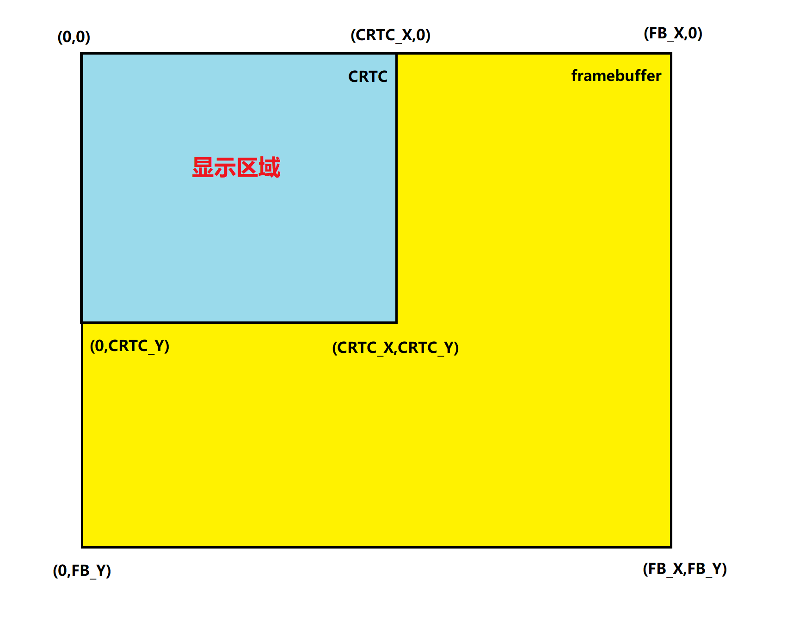

`drmModeSetCrtc` 函数原型：

```c
int drmModeSetCrtc(int fd, uint32_t crtcId, uint32_t bufferId,
				  uint32_t x, uint32_t y, uint32_t *connectors, int count,
                   drmModeModeInfoPtr mode);
```

`fd`: 文件描述符。

`crtcId` : 要配置的 crtc-id 号。

`bufferI` : 要配置的 framebuffer-id 号。

`x` : x 轴偏移量，设置偏移量就可以显示 framebuffer 的其他区域。

`y` : y 轴偏移量，设置偏移量就可以显示 framebuffer 的其他区域。

`connectors` : 要连接的 connectors-id 号。

`count` : connector_count。

`mode` : 想要使用的模式。

初始化就完成了，之后就可以通过 framebuffer 操作屏幕了。
创建 framebuffer 部分说明如下：

```c
struct drm_device {
	struct drm_mode_create_dumb create ; //创建的dumb
	struct drm_mode_map_dumb map; //内存映射结构体
};

static int drm_create_fb(struct drm_device *bo)
{
    bo->create.width = bo->width;
    bo->create.height = bo->height;
    bo->create.bpp = 32;

    drmIoctl(fd, DRM_IOCTL_MODE_CREATE_DUMB, &bo->create);

    bo->pitch = bo->create.pitch;

    bo->size = bo->create.size;
    bo->handle = bo->create.handle;
    drmModeAddFB(fd, bo->width, bo->height, 24, 32, bo->pitch, bo->handle, &bo->fb_id);

    printf("pitch = %d, size = %d, handle = %d \n", bo->pitch, bo->size, bo->handle);

    bo->map.handle = bo->create.handle;
    drmIoctl(fd, DRM_IOCTL_MODE_MAP_DUMB, &bo->map);

    bo->vaddr = mmap(0, bo->create.size, PROT_READ | PROT_WRITE, MAP_SHARED, fd, bo->map.offset);

    memset(bo->vaddr, 0xff, bo->size);

    return 0;
}
```

- `drm_mode_create_dumb` 结构体用于构建 framebuffer 的属性。

```c
// 结构体原型
struct drm_mode_create_dumb {
	__u32 height; //高占用的像素点
	__u32 width; //宽占用的像素点
	__u32 bpp; //每个像素的位数
	__u32 flags;
	//下面的参数，创建之后会返回
	/* handle, pitch, size will be returned */
	__u32 handle; //用于mmap
	__u32 pitch; //每行字节数
    __u64 size; //总字节数
};
```

- `drm_mode_map_dumb` 用于构建 mmap 内存区域。

```c
/* set up for mmap of a dumb scanout buffer */
struct drm_mode_map_dumb {
	/* Handle for the object being mapped. */
	__u32 handle;
	__u32 pad;
	/* Fake offset to use for subsequent mmap call
	 * This is a fixed-size type for 32/64 compatibility.*/
	__u64 offset;
};
```

- 构建 framebuffer 的大小属性，本次实验把 framebuffer 的大小构建成和显示区域一样的大小，可以更改数值以构建更大的 framebuffer 属性。
- 提交创建的属性，如果通过就会返回 `drm_mode_create_dumb` 的其他属性。
- 将返回的属性值传入到全局变量 `drm_device` 中。
- 创建 Framebuffer。

```c
// 函数原型及衍生
/* Creates a new framebuffer with an buffer object as its scanout buffer.*/
extern int drmModeAddFB(int fd, uint32_t width, uint32_t height, uint8_tdepth,
uint8_t bpp, uint32_t pitch, uint32_t bo_handle,uint32_t *buf_id);
/* ...with a specific pixel format */
extern int drmModeAddFB2(int fd, uint32_t width, uint32_t height,
uint32_t pixel_format, const uint32_t bo_handles[4],
const uint32_t pitches[4], const uint32_t offsets[4],
uint32_t *buf_id, uint32_t flags);
extern drmModeFBPtr drmModeGetFB(int fd, uint32_t bufferId);
```

这里，主要讲述 `drmModeAddFB` 函数，其他函数可以自行阅读源码进行理解。

`drmModeAddFB` 函数分析：

1. `fd` ：文件描述符。

2. `width` ：framebuffer 宽的像素点数量。
3. `height` ：framebuffer 高的像素点数量。
4. `depth` ：framebuffer 每个像素的实际位数，三个字节-RGB888。
5. `bpp` ：每个像素的占用的位数，四个字节-XRGB8888。
6. `pitch` ：每行占用的字节数：720x4。
7. `bo_handle` ：上文中创建 dumb 的返回值。
8. `buf_id` ：framebuffer 的 id 号，以指针的形式传入，函数成功后，返回数值。

`drmModeAddFB2` 函数：创建特殊格式的 framebuffer，例如 YUV，C8 格式。

`drmModeGetFB` 函数：获取 framebuffer 的资源。

```c
// 结构体原型
typedef struct _drmModeFB {
	uint32_t fb_id;
	uint32_t width, height;
	uint32_t pitch;
	uint32_t bpp;
	uint32_t depth;
	/* driver specific handle */
	uint32_t handle;
} drmModeFB, *drmModeFBPtr;
```

- 设置 mmap, 映射 framebuffer 的内存区域到用户空间里。
- 将 framebuffer 区域全部变成白色。

经过这几步，就成功创建 framebuffer 并映射到用户空间中，供用户使用。

1. 构建 framebuffer 区域的属性，创建 dumb。
2. 根据属性创建 framebuffer。
3. 根据句柄，映射 framebuffer 到用户空间。

```c
void drm_exit(void)
{
    drm_destroy_fb(&buf);
    drmModeFreeConnector(conn);
    drmModeFreeResources(res);
    close(fd);
}

static void drm_destroy_fb(struct drm_device *bo)
{
    struct drm_mode_destroy_dumb destroy = {};
    drmModeRmFB(fd, bo->fb_id);
    munmap(bo->vaddr, bo->size);
    destroy.handle = bo->handle;
    drmIoctl(fd, DRM_IOCTL_MODE_DESTROY_DUMB, &destroy);
}
```

注销 drm 的函数比较简单，只需以下几步：
1. 删除 framebuffer，取消内存的映射，摧毁 dumb。
2. 释放 connector 资源。
3. 释放 resource 资源。
4. 关闭文件描述符。

##### 24.1.2 编译

Makefile 文件：

```makefile
TARGET = drm-single
CC = gcc
CFLAGS = -I .
OBJS = $(TARGET).o
BUILD_DIR = build
DEPS = 
LIBDRM = `pkg-config --cflags libdrm` `pkg-config --libs libdrm`

$(TARGET): $(OBJS)
	$(CC) -o $@ $^ $(CFLAGS) $(LIBDRM)
	@mkdir -p $(BUILD_DIR)
	@mv *.o $(BUILD_DIR)
	@cp $(TARGET) $(BUILD_DIR)

%.o: %.c $(DEPS)
	$(CC) -c -o $@ $< $(CFLAGS) $(LIBDRM)

.PHONY: clean

clean:
	rm -rf $(BUILD_DIR) $(TARGET)
```

```sudo
make
```

##### 24.1.3 运行

```sudo
./drm-single
```

现象如下：

屏幕先变白后变蓝，然后程序退出后屏幕变为黑屏。而在终端中可以看到程序输出了屏幕的 crtc的 id 以及 conneter 的 id、分辨率、每行的字节数以及总字节数。

#### 24.2 双缓冲 DRM ( drm-double )

双缓冲的原理是改变CRTC 的扫描内存的位置。

##### 24.2.1 单 framebuffer 双缓冲

创建一个两倍于显示区域的 framebuffer，通过改变偏移量进行帧的切换，扫完一帧后就切换另一帧显示。

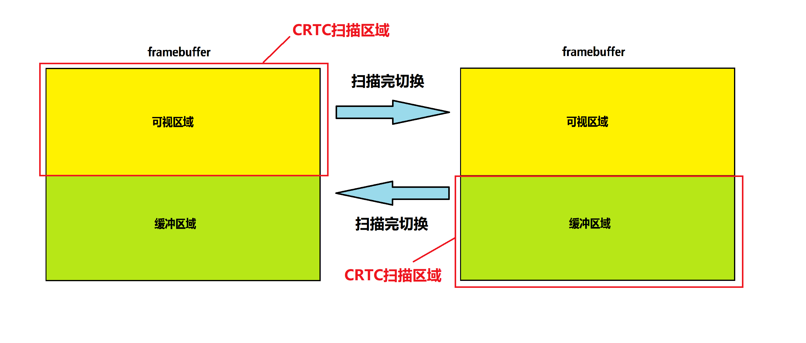

```c
#define _GNU_SOURCE
#include <errno.h>
#include <fcntl.h>
#include <stdbool.h>
#include <stdint.h>
#include <stdio.h>
#include <stdlib.h>
#include <string.h>
#include <sys/mman.h>
#include <time.h>
#include <unistd.h>
#include <xf86drm.h>
#include <xf86drmMode.h>

struct drm_device {
    uint32_t width;                 //显示器的宽的像素点数量
    uint32_t height;                //显示器的高的像素点数量
    uint32_t pitch;                 //每行占据的字节数
    uint32_t handle;                //drm_mode_create_dumb的返回句柄
    uint32_t size;                  //显示器占据的总字节数
    uint32_t *vaddr;                //mmap的首地址
    uint32_t fb_id;                 //创建的framebuffer的id号
    struct drm_mode_create_dumb create ;    //创建的dumb
    struct drm_mode_map_dumb map;           //内存映射结构体
};

drmModeConnector *conn;     //connetor相关的结构体
drmModeRes *res;            //资源
uint32_t conn_id;           //connetor的id号
uint32_t crtc_id;           //crtc的id号
int fd;                     //文件描述符

#define RED 0XFF0000
#define GREEN 0X00FF00
#define BLUE 0X0000FF

struct drm_device buf;

static int drm_create_fb(struct drm_device *bo)
{
    /* create a dumb-buffer, the pixel format is XRGB888 */
    bo->create.width = bo->width;
    bo->create.height = bo->height*2;
    bo->create.bpp = 32;

    /* handle, pitch, size will be returned */
    drmIoctl(fd, DRM_IOCTL_MODE_CREATE_DUMB, &bo->create);

    /* bind the dumb-buffer to an FB object */
    bo->pitch = bo->create.pitch;
    bo->size = bo->create.size;
    bo->handle = bo->create.handle;
    drmModeAddFB(fd, bo->width, bo->height*2, 24, 32, bo->pitch,
                 bo->handle, &bo->fb_id);

    //每行占用字节数，共占用字节数，MAP_DUMB的句柄
    printf("pitch = %d ,size = %d, handle = %d \n",bo->pitch,bo->size,bo->handle);

    /* map the dumb-buffer to userspace */
    bo->map.handle = bo->create.handle;
    drmIoctl(fd, DRM_IOCTL_MODE_MAP_DUMB, &bo->map);

    bo->vaddr = mmap(0, bo->create.size, PROT_READ | PROT_WRITE,
                     MAP_SHARED, fd, bo->map.offset);

    /* initialize the dumb-buffer with white-color */
    memset(bo->vaddr, 0x00,bo->size);

    return 0;
}

static void drm_destroy_fb(struct drm_device *bo)
{
    struct drm_mode_destroy_dumb destroy = {};
    drmModeRmFB(fd, bo->fb_id);
    munmap(bo->vaddr, bo->size);
    destroy.handle = bo->handle;
    drmIoctl(fd, DRM_IOCTL_MODE_DESTROY_DUMB, &destroy);
}

int drm_init()
{
    //打开drm设备，设备会随设备树的更改而改变,多个设备时，请留一下每个屏幕设备对应的drm设备
    fd = open("/dev/dri/card0", O_RDWR | O_CLOEXEC);
    if(fd < 0){
        printf("wrong\n");
        return 0;
    }

    //获取drm的信息
    res = drmModeGetResources(fd);
    crtc_id = res->crtcs[0];
    conn_id = res->connectors[0];
    //打印CRTCS,以及conneter的id
    printf("crtc = %d , conneter = %d\n",crtc_id,conn_id);

    conn = drmModeGetConnector(fd, conn_id);
    buf.width = conn->modes[1].hdisplay;
    buf.height = conn->modes[1].vdisplay;

    //打印屏幕分辨率
    printf("width = %d , height = %d\n",buf.width,buf.height);

    //创建framebuffer层
    drm_create_fb(&buf);

    //设置CRTCS
    drmModeSetCrtc(fd, crtc_id, buf.fb_id,
                   0, 0, &conn_id, 1, &conn->modes[1]);

    return 0;
}

void drm_exit()
{
    drm_destroy_fb(&buf);
    drmModeFreeConnector(conn);
    drmModeFreeResources(res);
    close(fd);
}

int main(int argc, char **argv)
{
    int i;
    int size;
    drm_init();
    size = buf.width*buf.height;
    // buffer上层布满红色
    for(i=0;i<size;i++)
            buf.vaddr[i] = RED;
    // buffer下层布满蓝色
    for(i=size;i<size*2;i++)
            buf.vaddr[i] = BLUE;
    
    for (int count = 0; count < 5; count++)
    {
        // 切换buffer下层
       drmModeSetCrtc(fd, crtc_id, buf.fb_id,
                      0, 1080, &conn_id, 1, &conn->modes[1]);
        // 注意根据实际修改1080这个参数，为当前测试屏幕height，如果是1024*600的屏幕，
        // 就将1080修改为600.

        sleep(2);

        // 切换buffer上层
        drmModeSetCrtc(fd, crtc_id, buf.fb_id,
                       0, 0, &conn_id, 1, &conn->modes[1]);

        sleep(2);
    }

    drm_exit();

    exit(0);
}
```

与 *24.1 最简单 DRM（drm-single）*不同的是，

1. 把 dumb 的高度扩大了一倍。

    ```c
    bo->create.height = bo->height*2
    ```

2. 在创建 framebuffer 的时候，把高度扩展了一倍。

    ```c
    drmModeAddFB(fd, bo->width, bo->height*2, 24, 32, bo->pitch,
                     bo->handle, &bo->fb_id);
    ```

3. 切换的操作使用 `drmModeSetCrtc()` 函数，该函数可以使用偏移量将 framebuffer 向下移动一个显示区域的大小这样，屏幕就会显示出不一样的内容。

    ```c
    // 切换buffer下层
    drmModeSetCrtc(fd, crtc_id, buf.fb_id,
                   0, 1080, &conn_id, 1, &conn->modes[1]);
    // 注意根据实际修改1080这个参数，为当前测试屏幕height，如果是1024*600的屏幕，
    // 就将1080修改为600.
    
    sleep(2);
    
    // 切换buffer上层
    drmModeSetCrtc(fd, crtc_id, buf.fb_id,
                   0, 0, &conn_id, 1, &conn->modes[1]);
    
    sleep(2);
    ```

##### 24.2.2 多 framebuffer 双缓冲

创建两个 framebuffer，通过切换 framebuffer 来进行双缓冲的显示。


```c
#define _GNU_SOURCE
#include <errno.h>
#include <fcntl.h>
#include <stdbool.h>
#include <stdint.h>
#include <stdio.h>
#include <stdlib.h>
#include <string.h>
#include <sys/mman.h>
#include <time.h>
#include <unistd.h>
#include <xf86drm.h>
#include <xf86drmMode.h>

struct drm_device {
        uint32_t width;                 //显示器的宽的像素点数量
        uint32_t height;                //显示器的高的像素点数量
        uint32_t pitch;                 //每行占据的字节数
        uint32_t handle;                //drm_mode_create_dumb的返回句柄
        uint32_t size;                  //显示器占据的总字节数
        uint32_t *vaddr;                //mmap的首地址
        uint32_t fb_id;                 //创建的framebuffer的id号
        struct drm_mode_create_dumb create ;    //创建的dumb
        struct drm_mode_map_dumb map;           //内存映射结构体
};

drmModeConnector *conn; //connetor相关的结构体
drmModeRes *res;        //资源
int fd;                 //文件描述符
uint32_t conn_id;
uint32_t crtc_id;

#define RED     0XFF0000
#define GREEN   0X00FF00
#define BLUE    0X0000FF
#define WHITE   0XFFFFFF
#define BLACK   0X000000

uint32_t color_table[5]={RED,GREEN,BLUE,WHITE,BLACK};

struct drm_device buf[2];

static int drm_create_fb(struct drm_device *bo)
{
        /* create a dumb-buffer, the pixel format is XRGB888 */
        bo->create.width = bo->width;
        bo->create.height = bo->height;
        bo->create.bpp = 32;

        /* handle, pitch, size will be returned */
        drmIoctl(fd, DRM_IOCTL_MODE_CREATE_DUMB, &bo->create);

        /* bind the dumb-buffer to an FB object */
        bo->pitch = bo->create.pitch;
        bo->size = bo->create.size;
        bo->handle = bo->create.handle;
        drmModeAddFB(fd, bo->width, bo->height, 24, 32, bo->pitch,
                           bo->handle, &bo->fb_id);

        //每行占用字节数，共占用字节数，MAP_DUMB的句柄
        printf("pitch = %d ,size = %d, handle = %d \n",bo->pitch,bo->size,bo->handle);

        /* map the dumb-buffer to userspace */
        bo->map.handle = bo->create.handle;
        drmIoctl(fd, DRM_IOCTL_MODE_MAP_DUMB, &bo->map);

        bo->vaddr = mmap(0, bo->create.size, PROT_READ | PROT_WRITE,
                        MAP_SHARED, fd, bo->map.offset);

        /* initialize the dumb-buffer with white-color */
        memset(bo->vaddr, 0x00,bo->size);

        return 0;
}

static void drm_destroy_fb(struct drm_device *bo)
{
        struct drm_mode_destroy_dumb destroy = {};
        drmModeRmFB(fd, bo->fb_id);
        munmap(bo->vaddr, bo->size);
        destroy.handle = bo->handle;
        drmIoctl(fd, DRM_IOCTL_MODE_DESTROY_DUMB, &destroy);
}

int drm_init()
{
        //打开drm设备，设备会随设备树的更改而改变,多个设备时，请留一下每个屏幕设备对应的drm设备
        fd = open("/dev/dri/card0", O_RDWR | O_CLOEXEC);
    if(fd < 0){
        printf("wrong\n");
        return 0;
    }

        //获取drm的信息
        res = drmModeGetResources(fd);
        crtc_id = res->crtcs[0];
        conn_id = res->connectors[0];
        //打印CRTCS,以及conneter的id
        printf("crtc = %d , conneter = %d\n",crtc_id,conn_id);

        conn = drmModeGetConnector(fd, conn_id);
        buf[0].width = conn->modes[1].hdisplay;
        buf[0].height = conn->modes[1].vdisplay;

        buf[1].width = conn->modes[1].hdisplay;
        buf[1].height = conn->modes[1].vdisplay;

        //打印屏幕分辨率
        printf("width = %d , height = %d\n",buf[0].width,buf[0].height);

        //创建framebuffer层
        drm_create_fb(&buf[0]);
        drm_create_fb(&buf[1]);

        //设置CRTCS
        drmModeSetCrtc(fd, crtc_id, buf[0].fb_id,
                        0, 0, &conn_id, 1, &conn->modes[1]);

        return 0;
}

int drm_exit()
{
        drm_destroy_fb(&buf[0]);
        drm_destroy_fb(&buf[1]);
        drmModeFreeConnector(conn);
        drmModeFreeResources(res);
        close(fd);
}


int main(int argc, char **argv)
{
        int i;
        int size0,size1;
        drm_init();
        size0 = buf[0].width*buf[0].height;
        size1 = buf[1].width*buf[1].height;
        //buffer上层布满红色
        for(i=0;i<size0;i++)
            buf[0].vaddr[i] = RED;
        //buffer下层布满蓝色
        for(i=0;i<size1;i++)
            buf[1].vaddr[i] = BLUE;


    for (int count; count < 5; count++)
    {
        //切换buffer下层
        drmModeSetCrtc(fd, crtc_id, buf[1].fb_id,
                       0, 0, &conn_id, 1, &conn->modes[1]);
        sleep(2);

        //切换buffer上层
        drmModeSetCrtc(fd, crtc_id, buf[0].fb_id,
                       0, 0, &conn_id, 1, &conn->modes[1]);
        sleep(2);
    }

        drm_exit();
        exit(0);
}
```

- 定义里两个结构体，他们分别存放 framebuffer 信息论
- 分别获取分辨率
- 分别设置 framebuffer，并将他们的内存映射到用户空间内
- 将屏幕设置成 buf[0] 的数据;

可以看到与单 framebuffer 相比，格式几乎一模一样，最大的区别是传入的 fb_id 以及没有偏移量的产生，即操作传入的 fb_id 就可以操作屏幕。

**总结**：

这两个方法各有各的好处，单 framebuffer 简单，写起来更快捷，适合于图像简单的场景，多 framebuffer复杂，但是扩展性更强，在多 framebuffer 的情况下，可以单独扩展每个 framebuffer 的大小，适合图像比较复杂的场景。

#### 24.3 页翻转

`drmModePageFlip()` 的功能和 `drmModeSetCrtc()` 一样是用于更新显示内容的，但是它和 `drmMode-SetCrtc()` 最大的区别在于，`drmModePageFlip()` 只会等到 `VSYNC`  到来后才会真正执行 framebuffer切换动作，而 `drmModeSetCrtc()` 则会立即执行framebuffer 切换动作。`drmModeSetCrtc()` 对于某些硬件来说，很容易造成撕裂（tear effect）问题，而 `drmModePageFlip()` 则不会造成这种问题。

由于`drmModePageFlip()` 本身是基于 `VSYNC` 事件机制的，因此底层 DRM 驱动必须支持 `VBLANK`事件。

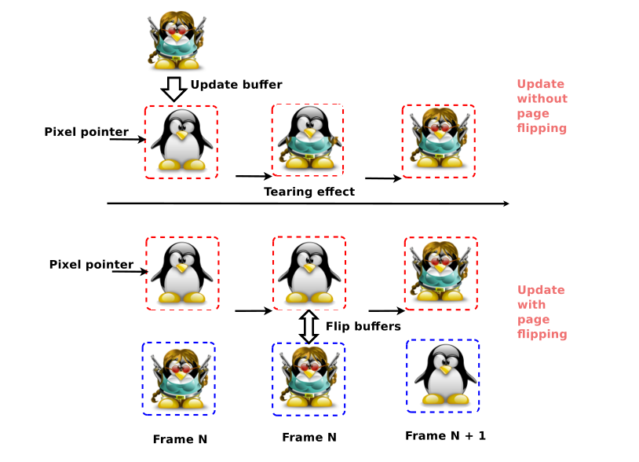

##### 24.3.1 页翻转实验

```c
#define _GNU_SOURCE
#include <errno.h>
#include <fcntl.h>
#include <stdbool.h>
#include <stdint.h>
#include <stdio.h>
#include <stdlib.h>
#include <string.h>
#include <sys/mman.h>
#include <time.h>
#include <unistd.h>
#include <xf86drm.h>
#include <xf86drmMode.h>
#include <signal.h>

struct drm_device {
        uint32_t width;                 //显示器的宽的像素点数量
        uint32_t height;                //显示器的高的像素点数量
        uint32_t pitch;                 //每行占据的字节数
        uint32_t handle;                //drm_mode_create_dumb的返回句柄
        uint32_t size;                  //显示器占据的总字节数
        uint32_t *vaddr;                //mmap的首地址
        uint32_t fb_id;                 //创建的framebuffer的id号
        struct drm_mode_create_dumb create ;    //创建的dumb
        struct drm_mode_map_dumb map;           //内存映射结构体
};


static int terminate;
drmModeConnector *conn; //connetor相关的结构体
drmModeRes *res;        //资源
drmEventContext ev;
int count;

int fd;                 //文件描述符
uint32_t conn_id;
uint32_t crtc_id;

int status=0;

#define RED 0XFF0000
#define GREEN 0X00FF00
#define BLUE 0X0000FF

struct drm_device buf[2];


static int drm_create_fb(struct drm_device *bo)
{
        /* create a dumb-buffer, the pixel format is XRGB888 */
        bo->create.width = bo->width;
        bo->create.height = bo->height;
        bo->create.bpp = 32;

        /* handle, pitch, size will be returned */
        drmIoctl(fd, DRM_IOCTL_MODE_CREATE_DUMB, &bo->create);

        /* bind the dumb-buffer to an FB object */
        bo->pitch = bo->create.pitch;
        bo->size = bo->create.size;
        bo->handle = bo->create.handle;
        drmModeAddFB(fd, bo->width, bo->height, 24, 32, bo->pitch,
                           bo->handle, &bo->fb_id);

        //每行占用字节数，共占用字节数，MAP_DUMB的句柄
        printf("pitch = %d ,size = %d, handle = %d \n",bo->pitch,bo->size,bo->handle);

        /* map the dumb-buffer to userspace */
        bo->map.handle = bo->create.handle;
        drmIoctl(fd, DRM_IOCTL_MODE_MAP_DUMB, &bo->map);

        bo->vaddr = mmap(0, bo->create.size, PROT_READ | PROT_WRITE,
                        MAP_SHARED, fd, bo->map.offset);

        /* initialize the dumb-buffer with white-color */
        memset(bo->vaddr, 0x00,bo->size);

        return 0;
}

static void drm_destroy_fb(struct drm_device *bo)
{
        struct drm_mode_destroy_dumb destroy = {};

        drmModeRmFB(fd, bo->fb_id);

        munmap(bo->vaddr, bo->size);

        destroy.handle = bo->handle;

        drmIoctl(fd, DRM_IOCTL_MODE_DESTROY_DUMB, &destroy);
}

int drm_init()
{

        //打开drm设备，设备会随设备树的更改而改变,多个设备时，请留一下每个屏幕设备对应的drm设备
        fd = open("/dev/dri/card0", O_RDWR | O_CLOEXEC);
    if(fd < 0){
        printf("wrong\n");
        return 0;
    }

        //获取drm的信息
        res = drmModeGetResources(fd);
        crtc_id = res->crtcs[0];
        conn_id = res->connectors[0];
        //打印CRTCS,以及conneter的id
        printf("crtc = %d , conneter = %d\n",crtc_id,conn_id);

        conn = drmModeGetConnector(fd, conn_id);
        buf[0].width = conn->modes[1].hdisplay;
        buf[0].height = conn->modes[1].vdisplay;

        buf[1].width = conn->modes[1].hdisplay;
        buf[1].height = conn->modes[1].vdisplay;

        //打印屏幕分辨率
        printf("width = %d , height = %d\n",buf[0].width,buf[0].height);

        //创建framebuffer层
        drm_create_fb(&buf[0]);
        drm_create_fb(&buf[1]);

        return 0;
}

int drm_exit()
{
        drm_destroy_fb(&buf[0]);
        drm_destroy_fb(&buf[1]);
        drmModeFreeConnector(conn);
        drmModeFreeResources(res);
        close(fd);
}


static void drm_page_flip_handler(int fd, uint32_t frame,
                                    uint32_t sec, uint32_t usec,
                                    void *data)
{
        static int i = 0;
        uint32_t crtc_id = *(uint32_t *)data;
        if(i==0)
                i=1;
        else if(i==1)
                i=0;
        drmModePageFlip(fd, crtc_id, buf[i].fb_id,
                        DRM_MODE_PAGE_FLIP_EVENT, data);
}

int main(int argc, char **argv)
{
        int i;
        int size0,size1;
        ev.version = DRM_EVENT_CONTEXT_VERSION;
        ev.page_flip_handler = drm_page_flip_handler;

        drm_init();

        //buffer上层布满红色
        for(i=0;i<buf[0].width*buf[0].height;i++)
                buf[0].vaddr[i] = RED;
        //buffer下层布满蓝色
        for(i=0;i<buf[1].width*buf[1].height;i++)
                buf[1].vaddr[i] = BLUE;

        drmModeSetCrtc(fd, crtc_id, buf[0].fb_id,
                        0, 0, &conn_id, 1, &conn->modes[1]);

        drmModePageFlip(fd, crtc_id, buf[0].fb_id,
                        DRM_MODE_PAGE_FLIP_EVENT, &crtc_id);
    	for (int count; count < 5; count ++)
    	{
            //切换buffer下层
            drmHandleEvent(fd, &ev);

        	sleep(2);

        	//切换buffer上层
            drmHandleEvent(fd, &ev);

        	sleep(2);
   		 }
	
        drm_exit();

        exit(0);
}
```

该实验与多 framebuffer 双缓冲的结构差不多，以下是实验中不一样的地方：

- 首先需要先定义`drmEventContext`, 然后设置 `ev.version` 和 `ev.drm_page_flip_handler` 。
- 当运行 `drmHandleEvent(fd, &ev);` 时，就会出触发 `drm_page_flip_handler()` 函数, 进行页翻转。

`drmModePageFlip` 函数原型：

```c
int drmModePageFlip ( int fd, uint32_t crtc_id, uint32_t fb_id, uint32_tflags, void * user_data )
```

1. fd : 打开的 DRM 设备的文件描述符。

2. crtc_id : CRTC 要修改 framebuffer 的 CRTC ID。
3. fb_id : Framebuffer 要显示的 Framebuffer ID。
4. flags : 影响操作的标志。支持的值是: 
  - DRM_MODE_PAGE_FLIP_ASYNC : 立即翻转，而不是 `vblank`
  - DRM_MODE_PAGE_FLIP_EVENT : 发送翻页事件
5. user_data : 如果请求 vblank 事件，则页面翻转处理程序使用的数据。

#### 24.4 drm-planes

Planes 有个非常强的特性：支持多个 plane 叠加，图层可以自由的剪裁，拉伸以及合成。


LubanCat4 的 HDMI 和 MIPI 接口的 CRTC 都具有三个图层，一个 PRIMARY 图层，两个 OVERLAY 图层，如
果想要设置鼠标图层，可以按照下列操作：

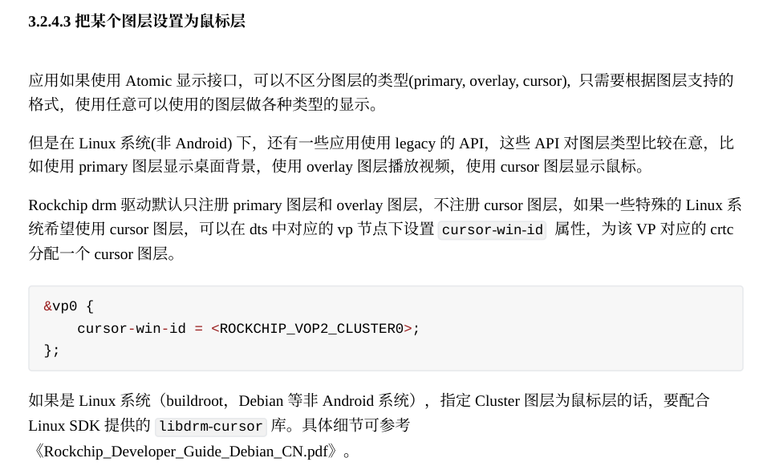

##### 24.4.1 drm-planes 实验

```c
#define _GNU_SOURCE
#include <errno.h>
#include <fcntl.h>
#include <stdbool.h>
#include <stdint.h>
#include <stdio.h>
#include <stdlib.h>
#include <string.h>
#include <sys/mman.h>
#include <time.h>
#include <unistd.h>
#include <xf86drm.h>
#include <xf86drmMode.h>

struct drm_device {
        uint32_t width;                 //显示器的宽的像素点数量
        uint32_t height;                //显示器的高的像素点数量
        uint32_t pitch;                 //每行占据的字节数
        uint32_t handle;                //drm_mode_create_dumb的返回句柄
        uint32_t size;                  //显示器占据的总字节数
        uint32_t *vaddr;                //mmap的首地址
        uint32_t fb_id;                 //创建的framebuffer的id号
        struct drm_mode_create_dumb create ;    //创建的dumb
        struct drm_mode_map_dumb map;                   //内存映射结构体
};

drmModeConnector *conn; //connetor相关的结构体
drmModeRes *res;                //资源
drmModePlaneRes *plane_res;//图层资源

int fd;                                 //文件描述符
uint32_t conn_id;
uint32_t crtc_id;
uint32_t plane_id[3];   //图层id数组


#define RED 0XFF0000
#define GREEN 0X00FF00
#define BLUE 0X0000FF

struct drm_device buf;

uint32_t color_table[6] = {RED,GREEN,BLUE,RED,GREEN,BLUE};


static int drm_create_fb(struct drm_device *bo)
{
        /* create a dumb-buffer, the pixel format is XRGB888 */
        bo->create.width = bo->width;
        bo->create.height = bo->height;
        bo->create.bpp = 32;

        /* handle, pitch, size will be returned */
        drmIoctl(fd, DRM_IOCTL_MODE_CREATE_DUMB, &bo->create);

        /* bind the dumb-buffer to an FB object */
        bo->pitch = bo->create.pitch;
        bo->size = bo->create.size;
        bo->handle = bo->create.handle;
        drmModeAddFB(fd, bo->width, bo->height, 24, 32, bo->pitch,
                           bo->handle, &bo->fb_id);

        //每行占用字节数，共占用字节数，MAP_DUMB的句柄
        printf("pitch = %d ,size = %d, handle = %d \n",bo->pitch,bo->size,bo->handle);

        /* map the dumb-buffer to userspace */
        bo->map.handle = bo->create.handle;
        drmIoctl(fd, DRM_IOCTL_MODE_MAP_DUMB, &bo->map);

        bo->vaddr = mmap(0, bo->create.size, PROT_READ | PROT_WRITE,
                        MAP_SHARED, fd, bo->map.offset);

        /* initialize the dumb-buffer with white-color */
        memset(bo->vaddr, 0xff,bo->size);

        return 0;
}

static void drm_destroy_fb(struct drm_device *bo)
{
        struct drm_mode_destroy_dumb destroy = {};

        drmModeRmFB(fd, bo->fb_id);

        munmap(bo->vaddr, bo->size);

        destroy.handle = bo->handle;

        drmIoctl(fd, DRM_IOCTL_MODE_DESTROY_DUMB, &destroy);
}

int drm_init()
{
        int i;
        //打开drm设备，设备会随设备树的更改而改变,多个设备时，请留一下每个屏幕设备对应的drm设备
        fd = open("/dev/dri/card0", O_RDWR | O_CLOEXEC);
    if(fd < 0){
        printf("wrong\n");
        return 0;
    }

        drmSetClientCap(fd, DRM_CLIENT_CAP_UNIVERSAL_PLANES, 1);
        plane_res = drmModeGetPlaneResources(fd);
        printf("count_planes = %d\n",plane_res-> count_planes);
        for(i=0;i<3;i++){
                plane_id[i] = plane_res->planes[i];
                printf("planes[%d]= %d\n",i,plane_id[i]);
        }

        //获取drm的信息
        res = drmModeGetResources(fd);
        crtc_id = res->crtcs[0];
        conn_id = res->connectors[0];
        //打印CRTCS,以及conneter的id
        printf("crtc = %d , conneter = %d\n",crtc_id,conn_id);

        conn = drmModeGetConnector(fd, conn_id);
        buf.width = conn->modes[1].hdisplay;
        buf.height = conn->modes[1].vdisplay;

        //打印屏幕分辨率
        printf("width = %d , height = %d\n",buf.width,buf.height);

        //创建framebuffer层
        drm_create_fb(&buf);

        //设置CRTCS
        drmModeSetCrtc(fd, crtc_id, buf.fb_id,
                        0, 0, &conn_id, 1, &conn->modes[1]);

        return 0;
}

int drm_exit()
{
        drm_destroy_fb(&buf);
        drmModeFreeConnector(conn);
        drmModeFreeResources(res);
        close(fd);
}

int main(int argc, char **argv)
{
        int i;
        int j = 0;
        drm_init();

        //显示三色
        for(j=0;j<3;j++){
                for(i =j*buf.width*buf.height/3;i< (j+1)*buf.width*buf.height/3;i++)
                        buf.vaddr[i] = color_table[j];
        }

        getchar();
        //将framebuffer上2/3的区域放到图层一上，
        //此时屏幕改变，将的framebuffer区域拉伸到整个屏幕中
        drmModeSetPlane(fd, plane_id[0], crtc_id, buf.fb_id, 0,
                        0, 0, buf.width, buf.height,
                        0 << 16, 0 << 16, buf.width << 16, buf.height/3*2 << 16);

        getchar();
        //将framebuffer区域缩放一倍放到图层二上，把图层二的位置放到屏幕的下方
        //叠加在图层一上，可以看到图层二覆盖了图层一的部分区域
        drmModeSetPlane(fd, plane_id[1], crtc_id, buf.fb_id, 0,
                        buf.width/4, buf.height/2, buf.width/2, buf.height/2,
                        0 << 16, 0 << 16, buf.width << 16, buf.height << 16);

        getchar();

        drm_exit();

        exit(0);
}
```

#### 24.5 legacy 接口函数

前面使用过的 legacy 接口有下列：

```c
drmModeSetCrtc();
drmModeSetPlane();
```

- 两个函数具有一定的重合性，部分功能两个都可以同时起作用。

- 在 drm 驱动激活时，framebuffer 会与 PRIMARY Planes 绑定在一起，`drmModeSetCrtc()` 可以直接通过操作framebuffer，而不用通过设置 Planes 达到显示的效果。
- `drmModeSetPlane()` 则是更正规的操作 Planes 的函数。
- 在双缓冲设计，我们同样可以像 `drmModeSetCrtc()` 操作那样去使用 `drmModeSetPlane()` 来构建双缓冲，图像大小一致设置偏移量或者切换 buffer。

#### 24.6 总结

DRM 应用编程–legacy 接口的框架基于最简单 DRM(drm-single) 的实验，其他的操作也是在最简单 DRM(drm-single) 的实验的框架上进行修改，步骤：

1. 打开设备(两种方法)。
2. 创建 page-flip-handle ( page-flip 中使用)。
3. 获取 plane 资源( planes 中使用)。
4. 获取 drm 的资源，包括 crtcs 和 connecter 位号。
5. 获取 connecter 的基本信息，高和宽的像素点。
6. 创建 framebuffer，创建 mmap 区, 双缓冲 drm 需要额外配置 framebuffer 。
7. 设置 CRTCS 或 page-flip 。
8. 设置 plane 资源( planes 中使用)。
9. 操作屏幕。

### 25. DRM 应用编程–atomic 接口

目前 DRM 主要推荐使用的是 Atomic（原子的）接口，前面的程序 legacy 接口已经过时了。

#### 25.1 Property

Property（属性）—–Atomic 操作必须依赖的基本元素。

Property 把前面的 legacy 接口传入的参数单独抽出来，做成一个个独立的全局属性。通过设置这些属性参数，即可完成对显示参数的设置。

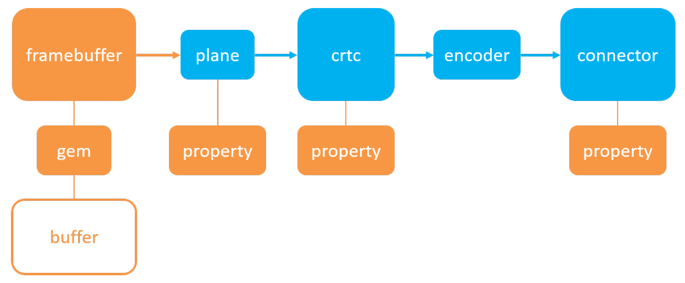


Property 的结构简单概括主要由 3 部分组成：`name`、`id` 和 `value`。其中 `id` 为该 property 在DRM 框架中全局唯一的标识符。

采用 property 机制的好处是：

1. 减少上层应用接口的维护工作量。当开发者有新的功能需要添加时，无需增加新的函数名和 `IOCTL`，只需在底层驱动中新增一个 property，然后在自己的应用程序中获取/操作该 property 的值即可。
2. 增强了参数设置的灵活性。一次 `IOCTL` 可以同时设置多个 property，减少了 user space 与 kernel space 切换的次数，同时最大限度的满足了不同硬件对于参数设置的要求，提高了软件效率。

DRM 中的 property 大多以功能进行划分，并且还定义了一组 Standard Properties，这些标准 properties 在任何平台上都会被创建。

CRTC：

|      name      | 功能                                                         |
| :------------: | ------------------------------------------------------------ |
|     ACTIVE     | CRTC 当前的使能状态，一般用于控制 CRTC 上下电                |
|    MODE_ID     | CRTC 当前所使用的 display mode ID，通过该 ID 可以找到具体的 display mode 配置参数 |
| OUT_FENCE_PTR  | 输出 fence 指针，指向当前正在显示的 buffer 所对应的 fence fd，该 fence 由 DRM 驱动创建，供上层应用程序使用，用来表示当前 buffer CRTC 是否还在占用 |
|   GAMMA_LUT    | gamma 查找表参数                                             |
| GAMMA_LUT_SIZE | ga_mma 查找表参数长度                                        |

CONNECTOR：

|    name    | 功能                                                         |
| :--------: | ------------------------------------------------------------ |
|    EDID    | Extended Display Identification Data，标识显示器的参数信息，是一种 VESA 标准数据格式 |
|    DPMS    | Display Power Management Signaling，用于控制显示器的电源状态，如休眠唤醒。也是一种VESA 标准 |
| linkstatus | 用于标识当前 connector 的连接状态，如 Good/Bad               |
|  CRTC_ID   | 当前 connector 所连接的 CRTC object ID，与 PLANE 中 CRTC_ID 属性是同一个 property |

Planes：

|    name     | 功能                                                         |
| :---------: | ------------------------------------------------------------ |
|    type     | plane 的类型，CURSOR、PRIMARY 或者 OVERLAY                   |
|    FB_ID    | 与当前 plane 绑定的 framebuffer object ID                    |
| IN_FENCE_FD | 与当前 plane 相关联的 input fence fd，由 buffer 的生产者创建，供 DRM 底层驱动使用，用来标识当前传下来的 buffer 是否可以开始访问 |
|   CRTC_ID   | 当前 plane 所关联的 CRTC object ID，与 CONNECTOR 中的 CRTC_ID 属性是同一个 property |
|    SRC_X    | 当前 framebuffer 区域的起始偏移x 坐标                        |
|    SRC_Y    | 当前 framebuffer 区域的起始偏移y 坐标                        |
|    SRC_W    | 当前 framebuffer 区域的宽度                                  |
|    SRC_H    | 当前 framebuffer 区域的高度                                  |
|   CRTC_X    | 屏幕显示区域的起始偏移 x 坐标                                |
|   CRTC_Y    | 屏幕显示区域的起始偏移 y 坐标                                |
|   CRTC_W    | 屏幕显示区域的宽度                                           |
|   CRTC_H    | 屏幕显示区域的高度                                           |

如下图所示：

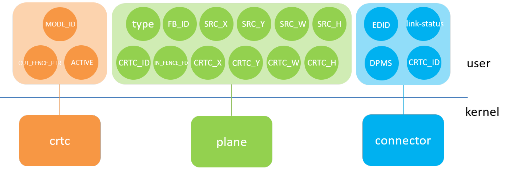


上图的 Properties 并非全部的 Properties，这里只列举了 drm 程序里通用的几个 Properties，如果想
要知道更多的 Properties，后面的程序分析会有讲到。

我们操作上面的 Properties 就可以设置 CRTC 以及屏幕显示。

#### 25.2 DRM 应用编程 ( drm-atomic-ctrc )

在前面我们使用过的 legacy 接口有：

```c
drmModeSetCrtc();
drmModeSetPlane();
```

因此，我们从 legacy 接口到 Atomic 接口，只需要把上面的接口改成相关的接口就可以操作了。

本例以 DRM 应用编程–legacy 接口的 drm-planes 实验为基础， 修改 legacy 接口的 `drmModeSetCrtc();` 为atomic 接口。

```c
#define _GNU_SOURCE
#include <errno.h>
#include <fcntl.h>
#include <stdbool.h>
#include <stdint.h>
#include <stdio.h>
#include <stdlib.h>
#include <string.h>
#include <sys/mman.h>
#include <time.h>
#include <unistd.h>
#include <xf86drm.h>
#include <xf86drmMode.h>

struct drm_device {
        uint32_t width;                 //显示器的宽的像素点数量
        uint32_t height;                //显示器的高的像素点数量
        uint32_t pitch;                 //每行占据的字节数
        uint32_t handle;                //drm_mode_create_dumb的返回句柄
        uint32_t size;                  //显示器占据的总字节数
        uint32_t *vaddr;                //mmap的首地址
        uint32_t fb_id;                 //创建的framebuffer的id号
        struct drm_mode_create_dumb create ;    //创建的dumb
        struct drm_mode_map_dumb map;                   //内存映射结构体
};

struct property_crtc {
        uint32_t blob_id;
        uint32_t property_crtc_id;
        uint32_t property_mode_id;
        uint32_t property_active;
};

drmModeConnector *conn; //connetor相关的结构体
drmModeRes *res;                //资源
drmModePlaneRes *plane_res;

int fd;                                 //文件描述符
uint32_t conn_id;
uint32_t crtc_id;
uint32_t plane_id[3];

#define RED 0XFF0000
#define GREEN 0X00FF00
#define BLUE 0X0000FF


uint32_t color_table[6] = {RED,GREEN,BLUE,RED,GREEN,BLUE};

struct drm_device buf;
struct property_crtc pc;

static int drm_create_fb(struct drm_device *bo)
{
        /* create a dumb-buffer, the pixel format is XRGB888 */
        bo->create.width = bo->width;
        bo->create.height = bo->height;
        bo->create.bpp = 32;

        /* handle, pitch, size will be returned */
        drmIoctl(fd, DRM_IOCTL_MODE_CREATE_DUMB, &bo->create);

        /* bind the dumb-buffer to an FB object */
        bo->pitch = bo->create.pitch;
        bo->size = bo->create.size;
        bo->handle = bo->create.handle;
        drmModeAddFB(fd, bo->width, bo->height, 24, 32, bo->pitch,
                           bo->handle, &bo->fb_id);

        //每行占用字节数，共占用字节数，MAP_DUMB的句柄
        printf("pitch = %d ,size = %d, handle = %d \n",bo->pitch,bo->size,bo->handle);

        /* map the dumb-buffer to userspace */
        bo->map.handle = bo->create.handle;
        drmIoctl(fd, DRM_IOCTL_MODE_MAP_DUMB, &bo->map);

        bo->vaddr = mmap(0, bo->create.size, PROT_READ | PROT_WRITE,
                        MAP_SHARED, fd, bo->map.offset);

        /* initialize the dumb-buffer with white-color */
        memset(bo->vaddr, 0xff,bo->size);

        return 0;
}

static void drm_destroy_fb(struct drm_device *bo)
{
        struct drm_mode_destroy_dumb destroy = {};
        drmModeRmFB(fd, bo->fb_id);
        munmap(bo->vaddr, bo->size);
        destroy.handle = bo->handle;
        drmIoctl(fd, DRM_IOCTL_MODE_DESTROY_DUMB, &destroy);
}

static uint32_t get_property(int fd, drmModeObjectProperties *props)
{
        drmModePropertyPtr property;
        uint32_t i, id = 0;

        for (i = 0; i < props->count_props; i++) {
                property = drmModeGetProperty(fd, props->props[i]);
                printf("\"%s\"\t\t---",property->name);
                printf("id = %d , value=%ld\n",props->props[i],props->prop_values[i]);
        }
    return 0;
}

static uint32_t get_property_id(int fd, drmModeObjectProperties *props,
                                const char *name)
{
        drmModePropertyPtr property;
        uint32_t i, id = 0;


        /* find property according to the name */
        for (i = 0; i < props->count_props; i++) {
                property = drmModeGetProperty(fd, props->props[i]);
                if (!strcmp(property->name, name))
                        id = property->prop_id;
                drmModeFreeProperty(property);

                if (id)
                        break;
        }

        return id;
}

int drm_init()
{
        int i;

        drmModeObjectProperties *props;
        drmModeAtomicReq *req;

        fd = open("/dev/dri/card0", O_RDWR | O_CLOEXEC);

        res = drmModeGetResources(fd);
        crtc_id = res->crtcs[0];
        conn_id = res->connectors[0];

        drmSetClientCap(fd, DRM_CLIENT_CAP_UNIVERSAL_PLANES, 1);
        plane_res = drmModeGetPlaneResources(fd);
        for(i=0;i<3;i++){
                plane_id[i] = plane_res->planes[i];
                printf("planes[%d]= %d\n",i,plane_id[i]);
        }

        conn = drmModeGetConnector(fd, conn_id);
        buf.width = conn->modes[1].hdisplay;
        buf.height = conn->modes[1].vdisplay;
        drm_create_fb(&buf);

        drmSetClientCap(fd, DRM_CLIENT_CAP_ATOMIC, 1);

        /* get connector properties */
        props = drmModeObjectGetProperties(fd, conn_id, DRM_MODE_OBJECT_CONNECTOR);
        printf("/-----conn_Property-----/\n");
        get_property(fd, props);
        printf("\n");
        pc.property_crtc_id = get_property_id(fd, props, "CRTC_ID");
        drmModeFreeObjectProperties(props);

        /* get crtc properties */
        props = drmModeObjectGetProperties(fd, crtc_id, DRM_MODE_OBJECT_CRTC);
        printf("/-----CRTC_Property-----/\n");
        get_property(fd, props);
        printf("\n");
        pc.property_active = get_property_id(fd, props, "ACTIVE");
        pc.property_mode_id = get_property_id(fd, props, "MODE_ID");
        drmModeFreeObjectProperties(props);

        /* create blob to store current mode, and retun the blob id */
        drmModeCreatePropertyBlob(fd, &conn->modes[1],
                                sizeof(conn->modes[1]), &pc.blob_id);

        /* start modeseting */
        req = drmModeAtomicAlloc();
        drmModeAtomicAddProperty(req, crtc_id, pc.property_active, 1);
        drmModeAtomicAddProperty(req, crtc_id, pc.property_mode_id, pc.blob_id);
        drmModeAtomicAddProperty(req, conn_id, pc.property_crtc_id, crtc_id);
        drmModeAtomicCommit(fd, req, DRM_MODE_ATOMIC_ALLOW_MODESET, NULL);
        drmModeAtomicFree(req);
}

int drm_exit()
{
        drm_destroy_fb(&buf);
        drmModeFreeConnector(conn);
        drmModeFreePlaneResources(plane_res);
        drmModeFreeResources(res);
        close(fd);
}

int main(int argc, char **argv)
{
        int i,j;
        drm_init();
        //显示三色
        for(j=0;j<3;j++){
                for(i =j*buf.width*buf.height/3;i< (j+1)*buf.width*buf.height/3;i++)
                        buf.vaddr[i] = color_table[j];
        }
        //1：1设置屏幕，没有该函数不会显示画面
        drmModeSetPlane(fd, plane_id[0], crtc_id, buf.fb_id, 0,
                        0, 0, buf.width, buf.height,
                        0 << 16, 0 << 16, buf.width << 16, buf.height << 16);

        getchar();
        //将framebuffer上2/3的区域放到图层一上，
        //此时屏幕改变，将的framebuffer区域拉伸到整个屏幕中
        drmModeSetPlane(fd, plane_id[0], crtc_id, buf.fb_id, 0,
                        0, 0, buf.width, buf.height,
                        0 << 16, 0 << 16, buf.width << 16, buf.height/3*2 << 16);

        getchar();
        //将framebuffer区域缩放一倍放到图层二上，把图层二的位置放到屏幕的下方
        //叠加在图层一上，可以看到图层二覆盖了图层一的部分区域
        drmModeSetPlane(fd, plane_id[1], crtc_id, buf.fb_id, 0,
                        buf.width/4, buf.height/2, buf.width/2, buf.height/2,
                        0 << 16, 0 << 16, buf.width << 16, buf.height << 16);

        getchar();

        drm_exit();

        return 0;
}
```

### 26. 文字显示

### 27. 图片显示

### 28. 进程

接下来的章节我们章学习 Linux 内核提供的进程、管道、信号等内核对象，了解这些内核对象的应用将有助于我们更好地了解 Linux 内核究竟为应用层提供了什么特性，也有益于后续编写更底层的驱动程序。

#### 28.1 简单了解进程

一般来说 Linux 中有很多 shell 终端，而一个终端就是一个进程，若打开了多个终端，那么这些被打开的终端就相当于一个个进程，这些进程独立运行在系统中，互不影响。如下打开了三个 shell 终端，这些终端各自有输入输出，互不干扰，如下图所示。

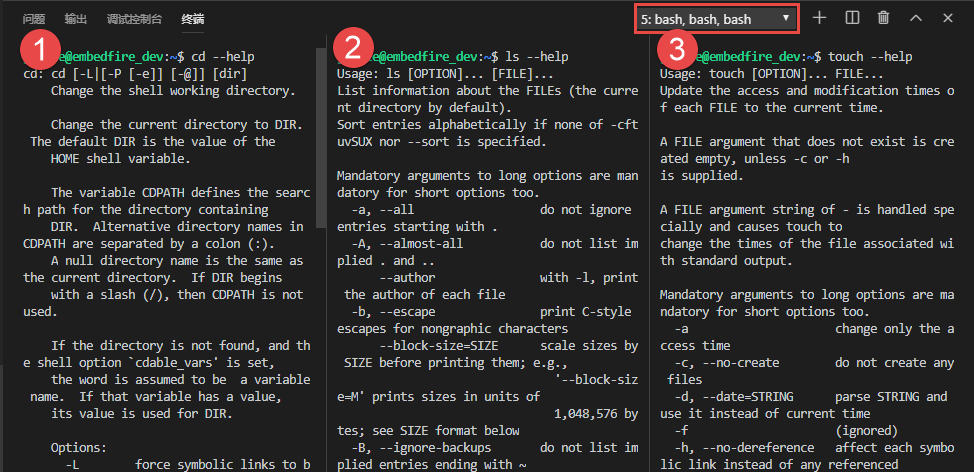

#### 28.2 查看进程

即使刚打开虚拟机，没有运行任何程序，电脑中也会有进程存在，因为系统中必须要有进程在处理一些必要的程序，以保证系统能正常运行。其实在 Linux 中是通过检查表记录与进程相关的信息的，进程表就是一个数据结构，它把当前加载在内存中的所有进程的有关信息保存在一个表中，其中包括进程的 PID、进程的状态、命令字符串和其他一些 `ps` 命令输出的各类信息。操作系统通过进程的 ID 对它们进行管理，这些 PID 是进程表的索引，就目前的Linux 系统而言，系统支持同时运行的进程数可能只与用于建立进程表项的内存容量有关，而没有具体的数量限制，也就意味着系统如果有足够的内存，那么理论上就可以运行无数个进程。

##### 28.2.1 进程 ID

Linux 系统中的每个进程都会被分配一个唯一的数字编号，我们称之为进程 ID（ProcessID，通常也被简称为PID）。进程 ID 是一个16 位的正整数，默认取值范围是从 2 到32768（可以修改）。由 Linux 在启动新进程的时候自动依次分配，当进程被启动时，系统将按顺序选择下一个未被使用的数字作为它的 PID。当 PID 的数值达到最大时，系统将重新选择下一个未使用的数值。新的 PID 将重新从 2 开始，这是因为 PID 数字为 1 的值一般是为特殊进程 `init` 保留，即系统在运行时就存在的第一个进程，`init` 进程负责管理其他进程。

##### 28.2.2 父进程 ID

任何进程（除 `init` 进程）都是由另一个进程启动，该进程称为被启动进程的父进程，被启动的进程称为子进程，父进程号无法在用户层修改。父进程的进程号（PID）即为子进程的父进程号（PPID）。用户可以通过调用 `getppid()` 函数来获得当前进程的父进程号。为了更直观看到这些进程，我们可以使用 `ps` 命令去查看系统中的进程情况，`ps` 命令可以显示我们正在运行的进程、其他用户正在运行的进程或者目前在系统上运行的所有进程。

```bash
ps -aux
```

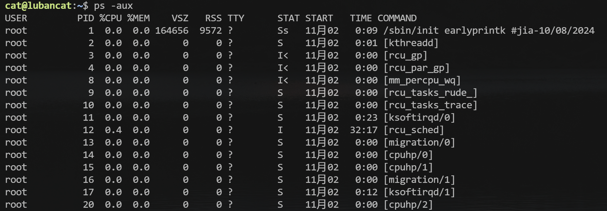

输出结果如上图所示，可以很明显看到，编号为 1 的进程是 `init` 进程。它位于 `/sbin/init` 目录中。当然，整个系统的进程可不止这一些，由于太多没法截图，就只展示这小部分的进程，可以自己使用下面命令去尝试一下，`ps` 命令可以显示当前系统中运行的进程。其实在 Linux 中，`ps` 命令有很多选项，因为它试图与很多不同 UNIX 版本的`ps` 命令兼容，这些选项决定显示哪些进程以及要显示的信息。

##### 28.2.3 父进程与子进程

进程启动时，启动进程是新进程的父进程，新进程是启动进程的子进程。

每个进程都有一个父进程（除了系统中如 “ 僵尸进程 ” 这种特殊进程外），因此，可以把 Linux 中的进程结构想象成一个树状结构，其中 `init` 进程就是树的“根”；或者可以把 `init` 进程看作为操作系统的进程管理器，它是其他所有进程的祖先进程。我们将要看到的其他系统进程要么是由 `init` 进程启动的，要么是由被 `init` 进程启动的其他进程启动的。

总的来说 `init` 进程下有很多子进程，这些子进程又可能存在子进程，就像家族一样。系统中所有的父进程 ID 被称为 PPID，不同进程的父进程是不同的，这个值只是当前进程的父进程的 ID，系统中的父进程与子进程是相对而言的，就好比爷爷<-> 爸爸<-> 儿子之间的关系，爸爸相对于爷爷而言是儿子，相对于儿子而言则是爸爸。为了更加直观看出系统中父进程与子进程，此处我们使用 `pstree` 命令将进程以树状关系列出来，在 PC 或开发板上执行以下命令：

```bash
pstree

# 若系统提示 command not found，可通过如下指令安装：
sudo apt update
sudo apt install psmisc
```

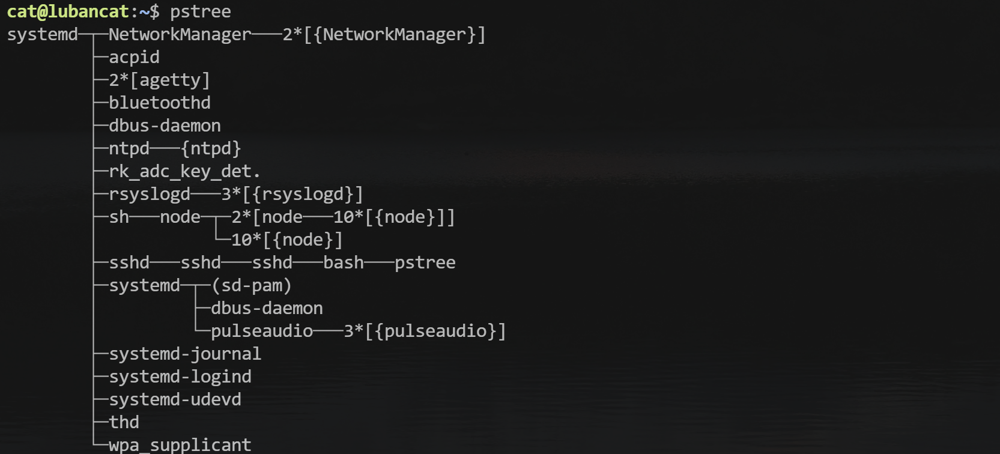

#### 28.3 程序与进程

##### 28.3.1 程序的概念

程序（program）是一个普通文件，是为了完成特定任务而准备好的指令序列与数据的集合，这些指令和数据以”可执行映像”的格式保存在磁盘中。正如我们所写的一些代码，经过编译器编译后，就会生成对应的可执行文件，那么这个就是程序，或者称之为可执行程序。

##### 28.3.2 进程的概念

进程（process）则是程序执行的具体实例，比如一个可执行文件，在执行的时候，它就是一个进程，直到该程序执行完毕。那么在程序执行的过程中，它享有系统的资源，至少包括进程的运行环境、CPU、外设、内存、进程 ID 等资源与信息，同样的一个程序，可以实例化为多个进程，在 Linux 系统下使用 `ps` 命令可以查看到当前正在执行的进程，当这个可执行程序运行完毕后，进程也会随之被销毁（可能不是立即销毁，但是总会被销毁）。

程序并不能单独执行，只有=程序加载到内存中，系统为它分配资源后才能够执行，这种正在执行的程序称之为进程，也就是说==进程是系统进行资源分配和调度的一个独立单位，每个进程都有自己单独的地址空间==。

> [!NOTE]
>
> “ 程序” 和 “ 进程 ” 的关系类似 “ 类 ” 与 “ 对象 ”

举个例子，我们可以看到 `/bin` 目录下有很多可执行文件，如下图所示，我们在系统中打开一个终端就是一个进程，这个进程由 `bash` 可执行文件（程序）实例化而来。而一个 Linux 系统可以打开多个终端，并且这些终端是独立运行在系统中的。


##### 28.3.3 程序变成进程

在 Linux 系统中，程序只是个静态的文件，而进程是一个动态的实体，进程的状态会在运行过程中改变，那么问题来了，程序到底是如何变成一个进程的呢？其实正如我们运行一个程序（可执行文件），通常在 Shell 中输入命令运行就可以了，在这运行的过程中包含了程序到进程转换的过程，整个转换过程主要包含以下 3 个步骤：
1. 查找命令对应程序文件的位置。
2. 使用 `fork()` 函数为启动一个新进程。
3. 在新进程中调用 `exec` 族函数装载程序文件，并执行程序文件中的 `main()` 函数。

##### 28.3.4 总结

总的来说，程序与进程有以下的关系：
1. 程序只是一系列指令序列与数据的集合，它本身没有任何运行的含义，它只是一个静态的实体。而进程则不同，它是程序在某个数据集上的执行过程，它是一个动态运行的实体，有自己的生命周期，它因启动而产生，因调度而运行，因等待资源或事件而被处于等待状态，因完成任务而被销毁。
2. 进程和程序并不是一一对应的，一个程序执行在不同的数据集上运行就会成为不同的进程，可以用进程控制块来唯一地标识系统中的每个进程。而这一点正是程序无法做到的，由于程序没有和数据产生直接的联系，既使是执行不同的数据的程序，他们的指令的集合依然是一样的，所以无法唯一地标识出这些运行于不同数据集上的程序。一般来说，一个进程肯定有一个与之对应的程序，而且有且只有一个。而一个程序有可能没有与之对应的进程（因为这个程序没有被运行），也有可能有多个进程与之对应（这个程序可能运行在多个不同的数据集上）。
3. 进程具有并发性而程序没有。
4. 进程是竞争计算机资源的基本单位，而程序不是。

#### 28.4 进程状态

可以通过 `ps` 命令将系统中运行的进程信息打印出来，我们只需要关注 STAT 那一列的信息即可，进程的状态非常多种，具体如下图：

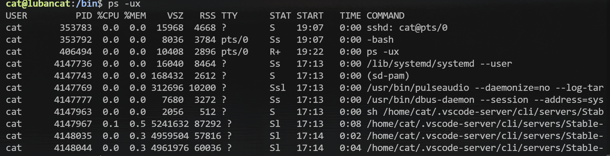

从上图中可以看到进程的状态有比较多种，有些是 S，有些是 Ss，还有些是 Sl、Rl、R+ 等状态，具体是什么含义呢？其实是这些状态只是 Linux 系统进程的一部分，还有一些状态是没有显示出来的，因为当前用户下的所有进程并没有处于那些状态，所以就没显示出来，下面简单介绍一下 Linux 系统中所有的进程状态，如下表所示。

| 状态 | 说明                                                         |
| :--: | ------------------------------------------------------------ |
|  R   | 运行状态。严格来说，应该是 “ 可运行状态 ” ，即表示进程在运行队列中，处于正在执行或即将运行状态，只有在该状态的进程才可能在 CPU 上运行，而同一时刻可能有多个进程处于可运行状态。 |
|  S   | 可中断的睡眠状态。处于这个状态的进程因为等待某种事件的发生而被挂起，比如进程在等待信号。 |
|  D   | 不可中断的睡眠状态。通常是在等待输入或输出（I/O）完成，处于这种状态的进程不能响应异步信号。 |
|  T   | 停止状态。通常是被 shell 的工作信号控制，或因为它被追踪，进程正处于调试器的控制之下。 |
|  Z   | 退出状态。进程成为僵尸进程。                                 |
|  X   | 退出状态。进程即将被回收。                                   |
|  s   | 进程是会话其首进程。                                         |
|  l   | 进程是多线程的。                                             |
|  +   | 进程属于前台进程组。                                         |
|  <   | 高优先级任务。                                               |

#### 28.5 进程状态转换

从前文的介绍我们也知道，进程是动态的活动的实例，这其实指的是进程会有很多种运行状态，一会儿睡眠、一会儿暂停、一会儿又继续执行。虽然 Linux 操作系统是一个多用户多任务的操作系统，但对于单核的 CPU 系统来说，在某一时刻，只能有一个进程处于运行状态（此处的运行状态指的是占用CPU），其他进程都处于其他状态，等待系统资源，各任务根据调度算法在这些状态之间不停地切换。但由于 CPU 处理速率较快，使用户感觉每个进程都是同时运行。

下图展示了 Linux 进程从被启动到退出的全部状态，以及这些状态发生转换时的条件。

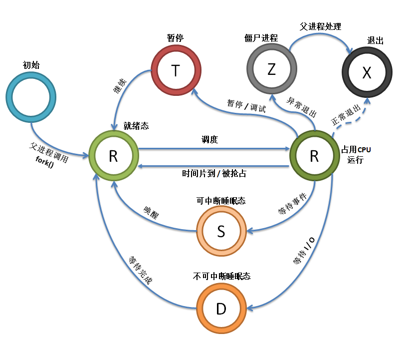

1. 一般来说，一个进程的开始都是从其父进程调用 `fork` 函数开始的，所以在系统开始运行的时候，`init` 进程就开始工作，在系统运行过程中，会不断启动新的进程，这些进程要么是由 `init` 进程启动的，要么是由被 `init` 进程启动的其他进程所启动的。

2. 一个进程被启动后，都是处于可运行状态（但是此时进程并未占用 CPU 运行）。处于该状态的进程可以是正在进程等待队列中排队，也可以占用 CPU 正在运行，我们习惯上称前者为“就绪态”，而后者占用 CPU 运行的状态称之为“运行态”。

3. 当系统产生进程调度的时候，处于就绪态的进程可以占有 CPU 的使用权，此时进程就处于运行态。但每个进程运行时间都是有限的，比如 10 毫秒，这段运行时间被称为 “时间片”。当进程的时间片已经耗光了的情况下，如果进程还没有结束运行，那么会被系统重新放入等待队列中等待，此时进程又转变为就绪状态，等待下一次进程的调度。另外，正处于 “运行态” 的进程即使时间片没有耗光，也可能被别的更高优先级的进程 “抢占”，被迫重新回到等到队列中等待。

4. 处于 “运行态” 的进程可能会等待某些事件、信号或者资源而进入 “可中断睡眠态”，比如进程要读取一个管道文件数据而管道为空，或者进程要获得一个锁资源而当前锁不可获取，甚至是进程自己调用 `sleep`  函数来强制进入睡眠状态，这些情况下进程的状态都会变成 “可中断睡眠态”。顾名思义，“可中断睡眠态” 就是可以被中断的，能响应信号，在特定条件发生后，进程状态就会转变为 “就绪态”，比如其他进程想管道文件写入数据后，或者锁资源可以被获取，或者是睡眠时间到达等情况。

5. 当然，处于 “运行态” 的进程还可能会进入 “不可中断睡眠态”，在这种状态下的进程不能响应信号，但是这种状态非常短暂，我们几乎无法通过 `ps` 命令将其显示出来，一般处于这种状态的进程都是在等待输入或输出（I/O）完成，在等待完成后自动进入“就绪态”。

6. 当进程收到 SIGSTOP 或者 SIGTSTP 中的其中一个信号时，进程状态会被置为 “暂停态”，该状态下的进程不再参与调度，但系统资源不会被释放，直到收到 SIGCONT 信号后被重新置为就绪态。当进程被追踪时（典型情况是使用调试器调试应用程序的情况），收到任何信号状态都会被置为 TASK_TRACED 状态，该状态跟暂停态是一样的，一直要等到 SIGCONT信号后进程才会重新参与系统进程调度。

7. 进程在完成任务后会退出，那么此时进程状态就变为退出状态，这是正常的退出，比如在 `main` 函数内 `return` 或者调用 `exit` 函数或者线程调用 `pthread_exit` 函数都是属于正常退出。

    **为什么要强调正常退出呢？**

    因为进程也会有异常退出的情况，比如进程收到 `kill` 信号就会被杀死，其实不管怎么死，最后内核都会调用 `do_exit` 函数来使得进程的状态变成“僵尸态（僵尸进程）”，这里的 “僵尸” 指的是进程的PCB（Process Control Block，进程控制块）。

    **为什么一个进程的死掉之后还要把尸体（PCB）留下？**

    因为进程在退出的时候，系统会将其退出信息都保存在进程控制块中，比如如果他正常退出，那进程的退出值是什么？如果是被信号杀死？那么是哪个信号将其杀死？这些 “死亡信息” 都被一一封存在该进程的 PCB 当中，好让别人可以清楚地知道：我是怎么死的。

    **那谁会关心它是怎么死的呢？**

    那就是它的父进程，它的父进程之所以要启动它，很大的原因是要让这个进程去干某一件事情，现在这个孩子已死，那事情办得如何，因此需要把这些信息保存在进程控制块中，等着父进程去查看这些信息。

8. 当父进程去处理僵尸进程的时候，会将这个僵尸进程的状态设置为 EXIT_DEAD，即死亡态（退出态），这样子系统才能去回收僵尸进程的内存空间，否则系统将存在越来越多的僵尸进程，最后导致系统内存不足而崩溃。那么还有两个问题：

    **假如父进程由于太忙而没能及时去处理僵尸进程的时候，要如何处理？**

    该情况可能不同的程序员有不同的处理，父进程有别的事情要干，不能随时去处理僵尸进程。在这样的情形下，可以考虑使用信号异步通知机制，让一个孩子在变成僵尸的时候，给其父进程发一个信号，父进程接收到这个信号之后，再对其进行处理，在此之前父进程该干嘛就干嘛。

    **又假如在子进程变成 “僵尸态”之前，它的父进程已经先它而去了（退出），那么这个子进程变成僵尸态由谁处理呢？**

    如果如果一个进程的父进程先退出，那么这个子进程将变成 “孤儿进程”（没有父进程），那么这个进程将会被他的祖先进程收养（adopt），它的祖先进程是 `init`（该进程是系统第一个运行的进程，他的 PCB 是从内核的启动镜像文件中直接加载的，系统中的所有其他进程都是 `init` 进程的后代）。那么当子进程退出的时候，`init` 进程将回收这些资源。

#### 28.6 启动新进程

在 Linux 中启动一个进程有多种方法，比如可以使用 `system()` 函数，也可以使用 `fork()` 函数去启动（在其他的一些 Linux 书籍也称作创建进程，该文将全部称之为启动进程）一个新的进程，第一种方法相对简单，但是在使用之前应慎重考虑，因为它效率低下，而且具有不容忽视的安全风险。第二种方法相对复杂了很多，但是提供了更好的弹性、效率和安全性。

##### 28.6.1 system() 进程实验

这个 `system()` 函数是 C 标准库中提供的，它主要是提供了一种调用其它程序的简单方法。读者可以利用 `system()` 函数调用一些应用程序，它产生的结果与从 shell 中执行这个程序基本相似。事实上，`system()` 启动了一个运行着 `/bin/sh` 的子进程，然后将命令交由它执行，其中 `/bin/sh` 是一个shell 的一种。

举个例子，在野火提供的 `system_programing/system` 目录下，找到 `system.c` 文件，它里面的应用例程就是使用 `system()` 函数启动一个新进程 `ls`，具体的代码如下所示：

```c
// path: base_linux/system_programing/system/sources/system.c
#include <sys/types.h>
#include <unistd.h>
#include <stdio.h>
#include <stdlib.h>

int main(void)
{
    pid_t result;

    printf("This is a system demo!\n\n");

    /*调用 system()函数*/
    result = system("ls -l");

    printf("Done!\n\n");

    return result;
}
```

在代码的第13 行，就调用了这个 `system()` 函数，并且传入了一个命令 `ls -l` 这个命令与在 shell 中运行的结果是一样的，调用 `system()` 函数的返回值就是被调用的 shell 命令的返回值。如果系统中 shell 自身无法运行，`system()` 函数返回 127；如果出现了其它错误，`system()` 函数将返回 -1，为了简单，在这个例子中并没有检查`system` 调用是否能够真正的工作。因为 `system()`  函数使用shell调用命令，它受到系统 `shell` 自身的功能特性和安全缺陷的限制，因此，并不推荐使用这种方法去启动一个进程。

在 `system_programing/system` 目录下提供了对应编译的 Makefile 文件，这是一个通用的 Makefile 文件，本篇章内所有的例程都使用这个 Makefile 文件编译。该 Makefile 文件的原理与前面章节的一致，此处不再赘述：[多级结构工程的Makefile](#10.8.2 多级结构工程的Makefile)

Makefile 文件：

```makefile
# path: base_linux/system_programing/system/Makefile
TARGET = system

ARCH ?= arm

BUILD_DIR = build_$(ARCH)

SRC_DIR = sources

INC_DIR = includes .

SRCS = $(wildcard $(SRC_DIR)/*.c)

OBJS = $(patsubst %.c, $(BUILD_DIR)/%.o, $(notdir $(SRCS)))

DEPS = $(wildcard $(INC_DIR)/*.h)

CFLAGS = $(patsubst %, -I %, $(INC_DIR))

ifeq ($(ARCH), arm)
CC = gcc
else
CC = aarch64-linux-gnu-gcc
endif

$(BUILD_DIR)/$(TARGET): $(OBJS)
	$(CC) -o $@ $^ $(CFLAGS)
	@cp $(BUILD_DIR)/$(TARGET) .

$(BUILD_DIR)/%.o: $(SRC_DIR)/%.c $(DEPS)
	@mkdir -p $(BUILD_DIR)
	$(CC) -c -o $@ $< $(CFLAGS)

.PHONY: clean cleanall

clean:
	rm -rf $(BUILD_DIR)
	rm -f $(TARGET)

cleanall:
	rm -rf build_*
	rm -f $(TARGET)
```

虽然 `system()` 函数很有用，但它也有局限性，因为程序必须等待由 `system()` 函数启动的进程结束之后才能继续，因此我们不能立刻执行其他任务。

我们也可以让 `ls -l` 命令在后台运行，只需在命令结束位置加上 `&` 即可，具体命令如下：

```sudo
ls -l &
```

如果在 `system()` 函数中使用这个命令，它也是可以在后台中运行的，那么 `system()` 函数的调用将在 shell 命令结束后立刻返回。由于它是一个在后台运行程序的请求，所以 `ls` 程序一启动 shell 就返回了。

```c
result = system("ls -l &");
```

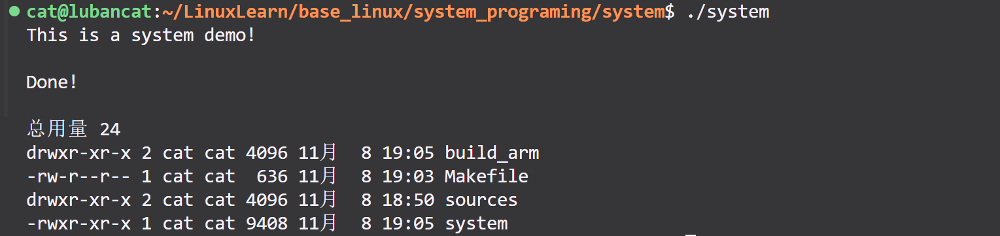

可以看出来，在 `ls` 命令还未来得及打印出它的所有输出结果之前，`system()` 函数就程序就打印出字符串 `Done` 然后退出了。在 `system()` 程序退出后，`ls` 命令继续完成它的输出。这类的处理行为往往会给用户带来很大的困惑，也不一定如用户所预料的结果一致，因此如果想要让进程按照自己的意愿执行，就需要能够对它们的行为做更细致的控制。

##### 28.6.2 fork() 进程实验

在前面了解到，`init` 进程可以启动一个子进程，它通过 `fork()` 函数从原程序中创建一个完全分离的子进程，当然，这只是 `init` 进程启动子进程的第一步，后续还有其他操作的。不管怎么说，`fork()` 函数的基础功能就是启动一个子进程，其示意图具体见 `fork` 示意图。

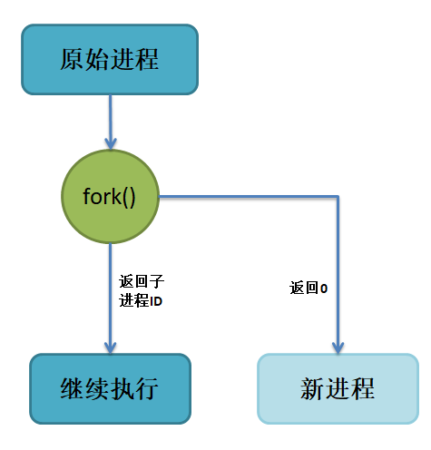

在父进程中的 `fork()` 调用后返回的是新的子进程的 PID。新进程将继续执行，就像原进程一样，不同之处在于，子进程中的 `fork()` 函数调用后返回的是 0，父子进程可以通过返回的值来判断究竟谁是父进程，谁是子进程。

`fork()` 函数用于从一个已存在的进程中启动一个新进程，新进程称为子进程，而原进程称为父进程。使用 `fork()` 函数的本质是将父进程的内容复制一份，正如细胞分裂一样，得到的是几乎两个完全一样的细胞，因此这个启动的子进程基本上是父进程的一个复制品，但子进程与父进程有不一样的地方，它们的联系与区别简单列举如下：

子进程与父进程一致的内容：

- 进程的地址空间。
- 进程上下文、代码段。
- 进程堆空间、栈空间，内存信息。
- 进程的环境变量。
- 标准 IO 的缓冲区。
- 打开的文件描述符。
- 信号响应函数。
- 当前工作路径。

子进程独有的内容：

- 进程号PID，PID 是身份证号码，是进程的唯一标识符。
- 记录锁，父进程对某文件加了把锁，子进程不会继承这把锁。
- 挂起的信号，这些信号是已经响应但尚未处理的信号，也就是”悬挂”的信号，子进程也不会继承这些信号。

因为子进程几乎是父进程的完全复制，所以父子两个进程会运行同一个程序，但是这种复制有一个很大的问题，那就是资源与时间都会消耗很大，当发出 `fork()` 系统调用时，内核原样复制父进程的整个地址空间并把复制的那一份分配给子进程。这种行为是非常耗时的，因为它需要做一些事情：

- 为子进程的页表分配页面。
- 为子进程的页分配页面。
- 初始化子进程的页表。
- 把父进程的页复制到子进程相应的页中

创建一个地址空间的这种方法涉及许多内存访问，消耗许多 CPU 周期，并且完全破坏了高速缓存中的内容，因此直接复制物理内存对系统的开销会产生很大的影响，更重要的是在大多数情况下，这样直接拷贝通常是毫无意义的，因为许多子进程通过装入一个新的程序开始它们的执行，这样就完全丢弃了所继承的地址空间。因此在 Linux 中引入一种写时复制技术（Copy On Write，简称 COW），我们知道，Linux 系统中的进程都是使用虚拟内存地址，虚拟地址与真实物理地址之间是有一个对应关系的，每个进程都有自己的虚拟地址空间，而操作虚拟地址明显比直接操作物理内存更加简便快捷，那么显而易见的，写时复制是一种可以推迟甚至避免复制数据的技术。内核此时并不复制整个进程的地址空间，而是让父子进程共享同一个地址空间（页面）。

那么**写时复制的思想就是在于：父进程和子进程共享页面而不是复制页面**。而共享页面就不能被修改，无论父进程和子进程何时试图向一个共享的页面写入内容时，都会产生一个错误，这时内核就把这个页复制到一个新的页面中并标记为可写。原来的页面仍然是写保护的，当还有进程试图写入时，内核检查写进程是否是这个页面的唯一属主，如果是则把这个页面标记为对这个进程是可写的。

总的来说，写时复制只会用在需要写入的时候才会复制地址空间，从而使各个进行拥有各自的地址空间，资源的复制是在需要写入的时候才会进行，在此之前，父进程与子进程都是以只读方式共享页面，这种技术使地址空间上的页的拷贝被推迟到实际发生写入的时候。而在绝大多数的时候共享的页面根本不会被写入，例如，在调用 `fork()` 函数后立即执行 `exec()`，地址空间就无需被复制了，这样一来 `fork()` 的实际开销就是复制父进程的页表以及给子进程创建一个进程描述符。

理论相关的知识了解至此即可，下面就看看 `fork()` 函数的使用，它的函数原型如下：

```c
pid_t fork(void);
```

在 `fork()` 启动新的进程后，子进程与父进程开始并发执行，谁先执行由内核调度算法来决定。`fork()`函数如果成功启动了进程，会对父子进程各返回一次，其中对父进程返回子进程的 PID，对子进程返回 0；如果 `fork()` 函数启动子进程失败，它将返回 -1。失败通常是因为父进程所拥有的子进程数目超过了规定的限制（CHILD_MAX），此时 errno 将被设为 EAGAIN。如果是因为进程表里没有足够的空间用于创建新的表单或虚拟内存不足，errno 变量将被设为ENOMEM。

示例代码：

```c
// path: base_linux/system_programing/fork/sources/fork.c
#include <sys/types.h>
#include <unistd.h>
#include <stdio.h>
#include <stdlib.h>

int main(void)
{
    pid_t result;

    printf("This is a fork demo!\n\n");

    result = fork();

    if (result == -1)
    {
        printf("Fork failed!\n");
    }
    else if (result == 0)
    {
        printf("The return value is %d, In child process.\nMy PID is %d\n\n", result, getpid());
    }
    else
    {
        printf("The return value is %d, In parent process.\nMy PID is %d\n\n", result, getpid());
    }

    return 0;
}
```

- 首先在第13 行的时候调用了 `fork` 函数，调用 `fork` 函数后系统就会启动一个子进程，并且子进程与父进程执行的内容是一样的（代码段），可以通过返回值 `result` 判断 `fork()` 函数的执行结果。
- 如果 `result`  的值为 -1，那代表着 `fork()` 函数执行出错，出错的原因在前文也提到，在此具体不细说。
- 如果返回的值为 0，则表示此时执行的代码是子进程，那么就打印返回的结果、`In child process!!` 与子进程的 PID，进程的 PID 通过 `getpid()` 函数获取得到。
- 如果返回的值大于 0，则表示此时执行的代码是父进程，同样也打印出返回的结果、`In father process!!` 与父进程的 PID。

Makefile 文件：

```makefile
# path: base_linux/system_programing/fork/Makefile
TARGET = system

ARCH ?= arm

BUILD_DIR = build_$(ARCH)

SRC_DIR = sources

INC_DIR = includes .

SRCS = $(wildcard $(SRC_DIR)/*.c)

OBJS = $(patsubst %.c, $(BUILD_DIR)/%.o, $(notdir $(SRCS)))

DEPS = $(wildcard $(INC_DIR)/*.h)

CFLAGS = $(patsubst %, -I %, $(INC_DIR))

ifeq ($(ARCH), arm)
CC = gcc
else
CC = aarch64-linux-gnu-gcc
endif

$(BUILD_DIR)/$(TARGET): $(OBJS)
	$(CC) -o $@ $^ $(CFLAGS)
	@cp $(BUILD_DIR)/$(TARGET) .

$(BUILD_DIR)/%.o: $(SRC_DIR)/%.c $(DEPS)
	@mkdir -p $(BUILD_DIR)
	$(CC) -c -o $@ $< $(CFLAGS)

.PHONY: clean cleanall

clean:
	rm -rf $(BUILD_DIR)
	rm -f $(TARGET)

cleanall:
	rm -rf build_*
	rm -f $(TARGET)
```

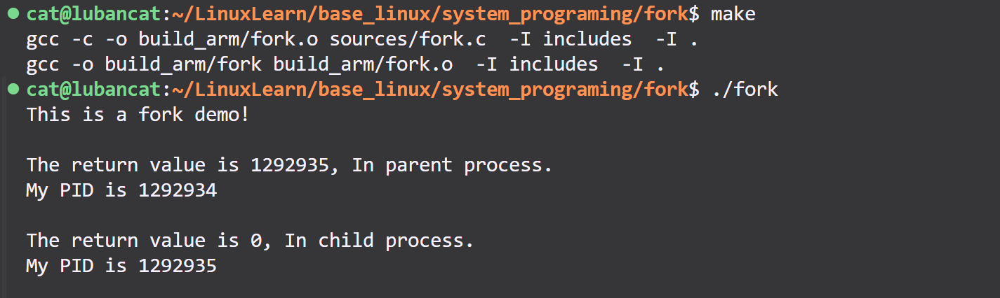

##### 28.6.3 exec 系列函数进程实验

事实上，使用 `fork()` 函数启动一个子进程是并没有太大作用的，因为子进程跟父进程都是一样的，子进程能干的活父进程也一样能干，因此世界各地的开发者就想方设法让子进程做不一样的事情，于是诞生了 `exec` 系列函数，这个系列函数主要是用于替换进程的执行程序，它可以根据指定的文件名或目录名找到可执行文件，并用它来取代原调用进程的数据段、代码段和堆栈段，在执行完之后，原调用进程的内容除了进程号外，其他全部被新程序的内容替换。另外，这里的可执行文件既可以是二进制文件，也可以是 Linux 下任何可执行脚本文件。简单来说就是覆盖进程，举个例子，A 进程通过 exec 系列函数启动一个进程 B，此时进程 B 会替换进程 A，进程 A 的内存空间、数据段、代码段等内容都将被进程 B 占用，然后进程 A 将不复存在。

下面直接通过 `execl()` 实验进行讲解：

```c
int execl(const char *path, const char *arg, ...)
```

`execl()` 函数用于执行参数 `path` 字符串所代表的文件路径（必须指定路径），接下来是一系列可变参数，它们代表执行该文件时传递过去的 `argv[0]、argv[1]⋯argv[n]` ，最后一个参数必须用空指针 NULL 作为结束的标志。

```c
// path: base_linux/system_programing/exec/sources/exec.c
#include <stdio.h>
#include <sys/types.h>
#include <unistd.h>
#include <stdlib.h>

int main(void)
{
    int err;

    printf("This is a exec function test demo!\n\n");

    err = execl("/bin/ls", "ls", "-la", NULL);

    if (err < 0)
    {
        printf("execl fail!\n\n");
    }

    printf("Done!\n\n");

    return 0;
}
```

代码中通过 `execl()` 函数的参数列表调用了 `ls` 命令程序，然后将第二个以后的参数当做该文件的 `argv[0]、argv[1]⋯argv[n]`，最后一个参数必须用空指针 NULL 作为结束的标志。它其实就是与我们在终端上运行 `ls -la` 产生的结果是一样的。

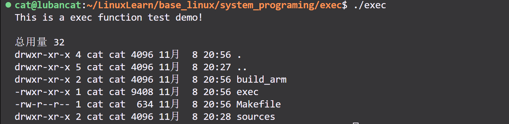

> [!NOTE]
>
> `exec` 系列函数是直接将当前进程给替换掉的，当调用 `exec` 系列函数后，当前进程将不会再继续执行，所以示例程序中的 “Done! ” 将不被输出，因为当前进程已经被替换了，一般情况下，`exec` 系列函数函数是不会返回的，除非发生了错误。出现错误时，`exec` 系列函数将返回 -1，并且会设置错误变量 `errno`。

因此我们可以通过调用 `fork()` 复制启动一个子进程，并且在子进程中调用 `exec` 系列函数替换子进程，这样把`fork()` 和 `exec` 系列函数结合在一起使用就是创建一个新进程所需要的一切了。

**exec 族的其它函数**

exec 族实际包含有6 个不同的 `exec` 函数，依赖于头文件 `#include <unistd>` ，它们功能一样，主要是传参的形式不同，函数原型分别如下：

```c
int execl(const char *path, const char *arg, ...)
    
int execlp(const char *file, const char *arg, ...)
    
int execle(const char *path, const char *arg, ..., char *const envp[])
    
int execv(const char *path, char *const argv[])
    
int execvp(const char *file, char *const argv[])
    
int execve(const char *path, char *const argv[], char *const envp[])
```

这些函数可以分为两大类，`execl`、`execlp` 和 `execle` 传递给子程序的参数个数是可变的，如 `ls -la`示例中，`-la` 为子程序 `ls` 的参数。`execv`、`execvp` 和 `execve` 通过数组去装载子程序的参数，无论那种形式，参数都以一个空指针 NULL 结束，总结来说，可以通过它们的后缀来区分他们的作用：

- 名称包含 `l` 字母的函数（`execl`、`execlp` 和 `execle`）接收参数列表 `list` 作为调用程序的参数。
- 名称包含 `p` 字母的函数（`execvp` 和 `execlp`）可接受一个程序名作为参数，它会在当前的执行路径和环境变量 `PATH` 中搜索并执行这个程序（即可使用相对路径）；名字不包含 `p` 字母的函数在调用时必须指定程序的完整路径（即要求绝对路径）。
- 名称包含 `v` 字母的函数（`execv`、`execvp` 和 `execve`）的子程序参数通过一个数组 `vector` 装载。
- 名称包含 `e` 字母的函数（`execve` 和 `execle`）比其它函数多接收一个指明环境变量列表的参数，并且可以通过参数 `envp` 传递字符串数组作为新程序的环境变量，这个 `envp` 参数的格式应为一个以 NULL 指针作为结束标记的字符串数组，每个字符串应该表示为 `environment = virables` 的形式。

在 Linux 中使用 `exec` 函数族主要有两种情况。

1. 当进程认为自己不能再为系统和用户做出任何贡献时， 就可以调用 `exec` 函数族中的任意一个函数让自己重生。

2. 如果一个进程想执行另一个程序，那么它就可以调用 `fork()` 函数新建一个进程，然后调用 `exec` 函数族中的任意一个函数，这样看起来就像通过执行应用程序而产生了一个新进程（这种情况非常普遍）。

#### 28.7 终止进程

在 Linux 系统中，进程终止（或者称为进程退出，为了统一，下文均使用 “终止” 一词）的常见方式有 5 种，可以分为正常终止与异常终止：

**正常终止**

- 从 main 函数返回。
- 调用 `exit()` 函数终止。
- 调用 `_exit()` 函数终止。

**异常终止**

- 调用 `abort()` 函数异常终止。
- 由系统信号终止。

在 Linux 系统中，`exit()` 函数定义在 `stdlib.h` 中，而 `_exit()` 定义在 `unistd.h` 中，`exit()` 和 `_exit()` 函数都是用来终止进程的，当程序执行到 `exit()` 或 `_exit()` 函数时，进程会无条件地停止剩下的所有操作，清除包括 PCB 在内的各种数据结构，并终止当前进程的运行。不过这两个函数还是有区别的，具体下图所示。

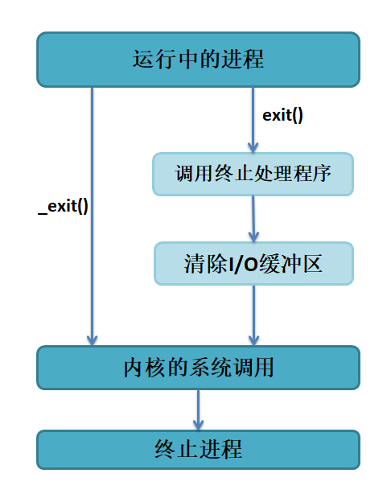

从图中可以看出，`_exit()` 函数的作用最为简单：直接通过系统调用使进程终止运行，当然，在终止进程的时候会清除这个进程使用的内存空间，并销毁它在内核中的各种数据结构；而 `exit()` 函数则在这些基础上做了一些包装，在执行退出之前加了若干道工序：比如 `exit()` 函数在调用 `exit` 系统调用之前要检查文件的打开情况，把文件缓冲区中的内容写回文件，这就是 “清除I/O 缓冲”。

由于在 Linux 的标准函数库中，有一种被称作 “缓冲I/O（buffered I/O）” 操作，其特征就是对应每一个打开的文件，在内存中都有一片缓冲区。每次读文件时，会连续读出若干条记录，这样在下次读文件时就可以直接从内存的缓冲区中读取；同样，每次写文件的时候，也仅仅是写入内存中的缓冲区，等满足了一定的条件（如达到一定数量或遇到特定字符等），再将缓冲区中的内容一次性写入文件。

这种技术大大增加了文件读写的速度，但也为编程带来了一些麻烦。比如有些数据，程序认为已经被写入文件中，实际上因为没有满足特定的条件，它们还只是被保存在缓冲区内，这时用 `_exit()` 函数直接将进程关闭，缓冲区中的数据就会丢失。因此，若想保证数据的完整性，就一定要使用 `exit()` 函数。

不管是那种退出方式，系统最终都会执行内核中的同一代码，这段代码用来关闭进程所用已打开的文件描述符，释放它所占用的内存和其他资源。

下面一起看看 `_exit()` 与 `exit()` 函数的使用方法：

**头文件：**

```c
#include <unistd.h>
#include <stdlib.h>
```

**函数原型：**

```c
void _exit(int status);
void exit(int status);
```

这两个函数都会传入一个参数 `status`，这个参数表示的是进程终止时的状态码，0 表示正常终止，其他非 0 值表示异常终止，一般都可以使用 -1 或者1 表示，标准 C 里有 `EXIT_SUCCESS` 和 `EXIT_FAILURE` 两个宏，表示正常与异常终止。

这些函数的使用都是非常简单的，只需要在需要终止的地方调用一下即可，此处就不深入讲解。

#### 28.8 等待进程

在 Linux 中，当我们使用 `fork()` 函数启动一个子进程时，子进程就有了它自己的生命周期并将独立运行，在某些时候，可能父进程希望知道一个子进程何时结束，或者想要知道子进程结束的状态，甚至是等待着子进程结束，那么我们可以通过在父进程中调用 `wait()` 或者 `waitpid()` 函数让父进程等待子进程的结束。

从前面的文章我们也了解到，当一个进程调用了 `exit()` 之后，该进程并不会立刻完全消失，而是变成了一个僵尸进程。僵尸进程是一种非常特殊的进程，它已经放弃了几乎所有的内存空间，没有任何可执行代码，也不能被调度，仅仅在进程列表中保留一个位置，记载该进程的退出状态等信息供其他进程收集，除此之外，僵尸进程不再占有任何内存空间。那么无论如何，父进程都要回收这个僵尸进程，因此调用 `wait()` 或者 `waitpid()` 函数其实就是将这些僵尸进程回收，释放僵尸进程占有的内存空间，并且了解一下进程终止的状态信息。

##### 28.8.1 wait() 函数

`wait()` 函数原型如下：

```c
pid_t wait(int *wstatus);
```

`wait()` 函数在被调用的时候，系统将暂停父进程的执行，直到有信号来到或子进程结束，如果在调用 `wait()` 函数时子进程已经结束，则会立即返回子进程结束状态值。子进程的结束状态信息会由参数 `wstatus` 返回，与此同时该函数会返子进程的 PID，它通常是已经结束运行的子进程的 PID。状态信息允许父进程了解子进程的退出状态，如果不在意子进程的结束状态信息，则参数 `wstatus` 可以设成 NULL。

`wait()` 函数有几点需要注意的地方：

- `wait()` 要与 `fork()` 配套出现，如果在使用 `fork()` 之前调用 `wait()`，`wait()` 的返回值则为 -1，正常情况下 `wait()` 的返回值为子进程的 PID。
- 参数 `wstatus` 用来保存被收集进程退出时的一些状态，它是一个指向 `int` 类型的指针，但如果我们对这个子进程是如何死掉毫不在意，只想把这个僵尸进程消灭掉，（事实上绝大多数情况下，我们都会这样做），我们就可以设定这个参数为 NULL。

当然，Linux 系统提供了关于等待子进程退出状态的一些宏定义，我们可以使用这些宏定义来直接判断子进程退出的状态：

- WIFEXITED(status) ：如果子进程正常结束，返回一个非零值
- WEXITSTATUS(status)：如果 WIFEXITED 非零，返回子进程退出码
- WIFSIGNALED(status) ：子进程因为捕获信号而终止，返回非零值
- WTERMSIG(status) ：如果 WIFSIGNALED 非零，返回信号代码
- WIFSTOPPED(status)：如果子进程被暂停，返回一个非零值
- WSTOPSIG(status)：如果 WIFSTOPPED 非零，返回一个信号代码

##### 28.8.2 wait() 实验

```c
// base_linux/system_programing/wait/sources/wait.c
#include <sys/types.h>
#include <sys/wait.h>
#include <unistd.h>
#include <stdio.h>
#include <stdlib.h>

int main(void)
{
    pid_t pid, child_pid;
    int status;

    pid = fork();

    if (pid < 0) {
        printf("Error fork!\n");
    }
    /* 子进程 */
    else if (pid == 0) {
        printf("I am a child process!\nmy pid is %d\n\n", getpid());
        /* 子进程休眠3秒 */
        sleep(3);

        printf("I am about to quit the process!\n\n");

        /* 子进程退出 */
        exit(0);
    }
    /* 父进程 */
    else {
        /* 等待子进程退出, 父进程阻塞 */
        child_pid = wait(&status);

        if (child_pid == pid) {
            printf("Get exit child process id: %d\n", child_pid);
            printf("Get child exit status: %d\n\n", status);
        } else {
            printf("Some error occurred!\n\n");
        }

        exit(0);
    }
}
```

- 首先调用 `fork()`  函数启动一个子进程。
- 如果 `fork()` 函数返回的值 pid 为0，则表示此时运行的是子进程，那么就让子进程输出一段信息，并且休眠 3 秒。
- 休眠结束后调用 `exit()` 函数退出，退出状态为 0，表示子进程正常退出。
- 如果 `fork()` 函数返回的值 pid 不为0，则表示此时运行的是父进程，那么在父进程中调用 `wait(&status)` 函数等待子进程的退出，子进程的退出状态将保存在 `status` 变量中。
- 若发现子进程退出（通过 `wait()` 函数返回的子进程 pid 判断），则打印出相应信息，如子进程的 `pid` 与`status`。

##### 28.8.3 waitpid()

`waitpid()` 函数的作用和 `wait()` 函数一样，但它并不一定要等待第一个终止的子进程，它还有其他选项，比如指定等待某个 pid 的子进程、提供一个非阻塞版本的 `wait()` 功能等。实际上 `wait()` 函数只是 `waitpid()` 函数的一个特例，在 Linux 内部实现 wait 函数时直接调用的就是 waitpid 函数。

函数原型：

```c
pid_t waitpid(pid_t pid, int *wstatus, int options);
```

`waitpid()` 函数的参数有 3 个，下面就简单介绍这些参数相关的选项：

- `pid` : 参数 `pid` 为要等待的子进程 ID，其具体含义如下：
    - `pid < -1`：等待进程组号为 pid 绝对值的任何子进程。
    - `pid = -1`：等待任何子进程，此时的 `waitpid()` 函数就等同于 `wait()` 函数。
    - `pid = 0`：等待进程组号与目前进程相同的任何子进程，即等待任何与调用 `waitpid()` 函数的进程在同一个进程组的进程。
    - `pid > 0`：等待指定进程号为 `pid` 的子进程。
- `wstatus`：与 `wait()` 函数一样。
- `options`：参数 `options` 提供了一些另外的选项来控制 `waitpid()` 函数的行为。如果不想使用这些选项，则可以把这个参数设为 0。
    - WNOHANG：如果 pid 指定的子进程没有终止运行，则 `waitpid()` 函数立即返回 0，而不是阻塞在这个函数上等待；如果子进程已经终止运行，则立即返回该子进程的进程号与状态信息。
    - WUNTRACED：如果子进程进入了暂停状态（可能子进程正处于被追踪等情况），则马上返回。
- WCONTINUED：如果子进程恢复通过 SIGCONT 信号运行，也会立即返回（这个不常用，了解一下即可）。

很显然，当 `waitpid()` 函数的参数为 ( 子进程 pid, status,0 ) 时，`waitpid()` 函数就完全退化成了 `wait()` 函数。

```c
#include <sys/types.h>
#include <sys/wait.h>
#include <unistd.h>
#include <stdio.h>
#include <stdlib.h>

int main()
{
    pid_t pid, child_pid;
    int status;

    pid = fork();

    if (pid < 0) {
        printf("Error fork\n");
    }
    /*子进程*/
    else if (pid == 0) {

        printf("I am a child process!, my pid is %d!\n\n",getpid());

        /*子进程暂停 3s*/
        sleep(3);

        printf("I am about to quit the process!\n\n");
        /*子进程正常退出*/
        exit(0);
    }
    /*父进程*/
    else {

        /*
            调用 waitpid，且父进程不阻塞，
            options设置为0的话将与wait示例完全一致 
        */
        child_pid = waitpid(pid, &status, WUNTRACED);

        /*若发现子进程退出，打印出相应情况*/
        if (child_pid == pid) {
            printf("Get exit child process id: %d\n",child_pid);
            printf("Get child exit status: %d\n\n",status);
        } else {
            printf("Some error occured.\n");
        }

        exit(0);
    }
}
```

### 29. 信号

Linux 内核提供了各种各样的内核对象用于协调进程间的通讯，如信号、管道、消息队列等，本章针对 Linux 内核的信号对象进行讲解。

#### 29.1 信号的基本概念

##### 29.1.1 概述

信号（signal），又称为软中断信号，用于通知进程发生了异步事件，它是 Linux 系统响应某些条件而产生的一个事件，它是在软件层次上对中断机制的一种模拟，是一种异步通信方式，在原理上，一个进程收到一个信号与处理器收到一个中断请求可以说是一样的。

**信号是进程间通信机制中唯一的异步通信机制**，一个进程不必通过任何操作来等待信号的到达，事实上，进程也不知道信号到底什么时候到达。正如我们所了解的中断服务函数一样，在中断发生的时候，就会进入中断服务函数中去处理，同样的，当进程接收到一个信号的时候，也会相应地采取一些行动。我们可以使用术语 “生成（raise）” 表示一个信号的产生，使用术语 “捕获（catch）” 表示进程接收到一个信号。

在 Linux 系统中，信号可能是由于系统中某些错误而产生，也可以是某个进程主动生成的一个信号。由于某些错误条件而生成的信号：如内存段冲突、浮点处理器错误或非法指令等，它们由 shell 和终端处理器生成并且引起中断。由进程主动生成的信号可以作为在进程间传递通知或修改行为的一种方式，它可以明确地由一个进程发送给另一个进程，当进程捕获了这个信号就会按照程序进行相应处理。无论何种情况，它们的编程接口都是相同的，信号可以被生成、捕获、响应或忽略。进程之间可以互相发送信号，内核也可以因为内部事件而向进程发送信号，通知进程
发生了某个事件。

##### 29.1.2 系统支持的信号

我们可以使用 `kill` 命令来查看系统中支持的信号种类：

```bash
kill -l
```

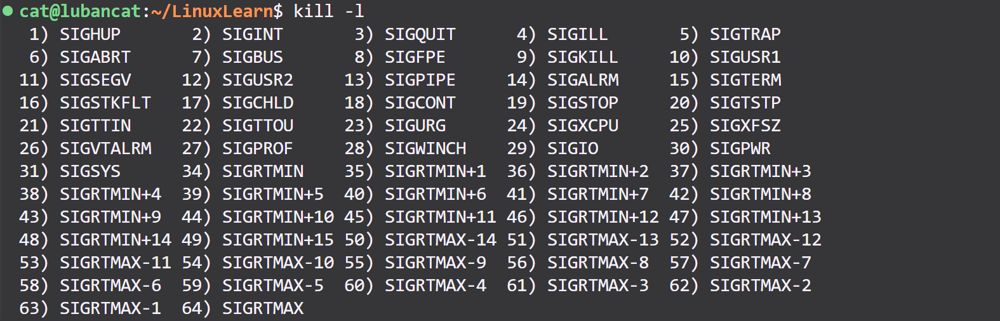

从图中可以看出，Linux 系统支持信号 62 种信号，每种信号名称都以 SIG 三个字符开头，注意，编号为 32 和 33 的信号值是不存在的。

可以将这 62 种信号分为两大类：

- 信号值为1~31 的信号属于**非实时信号**（也称为**不可靠信号**），它们是从UNIX 系统中继承下来的信号。
- 信号值为34~64 的信号为**实时信号**（也称为**可靠信号**）。

对于信号有几点需要注意：

- 信号的 “值” 在 x86、PowerPC 和 ARM 平台下是有效的，但是别的平台的信号值也许跟这个表的不一致。
- “描述” 中注明的一些情况发生时会产生相应的信号，但并不代表该信号的产生就一定发生了这个事件。事实上，任何进程都可以使用 `kill()` 函数来产生任何信号。
- 信号 SIGKILL 和 SIGSTOP 是两个特殊的信号，他们不能被忽略、阻塞或捕捉，只能按缺省动作来响应。
- 一般而言，信号的响应处理过程如下：如果该信号被阻塞，那么将该信号挂起，不对其做任何处理，等到解除对其阻塞为止。如果该信号被捕获，那么进一步判断捕获的类型，如果设置了响应函数，那么执行该响应函数；如果设置为忽略，那么直接丢弃该信号。最后才执行信号的默认处理。

##### 29.1.3 非实时信号与实时信号

Linux 系统中有许多信号，其中前面 31 个信号都有一个特殊的名字，对应一个特殊的事件，比如信号值为 1 的信号SIGHUP（Signal Hang UP），这个信号就是通知系统关闭中断的，当系统中的一个控制终端被关闭（即挂断，hang up）时，都会产生这个信号。

信号值为 1~31 的信号属性非实时信号，它主要是因为这类信号不支持排队，因此信号可能会丢失。比如发送多次相同的信号，进程只能收到一次，也只会处理一次，因此剩下的相同的信号将被丢弃。而实时信号（信号值为34~64 的信号）则不同，它是支持排队的，发送了多少个信号给进程，进程就会处理多少次。

为什么说信号还有可靠与不可靠之分呢，这得从信号的处理过程来介绍了：一般来说，一个进程收到一个信号后不会被立即处理，而是在恰当时机进行处理！一般是在中断返回的时候，或者内核态返回用户态的时候（这种情况是比较常见的处理方式）。

也就是说，即使这些信号已经到来了，进程也不一定会立即去处理它，因为系统不会为了处理一个信号而把当前正在运行的进程挂起，这样的话系统的资源消耗太大了，如果不是紧急信号，是不会立即处理的，所以系统一般都会选择在内核态切换回用户态的时候处理信号。比如有时候进程处于休眠状态，但是又收到了一个信号，于是系统就得把信号储存在进程唯一的 PCB（进程控制块）当中。

而非实时信号是不支持排队的，假如此时又有一个信号到来，那么它将被丢弃，这样进程就无法处理这个信号，所以它是不可靠的。对于实时信号则没有这种顾虑，因为它支持排队，信号是不会被丢弃的，这样子每个到来的信号都能得到有效处理。

#### 29.2 信号的处理

生成信号的事件一般可以归为三大类：程序错误、外部事件以及显式请求。

- 程序错误如：零作除数、非法存储访问等，这种情况通常是由硬件而不是由 Linux 内核检测到的，但由内核向发生此错误的那个进程发送相应的信号；
- 外部事件如：当用户在终端按下某些键时产生中断生成的信号，当进程超越了 CPU 或文件大小的限制时，内核会生成一个信号通知进程；
- 显式请求如：进程通过使用 `kill()` 函数来发送任何信号给其他进程或进程组。信号的生成既可以是同步的，也可以是异步的。

- 同步信号大多数是程序执行过程中出现了某个错误而产生的，由进程显式请求生成的给自己的信号也是同步的。
- 异步信号是接收进程可控制之外的事件所生成的信号，这类信号一般是进程无法控制的，只能被动接收，因为进程也不知道这个信号会何时发生，只能在发生的时候去处理它。一般外部事件总是异步地生成信号，异步信号可在进程运行中的任意时刻产生，进程无法预期信号到达的时刻，它所能做的只是告诉 Linux 内核假如有信号生成时应当采取什么行动（这相当于注册信号对应的处理）。

无论是同步还是异步信号，当信号发生时，我们可以告诉 Linux 内核采取如下 3 种动作中的任意一种：

- 忽略信号。大部分信号都可以被忽略，但有两个除外：SIGSTOP 和 SIGKILL 绝不会被忽略。不能忽略这两个信号的原因是为了给超级用户提供杀掉或停止任何进程的一种手段。此外，尽管其他信号都可以被忽略，但其中有一些却不宜忽略。例如，若忽略硬件例外（非法指令）信号，则会导致进程的行为不确定。

- 捕获信号。这种处理是要告诉 Linux 内核，当信号出现时调用专门提供的一个函数。这个函数称为信号处理函数，它专门对产生信号的事件作出处理。
- 让信号默认动作起作用。系统为每种信号规定了一个默认动作，这个动作由 Linux 内核来完成，有以下几种可能的默认动作：
    - 终止进程并且生成内存转储文件，即写出进程的地址空间内容和寄存器上下文至进程当前目录下名为 `cone` 的文件中；
    - 终止终止进程但不生成 `core` 文件。
    - 忽略信号。
    - 暂停进程。
    - 若进程为暂停状态，恢复进程，否则将忽略信号。

#### 29.3 信号实验

我们可以写个小程序验证一下一些控制信号，比如 SIGINT（程序终止信号）。程序代码如下： 

```c
// base_linux/system_programing/signal/sources/signal.c
#include <stdio.h>
#include <unistd.h>
#include <stdlib.h>

int main(void)
{
    printf("\nThis is an signal test function\n\n");

    while(1)
    {
        printf("waiting for the SIGINT signal, please enter \"Ctrl + c\"\n");
        sleep(1);
    }

    exit(0);
}
```

编译后运行，可以看到终端中一直打印 `“please input“Ctrl + C”to terminate the test process!”` 这句
话，我们按下 `Ctrl + C` 键，就能终止这个进程，这是因为在按下 `Ctrl+C` 组合键时会产生的 SIGINT信号，将进程终止，如下图。

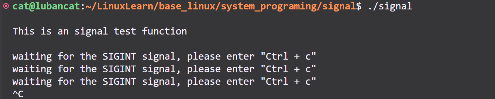

#### 29.4 捕获信号相关 API 函数

上述 signal 示例中，我们并没有针对信号作任何处理，只是系统使用了默认的处理方式，终结了程序。很多时候我们使用信号只是通知进程而不是要杀死它，或者在杀死它前我们想进行某些收尾工作，这个时候就是需要我们去捕获这个信号，然后去处理它。在 Linux 中，捕获信号的函数有很多，比如 `signal()`、`sigaction()` 等函数。

##### 29.4.1 signal()

`signal()` 主要是用于捕获信号，可以改变进程中对信号的默认行为，我们在捕获这个信号后，也可以自定义对信号的处理行为，当收到这个信号后，应该如何去处理它，这也是我们在 Linux 开发最常需要做的事。

使用 `signal()` 时，它需要提前设置一个回调函数，即进程接收到信号后将要跳转执行的响应函数，或者设置忽略某个信号，才能改变信号的默认行为，这个过程称为 “信号的捕获”。对一个信号的 “捕获” 可以重复进行，不过`signal()` 函数将会返回前一次设置的信号响应函数指针。

我们可以使用 `man` 命令去查看 `signal()` 相关介绍，可查询到其原型如下：

```c
typedef void (*sighandler_t)(int);

sighandler_t signal(int signum, sighandler_t handler);
```

这个相当复杂的函数定义说明，`signal` 是一个带有 `signum` 和 `handler` 两个参数的函数。准备捕获或忽略的信号由参数 `signum` 指出，接收到指定的信号后将要调用的函数由参数 `handler` 指出。

- `signum` 是指定捕获的信号名称，如果指定的是一个无效的信号，或者尝试处理的信号是不可捕获或不可忽略的信号（如 SIGKILL），`errno` 将被设置为 EINVAL。

- `handler` 是一个函数指针，它的类型是 `void(*sighandler_t)(int)` 类型，拥有一个 `int` 类型的参数，这个参数的作用就是传递收到的信号值，返回类型为 `void`。

- `signal()` 函数会返回一个 `sighandler_t` 类型的函数指针，这是因为调用 `signal()` 函数修改了信号的行为，需要返回之前的信号处理行为是哪个，以便让应用层知悉，如果修改信号的默认行为识别则返回对应的错误代码SIG_ERR。

- `handler` 需要用户自定义处理信号的方式，当然还可以使用以下宏定义：
    - SIG_IGN：忽略该信号。
    - SIG_DFL：采用系统默认方式处理信号。

虽然这个函数是比较简单的，但是还是要注意一下：如果调用处理程序导致信号被阻塞，则从处理程序返回后，信号将被解除阻塞。无法捕获或忽略信号 SIGKILL 和 SIGSTOP。

###### signal 实验

```c
// path: base_linux/system_programing/signal/sources/signal.c
#include <stdio.h>
#include <unistd.h>
#include <stdlib.h>
#include <signal.h>
#include <sys/types.h>
#include <sys/wait.h>

// 信号处理函数
void signal_handler(int signum)
{
    printf("This signal number is %d\n", signum);

    if (signum == SIGINT)
    {
        printf("I have get SIGINT!\n");
        printf("The signal has been restored to the default processing mode!\n\n");

        // 恢复信号为默认情况
        signal(SIGINT, SIG_DFL);
    }
}

int main(void)
{
    printf("\n this is an signal test function\n\n");

    // 设置信号处理函数
    signal(SIGINT, signal_handler);

    while(1)
    {
        printf("waiting for the SIGINT signal, please enter \"Ctrl + c\"\n");
        sleep(1);
    }

    exit(0);
}
```

- 使用 `signal()` 函数捕获 SIGINT 信号（这个信号可以通过按下 `CTRL+C` 产生），并设置回调函数为`signal_handler()`，当产生信号的时候就调用该函数去处理这个信号。

- 在信号没有到来的时候就打印信息并且休眠。
- `signal_handler()` 是信号处理函数，它传入一个 `int` 类型的信号值，在信号传递进来的时候就将对应的信号值打印出来，在此例中我们可以看到，信号处理函数使用了一个单独的整数参数，它就是引起该函数被调用的信号值。如果需要在同一个函数中处理多个信号，这个参数就很有用。
- 如果信号是 SIGINT，则打印对应的信息，并且调用 `signal()` 函数将 SIGINT 信号的处理恢复默认的处理（SIG_DFL），在下一次接收到 SIGINT 信号的时候就不会进入这个函数里了。

实验现象如下图，当我们按下 `CTRL+C` 时，进入 `signal_handler()` 信号处理函数，打印对应的信息，并且将SIGINT 信号的处理恢复默认，因此当下一次按下 `CTRL+C` 时进程将直接退出。

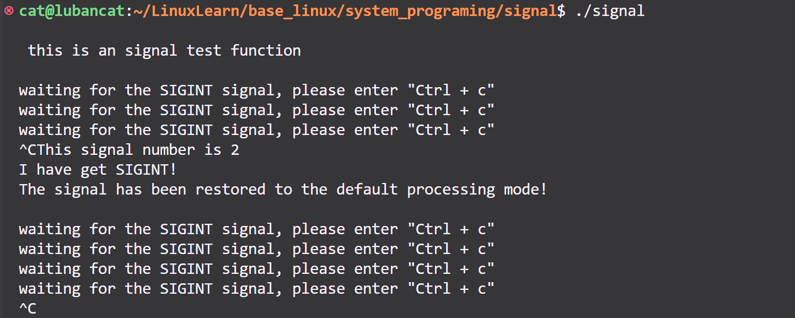

##### 29.4.2 sigaction()

其实，不推荐使用 `signal()` 函数接口，之所以会在上一小节介绍它，是因为可能会在许多老程序中看到它的应用，而且相对简单。稍后会介绍一个定义更清晰、执行更可靠的 `sigaction()` 函数，这个函数的功能与 `signal()` 函数是一样的，但是 API 接口稍微有点不同，建议以后在所有的程序中都应该使用这个函数去操作信号。

`sigaction()` 函数原型如下：

```c
int sigaction(int signum, const struct sigaction *act, struct sigaction *oldact);
```

这个函数的参数比 `signal()` 函数多了一些，参数区别如下：

- `signum`：指定捕获的信号值。

- `act`：是一个结构体，该结构体的内容如下：

    ```c
    struct sigaction {
    	void (*sa_handler)(int);
    	void (*sa_sigaction)(int, siginfo_t *, void *);
    	sigset_t sa_mask;
    	int sa_flags;
    	void (*sa_restorer)(void);
    };
    ```

    - `sa_handler` 是一个函数指针，是捕获信号后的处理函数，它也有一个 `int` 类型的参数，传入信号的值，这个函数是标准的信号处理函数。

    - `sa_sigaction` 则是扩展信号处理函数，它也是一个函数指针，但它比标准信号处理函数复杂的多，事实上如果选择扩展接口的话，信号的接收进程不仅可以接收到 `int` 型的信号值，还会接收到一个 `siginfo_t` 类型的结构体指针，还有一个 `void` 类型的指针，还有需要注意的就是，不要同时使用 `sa_handler` 和`sa_sigaction`，因为这两个处理函数是有联合的部分（联合体）。关于 `siginfo_t` 类型的结构体在后续讲解。

    - `sa_mask` 是信号掩码，它指定了在执行信号处理函数期间阻塞的信号的掩码，被设置在该掩码中的信号，在进程响应信号期间被临时阻塞。除非使用 SA_NODEFER 标志，否则即使是当前正在处理的响应的信号再次到来的时候也会被阻塞。

    - `re_restorer` 则是一个已经废弃的成员变量，不要使用。

    - `sa_flags` 是指定一系列用于修改信号处理过程行为的标志，由下面的 0 个或多个标志组合而成：

        - SA_NOCLDSTOP：如果 `signum` 是 SIGCHLD，则在子进程停止或恢复时，不会传信号给调用 `sigaction()` 函数的进程。即当它们接收到 SIGSTOP、SIGTSTP、SIGTTIN 或 SIGTTOU（停止）中的一种时或接收到 SIGCONT（恢复）时，父进程不会收到通知。仅当为 SIGCHLD 建立处理程序时，此标志才有意义。
        - SA_NOCLDWAIT：它表示父进程在它的子进程终止时不会收到 SIGCHLD 信号，这时子进程终止则不会成为僵尸进程。
        - SA_NODEFER：不要阻止从其自身的信号处理程序中接收信号，使进程对信号的屏蔽无效，即在信号处理函数执行期间仍能接收这个信号，仅当建立信号处理程序时，此标志才有意义。
        - SA_RESETHAND：信号处理之后重新设置为默认的处理方式。
        - SA_SIGINFO：指示使用 `sa_sigaction` 成员而不是使用 `sa_handler` 成员作为信号处理函数。

        当在 `asa_flags` 中指定 SA_SIGINFO 标志时，信号处理程序地址将通过 `sa_sigaction` 字段传递。该处理程序采用三个参数，如下所示：

        ```c
        void handler(int sig, siginfo_t *info, void *ucontext)
        {
        	...
        }
        ```

        `info` 指向 `siginfo_t` 的指针，它是一个包含有关信号的更多信息的结构，具体成员变量如下所示：

        ```c
        siginfo_t {
        	int si_signo;         /* 信号数值*/
        	int si_errno;         /* 错误值*/
        	int si_code;          /* 信号代码*/
        	int si_trapno;        /* 导致硬件生成信号的陷阱号，在大多数体系结构中未使用*/
        	pid_t si_pid;         /* 发送信号的进程ID */
        	uid_t si_uid;         /* 发送信号的真实用户ID */
        	int si_status;        /* 退出值或信号状态*/
        	clock_t si_utime;     /* 消耗的用户时间*/
        	clock_t si_stime;     /* 消耗的系统时间*/
        	sigval_t si_value;    /* 信号值*/
        	int si_int;           /* POSIX.1b 信号*/
        	void *si_ptr;
        	int si_overrun;       /* 计时器溢出计数*/
        	int si_timerid;       /* 计时器ID */
        	void *si_addr;        /* 导致故障的内存位置*/
        	long si_band;
        	int si_fd;            /* 文件描述符*/
        	short si_addr_lsb;    /* 地址的最低有效位(从Linux 2.6.32 开始存在) */
        	void *si_lower;       /* 地址冲突时的下限*/
        	void *si_upper;       /* 地址冲突时的上限(从Linux 3.19 开始存在) */
        	int si_pkey;          /* 导致的PTE 上的保护密钥*/
        	void *si_call_addr;   /* 系统调用指令的地址*/
        	int si_syscall;       /* 尝试的系统调用次数*/
        	unsigned int si_arch; /* 尝试的系统调用的体系结构*/
        }
        ```

        上面的成员变量绝大部分我们是几乎使用不到的，因为我们如果是对信号的简单处理，直接使用 `sa_handler` 处理即可，根本无需配置 `siginfo_t` 这些比较麻烦的信息。

- `oldact`：返回原有的信号处理参数，一般设置为 NULL 即可。

###### sigaction 实验

```c
// path: base_linux/system_programing/sigaction/sources/sigaction.c
#include <unistd.h>
#include <stdio.h>
#include <stdlib.h>
#include <signal.h>
#include <sys/types.h>
#include <sys/wait.h>

// 信号处理函数
void signal_handler(int signum)
{
    printf("\nThis signal number is %d\n", signum);

    if (signum == SIGINT)
    {
        printf("I have get SIGINT!\n");
        printf("The signal has been restored to the default processing mode!\n\n");

        /* 信号自动恢复为默认处理函数 */
    }
}

int main(void)
{
    struct sigaction act;

    printf("this is sigaction function test demo!\n\n");

    act.sa_handler = signal_handler;

    sigemptyset(&act.sa_mask);

    act.sa_flags = SA_RESETHAND;

    sigaction(SIGINT, &act, NULL);

    while(1)
    {
        printf("waiting for the SIGINT signal, please enter \"Ctrl + c\"\n");
        sleep(1);
    }

    exit(0);
}
```

- 信号处理函数 `signal_handler()` 与 `signal` 实验的信号处理函数几乎是一样的，但是这里并没有在函数中让信号恢复默认处理，这是因为设置了 `sa_flags` 成员变量，在处理完信号后自动恢复默认的处理。
- 设置信号处理的回调函数，在这个实验使用 `sa_handler` 作为信号处理成员变量而不是 `sa_sigaction`。

- 调用 `sigemptyset()` 函数清空进程屏蔽的信号集，即在信号处理的时候不会屏蔽任何信号。
- 设置 `sa_flags` 成员变量为 SA_RESETHAND，在处理完信号后恢复默认信号处理。
- 调用 `sigaction()` 函数捕获 SIGINT 信号。

#### 29.5 发送信号相关 API 函数

前面的实验中我们通过 `Ctrl+C` 来发送了信号，在代码里，可以通过调用 `kill()`、`raise()`、`alarm()`等信号发送函数，下面就依次对其进行介绍。

##### 29.5.1 kill()

在讲解这个函数之前，我们先用 `kill` 命令去终止一个进程吧，具体操作如下：

先使用 `ps –ux` 命令查看当前有什么进程可以终止的，如果没有则可以打开一个终端，因为终端也是一个进程，我们把这个进程终止就好了。

```
ps -ux
```

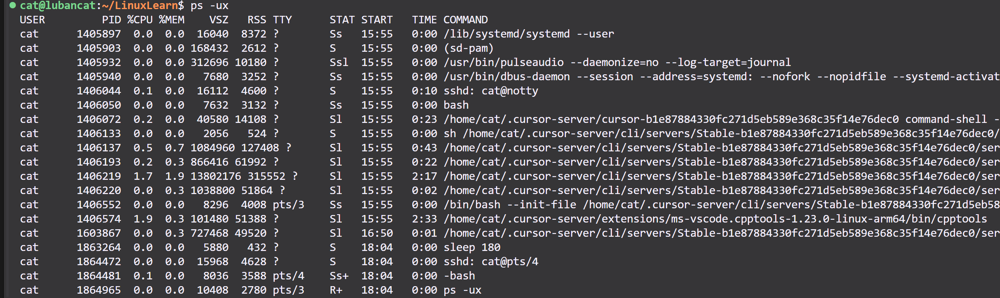

可能不同的电脑输出的内容是不一样的，但是我们可以看到最后一列的进程名字（`sshd: cat@*`）就是 SSH 终端，那么我们可以关闭其中一个终端，我目前打开了两个 SSH 终端。

输入`kill 1864472` （注意，此处的 1864472 是我电脑的一个 SSH 终端 PID）终止终端进程，这样子就可以看到终端被关闭了，`kill` 命令的语法如下：

```bash
kill [信号或选项] PID(s)
```

其中：

- [信号或选项] 是可选部分。

- PID(s) 是目标进程的 ID，可以是一个进程也可以是多个进程。

如果想发送一个信号给进程，而该进程并不是当前的前台进程，就需要使用 `kill` 命令。该命令需要有一个可选的信号代码或信号名称和一个接收信号的目标进程的 PID（这个PID 一般需要用 `ps` 命令查出来），例如，如果要向运行在另一个终端上的 PID 为 666 的进程发送 “挂断” 信号（SIGHUP），可以使用如下命令：

```bash
kill - SIGHUP 666
# or
kill -1 666
```

> [!NOTE]
>
> 这里的 -1 是指信号值为 1 的 SIGHUP 信号

演示完 `kill` 命令，就来看看 Linux 系统中信号操作相关的函数，`kill()` 函数与 `kill` 系统命令一样，可以发送信号给进程或进程组，实际上，`kill` 系统命令只是 `kill()` 函数的一个用户接口。这里需要注意的是，它不仅可以中止进程（实际上发出 SIGKILL 信号），也可以向进程发送其他信号。

同样地，我们使用 `man` 命令去查看系统中关于 `kill()` 函数的描述：

使用 `man` 命令需要安装 `manpages-dev` ：

```bash
sudo apt install manpages-dev
```

使用 `man` 查看 `kill` 函数描述

```bash
man 2 kill
```

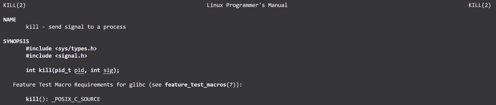

```c
#include <sys/types.h>
#include <signal.h>

int kill(pid_t pid, int sig);
```

`kill()` 函数的参数有两个，分别是 `pid` 与 `sig`，还返回一个 `int` 类型的错误码。

- `pid` 的取值如下：
    - `pid > 1`：将信号 `sig` 发送到进程 ID 值为 `pid` 指定的进程。
    - `pid = 0`：信号被发送到所有和当前进程在同一个进程组的进程。
    - `pid = -1`：将 `sig` 发送到系统中所有的进程，但进程 1（init）除外。
    - `pid < -1`：将信号 `sig` 发送给进程组号为 `-pid` （pid 绝对值）的每一个进程。
- `sig`：要发送的信号值。
- 函数返回值：
    - 0：发送成功。
    - -1：发送失败。

进程可以通过调用 `kill()` 函数向包括它本身在内的其他进程发送一个信号。如果程序没有发送该信号的权限，对`kill` 函数的调用就将失败，失败的常见原因是目标进程由另一个用户所拥有。因此要想发送一个信号，发送进程必须拥有相应的权限，这通常意味着两个进程必须拥有相同的用户 ID（即你只能发送信号给属于自己的进程，但超级用户可以发送信号给任何进程）。

`kill()` 函数会在失败时返回 -1 并设置 errno 变量。失败的原因可能是：

- 给定的信号无效（errno 设置为INVAL）
- 发送进程权限不够（errno 设置为 EPERM）
- 目标进程不存在（errno 设置为 ESRCH）等情况。

##### 29.5.2 raise()

`raise()` 函数也是发送信号函数，不过与 `kill()` 函数所不同的是，`raise()` 函数只是进程向自身发送信号的，而没有向其他进程发送信号，可以说 `kill(getpid(),sig)` 等同于 `raise(sig)`。下面使用 `man` 命令查看一下 `raise()` 函数的相关信息：

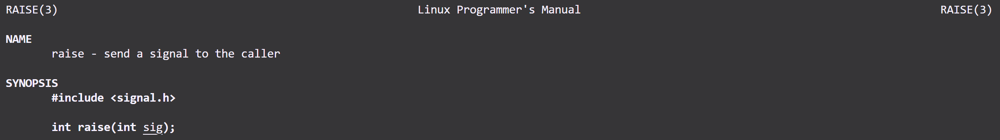

```c
#include <signal.h>

int raise(int sig);
```

`raise()` 函数只有一个参数 `sig`，它代表着发送的信号值，如果发送成功则返回 0，发送失败则返回 -1，发送失败的原因主要是信号无效，因为它只往自身发送信号，不存在权限问题，也不存在目标进程不存在的情况。

##### 29.5.3 kill & raise 实验

```c
// path: base_linux/system_programing/kill/sources/kill.c
#include <unistd.h>
#include <stdio.h>
#include <stdlib.h>
#include <signal.h>
#include <sys/types.h>
#include <sys/wait.h>

int main(void)
{
    pid_t pid;
    int ret;

    // 创建子进程
    if ((pid = fork()) < 0){
        printf("Fork error!\n");
        exit(1);
    }

    if (pid == 0)
    {
        // 在子进程中使用 raise 函数发送 SIGSTOP 信号， 使子进程暂停
        printf("Child(pid: %d) is waiting for any signal\n\n", getpid());
        
        // 子进程停在这里
        raise(SIGSTOP);

        exit(0);
    }
    else 
    {
        // sleep a second
        sleep(1);

        // 在父进程中收集子进程发出的信号（不阻塞），并调用  kill 进行相应的操作
        if ((waitpid(pid, NULL, WNOHANG)) == 0){
            // 如果子进程没有结束，则向子进程发送 SIGKILL 信号杀死子进程
            if ((ret = kill(pid, SIGKILL)) == 0){
                printf("Parent kill %d\n\n", pid);
            }
        }

        // 等待子进程结束
        waitpid(pid, NULL, 0);

        exit(0);
    }
}
```

- `fork` 启动一个子进程，如果返回值小于 0（值为-1），则表示启动失败。
- 如果返回值为 0，则表示此时运行的是子进程，打印相关信息。
- 在子进程中使用 `raise()` 函数发出 SIGSTOP 信号，使子进程暂停。
- 而如果运行的是父进程，则等待一下，让子进程先执行。
- 在父进程中使用 `waitpid()` 函数收集子进程发出的信号（不阻塞）。
- 如果子进程还未退出，则调用 `kill()` 函数向子进程发送终止信号，子进程收到这个信号后会被杀死。
- 使用 `waitpid()` 函数回收子进程资源，如果子进程未终止，父进程则会一直阻塞等待，直到子进程终止。

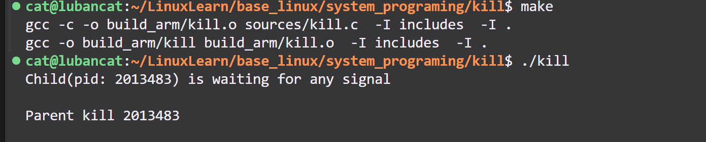

##### 29.5.4 alarm()

`alarm()` 也称为闹钟函数，它可以在进程中设置一个定时器，当定时器指定的时间 `seconds` 到时，它就向进程发送 `SIGALARM` 信号。其函数原型如下：

```c
unsigned int alarm(unsigned int seconds);
```

如果在 `seconds` 秒内再次调用了 `alarm()` 函数设置了新的闹钟，则新的设置将覆盖前面的设置，即之前设置的秒数被新的闹钟时间取代。它的返回值是之前闹钟的剩余秒数，如果之前未设闹钟则返回 0。特别地，如果新的`seconds` 为 0，则之前设置的闹钟会被取消，并将剩下的时间返回。

##### 29.5.4 alarm 实验

了解了 `alarm()` 函数的功能特性和返回值的特性后，我们就可以对其测试。测试方向有两个：

- 其一，测试常规只单独存在一个闹钟函数 `alarm()` 的程序；

- 其二，测试程序中包含多个 `alarm()` 闹钟函数。

```c
// path: base_linux/system_programing/alarm/sources/alarm.c
#include <stdio.h>
#include <unistd.h>
#include <stdlib.h>
#include <signal.h>

int main(void)
{
    printf("\nthis is an alarm test function\n\n");
    alarm(5);
    sleep(20);
    printf("end!\n");
    return 0;
}
```

这个测试是为了验证 SIGALRM 信号的默认处理。

- 实际上这个程序只是定义了一个时钟 `alarm(5)`，它的作用是让 SIGALRM 信号在经过 5 秒后传送给目前 `main()` 所在进程；
- 接着又调用了 `sleep(20)` 让进程睡眠 20 秒的时间。
- 当 `main()` 程序挂起 5 秒钟后，`alarm` 产生了 SIGALRM 信号，由于我们没有做捕获处理，系统会调用该信号的默认处理函数，即执行 `exit(0)` 函数直接终止进程，并且在终止的时候自动打印 `”Alarm clock”`（闹钟）。
- 由于执行默认处理函数后进程终止，代码自身的最后一句 `printf(“end!n”)` 代码是不会被执行的。


接下来，再进行一个 `alam()` 函数覆盖配置实验。

```c
// path: base_linux/system_programing/alarm/sources/alarm.c
#include <stdio.h>
#include <unistd.h>
#include <stdlib.h>
#include <signal.h>

int main(void)
{
    unsigned int seconds;

    printf("\ntihs is an alarm test function\n\n");

    seconds = alarm(20);
    printf("last alarm seconds is %d\n", seconds);

    printf("process sleep 5 seconds\n");
    sleep(5);

    printf("sleep woke up, reset alarm!\n\n");

    seconds = alarm(5);

    printf("last alarm seconds remaining is %d!\n\n", seconds);

    sleep(20);

    printf("end!\n");

    return 0;
}
```

这个 `alarm` 测试代码是为了验证多次设置 `alarm` 的时候，它会覆盖前一次的设置值。代码的逻辑非常简单，首先调用 `alarm(20)` 函数设置在 20 秒后产生一个 SIGALRM 信号，进程睡眠 5 秒后唤醒，再次设置 `alarm(5)` 函数在 5 秒后产生 SIGALRM 信号终止进程，此时上一个 `alarm` 设置就被覆盖了，并且返回上一次设置的剩余的时间（15 秒），覆盖配置后，进程还需要睡眠，等待 5 秒后SIGALRM 信号的到来。

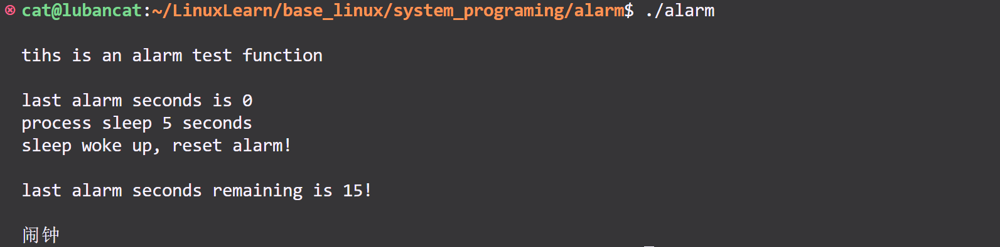

如果希望亲自对 `alarm` 信号处理，使用上一节的 `signal()` 或 `sigaction()` 函数捕获 SIGALRM 信号即可。

### 30. 管道

#### 30.1 管道的基本概念

在进入正式的学习之前，我们可以思考一下管道为什么叫管道，也想一想生活中有什么物体跟管道相关的？比如水管，水通过水管从一端流向另一端，那么进程间通信是不是可以模仿这种“流向”的关系呢？显然是可以的，数据可以从一个进程流向另一个进程，那么一个进程产生数据，然后通过管道发送给另一个进程，另一个进程从管道的另一端读取出数据，这样一来就实现了进程间的通信了。

在上一章节中，我们学习了信号的相关知识，一个信号从进程中产生，发送给另一个进程，这其实也是信号类型的通信，不过由于只传递信号值，没有数据传递，在很多时候无法满足我们的需求，因此管道传输数据的功能在某些场合会很有优势。

我们可以首先做个试验，在终端中使用以下命令：

```bash
ps -aux | grep root
```

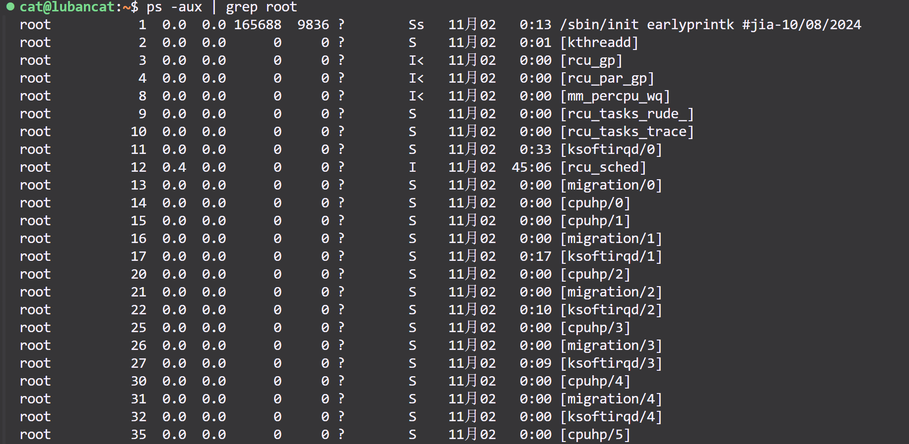

`ps -aux | grep root` 这个命令实际上是两个命令的组合:

- `ps -aux`:

    - `ps` 是显示当前系统中的进程(process)信息

    - `-aux` 是参数组合:

        - `a`: 显示所有用户的进程

        - `u`: 显示详细信息

        - `x`: 显示没有控制终端的进程

- `|`  符号: 这是管道符号 (pipe)，它的作用是将第一个命令 (`ps -aux` )的输出作为第二个命令( `grep root` )的输入可以理解为将数据像水管一样从一个命令传递到另一个命令

- `grep root`: `grep` 是搜索过滤命令，这里会搜索包含 "root" 的行

所以整个命令的作用是：显示系统中所有进程，然后从中过滤出只有包含 "root" 的进程信息行。这通常用来查看系统中由 root 用户运行的进程。其实在这里就打开了两个进程，`ps` 命令本应该在终端输出信息的，但是它通过管道将输出的信息作为 `grep` 命令的输入信息，然后通过搜索之后将合适的信息显示出来，这样子就形成了我们在终端看到的信息。

可以验证是否打开了两个进程，使用以下命令查看当前的进程情况，一定会在输出的最后打印两个进程相关的信息（`ps`、`grep`）：

```bash
ps -ux | grep $USER
```


什么是管道呢？当数据从一个进程连接流到另一个进程时，这之间的连接就是一个管道（pipe）。我们**通常是把一个进程的输出通过管道连接到另一个进程的输入。** 

对于 shell 命令来说，命令的连接是通过管道字符来完成的，正如 `ps -aux | grep root` 命令一样，只需要使用 `|` 字符进行连接即可。

对这个 `ps -aux | grep root` 命令进行详细的分析，它实际上就是执行以下过程：

- shell 负责安排两个命令的标准输入和标准输出。
- `ps` 的标准输入来自终端鼠标、键盘等。
- `ps` 的标准输出传递给 `grep`，作为 `grep` 的标准输入。
- `grep` 的标准输出连接到终端，即输出到显示器屏幕，最终我们看到 `grep` 的输出结果。

shell 所做的工作实际上是对标准输入和标准输出流进行了重新连接，在 `ps` 命令与 `grep` 之间建立了数据管道，示意图如下：


#### 30.2 管道的分类

Linux 系统上的管道分两种类型：

- 匿名管道
- 命名管道

这两种管道也叫做无名或有名管道，为了统一，以下我们称为匿名管道和命名管道。匿名管道最常见的形态就是我们在 shell 操作中最常用的 `|`。它的特点是只能在父子进程中使用，父进程在产生子进程前必须打开一个管道文件，然后 `fork` 产生子进程，这样子进程通过拷贝父进程的进程地址空间获得同一个管道文件的描述符，以达到使用同一个管道通信的目的。此时除了父子进程外，没人知道这个管道文件的描述符，所以通过这个管道中的信息无法传递给其他进程。这保证了传输数据的安全性，当然也降低了管道了通用性，于是系统还提供了命名管道，它本质是一个文件，位于文件系统中，命名管道可以让多个无相关的进程进行通讯。

##### 30.2.1 匿名管道 PIPE

匿名管道（PIPE）是一种特殊的文件，但虽然它是一种文件，却没有名字，因此一般进程无法使用 `open()` 来获取他的描述符，它只能在一个进程中被创建出来，然后通过继承的方式将他的文件描述符传递给子进程，这就是为什么匿名管道只能用于亲缘关系进程间通信的原因。另外，匿名管道不同于一般文件的显著之处是：它有两个文件描述符，而不是一个，一个只能用来读，另一个只能用来写，这就是所谓的 “半双工” 通信方式。而且它对写操作不做任何保护，即：假如有多个进程或线程同时对匿名管道进行写操作，那么这些数据很有可能会相互践踏，因此一个简单的结论是：匿名管道只能用于一对一的亲缘进程通信。最后，匿名管道不能使用`lseek()` 来进行所谓的定位，因为他们的数据不像普通文件那样按块的方式存放在诸如硬盘、flash 等块设备上。

总结来说，匿名管道有以下的特征：

- 没有名字，因此不能使用 `open()` 函数打开，但可以使用 `close()` 函数关闭。
- 只提供单向通信（即半双工通信），也就是说，两个进程都能访问这个文件，假设进程 1 往文件内写东西，那么进程 2 就只能读取文件的内容。
- 只能用于具有血缘关系的进程间通信，通常用于父子进程建通信。
- 管道是基于字节流来通信的。
- 依赖于文件系统，它的生命周期随着进程的结束而结束。
- 写入操作不具有原子性，因此只能用于一对一的简单通信情形。
- 管道也可以看成是一种特殊的文件，对于它的读写也可以使用普通的 `read()` 和 `write()` 等函数。但是它又不是普通的文件，并不属于其他任何文件系统，并且只存在于内核的内存空间中，因此不能使用 `lseek()` 来定位。

##### 30.2.2 命名管道 FIFO

命名管道（FIFO）与匿名管道（PIPE）是不同的，命名管道可以在多个无关的进程中交换数据（通信）。我们知道，匿名管道的通信方式通常都由一个共同的祖先进程启动，只能在 ”有血缘关系” 的进程中进行数据交互，这给我们在不相关的的进程之间交换数据带来了不方便，因此产生了命名管道，来解决不相关进程间的通信问题。

命名管道不同于无名管道之处在于它提供了一个路径名与之关联，以一个文件形式存在于文件系统中，这样，即使与命名管道的创建进程不存在 “血缘关系” 的进程，只要可以访问该命名管道文件的路径，就能够彼此通过命名管道相互通信，因为可以通过文件的形式，那么就可以调用系统中对文件的操作，如打开（open）、读（read）、写（write）、关闭（close）等函数，虽然命名管道文件存储在文件系统中，但数据却是存在于内存中的，这点要区分开。

总结来说，命名管道有以下的特征：

- 有名字，存储于普通文件系统之中。
- 任何具有相应权限的进程都可以使用 `open()` 来获取命名管道的文件描述符。
- 跟普通文件一样：使用统一的 `read()`/`write()` 来读写。
- 跟普通文件不同：不能使用 `lseek()` 来定位，原因是数据存储于内存中。
- 具有写入原子性，支持多写者同时进行写操作而数据不会互相践踏。
- 遵循先进先出（First In First Out）原则，最先被写入 FIFO 的数据，最先被读出来。

#### 30.3 pipe() 函数

`pipe()` 函数用于创建一个匿名管道，一个可用于进程间通信的单向数据通道。我们可以通过 `man` 命令查看 `pipe`函数原型：

```c
#include <unistd.h>

int pipe(int pipefd[2]);
```

函数原型非常简单，没有任何的传入参数，注意：数组 `pipefd` 是用于返回两个引用管道末端的文件描述符，它是一个由两个文件描述符组成的数组的指针。**`pipefd[0]` 指管道的读取端，`pipefd[1]`指向管道的写端**，向管道的写入端写入数据将会由内核缓冲，即写入内存中，直到从管道的读取端读取数据为止，而且数据遵循先进先出原则。`pipe()` 函数还会返回一个 `int` 类型的变量，如果为 0 则表示创建匿名管道成功，如果为 -1 则表示创建失败，并且设置 errno。

匿名管道创建成功以后，创建该匿名管道的进程（父进程）同时掌握着管道的读取端和写入端，但是想要父子进程间有数据交互，则需要以下操作：

- 父进程调用 `pipe()` 函数创建匿名管道，得到两个文件描述符 `pipefd[0]`、 `pipefd[1]`，分别指向管道的读取端和写入端。
- 父进程调用 `fork()` 函数启动（创建）一个子进程，那么子进程将从父进程中继承这两个文件描述符 `pipefd[0]`、`pipefd[1]`，它们指向同一匿名管道的读取端与写入端。
- 由于匿名管道是利用环形队列实现的，数据将从写入端流入管道，从读取端流出，这样子就实现了进程间通信，但是这个匿名管道此时有两个读取端与两个写入端，如图 *fork 后子进程继承父进程文件描述符* 所示，因此需要进行接下来的操作。
- 如果想要从父进程将数据传递给子进程，则父进程需要关闭读取端，子进程关闭写入端，如图 *数据从父进程流向子进程* 所示。
- 如果想要从子进程将数据传递给父进程，则父进程需要关闭写入端，子进程关闭读取端，如图 *数据从子进程流向父进程* 所示。
- 当不需要管道的时候，就在进程中将未关闭的一端关闭即可。

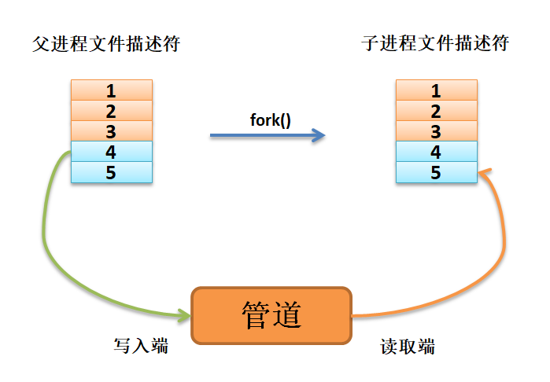

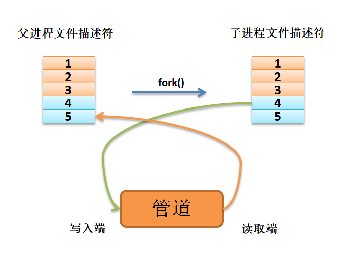

##### 30.3.1 pipe() 实验

我们可以使用 `pipe()` 函数做一个测试实验。

```c
// path: base_linux/system_programing/pipe/sources/pipe.c
#include <unistd.h>
#include <sys/types.h>
#include <sys/wait.h>
#include <error.h>
#include <stdio.h>
#include <stdlib.h>
#include <string.h>

#define MAX_DATA_LEN 256
#define DELAY_TIME 1

int main(void)
{
    pid_t pid;
    int pipe_fd[2];
    char buf[MAX_DATA_LEN];
    const char data[] = "Pipe Test Program";
    int real_read, real_write;

    memset((void *)buf, 0, sizeof(buf));

    // 创建管道
    if (pipe(pipe_fd) < 0)
    {
        printf("pipe create error\n");
        exit(1);
    }

    // 创建一个子进程
    if ((pid = fork()) == 0)
    {
        // 子进程关闭写描述符，并通过使子进程暂停 3s 等待父进程已关闭相应的读描述符
        close(pipe_fd[1]);

        printf("Chile process create successfully!\n");
        sleep(DELAY_TIME * 3);

        if((real_read = read(pipe_fd[0], buf, MAX_DATA_LEN)) > 0) {
            printf("%d bytes read from the pipe is '%s'\n", real_read, buf);
        }
        else {
            printf("Child: pipe read error!\n");
        }

        // 关闭子进程读描述符
        close(pipe_fd[0]);

        exit(0);
    }
    else if (pid > 0)
    {
        close(pipe_fd[0]);

        sleep(DELAY_TIME);

        if ((real_write = write(pipe_fd[1], data, strlen(data))) != -1)
        {
            printf("Parent write %d bytes: '%s'\n", real_write, data);
        }

        // 关闭父进程写描述符
        close(pipe_fd[1]);

        // 收集子进程推出信息
        waitpid(pid, NULL, 0);

        exit(0);
    }
}
```

- 定义一个数组 `pipe_fd`，在创建匿名管道后通过数组返回管道的文件描述符。
- 调用 `pipe()` 创建一个匿名管道，创建成功则得到两个文件描述符 `pipe_fd[0]`、`pipe_fd[1]`，否则返回-1。
- 调用 `fork()` 创建一个子进程，如果返回值是 0 则表示此时运行的是子进程，那么在子进程中调用 `close()` 函数关闭写描述符，并使子进程睡眠 3s 等待父进程已关闭相应的读描述符。
- 子进程调用 `read()` 函数读取管道内容，如果管道没有数据则子进程将被阻塞，读取到数据就将数据打印出来。特别地如果调用 `read()` 函数读取一个关闭了写描述符的管道，那么 `read()` 会返回0，（本例子中父进程的写描述符没有关闭）。
- 调用 `close()` 函数关闭子进程读描述符。
- 如果 `fork()` 函数的返回值大于0，则表示此时运行的是父进程，那么在父进程中先调用 `close()` 关闭管道的读描述符，并且等待 1s，因为此时可能子进程先于父进程运行，暂且等待一会。
- 父进程调用 `write()` 函数将数据写入管道。
- 关闭父进程写描述符。
- 调用 `waitpid()` 函数收集子进程退出信息并退出进程。


#### 30.4 fifo() 函数

至此，我们还只能在有 “血缘关系” 的程序之间传递数据，即这些程序是由一个共同的祖先进程启动的。但如果想在不相关的进程之间交换数据，我们可以用 FIFO 文件来完成这项工作，或者称之为命名管道。命名管道是一种特殊类型的文件，它在文件系统中以文件名的形式存在，但它的数据却是存储在内存中的。我们可以在终端（命令行）上创建命名管道，也可以在程序中创建它。

比如使用 `mkfifo` 命令去创建一个命名管道，关于 `mkfifo` 命令，我们可以使用 `man` 命令查看一下它的描述：

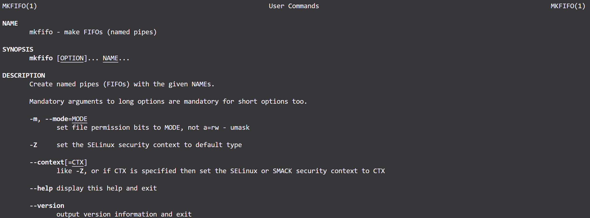

```
名称
	mkfifo - 创建FIFO（命名管道）
概述
	mkfifo [选项]... 名称...
描述
	使用给定的名称创建命名管道（FIFO）。
	
	必选参数对长短选项同时适用。
	
	-m, --mode=模式 将文件权限位设置为给定的模式（类似chmod），而不是类似a=rw 这样
	
	-Z 将SELinux 安全上下文设置为默认类型
	
	--context[=CTX]
		类似-Z，或者如果指定了上下文，则将SELinux 或者SMACK 安全上下文设置为指定类型
		
	--help 显示此帮助信息并退出
```

我们创建一个命名管道，此时会创建一个命名管道文件 `test`，可以通过 `file` 命令去看一下这个 `test`文件的类型：

```bash
mkfifo test
file test
```

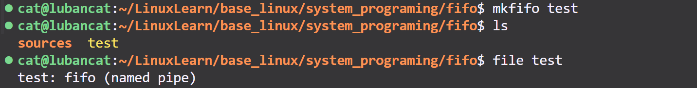

这个 `mkfifo` 命令实际上就是 Linux 系统的同名 API mkfifo，在源代码里我们可以通过调用 `mkfifo` 函数创建一个命名管道，其实就类似于创建一个文件，只不过这个文件的类型是命名管道的类型。

`mkfifo()` 的函数原型如下：

```c
int mkfifo(const char * pathname,mode_t mode);
```

`mkfifo()` 会根据参数 `pathname` 建立特殊的 FIFO 文件，而参数 `mode` 为该文件的模式与权限。

`mkfifo()` 创建的 FIFO 文件其他进程都可以进行读写操作，可以使用读写一般文件的方式操作它，如open，read，write，close 等。

`mode` 模式及权限参数说明：

- O_RDONLY：读管道。
- O_WRONLY：写管道。
- O_RDWR：读写管道。
- O_NONBLOCK：非阻塞。
- O_CREAT：如果该文件不存在，那么就创建一个新的文件，并用第三个参数为其设置权限。
- O_EXCL：如果使用 O_CREAT 时文件存在，那么可返回错误消息。这一参数可测试文件是否存在。

函数返回值说明如下：

- 0：成功
- EACCESS：参数 `filename` 所指定的目录路径无可执行的权限。
- EEXIST：参数 `filename` 所指定的文件已存在。
- ENAMETOOLONG：参数 `filename` 的路径名称太长。
- ENOENT：参数 `filename` 包含的目录不存在。
- ENOSPC：文件系统的剩余空间不足。
- ENOTDIR：参数 `filename` 路径中的目录存在但却非真正的目录。
- EROFS：参数 `filename` 指定的文件存在于只读文件系统内。

使用 FIFO 的过程中，当一个进程对管道进行读操作时：

- 若该管道是阻塞类型，且当前 FIFO 内没有数据，则对读进程而言将一直阻塞到有数据写入。
- 若该管道是非阻塞类型，则不论 FIFO 内是否有数据，读进程都会立即执行读操作。即如果 FIFO 内没有数据，读函数将立刻返回 0。

使用 FIFO 的过程中，当一个进程对管道进行写操作时：

- 若该管道是阻塞类型，则写操作将一直阻塞到数据可以被写入。
- 若该管道是非阻塞类型而不能写入全部数据，则写操作进行部分写入或者调用失败。

##### 30.4.1 fifo 实验

```c
// path: base_linux/system_programing/fifo/sources/fifo.c
#include <sys/wait.h>
#include <sys/types.h>
#include <sys/stat.h>
#include <unistd.h>
#include <errno.h>
#include <fcntl.h>
#include <stdio.h>
#include <stdlib.h>
#include <limits.h>
#include <string.h>

// 命名管道文件名
#define MYFIFO "myfifo"

// 4096 定义在 limits.h 文件中
#define MAX_BUFFER_SIZE PIPE_BUF

void fifo_read(void)
{
    char buff[MAX_BUFFER_SIZE];
    int fd;
    int nread;

    printf("**************************** read fifo ****************************\n");
    if (access(MYFIFO, F_OK) == -1)
    {
        if ((mkfifo(MYFIFO, 0666) < 0) && (errno != EEXIST)) 
        {
            printf("Cannot create fifo file\n");
            exit(1);
        }
    }

    // 以只读阻塞方式打开命名管道
    fd = open(MYFIFO, O_RDONLY);
    if (fd == -1)
    {
        printf("Open fifo file error\n");
        exit(1);
    }

    memset(buff, 0, sizeof(buff));

    if ((nread = read(fd, buff, MAX_BUFFER_SIZE)) > 0)
    {
        printf("Read '%s' from FIFO\n", buff);
    }

    printf("**************************** close fifo ****************************\n");

    close(fd);

    exit(0);
}

void fifo_write(void)
{
    int fd;
    char buff[] = "this is a fifo test demo";
    int nwrite;

    // 等待子进程先运行
    sleep(2);

    // 以只写阻塞方式打开 FIFO 管道
    fd = open(MYFIFO, O_WRONLY | O_CREAT, 0644);
    if (fd == -1)
    {
        printf("Open fifo file error\n");
        exit(1);
    }

    printf("Write '%s' to FIFO\n", buff);

    // 向管道中写入字符串
    nwrite = write(fd, buff, MAX_BUFFER_SIZE);

    // 等待子进程退出
    if (wait(NULL))
    {
        close(fd);
        exit(0);
    }
}

int main(void)
{
    pid_t result;
    result = fork();

    if (result == -1)
    {
        printf("Fork error!\n");
    }

    // 返回值为 0 代表子进程
    else if (result == 0)
    {
        fifo_read();
    }

    // 返回值大于 0 代表父进程
    else
    {
        fifo_write();
    }

    return result;
}
```

- `main()`
    - 首先使用 `fork` 函数创建一个子进程。
    - 返回值为 0 代表子进程，就运行 `fifo_read()` 函数。
    - 返回值为 0 代表子进程，就运行 `fifo_read()` 函数。
- `fifo_read()`
    - 在子进程中先通过 `access()` 函数判断命名管道是否已存在，若尚未创建，则以相应的权限创建
    - 调用 `mkfifo()` 函数创建一个命名管道。
    - 使用 `open()` 函数以只读阻塞方式打开命名管道。
    - 使用 `read()` 函数读取管道的内容，由于打开的管道是阻塞的，而此时管道中没有存在任何数据，因此子进程会阻塞在这里，等待到管道中有数据时才恢复运行，并打印从管道中读取到的数据。
    - 读取完毕，使用close() 函数关闭管道。
- `fifo_write()`
    - 父进程休眠 2 秒，等待子进程先运行，因为本例子是在子进程中创建管道的。
    - 以只写阻塞方式打开 FIFO 管道。
    - 向管道中写入字符串数据，当写入后管道中就存在数据了，此时处于阻塞的子进程将恢复运行，并将字符串数据打印出来。
    - 等待子进程退出，并且关闭管道。


本示例是两个进程之间的通信问题（例子中使用了父子进程，但即使是没有 “血缘关系”的进程也是一样的操作），也就是说，一个进程向 FIFO 文件写数据，而另一个进程在 FIFO 文件中读取数据。

可以试想这样一个问题，只使用一个 FIFO 文件，如果有多个进程同时向同一个 FIFO 文件写数据，而只有一个读FIFO 进程在同一个 FIFO 文件中读取数据时，会发生怎么样的情况呢？

大家是不是会觉得数据相互交错混乱？

如果不做任何处理，的确会这样子，但 FIFO 跟 PIPE 区别的还有一个最大的不同点在于: **FIFO 是具有写原子特性的，就是让写操作的原子化。**

怎样才能使写操作原子化呢？

答案很简单，系统规定：在一个以 O_WRONLY（即阻塞方式）打开的 FIFO 中，如果写入的数据长度小于等于PIPE_BUF，那么要么写入全部字节，要么一个字节都不写入。如果所有的写请求都是发往一个阻塞的 FIFO 的，并且每个写记请求的数据长度小于等于 PIPE_BUF 字节，系统就可以确保数据决不会交错在一起。这种特性使得我们对 FIFO 进行写操作时无需担忧这个问题。

FIFO 的应用场景是什么呢？

一个典型应用是 Linux 的日志系统。系统的日志信息被统一安排存放在 `/var/log` 目录下，这些日志文件都是一些普通的文本文件，在 Linux 系统中普通的文件可以被一个或多个进程重读多次打开，每次打开都有一个独立的位置偏移量，如果多个进程或线程同时写文件，那么除非他们之间能相互协调好，否则必然导致混乱。可惜需要写日志的进程根本不可能“协调好”，由于写日志的进程是毫无关联的，因此常用的互斥手段(比如后面介绍的什么互斥锁、信号量等) 是无法起作用的，就像你无法试图通过交通法规来杜绝有人乱闯红灯一样，因为总有人可以故意无视规则，肆意践踏规则，如何使得毫不相干的不同进程的日志信息都能完整地输送到日志文件中而不相互破坏，是一个必须要解决的问题，一个简单高效的方案是：使用 FIFO 来接收各个不相干进程的日志信息，然后让一个进程专门将FIFO 中的数据写到相应的日志文件当中。这样做的好处是，任何进程无需对日志信息的互斥编写出任何额外的代码，只管往 FIFO 里面写入即可。后台默默耕耘的日志系统服务例程会将这些信息一一地拿出来再写入日志文件，FIFO 的写入原子性保证了数据的完整无缺而且不会错乱。

### 31. 消息队列

Linux 下的进程通信手段基本上是从 Unix 平台上的进程通信手段继承而来的。而对 Unix 发展做出重大贡献的两大主力 AT&T 的贝尔实验室以及 BSD（加州大学伯克利分校的伯克利软件发布中心），他们在进程间通信方面的侧重点有所不同；

- 前者对 Unix 早期的进程间通信手段进行了系统的改进和扩充，形成了 “system-V IPC”，通信进程局限在单个计算机内（同一个设备的不同进程间通讯）；
- 而后者则跳过了该限制，形成了基于套接字（socket）的进程间通信机制（多用于不同设备的进程间通讯）。Linux 则把两者继承了下来，所以说 Linux 才是最成功的，既有 “system-V IPC”，又支持 “socket”。

**消息队列、共享内存和信号量被统称为 system-V IPC** ，V 是罗马数字 5，是 Unix 的 AT&T 分支的其中一个版本，一般习惯称呼他们为 IPC 对象，这些对象的操作接口都比较类似，在系统中他们都使用一种叫做 key 的键值来唯一标识，而且他们都是 “持续性” 资源——即他们被创建之后，不会因为进程的退出而消失，而会持续地存在，除非调用特殊的函数或者命令删除他们。

Linux 的 IPC 对象（包括消息队列、共享内存和信号量）在内核内部使用链表维护，不同的对象使用 IPC 标识符来标识，如消息队列标识符 `msqid`、共享内存标识符 `shmid`，信号量标识符 `semid`。

对于用户来说，内核提供了简洁的接口，不同的进程通过 IPC 关键字（key）即可访问具体的对象。

通过如下命令可以查看系统当前的 IPC 对象，没有使用的情况下可能为空：

```bash
ipcs
```

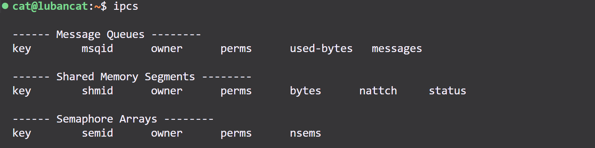

#### 31.1 消息队列的基本概念

消息队列提供了一种从一个进程向另一个进程发送一个数据块的方法。每个数据块都被认为含有一个类型，接收进程可以独立地接收含有不同类型的数据结构。我们可以通过发送消息来避免命名管道的同步和阻塞问题。

#### 31.2 消息队列与信号、管道的对比

消息队列与信号的对比：

- 信号承载的信息量少，而消息队列可以承载大量自定义的数据。

消息队列与管道的对比：

- 消息队列跟命名管道有不少的相同之处，它与命名管道一样，消息队列进行通信的进程可以是不相关的进程，同时它们都是通过发送和接收的方式来传递数据的。在命名管道中，发送数据用 `write()`，接收数据用`read()`，则在消息队列中，发送数据用 `msgsnd()`，接收数据用 `msgrcv()`，消息队列对每个数据都有一个最大长度的限制。
- 消息队列也可以独立于发送和接收进程而存在，在进程终止时，消息队列及其内容并不会被删除。
- 管道只能承载无格式字节流，消息队列提供有格式的字节流，可以减少了开发人员的工作量。
- 消息队列是面向记录的，其中的消息具有特定的格式以及特定的优先级，接收程序可以通过消息类型有选择地接收数据，而不是像命名管道中那样，只能默认地接收。
- 消息队列可以实现消息的随机查询，消息不一定要以先进先出的顺序接收，也可以按消息的类型接收。

消息队列的实现包括创建或打开消息队列、发送消息、接收消息和控制消息队列这 4 种操作。

#### 31.3 消息队列函数说明

Linux 内核提供了一系列函数来使用消息队列：

- 其中创建或打开消息队列使用的函数是 `msgget()`，这里创建的消息队列的数量会受到系统可支持的消息队列数量的限制；
- 发送消息使用的函数是 `msgsnd()` 函数，它把消息发送到已打开的消息队列末尾;
- 接收消息使用的函数是 `msgrcv()`，它把消息从消息队列中取走，与 FIFO 不同的是，这里可以指定取走某一条消息;
- 最后控制消息队列使用的函数是 `msgctl()`，它可以完成多项功能。

##### 37.3.1 msgget() 获取函数

收发消息前需要具体的消息队列对象，`msgget()` 函数的作用是创建或获取一个消息队列对象，并返回消息队列标识符。函数原型如下：

```c
int msgget(key_t key, int msgflg);
```

若执行成功返回队列 ID，失败返回 -1。它的两个输入参数说明如下：

- `key` ：消息队列的关键字值，多个进程可以通过它访问同一个消息队列。例如收发进程都使用同一个键值即可使用同一个消息队列进行通讯。其中有个特殊值 IPC_PRIVATE，它用于创建当前进程的私有消息队列。

- `msgflg` ：表示创建的消息队列的模式标志参数，主要有 IPC_CREAT，IPC_EXCL 和权限 `mode`：

    - 如果是 IPC_CREAT 为真表示：如果内核中不存在关键字与 `key` 相等的消息队列，则新建一个消息队列；如果存在这样的消息队列，返回此消息队列的标识符。
    - 而如果为 IPC_CREAT | IPC_EXCL 表示如果内核中不存在键值与 `key` 相等的消息队列，则新建一个消息队列；如果存在这样的消息队列则报错。
    - `mode` 指 IPC 对象存取权限，它使用 Linux 文件的数字权限表示方式，如 0600，0666 等。

    这些参数是可以通过 `｜` 运算符联合起来的，因为它始终是 int 类型的参数。如 `msgflag`使用参数 IPC_CREAT | 0666 时表示，创建或返回已经存在的消息队列的标识符，且该消息队列的存取权限为 0666，即消息的所有者，所属组用户，其他用户均可对该消息进行读写。
    
    > [!CAUTION]
    >
    > - 选项 `msgflg` 是一个位掩码，因此 IPC_CREAT、IPC_EXCL 和权限 `mode` 可以用位或的方式叠加起来，比如: `msgget(key, IPC_CREAT | 0666);` 表示如果 `key` 对应的消息队列不存在就创建，且权限指定为 0666，若已存在则直接获取消息队列 ID，此处的 0666 使用的是 Linux 文件权限的数字表示方式。
    > - 权限只有读和写，执行权限是无效的，例如 0777 跟 0666 是等价的。
    > - 当 `key` 被指定为 IPC_PRIVATE 时，系统会自动产生一个未用的 `key` 来对应一个新的消息队列对象，这个消息队列一般用于进程内部间的通信。

- 该函数可能返回以下错误代码：
    - EACCES：指定的消息队列已存在，但调用进程没有权限访问它
    - EEXIST：`key` 指定的消息队列已存在，而 `msgflg` 中同时指定 IPC_CREAT 和IPC_EXCL 标志
    - ENOENT：`key` 指定的消息队列不存在同时 `msgflg` 中没有指定 IPC_CREAT 标志
    - ENOMEM：需要建立消息队列，但内存不足
    - ENOSPC：需要建立消息队列，但已达到系统的限制

#### 31.4 发送消息与接受消息

##### 31.4.1 msgsnd() 发送函数

这个函数的主要作用就是将消息写入到消息队列，俗称发送一个消息。函数原型如下：

```c
int msgsnd(int msqid, const void *msgp, size_t msgsz, int msgflg);
```

参数说明：

- `msqid`：消息队列标识符。

- `msgp`：发送给队列的消息。`msgp` 可以是任何类型的结构体，但第一个字段必须为 `long` 类型，即表明此发送消息的类型，`msgrcv()` 函数则根据此接收消息。`msgp` 定义的参照格式如下：

    ```c
    /*msgp 定义的参照格式*/
    struct s_msg{
    	long type;      /* 必须大于0, 消息类型*/
    	char mtext[１]; /* 消息正文，可以是其他任何类型*/
    } msgp;
    ```

    - `msgsz`：要发送消息的大小，不包含消息类型占用的 4 个字节，即 `mtext` 的长度。

    - `msgflg`：如果为 0 则表示：当消息队列满时，`msgsnd()` 函数将会阻塞，直到消息能写进消息队列；如果为 IPC_NOWAIT 则表示：当消息队列已满的时候，`msgsnd()` 函数不等待立即返回；如果为 IPC_NOERROR：若发送的消息大于 `size` 字节，则把该消息截断，截断部分将被丢弃，且不通知发送进程。

- 返回值：如果成功则返回 0，如果失败则返回 -1，并且错误原因存于 error 中。错误代码：
    - EAGAIN：参数 `msgflg` 设为 IPC_NOWAIT，而消息队列已满。
    - EIDRM：标识符为 `msqid` 的消息队列已被删除。
    - EACCESS：无权限写入消息队列。
    - EFAULT：参数 `msgp` 指向无效的内存地址。
    - EINTR：队列已满而处于等待情况下被信号中断。
    - EINVAL：无效的参数 `msqid`、`msgsz` 或参数消息类型 `type` 小于 0。

`msgsnd()` 为阻塞函数，当消息队列容量满或消息个数满会阻塞。若消息队列已被删除，则返回 EIDRM 错误；若被信号中断返回 E_INTR 错误。

如果设置 IPC_NOWAIT 消息队列满或个数满时会返回 -1，并且置 EAGAIN 错误。

`msgsnd()` 解除阻塞的条件有以下三个条件：

- 消息队列中有容纳该消息的空间。
- `msqid` 代表的消息队列被删除。
- 调用 `msgsnd` 函数的进程被信号中断。

##### 31.4.2 msgrcv() 接收函数

`msgrcv()` 函数是从标识符为 `msqid` 的消息队列读取消息并将消息存储到 `msgp` 中，读取后把此消息从消息队列中删除，也就是俗话说的接收消息。函数原型：

```c
ssize_t msgrcv(int msqid, void *msgp, size_t msgsz, long msgtyp, int msgflg);
```

参数说明：

- `msqid`：消息队列标识符。
- `msgp`：存放消息的结构体，结构体类型要与 `msgsnd()` 函数发送的类型相同。
- `msgsz`：要接收消息的大小，不包含消息类型占用的 4 个字节。
- `msgtyp` 有多个可选的值：如果为 0 则表示接收第一个消息，如果大于 0 则表示接收类型等于 `msgtyp` 的第一个消息，而如果小于 0 则表示接收类型等于或者小于 `msgtyp` 绝对值的第一个消息。

- `msgflg` 用于设置接收的处理方式，取值情况如下：
    - 0 : 阻塞式接收消息，没有该类型的消息 `msgrcv` 函数一直阻塞等待
    - IPC_NOWAIT：若在消息队列中并没有相应类型的消息可以接收，则函数立即返回，此时错误码为 ENOMSG
    - IPC_EXCEPT：与 `msgtype` 配合使用返回队列中第一个类型不为 `msgtype` 的消息
    - IPC_NOERROR：如果队列中满足条件的消息内容大于所请求的 `size` 字节，则把该消息截断，截断部分将被丢弃

- 返回值：`msgrcv()` 函数如果接收消息成功则返回实际读取到的消息数据长度，否则返回 -1，错误原因存于 error 中。错误代码：
    - E2BIG：消息数据长度大于 `msgsz` 而 `msgflag` 没有设置 IPC_NOERROR
    - EIDRM：标识符为 `msqid` 的消息队列已被删除
    - EACCESS：无权限读取该消息队列
    - EFAULT：参数 `msgp` 指向无效的内存地址
    - ENOMSG：参数 `msgflg` 设为 IPC_NOWAIT，而消息队列中无消息可读
    - EINTR：等待读取队列内的消息情况下被信号中断

`msgrcv()` 函数解除阻塞的条件也有三个：

- 消息队列中有了满足条件的消息。
- `msqid` 代表的消息队列被删除。
- 调用 `msgrcv()` 函数的进程被信号中断。

##### 37.4.3 msgctl() 操作消息队列

消息队列是可以被用户操作的，比如设置或者获取消息队列的相关属性，那么可以通过 `msgctl()` 函数去处理它。函数原型：

```c
int msgctl(int msqid, int cmd, struct msqid_ds *buf);
```

参数说明：

- `msqid`：消息队列标识符。

- `cmd` 用于设置使用什么操作命令，它的取值有多个：
    - IPC_STAT 获取该 MSG 的信息，获取到的信息会储存在结构体 `msqid_ds` 类型的 `buf` 中。
    - IPC_SET 设置消息队列的属性，要设置的属性需先存储在结构体 `msqid_ds` 类型的 `buf` 中，可设置的属性包括：`msg_perm.uid`、`msg_perm.gid`、`msg_perm.mode` 以及 `msg_qbytes`，储存在结构体 `msqid_ds` 中。
    - IPC_RMID 立即删除该 MSG，并且唤醒所有阻塞在该 MSG 上的进程，同时忽略第三个参数。
    - IPC_INFO 获得关于当前系统中 MSG 的限制值信息。
    - MSG_INFO 获得关于当前系统中 MSG 的相关资源消耗信息。
    - MSG_STAT 同 IPC_STAT，但 `msgid` 为该消息队列在内核中记录所有消息队列信息的数组的下标，因此通过迭代所有的下标可以获得系统中所有消息队列的相关信息。

- `buf` ：相关信息结构体缓冲区。

    返回值：

    - 成功：0
    - 出错：-1，错误原因存于 error 中，错误代码：
        - EACCESS：参数 `cmd` 为 IPC_STAT，确无权限读取该消息队列。
        - EFAULT：参数 `buf` 指向无效的内存地址。
        - EIDRM：标识符为 `msqid` 的消息队列已被删除。
        - EINVAL：无效的参数 `cmd` 或 `msqid`。
        - EPERM：参数 `cmd` 为 IPC_SET 或 IPC_RMID，却无足够的权限执行。

#### 31.5 消息队列示例

接下来通过示例来讲解消息队列的使用，使用方法一般是:

<u>发送者</u>：

1. 获取消息队列的 ID
2. 将数据放入一个附带有标识的特殊的结构体，发送给消息队列。

<u>接收者</u>：

1. 获取消息队列的 ID
2. 将指定标识的消息读出。

当发送者和接收者都不再使用消息队列时，及时删除它以释放系统资源。

本次实验主要是两个进程（无血缘关系的进程）通过消息队列进行消息的传递，一个进程发送消息，一个进程接收消息，并将其打印出来。

##### 31.5.1 发送进程

```c
// path: base_linux/system_programing/msg/msg_send/sources/msg.c
#include <sys/types.h>
#include <sys/ipc.h>
#include <sys/msg.h>
#include <stdio.h>
#include <stdlib.h>
#include <unistd.h>
#include <string.h>

#define BUFFER_SIZE 512

struct message {
    long msg_type;
    char msg_text[BUFFER_SIZE];
};

int main(void)
{
    int qid;
    struct message msg;

    /* 创建消息队列 */
    if ((qid = msgget((key_t)1234, IPC_CREAT | 0666)) == -1)
    {
        perror("msgget\n");
        exit(1);
    }

    printf("Open queue %d\n", qid);

    while(1)
    {
        printf("Enter some message to the queue:");
        if ((fgets(msg.msg_text, BUFFER_SIZE, stdin)) == NULL)
        {
            printf("\nGet message end.\n");
            exit(1);
        }

        msg.msg_type = getpid();

        // 添加消息到消息队列
        if ((msgsnd(qid, &msg, strlen(msg.msg_text), 0)) < 0)
        {
            perror("\nSend message error.\n");
            exit(1);
        }
        else
        {
            printf("Send message.\n");
        }

        if (strncmp(msg.msg_text, "quit", 4) == 0)
        {
            printf("\nQuit get message.\n");
            break;
        }
    }

    exit(0);
}
```

- 第 23 行，调用 `msgget()` 函数创建/获取了一个 `key` 值为 1234 的消息队列，该队列的属性 “0666” 表示任何人都可读写，创建/获取到的队列 ID 存储在变量 `qid` 中。

- 第 47 行，调用 `msgsndb()` 函数把进程号以及前面用户输入的字符串，通过 `msg` 结构体添加到前面得到的 `qid` 队列中。

- 第 51 行，若用户发送的消息为 `quit`，那么退出循环结束进程。

```makefile
# path: base_linux/system_programing/msg/msg_send/Makedile
TARGET = msg_send

ARCH ?= arm

BUILD_DIR = build_$(ARCH)

SRC_DIR = sources

INC_DIR = includes .

SRCS = $(wildcard $(SRC_DIR)/*.c)

OBJS = $(patsubst %.c, $(BUILD_DIR)/%.o, $(notdir $(SRCS)))

DEPS = $(wildcard $(INC_DIR)/*.h)

CFLAGS = $(patsubst %, -I %, $(INC_DIR))

ifeq ($(ARCH), arm)
CC = gcc
else
CC = aarch64-linux-gnu-gcc
endif

$(BUILD_DIR)/$(TARGET): $(OBJS)
	$(CC) -o $@ $^ $(CFLAGS)
	@cp $(BUILD_DIR)/$(TARGET) .

$(BUILD_DIR)/%.o: $(SRC_DIR)/%.c $(DEPS)
	@mkdir -p $(BUILD_DIR)
	$(CC) -c -o $@ $< $(CFLAGS)

.PHONY: clean cleanall

clean:
	rm -rf $(BUILD_DIR)
	rm -f $(TARGET)

cleanall:
	rm -rf build_*
	rm -f $(TARGET)
```

##### 31.5.2 接收进程

```c
// path: base_linux/system_programing/msg/msg_recv/sources/msg.c
#include <sys/types.h>
#include <sys/ipc.h>
#include <sys/msg.h>
#include <stdio.h>
#include <stdlib.h>
#include <unistd.h>
#include <string.h>

#define BUFFER_SIZE 512

struct message {
    long msg_type;
    char mes_text[BUFFER_SIZE];
};

int main(void)
{
    int qid;
    struct message msg;

    /* 创建消息队列 */
    if ((qid = msgget((key_t)1234, IPC_CREAT|0666)) == -1)
    {
        perror("msgget");
        exit(1);
    }

    printf("Open queue %d\n", qid);

    do
    {
        /* 读消息队列 */
        memset(msg.mes_text, 0, BUFFER_SIZE);

        if (msgrcv(qid, (void*)&msg, BUFFER_SIZE, 0, 0) < 0)
        {
            perror("msgrcv");
            exit(1);
        }

        printf("The message from process %ld : %s", msg.msg_type, msg.mes_text);
    } while (strncmp(msg.mes_text, "quit", 4));

    /* 从系统内核中删除消息队列 */
    if ((msgctl(qid, IPC_RMID, NULL)) < 0)
    {
        perror("msgctl");
        exit(1);
    }
    else
    {
        printf("Delete msg qid: %d.\n", qid);
    }

    exit(0);
}
```

- 第 23 行，调用 `msgget()` 函数创建/获取队列 `qid`。可以注意到，此处跟发送进程是完全一样的，无论哪个进程先运行，若 `key` 值为 1234 的队列不存在则创建，把以实验时两个进程并没有先后启动顺序的要求。
- 第 23 行，调用 `msgget()` 函数创建/获取队列 `qid`。可以注意到，此处跟发送进程是完全一样的，无论哪个进程先运行，若 key 值为 1234 的队列不存在则创建，把以实验时两个进程并没有先后启动顺序的要求。
- 第 47 行，若前面接收到用户的消息为 `quit`，会退出循环，在本行代码调用 `msgctl()` 删除消息队列并退出本进程。

Makefile 文件：

```makefile
# path: base_linux/system_programing/msg/msg_recv/Makedile
TARGET = msg_recv

ARCH ?= arm

BUILD_DIR = build_$(ARCH)

SRC_DIR = sources

INC_DIR = includes .

SRCS = $(wildcard $(SRC_DIR)/*.c)

OBJS = $(patsubst %.c, $(BUILD_DIR)/%.o, $(notdir $(SRCS)))

DEPS = $(wildcard $(INC_DIR)/*.h)

CFLAGS = $(patsubst %, -I %, $(INC_DIR))

ifeq ($(ARCH), arm)
CC = gcc
else
CC = aarch64-linux-gnu-gcc
endif

$(BUILD_DIR)/$(TARGET): $(OBJS)
	$(CC) -o $@ $^ $(CFLAGS)
	@cp $(BUILD_DIR)/$(TARGET) .

$(BUILD_DIR)/%.o: $(SRC_DIR)/%.c $(DEPS)
	@mkdir -p $(BUILD_DIR)
	$(CC) -c -o $@ $< $(CFLAGS)

.PHONY: clean cleanall

clean:
	rm -rf $(BUILD_DIR)
	rm -f $(TARGET)

cleanall:
	rm -rf build_*
	rm -f $(TARGET)
```

##### 31.5.3 编译及测试

###### 31.5.3.1 发送进程

```bash
cd your_file_path/msg/msg_send/
make
./msg_send
```

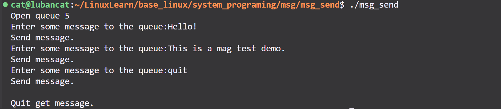

###### 31.5.3.2 查看消息队列

可以通过 `ipcs -q` 命令来查看系统中存在的消息队列，若以上队列没有关闭，它的查看结果如下：

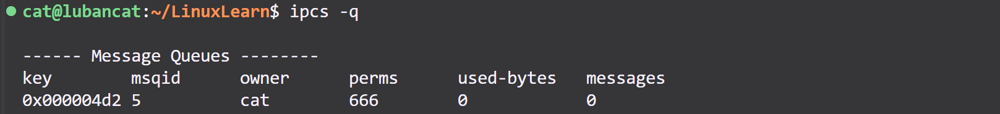

###### 31.5.3.3 接收进程

打开一个<u>新终端</u>，编译及运行接收消息进程：

```bash
cd your_file_path/msg/msg_recv/
make
./mag_revc
```

当你从发送消息进程输入消息时（按下回车键发送），接收消息进程会打印出你输入的消息，若无消息则接收进程会阻塞等待，接收到 `quit` 消息会退出进程。


> [!note]
>
> 在本例子中，若发送进程不是通过 `quit` 消息退出（如 `Ctrl+C` 或 `Ctrl+D`），则不会触发接收进程主动删除消息队列，在这种情况下可通过 `ipcs -q` 命令查看到该消息队列依然存在，通过 `ipcrm -q [消息队列 qid]` 即可删除。

### 32. system-V IPC 信号量

> [!NOTE]
>
> **本章主要讲解进程信号量的内容，如非特别说明，“信号量” 均表示system-V IPC 信号量**，这主要是为了区分后续章节的 “POSIX 信号量”

#### 32.1 进程信号量的基本概念

信号量与已经介绍过的信号、管道、FIFO 以及消息队列不同，它==本质上是一个计数器，用于协调多进程间对共享数据对象的读取==，它不以传送数据为主要目的，它主要是用来保护共享资源（信号量也属于临界资源），使得该临界资源在一个时刻只有一个进程独享。可能会有同学要问了，<u>为什么不使用全局变量呢？</u>那是因为全局变量并不能在进程间共同使用，因为进程间是相互独立的，而且也无法保证引用计数的原子操作，因此使用系统提供的信号量即可。

#### 32.2 信号量的工作原理

由于信号量只能进行两种操作：等待和发送信号，即 P 操作和 V 操作，锁行为就是 P 操作，解锁就是 V 操作，可以直接理解为 P 操作是申请资源，V 操作是释放资源。PV 操作是计算机操作系统需要提供的基本功能之一，它们的行为是这样的：

- `P` 操作：如果有可用的资源（信号量值大于 0），则占用一个资源（给信号量值减去一，进入临界区代码）; 如果没有可用的资源（信号量值等于 0），则阻塞，直到系统将资源分配给该进程（进入等待队列，一直等到资源轮到该进程）。这就像你要把车开进停车场之前，先要向保安申请一张停车卡一样，P 操作就是申请资源，如果申请成功，资源数（空闲的停车位）将会减少一个，如果申请失败，要不在门口等，要不就走人。
- `V` 操作：如果在该信号量的等待队列中有进程在等待资源，则唤醒一个阻塞的进程。如果没有进程等待它，则释放一个资源（给信号量值加一），就跟你从停车场出去的时候一样，空闲的停车位就会增加一个。

举个例子，就是两个进程共享信号量 `sem`，`sem` 可用信号量的数值为 1（资源数为1），一旦其中一个进程执行了 P 操作，它将得到信号量，并可以进入临界区，使 `sem` 减 1。而第二个进程将被阻止进入临界区，因为当它试图执行 P 操作时，`sem` 为 0，它会被挂起以等待第一个进程离开临界区域并执行 V 操作释放了信号量，这时第二个进程就可以恢复执行。

在==信号量进行 PV 操作时都为原子操作==（因为它需要保护临界资源）。

> [!Note]
>
> **原子操作**：单指令的操作称为原子的，单条指令的执行是不会被打断的

简单来说就是内核可以对这个信号量（计数器）做加减操作，并且操作时遵守一些基本操作原则，即：对信号量（计数器）做加操作立即返回，做减操作要判断信号量（计数器）当前值是否可减？（需要信号量的当前值大于等于 1），如果满足则进行减操作；否则将进程阻塞等待，直到系统中有进程对该信号量进行 V 操作。

#### 32.3 创建或获取一个信号量

##### 32.3.1 semget 创建/获取函数

`semget` 函数的功能是创建或者获取一个已经创建的信号量，如果成功则返回对应的信号量标识符，失败则返回-1。函数原型如下：

```c
#include <sys/types.h>
#include <sys/ipc.h>
#include <sys/sem.h>

int semget(key_t key, int nsems, int semflg);
```

参数说明：

- `key`：与消息队列一样的是，参数 `key` 用来标识系统内的信号量，如果指定的 `key` 已经存在，则意味着打开这个信号量，这时 `nsems` 参数指定为 0，`semflg` 参数也指定为 0。特别地，可以使用 *IPC_PRIVATE* 创建一个没有 `key` 的信号量。

- `nsems` : 本参数用于在创建信号量的时候，表示可用的信号量数目。
- `semflg`：`semflg` 参数用来指定标志位，与消息队列中的类似。主要有 *IPC_CREAT*，*IPC_EXCL* 和权限 `mode`，其中使用 *IPC_CREAT* 标志创建新的信号量，即使该信号量已经存在（具有同一个键值的信号量已在系统中存在），也不会出错。如果同时使用 *IPC_EXCL* 标志可以创建一个新的唯一的信号量，此时如果该信号量已经存在，该函数会返回出错。

创建信号量时，还受到以下系统信息的影响：

- *SEMMNI*：系统中信号量总数的最大值。
- *SEMMSL*：每个信号量中信号量元素个数的最大值。
- *SEMMNS*：系统中所有信号量中的信号量元素总数的最大值。

在 Linux 系统中，以上信息可通过命令 `ipcs -l` 查看.

#### 32.4 信号量操作

##### 32.4.1 semop() PV 操作函数

Linux 提供了 `semop()` 函数对信号量进行 PV 操作。函数原型如下：

```c
int semop(int semid, struct sembuf *sops, size_t nsops);
```

参数说明：

- `semid`: System V 信号量的标识符，用来标识一个信号量。

- `sops`：是指向一个 `struct sembuf` 结构体数组的指针，该数组是一个信号量操作数组。原型如下：

    ```c
    struct sembuf
    {
    	unsigned short int sem_num;   /* 信号量的序号从0 ~ nsems-1 */
    	short int sem_op;             /* 对信号量的操作，>0, 0, <0 */
    	short int sem_flg;            /* 操作标识：0， IPC_WAIT, SEM_UNDO */
    };
    ```

    - `sem_num` 用于标识信号量中的第几个信号量，0 表示第 1 个，1 表示第 2 个，`nsems -1` 表示最后一个。
    - `sem_op` 标识对信号量的所进行的操作类型。对信号量的操作有三种类型：
        - `sem_op` 大于0，表示进程对资源使用完毕，交回该资源，即对该信号量执行 V 操作，交回的资源数由 `sem_op` 决定，系统会把 `sem_op` 的值加到该信号量的信号量当前值 `semval` 上。特别地，如果 `sem_flag` 指定了*SEM_UNDO*（还原）标志，则从该进程的此信号量调整值中减去 `sem_op`。
        - `sem_op` 小于0，表示进程希望使用资源，对该信号量执行 P 操作， 当信号量当前值 `semval` 大于或者等于 `-sem_op` 时，`semval` 减掉 `sem_op` 的绝对值，为该进程分配对应数目的资源。特别地，如果指定 *SEM_UNDO*，则`sem_op` 的绝对值也加到该进程的此信号量调整值上。当 `semval` 小于 `-sem_op` 时，相应信号量的等待进程数量就加 1，调用进程被阻塞，直到 `semval` 大于或者等于 `-sem_op` 时，调用进程被唤醒，执行相应的 P 操作。
        - `sem_op` 等于 0，表示进程要阻塞等待，直至信号量当前值 `semval` 变为 0。
    - `sem_flg`，信号量操作的属性标志，可以指定的参数包括 *IPC_NOWAIT* 和 *SEM_UNDO*。如果为 0，表示正常操作；当指定了 *SEM_UNDO*，那么将维护进程对信号量的调整值，进程退出的时候会自动还原它对信号量的操作；当指定了*IPC_WAIT*，使对信号量的操作时非阻塞的。即指定了该标志，调用进程在信号量的值不满足条件的情况下不会被阻塞，而是直接返回 -1，并将 `errno` 设置为 *EAGAIN*。
    - <u>那么什么是信号量调整值呢？</u>其实就是指定信号量针对某个特定进程的调整值。只有 `sembuf` 结构的 `sem_flag` 指定为*SEM_UNDO* 后，信号量调整值才会随着 `sem_op` 而更新。讲简单一点：对某个进程，在指定 *SEM_UNDO* 后，对信号量的当前值的修改都会反应到信号量调整值上，当该进程终止的时候，内核会根据信号量调整值重新恢复信号量之前的值，*SEM_UNDO* 操作可以防止进程退出时没有释放信号量导致的死锁。

- `nsops`：表示上面 `sops` 数组的数量，如只有一个 `sops` 数组，`nsops` 就设置为 1。

##### 32.4.2 semctl() 属性函数

`semctl` 函数主要是对信号量集的一系列控制操作，根据操作命令 `cmd` 的不同，执行不同的操作，第四个参数是可选的。原型如下：

```c
int semctl(int semid, int semnum, int cmd, ...);
```

- `semid`：System V 信号量的标识符；
- `semnum`：表示信号量集中的第 `semnum` 个信号量。它的取值范围：`0 ~ nsems-1` 。

- `cmd`：操作命令，主要有以下命令：

    - *IPC_STAT*：获取此信号量集合的 `semid_ds` 结构，存放在第四个参数的 `buf` 中。
    - *IPC_SET*：通过第四个参数的 `buf` 来设定信号量集相关联的 `semid_ds` 中信号量集合权限为 `sem_perm` 中的 `uid`，`gid`，`mode`。
    - *IPC_RMID*：从系统中删除该信号量集合。
    - *GETVAL*：返回第 `semnum` 个信号量的值。
    - *SETVAL*：设置第 `semnum` 个信号量的值，该值由第四个参数中的 `val` 指定。
    - *GETPID*：返回第 `semnum` 个信号量的 `sempid`，最后一个操作的 `pid`。
    - *GETNCNT*：返回第 `semnum` 个信号量的 `semncnt`。等待 `semval` 变为大于当前值的线程数。
    - *GETZCNT*：返回第 `semnum` 个信号量的 `semzcnt`。等待 `semval` 变为 0 的线程数。
    - *GETALL*：去信号量集合中所有信号量的值，将结果存放到的 `array` 所指向的数组。
    - *SETALL*：按 `arg.array` 所指向的数组中的值，设置集合中所有信号量的值。

- 第四个参数是可选的：如果使用该参数，该参数的类型为 `union semun`，它是多个特定命令的联合体，具体如下：

    ```c
    union semun {
    	int val; /* Value for SETVAL */
        struct semid_ds *buf; /* Buffer for IPC_STAT, IPC_SET */
    	unsigned short *array; /* Array for GETALL, SETALL */
    	struct seminfo *__buf; /* Buffer for IPC_INFO(Linux-specific) */
    };
    ```

#### 32.5 信号量示例

因为 system V 的信号量相关的函数调用接口比较复杂，本示例将其封装成单个信号量的几个基本函数。这些函数的实现单独作为 `sem.c` 文件的内容，同时还实现一个 `sem.h` 作为外部调用的头文件。具体实现如下所示:

```c
// path: base_linux/system_programing/systemV_sem/sources/sem.c
#include <sys/sem.h>
#include <sys/ipc.h>
#include <unistd.h>
#include <stdlib.h>
#include <stdio.h>
#include <string.h>
#include <sys/shm.h>
#include <sys/stat.h>
#include <fcntl.h>
#include <errno.h>

#include "sem.h"

/* 信号量初始化/赋值函数 */
int init_sem(int sem_id, int init_value)
{
    union semun sem_union;
    sem_union.val = init_value;

    if (semctl(sem_id, 0, SETVAL, sem_union) == -1)
    {
        perror("Initialize semaphore");
        return -1;
    }

    return 0;
}

/* 从系统中删除信号量的函数 */
int del_sem(int sem_id)
{
    union semun sem_union;
    if (semctl(sem_id, 0, IPC_RMID, sem_union) == -1)
    {
        perror("Delete semaphore");
        return -1;
    }
}

/* P 操作函数 */    
int sem_p(int sem_id)
{
    struct sembuf sops;
    sops.sem_num = 0;
    sops.sem_op = -1;
    sops.sem_flg = SEM_UNDO;

    if (semop(sem_id, &sops, 1) == -1)
    {
        perror("P operation");
        return -1;
    }

    return 0;
}

/* V 操作函数 */
int sem_v(int sem_id)
{
    struct sembuf sops;
    sops.sem_num = 0;
    sops.sem_op = 1;
    sops.sem_flg = SEM_UNDO;

    if (semop(sem_id, &sops, 1) == -1)
    {
        perror("V operation");
        return -1;
    }

    return 0;
}
```

它们分别为信号量初始化函数 `sem_init()`、删除信号量的函数 `sem_del()`、P 操作函数 `sem_p()` 以及 V 操作函数 `sem_v()`。具体说明如下：

- `sem_init`：初始化函数，根据给定的参数设置信号量的初始值，用于设置初始可用资源数。函数的内部通过调用 `semctl()` 使用 *SETVAL* 命令设置 `semun` 类型的 `sem_union` 变量，该变量中包含了信号量初始值。
- `sem_del`：删除信号量函数，通过调用 `semctl()` 使用 *IPC_RMID* 命令删除指定的信号量。
- `sem_p`：P 操作函数，调用 `semop()` 设置调整值，其中的 `sops.sem_op` 值为 -1，表示每次 P 操作使信号量的值减 1。
- `sem_v`：V 操作函数，调用 `semop()` 设置调整值，它与 P 操作函数的差异是 `sops.sem_op` 的值为 +1，表示每次 V 操作使信号量的值加 1。

下面是 `sem.c` 对应的头文件：

```c
// path: base_linux/system_programing/systemV_sem/includes/sem.h
#ifndef _SEM_H
#define _SEM_H

union semun
{
    int val;
    struct semid_ds *buf;
    unsigned short *array;
};

extern int init_sem(int sem_id, int init_value);
extern int del_sem(int sem_id);
extern int sem_p(int sem_id);
extern int sem_v(int sem_id);

#endif /* _SEM_H */
```

利用上面封装的操作函数，编写以下测试示例，首先创建一个子进程，接下来使用信号量来控制两个进程（父子进程）之间的执行顺序。

```c
// path: base_linux/system_programing/systemV_sem/sources/test.c
#include <sys/types.h>
#include <sys/shm.h>
#include <sys/sem.h>
#include <sys/ipc.h>
#include <unistd.h>
#include <stdlib.h>
#include <stdio.h>
#include <string.h>
#include <sys/stat.h>
#include <fcntl.h>
#include <errno.h>

#include "sem.h"

#define DELAY_TIME 3

int main(void)
{
    pid_t result;
    int sem_id;

    /* 创建一个信号量 */
    sem_id = semget((key_t)6666, 1, 0666 | IPC_CREAT);

    init_sem(sem_id, 0);

    /* 调用 fork() 函数 */
    result = fork();
    if (result == -1)
    {
        perror("Fork\n");
    }

    else if (result == 0)
    {
        printf("Child process will wait for some seconds...\n");
        sleep(DELAY_TIME);
        printf("The returned value is %d in the child process(PID = %d)\n", result, getpid());

        sem_v(sem_id);
    }

    else
    {
        sem_p(sem_id);
        printf("The returned value is %d in the father process(PID = %d)\n", result, getpid());

        sem_v(sem_id);

        del_sem(sem_id);
    }

    exit(0);
}
```

代码说明如下：

- 第 24 行：调用 `semget()` 创建一个信号量，权限为 0666，即任何用户均可读写。
- 第 26 行：调用 `init_sem()` 初始化信号量值为 0。
- 第 29 行，使用 `fork` 函数创建子进程。

- 第 34~40 行，子进程先睡眠一定时间，结束睡眠后通过 `sem_v` 给信号量加 1。
- 第 41~49 行，父进程通过 `sem_p()` 等待信号量，得到信号量后才输出信息。

Makefile 文件：

```makefile
# path: base_linux/system_programing/systemV_sem/Makefile
TARGET = test

ARCH ?= arm

BUILD_DIR = build_$(ARCH)

SRC_DIR = sources

INC_DIR = includes .

SRCS = $(wildcard $(SRC_DIR)/*.c)

OBJS = $(patsubst %.c, $(BUILD_DIR)/%.o, $(notdir $(SRCS)))

DEPS = $(wildcard $(INC_DIR)/*.h)

CFLAGS = $(patsubst %, -I %, $(INC_DIR))

ifeq ($(ARCH), arm)
CC = gcc
else
CC = aarch64-linux-gnu-gcc
endif

$(BUILD_DIR)/$(TARGET): $(OBJS)
	$(CC) -o $@ $^ $(CFLAGS)
	@cp $(BUILD_DIR)/$(TARGET) .

$(BUILD_DIR)/%.o: $(SRC_DIR)/%.c $(DEPS)
	@mkdir -p $(BUILD_DIR)
	$(CC) -c -o $@ $< $(CFLAGS)

.PHONY: clean cleanall

clean:
	rm -rf $(BUILD_DIR)
	rm -f $(TARGET)

cleanall:
	rm -rf build_*
	rm -f $(TARGET)
```

编译 & 运行文件：

```bash
make
./test
```

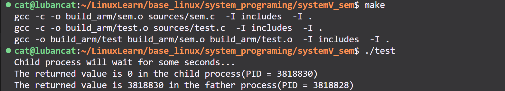

### 33. 共享内存

#### 33.1 共享内存的基本概念

什么是共享内存？顾名思义，共享内存就是将内存进行共享，它允许多个不相关的进程访问同一个逻辑内存，直接将一块裸露的内存放在需要数据传输的进程面前，让它们自己使用。因此，==共享内存是效率最高的一种 IPC 通信机制，它可以在多个进程之间共享和传递数据==，进程间需要共享的数据被放在共享内存区域，所有需要访问该共享区域的进程都要把该共享区域映射到本进程的地址空间中去，因此所有进程都可以访问共享内存中的地址，就好像它们是由用 C 语言函数 `malloc` 分配的内存一样。

但是，这种共享的内存需要进程自己去维护好，如同步、互斥等工作，比如当进程 1 在读取共享内存的数据时，进程 2 却修改了共享内存中的数据，那么必然会造成数据的混乱，进程 1 读取到的数据就是错误的，因此，==共享内存是属于临界资源==，在某一时刻最多只能有一个进程对其操作（读/写数据），==共享内存一般不能单独使用，而要配合信号量、互斥锁等协调机制==，让各个进程在高效交换数据的同时，不会发生数据践踏、破坏等意外。

共享内存的思想非常简单，进程与进程之间虚拟内存空间本来相互独立，不能互相访问的，但是可以通过某些方式，使得相同的一块物理内存多次映射到不同的进程虚拟空间之中，这样的效果就相当于多个进程的虚拟内存空间部分重叠在一起，如下图所示：

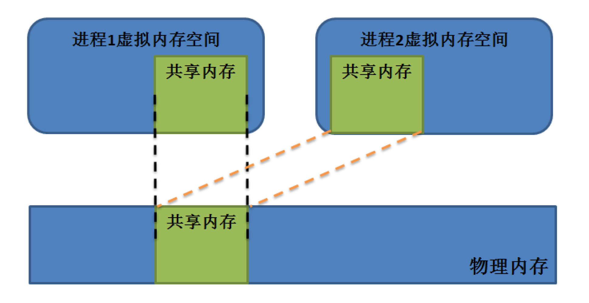


当进程 1 向共享内存写入数据后，共享内存的数据就变化了，那么进程 2 就能立即读取到变化了的数据，而这中间并未经过内核的拷贝，因此效率极高。

**总的来说共享内存有以下特点：**

1. 共享内存是==进程间通信中效率最高的方式之一==。
2. 共享内存是系统出于多个进程之间通讯的考虑，而预留的的一块内存区，因此==共享内存是以传输数据为目的的==。
3. 共享内存==允许两个或更多进程访问同一块内存==，当一个进程改变了这块地址中的内容的时候，其它进程都会察觉到这个更改。
4. 共享内存无同步无互斥。

**共享内存的优缺点：**

- <u>优点</u>：使用共享内存进行进程间的通信非常方便，而且函数的接口也简单，数据的共享使进程间的数据不用传送，而是直接访问内存，加快了程序的效率。同时，它也不像匿名管道那样要求通信的进程有一定的 “血缘” 关系，只要是系统中的任意进程都可以对共享内存进行读写操作。
- <u>缺点</u>：共享内存没有提供同步的机制，这使得我们在使用共享内存进行进程间通信时，往往要借助其他的手段（如信号量、互斥量等）来进行进程间的同步工作。

#### 33.2 shmget() 创建共享内存函数

内核提供了 `shmget()` 函数的创建或获取一个共享内存对象，并返回共享内存标识符。函数原型如下：

```c
int shmget(key_t key, size_t size, int shmflg);
```

参数说明：

- `key`：标识共享内存的键值，可以有以下取值：
    - 0 或 *IPC_PRIVATE*。当 `key` 的取值为 *IPC_PRIVATE*，则函数 `shmget()` 创建一块新的共享内存；如果 `key` 的取值为 0，而参数 `shmflg` 中设置了 *IPC_PRIVATE* 这个标志，则同样将创建一块新的共享内存。
    - 大于 0 的 32 位整数：视参数 `shmflg` 来确定操作。
- `size`：要创建共享内存的大小，所有的内存分配操作都是以页为单位的，所以即使只申请只有一个字节的内存，内存也会分配整整一页。
- `shmflg`：表示创建的共享内存的模式标志参数，在真正使用时需要与 IPC 对象存取权限 `mode`（如 0600）进行 `｜` 运算来确定共享内存的存取权限。`msgflg` 有多种情况：
    - *IPC_CREAT*：如果内核中不存在关键字与 `key` 相等的共享内存，则新建一个共享内存；如果存在这样的共享内存，返回此共享内存的标识符。
    - *IPC_EXCL*：如果内核中不存在键值与 `key` 相等的共享内存，则新建一个共享内存；如果存在这样的共享内存则报错。
    - *SHM_HUGETLB*：使用 “大页面” 来分配共享内存，所谓的 “大页面” 指的是内核为了提高程序性能，对内存实行分页管理时，采用比默认尺寸（4KB）更大的分页，以减少缺页中断。Linux 内核支持以 2MB 作为物理页面分页的基本单位。
    - *SHM_NORESERVE*：不在交换分区中为这块共享内存保留空间。
- 返回值：`shmget()` 函数的返回值是共享内存的 ID。

当调用 `shmget()` 函数失败时将产生错误代码，有如下取值：

- *EACCES*：`key` 指定的共享内存已存在，但调用进程没有权限访问它
- *EEXIST*：`key` 指定的共享内存已存在，而 `msgflg` 中同时指定 *IPC_CREAT* 和 *IPC_EXCL* 标志
- *EINVAL*：创建共享内存时参数 `size` 小于 *SHMMIN* 或大于 *SHMMAX*。
- *ENFILE*：已达到系统范围内打开文件总数的限制。
- *ENOENT*：给定的 `key` 不存在任何共享内存，并且未指定 *IPC_CREAT*。
- *ENOMEM*：内存不足，无法为共享内存分配内存。

#### 33.3 shmat() 映射函数

从共享内存的基本概念不难看出，如果一个进程想要访问一个共享内存，那么需要将其映射到进程的虚拟空间中，然后再去访问它，那么系统提供的 `shmat()` 函数就是把共享内存区对象映射到调用进程的地址空间。函数原型如下：

```c
void *shmat(int shmid, const void *shmaddr, int shmflg);
```

参数说明：

- `shmid`：共享内存 ID，通常是由 `shmget()` 函数返回的。
- `shmaddr`：如果不为 NULL，则系统会根据 `shmaddr` 来选择一个合适的内存区域，如果为 NULL，则系统会自动选择一个合适的虚拟内存空间地址去映射共享内存。
- `shmflg`：操作共享内存的方式：
    - *SHM_RDONLY*：以只读方式映射共享内存。
    - *SHM_REMAP*：重新映射，此时 `shmaddr` 不能为 NULL。
    - *NULLSHM*：自动选择比 `shmaddr` 小的最大页对齐地址。

`shmat()` 函数调用成功后返回共享内存的起始地址，这样子我们就能操作这个共享内存了。共享内存的映射有以下注意的要点：

- 共享内存只能以只读或者可读写方式映射，无法以只写方式映射。
- `shmat()` 第二个参数 `shmaddr` 一般都设为 NULL，让系统自动找寻合适的地址。但当其确实不为空时，那么要求*SHM_RND* 在 `shmflg` 必须被设置，这样的话系统将会选择比 `shmaddr`小而又最大的页对齐地址（即为 *SHMLBA* 的整数倍）作为共享内存区域的起始地址。如果没有设置 *SHM_RND*，那么 `shmaddr` 必须是严格的页对齐地址。

#### 33.4 shmdt() 解除映射函数

`shmdt()` 函数与 `shmat()` 函数相反，是用来解除进程与共享内存之间的映射的，在解除映射后，该进程不能再访问这个共享内存。函数原型：

```c
int shmdt(const void *shmaddr);
```

参数说明：

- `shmaddr`：映射的共享内存的起始地址。

`shmdt()` 函数调用成功返回 0，如果出错则返回 -1，并且将错误原因存于 `errno` 中。

虽然 `shmdt()` 函数很简单，但是还是有注意要点的：该函数并不删除所指定的共享内存区，而只是将先前用 `shmat()` 函数映射好的共享内存脱离当前进程，共享内存还是存在于物理内存中。

#### 33.5 shmctl() 获取或设置属性函数

内核提供了 `shmctl()` 用于获取或者设置共享内存的相关属性。函数原型：

```c
int shmctl(int shmid, int cmd, struct shmid_ds *buf);
```

参数说明：

- `shmid`：共享内存标识符。

- `cmd`：函数功能的控制命令，其取值如下：

    - IPC_STAT：获取属性信息，放置到 `buf` 中。

    - IPC_SET：设置属性信息为 `buf` 指向的内容。

    - IPC_RMID：删除该共享内存。

    - IPC_INFO：获得关于共享内存的系统限制值信息。

    - SHM_INFO：获得系统为共享内存消耗的资源信息。

    - SHM_STAT：与 IPC_STAT 具有相同的功能，但 `shmid` 为该 SHM 在内核中记录所有 SHM 信息的数组的下标，因此通过迭代所有的下标可以获得系统中所有 SHM 的相关信息。

    - SHM_LOCK：禁止系统将该 SHM 交换至 `swap` 分区。

        > [!caution]
        >
        > 选项 SHM_LOCK 不是锁定读写权限，而是锁定 SHM 能否与 `swap` 分区发生交换。一个 SHM 被交换至 `swap` 分区后如果被设置了 SHM_LOCK，那么任何访问这个 SHM 的进程都将会遇到页错误。进程可以通过 IPC_STAT 后得到的 `mode` 来检测 SHM_LOCKED 信息。

    - SHM_UNLOCK：允许系统将该 SHM 交换至 `swap` 分。

- `buf`：共享内存属性信息结构体指针，设置或者获取信息都通过该结构体，`shmid_ds` 结构如下：

    ```c
    struct shmid_ds {
    	struct ipc_perm shm_perm; /* 所有权和权限*/
    	size_t shm_segsz;         /* 共享内存尺寸（字节） */
    	time_t shm_atime;         /* 最后一次映射时间*/
    	time_t shm_dtime;         /* 最后一个解除映射时间*/
    	time_t shm_ctime;         /* 最后一次状态修改时间*/
    	pid_t shm_cpid;           /* 创建者PID */
    	pid_t shm_lpid;           /* 后一次映射或解除映射者PID */
    	shmatt_t shm_nattch;      /* 映射该SHM 的进程个数*/
    	...
    };
    ```

    其中权限信息结构体如下：

    ```c
    struct ipc_perm {
    	key_t __key;           /* 该共享内存的键值key */
    	uid_t uid;             /* 所有者的有效UID */
    	gid_t gid;             /* 所有者的有效GID */
    	uid_t cuid;            /* 创建者的有效UID */
    	gid_t cgid;            /* 创建者的有效GID */
    	unsigned short mode;   /* 读写权限+ SHM_DEST + SHM_LOCKED 标记*/
        unsigned short __seq;  /* 序列号*/
    };
    ```

#### 33.6 使用示例

使用共享内存的一般步骤是：

1. 创建或获取共享内存 ID。
2. 将共享内存映射至本进程虚拟内存空间的某个区域。
3. 当不再使用时，解除映射关系。
4. 当没有进程再需要这块共享内存时，删除它。

共享内存由于其特性，与进程中的其他内存段在使用习惯上有些不同。一般进程对栈空间分配可以自动回收，而堆空间通过`malloc` 申请，`free` 回收，这些内存在回收之后就可以认为是不存在了。但是共享内存不同，用 `shmdt()` 函数解除映射后，实际上其占用的内存还在，并仍然可以使用 `shmat` 映射使用。如果不使用 `shmctl()` 函数删除这个共享内存的话，那么它将一直保留直到系统被关闭，除此之外，我们应该配合信号量去使用共享内存，避免多进程间的随意使用造成数据踩踏。

整个实验的思路是：首先创建 system V 信号量用于控制临界区，然后实现两个进程，分别为共享内存写进程，共享内存读进程，在写进程中实现写数据，在读进程中将数据读取，并且打印出来，代码如下：

##### 33.6.1 共享内存写进程

```c
// path: base_linux/system_programing/shm_write/sources/shm_write.c
#include <sys/types.h>
#include <sys/shm.h>
#include <sys/ipc.h>
#include <unistd.h>
#include <stdlib.h>
#include <stdio.h>
#include <string.h>
#include <sys/stat.h>
#include <fcntl.h>
#include <errno.h>

#include "sem.h"

int main(void)
{
    int running = 1;
    void *shm = NULL;
    struct shared_use_st *shared = NULL;
    char buffer[BUFSIZ + 1]; // 保存输入的文字
    int shmid;
    int semid; // 信号量标识符

    // 创建共享内存
    shmid = shmget((key_t)1234, 4096, 0644 | IPC_CREAT);
    if (shmid == -1)
    {
        fprintf(stderr, "shmget failed\n");
        exit(EXIT_FAILURE);
    }

    // 将共享内存连接到当前进程的地址空间
    shm = shmat(shmid, (void *)0, 0);
    if (shm == (void *)-1)
    {
        fprintf(stderr, "shmat failed\n");
        exit(EXIT_FAILURE);
    }
    printf("Memory attached at %p\n", shm);

    /* 打开信号量，不存在则创建 */
    semid = semget((key_t)6666, 1, 0666 | IPC_CREAT);
    if (semid == -1)
    {
        printf("sem open fail\n");
        exit(EXIT_FAILURE);
    }

    // 向共享内存中写数据
    while (running)
    {
        printf("Enter some text:");
        fgets(buffer, BUFSIZ, stdin);
        strncpy(shm, buffer, 4096);

        /* 释放信号量 */
        sem_v(semid);

        /* 输入了 end，退出循环 /程序*/
        if(strncmp(buffer, "end", 3) == 0)
            running = 0;
    }

    // 把共享内存从当前进程中分离
    if (shmdt(shm) == -1)
    {
        fprintf(stderr, "shmdt failed\n");
        exit(EXIT_FAILURE);
    }

    sleep(2);
    exit(EXIT_SUCCESS);
}
```

> [!NOTE]
>
> 第 13 行的 `sem.h` 源自 [32.5 信号量示例](#32.5 信号量示例)

代码说明如下：

- 第 25 行调用 `shmget()` 创建或获取一个大小为4096 的共享内存。
- 第 33 行，调用 `shmat()` 函数映射共享内存到当前进程，地址保存到 `shm` 指针。
- 第 54 行，使用 `strncpy` 函数把用户输入得到的字符拷贝至共享内存 `shm` 中。

代码中写入到共享内存后，通过释放信号量操作告知其它进程有可获取的资源，这是常用的共享内存临界段保护方法。

Makefile 文件：

```makefile
# path: base_linux/system_programing/shm_read/Makefile
TARGET = shm_write

ARCH ?= arm

BUILD_DIR = build_$(ARCH)

SRC_DIR = sources

INC_DIR = includes .

SRCS = $(wildcard $(SRC_DIR)/*.c)

OBJS = $(patsubst %.c, $(BUILD_DIR)/%.o, $(notdir $(SRCS)))

DEPS = $(wildcard $(INC_DIR)/*.h)

CFLAGS = $(patsubst %, -I %, $(INC_DIR))

ifeq ($(ARCH), arm)
CC = gcc
else
CC = aarch64-linux-gnu-gcc
endif

$(BUILD_DIR)/$(TARGET): $(OBJS)
	$(CC) -o $@ $^ $(CFLAGS)
	@cp $(BUILD_DIR)/$(TARGET) .

$(BUILD_DIR)/%.o: $(SRC_DIR)/%.c $(DEPS)
	@mkdir -p $(BUILD_DIR)
	$(CC) -c -o $@ $< $(CFLAGS)

.PHONY: clean cleanall

clean:
	rm -rf $(BUILD_DIR)
	rm -f $(TARGET)

cleanall:
	rm -rf build_*
	rm -f $(TARGET)
```

##### 33.6.2 共享内存读进程

```c
// path: base_linux/system_programing/shm_read/sources/shm_read.c
#include <sys/types.h>
#include <sys/shm.h>
#include <sys/sem.h>
#include <sys/ipc.h>
#include <unistd.h>
#include <stdlib.h>
#include <stdio.h>
#include <string.h>
#include <sys/stat.h>
#include <fcntl.h>
#include <errno.h>

#include "sem.h"

int main(void)
{
    int running = 1;
    char *shm = NULL;
    int shmid; // 共享内存标识符
    int semid; // 信号量标识符

    // 创建共享内存
    shmid = shmget((key_t)1234, 4096, 0666 | IPC_CREAT);
    if (shmid == -1)
    {
        fprintf(stderr, "shmget failed\n");
        exit(EXIT_FAILURE);
    }

    // 将共享内存连接到当前进程的地址空间
    shm = shmat(shmid, 0, 0);
    if (shm == (void *)-1)
    {
        fprintf(stderr, "shmat failed\n");
        exit(EXIT_FAILURE);
    }

    printf("\nMemory attached at %p\n", shm);

    /* 打开信号量，不存在则创建 */
    semid = semget((key_t)6666, 1, 0666 | IPC_CREAT);
    if (semid == -1)
    {
        printf("sem open fail\n");
        exit(EXIT_FAILURE);
    }

    init_sem(semid, 0);

    while (running)
    {
        /* 等待信号量 */
        if (sem_p(semid) == 0)
        {
            printf("You wrote: %s", shm);
            sleep(rand() % 3);

            // 输入了 end， 退出循环/程序
            if (strncmp(shm, "end", 3) == 0)
                running = 0;
        }
    }

    // 删除信号量
    del_sem(semid);

    // 把共享内存从当前进程中分离
    if (shmdt(shm) == -1)
    {
        fprintf(stderr, "shmctl(IPC_RMID) failed\n");
        exit(EXIT_FAILURE);
    }

    exit(EXIT_SUCCESS);
}
```

> [!note]
>
> 第 14 行的 `sem.h` 源自 [32.5 信号量示例](#32.5 信号量示例)

代码说明如下：

- 第 24 行，调用 `shmget()` 创建或获取一个大小为 4096 的共享内存。
- 第 32 行，调用 `shmat()` 函数映射共享内存到当前进程，地址保存到 `shm` 指针。
- 第 54~61 行，使用 `sem_p` 等待信号量，获取到信号量后，直接使用 `printf` 函数打印出共享内存 `shm` 的内容。

Makefile 文件：

```makefile
# path: base_linux/system_programing/shm_read/Makefile
TARGET = shm_read

ARCH ?= arm

BUILD_DIR = build_$(ARCH)

SRC_DIR = sources

INC_DIR = includes .

SRCS = $(wildcard $(SRC_DIR)/*.c)

OBJS = $(patsubst %.c, $(BUILD_DIR)/%.o, $(notdir $(SRCS)))

DEPS = $(wildcard $(INC_DIR)/*.h)

CFLAGS = $(patsubst %, -I %, $(INC_DIR))

ifeq ($(ARCH), arm)
CC = gcc
else
CC = aarch64-linux-gnu-gcc
endif

$(BUILD_DIR)/$(TARGET): $(OBJS)
	$(CC) -o $@ $^ $(CFLAGS)
	@cp $(BUILD_DIR)/$(TARGET) .

$(BUILD_DIR)/%.o: $(SRC_DIR)/%.c $(DEPS)
	@mkdir -p $(BUILD_DIR)
	$(CC) -c -o $@ $< $(CFLAGS)

.PHONY: clean cleanall

clean:
	rm -rf $(BUILD_DIR)
	rm -f $(TARGET)

cleanall:
	rm -rf build_*
	rm -f $(TARGET)
```

##### 33.6.3 编译&运行

打开两个终端，分别在 `shm_write` 和 `shm_read` 目录下使用 `make` 进行编译后运行进程。

```bash
# terminal 1
make
./shm_write
```

```bash
# terminal 2
make
./shm_read
```

结果如下：


### 34. 线程

#### 34.1 线程和进程

在很多 Linux 的书籍基本上都是这样子描述进程（process）和线程（thread）的：==进程是资源管理的最小单位==，==线程是程序执行的最小单位==。

这个描述非常言简意赅，在操作系统设计上，从进程演化出线程。<u>==线程的出现最主要的目的就是减小进程上下文切换开销==，这又是怎么一回事呢？</u>在前面的文章已经提到，进程是资源管理的最小单位，那么每个进程都拥有自己的数据段、代码段和堆栈段，这必然就造成了进程间切换时都要进行比较复杂的上下文切换等动作，因为要保存当前进程上下文的内容，还要恢复另一个进程的上下文。如果是经常切换进程的话，这样子的开销就过于庞大。因为在进程切换上下文时，需要重新映射虚拟地址空间、进出 OS 内核、寄存器切换，还会干扰处理器的缓存机制。因此为了进一步减少 CPU 在进程切换时的额外开销，Linux 进程演化出了另一个概念——线程。

==线程是操作系统能够调度和执行的基本单位，在 Linux 中也被称之为轻量级进程==。在 Linux 系统中，==一个进程至少需要一个线程作为它的指令执行体==，进程管理着资源（比如 cpu、内存、文件等等），而将线程分配到某个 cpu 上执行。一个进程可以拥有多个线程，它还可以同时使用多个、cpu 来执行各个线程，以达到最大程度的并行，提高工作的效率；同时，即使是在单 cpu 的机器上，也依然可以采用多线程模型来设计程序，使设计更简洁、功能更完备，程序的执行效率也更高。

从上面的这些概念我们不难得出一个非常重要的结论：

**线程的本质是一个进程内部的一个控制序列，它是进程里面的东西，一个进程可以拥有一个线程或者多个线程。**它们的关系就如图所示：

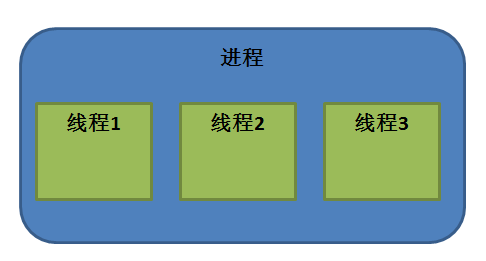

回顾一下进程相关的知识：当进程执行 `fork()` 函数创建一个进程时，将创建出该进程的一个副本。这个新进程拥有自己的变量和自己的 PID，它的执行几乎完全独立于父进程，这样子得到一个新的进程开销是非常大的。而==当在进程中创建一个新线程时，新的执行线程将拥有自己的栈，但与它的创建者共享全局变量、文件描述符、信号处理函数和当前目录状态。==也就是说，它只使用当前进程的资源，而不是产生当前进程的副本。

Linux 系统中的==每个进程都有独立的地址空间==，一个进程崩溃后，在系统的保护模式下并不会对系统中其它进程产生影响，而线程只是一个进程内部的一个控制序列，当进程崩溃后，线程也随之崩溃，所以==一个多进程的程序要比多线程的程序健壮，但在进程切换时，耗费资源较大，效率要差一些。==这就使得在某些场合下对于一些==要求同时进行并且又要共享某些变量的并发操作，只能用线程，不能用进程==。

总的来说：

- 一个程序至少有一个进程， 一个进程至少有一个线程。
- 线程使用的资源是进程的资源，进程崩溃线程也随之崩溃。
- 线程的上下文切换，要比进程更加快速，因为本质上，线程很多资源都是共享进程的，所以切换时，需要保存和切换的项相对较少。

#### 34.2 创建线程

在讲解线程编程之前，需要先了解一个知识点：<u>可移植操作系统接口（Portable Operating System Interface，缩写为POSIX）</u>，POSIX 是 IEEE 为了在各种 UNIX 操作系统上运行软件而定义 API 接口等一系列互相关联的标准的总称，其正式称呼为 IEEEStd 1003，而国际标准名称为 ISO/IEC9945，此标准源于一个大约开始于1985 年的项目。POSIX 这个名称是由理查德·斯托曼（RMS）应 IEEE 的要求而提议的一个易于记忆的名称。它基本上是 Portable Operating System Interface（可移植操
作系统接口）的缩写，而 X 则表明其对 Unix API 的传承。

简单来说，如果应用程序使用 POSIX 标准的接口来调用系统函数，那么应用程序将非常容易移植甚至直接兼容到遵循 POSIX 标准的系统上。

在 Linux 系统下的多线程遵循 POSIX 标准，而其中的一套常用的线程库是 pthread，它是一套通用的线程库，是由 POSIX 提出的，因此具有很好的可移植性，我们学习的 Linux 多线程编程也正是使用它，在使用时必须包含以下头文件：

```c
#include <pthread.h>
```

除此之外在链接时需要使用库 `libpthread.a`。因为 pthread 的库不是 Linux 系统的库，所以在编译时要加上 `-lpthread` 选项。

##### 34.2.1 pthread_create() 创建线程

`pthread_create()` 函数是用于创建一个线程的，创建线程实际上就是确定调用该线程函数的入口点，在线程创建后，就开始运行相关的线程函数。函数原型如下：

```c
int pthread_create(pthread_t *thread, 
                   const pthread_attr_t *attr,
                   void *(*start_routine)(void *), void *arg);
```

参数说明：

- `thread`：指向线程标识符的指针。
- `attr`：设置线程属性，具体内容在下一小节。
- `start_routine`：`start_routine` 是一个函数指针，指向要运行的线程入口，即线程运行时要执行的函数代码。
- `arg`：运行线程时传入的参数。
- 返回值：若线程创建成功，则返回0。若线程创建失败，则返回对应的错误代码。

#### 34.3 线程属性

上面 `pthread_create` 中需要以线程属性作为输入参数，在 Linux 中线程属性结构如下:

```c
typedef struct
{
	int etachstate;    				//线程的分离状态
	int schedpolicy;   				//线程调度策略
	structsched_param schedparam; 	 //线程的调度参数
	int inheritsched;			    //线程的继承性
	int scope; 					    //线程的作用域
	size_t guardsize; 				//线程栈末尾的警戒缓冲区大小
	int stackaddr_set; 				//线程的栈设置
	void* stackaddr; 				//线程栈的位置
	size_t stacksize; 				//线程栈的大小
}pthread_attr_t;
```

> [!caution]
>
> 因为 pthread 并非Linux 系统的默认库，而是 POSIX 线程库。如果需要在 Linux 中将其作为一个库来使用，编译时需要加上 `-lpthread`（或 `-pthread`）以显式指定链接该库。函数在执行错误时的错误信息将作为返回值返回，并不修改系统全局变量 `errno`，所以无法使用 `perror()` 打印错误信息。

线程的属性非常多，而且其属性值不能直接设置，须使用相关函数进行操作。线程属性主要包括如下属性：作用域（scope）、栈大小（stacksize）、栈地址（stackaddress）、优先级（priority）、分离的状态（detachedstate）、调度策略和参数（scheduling policy and parameters）。默认的属性为非绑定、非分离、1M 的堆栈大小、与父进程同样级别的优先级。下面简单讲解一下与线程属性相关的 API 接口：

| API                              | 描述                                 |
| :------------------------------- | ------------------------------------ |
| `pthread_attr_init()`            | 初始化一个线程对象的属性             |
| `pthread_attr_destroy()`         | 销毁一个线程属性对象                 |
| `pthread_attr_getaffinity_np()`  | 获取线程间的 CPU 亲缘性              |
| `pthread_attr_setaffinity_np()`  | 设置线程的 CPU 亲缘性                |
| `pthread_attr_getdetachstate()`  | 获取线程分离状态属性                 |
| `pthread_attr_setdetachstate()`  | 修改线程分离状态属性                 |
| `pthread_attr_getguardsize()`    | 获取线程的栈保护区大小               |
| `pthread_attr_setguardsize()`    | 设置线程的栈保护区大小               |
| `pthread_attr_getscope()`        | 获取线程的作用域                     |
| `pthread_attr_setscope()`        | 设置线程的作用域                     |
| `pthread_attr_getstack()`        | 获取线程的堆栈信息（栈地址和栈大小） |
| `pthread_attr_setstack()`        | 设置线程堆栈区                       |
| `pthread_attr_getstacksize()`    | 获取线程堆栈大小                     |
| `pthread_attr_setstacksize()`    | 设置线程堆栈大小                     |
| `pthread_attr_getschedpolicy()`  | 获取线程的调度策略                   |
| `pthread_attr_setschedpolicy()`  | 设置线程的调度策略                   |
| `pthread_attr_getschedparam()`   | 获取线程的调度优先级                 |
| `pthread_attr_setschedparam()`   | 设置线程的调度优先级                 |
| `pthread_attr_getinheritsched()` | 获取线程是否继承调度属性             |
| `pthread_attr_setinheritsched()` | 设置线程是否继承调度属性             |

无其他特别需求，是可以不需要考虑线程相关属性的，使用默认的属性即可。

##### 34.3.1 初始化线程对象属性

使用 `pthread_attr_init()` 函数可以初始化线程对象的属性，函数原型：

```c
int pthread_attr_init(pthread_attr_t *attr);
```

- `attr`：指向一个线程属性的指针
- 返回值：若函数调用成功返回 0，否则返回对应的错误代码。

##### 34.3.2 销毁一个线程属性对象

`pthread_attr_destroy()` 函数用于销毁一个线程属性对象。若 `pthread_create()` 函数使用已经销毁的线程属性对象创建线程，则会返回错误。

`pthread_attr_destroy()` 函数原型：

```c
int pthread_attr_destroy(pthread_attr_t *attr);
```

- `attr`：指向一个线程属性的指针
- 返回值：若函数调用成功返回 0，否则返回对应的错误代码。

##### 34.3.3 线程的分离状态

线程属性值中有一个分离状态，<u>什么是线程的分离状态呢？</u>在任何一个时间点上，线程是可结合的（joinable），或者是分离的（detached）。一个可结合的线程能够被其他线程收回其资源和杀死；在被其他线程回收之前，它的存储器资源（如栈）是不释放的。相反，一个分离的线程是不能被其他线程回收或杀死的，它的存储器资源在它终止时由系统自动释放。

总而言之：==线程的分离状态决定一个线程以什么样的方式来终结自己==。

进程中的线程可以调用 `pthread_join()` 函数来等待某个线程的终止，获取该线程的终止状态，并收回线程所占的资源，如果对线程的返回状态不感兴趣，可以将 `rval_ptr` 设置为 NULL。

```c
int pthread_join(pthread_t tid, void **rval_ptr);
```

除此之外线程也可以调用 `pthread_detach()` 函数将此线程设置为分离状态，设置为分离状态的线程在线程结束时，操作系统会自动收回它所占的资源。设置为分离状态的线程，不能再调用 `pthread_join()` 等待其结束。

```c
int pthread_detach(pthread_t tid);
```

如果一个线程是可结合的，意味着这条线程在退出时不会自动释放自身资源，而会成为僵尸线程，同时意味着该线程的退出值可以被其他线程获取。因此，如果不需要某个线程的退出值的话，那么最好将线程设置为分离状态，以保证该线程不会成为僵尸线程。

如果在创建线程时就知道不需要了解线程的终止状态，那么可以通过修改 `pthread_attr_t` 结构体中的 `detachstate` 属性，来让线程以分离状态启动，调用的 `pthread_attr_setdetachstate()` 函数原型如下：

```c
int pthread_attr_setdetachstate(pthread_attr_t *attr, int detachstate);
```

如果想要获取某个线程的分离状态，那么可以通过 `pthread_attr_getdetachstate()` 函数获取：

```c
int pthread_attr_getdetachstate(const pthread_attr_t *attr, int *detachstate);
```

若函数调用成功返回 0，否则返回对应的错误代码。

参数说明：

- `attr`：指向一个线程属性的指针。
- `detachstate`：如果值为*PTHREAD_CREATE_DETACHED*，则表示线程是分离状态，如果值为*PTHREAD_CREATE_JOINABLE* 则表示线程是结合状态。

##### 34.3.4 线程的调度策略

线程属性里包含了调度策略配置，POSIX 标准指定了三种调度策略：

- 分时调度策略：*SCHED_OTHER*。这是线程属性的默认值，另外两种调度方式只能用于以超级用户权限运行的进程，因为它们都具备实时调度的功能，但在行为上略有区别。
- 实时调度策略：先进先出方式调度(*SCHED_FIFO*)。基于队列的调度程序，对于每个优先级都会使用不同的队列，先进入队列的线程能优先得到运行，线程会一直占用 CPU，直到有更高优先级任务到达或自己主动放弃 CPU 使用权。
- 实时调度策略：时间片轮转方式调度(*SCHED_RR*)。与 FIFO 相似，不同的是前者的每个线程都有一个执行时间配额，当采用 *SHCED_RR* 策略的线程的时间片用完，系统将重新分配时间片，并将该线程置于就绪队列尾，并且切换线程，放在队列尾保证了所有具有相同优先级的 RR 线程的调度公平。

与调度相关的 API 接口如下：

```c
int pthread_attr_setinheritsched(pthread_attr_t *attr, int inheritsched);
int pthread_attr_getinheritsched(const pthread_attr_t *attr, int *inheritsched);
int pthread_attr_setschedpolicy(pthread_attr_t *attr, int policy);
int pthread_attr_getschedpolicy(const pthread_attr_t *attr, int *policy);
```

若函数调用成功返回 0，否则返回对应的错误代码。

参数说明：

- `attr`：指向一个线程属性的指针。
- `inheritsched`：线程是否继承调度属性，可选值为
    - *PTHREAD_INHERIT_SCHED*：调度属性将继承于创建的线程，`attr` 中设置的调度属性将被忽略。
    - *PTHREAD_EXPLICIT_SCHED*：调度属性将被设置为 `attr` 中指定的属性值。
- `policy`：可选值为线程的三种调度策略，*SCHED_OTHER*、*SCHED_FIFO*、*SCHED_RR*。

##### 34.3.5 线程的优先级

顾名思义，线程优先级就是这个线程得到运行的优先顺序，在 Linux 系统中，==优先级数值越小，线程优先级越高==。Linux 会根据线程的优先级对线程进行调度，遵循线程属性中指定的调度策略。

获取、设置线程静态优先级（staticpriority）可以使用以下函数，注意，是静态优先级，当线程的调度策略为 *SCHED_OTHER* 时，其静态优先级必须设置为 0。该调度策略是 Linux 系统调度的默认策略，处于 0 优先级别的这些线程会按照动态优先级被调度，之所以被称为 “动态”，是因为它会随着线程的运行，根据线程的表现而发生改变，而动态优先级起始于线程的 `nice` 值，且每当一个线程已处于就绪态但被调度器调度无视时，其动态优先级会自动增加一个单位，这样能保证这些线程竞争 CPU 的公平性。

线程的静态优先级之所以被称为 “静态”，是因为只要你不强行使用相关函数修改它，它是不会随着线程的执行而发生改变，静态优先级决定了实时线程的基本调度次序，它们是在实时调度策略中使用的。

```c
int pthread_attr_setschedparam(pthread_attr_t *attr, const struct sched_param *param);
int pthread_attr_getschedparam(const pthread_attr_t *attr, struct sched_param *param);
```

参数说明：

- `attr`：指向一个线程属性的指针。
- `param`：静态优先级数值。

线程优先级有以下特点：

- 新线程的优先级为默认为 0。
- 新线程不继承父线程调度优先级(*PTHREAD_EXPLICIT_SCHED*)
- 当线程的调度策略为 *SCHED_OTHER* 时，不允许修改线程优先级，仅当调度策略为实时（即*SCHED_RR* 或*SCHED_FIFO*）时才有效，并可以在运行时通过 `pthread_setschedparam()` 函数来改变，默认为 0。

##### 34.3.6 线程栈

线程栈是非常重要的资源，它可以存放函数形参、局部变量、线程切换现场寄存器等数据，在前文我们也说过了，线程使用的是进程的内存空间，那么一个进程有 n 个线程，默认的线程栈大小是 1 M，那么就有可能导致进程的内存空间是不够的，因此在有多线程的情况下，我们可以适当减小某些线程栈的大小，防止进程的内存空间不足。而某些线程可能需要完成很大量的工作，或者线程调用的函数会分配很大的局部变量，亦或是函数调用层次很深时，需要的栈空间可能会很大，那么也可以增大线程栈的大小。

设置、获取线程栈大小可以使用以下函数：

```c
int pthread_attr_setstacksize(pthread_attr_t *attr, size_t stacksize);
int pthread_attr_getstacksize(const pthread_attr_t *attr, size_t *stacksize);
```

参数说明：

- `attr`：指向一个线程属性的指针。
- `stacksize`：线程栈的大小。

#### 34.4 线程退出

在线程创建后，系统就开始运行相关的线程函数，在该函数运行完之后，该线程也就退出了，这是线程的一种隐式退出的方法，这与进程的退出差不多，进程完成工作后就会退出。而另一种退出线程的方法是使用 `pthread_exit()` 函数，让线程显式退出，这是线程的主动行为。

> [!caution]
>
> 在使用线程函数时，不能随意使用 `exit()` 退出函数来进行出错处理，这是因为`exit()` 函数的作用是使调用进程终止，而一个进程往往包含多个线程，因此，在使用 `exit()` 之后，该进程中的所有线程都会被退出，因此在线程中只能调用线程退出函数 `pthread_exit()` 而不是调用进程退出函数 `exit()`。

函数原型：

```c
void pthread_exit(void *retval);
```

参数说明：

- `retval`：如果 `retval` 不为空，则会将线程的退出值保存到 `retval` 中，如果不关心线程的退出值，形参为 NULL 即可。

一般情况下，进程中各个线程的运行是相互独立的，线程的终止并不会相互通知，也不会影响其他的线程，<u>终止的线程所占用的资源不会随着线程的终止而归还系统，而是仍为线程所在的进程持有，这是因为一个进程中的多个线程是共享数据段的。</u>从前面的文章我们知道进程之间可以使用 `wait()` 系统调用来等待其他进程结束一样，线程也有类似的函数：

```c
int pthread_join(pthread_t tid, void **rval_ptr)；
```

如果某个线程想要等待另一个线程退出，并且获取它的退出值，那么就可以使用 `pthread_join()` 函数完成，以阻塞的方式等待 thread 指定的线程结束，当函数返回时，被等待线程的资源将被收回，如果进程已经结束，那么该函数会立即返回。并且 thread 指定的线程必须是可结合状态的，该函数执行成功返回 0，否则返回对应的错误代码。

参数说明：

- `thread`: 线程标识符，即线程 ID，标识唯一线程。
- `retval`: 用户定义的指针，用来存储被等待线程的返回值。

需要注意的是一个可结合状态的线程所占用的内存仅当有线程对其执行了 `pthread_join()` 后才会释放，因此<u>为了避免内存泄漏，所有线程的终止时，要么已被设为 *DETACHED*，要么使用 `pthread_join()` 来回收资源。</u>

#### 34.5 线程实验

我们在日常使用的情况下，若非特别需要，几乎不需要修改线程的属性的，我们在此处做一个线程的实验，实验中创建一个进程，线程的属性是默认属性，在线程执行完毕后就退出，代码如下：

```c
// path: base_linux/system_programing/thread/sources/thread.c
#include <unistd.h>
#include <fcntl.h>
#include <stdio.h>
#include <stdlib.h>
#include <pthread.h>

// 要执行的线程
void *test_thread(void *arg)
{
    // sizeof(void *) == 8 and sizeof(int) == 4 (64 bits)
    int num = (unsigned long long)arg;

    printf("This is test thread, arg is %d\n", num);
    sleep(5);

    // 退出线程
    pthread_exit(NULL);
}

int main(void)
{
    pthread_t thread;
    void *thread_return;
    int arg = 520;
    int res;

    printf("start create thread\n");

    // 创建线程, 线程为 test_thread 函数
    res = pthread_create(&thread, NULL, test_thread, (void *)(unsigned long long)(arg));

    if (res != 0)
    {
        printf("create thread fail\n");
        exit(res);
    }

    printf("create threads success\n");
    printf("waiting for threads to finish...\n");

    // 等待线程终止
    res = pthread_join(thread, &thread_return);
    if (res != 0)
    {
        printf("thread exit fail\n");
        exit(res);
    }

    printf("thread exit ok\n");

    return 0;
}
```

代码的分析如下：

- 第 9~19 行，定义 `test_thread` 函数作为线程要执行的函数，函数内部的操作是打印传入的 `arg` 参数，然后睡眠一定的时间，最后调用 `thread_exit` 退出线程。
- 第 31 行，调用 `pthread_create` 函数创建线程，传入的线程函数指针为 `test_thread`，并且传入了一个函数参数 `arg（520）`，创建后线程将会开始执行 `test_thread` 的代码。
- 第 43 行，创建线程后调用 `pthread_join` 等待线程退出。

要注意的是，本示例中需要在 Makefile 中添加 `lpthread` 链接库的内容：
Makefile 文件：

```makefile
# base_linux/system_programing/thread/Makefile
TARGET = thread

ARCH ?= arm

BUILD_DIR = build_$(ARCH)

SRC_DIR = sources

INC_DIR = includes .

SRCS = $(wildcard $(SRC_DIR)/*.c)

OBJS = $(patsubst %.c, $(BUILD_DIR)/%.o, $(notdir $(SRCS)))

DEPS = $(wildcard $(INC_DIR)/*.h)

CFLAGS = $(patsubst %, -I %, $(INC_DIR))

LINK = -lpthread

ifeq ($(ARCH), arm)
CC = gcc
else
CC = aarch64-linux-gnu-gcc
endif

$(BUILD_DIR)/$(TARGET): $(OBJS)
	$(CC) -o $@ $^ $(CFLAGS) $(LINK)
	@cp $(BUILD_DIR)/$(TARGET) .

$(BUILD_DIR)/%.o: $(SRC_DIR)/%.c $(DEPS)
	@mkdir -p $(BUILD_DIR) 
	$(CC) -c -o $@ $< $(CFLAGS) $(LINK)

.PHONY: clean cleanall

clean:
	rm -rf $(BUILD_DIR)
	rm -f $(TARGET)

cleanall:
	rm -rf build_*
	rm -f $(TARGET)

```

编译 & 运行：

```bash
make
./thread
```

运行结果如下：

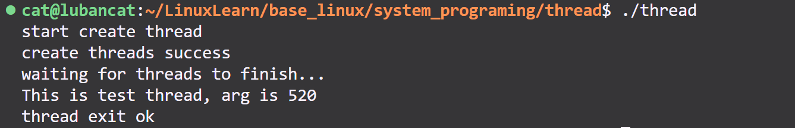

### 35. POSIX 信号量

本章节将讲述另一种进程/线程间通信的机制——POSIX 信号量，为了明确与 systemV 信号量间的区别，若非特别说明，本章出现的信号量均为 POSIX 信号量。也要注意请不要把它与之前所说的信号混淆了，信号与信号量是不同的两种机制。

#### 35.1 POSIX 信号量基本概念

信号量（Semaphore）是一种实现进程/线程间通信的机制，可以实现进程/线程之间同步或临界资源的互斥访问，常用于协助一组相互竞争的进程/线程来访问临界资源。在多进程/线程系统中，各进程/线程之间需要同步或互斥实现临界资源的保护，信号量功能可以为用户提供这方面的支持。

在 POSIX 标准中，信号量分两种，一种是无名信号量，一种是有名信号量。==无名信号量==一般用于==进程/线程==间同步或互斥，而==有名信号量==一般用于==进程==间同步或互斥。有名信号量和无名信号量的差异在于创建和销毁的形式上，但是其他工作一样，==无名==信号量则直接保存在==内存==中，而==有名信==号量则要求==创建一个文件==。

正如其名，无名信号量没有名字，它只能存在于内存中，这就要求使用信号量的进程/线程必须能访问无名信号量所在的这一块内存，所以无名信号量只能应用在同一进程内的线程之间同步或者互斥。相反，有名信号量可以通过名字访问，因此可以被任何知道它们名字的进程或者进程/线程使用。单个进程中使用 POSIX 信号量时，无名信号量更简单，多个进程间使用 POSIX 信号量时，有名信号量更简单。

在多进程/线程操作系统环境下，多个进程/线程会同时运行，并且一些进程/线程之间可能存在一定的关联。多个进程/线程可能为了完成同一个进程/线程会相互协作，这样形成进程/线程之间的同步关系，因此可以使用信号量进行同步。

而且在不同进程/线程之间，为了争夺有限的系统资源（硬件或软件资源）会进入竞争状态，这就是进程/线程之间的互斥关系。为了防止出现因多个程序同时访问一个共享资源而引发的一系列问题，我们需要一种方法，它可以通过生成并使用令牌来授权，在任一时刻只能有一个执行进程/线程访问代码的临界区域。

临界区域是指执行数据更新的代码需要独占式地执行。而信号量就可以提供这样的一种访问机制，让一个临界区同一时间只有一个进程/线程在访问它，因此信号量是可以用来调协进程/线程对共享资源的访问。进程/线程之间的互斥与同步关系存在的根源在于临界资源。临界资源是在同一个时刻只允许有限个（通常只有一个）进程/线程可以访问（读）或修改（写）的资源，通常包括硬件资源（处理器、内存、存储器以及其他外围设备等）和软件资源（共享代码段，共享结构和变量等）。

抽象的来讲，信号量中存在一个非负整数，所有获取它的进程/线程都会将该整数减一（获取它当然是为了使用资源），当该整数值为零时，所有试图获取它的进程/线程都将处于阻塞状态。通常一个信号量的计数值用于对应有效的资源数，表示剩下的可被占用的互斥资源数。其值的含义分两种情况：

- 0：表示没有可用的信号量，进程/线程进入睡眠状态，直至信号量值大于 0。
- 正值：表示有一个或多个可用的信号量，进程/线程可以使用该资源。进程/线程将信号量值减 1，表示它使用了一个资源单位。

对信号量的操作可以分为两个：

- `P` 操作：如果有可用的资源（信号量值大于 0），则占用一个资源（给信号量值减去一，进入临界区代码）; 如果没有可用的资源（信号量值等于 0），则被阻塞到，直到系统将资源分配给该进程/线程（进入等待队列，一直等到资源轮到该进程/线程）。这就像你要把车开进停车场之前，先要向保安申请一张停车卡一样，P 操作就是申请资源，如果申请成功，资源数（空闲的停车位）将会减少一个，如果申请失败，要不在门口等，要不就走人。
- `V` 操作：如果在该信号量的等待队列中有进程/线程在等待资源，则唤醒一个阻塞的进程/线程。如果没有进程/线程等待它，则释放一个资源（给信号量值加一），就跟你从停车场出去的时候一样，空闲的停车位就会增加一个。

举个例子，就是两个进程/线程共享信号量 `sem`，`sem` 可用信号量的数值为 1，一旦其中一个进程/线程执行了 P（sem）操作，它将得到信号量，并可以进入临界区，使 `sem` 减 1。而第二个进程/线程将被阻止进入临界区，因为当它试图执行 P（sem）操作时，`sem` 为 0，它会被挂起以等待第一个进程/线程离开临界区域并执行 V（sem）操作释放了信号量，这时第二个进程/线程就可以恢复执行。 

#### 35.2 POSIX 有名信号量

如果要在 Linux 中使用信号量同步，需要包含头文件 `semaphore.h` 。

有名信号量其实是一个文件，它的名字由类似 `sem.[信号量名字]` 这样的字符串组成，注意看文件名前面有 `sem.`，它是一个特殊的信号量文件，在创建成功之后，系统会将其放置在 `/dev/shm` 路径下，不同的进程间只要约定好一个相同的信号量文件名字，就可以访问到对应的有名信号量，并且借助信号量来进行同步或者互斥操作，需要注意的是，有名信号量是一个文件，在进程退出之后它们并不会自动消失，而需要手工删除并释放资源。

主要用到的函数：

```c
sem_t *sem_open(const char *name, int oflag, mode_t mode, unsigned int value);
int sem_wait(sem_t *sem);
int sem_trywait(sem_t *sem);
int sem_post(sem_t *sem);
int sem_close(sem_t *sem);
int sem_unlink(const char *name);
```

- `sem_open()` 函数用于打开/创建一个有名信号量，它的参数说明如下：
    - `name`：打开或者创建信号量的名字。
    - `oflag`：当指定的文件不存在时，可以指定 *O_CREATE* 或者 *O_EXEL* 进行创建操作，如果指定为 0，后两个参数可省略，否则后面两个参数需要带上。
    - `mode`：数字表示的文件读写权限，如果信号量已经存在，本参数会被忽略。
    - `value`：信号量初始的值，这个参数只有在新创建的时候才需要设置，如果信号量已经存在，本参数会被忽略。
    - 返回值：返回值是一个 `sem_t` 类型的指针，它指向已经创建/打开的信号量，后续的函数都通过改信号量指针去访问对应的信号量。
- `sem_wait()` 函数是等待（获取）信号量，如果信号量的值大于 0，将信号量的值减 1，立即返回。如果信号量的值为 0，则进程/线程阻塞。==相当于 P 操作==。成功返回 0，失败返回 -1。
- `sem_trywait()` 函数也是等待信号量，如果指定信号量的计数器为 0，那么直接返回 *EAGAIN* 错误，而不是阻塞等待。
- `sem_post()` 函数是释放信号量，让信号量的值加 1，==相当于 V 操作==。成功返回 0，失败返回 -1。
- `sem_close()` 函数用于关闭一个信号量，这表示当前进程/线程取消对信号量的使用，<u>它的作用仅在当前进程/线程，其他进程/线程依然可以使用该信号量</u>，同时当进程结束的时候，无论是正常退出还是信号中断退出的进程，内核都会主动调用该函数去关闭进程使用的信号量，即使从此以后都没有其他进程/线程再使用这个信号量了，内核也会维持这个信号量。
- `sem_unlink()` 函数就是主动删除一个信号量，直接删除指定名字的信号量文件。

#### 35.3 POSIX 无名信号量

无名信号量的操作与有名信号量差不多，但它不使用文件系统标识，直接存在程序运行的内存中，不同进程之间不能访问，不能用于不同进程之间相互访问。同样的一个父进程初始化一个信号量，然后 `fork` 其副本得到的是该信号量的副本，这两个信号量之间并不存在关系。

主要用到的函数：

```c
int sem_init(sem_t *sem， int pshared， unsigned int value);
int sem_destroy(sem_t *sem);
int sem_wait(sem_t *sem);
int sem_trywait(sem_t *sem);
int sem_post(sem_t *sem);
```

- `sem_init()`：初始化信号量。
    - 其中 `sem` 是要初始化的信号量，<u>不要对已初始化的信号量再做 `sem_init` 操作，会发生不可预知的问题</u>。
    - `pshared` 表示此信号量是在进程间共享还是线程间共享，由于目前 Linux 还没有实现进程间共享无名信号量，所以这个值只能够取 0，表示这个信号量是当前进程的局部信号量。
    - `value` 是信号量的初始值。
    - 返回值：成功返回 0，失败返回 -1。
- `sem_destroy()`：销毁信号量，其中 `sem` 是要销毁的信号量。<u>只有用 `sem_init` 初始化的信号量才能用 `sem_destroy()` 函数销毁</u>。成功返回 0，失败返回 -1。
- `sem_wait()`、`sem_trywait()`、`sem_post()` 等函数与有名信号量的使用是一样的。

#### 35.4 POSIX 信号量使用示例

##### 35.4.1 有名信号量

```c
// path: base_linux/system_programing/posix_sem1/sources/posix_sem.c
#include <unistd.h>
#include <stdio.h>
#include <pthread.h>
#include <semaphore.h>
#include <stdio.h>
#include <sys/types.h>
#include <fcntl.h>
#include <sys/wait.h>

int main(int argc, char **argv)
{
    int pid;
    sem_t *sem;
    const char sem_name[] = "my_sem_test";

    pid = fork();
    
    if (pid < 0)
    {
        printf("error in the fork!\n");
    }

    // 子进程
    else if (pid == 0)
    {
        // 创建/打开一个初始值为 1 的信号量
        sem = sem_open(sem_name, O_CREAT, 0644, 1);

        if (sem == SEM_FAILED){
            printf("unable to create semaphore...\n");

            sem_unlink(sem_name);

            exit(-1);
        }

        // 获取信号量
        sem_wait(sem);

        for (int i = 0; i < 3; ++i) {
            printf("child process run: %d\n");
            // 睡眠释放 CPU 占用
            sleep(1);
        }

        // 释放信号量
        sem_post(sem);
    }

    // 父进程
    else {
        // 创建/打开一个初始值为 1 的信号量
        sem = sem_open(sem_name, O_CREAT, 0644, 1);

        if (sem == SEM_FAILED) {
            printf("unable to create semaphore...\n");

            sem_unlink(sem_name);

            exit(-1);
        }

        // 申请信号量
        sem_wait(sem);

        for (int i = 0; i < 3; ++i)
        {
            printf("parent process run: %d\n", i);
            // 睡眠释放 CPU 占用
            sleep(1);
        }

        // 释放信号量
        sem_post(sem);
        // 等待子进程结束
        wait(NULL);

        // 关闭信号量
        sem_close(sem);
        // 删除信号量
        sem_unlink(sem_name);
    }

    return 0;
}
```

本代码示例的分析如下：

- 第 25~49 行，前面通过 `fork` 创建了子进程，这部分是子进程的代码。
    - 第 28 行，通过 `sem_open()` 函数打开或者创建了一个信号量，信号量的初始值为 1。
    - 第 39 行，调用 `sem_wait()` 尝试获取信号量，若信号量值为 0，代码将阻塞在此处等待。
    - 第 41 行，这是在 for 循环里的一个小睡眠，循环里每打印一句之后都释放 CPU 一段时间。以便其它进程运行。
    - 第 48 行，循环执行完毕，调用 `sem_post()` 释放信号量。
- 第 52~83 行，这部分是父进程的代码。
    - 第 52~75 行，它与子进程的内容完全一致。都是打开、获取信号量后循环打印，然后释放信号量。
    - 第 79~82 行，父进程内等待子进程结束后调用 `sem_close()` 和 `sem_unlink()` 关闭和释放信号量。

本代码两个进程 for 循环的 `sleep()` 是特意加进去模拟释放 CPU 操作的，进程 A 释放 CPU 后，按通常情况来说，其它进程 B 会获得 CPU 而执行代码。但由于本示例的父子进程打印操作时都需要等待同一个信号量，所以进程 A 虽然睡眠，但由于还没有释放 CPU，进程 B 由于得不到信号量，并不会执行。

因此，我们可以推算得到这样的结果：

- 示例代码由于信号量的控制，运行后得到的结果是：进程 A 连续打印 0，1，2 三条语句，而进程 B 在 A 释放信号量后，B 连续打印 0，1，2 三条语句。
- *假如注释掉示例代码所有跟信号量相关的操作（保留 for 循环里的 `sleep`）*，那么由于 `sleep` 的存在，运行后得到的结果是：进程 A 打印 0 后进入睡眠释放 CPU，进程 B 打印 0 后进入睡眠释放 CPU；进程 A 打印 1、进程 B 打印 1⋯即这两个进程轮流执行，轮流打印。

编译 & 运行：

```bash
make
./posix_sem
```

运行结果如下：

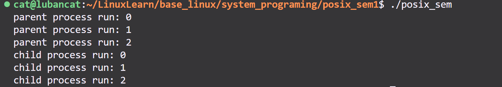

若是在父子进程中将 `sem_wait(sem);` 代码均注释掉，则程序运行后会出现以下效果：

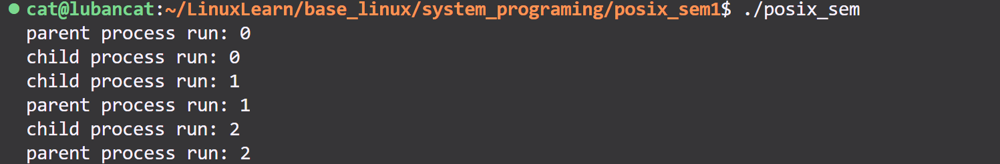

> [!note]
>
> 由于 `fork()` 后先执行父进程还是子进程是说不定的，只要能区分出是连续打印还是轮流打印即可看出信号量在本示例中的作用。

在代码的运行过程中，如果你打开一个新的终端，并且输入以下命令：

```bash
ls -l /dev/shm
```

那么你可以发现在 `/dev/shm` 目录下存在一个 `sem.my_sem_test` 文件，这就是我们实验中创建的一个信号量，当进程运行完毕，这个信号量将会被删除，使用 `sudo` 权限调用 `rm` 命令也可以手动删除该信号量文件。


##### 35.4.2 无名信号量

 下面的例子是用无名信号量同步机制实现 3 个线程之间的有序执行示例：

```c
// path: base_linux/system_programing/posix_sem2/sources/posix_sem.c
#include <unistd.h>
#include <stdio.h>
#include <stdlib.h>
#include <pthread.h>
#include <semaphore.h>

#define THREAD_NUMBER 3 // 线程数
#define REPEAT_NUMBER 4 // 每个线程中的小任务数

sem_t sem[THREAD_NUMBER];

// 线程函数
void *thread_func(void *arg)
{
    int num = (unsigned long long)arg;
    int delay_time = 0;
    int count = 0;

    // 等待信号量，进行 P 操作
    sem_wait(&sem[num]);

    printf("Thread %d is starting\n", num);
    for (count = 0; count < REPEAT_NUMBER; count++)
    {
        printf("\tThread %d: job %d \n", num, count);
        sleep(1);
    }

    printf("Thread %d finished\n", num);
    // 退出线程
    pthread_exit(NULL);
}

int main(void)
{
    pthread_t thread[THREAD_NUMBER];
    int i = 0, res;
    void * thread_ret;

    // 创建三个线程，三个信号量
    for (i = 0; i < THREAD_NUMBER; i++)
    {
        // 创建信号量，初始信号量值为 0
        sem_init(&sem[i], 0, 0);
        // 创建线程
        res = pthread_create(&thread[i], NULL, thread_func,
                             (void *)(unsigned long long)i);
        if (res != 0)
        {
            printf("Create thread %d failed\n", i);
            exit(res);
        }
    }

    printf("Create threads success\n Waiting for threads to finish...\n");
    
    // 按照顺序释放信号量 V 操作
    for (i = 0; i < THREAD_NUMBER; i++)
    {
        // 进行 V 操作
        sem_post(&sem[i]);
        // 等待线程执行完毕
        res = pthread_join(thread[i], &thread_ret);
        if (!res)
        {
            printf("Thread %d joined\n", i);
        }
        else
        {
            printf("Thread %d join failed\n", i);
        }
    }

    for (i = 0; i < THREAD_NUMBER; i++)
    {
        // 删除信号量
        sem_destroy(&sem[i]);
    }

    return 0;
}
```

- 第 44、45 行，在 for 循环内创建了三个信号量存储在数组 `sem` 中，创建三个线程，线程要调用的函数均为 `thread_func`，并且通过变量 `i` 传入了线程序号。
- 第 14 行，三个线程执行的都是这同样的函数，代码的思路与上一小节有名信号量的示例类似。
    - 第 21 行，线程先不执行，直接调用 `sem_wai()` 等待信号量 `sem[num]`，此处 `num` 即创建线程传入的序号参数 `i`。即每个线程均等待与自己序号相同的信号量。
    - 第 23~27 行，得到信号量后在 for 循环里打印信息并睡眠，释放 CPU。
    - 第 32 行，退出本线程。
- 第 58~73 行，此时各个子线程已经创建完成，均在等待信号量，这时在原线程里的 for 循环里调用 `sem_post()` 按顺序释放信号量，并且调用 `pthread_join()` 等待该线程执行完毕再释放下一个信号量。
- 第 78 行，调用 `sem_destroy` 释放各个信号量。

可以推算到如下现象：在原线程的控制下，它所创建的线程 ABC 按照释放信号量的次序执行，而且即使上一线程有释放 CPU 的操作，下一个线程也不会得到 CPU 的光顾，因为它未等到自己的信号量。从而在控制下不会出现 ACBBAC 之类的乱序操作。

运行 & 编译：

```bash
make
./posix_sem
```

实验结果：

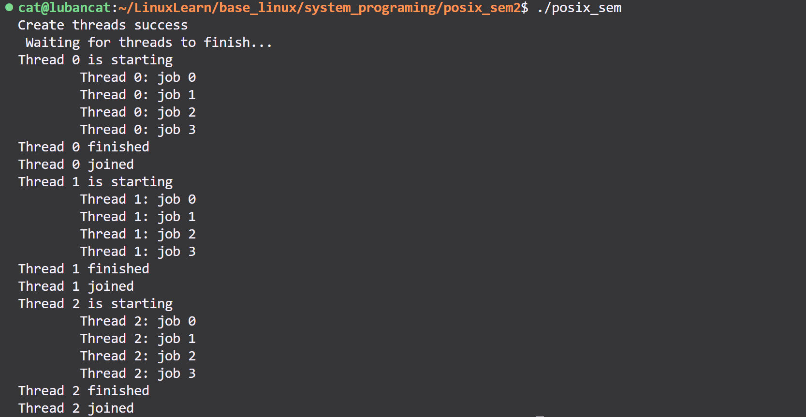

当在 `thread_func` 注释掉 `sem_wait(&sem[num]);` 后，程序运行效果如下：

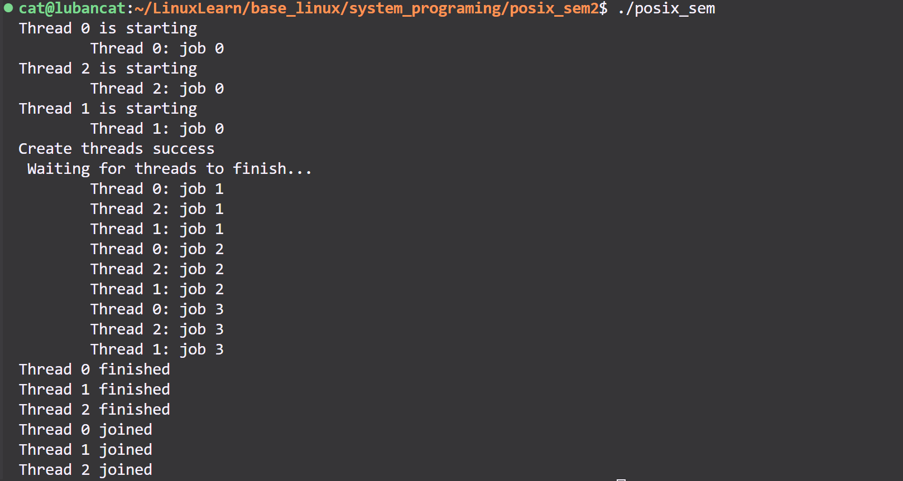

> [!note]
>
> 无名信号量不会在系统中创建文件，所以无法像有名信号量那样通过 `ls -l /dev/shm` 命令查看到。

### 36. POSIX 互斥锁

#### 36.1 互斥锁的基本概念

在前面的信号量章节，我们也了解过互斥这个概念，就是当不同进程/线程去访问某个临界资源的时候，就需要进行互斥保护，这种互斥保护可以看做是一种锁机制，就好比当你去上厕所的时候，你会锁住门，不让别人进来。在 Linux 系统中的锁机制是一个比较广泛的概念，而且锁的种类很多，包括互斥锁，文件锁，读写锁等等。

其实信号量也是一种锁，可以使用锁的目的是达到互斥的作用，使得共享资源在同一时间内，只有能有一个进程或者线程对它进行操作。

整个系统拥有很多临界资源，比如某些全局性的文件，硬件接口等，但整个 Linux 系统可以完美运行，这无不依赖锁机制，可以说锁机制是 Linux 整个系统的精髓所在，Linux 内核都是围绕着同步在运转，它决定了进程/线程什么时候可以访问这个临界资源，在多进程和多线程编程中，锁起着极其重要的作用。信号量也可以作为锁使用，但是我们今天要讲解的是 POSIX 标准中的机制——互斥锁（mutex）。一些资料中会将互斥锁称为互斥量，它们是一样的。

互斥锁和信号量不同的是，它具有互斥锁所有权、递归访问等特性，常用于实现对临界资源的独占式处理，在任意时刻互斥锁的状态只有两种，开锁或闭锁。

当互斥锁被线程持有时，该互斥锁处于闭锁状态，线程获得互斥锁的所有权。当该线程释放互斥锁时，该互斥锁处于开锁状态，线程失去该互斥锁的所有权。

也就是说，同时只有一个线程能获取互斥锁，特别地，持有该互斥锁的线程能够再次获得这个锁而不被阻塞，这就是互斥锁的递归访问，这个特性与一般的信号量有很大的不同，在信号量中，由于会不存在可用的信号量，线程递归获取信号量时会发生阻塞，最终形成死锁。

死锁就是自己把自己阻塞了，就相当于自己把自己锁在门外，钥匙在屋里。还有一种死锁的的情况是，两个线程相互阻塞，就好比你家的钥匙在你朋友家，你朋友家的钥匙在你家，然后你们都进不去。

想要避免死锁，最好遵循以下的规则：

- 对共享资源操作前一定要获得锁。
- 完成操作以后一定要释放锁。
- 尽量短时间地占用锁。
- 如果有多个锁, 如获得顺序是 ABC 连环扣, 释放顺序也应该是 ABC。

如果想要实现同步功能（线程与线程间同步），信号量或许是更好的选择，虽然互斥锁也可以用于线程与线程间的同步，但互斥锁更多的是用于保护资源的互斥。互斥锁可以充当保护资源的令牌，当一个线程希望访问某个资源时，它必须先获取令牌；当线程使用资源后，必须归还令牌，以便其他线程可以访问该资源。

在信号量中也可以用于保护临界资源，当线程获取信号量后才能开始使用该资源，当不需要使用时就释放信号量，如此一来其他线程也能获取到信号量从而可用使用资源。但信号量会导致的另一个潜在问题：当其他线程释放这个信号量的时候，这就不能保证信号量能实现互斥操作了。

互斥锁的使用比较单一，并且它是以锁的形式存在，在初始化的时候，互斥锁处于开锁的状态，而当被线程持有的时候则立刻转为闭锁的状态。互斥锁更适合于以下场景：

1. 保护临界资源。
2. 线程可能会多次获取互斥锁的情况下。这样可以避免同一线程多次递归持有而造成死锁的问题。

多线程环境下往往存在多个线程竞争同一临界资源的应用场景，互斥锁可被用于对临界资源的保护从而实现独占式访问。另外，互斥锁可以降低<u>信号量存在的优先级翻转</u>问题带来的影响。

例如，有两个线程需要用串口进行发送数据，假设其硬件资源只有一个，那么两个线程肯定不能同时发送数据，不然将导致数据错误，那么，就可以用互斥锁对串口资源进行保护，当一个线程正在使用串口的时候，另一个线程则无法使用串口，等到线程使用串口完毕之后，另外一个线程才能获得串口的使用权。

多线程环境下会存在多个线程访问同一临界资源的场景，该资源会被线程独占处理。其他线程在资源被占用的情况下不允许对该临界资源进行访问，这个时候就需要用到的互斥锁来进行资源保护，<u>那么互斥锁是怎样来避免这种冲突？</u>

使用互斥锁处理不同线程对临界资源的同步访问时，线程想要获得互斥锁才能访问资源，如果一旦有线程成功获得了互斥锁，则互斥锁立即变为闭锁状态，此时其他线程会因为获取不到互斥锁而不能访问该资源，那么此时线程有 2 个选择：

1. 扭头就走，不进行等待操作；
2. 一直阻塞在这里等待，直到互斥锁被持有线程释放后，线程才能获取互斥锁从而得以访问该临界资源，此时互斥锁再次上锁。

如此一来就可以确保同一时刻只有一个线程正在访问这个临界资源，保证了临界资源操作的安全性。

#### 36.2 初始化互斥锁

##### 36.2.1 静态互斥锁

在使用互斥锁前需要初始化一个互斥锁，而在 POSIX 标准中支持互斥锁静态初始化和动态初始化两种方式，如果是静态初始化的可以通过以下代码实现（选择其中一句即可）：

```c
pthread_mutex_t fastmutex = PTHREAD_MUTEX_INITIALIZER;
pthread_mutex_t recmutex = PTHREAD_RECURSIVE_MUTEX_INITIALIZER_NP;
pthread_mutex_t errchkmutex = PTHREAD_ERRORCHECK_MUTEX_INITIALIZER_NP;
```

`pthread_mutex_t` 是互斥锁的结构体，其实就是定义一个互斥锁结构，并且将其赋值，代表不同的互斥锁，这 3 种锁的区别主要在于其他未占有互斥锁的线程在获取互斥锁时是否需要阻塞等待：

- *PTHREAD_MUTEX_INITIALIZER*：表示默认的互斥锁，即**快速互斥锁**。互斥锁被线程 1 持有时，此时互斥锁处于闭锁状态，当线程 2 尝试获取互斥锁，那么线程 2 将会阻塞直至持有互斥锁的线程 1 解锁为止。
- *PTHREAD_RECURSIVE_MUTEX_INITIALIZER_NP*：**递归互斥锁**。互斥锁被线程 1 持有时，线程 2 尝试获取互斥锁，将无法获取成功，并且阻塞等待，而如果是线程 1 尝试再次获取互斥锁时，将获取成功，并且持有互斥锁的次数加 1。
- *PTHREAD_ERRORCHECK_MUTEX_INITIALIZER_NP*：**检错互斥锁**。这是快速互斥锁的非阻塞版本，它会立即返回一个错误代码（线程不会阻塞）。

##### 36.2.2 动态互斥锁

互斥锁动态初始化可以调用 `pthread_mutex_init()` 函数，该函数原型如下：

```c
int pthread_mutex_init(pthread_mutex_t *mutex, const pthread_mutexattr_t *mutexattr);
```

`pthread_mutex_init()` 函数是以动态方式初始化互斥锁的，参数说明如下：

- `mutex` 则是初始化互斥锁结构的指针。
- `mutexattr` 是属性参数，它允许我们设置互斥锁的属性，从而属性控制着互斥锁的行为，如果参数 `mutexattr` 为 NULL，则使用默认的互斥锁属性，默认属性为快速互斥锁。

#### 36.3 获取互斥锁与释放互斥锁

从前文我们也知道，想要访问一个临界资源需要获取互斥锁，获取互斥锁就相当于获得访问资源权限，就好比你有钥匙才能开你家的门。

当互斥锁处于开锁状态时，线程才能够获取互斥锁，当线程持有了某个互斥锁的时候，其他线程就无法获取这个互斥锁，需要等到持有互斥锁的线程进行释放后，其他线程才能获取成功，线程通过互斥锁获取函数来获取互斥锁的所有权。

线程对互斥锁的所有权是独占的，任意时刻互斥锁只能被一个线程持有，如果互斥锁处于开锁状态，那么获取该互斥锁的线程将成功获得该互斥锁，并拥有互斥锁的所有权；而如果互斥锁处于闭锁状态，则根据互斥锁的类型做对应的处理，默认情况下是快速互斥锁，获取该互斥锁的线程将无法获得互斥锁，线程将被阻塞，直到互斥锁被释放，当然，如果是同一个线程重复获取互斥锁，也会导致死锁结果。

获取互斥锁有 2 个函数，`mutex` 参数指定了要操作的互斥锁：

```c
int pthread_mutex_lock(pthread_mutex_t *mutex);
int pthread_mutex_trylock(pthread_mutex_t *mutex);
int pthread_mutex_unlock(pthread_mutex_t *mutex);
```

`pthread_mutex_lock()` 函数获得访问临界资源的权限，如果已经有其他线程锁住互斥锁，那么该函数会是线程阻塞指定该互斥锁解锁为止。

`pthread_mutex_trylock()` 是 `pthread_mutex_lock()` 函数的非阻塞版本，使用它不会阻塞当前线程，如果互斥锁已被占用，它会理解返回一个 *EBUSY* 错误。

访问完共享资源后，一定要通过 `pthread_mutex_unlock()` 函数释放占用的互斥锁，以便系统其他线程有机会获取互斥锁，访问该资源。

简单说就是，互斥锁的使用流程应该是：

1. 线程获取互斥锁。
2. 然后访问共享资源。
3. 最后释放互斥锁。

#### 36.4 销毁互斥锁

`pthread_mutex_destroy()` 函数用于销毁一个互斥锁，当互斥锁不再使用时，可以用它来销毁，`mutex` 参数指定了要销毁的互斥锁：

```c
int pthread_mutex_destroy(pthread_mutex_t *mutex);
```

#### 36.5 互斥锁实验

这个实验主要是验证互斥锁的互斥情况，系统创建 3 个线程，假设这 3 个线程中有临界资源被访问，那么我们希望这 3 个线程按顺序且不能同时去访问这个临界资源（假设临界资源是调用 `sleep()` 函数），所以我们可以使用互斥锁去限制能访问的线程，获取到互斥锁的线程可以访问临界资源。

```c
// path: base_linux/system_programing/mutex/sources/mutex.c
#include <unistd.h>
#include <fcntl.h>
#include <stdio.h>
#include <stdlib.h>
#include <pthread.h>

#define THREAD_NUMBER 3 // 线程数

pthread_mutex_t mutex;

void *thread_func(void *arg)
{
    // sizeof(void *) == 8 and sizeof(int) == 4 (64 bits)
    int num = (unsigned long long)arg;
    int sleep_time = 0;
    int res;

    // 互斥锁上锁
    res = pthread_mutex_lock(&mutex);
    if (res)
    {
        // 获取失败
        printf("Thread %d lock failed\n", num);

        // 互斥锁解锁
        pthread_mutex_unlock(&mutex);

        pthread_exit(NULL);
    }

    printf("Thread %d is hold mutex\n", num);

    // 睡眠一定时间
    sleep(2);

    printf("Thread %d freed mutex\n\n", num);

    // 互斥锁解锁
    pthread_mutex_unlock(&mutex);

    pthread_exit(NULL);
}

int main(void)
{
    pthread_t thread[THREAD_NUMBER];
    int num = 0, res;

    srand(time(NULL));

    // 互斥锁初始化
    pthread_mutex_init(&mutex, NULL);
    for (num = 0; num < THREAD_NUMBER; num++)
    {
        // 创建线程
        res = pthread_create(&thread[num],NULL,
                            thread_func,
                            (void *)(unsigned long long)num);
        if (res != 0)
        {
            printf("Create thread %d failed\n", num);
            exit(res);
        }
    }

    for (num = 0; num < THREAD_NUMBER; num++)
    {
        // 等待线程结束
        pthread_join(thread[num], NULL);
    }

    // 销毁互斥锁
    pthread_mutex_destroy(&mutex);

    return 0;
}
```

本代码说明如下，直接从 `main` 函数按流程分析：

- 第 53 行，调用 `pthread_mutex_init()` 动态初始化了一个互斥锁。
- 第 54 行，在 for 循环内创建三个线程，线程要调用的函数均为 `thread_func`，并且通过变量 `num` 传入了线程序号。
- 第 12 行，三个线程执行的都是这同样的函数。
    - 第 20 行，调用 `pthread_mutex_lock()` 等待互斥锁，若互斥锁被其它线程占用，线程将阻塞在此处等待。
    - 第 32、37 行，这两行输出信息的代码均处在互斥锁保护的范围内，所以它们是成对出现，而且不会被需求同样互斥锁的其它线程打断。
    - 第 35 行，获取到互斥锁后对资源进行操作，此处直接使用 `sleep` 模拟，并且释放 CPU 占用。
    - 第 40 行，调用 `pthread_mutex_unlock()` 解锁，以便其它线程使用临界资源。
- 第 67~71 行，此时各个子线程已经创建完成，并且执行，这时在原线程里的 for 循环里调用 `pthread_join()` 等待其它线程执行完毕。
- 第 74 行，各个线程已执行完毕调用 `pthread_mutex_destroy()` 销毁互斥锁。

可以推算到如下现象：在原线程的控制下，它创建的线程 ABC，在互斥锁的保护下输出代码里成对的 32、37 行中的信息，而且即使保护范围内有释放 CPU 的 `sleep` 操作，另外两个线程也不会得到 CPU 的光顾，因为它们未得到锁。从而在控制下出现的输出信息是：即 A1A2，B1B2，C1C2，而不会出现 A1B1C1，A2B2C2 之类的打乱信息。

编译 & 运行：

```bash
make
./mutex
```

运行结果：

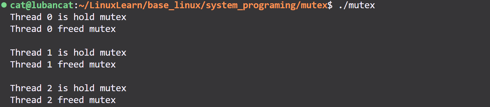

可以将互斥锁的相关代码注释掉，即注释掉 20~30 行代码，看看如果没有互斥操作的话线程会怎样访问临界资源，再重新编译运行，被注释代码和运行结果如下：

```c
// 互斥锁上锁
res = pthread_mutex_lock(&mutex);
if (res)
{
    // 获取失败
    printf("Thread %d lock failed\n", num);

    // 互斥锁解锁
    pthread_mutex_unlock(&mutex);

    pthread_exit(NULL);
}
```

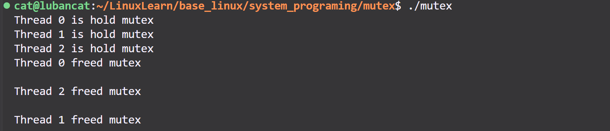

可以看到，由于没有锁的保护，在 `sleep` 期间其它线程得到了 CPU，也对资源进行了操作，此处出现了 A1C1B1，A2C2B2 的信息打印顺序。就表示了线程 A 还在使用关键资源的时候，线程 B 和 C 也同时使用了，如果资源只有一个，那就会出现不可预知的问题。

### 37. 网络编程

互联网对人类社会产生的巨大变革，大家是有目共睹的，它几乎改变了人类生活的方方面面。互联网通信的本质是数字通信，任何数字通信都离不开通信协议的制定，通信设备只有按照约定的、统一的方式去封装和解析信息，才能实现通信。互联网通信所要遵守的众多协议，被统称为 TCP/IP。

#### 37.1 网络编程相关知识简介

因为网络的知识太庞大了，想要介绍清楚得写好几本书，在这里仅简单提及一下。

TCP/IP 是一个协议族，包含众多的协议。但对于网络应用开发人员，可能听到更多的是其中的应用层协议，比如 HTTP、FTP、MQTT 等。

**HTTP** 协议是 Hyper Text Transfer Protocol（超文本传输协议）的缩写，HTTP 的应用最为广泛。比如大家日常使用电脑时的一个常规操作：打开电脑，打开浏览器，输入网址，最后按下回车，这一刻你就开启了 HTTP 通信。HTTP 协议工作于架构之上，（服务端也称作为服务器端，除非特别说明，否则本书出现的 “服务端” 即为 “服务器端”），浏览器作为 HTTP 客户端通过 URL 向 HTTP 服务端即 WEB 服务器发送所有请求。Web 服务器根据接收到的请求后，向客户端发送响应信息。借助这种浏览器和服务器之间的 HTTP 通信，我们能够足不出户地获得来自世界各个角落的信息。另外，网页不仅仅是大型服务器的专利，在物联网风潮盛行的今天，许多随处可见的小型设备（空调、冰箱、插座、路由器等），都内嵌网页，在物理链路畅通的情况下，用户可以用手机、平板电脑上的浏览器随时随地监控这些设备。

**FTP**（File Transfer Protocol）是文件传输协议的简称。FTP 是==工作在应用层==的网络协议。==FTP 使得主机间可以共享文件，用于在两台设备之间传输文件（双向传输）==。它也是一个==客户端-服务端框架系统==。用户可以通过一个支持 FTP 协议的客户端程序，连接到在远程主机上的 FTP 服务端程序，通过客户端程序向服务端程序发出命令，服务端程序执行用户所发出的命令，并将执行的结果返回到客户机。FTP 除了基本的文件上传/下载功能外，还有目录操作、权限设置、身份验证机制，许多网盘的文件传输功能都是基于 FTP 实现的。

在物联网发展的初期，物联网场景中的设备使用何种应用层协议进行通信一直是备受争议的话题。很多开发人员习惯了网页的开发模式，于是经常选择 HTTP 作为通信方式。使用 HTTP 有以下不利因素：HTTP 是一种同步协议，设备需要等待服务器的响应才可以进行下一步的工作，然而在设备数量多、网络不可靠的场景下，实现同步通信很困难；HTTP 是单向的，设备只能主动向服务器发出数据，无法被动的接收来自网络的数据，这不适用于实时控制的场合；HTTP 是有许多帧头和规则的重量级协议，实现在设备中需要耗费大量的系统资源。基于上述的形势，**MQTT** 和 **COAP** 等==轻量级、异步的通信协议==便得到了物联网设备开发商的宠爱，尤其是 MQTT。MQTT（消息队列遥测传输）是 IBM 公司于 1990 年设计并推出的一款通信协议，于 2014 年正式成为了一个 OASIS 开放标准。近年来，MQTT 的应用呈现出爆炸性的增长势头，大有一统物联网的趋势。另外，MQTT 在物联网以外的其他领域也得到了广泛的应用，比如许多公司在制作手机 APP 时，会使用 MQTT 来实现消息推送、即时聊天等功能。

嵌入式设备接入互联网的需求越来越大，有以下几点原因：

1. 近些年，各种带网络接入功能的 MCU、SoC 层出不穷，开源轻量的 TCP/IP 协议栈日趋成熟和完善，云平台的市场越来越繁荣，这些因素大大降低了嵌入式设备的入网成本，也为许多资源受限的低端设备接入互联网提供了可能。
2. “物联网+” 的风潮日渐盛行，设备能够被远程监控，这一点已经成为许多产品的技术要求。
3. 人们对于设备 “智能化” 的追求热情越来越高，当今热门的大数据、图像处理、语音识别、机器学习等功能都可以被集成在云端，成为云平台能提供的服务。终端设备大多是计算、存储能力有限的设备，这些设备如果想要获取 “智能”，最便捷的办法就是接入云平台，利用各项云服务。

互联网的基础就是 TCP/IP。TCP/IP 是一个非常复杂的协议族，即便我们能把它的设计思想和实现原理都解释得清清楚楚，你也不见得有时间和精力去学习它，所以本书的写作重点不在于对 TCP/IP 的解读，而在于对它的应用。另外，TCP/IP 的复杂性也决定了它并不是那么简单就能用好的东西，即便我们只关注应用开发，也依然需要对它的许多概念和设计思想有所了解，才能编写出正确、高效、健壮性好的应用程序。

互联网对人类社会产生的巨大变革，大家是有目共睹的，它几乎改变了人类生活的方方面面。互联网通信的本质是数字通信，任何数字通信都离不开通信协议的制定，通信设备只有按照约定的、统一的方式去封装和解析信息，才能实现通信。互联网通信所要遵守的众多协议，被统称为 TCP/IP。

##### 37.1.1 网络协议的分层模型

TCP/IP 是一个庞大的协议族，它是众多网络协议的集合，包括：ARP、IP、ICMP、UDP、TCP、DNS、DHCP、HTTP、FTP、MQTT 等等。这些协议按照功能，可以被划分为几个不同的层次，如图所示。比如 ==HTTP、FTP、MQTT，它们隶属于应用层==。那么 <u>TCP/IP 为什么需要分层？</u><u>分层又是依靠什么依据呢？</u>


TCP/IP 协议栈中不同协议所完成的功能是不一样的，某些协议的实现要依赖于其它协议，依据这种依赖关系，可以将协议栈分层。在图中，==低层协议为相邻的上层协议提供服务，是上层协议得以实现的基础。==

其中，**物理层**（PHY）==规定了传输信号所需要的物理电平、介质特征==；

**链路层**（MAC）==规定了数据帧能被网卡接收的条件==，最常见的方式是利用网卡的 MAC 地址，发送方会在欲发送的数据帧的首部加上接收方网卡的 MAC 地址信息，接收方只有监听到属于自己的 MAC 地址信息后，才会去接收并处理该数据。

每台网络设备都应该有自己的网络地址，**网络层**==规定了主机的网络地址该如何定义，以及如何在网络地址和 MAC 地址之间进行映射==，即 ARP 协议；网络层==实现了数据包在主机之间的传递==，而一台主机内部可能运行着多个网络程序。

**传输层**可以==区分数据包是属于哪一个应用程序的==，可以说传输层==实现了数据包端到端的传递==。另外，数据包在传输过程中可能会出现丢包、乱序和重复的现象，网络层并没有提供应对这些错误的机制，而**传输层**可以==解决数据包在传输过程中可能会出现丢包、乱序和重复的问题==，如 TCP 协议；

应用层以下的工作完成了数据的传递工作，**应用层**则==决定了你如何应用和处理这些数据==，之所以会有许多的应用层协议，是因为互联网中传递的数据种类很多、差异很大、应用场景十分多样。

##### 37.1.2 协议层报文间的封装与拆封

在这里，我们简单解释一下在数据的发送和接收过程中，TCP/IP 都做了哪些事儿。

当用户发送数据时，将数据向下交给传输层，这是处于应用层的操作，而应用层也有相关的协议，对用户的数据进行封装，比如 MQTT、HTTP 等协议，最后应用层通过调用传输层的接口来将数据递交到传输层中。传输层会在数据前面加上传输层首部（此处以 TCP 协议为例，图中的传输层首部为 TCP 首部，也可以是 UDP 首部），然后向下交给网络层。同样地，网络层会在数据前面加上网络层首部（IP 首部），然后将数据向下交给链路层，链路层会对数据进行最后一次封装，即在数据前面加上链路层首部（此处使用以太网接口为例），然后将数据交给网卡。最后，网卡将数据转换成物理链路上的电平信号，数据就这样被发送到了网络中。数据的发送过程，可以概括为 TCP/IP 的各层协议对数据进行封装的过程，如图所示：


当设备的网卡接收到某个数据包后，它会将其放置在网卡的接收缓存中，并告知 TCP/IP 内核。然后 TCP/IP 内核就开始工作了，它会将数据包从接收缓存中取出，并逐层解析数据包中的协议首部信息，并最终将数据交给某个应用程序。数据的接收过程与发送过程正好相反，可以概括为 TCP/IP 的各层协议对数据进行解析的过程。

#### 37.2 IP 协议

IP 协议（Internet Protocol），又称之为网际协议，IP 协议==处于网络层工作==，它==是整个 TCP/IP 协议栈的核心协议==，上层协议都要依赖 IP 协议提供的服务，IP 协议负责将数据报从源主机发送到目标主机，通过 IP 地址作为唯一识别码，简单来说，不同主机之间的 IP 地址是不一样的，在发送数据报的过程中，IP 协议还可能对数据报进行分片处理，同时在接收数据报的时候还可能需要对分片的数据报进行重装等等。

IP 协议是一种==无连接的不可靠数据报交付协议==，<u>协议本身不提供任何的错误检查与恢复机制</u>。

##### 37.2.1 IP 地址简述

在 TCP/IP 设计之初，为了标识互联网中的每台主机的身份，设计人员为每个接入网络中的主机都分配一个 IP 地址（Internet Protocol Address），是一个 32 位的整数地址，只有合法的 IP 地址才能接入互联网中并且与其他主机进行通信，==IP 地址是软件地址==，不是硬件地址，<u>硬件 MAC 地址是存储在==网卡==中的，应用于==本地网络==中寻找目标主机</u>。而 ==IP 地址能让一个网络中的主机能够与另一个网络中的主机进行通信，无需理会这些主机之间的 MAC 地址==。

在学习 IP 地址之前，需要简述一下主机与路由器连入网络的通信的方法：一台主机通常只有一条链路连接到网络，一般只有一个网卡；当主机中想发送一个数据报时，它就在该链路上发送，一个网卡对应一个 MAC 地址与 IP 地址，当然，主机也可能有多个网卡，这样子主机就有多个 MAC 地址与 IP 地址。

每个 IP 地址长度为 32 比特（4 字节），因此总共有 2^32 个可能的 IP 地址，大约有 40 亿个 IP 地址能被使用的。这些地址一般按所谓==点分十进制记法==（dotted-decimal notation）书写，<u>即地址中的每个字节用它的十进制形式书写，各字节间以点分隔开</u>。例如，IP 地址为 `192.168.0.122`，`192` 是该地址第一个 8 比特的十进制等价数，`168` 是该地址第二个 8 比特的十进制等价数，依此类推。

##### 37.2.2 IP 地址编址

在全球的互联网中，每个主机都要唯一的一个 IP 地址作为身份识别，那么这么多 IP 地址是怎么样分配的呢？这不可能是随意自由选择 IP 地址的，实际上==每个主机的 IP 地址的一部分都由其所在的子网决定的==，所以又出现了IP 地址分类编址的概念，==网络的类型决定了 IP 地址将如何划分成网络部分和节点部分==，在分类编址中，设计者把所有的 IP 地址划分为 5 大类，分别为 A、B、C、D、E 五类，每一类地址都觉定了其中 IP 地址的一部分组成，具体见：


A 类网络地址的第一个字节的第一位必须为 0 ，因此，A 类网络地址第一个字节的取值范围为 0~127（注意：但 0 和 127 不是有效的 A 类网络地址号），A 类地址总共有 128 个网络号，其中 3 个网络号用作特殊用途，因此可以在互联网上使用的还有125 个，而每一个网络号后面的 3 字节主机号表示能用于 A 类网络地址不同网络号的的主机数量（多达 2^24-2 = 16777214 个），所以总的来说 A 类网络支持的主机数量为 125*16777214=2097151750 个，大约占据了 40 亿 IP 地址的半壁江山，这些 IP 地址通常被分配给世界上超大型的机构使用，但是通常没有任何一个机构能使用那么大量的 IP 地址，所以 A 类地址的很多 IP 地址都会被白白浪费掉。

B 类网络地址的第一个字节的第一位必须为 1 ，且第二位必须为 0，因此，B 类网络地址第一个字节的取值范围为 128~191，前 2 字节剩余的 14bit 表示网络号，多达 16384 个网络号，其中 16个网络号被保留使用，因此可以分配给企业使用的网络号有16368 个，每一个网络号中可以拥有 2^16-2 =65534 个主机，总的来说 B 类网络支持的主机个数为16368*65534=1072660512，大约占据了所有 IP 地址的四分之一。

C 类网络地址的第一个字节的第一位必须为 1，第二位必须为 1，第三位必须为 0，因此 C 类网络第一个字节的取值范围为192~223，C 类地址的前三个字节用于表示网络号（剩下的 21bit），所以拥有 2097152 个网络号，但是其中的 256 个网络号被保留出来，因此 C 类地址的可用网络号为 2096896 个，每个网络号下的主机个数为 254，因此 C 类网络支持的主机数量为532611584，大约占据了所有 IP 地址的八分之一。

D 类 IP 地址的第一个字节前四位为 1110，那么它第一个字节的取值范围为 224~239，约占据了所有 IP 地址的十六分之一，它是一个专门保留的地址，它并不指向特定的网络，目前这一类地址被用于多播。

E 类 IP 地址的第一个字节前四位必须为 1111，那么它第一个字节的取值范围为 240~255，约占据了所有 IP 地址的十六分之一，是为将来使用而保留的，其中 32bit 全为 1 的 IP 地址（255.255.255.255）用作广播地址。

| 类别 | 第一字节(二进制) | 第一字节取值范围 | 网络号个数 | 主机号个数 | 适用范围 |
| :--: | :--------------: | :--------------: | :--------: | :--------: | :------: |
| A 类 |    0XXX XXXX     |      0~127       |    125     |  16777214  | 大型网络 |
| B 类 |    10XX XXXX     |     128~191      |   16368    |   65534    | 中型网络 |
| C 类 |    110X XXXX     |     192~223      |  2097152   |    254     | 小型网络 |
| D 类 |    110X XXXX     |     224~239      |     —      |     —      |   多播   |
| E 类 |    1111 XXXX     |     240~255      |     —      |     —      |   保留   |

##### 37.2.3 特殊的 IP 地址

除了上述的网络地址外，还有一些特殊用途的地址，这些地址是不允许分配给任何一个网络的主机使用的，下面简单介绍几个常见的特殊地址。

###### 37.2.3.1 受限广播地址

广播通信是==一对所有==的通信方式，受限广播地址==用于定义整个互联网==，如果设备想使 IP 数据报被整个网络所接收，就发送这个目的地址全为 1 的广播包，但这样会给整个互联网带来灾难性的负担，所以<u>在任何情况下，路由器都会禁止转发目的地址为`255.255.255.255` 的广播数据包</u>，因此这样的数据包仅会出现在本地网络中（局域网），`255.255.255.255` 这个地址指本网段内的所有主机，相当于 “房子里面的人都听着” 通知所有主机。

> [!caution]
>
> 此处不要与以太网的广播地址（`255-255-255-255-255-255`）混淆了。

###### 37.2.3.2 直接广播地址

受限==广播地址是网络号与主机号都为 1== 的地址，但是==直接广播地址是主机号全为 1== 而得到的地址，==广播地址代表本网络内的所有主机==，<u>使用该地址可以向网络内的所有主机发送数据</u>，比如一个 IP 地址是 `192.168.0.181`，这是 C 类地址，所以它的主机号只有一个字节，那么对主机号全取 1 得到一个广播地址 `192.168.0.255`，向这个地址发送数据就能让同一网络下的所有主机接收到。

A、B、C 三类地址的广播地址结构如下：

- A 类地址的广播地址为：`XXX.255.255.255`（ `XXX` 为 A 类地址的第一个字节取值范围）。
- B 类地址的广播地址为：`XXX.XXX.255.255`（`XXX` 为 B 类地址的前两个字节取值范围）。
- C 类地址的广播地址为：`XXX.XXX.XXX.255`（ `XXX` 为 C 类地址的前三个字节取值范围）。

> [!caution]
>
> 这个地址在 IP 数据报中只能作为**目的地址**。另外，直接广播地址使一个网段中可分配给设备的地址数减少了 1 个。

###### 37.2.3.3 多播地址

多播地址==用在一对多的通信中==，即一个发送者，多个接收者，不论接收者数量的多少，发送者只发送一次数据包。多播地址==属于分类编址中的 D 类地址==，<u>D 类地址只能用作==目的地址==，而不能作为主机中的==源地址==</u>。

###### 37.2.3.4 环回地址

`127` 网段的==所有==地址都称为环回地址，==主要用来测试网络协议是否工作正常的作用==。比如在电脑中使用 `ping` 命令去 `ping 127.1.1.1` 就可以测试本地 TCP/IP 协议是否正常。用通俗的话表示，就是 “我自己”，不能以 `127` 网段中的 IP 地址作为主机地址，因此 A 类地址又少了一个可用网络号。

###### 37.2.3.5 本网络本主机

IP 地址 32bit 全为 0 的地址（0.0.0.0）表示的是本网络本主机，这个 IP 地址<u>在 IP 数据报中只能用作==源 IP 地址==</u>，这<u>发生在当设备启动时但又不知道自己的 IP 地址情况下</u>。在使用 DHCP 分配 IP地址的网络环境中，这样的地址是很常见的，主机为了获得一个可用的 IP 地址，就给 DHCP 服务器发送 IP 数据报，并用这样的地址（0.0.0.0）作为源地址，目的地址为255.255.255.255（因为主机这时还不知道 DHCP 服务器的 IP 地址），然后 DHCP 服务器就会知道这个主机暂时没有 IP 地址，那么就会分配一个 IP 给这个主机。

#### 37.3 UDP 协议

UDP 是 User Datagram Protocol 的简称，中文名是用户数据报协议，是一种==无连接、不可靠==的协议，它只是<u>简单地实现从一端主机到另一端主机的数据传输功能</u>，这些数据通过 IP 层发送，在网络中传输，到达目标主机的顺序是无法预知的，因此需要应用程序对这些数据进行排序处理，这就带来了很大的不方便，此外，UDP 协议更<u>没有流量控制、拥塞控制</u>等功能，在发送的一端，UDP 只是把上层应用的数据封装到 UDP 报文中，在差错检测方面，仅仅是对数据进行了简单的校验，然后将其封装到 IP 数据报中发送出去。而在接收端，无论是否收到数据，它都不会产生一个应答发送给源主机，并且如果接收到数据发送校验错误，那么接收端就会丢弃该 UDP 报文，也不会告诉源主机，这样子传输的数据是无法保障其准确性的，如果想要其准确性，那么就需要应用程序来保障了。UDP 协议的特点：

1. ==无连接、不可靠==。
2. ==尽可能提供交付==数据服务，出现差错直接丢弃，无反馈。
3. ==面向报文==，发送方的 UDP 拿到上层数据直接添加个 UDP 首部，然后进行校验后就递交给 IP 层，而接收的一方在接收到 UDP 报文后简单进行校验，然后直接去除数据递交给上层应用。
4. 支持一对一，一对多，多对一，多对多的交互通信。
5. ==速度快==，UDP 没有 TCP 的握手、确认、窗口、重传、拥塞控制等机制，UDP 是一个==无状态的传输协议==，所以它在传递数据时非常快，即使<u>在网络拥塞的时候 UDP 也不会降低发送的数据</u>。

UDP 虽然有很多缺点，但是也不排除其能用于很多场合，因为在如今的网络环境下，UDP 协议传输出现错误的概率是很小的，并且它的实时性是非常好，常用于实时视频的传输，比如直播、网络电话等，因为即使是出现了数据丢失的情况，导致视频卡帧，这也不是什么大不了的事情，所以，UDP 协议还是会<u>被应用与对传输速度有要求，并且可以容忍出现差错的数据传输中</u>。

#### 37.4 TCP 协议

##### 37.4.1 TCP 协议简介

TCP 与 UDP 一样，都是传输层的协议，但是提供的服务却大不相同，UDP 为上层应用提供的是一种不可靠的，无连接的服务，而 <u>TCP 则提供一种==面向连接==、==可靠==的字节流传输服务</u>，TCP 让两个主机建立连接的关系，<u>应用数据以==数据流==的形式进行传输</u>，这与 UDP 协议是不一样：

- <u>UDP 运载的数据是以==报文==的形式</u>，各个报文在网络中==互不相干传输==，UDP 每收到一个报文就递交给上层应用，因此如果对于大量数据来说，应用层的重装是非常麻烦的，因为 <u>UDP 报文在网络中==到达目标主机的顺序是不一样==的</u>；
- <u>而 TCP 采用==数据流==的形式传输</u>，先后发出的数据在网络中虽然也是==互不相干的传输==，但是这些<u>数据本身携带的信息</u>却是紧密联系的，<u>TCP 协议会给每个传输的字节进行==编号==</u>，当然啦，<u>两个主机方向上的数据编号是==彼此独立==的</u>，在传输的过程中，<u>发送方把数据的==起始编号==与==长度==放在 TCP 报文中，在接收方将所有数据==按照编号组装==起来，然后返回一个确认</u>，当所有数据接收完成后才将数据递交到应用层中。

##### 37.4.2 TCP 的特性

###### 37.4.2.1 连接机制

TCP 是一个面向连接的协议，无论哪一方向另一方发送数据之前，<u>都必须先在双方之间建立一个连接</u>，否则将无法发送数据，一个 TCP 连接必须有双方 IP 地址与端口号，就像打电话一样，必须知道双方的电话号码才会打电话，关于具体的连接我们在后文讲解。

###### 37.4.2.2 确认与重传

一个完整的 TCP 传输必须有数据的交互，<u>接收方在接收到数据之后必须正面进行确认</u>，向发送方报告接收的结果，而发送方在发送数据之后必须等待接收方的确认，同时发送的时候会启动一个定时器，在指定超时时间内没收到确认，发送方就会认为发送失败，然后进行重发操作，这就是重传报文。

TCP 提供可靠的运输层，但它依赖的是 IP 层的服务，IP 数据报的传输是无连接、不可靠的，因此它要通过确认来知道接收方确实已经收到数据了。但数据和确认都有可能会丢失，因此 TCP 通过在发送时设置一个<u>超时机制</u>（定时器）来解决这种问题，如果当超时时间到达的时候还没有收到对方的确认，它就重传该数据。

###### 37.4.2.3 缓冲机制

在发送方想要发送数据的时候，由于应用程序的数据大小、类型都是不可预估的，而 TCP 协议提供了缓冲机制来处理这些数据，如<u>在数据量很小的时候，TCP 会将数据存储在一个缓冲空间中，等到数据量足够大的时候在进行发送数据</u>，这样子能<u>提高传输的效率并且减少网络中的通信量</u>，而且在数据发送出去的时候并不会立即删除数据，还是让数据保存在缓冲区中，因为发送出去的数据不一定能被接收方正确接收，它需要等待到接收方的确认再将数据删除。同样的，在接收方也需要有同样的缓冲机制，因为在网络中传输的数据报到达的时间是不一样的，而且 TCP 协议还需要把这些数据报组装成完整的数据，然后再递交到应用层中。

###### 37.4.2.4 全双工通信

在 TCP 连接建立后，那么两个主机就是对等的，任何一个主机都可以向另一个主机发送数据，数据是双向流通的，所以 TCP 协议是一个全双工的协议，这种机制为 TCP 协议传输数据带来很大的方便，一般来说，<u>TCP 协议的确认是通过==捎带==的方式来实现</u>，即接收方把确认信息放到反向传来的是数据报文中，不必单独为确认信息申请一个报文，<u>捎带机制减少了网络中的通信流量。</u>由于双方主机是对等的存在，那么任意一方都可以断开连接，此时这个方向上的数据流就断开了，但是另一个方向上的数据仍是连通的状态，这种情况就称之为半双工。

###### 37.4.2.5 流量控制

在前面讲过，一条 TCP 连接每一侧的主机都设置了缓冲区域。当该接收方收到数据后，它就将数据放入接收缓冲区，当确认这段数据是正常的时候，就会向发送方返回一个确认。并且向相关的应用层递交该数据，但不一定是数据刚一到达就立即递交。事实上，接收方应用也许正忙于其他任务，甚至要过很长时间后才会去处理这些数据。这样子如果接收方处理这些数据时相对缓慢，而发送方发送得太多、太快，就会很容易地使接收方的接收缓冲区发生溢出。

因此 TCP 提供了流量控制服务（flow-control service）以<u>消除发送方使接收方==缓冲区溢出==的可能性</u>。<u>流量控制是一个==速度匹配服务==，即发送方的发送速率与接收方应用程序的读取速率相匹配</u>，TCP 通过让发送方维护一个称为==接收窗口==（receive window）的变量来提供流量控制，是的，你没看错，是接收窗口（rwnd），它<u>用于给发送方一个指示：接收方还能接收多少数据</u>，接收方会将此窗口值放在 TCP 报文的首部中的窗口字段，然后传递给发送方，这个窗口的大小是在发送数据的时候==动态调整==的。

那可能有人问，这个窗口既然是动态调整的，那有没有可能是 0，这样子发送方不就是没法继续发送数据到接收方了？为了解决这个问题，TCP 协议的规范中有些要求，当接收方主机的接收窗口为 0 时，发送方继续发送只有一个字节的报文段，这些报文段将被接收方接收，直到缓存清空，并在确认报文中包含一个非 0 的接收窗口值。

流量控制是双方通信之间的控制信息，这是很有必要的，比如两个性能不对等的主机，建立了 TCP 协议连接，但是其中一个主机一直发送数据，但是接收的主机来不及处理，这样子的处理就不是最佳的，因此，<u>TCP 协议中使用==滑动窗口==的流量控制方法，它允许接收方==根据自身的处理能力来确定能接收数据的多少==</u>，因此会告诉发送方可以发送多少数据过来，即窗口的大小，而发送方尽可能将数据都多发到对方那里，所以发送方会根据这个窗口的大小发送对应的数据，通俗地来说就是接收方告诉发送方 “我还有能力处理那么多的数据，你就发那么多数据给我就行了，不要发多了，否则我处理不了”。

###### 37.4.2.6 差错控制

除了确认与重传之外，TCP 协议也会<u>采用校验和的方式来检验数据的有效性</u>，主机在接收数据的时候，会将重复的报文丢弃，将乱序的报文重组，发现某段报文丢失了会请求发送方进行重发，因此在 <u>TCP 往上层协议递交的数据是==顺序的==、==无差错的==完整数据。</u>

###### 37.4.2.7 拥塞控制

什么是拥塞？当数据从一个大的管道（如一个快速局域网）向一个较小的管道（如一个较慢的广域网）发送时便会发生拥塞。当多个输入流到达一个路由器，而路由器的输出流小于这些输入流的总和时也会发生拥塞，这种是网络状况的原因。如果一个主机还是以很大的流量给另一个主机发送数据，但是其中间的路由器通道很小，无法承受这样大的数据流量的时候，就会导致拥塞的发生，这样子就<u>导致了接收方无法在超时时间内完成接收（接收方此时完全有能力处理大量数据），而发送方又进行重传，这样子就导致了链路上的更加拥塞</u>，<u>延迟发送方必须实现一种==自适应的机制==，在网络中拥塞的情况下==调整自身的发送速度==，这种形式对发送方的控制被称为拥塞控制（congestion control）</u>，与前面我们说的流量控制是非常相似的，而且TCP 协议采取的措施也非常相似，均是==限制发送方的发送速度==。

#### 37.5 端口号的概念

TCP 协议的连接是包括上层应用间的连接，简单来说，TCP 连接是两个不同主机的应用连接，而传输层与上层协议是通过端口号进行识别的，如 IP 协议中以 IP 地址作为识别一样，端口号的取值范围是 0~65535，这些端口标识着上层应用的不同线程，一个主机内可能只有一个 IP 地址，但是可能有多个端口号，每个端口号表示不同的应用线程。一台拥有 IP 地址的主机可以提供许多服务，比如 Web 服务、FTP 服务、SMTP 服务等，这些服务完全可以通过 1 个 IP 地址来实现，主机是怎样区分不同的网络服务呢？显然不能只靠 IP 地址，因为 IP 地址只能识别一台主机而非主机提供的服务，这些服务就是主机上的应用线程，因此是<u>通过 “IP 地址+ 端口号” 来区分主机不同的线程</u>。

常见的 TCP 协议端口号有 21、53、80 等等，更多端口描述具体见表格，其中 80 端口号是我们日常生活中最常见的一个端口号，它也是 HTTP 服务器默认开放的端口。

| 端口号 |  协议  | 说明                                                         |
| :----: | :----: | ------------------------------------------------------------ |
| 20/21  |  FTP   | 文件传输协议，使得主机间可以共享文件。                       |
|   23   | Telnet | 终端远程登录，它为用户提供了在本地计算机上完成远程主机工作的能力。 |
|   25   |  SMTP  | 简单邮件传输协议，它帮助每台计算机在发送或中转信件时找到下一个目的地。 |
|   69   |  TFTP  | 普通文件传输协议。                                           |
|   80   |  HTTP  | 超文本传输协议，通过使用网页浏览器、网络爬虫或者其它的工具，客户端发起一个 HTTP 请求到服务器上指定端口（默认端口为 80），应答的服务器上存储着一些资源，比如 HTML 文件和图像，那么就会返回这些数据到客户端。 |
|  110   |  POP3  | 邮局协议版本 3，本协议主要用于支持使用客户端远程管理在服务器上的电子邮件。 |

举个例子，我们访问 http://www.firebbs.cn 这个网站，如果我们在浏览器中输入 http://www.firebbs.cn:80 ，访问这个服务器的 80 端口，我们还是会进入一样的页面，但是如果我们输入 http://www.firebbs.cn:90 去访问这个服务器的 90 端口，这是不允许访问的。

#### 37.6 TCP 报文段

TCP 报文段由<u>首部 + 数据区域</u>组成，TCP 报文段的首部我们称之为 TCP 首部，其首部内容很丰富，各个字段都有不一样的含义，如果不计算选项字段，一般来说 TCP 首部只有 20 个字节，具体见图：

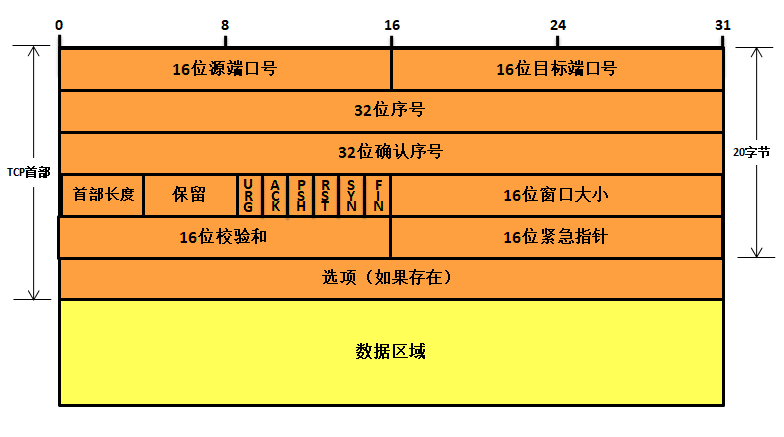

每个 TCP 报文段都包含<u>源主机和目标主机的端口号</u>，用于寻找发送端和接收端应用线程，这两个值加上 IP 首部中的<u>源 IP 地址和目标 IP 地址</u>就能确定唯一一个TCP 连接。

序号字段用来标识从 TCP 发送端向 TCP 接收端发送的数据字节流，它的值表示在这个报文段中的第一个数据字节所处位置，根据接收到的数据区域长度，就能计算出报文最后一个数据所处的序号，因为 TCP 协议会对发送或者接收的数据进行编号（按字节的形式），那么使用序号对每个字节进行计数，就能很轻易管理这些数据。序号是 32 bit 的无符号整数。

当建立一个新的连接时，TCP 报文段首部的 SYN 标志变 1，序号字段包含由这个主机随机选择的初始序号 ISN（Initial Sequence Number）。该主机要发送数据的第一个字节序号为 ISN+1，因为 SYN 标志会占用一个序号，在这里我们只需要了解一下即可，后面会讲解的。

既然 TCP 协议给每个传输的字节都进行了编号，那么确认序号就包含接收端所期望收到的下一个序号，因此，确认序号应当是上次已成功收到数据的最后一个字节序号加 1。当然，只有 ACK标志为 1 时确认序号字段才有效，TCP 为应用层提供全双工服务，这意味数据能在两个方向上独立地进行传输，因此确认序号通常会与反向数据（即接收端传输给发送端的数据）封装在同一个报文中（即捎带），所以连接的每一端都必须保持每个方向上的传输数据序号准确性。

首部长度字段占据 4bit 空间，它指出了 TCP 报文段首部长度，以字节为单位，最大能记录 15*4=60 字节的首部长度，因此， TCP 报文段首部最大长度为 60 字节。在字段后接下来有 6bit 空间是保留未用的。

此外还有 6bit 空间，是TCP 报文段首部的标志字段，用于标志一些信息：

- URG：首部中的紧急指针字段标志，如果是 1 表示紧急指针字段有效。
- ACK：首部中的确认序号字段标志，如果是 1 表示确认序号字段有效。
- PSH：该字段置 1 表示接收方应该尽快将这个报文段交给应用层。
- RST：重新建立 TCP 连接。
- SYN：用同步序号发起连接。
- FIN：中止连接。

TCP 的流量控制由连接的每一端通过声明的窗口大小来提供，窗口大小为字节数，起始于确认序号字段指明的值，这个值是接收端期望接收的数据序号，发送方根据窗口大小调整发送数据，以实现流量控制。窗口大小是一个占据 16 bit 空间的字段，因而窗口最大为 65535 字节，当接收方告诉发送方一个大小为 0 的窗口时，将完全阻止发送方的数据发送。

检验和覆盖了整个的 TCP 报文段：TCP 首部和 TCP 数据区域，由发送端计算和填写，并由接收端进行验证。

只有当 URG 标志置 1 时紧急指针才有效，紧急指针是一个正的偏移量，和序号字段中的值相加表示紧急数据最后一个字节的序号。简单来说，TCP 报文段的紧急数据在报文段数据区域中，从序号字段开始，偏移紧急指针的值结束。

选项字段用途不多，暂时无需理会。

#### 37.7 TCP 建立连接

TCP 是一个面向连接的协议，无论哪一方向另一方发送数据之前，都必须先在双方之间建立一条连接，俗称“握手”，可能在学习网络之前，大家或多或少都听过 “**三次握手**”、“**四次挥手**” 这两个词汇，那么 “三次握手”、“四次挥手” 是怎么样的呢？本小节将详细讨论一个 TCP 连接是如何建立的以及通信结束后是如何终止的。

“**三次握手**” 建立连接：

首先建立==连接的过程是由客户端发起==，而服务器无时无刻都在等待着客户端的连接，其示意图具体见图，TCP 连接一般来说会经历以下过程：

1. 客户端的 TCP 首先向服务器端的 TCP 发送一个特殊的 TCP 报文段。该报文段中不包含应用层数据，但是在报文段的首部中的 ==SYN 标志位会被置为 1==。因此，这个特殊报文段被称为 SYN 报文段（我们暂且称之为握手请求报文）。另外，客户会随机地选择一个==初始序号==（ISN，假设==为 A==），并将此序号放置于该 SYN 报文段的序号字段中；但 SYN 报文段中的 ==ACK 标志位 0==，此时它的<u>确认序号段是无效的</u>。该报文段会被封装在一个 IP 数据报中，然后发送给目标服务器。

2. 一旦服务器收到了客户端发出的 SYN 报文段，知道客户端要请求握手了，服务器便会从 SYN 报文段中提取对应的信息，为该 TCP 连接分配 TCP 缓存和变量，并向该客户 TCP 发送允许连接的报文段（握手应答报文）。这个报文段同样也不包含任何应用层数据，但是，在报文段的首部却包含 3 个重要的信息。

    1. ==SYN 与 ACK 标志都被置为 1==。
    2. 将 TCP 报文段首部的==确认序号字段设置为 A+1==（这个 A（ISN）是从握手请求报文中得到）。
    3. 服务器随机选择自己的==初始序号==（ISN，注意此 ISN 是服务器端的 ISN，假设==为 B==），并将其放置到 TCP 报文段首部的序号字段中。

    这个允许连接的报文段实际上表明了：“我收到了你发起建立连接的请求，初始序号为 A，我同意建立该 TCP 连接，我自己的初始序号是 B。”该允许连接的报文段有时被称为 SYN ACK 报文段（SYN ACK segment），同时由于 ACK 标志位 1，所以 TCP 报文段首部的窗口大小字段是有效的。

3. 当客户端收到服务器的握手应答报文后，会将 ACK 标志置位，此时客户端的 TCP 报文段的 ==ACK 标志被设置为 1==，而对于 ==SYN 标志==，因为连接已经建立了，所以该标志会被==置为 0==，同时客户端也要给该 TCP 连接分配缓存和变量，并且客户端还需要返回一个应答报文段，这个报文对服务器的应答报文段作出应答，将 TCP 报文段首部的==确认序号字段设置为 B+1==，同时也会告知服务器的窗口大小。

    > [!note]
    >
    > 在三次握手的第三个阶段可以在报文段数据区域中携带客户端到服务器的数据。

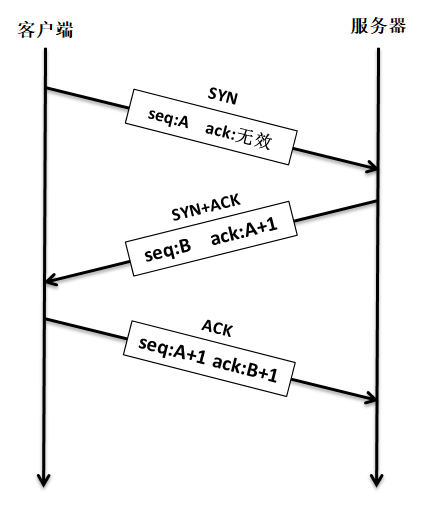

在完成握手后，客户端与服务器就建立了连接，同时双方都得到了彼此的窗口大小，序列号等信息，在传输 TCP 报文段的时候，每个 TCP 报文段首部的 SYN 标志都会被置 0，因为它只用于发起连接，同步序号。

#### 37.8 TCP 终止连接

建立一个连接需要三次握手，而终止一个连接要经过四次挥手（有一些书上也会称为“四次握手”），这由 TCP 的特性造成的，因为 TCP 连接是全双工连接的服务，因此每个方向上的连接必须单独关闭。当一端完成它的数据发送任务后就能发送一个 FIN 报文段（可以称之为终止连接请求，其实就是 FIN 标志位被设置为1）来终止这个方向上的连接。另一端收到一个 FIN 报文段，它必须通知应用层对方已经终止了那个方向的连接，发送 FIN 报文段通常是应用层进行关闭的结果。

> [!caution]
>
> 客户端发送一个 FIN 报文段只意味着在这一方向上没有数据流动，一个 TCP 连接在发送一个 FIN 后仍能接收数据，但是在实际应用中只有很少的 TCP 应用程序这样做。

“**四次挥手**” 终止连接具体过程如下：

1. 客户端发出一个 FIN 报文段主动进行关闭连接，此时报文段的 ==FIN 标志位为 1==，假设==序号为 C==，一般来说 ==ACK 标志也会被置 1==，但==确认序号字段是无效==的。
2. 当服务器收到这个 FIN 报文段，它发回一个 ACK 报文段（此报文段是终止连接应答），==确认序号为收到的序号加 1（C+1）==，和 SYN 一样，一个 FIN 将占用一个序号，此时断开客户端 -> 服务器的方向连接。
3. 服务器会向应用程序请求关闭与这个客户端的连接，接着服务器就会发送一个 FIN 报文段（这个报文段是服务器向客户端发出，请求终止连接），此时假设==序号为 D==，==ACK 标志虽然也为 1==，但是==确认序号字段是无效==的。
4. 客户端返回一个 ACK 报文段来确认终止连接的请求，==ACK 标志置 1==，并将==确认序号设置为收到序号加 1（D+1）==，此时断开服务器 -> 客户端的方向连接。

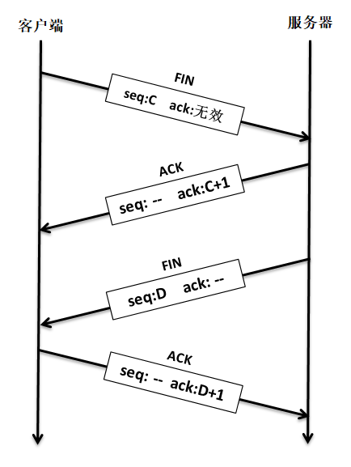

#### 37.9 TCP 状态

TCP 协议根据连接时接收到报文的不同类型，采取相应动作也不同，还要处理各个状态的关系，如收到握手报文时候、超时的时候、用户主动关闭的时候等都需要不一样的状态去采取不一样的处理。

TCP 协议的状态如下：

- *LISTENING* 状态：提供某种服务，侦听远方 TCP 端口的连接请求，当提供的服务没有被连接时，处于 *LISTENING* 状态，端口是开放的，等待被连接。
- *SYN_SENT* (客户端状态)：客户端调用 `connect()` 函数，将会发送一个 SYN 请求建立一个连接，在发送连接请求后等待匹配的连接请求，此时状态为 *SYN_SENT*。
- *SYN_RECEIVED* (服务端状态)：在收到和发送一个连接请求后，等待对方对连接请求的确认，当服务器收到客户端发送的同步信号时，将标志位 ACK 和 SYN 置 1 发送给客户端，此时服务器端处于 *SYN_RCVD* 状态，如果连接成功了就变为  *ESTABLISHED*，正常情况下 *SYN_RCVD* 状态非常短暂。
- *ESTABLISHED* 状态：这个状态是处于稳定连接状态，建立连接的 TCP 协议两端的主机都是处于这个状态，它们相互知道彼此的窗口大小、序列号、最大报文段等信息。
- *FIN_WAIT_1* 与 *FIN_WAIT_2* 状态：处于这个状态一般都是单向请求终止连接，然后主机等待对方的回应，而如果对方产生应答，则主机状态转移为 *FIN_WAIT_2*，此时 {主机-> 对方} 方向上的 TCP 连接就断开，但是 {对方-> 主机} 方向上的连接还是存在的。此处有一个注意的地方：如果主机处于 *FIN_WAIT_2* 状态，说明主机已经发出了 FIN 报文段，并且对方也已对它进行确认，除非主机是在实行半关闭状态，否则将等待对方主机的应用层处理关闭连接，因为对方已经意识到它已收到 FIN 报文段，它需要主机发一个 FIN 来关闭 {对方->主机} 方向上的连接。只有当另一端的进程完成这个关闭，主机这端才会从*FIN_WAIT_2* 状态进入*TIME_WAIT* 状态。否则这意味着主机这端可能永远保持这个 *FIN_WAIT_2* 状态，另一端的主机也将处于 *CLOSE_WAIT* 状态，并一直保持这个状态直到应用层决定进行关闭。
- *CLOSE-WAIT* 状态：等待从本地用户发来的连接中断请求，被动关闭端 TCP 接到 FIN 后，就发出 ACK 以回应 FIN 请求(它的接收也作为文件结束符传递给上层应用程序), 并进入 *CLOSE_WAIT*.
- *TIME_WAIT* 状态：*TIME_WAIT* 状态也称为 2MSL 等待状态。每个具体 TCP 连接的实现必须选择一个 TCP 报文段最大生存时间 MSL（Maximum Segment Lifetime），如 IP 数据报中的 TTL 字段，表示报文在网络中生存的时间，它是任何报文段被丢弃前在网络内的最长时间，这个时间是有限的，<u>为什么需要等待呢？</u>我们知道 IP 数据报是不可靠的，而 TCP 报文段是封装在 IP 数据报中，TCP 协议必须保证发出的 ACK 报文段是正确被对方接收，因此处于该状态的主机必须在这个状态停留最长时间为 2 倍的 MSL，以防最后这个 ACK 丢失，因为 TCP 协议必须保证数据能准确送达目的地。

讲了那么多理论，下面就结合图文来详解一下 TCP 协议在建立连接与终止连接的时候所有的状态转移处理是怎么样的，具体见下图：

> [!important]
>
> 对图中的补充说明（很重要，要牢牢记住）:
>
> - 虚线：表示服务器的状态转移。
> - 实线：表示客户端的状态转移。
> - 图中所有 “关闭”、“打开” 都是应用程序主动处理。
> - 图中所有的 “超时” 都是内核超时处理。

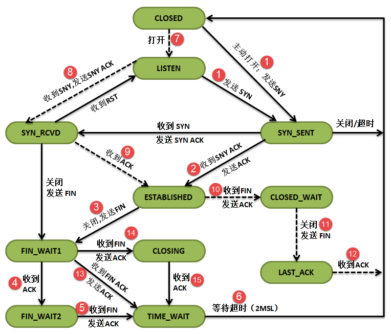

**三次握手**过程：

1. 图中 (7)：服务器的应用程序主动使服务器进入监听状态，等待客户端的连接请求。
2. 图中 (1)：首先客户端的应用程序会主动发起连接，发送 SNY 报文段给服务器，在发送之后就进入 SYN_SENT 状态等待服务器的 SNY ACK 报文段进行确认，如果在指定超时时间内服务器不进行应答确认，那么客户端将关闭连接。
3. 图中 (8)：处于监听状态的服务器收到客户端的连接请求（SNY 报文段），那么服务器就返回一个 SNY ACK 报文段应答客户端的响应，并且服务器进入 SYN_RCVD 状态。
4. 图中 (1)：如果客户端收到了服务器的 SNY ACK 报文段，那么就进入 ESTABLISHED 稳定连接状态，并向服务器发送一个 ACK 报文段。
5. 图中(9)：同时，服务器收到来自客户端的 ACK 报文段，表示连接成功，进入 ESTABLISHED 稳定连接状态，这正是我们建立连接的三次握手过程。

**四次挥手**过程：

1. 图中 (3)：一般来说，都是客户端主动发送一个 FIN 报文段来终止连接，此时客户端从 ESTABLISHED 稳定连接状态转移为 FIN_WAIT_1 状态，并且等待来自服务器的应答确认。
2. 图中 (10)：服务器收到 FIN 报文段，知道客户端请求终止连接，那么将返回一个 ACK 报文段到客户端确认终止连接，并且服务器状态由稳定状态转移为 CLOSE_WAIT 等待终止连接状态。
3. 图中 (4)：客户端收到确认报文段后，进入 FIN_WAIT_2 状态，等待来自服务器的主动请求终止连接，此时 {客户端-> 服务器} 方向上的连接已经断开。
4. 图中 (11)：一般来说，当客户端终止了连接之后，服务器也会终止 {服务器-> 客户端} 方向上的连接，因此服务器的原因程序会主动关闭该方向上的连接，发送一个 FIN 报文段给客户端。
5. 图中 (5)：处于 FIN_WAIT_2 的客户端收到 FIN 报文段后，发送一个 ACK 报文段给服务器。
6. 图中 (12)：服务器收到 ACK 报文段，就直接关闭，此时 {服务器-> 客户端} 方向上的连接已经终止，进入 CLOSED 状态。
7. 图中 (6)：客户端还会等待 2MSL，以防 ACK 报文段没被服务器收到，这就是四次挥手的全部过程。

> [!note]
>
> (13)(14)(15) 的这些状态都是一些比较特殊的状态，暂时就不讲解了，总的来说都是一样的。

上面讲解了那么多内容，其实是非常非常简单非常非常基础的，具体还有更多 TCP 协议的特点需要自行去看对应的专业书籍。

### 38. 套接字

还记不记得在消息队列章节中提到的一段话：

> Linux 下的进程通信手段基本上是从 Unix 平台上的进程通信手段继承而来的。而对 Unix 发展做出重大贡献的两大主力AT&T 的贝尔实验室及 BSD（加州大学伯克利分校的伯克利软件发布中心）在进程间通信方面的侧重点有所不同；前者对 Unix 早期的进程间通信手段进行了系统的改进和扩充，形成了 ”system V IPC”，通信进程局限在单个计算机内（同一个设备的不同进程间通信）；而后者则跳过了该限制，形成了基于套接字（Socket）的进程间通信机制（多用于不同设备的进程间通信）。Linux 则把两者继承了下来，所以说 Linux 才是最成功的，既有 ”systemV IPC”，又支持 Socket。

那么很显然，我们前面的文章讲解了单个计算机内的进程间通信，所有的机制都依靠一台计算机系统的共享资源实现，这里的资源可以是文件系统空间、共享的物理内存或消息队列，但只有运行在同一台机器上的进程才能使用它们，很显然这种方式并不满足我们想要的，我们可能会想让这个设备与另一个设备进行通信，接下来就要讲解用于不同设备的进程间通信——基于套接字（Socket）的进程间通信机制，当然 Socket 也能支持在一个设备上的进程间通信，而不仅仅只是不同设备之间的。

在上一节也简单了解了网络中的 UDP 与 TCP 协议，这一节就是通过套接字进行通信。

#### 38.1 Socket 简介

套接字（socket）是一种通信机制，凭借这种机制，客户端 <-> 服务器模型的通信方式既可以在本地设备上进行，也可以跨网络进行。套接字的创建和使用与管道是有区别的，因为==套接字明确地将客户端、服务器区分开来==，而且==套接字机制可以实现将多个客户连接到一个服务器==。

Socket 英文原意是 “孔” 或者 “插座” 的意思，在网络编程中，通常将其称之为 “套接字”，当前网络中的主流程序设计都是使用  Socket 进行编程的，因为它简单易用，它还是一个标准（BSD Socket），能在不同平台很方便移植，比如你的一个应用程序是基于 Socket 编程的，那么它可以移植到任何实现 BSD Socket 标准的平台，比如 LwIP，它兼容 BSD Socket；又比如 Windows，它也实现了一套基于 Socket 的套接字接口，更甚至在国产操作系统中，如 RT-Thread，它也实现了 BSD Socket 标准的 Socket 接口。

在 Socket 中，它使用一个套接字来记录网络的一个连接，套接字是一个整数，就像我们操作文件一样，利用一个文件描述符，可以对它打开、读、写、关闭等操作，类似的，在网络中，我们也可以对 Socket 套接字进行这样子的操作，比如开启一个网络的连接、读取连接主机发送来的数据、向连接的主机发送数据、终止连接等操作。

来了解一下套接字描述符，它跟我们的文件描述符非常像，其实==就是一个整数==，套接字 API 最初是作为 UNIX 操作系统的一部分而开发的，所以套接字 API 与系统的其他 I/O 设备集成在一起。当应用程序要为网络通信而创建一个套接字（socket）时，操作系统就返回一个整数作为描述符（descriptor）来标识这个套接字。然后，<u>应用程序以该描述符作为传递参数，通过调用 Socket API 接口的函数来完成某种操作</u>（例如通过网络传送数据或接收输入的数据）。

接下来讲解 Linux 系统中的套接字相关的函数，但注意要包含网络编程中常用的头文件：

```c
#include <sys/types.h>
#include <sys/socket.h>
```

#### 38.2 套接字相关的函数

##### 38.2.1 socket()

函数原型：

```c
int socket(int domain, int type, int protocol);
```

`socket()` 函数用于创建一个 socket 描述符（socket descriptor），它唯一标识一个 socket，这个 socket 描述符跟文件描述符一样，后续的操作都有用到它，把它作为参数，通过它来进行一些读写操作。

创建 socket 的时候，也可以指定不同的参数创建不同的 socket 描述符，`socket` 函数的三个参数分别为：

1. `domain`：参数 `domain` 表示该套接字使用的协议族，在 Linux 系统中支持多种协议族，对于 TCP/IP 协议来说，选择*AF_INET* 就足以，当然如果你的 IP 协议的版本支持 IPv6，那么可以选择 *AF_INET6*，可选的协议族具体见：
    - AF_UNIX, AF_LOCAL：本地通信
    - AF_INET ：IPv4
    - AF_INET6 ：IPv6
    - AF_IPX ：IPX - Novell 协议
    - AF_NETLINK ：内核用户界面设备
    - AF_X25 ：ITU-T X.25 / ISO-8208 协议
    - AF_AX25 ：业余无线电 AX.25 协议
    - AF_ATMPVC ：访问原始 ATM PVC
    - AF_APPLETALK ：AppleTalk
    - AF_PACKET ：底层数据包接口
    - AF_ALG ：内核加密 API 的 AF_ALG 接口
2. `type`：参数 `type` 指定了套接字使用的服务类型，可能的类型有以下几种：
    - SOCK_STREAM：提供==可靠的==（即能保证数据正确传送到对方）==面向连接的== Socket 服务，多用于资料（如文件）传输，如 TCP 协议。
    - SOCK_DGRAM：是提供==无保障的====面向消息的== Socket 服务，主要用于在网络上发广播信息，如 UDP 协议，提供无连接不可靠的数据报交付服务。
    - SOCK_SEQPACKET：为固定最大长度的数据报提供有序的，可靠的，基于双向连接的数据传输路径。
    - SOCK_RAW：表示原始套接字，它允许应用程序访问网络层的原始数据包，这个套接字用得比较少，暂时不用理会它。
    - SOCK_RDM：提供不保证排序的可靠数据报层。
3. `protocol`：参数 `protocol` 指定了套接字使用的协议，在 IPv4 中，只有 TCP 协议提供 SOCK_STREAM 这种可靠的服务，只有 UDP 协议提供 SOCK_DGRAM 服务，对于这两种协议，`protocol` 的值均为 0，因为当 `protoco`l 为 0 时，会自动选择 `type` 类型对应的默认协议。

当创建套接字成功的时候，该函数返回一个 `int` 类型的值，也就是 socket 描述符，该值大于等于 0；而如果创建套接字失败时则返回 -1。

##### 38.2.2 bind()

函数原型：

```c
int bind(int sockfd, struct sockaddr *my_addr, socklen_t addrlen);
```

在套接口中，一个套接字只是用户程序与内核交互信息的枢纽，它自身没有太多的信息，也没有网络协议地址和端口号等信息，在进行网络通信的时候，必须把一个套接字与一个 IP 地址或端口号相关联，这个过程就是绑定的过程。

`bind()` 函数用于将一个 IP 地址或端口号与一个套接字进行绑定。许多时候内核会帮我们自动绑定一个 IP 地址与端口号，然而有时用户可能需要自己来完成这个绑定的过程，以满足实际应用的需要，最典型的情况是<u>一个服务器进程需要绑定一个众所周知的地址和端口以等待客户来连接，作为服务器端，这一步绑定的操作是必要的</u>，而作为客户端，则不是必要的，因为内核会帮我们自动选择合适的 IP 地址与端口号。

> [!NOTe]
>
> `bind()` 函数并不是总是需要调用的，只有用户进程想与一个具体的地址或端口相关联的时候才需要调用这个函数。如果用户进程没有这个需要，那么程序可以依赖内核的自动的选址机制来完成自动地址选择。

参数：

- `sockfd`：`sockfd` 是由 `socket()` 函数返回的套接字描述符。
- `my_addr`：`my_addr` 是一个指向套接字地址结构的指针。
- `addrlen`：`addrlen` 指定了以 `addr` 所指向的地址结构体的字节长度。

若 `bind()` 函数绑定成功则返回 0，若出错则为 -1。

`sockaddr` 结构体：

```c
struct sockaddr {
	sa_family_t sa_family;
	char sa_data[14];
}
```

咋一看这个结构体，好像没啥信息要我们填写的，确实也是这样子，我们需要填写的 IP 地址与端口号等信息，都在 `sa_data` 连续的 14 字节信息里面，但这个结构体对用户操作不友好，一般我们在使用的时候都会使用 `sockaddr_in` 结构体，`sockaddr_in` 和 `sockaddr` 是并列的结构（占用的空间是一样的），指向 `sockaddr_in` 的结构体的指针也可以指向 `sockadd` 的结构体，并代替它，而且 `sockaddr_in` 结构体对用户将更加友好，在使用的时候进行类型转换就可以了。

`sockaddr_in` 结构体：

```c
struct sockaddr_in {
	short int sin_family; 			/* 协议族*/
	unsigned short int sin_port; 	 /* 端口号*/
	struct in_addr sin_addr; 		/* IP 地址*/
	unsigned char sin_zero[8];       /* sin_zero 是为了让 sockaddr 与 sockaddr_in 
	                                    两个数据结构体保持大小相同而保留的空字节*/
};
```

`sockaddr_in` 结构体的第一个字段是与 `sockaddr` 结构体是一致的，而剩下的字段就是 `sa_data` 连续的 14 字节信息里面的内容，只不过重新定义了成员变量而已，`sin_port` 字段是我们需要填写的端口号信息，`sin_addr` 字段是我们需要填写的 IP 地址信息，剩下 `sin_zero` 区域的 8 字节保留未用。

举个简单的使用实例：

```c
struct sockaddr_in server;
bzero(&server, sizeof(server));

// assign IP, PORT
server.sin_family = AF_INET;
server.sin_addr.s_addr = htonl(INADDR_ANY);
server.sin_port = htons(6666);

// binding newly created socket to given IP and verification
bind(sockfd, (struct sockaddr*)&server, sizeof(server));
```

##### 38.2.3 connect()

函数原型：

```c
int connect(int sockfd, const struct sockaddr *addr, socklen_t addrlen);
```

这个 `connect()` 函数==用于客户端中==，将 `sockfd` 与远端 IP 地址、端口号进行绑定，在 TCP 客户端中调用这个函数将发生握手过程（会发送一个 TCP 连接请求），并最终建立一个 TCP 连接，而对于 UDP 协议来说，调用这个函数只是在 `sockfd` 中记录远端 IP 地址与端口号，而不发送任何数据，参数信息与 `bind()` 函数是一样的。

函数调用成功则返回 0，失败返回 -1，错误原因存于 `errno` 中。

`connect()` 函数是套接字连接操作，对于 TCP 协议来说，`connect()` 函数操作成功之后代表对应的套接字已与远端主机建立了连接，可以发送与接收数据。

对于 UDP 协议来说，没有连接的概念，在这里可将其描述为记录远端主机的 IP 地址与端口号，UDP 协议经过 `connect()` 函数调用成功之后，在通过 `sendto()` 函数发送数据报时不需要指定目的地址、端口，因为此时已经记录到了远端主机的 IP 地址与端口号。UDP 协议还可以给同一个套接字进行多次 `connect()` 操作，而TCP 协议不可以，TCP 只能指定一次 `connect` 操作。

##### 38.2.4 listen()

`listen()` 函数==只能在 TCP 服务器进程中使用==，让服务器进程进入监听状态，等待客户端的连接请求，`listen()` 函数<u>一般在 `bind()` 函数之后调用，在 `accept()` 函数之前调用</u>，它的函数原型是：

```c
int listen(int s, int backlog);
```

参数：

- `sockfd`：`sockfd` 是由 `socket()` 函数返回的套接字描述符。
- `backlog`：用来描述 `sockfd` 的==等待连接队列能够达到的最大值==。在服务器进程正处理客户端连接请求的时候，可能还存在其它的客户端请求建立连接，因为 TCP 连接是一个过程，由于同时尝试连接的用户过多，使得服务器进程无法快速地完成所有的连接请求，那怎么办呢？直接丢掉其他客户端的连接肯定不是一个很好的解决方法。因此内核会在自己的进程空间里维护一个队列，这些连接请求就会被放入一个队列中，服务器进程会按照先来后到的顺序去处理这些连接请求，这样的一个队列内核不可能让其任意大，所以必须有一个大小的上限，这个 `backlog` 告诉内核使用这个数值作为队列的上限。而当一个客户端的连接请求到达并且该队列为满时，客户端可能会收到一个表示连接失败的错误，本次请求会被丢弃不作处理。

##### 38.2.5 accept()

函数原型：

```c
int accept(int s, struct sockaddr *addr, socklen_t *addrlen);
```

为了能够正常让 TCP 客户端能正常连接到服务器，服务器必须遵循以下流程处理：

1. 调用 `socket()` 函数创建对应的套接字类型。
2. 调用 `bind()` 函数将套接字绑定到本地的一个端口地址。
3. 调用 `listen()` 函数让服务器进程进入监听状态，等待客户端的连接请求。
4. 调用 `accept()` 函数处理到来的连接请求。

`accept()` 函数==用于 TCP 服务器==中，等待着远端主机的连接请求，并且建立一个新的 TCP 连接，<u>在调用这个函数之前需要通过调用 `listen()` 函数让服务器进入监听状态</u>，如果队列中没有未完成连接套接字，并且套接字没有标记为非阻塞模式，`accept()` 函数的调用会阻塞应用程序直至与远程主机建立 TCP 连接；如果一个套接字被标记为非阻塞式而队列中没有未完成连接套接字, 调用 `accept()` 函数将立即返回 EAGAIN。

所以，`accept()` 函数就是用于处理连接请求的，它会从未完成连接队列中取出第一个连接请求，建一个和参数 `s` 属性相同的连接套接字，并为这个套接字分配一个文件描述符, 然后以这个描述符返回，新创建的描述符不再处于监听状态，原套接字 `s` 不受此调用的影响，还是会处于监听状态，因为 `s` 是由 `socket()` 函数创建的，而处理连接时 `accept()` 函数会创建另一个套接字。

参数 `addr` 用来返回已连接的客户端的 IP 地址与端口号，参数 `addrlen` 用于返回 `addr` 所指向的地址结构体的字节长度，如果我们对客户端的 IP 地址与端口号不感兴趣，可以把 `arrd` 和 `addrlen` 均置为空指针。

若连接成功则返回一个 socket 描述符（非负值），若出错则为 -1。

##### 38.2.6 read()

一旦客户端与服务器建立好 TCP 连接之后，我们就可以通过 sockfd 套接字描述符来收发数据，这与我们读写文件是差不多的操作，接收网络中的数据函数可以是 `read()`、`recv()`、`recvfrom()` 等。

函数原型：

```c
ssize_t read(int fd, void *buf, size_t count);
ssize_t recv(int sockfd, void *buf, size_t len, int flags);
ssize_t recvfrom(int sockfd, void *buf, size_t len, int flags,
                 struct sockaddr *src_addr, socklen_t *addrlen);
```

> [!tip]
>
> `ssize_t` 它表示的是 `signed size_t` 类型。

`read()` 从描述符 `fd` （描述符可以是文件描述符也可以是套接字描述符，本章主要讲解套接字，此处 `fd` 为套接字描述符）中读取 `count` 字节的数据并放入从 `buf` 开始的缓冲区中，`read()` 函数调用成功返回读取到的字节数，此返回值受文件剩余字节数限制，当返回值小于指定的字节数时并不意味着错误；这可能是因为当前可读取的字节数小于指定的字节数（比如已经接近文件结尾，或者正在从管道或者终端读取数据，或者 `read()` 函数被信号中断等），出错返回 -1 并设置 `errno`，如果在调 `read` 之前已到达文件末尾，则这次 `read` 返回 0。

参数：

- `fd`：在 socket 编程中是指定套接字描述符。
- `buf`：指定存放数据的地址。
- `count`：是指定读取的字节数，将读取到的数据保存在缓冲区 `buf` 中。

错误代码：

- EINTR：在读取到数据前被信号所中断。
- EAGAIN：使用 O_NONBLOCK 标志指定了非阻塞式输入输出，但当前没有数据可读。
- EIO：输入输出错误，可能是正处于后台进程组进程试图读取其控制终端，但读操作无效，或者被信号 SIGTTIN 所阻塞, 或者其进程组是孤儿进程组，也可能执行的是读磁盘或者磁带机这样的底层输入输出错误。
- EISDIR：`fd` 指向一个目录。
- EBADF：`fd` 不是一个合法的套接字描述符，或者不是为读操作而打开。
- EINVAL：`fd` 所连接的对象不可读。
- EFAULT：`buf` 超出用户可访问的地址空间。

##### 38.2.7 recv()

函数原型：

```c
ssize_t recv(int sockfd, void *buf, size_t len, int flags);
```

不论是客户端还是服务器应用程序都可以用 `recv()` 函数从 TCP 连接的另一端接收数据，它与 `read()` 函数的功能是差不多的。

`recv()` 函数会先检查套接字 `s` 的接收缓冲区，如果 `s` 接收缓冲区中没有数据或者协议正在接收数据，那么 `recv` 就一直等待，直到协议把数据接收完毕。当协议把数据接收完毕，`recv()` 函数就把 `s` 的接收缓冲中的数据拷贝到 `buf` 中，但是要注意的是议接收到的数据可能大于 `buf` 的长度，所以在这种情况下要调用几次 `recv()` 函数才能把 `s` 的接收缓冲中的数据拷贝完。`recv()` 函数仅仅是拷贝数据，真正的接收数据是由协议来完成的，`recv` 函数返回其实际拷贝的字节数。如果 `recv()` 函数在拷贝时出错，那么它返回 SOCKET_ERROR；如果 `recv()` 函数在等待协议接收数据时网络中断了，那么它返回 0。

参数：

- `sockfd`：指定接收端套接字描述符。
- `buf`：指定一个接收数据的缓冲区，该缓冲区用来存放 `recv()` 函数接收到的数据。
- `len`：指定 `recv()` 函数拷贝的数据长度。
- 参数 `flags` 一般设置为 0 即可，其他数值定义如下:
    - MSG_OOB：接收以 `out-of-band` 送出的数据。
    - MSG_PEEK：保持原有数据，就是说接收到的数据并不会被删除, 如果再调用 `recv()` 函数还会拷贝相同的数据到 `buf `中。
    - MSG_WAITALL：强迫接收到指定 `len` 大小的数据后才能返回, 除非有错误或信号产生。
    - MSG_NOSIGNAL：`recv()` 函数不会被 SIGPIPE 信号中断，返回值成功则返回接收到的字符数, 失败返回 -1，错误原因存于 `errno` 中。

错误代码：

- EBADF：`fd` 不是一个合法的套接字描述符，或者不是为读操作而打开。
- EFAULT：`buf` 超出用户可访问的地址空间。
- ENOTSOCK：参数 `s` 为一文件描述词, 非 socket。
- EINTR：在读取到数据前被信号所中断。
- EAGAIN：此动作会令进程阻塞, 但参数 `s`  的 socket 为不可阻塞。
- ENOBUFS：`buf` 内存空间不足。
- ENOMEM：内存不足。
- EINVAL：传入的参数不正确。

##### 38.2.8 write()

函数原型：

```c
ssize_t write(int fd, const void *buf, size_t count);
```

`write()` 函数一般用于处于稳定的 TCP 连接中传输数据，当然也能用于 UDP 协议中，它向套接字描述符 `fd` 中写入 `count` 字节的数据，数据起始地址由 `buf` 指定，函数调用成功返回写的字节数，失败返回 -1，并设置 `errno` 变量。

在网络编程中，当我们向套接字描述符写数据时有两种可能：

1. `write()` 函数的返回值大于 0，表示写了部分数据或者是全部的数据，这样我们可以使用一个 `while` 循环不断的写入数据，但是循环过程中的 `buf` 参数和 `count` 参数是我们自己来更新的，也就是说，网络编程中写函数是不负责将全部数据写完之后再返回的，说不定中途就返回了！
2. 返回值小于 0，此时出错了，需要根据错误类型进行相应的处理。

所以一般我们处理写数据的时候都会自己封装一层，以保证数据的正确写入：

```c
/* Write "n" bytes to a descriptor. */
ssize_t writen(int fd, const void *vptr, size_t n)
{
    size_t nleft;       // 剩余要写的字节数
	ssize_t nwritten;  // 已经写的字节数
	const char *ptr;   // write 的缓冲区
    
	ptr = vptr;       // 把传参进来的 write 要写的缓冲区备份一份
	nleft = n;       // 还剩余需要写的字节数初始化为总共需要写的字节数
    
    //检查传参进来的需要写的字节数的有效性
	while (nleft > 0) {
		if ( (nwritten = write(fd, ptr, nleft)) <= 0) { //把 ptr 写入 fd
			if (nwritten < 0 && errno == EINTR) //当 write 返回值小于0 且因为是被信号打断
				nwritten = 0; /* and call write() again */
		else
			return(-1); /* error 其他小于 0 的情况为错误 */
		}
   	
		nleft -= nwritten; //还剩余需要写的字节数 = 现在还剩余需要写的字节数 - 这次已经写的字节数
		ptr += nwritten;   //下次开始写的缓冲区位置 = 缓冲区现在的位置右移已经写了的字节数大小
	}
	return(n); //返回已经写了的字节数
}
```

> [!NOtE]
>
> 如果是比较简单的数据（比如单行数据）倒是不需要那么麻烦，直接调用 `write()` 也是完全没有问题的，只是看情况写代码就行了，上面代码的封装只是保证程序的健壮性。

> [!caution]
>
> 这个函数在写入数据完成后并不是立即发送的，至于什么时候发送则由 TCP/IP 协议栈决定。

##### 38.2.9 send()

函数原型：

```c
int send(int s, const void *msg, size_t len, int flags);
```

无论是客户端还是服务器应用程序都可以用 `send()` 函数来向 TCP 连接的另一端发送数据。

参数：

- `s`：指定发送端套接字描述符。
- `msg`：指定要发送数据的缓冲区。
- `len`：指明实际要发送的数据的字节数。
- `flags`：一般设置为 0 即可

当调用该函数时，`send()` 函数会先比较待发送数据的长度 `len` 和套接字 `s` 的发送缓冲的长度。如果 `len` 大于 `s` 的发送缓冲区的长度，该函数返回 SOCKET_ERROR；如果 `len` 小于或者等于 `s` 的发送缓冲区的长度，那么 `send()` 函数先检查协议是否正在发送 `s` 的发送缓冲中的数据，如果是就等待协议把数据发送完，如果协议还没有开始发送 `s` 的发送缓冲中的数据或者 `s` 的发送缓冲中没有数据，那么 `send()` 函数就比较 `s` 的发送缓冲区的剩余空间和 `len`。如果 `len` 大于剩余空间大小，`send()` 函数就一直等待协议把 `s` 的发送缓冲中的数据发送完。如果 `len` 小于剩余空间大小，`send()`函数就仅仅把 `buf` 中的数据拷贝到 `s` 的发送缓冲区的剩余空间里。

如果 `send()` 函数拷贝数据成功，就返回实际 `copy` 的字节数，如果 `send()` 函数在拷贝数据时出现错误，那么 `send` 就返回 SOCKET_ERROR；如果 `send` 在等待协议传送数据时网络断开的话，那么 `send` 函数也返回 SOCKET_ERROR。

> [!caution]
>
> `send()` 函数把 `buf` 中的数据成功拷贝到 `s` 的发送缓冲的剩余空间里后它就返回了，但是此时这些数据并不一定马上被传到连接的另一端。

##### 38.2.10 sendto

函数原型：

```c
int sendto(int s, const void *msg, size_t len, int flags, const struct sockaddr *to, socklen_t tolen);
```

`sendto()` 函数与 `send` 函数非常像，但是它会通过 `struct sockaddr` 指向的 `to` 结构体指定要发送给哪个远端主机，在 `to` 参数中需要指定远端主机的 IP 地址、端口号等，而 `tolen` 参数则是指定 `to` 结构体的字节长度。

##### 38.2.11 close()

函数原型：

```c
int close(int fd);
```

`close()` 函数是用于关闭一个指定的套接字，在关闭套接字后，将无法使用对应的套接字描述符，这个函数比较简单，当你不需要使用某个套接字描述符时，就将其关闭即可，在 UDP 协议中，`close` 会释放一个套接字描述符的资源；而在 TCP 协议中，当调用 `close()` 函数后将发起 “**四次挥手**”终止连接，当连接正式终止后，套接字描述符的资源才会被释放。

##### 38.2.12 ioctlsocket()

函数原型：

```c
int ioctlsocket( int s, long cmd, u_long *argp);
```

该函数用于获取与设置套接字相关的操作参数。

参数：

- `s`：指定要操作的套接字描述符。
- `cmd`：对套接字 `s` 的操作命令。
    - FIONBIO：命令用于允许或禁止套接字的非阻塞模式。在这个命令下，`argp` 参数指向一个无符号长整型，如果该值为 0 则表示禁止非阻塞模式，而如果该值非 0 则表示允许非阻塞模式。当创建一个套接字的时候，它就处于阻塞模式，也就是说非阻塞模式被禁止，这种情况下所有的发送、接收函数都会是阻塞的，直至发送、接收成功才得以继续运行；而如果是非阻塞模式下，所有的发送、接收函数都是不阻塞的，如果发送不出去或者接收不到数据，将直接返回错误代码给用户，这就需要用户对这些“意外”情况进行处理，保证代码的健壮性。
    - FIONREAD：FIONREAD 命令确定套接字 `s` 自动读入的数据量，这些数据已经被接收，但应用线程并未读取的，所以可以使用这个函数来获取这些数据的长度，在这个命令状态下，`argp` 参数指向一个无符号长整型，用于保存函数的返回值（即未读数据的长度）。如果套接字是 SOCK_STREAM 类型，则 FIONREAD 命令会返回 `recv()` 函数中所接收的所有数据量，这通常与在套接字接收缓存队列中排队的数据总量相同；而如果套接字是 SOCK_DGRAM 类型的，则 FIONREAD 命令将返回在套接字接收缓存队列中排队的第一个数据包大小。
    - SIOCATMARK：确认是否所有的带外数据都已被读入。
- `argp`：指向 `cmd` 命令所带参数的指针。

该函数使用示例：

```c
// 控制为阻塞模式。
u_long mode = 0;
ioctlsocket(s, FIONBIO, &mode);

// 控制为非阻塞模式。
u_long mode = 1;
ioctlsocket(s, FIONBIO, &mode);
```

##### 38.2.13 getsockopt(), setsockopt()

函数原型：

```c
int getsockopt(int sockfd, int level, int optname,
               void *optval, socklen_t *optlen);
```

```c
int setsockopt(int sockfd, int level, int optname,
               const void *optval, socklen_t optlen);
```

看名字就知道，这两个函数是用于获取/设置套接字的一些选项的，参数 `level` 有多个常见的选项，如：

- SOL_SOCKET：表示在 Socket 层。
- IPPROTO_TCP：表示在 TCP 层。
- IPPROTO_IP：表示在 IP 层。

参数 `optname` 表示该层的具体选项名称，比如：

- 对于 SOL_SOCKET 选项，可以是 
    - SO_REUSEADDR（允许重用本地地址和端口）
    - SO_SNDTIMEO（设置发送数据超时时间）
    - SO_SNDTIMEO（设置接收数据超时时间）
    - SO_RCVBUF（设置发送数据缓冲区大小)
    - …
- 对于 IPPROTO_TCP 选项，可以是
    - TCP_NODELAY（不使用Nagle 算法）
    - TCP_KEEPALIVE（设置TCP 保活时间）
    - …
- 对于 IPPROTO_IP 选项，可以是
    - IP_TTL（设置生存时间）
    - IP_TOS（设置服务类型）
    - …

#### 38.3 TCP 客户端实验

本小节就通过 socket API 函数去实现一个 TCP 客户端，代码的步骤首先是与服务器建立连接，然后在客户端中输入一些数据并且将它发送到服务器，最后在数据发送完毕后就终止连接，由于 TCP 协议的模型是*客户端<-> 服务器*，因此我们在下一小节还会实现一个 TCP 服务器，两个进程间相互通信。

首先明确一下整个客户端的流程步骤：

1. 调用 `socket()` 函数创建一个套接字描述符。
2. 调用 `connect()` 函数连接到指定服务器中，端口号为服务器监听的端口号。
3. 调用 `write()` 函数发送数据。
4. 调用 `close()` 函数终止连接。

TCP 客户端代码：

```c
// path: base_linux/socket/tcp/sources/client.c
#include <stdio.h>
#include <stdlib.h>
#include <string.h>
#include <unistd.h>
#include <errno.h>
#include <sys/types.h>
#include <sys/socket.h>
#include <netinet/in.h>
#include <arpa/inet.h>
#include <netdb.h>

#define HOST "192.168.0.217"   // 根据你服务器的 IP 地址修改
#define PORT 6666              // 根据你服务器进程绑定的端口号修改
#define BUFFER_SIZ (4 * 1024)  // 4k 的数据区域

int main(void)
{
	int sockfd, ret;
	struct sockaddr_in server;
	char buffer[BUFFER_SIZ]; //用于保存输入的文本
    
	// 创建套接字描述符
	if ((sockfd = socket(AF_INET, SOCK_STREAM, 0)) == -1) {
		printf("create an endpoint for communication fail!\n");
		exit(1);
	}
    
	bzero(&server, sizeof(server));
	server.sin_family = AF_INET; 
    server.sin_port = htons(PORT);
	server.sin_addr.s_addr = inet_addr(HOST);
    
	// 建立TCP 连接
	if (connect(sockfd, (struct sockaddr *)&server, sizeof(struct sockaddr)) == -1) {
		printf("connect server fail...\n");
		close(sockfd);
		exit(1);
	}
    
	printf("connect server success...\n");
    
    while (1) 
    {
		printf("please enter some text: ");
		fgets(buffer, BUFFER_SIZ, stdin);
        
		//输入了end，退出循环（程序）
		if(strncmp(buffer, "end", 3) == 0)
			break;
		write(sockfd, buffer, sizeof(buffer));
	}
    
	close(sockfd);
	exit(0);
}
```

#### 38.4 TCP 服务器实验

接着我们实现一个服务器代码，接受客户端的连接，并且将来自客户端的数据打印到终端中。

服务器的代码流程如下：

1. 调用 `socket()` 函数创建一个套接字描述符。
2. 调用 `bind()` 函数绑定监听的端口号。
3. 调用 `listen()` 函数让服务器进入监听状态。
4. 调用 `accept()` 函数处理来自客户端的连接请求。
5. 调用 `read()` 函数接收客户端发送的数据。
6. 调用 `close()` 函数终止连接。

TCP 服务端代码：

```c
// path: base_linux/socket/tcp/sources/server.c
#include <stdio.h>
#include <netdb.h>
#include <unistd.h>
#include <netinet/in.h>
#include <stdlib.h>
#include <string.h>
#include <sys/socket.h>
#include <sys/types.h>

#define MAX 10*1024
#define PORT 6666

int main()
{
	char buff[MAX];
	int n;
    int sockfd, connfd, len;
	struct sockaddr_in server, client;
    
	// socket create and verification
	sockfd = socket(AF_INET, SOCK_STREAM, 0);
	if (sockfd == -1) {
		printf("socket creation failed...\n");
		exit(0);
	}
    
    printf("socket successfully created..\n");
	bzero(&server, sizeof(server));
    
    // assign IP, PORT
	server.sin_family = AF_INET;
	server.sin_addr.s_addr = htonl(INADDR_ANY);
	server.sin_port = htons(PORT);
    
    // binding newly created socket to given IP and verification
	if ((bind(sockfd, (struct sockaddr*)&server, sizeof(server))) != 0) {
		printf("socket bind failed...\n");
		exit(0);
	}
    
    printf("socket successfully binded..\n");
    
    // now server is ready to listen and verification
	if ((listen(sockfd, 5)) != 0) {
		printf("Listen failed...\n");
		exit(0);
	}
    
    printf("server listening...\n");
    
	len = sizeof(client);
    
    // accept the data packet from client and verification
	connfd = accept(sockfd, (struct sockaddr*)&client, &len);
	if (connfd < 0) {
		printf("server acccept failed...\n");
		exit(0);
	}
    
    printf("server acccept the client...\n");
    
    // infinite loop for chat
	while(1) {
		bzero(buff, MAX);
        
		// read the messtruct sockaddrge from client and copy it in buffer
		if (read(connfd, buff, sizeof(buff)) <= 0) {
			printf("client close...\n");
			close(connfd);
			break;
		}
        
		// print buffer which contains the client contents
		printf("from client: %s\n", buff);
        
		// if msg contains "Exit" then server exit and chat ended.
		if (strncmp("exit", buff, 4) == 0) {
			printf("server exit...\n");
			close(connfd);
			break;	
		}
	}

    // After chatting close the socket
	close(sockfd);
	exit(0);
}
```

#### 38.5 实验现象


## 三. Linux 驱动开发

> **参考书籍：** [[野火]《嵌入式Linux驱动开发实战指南—基于LubanCat RK系列板卡》](https://doc.embedfire.com/linux/rk356x/driver/zh/latest/index.html)
>
> **使用板卡：** LubanCat 4 RK3588S

### 1. 获取内核源码

#### 1.1 安装 git

```shell
sudo apt-get install git
```

#### 1.2 创建存放文件夹

```shell
mkdir LubanCat
cd LubanCat
```

#### 1.3 获取内核源码

##### 1.3.1 从GitHub获取

```shell
git clone -b develop-5.10 https://github.com/LubanCat/kernel.git
```

##### 1.3.2 从野火共享的网盘资料中获取压缩包

`LubanCat_Linux_rk3588_SDK_20240510.7z` 

1. 将压缩包下载到 windows 端之前设置的共享文件夹，在ubuntu中进入挂载目录进行拷贝

```shell
cd /mnt/hgfs/LinuxLearn
cp LubanCat_Linux_rk3588_SDK_20240510.7z ~/桌面/LubanCat/LubanCat4_RK3588_SDK
```

2. 安装 `7z`

```shell
sudo apt install p7zip-full
```

3. 进入拷贝目录，进行解压

```shell
cd ~/桌面/LubanCat/LubanCat4_RK3588_SDK
7z x LubanCat_Linux_rk3588_SDK_20240510.7z
```

4. 检出 `.repo` 目录下的 git 仓库

```shell
.repo/repo/repo sync -l
```

5. 进入 `kernel` 目录

```
ls
cd kernel
```

### 2. PC端编译内核

#### 2.1 获取编译工具链

```shell
cd ~/桌面/LubanCat
git clone https://github.com/LubanCat/gcc-linaro-6.3.1-2017.05-x86_64_aarch64-linux-gnu.git
```

导出环境变量

```shell
export PATH=~/桌面/LubanCat/gcc-linaro-6.3.1-2017.05-x86_64_aarch64-linux-gnu/bin:$PATH
```

查看编译工具链

```shell
aarch64-linux-gnu-gcc -v
```

#### 2.2 编译内核源码

1. 配置所需工具

- 安装 `make`

```shell
sudo apt-get update
sudo apt install make
```

- 安装 `GCC` 编译器

```shell
sudo apt-get install build-essential
```

- 创建符号链接 `python -> python3`

```shell
sudo ln -s /usr/bin/python3 /usr/bin/python
```

- 安装 `flex`

```shell
sudo apt-get install flex
```

- 安装 `bison`

```shell
sudo apt-get install bison
```

- 安装 `OpenSSL` 开发库

```shell
sudo apt-get install libssl-dev
```

2. 进入源码根目录

```shell
cd LubanCat/LubanCat4_RK3588_SDK/kernel
```

3. 清除之前生成的所有文件和配置

```shell
make mrproper
```

4. 加载 *lubancat_linux_rk3588_defconfig* 配置文件，rk3588 系列均是该配置文件

```shell
make ARCH=arm64 CROSS_COMPILE=aarch64-linux-gnu- lubancat_linux_rk3588_defconfig
```

5. 编译内核，指定交叉编译工具,使用 8 线程进行编译，线程可根据电脑性能自行确定

```shell
make ARCH=arm64 CROSS_COMPILE=aarch64-linux-gnu- -j8
```

### 8. Linux 设备树

Linux3.x 以后的版本才引入了设备树，设备树用于描述一个硬件平台的板级细节。

#### 8.1 设备树简介

设备树 ( Device Tree ) 的作用就是描述一个硬件平台的硬件资源，一般描述那些不能动态探测到的设备，可以被动态探测到的设备是不需要描述。设备树可以被 bootloader(uboot) 传递到内核，内核可以从设备树中获取硬件信息。

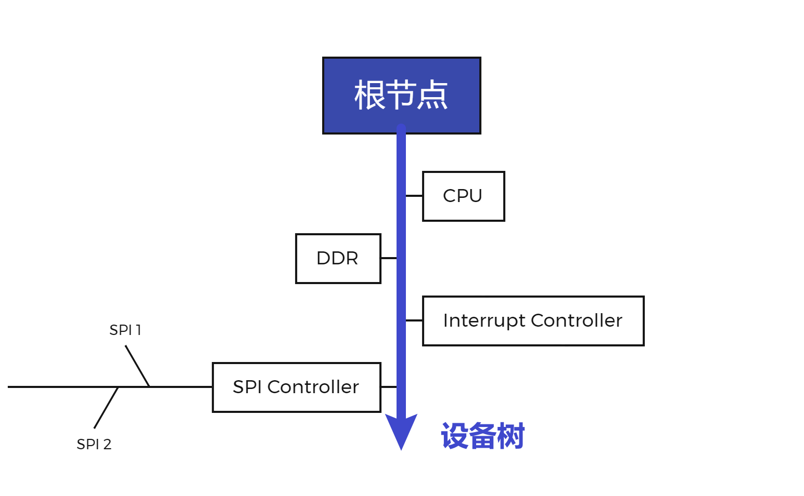

设备树描述硬件资源时有两个特点：

1. 以 “ 树状 ” 结构描述硬件资源。例如本地总线为树的 “ 主干 ” 在设备树里面称为 “ 根节点 ”，挂载到本地总线的 IIC 总线、SPI 总线、UART 总线为树的 “ 枝干 ” 在设备树里称为“ 根节点的子节点 ”，IIC 总线下的 IIC 设备不止一个，这些 “ 枝干 ” 又可以再分，除了根节点没有父节点外，其他节点都只有一个父节点。
2. 设备树源文件可以像头文件 ( `.h` 文件 ) 那样，一个设备树文件引用另外一个设备树文件，这样可以实现 “ 代码 ” 的重用。例如多个硬件平台都使用 rk 系列处理器作为主控芯片，那么我们可以将 rk 系列芯片的硬件资源写到一个单独的设备树文件里面一般使用 `.dtsi`后缀，其他板级设备树文件直接使用 `#include xxx.dtsi` 引用即可。

DTS、DTC 和 DTB 是文档中常见的几个缩写：

- **DTS** ：是指 `.dts` 格式的文件，是一种 ASII 文本格式的设备树描述，也是我们要编写的设备树源码，一般一个`.dts` 文件对应一个硬件平台，对应 arm 架构，源文件位于Linux 源码的`/arch/arm/boot/dts` 目录下。
- **DTC**  ：是指编译设备树源码的工具，一般情况下我们需要手动安装这个编译工具。

- **DTB** ：是设备树源码编译生成的文件，类似于我们C 语言中 `.c` 文件编译生成 `.bin` 文件。

#### 8.2 设备树框架

设备树 ( Device Tree ) 由一系列被命名的结点 ( node ) 和属性 ( property ) 组成。


## 四. Linux Qt 应用开发

> **参考书籍：** [[野火]《嵌入式Qt应用开发指南-基于LubanCat-RK系列板卡》](https://doc.embedfire.com/linux/rk356x/Qt/zh/latest/index.html)
>
> **使用板卡：** LubanCat 4 RK3588S


## 五. 嵌入式 AI 应用开发

> **参考书籍：** [[野火]《嵌入式AI应用开发实战指南—基于LubanCat-RK系列板卡》](https://doc.embedfire.com/linux/rk356x/Ai/zh/latest/index.html)
>
> **PC 端系统** ：VMWare Ubuntu 20.04
>
> **使用板卡：** LubanCat 4 RK3588S
>
> **板卡系统**：Ubuntu 22.04.3 LTS (GNU/Linux 5.10.160-rockchip aarch64)

随着 AI 技术在各个行业快速发展，在云端部署到实际应用场景中存在隐私保护、通讯延时、成本等问题，将 AI 技术和嵌入式系统结合，构建边缘计算成为当前技术热点之一。

目前在嵌入式实现 AI 方式有：

- 基于现有的嵌入式处理器对算法进行优化
- 基于GPU 多处理器或者基于专门的运算加速单元等等

这些方式有各自的优缺点，根据实际应用领域选择不同方案。

rk3588S 处理器搭载了神经网络处理单元 ( NPU ) ，具备强大的算力，支持主流的深度学习框架，拥有功能丰富的开发工具和开发案例，同时硬件方面集成了GPU、VPU、RGA 等单元。

### 1. LubanCat 4 资源概览

#### 1.1 CPU

LubanCat-4 使用瑞芯微 rk3588 系列处理器，该系列处理器的特点：

- 8 核 64 位处理器，集成 4 核 Cortex-A76 和4 核 Cortex-A55 大小核架构，以及单独的NEON 协处理器
- 大核支持最高 2.4Ghz，小核最高支持 1.8Ghz
- 完整实现 ARM 架构 v8-A 指令集，ARM Neon Advanced SIMD（单指令、多数据）支持加速媒体和信号处理
- 支持 Trustzone 技术等等

#### 1.2 NPU（神经网络处理单元）

rk3588 都内置独立的 NPU，高达 6TOPS，支持整数8、整数16 卷积运算，支持深度学习框架：TensorFlow、TF-lite、Pytorch、Caffe、ONNX 等等。

NPU 是专门用于神经网络的处理单元，它旨在加速人工智能领域的神经网络算法，如机器视觉和自然语言处理。随着人工智能的应用范围正在扩大，目前提供各种领域的功能，包括面部跟踪、手势和身体跟踪、图像分类、视频监控、自动语音识别（ASR）以及高级驾驶员辅助系统（ADAS）等。

使用 RKNPU，瑞芯微官方提供了 RKNN 组件, 包括 RKNPU2、RKNN Toolkit2 、RKLLM-Toolkit
和 RKNPU 驱动等。

**RKNPU2** 开发套件有一个运行库（librknnrt.so 等），提供 c/c++ 编程接口，用来部署推理RKNN模型，接口适用于 Linux 或者 Android 系统。

**RKNN Toolkit2** 开发套件 ( Python 接口) 提供了在 PC，Rockchip NPU 平台上进行模型转换、量化功能、模型推理、性能和内存评估、量化精度分析、模型加密等功能。该套件中还有一个RKNNToolkit Lite2 ，它提供了一个 Python 编程接口，可以在板端部署 RKNN 模型。

其中 **RKNN 模型 **是瑞芯微为了加速模型推理而基于自身 NPU 硬件架构定义的一套模型格式，使用该格式定义的模型在 Rockchip NPU 上可以获得更高的性能。

**RKLLM-Toolkit**  是为用户提供在计算机上进行大语言模型（Large Language Model, LLM）的量化、转换的开发套件，支持将 Hugging Face 格式的大语言模型转换为 RKLLM 模型。

**RKNPU 驱动** 提供了 NPU 硬件接口程序，板卡系统固件都已经适配好。

### 2. 开发环境介绍

#### 2.1 RKNN 开发环境

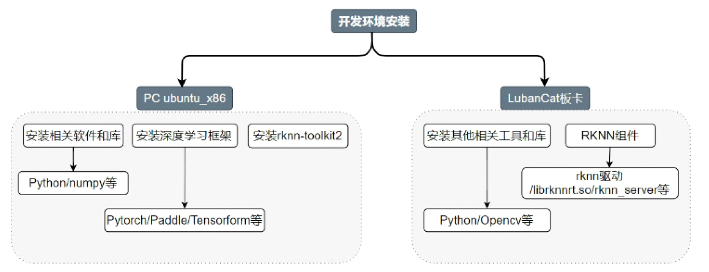

- 在 PC 端主要是进行模型训练和模型转换等, 可以选择 Windows 系统，或者 Windows 上的虚拟机 ubuntu，Docker 的 linux 系统，或者云服务器等等。

- 在鲁班猫板卡上，系统使用 Ubuntu 或者 Debian，内核默认适配 rknn 驱动，其他 rknn 相关组件均包含。还有一些常用的相关软件和库安装，例如python，cmake，make，gcc，opencv 等等。

#### 2.2 RKNN 开发流程


```mermaid
graph LR;
	A[模型训练] --> B[模型转换] --> C[模型评估] --> D[模型部署]
```

- **模型训练** ：模型训练前需要根据具体项目问题， 选择模型， 数据采集， 然后使用适合的深度学习框架进行模型训练。

    RKNN 模型算子的支持：[RKNN_Compiler_Support_Operator_List](https://github.com/airockchip/rknn-toolkit2/tree/master/doc)

- **模型转换** ：将训练的深度学习模型会被转化为 RKNN 格式的模型。

- **模型评估** ：将使用 RKNN-Toolkit2 工具量化和分析模型性能，包括精度、连板推理性能和内存占用等关键指标，根据模型的评估尝试修改和优化模型。

    一些模型的优化可以参考：[RKNPU_User_Guide_RKNN_SDK](https://github.com/airockchip/rknn-toolkit2/tree/master/doc)

- **板端部署** ：将转换的 RKNN 模型部署到板卡上, 具体可以查看 rknpu 运行库和 [RKNNToolkit-lite2](https://github.com/airockchip/rknn-toolkit2/tree/master/rknn-toolkit-lite2) 的使用。

#### 2.3 相关软件安装

以下软件和工具都是在PC端安装。

##### 2.3.1 Anaconda 安装

Anaconda 是可以便捷获取包且对包能够进行管理，同时对环境可以统一管理的发行版本。Anaconda 包含了 conda、Python 在内的众多流行的科学计算、数据分析包。

Anaconda 安装可以从官网网页直接下载，根据系统选择不同的版本安装。这里选择的是适用于 ubuntu20.04 x86_64 的


## 六. Linux 镜像构建与部署

> **参考书籍：** [[野火]《嵌入式Linux镜像构建与部署—基于LubanCat-RK系列板卡》](https://doc.embedfire.com/linux/rk356x/build_and_deploy/zh/latest/index.html)
>
> **使用板卡：** LubanCat 4 RK3588S


## OTHER

### VMWare 删除虚拟机

> **参考博客：** [VMware 彻底删除虚拟机操作系统的方法](https://blog.csdn.net/qq_36761831/article/details/82351329)

方法一：


方法二：


### VMWare 与 Ubuntu 窗口大小适配

> 两种方法任选一种即可，均使用的话可能存在部分冲突

##### 方法一

1. 在菜单栏找到 虚拟机 -> 设置


2. 调整显示器的显示缩放比例，更改为拉伸模式


##### 方法二

打开终端，手动输入以下命令，等待安装完成后重启Ubuntu即可。

```shell
sudo apt-get install open-vm-tools-desktop
```

卸载（建议别卸载，容易出问题，见：**ERROR LOG** : VMWare 虚拟机共享文件夹不显示）

```shell
sudo apt-get remove --purge open-vm-tools-desktop
```

**`--purge`** : 这个选项会一起删除该软件包的配置文件，确保完全清除。


### Windows 与 VMWare-Ubuntu 跨系统复制粘贴

> **参考：** [copy-paste-and-dragdrop-not-working-in-vmware-machine-with-ubuntu](https://askubuntu.com/questions/691585/copy-paste-and-dragdrop-not-working-in-vmware-machine-with-ubuntu/824341#824341)

通过安装VMtools实现了Windows与Ubuntu跨系统复制粘贴，打开终端，手动输入以下命令，再重启ubuntu系统即可。

```shell
sudo apt-get autoremove open-vm-tools
sudo apt-get install open-vm-tools
sudo apt-get install open-vm-tools-desktop
```


### VSCode 配置 SSH 免密远程登陆

> **参考**：https://blog.csdn.net/qq_44571245/article/details/123031276

打开 PC 端的终端或 Power Shell，输入以下命令：

```bash
ssh-keygen -t rsa
```

连续回车直到结束，找到 `.ssh` 这个文件夹，用记事本打开 `id_rsa.pub` 这个文件，并复制里面的内容。


vscode 中通过 SSH 连接板卡，在板卡的命令行上输入以下内容：

```bash
ssh-keygen -t rsa
```

连续回车直到结束，可看到 `/hemo/sprine` 目录下会有 `.ssh` 文件夹：


然后进入该文件夹，就可以看到生成的公钥和私钥：

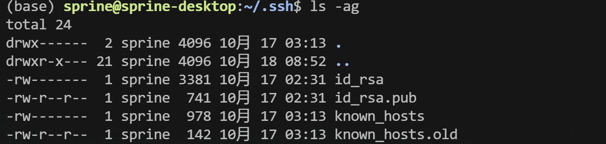

然后创建一个文件 `authorized_keys`，把刚刚从记事本上复制的内容粘贴到里面，然后保存退出即可配置完成。


### C 指针中使用 const 位置不同的区别

```c
const char *p;
```

- `p` 是一个指向 `const char` 的指针。
- 可以通过 `p` 修改指针的指向，但不能通过 `*p` 修改指向的内容。

```c
char * const p;
```

- `p` 是一个常量指针，指向 `char`。

- 不能修改指针 `p` 的指向，但可以通过 `*p` 修改指向的内容。

```c
char const *p;
```

- 这是 `const char *p;` 的另一种写法，含义相同。
- `p` 是一个指向 `const char` 的指针，不能通过 `*p` 修改指向的内容。

```c
const * char p;
```

- 这种写法是错误的，语法不正确。`const` 不能单独用于指针类型，应该放在类型前面或后面。

    

### VSCode 中将默认的空格缩进更改为 Tab 缩进

用 VSCode 打开任意文件，在窗口的底栏中找到 **`制表符长度: x`** 并单击：

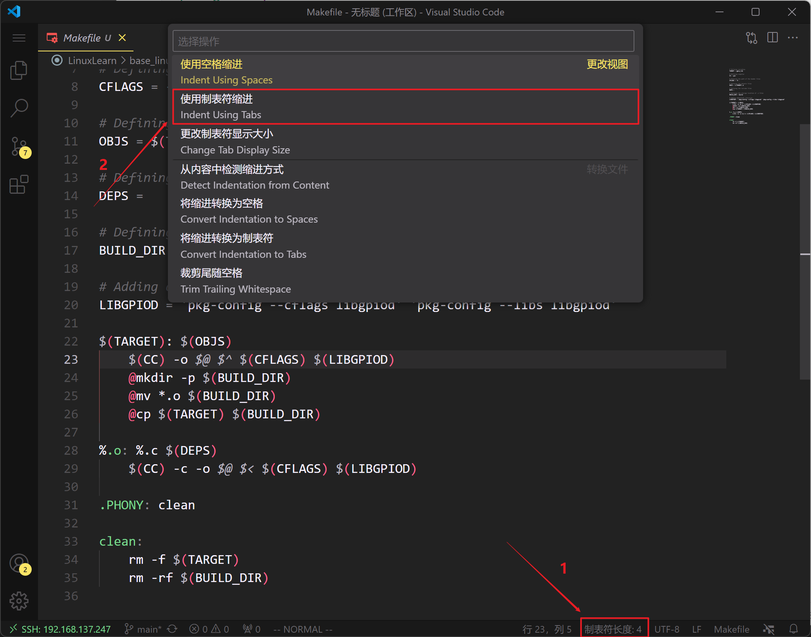

在弹出的菜单栏中选择 **`使用制表符缩进`**即可。


### VMWare Ubuntu 虚拟机扩容

> 参考 ：[vmware：ubuntu虚拟机如何扩容？](https://blog.csdn.net/qq_34160841/article/details/113058756)


### return 与 exit() 的区别

`return` 和 `exit()` 都可以用于退出程序或函数，但它们的作用和使用场景不同：

1. **`return`**：

    - **作用**：用于从函数中返回，结束函数的执行，并将控制权返回给调用该函数的代码。
    - **使用场景**：主要用于函数内，需要将控制权返回到调用处，并且可以返回值。
    - **特点**：只会退出当前函数，而不会结束整个程序。如果是在 `main()` 函数中使用 `return`，会将控制权返回给操作系统，相当于结束了程序。

    ```c
    int myFunction() {
        return 0;  // 结束myFunction函数的执行并返回0
    }
    ```

2. **`exit()`**：

    - **作用**：用于立即终止整个程序的执行，并将控制权返回给操作系统。
    - **使用场景**：通常在需要立即终止程序的情况使用，如遇到致命错误、不可恢复的异常等。
    - **特点**：无论在哪里调用，都会立即结束程序，并返回指定的状态码给操作系统（如 `exit(0)` 表示正常退出，非零值表示异常退出）。

    ```c
    #include <stdlib.h>
    void myFunction() {
        exit(1);  // 立即终止整个程序，返回状态码1
    }
    ```

简单来说，`return` 是函数级别的，用于返回结果并退出函数；`exit()` 是程序级别的，用于退出整个程序。


## ERROR LOG

### VMWare 虚拟机共享文件夹不显示

- [x] 2024.10.15 22:57

> **参考博客：** [虚拟机设置共享文件夹添加不显示](https://blog.csdn.net/qq_41880069/article/details/86158454)

1. 确保 `open-vm-tools` 及 `open-vm-tools-desktop` 已安装

```shell
sudo apt-get install open-vm-tools
sudo apt-get install open-vm-tools-desktop
```

2. 进行挂载配置

```shell
sudo vmhgfs-fuse .host:/ /mnt/hgfs
```

3. 检查挂载

```shell
mount | grep hgfs
```

4. 确保挂载目录存在

```shell
sudo mkdir -p /mnt/hgfs
sudo chmod 755 /mnt/hgfs
```

5. 进行上述配置后可能会提示权限不足，输入以下命令更改权限

```shell
sudo umount /mnt/hgfs 
sudo vmhgfs-fuse .host:/ /mnt/hgfs -o allow_other,uid=$(id -u),gid=$(id -g)
```

6. 最后使用命令查看是否可以正常访问

```shell
cd /mnt/hgfs
ls
```


### Vim Ctrl+z 强制退出后再次进入显示 E325：注意

- [x] 2024.10.17 1:26

当使用 `Ctrl + z` 强制退出 Vim 后，再次进入出现以下界面


解决方法如下：

1. **退出 Vim**：在提示符中选择 `Q` 来退出 Vim。

2. **查找 Vim 交换文件**：在终端中，使用以下命令查找交换文件：

    ```shell
    ls -a
    ```

    如果交换文件的位置不在当前目录，可以用 `find` 命令查找它：

    ```shell
    find / -name ".test.txt.swp"
    ```

    这里的 `test.txt` 是之前使用 `Ctrl + z` 强制退出的文件名，根据具体情况更改。

3. **删除交换文件**： 在终端中，使用以下命令删除交换文件：

    ```shell
    rm .test.txt.swp
    ```

    确保路径正确，如果交换文件在其他位置，请相应调整路径。

4. **重新打开文件**： 可以重新打开 `test.txt` 文件，确认没有问题。

    

### make 编译报错 *** missing separator.  Stop.

- [x] 2024.10.23 18:42

```bash
Makefile:23: *** missing separator.  Stop.
```

这个错误通常是由于 Makefile 中的缩进问题导致的。Makefile 要求使用制表符（Tab）而不是空格来缩进命令。相关配置见 **OTHER - [VSCode 中将默认的空格缩进更改为 Tab 缩进](#VSCode 中将默认的空格缩进更改为 Tab 缩进)**


### apt 安装报错 E: Unable to locate package xxxx

- [x] 2024.10.26 15:24

```bash
cat@lubancat:/boot/uEnv$ sudo apt install neofetch
Reading package lists... Done
Building dependency tree... Done
Reading state information... Done
E: Unable to locate package neofetch
```

这个错误表明系统无法找到 `neofetch` 包。可能的原因有几个：

**首先尝试使用 `sudo apt update` 更新软件包列表**，更新完后尝试 apt 是否可用，若无法正常更新或者更新完后仍不可用，再查看以下两条方法。

1. **系统当前时间相较服务器端时间相差太大**，使用以下命令查看当前系统时间

    ```bash
    date
    ```

    如果返回的时间和现实时间相差过大，会导致 apt 安装报错，通过以下命令手动更新系统时间：

    ```bash
    sudo date -s "YYYY-MM-DD HH:MM:SS"
    ```

    然后再次尝试 apt 安装。

    当系统时间更改了可以正常 apt 安装程序后，推荐安装 NTP 服务自动同步时间：

    ```bash
    sudo apt install ntp
    ```

2. **软件源缺失或者不匹配**，手动编辑 `/etc/apt/sources.list` 文件，确保源列表中包含以下行（Debian 系统，其他系统如 Ubuntu/CentOS去网络搜索需要的软件源）：

    ```bash
    deb http://deb.debian.org/debian/ bullseye main contrib non-free
    deb http://deb.debian.org/debian/ bullseye-updates main contrib non-free
    deb http://deb.debian.org/debian-security bullseye-security main contrib non-free
    ```

    使用以下命令查看并编辑 `/etc/apt/sources.list` 文件：

    ```bash
    sudo vim /etc/apt/sources.list
    ```

    若文件缺失以上三行源，复制粘贴到文件后面后保存退出，使用 apt 再次尝试安装。


### DRM-legacy驱动屏幕无法显示

- [x] 2024.11.05

所用屏幕为 [7寸 IPS 1024x600 电容触摸屏](http://e.tb.cn/h.gARvAkdGxPZ7e7H?tk=3zll3Kkdwso)。

最初在 `drm_init()` 中代码如下：

```c
buf.width = conn->modes[0].hdisplay;
buf.height = conn->modes[0].vdisplay;
...
drmModeSetCrtc(fd, crtc_id, buf.fb_id, 0, 0, &conn_id, 1, &conn->modes[0]);
```

所用的 `mode` 为 `mode[0]`，其格式为 1024x600 屏幕无法正常显示，后更改为 `mode[1]`，其格式为 1920x1080，屏幕可正常显示。

原因可能如下：

HDMI 屏幕的分辨率支持取决于设备的硬件能力和显示器的兼容性。

1. **显示器的原生分辨率**：一些显示器只支持特定的原生分辨率，比如 1920x1080。设置为 1024x600 时，显示器可能无法正确显示图像，甚至拒绝此模式。
2. **显卡与驱动的支持**：显卡或其驱动程序对某些分辨率的支持不够稳定或完善，可能默认优先更高的分辨率。
3. **HDMI 兼容性**：HDMI 协议在某些模式下可能存在特定的限制或问题，而 1920x1080 是广泛支持的标准模式，因此更可能成功显示。

如遇到分辨率兼容问题，选择显示器原生或 HDMI 标准模式（如 1920x1080）通常能保证更高的兼容性和稳定性。

