# README

 Linux learning record.

[TOC]

## 开发环境

- **PC 端系统**：Windows 11

- **虚拟机软件**：VMWare Workstation 17 Pro
    - **虚拟机系统**：Ubuntu 20.04

- **远程登陆工具**：Tabby 1.0.215
- **IDE**：Visual Studio Code
- **Markdown 编辑工具**：Typora 1.9.5
- **版本控制系统**：Git
- **代码托管平台**：GitHub

- **Linux 开发板**：LubanCat 4

    

    - **核心**：Rockchip RK3588S

    - **装载系统**：Ubuntu 22.04.3 LTS (GNU/Linux 5.10.160-rockchip aarch64)

    - **硬件标注**：

        - 正面视图

        

        - 背面视图

        


## 一. VMWare 虚拟机安装

>  **所选系统：** Ubuntu 20.04
>
>  **VMware 版本：** Workstation 17 Pro
>
>  **参考博客：** [VMware虚拟机安装Ubuntu20.04详细图文教程](https://blog.csdn.net/weixin_41805734/article/details/120698714)

### 1. 系统镜像下载

[Ubuntu 20.04.6](https://releases.ubuntu.com/focal/)


### 2. VMWare 安装 Ubuntu

#### 2.1 新建虚拟机及其相关配置


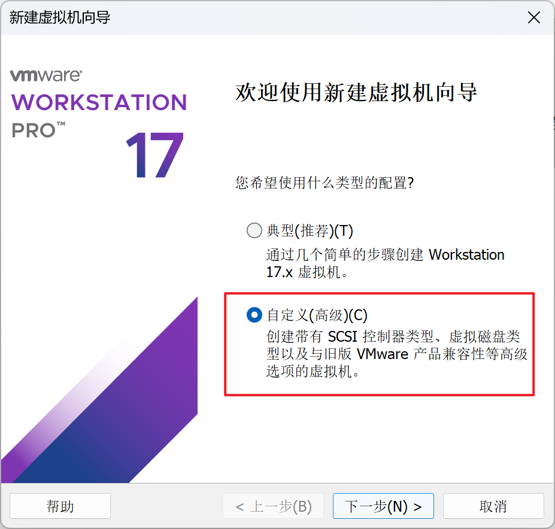

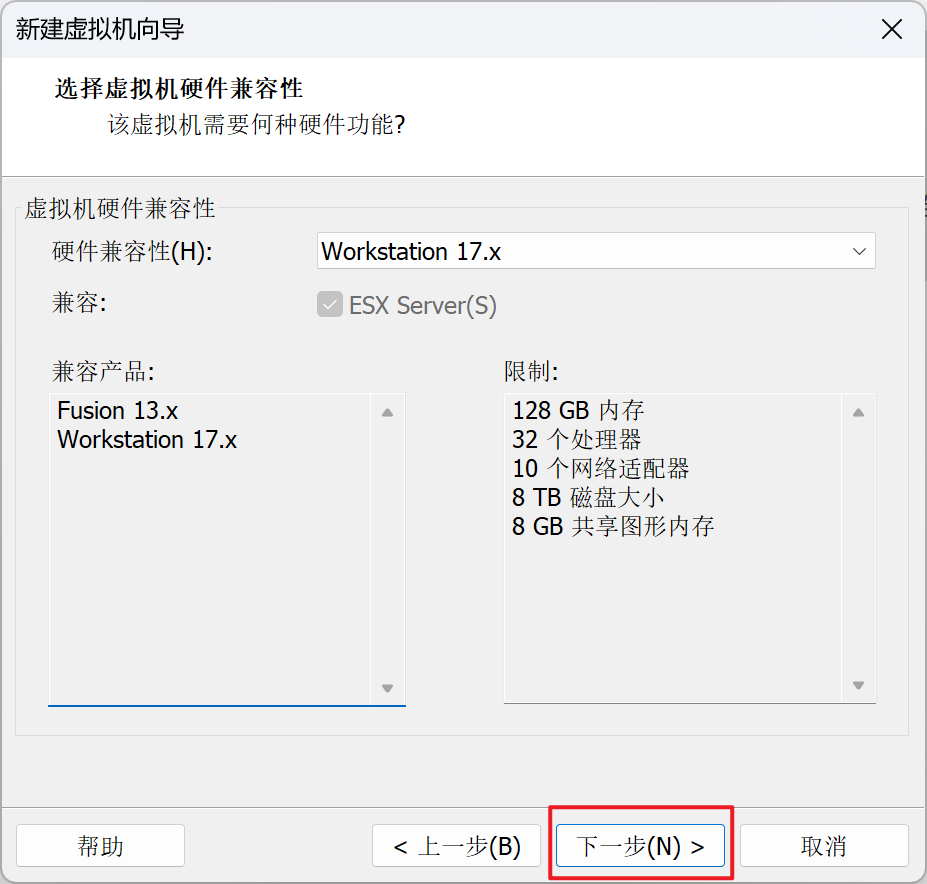


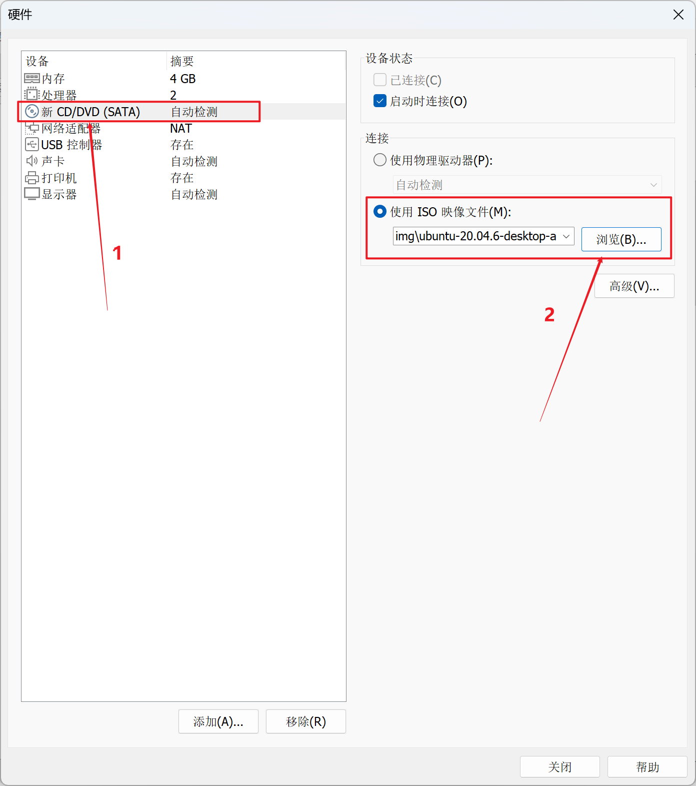


#### 2.2 Ubuntu系统安装

##### 2.2.1 启动虚拟机


##### 2.2.2 语言及键盘配置

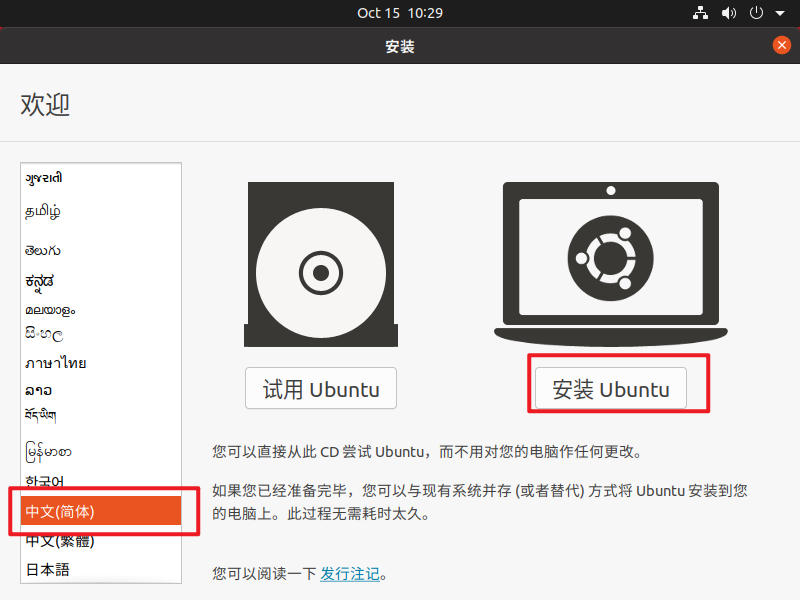


##### 2.2.3 Ubuntu 显示分辨率调整

新启动的 Ubuntu 系统可能显示区域大小与 VMWare 窗口不匹配，通过以下方法调整。

1. 先退出安装窗口

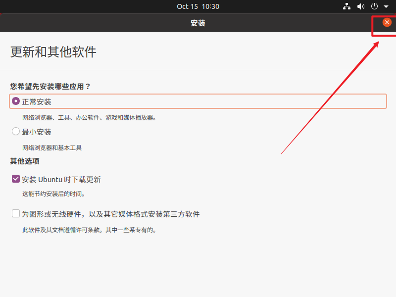

2. 右上角打开设置页面


3. 找到显示器选项，更改为任意分辨率即可


##### 2.2.4 继续完成安装

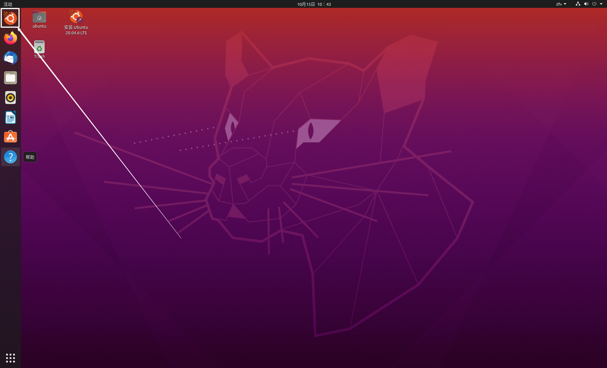


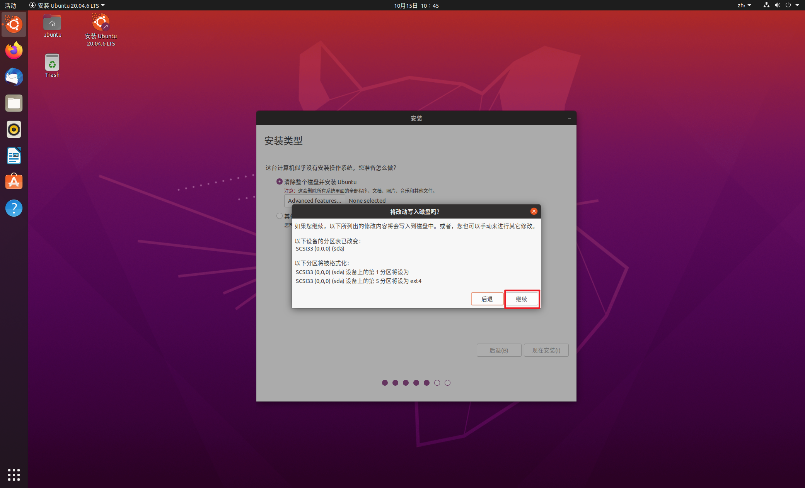


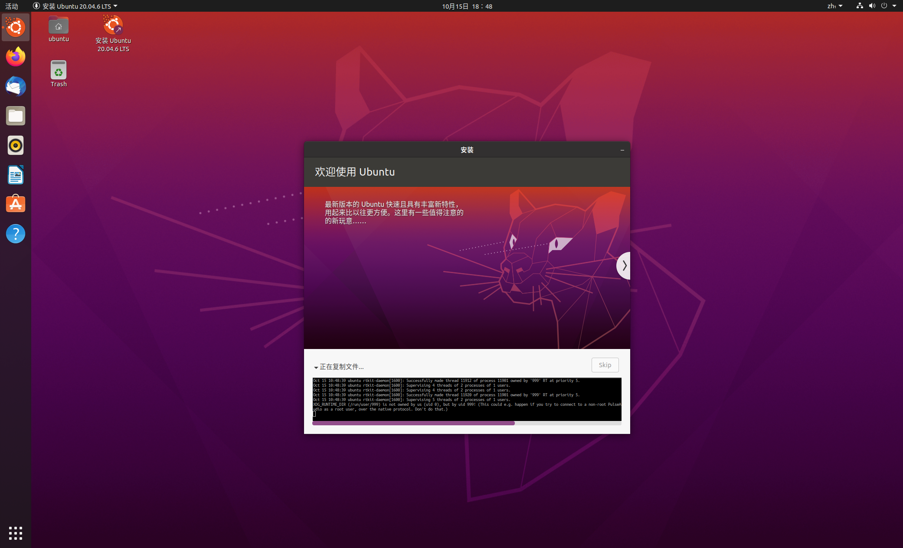


重启后会停留在一个黑屏页面，显示一串英文 “Please remove ... , then press ENTER”，直接按回车键即可。

耐心等待重启后即可进入登陆页面，选中自己的账户，输入之前设置的密码，然后回车

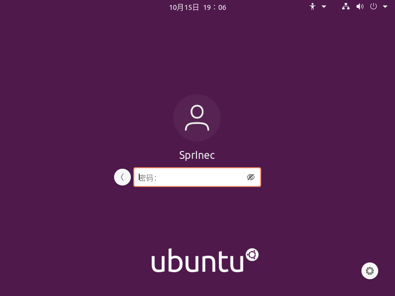

显示以下界面即安装成功。


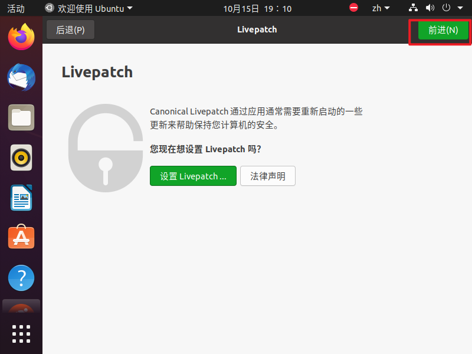


#### 2.3 更改 Ubuntu 软件源

Ubuntu 默认使用国外软件源，将其更改为国内软件源可提高下载速度


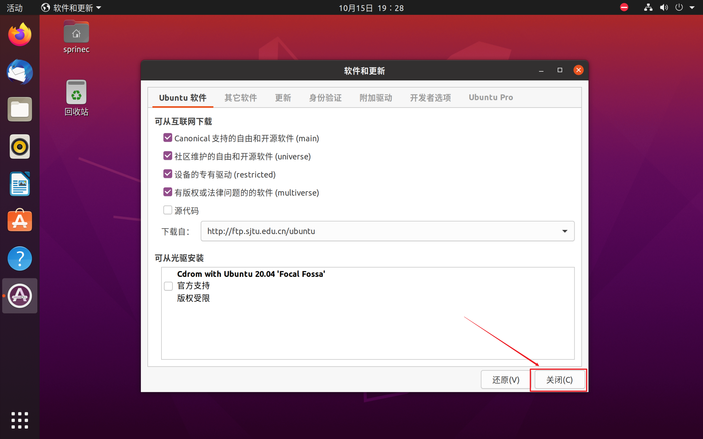

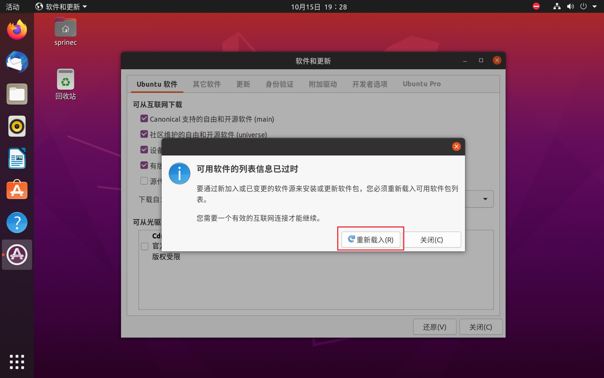

### 3. 设置共享文件夹

#### 3.1 添加共享文件夹

左上菜单栏找到 虚拟机 -> 设置，打开设置页面


点击添加后，根据引导完成设置即可。

#### 3.2 访问共享文件夹

**共享文件夹挂载位置：** `/mnt/hgfs`

1. 列出全部已共享文件夹 `ls /mnt/hgfs`

```shell
sprinec@sprinec-virtual-machine:/$ ls /mnt/hgfs
LinuxLearn
```

2. 进入共享文件夹

```shell
cd /mnt/hgfs/LinuxLearn
```

3. 复制虚拟机中文件到共享文件夹

```shell
cp -Rf /home/database/* /mnt/hgfs/LinuxLearn
```


## 二. Linux 基础与应用开发

> **参考书籍：** [[野火]《Linux基础与应用开发实战指南—基于LubanCat-RK系列板卡》](https://doc.embedfire.com/linux/rk356x/linux_base/zh/latest/index.html)
>
> **使用板卡：** LubanCat 4 RK3588S
>
> **系统** ：Debian 11 ( kernel : 5.10.198-rk3588 ) 

### 1. 配置网络

#### 1.1 WIFI连接

需配合 USB 无线网卡或者 Mini PCIe 接口的网卡使用，若 USB 无线网卡不是免驱版则与 Mini PCIe 网卡一样，可能需要安装其对应的驱动才可使用。硬件准备好后在 Ubuntu 桌面右上角点击找到 WIFI 连接选择连接的网络输入密码连接即可。

- 免驱 USB 无线网卡

    

- inter5100AGN Mini PCIe 网卡 ( [驱动文件](./drivers/inter5100AGN Driver) / [驱动安装指南](./drivers/inter5100AGN Driver/README.md) )

    

#### 1.2 网口连接

网线连接后 PC 端需进行配置共享网络

1. 打开设置，选择网络和 Internet ，按照下图指示进入高级网络设置页面


2. 选择 PC 端需共享的网络


3. 按如图所示操作，家庭网络连接项选择 Linux 板卡所连接的网络端口即可


配置好 WIFI 或者网口的任意网络后，可使用以下命令查看板卡 IP 地址，从而在 PC 端进行 ssh 连接：

```bash
ifconfig
```

- 有线网口显示为 `ethx` ，x 为 0，1， 2 ...

- USB 无线网卡一般显示为 `wlanx` ，x 为 0，1， 2 ...
- Mini PCIe 接口网卡一般显示为网卡的驱动型号，如 `wlp4p65s0`

`inet` 后面跟的 xxx.xxx.xxx.xxx 即为板卡 IP 地址。

#### 1.3 配置 SSH 连接

Windows 10 及更高版本系统自带 OpenSSH 客户端，需要确保 Linux 端已经安装 OpenSSH 服务器，可通过以下命令安装：

```bash
sudo apt update
sudo apt install openssh-server
```

安装后启动 SSH 服务：

```bash
sudo systemctl start ssh
sudo ststemctl enable ssh
```

检查 SSH 服务状态，确保其运行正常:

```bash
sudo systemctl status ssh
```

如有需要可能还需配置防火墙，确保服务器的防火墙允许 SSH 流量，通常 SSH 使用端口 22，可以使用以下命令打开端口：

```bash
sudo ufw allow ssh
```

然后即可通过命令 `ssh username@server_ip` 从客户端连接到板卡/虚拟机/服务器了，也可通过 Tabby、MobaXterm、PuTTY、electerm、FinalShell、Hyper、SecureCRT、Termius 或是安装了 Remote SSH 插件的 VScode 进行 SSH 远程连接。

比较推荐 [Tabby](https://github.com/Eugeny/tabby)、[Termius](https://termius.com/) 和安装了 Remote SSH 插件的 VScode。其中若想给 VSCode 配置 SSH 免密远程登陆可查看 **OTHER - [VSCode 配置 SSH 免密远程登陆](#VSCode 配置 SSH 免密远程登陆)** 。

- Tabby

    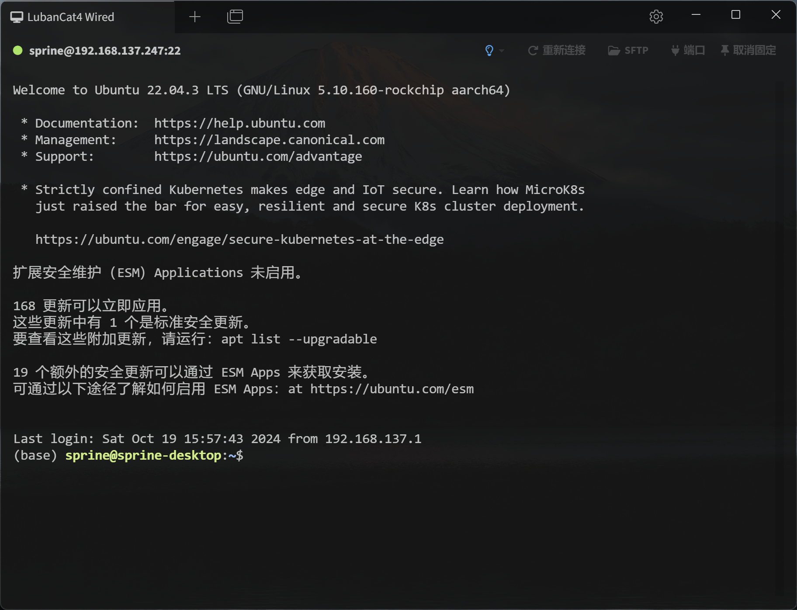

- Termius

    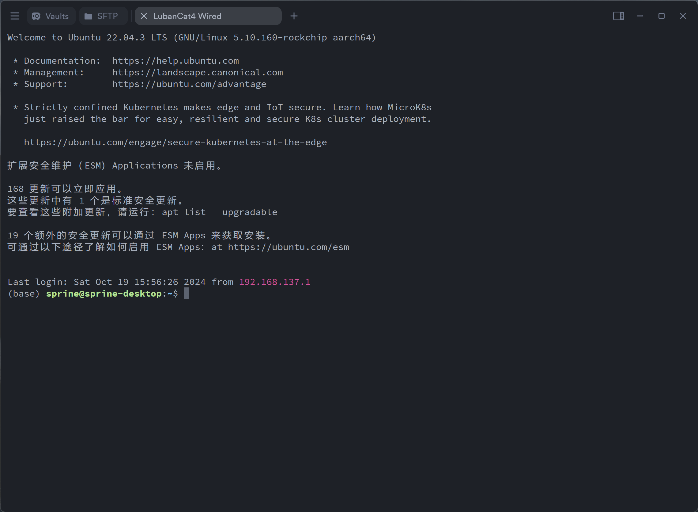

- VSCode Remote SSH

    

### 2. Linux 命令行

**命令的格式：** `command [-options] [argument]`

#### 2.1 常用命令

- `ls` ：列出当前目录的文件
    - `ls [目录名]` ：列出其他文件的目录
    - `-a` ：显示所有文件及目录 (ls 内定将文件名或目录名称开头为 “ . ” 的视为隐藏档，不会列出)
    - `-l` ：除文件名称外，将文件型态、权限、拥有者、文件大小等信息详细列出
    - `-t` ：将文件依建立时间之先后次序列出
    - `-A` ：同 -a ,但不列出 “ . ” (当前目录) 及 “ .. ” (父目录)
    - `-R` ：若目录下有文件，则该目录下的文件也会列出，即递归显示
    
- `pwd` ：列出当前目录的位置

- `cd` ：切换到家目录
    - `cd [目录名]` ：切换到指定目录
    - `cd -` ：切换上次切换的目录
    - `cd ~` ：切换到家目录
    - `cd ..` ：切换上一层目录
    - `cd /` ：切换到根目录
    
- `mkdir [name]` ：创建名为 name 的文件夹
    - `-p [name1/name2]` ：递归创建
    
- `touch [name1, name2, ...]` ：更新/创建多个文件，命名分别为 name1, name2, ...

    `touch` 有两个功能：

    1. 把已存在文件的时间标签更新为系统当前的时间（默认方式）它们的数据将原封不动地保留下来.
    2. 用来创建新的空文件。

- `cp -r a b` ：复制 *a* 文件夹重命名为 *b*

    - `-R/r` ：递归处理

- `rm [-option] [一个或多个文件/文件夹名]` ：删除一个或多个文件或目录
  
    - `-R/r` ：递归处理
    - `-i` ：删除文件或文件夹前，终端会逐一询问确认
    - `-f` ：强制删除文件或目录
    
- `which [xxx]` ：查找并显示给定命令的绝对路径

- `echo` ：输出指定的字符串或者变量

- `cat [文件名]` ：连接多个文件并打印到标准输出

- `>`，`>>` ：输出重定向到文件
    - `命令 > 文件名` ：直接用输出覆盖原文件
    - `命令 >> 文件名` ：把输出追加到原文件的末尾

- `su [用户名]` ：用于切换用户

- `clear` ：清除当前屏幕终端上的任何信息

- `reboot` ：系统重启

- `poweroff` ：系统关机

- `chmod` ：用来变更文件或目录的权限


- `ps` ：报告当前系统的进程状态

- `df` ：显示磁盘的相关信息
    - `-h` ：以可读性较高的方式来显示信息

- `id` ：查看当前用户的 UID 值

- `dpkg` ：是 Debian Linux 系统用来安装、创建和管理软件包的实用工具。
    - `-L` ：显示于软件包关联的文件


- `sudo` ：管理员权限
    - `sudo !!` ：使用 sudo 权限重新执行上一条指令
    - `sudo -i` ：切换到 root 账户
- `sudo apt update` ：更新软件
- `sudo apt upgrade` ：安装更新的软件
- `sudo apt install xxx` ：软件安装
- `sudo apt remove xxx` ：软件卸载
- `su` ：切换到 root 账户

#### 2.2 其他软件

- `sudo nmtui` ： WiFi 连接图形化配置

### 3. 快捷键

#### Ubuntu 系统快捷键

- `Ctrl + Alt + t` ：打开终端（桌面系统适用）
- `Ctrl + c` ：取消输入的命令/中止命令

### 4. 用户与文件

#### 4.1 用户及用户组

在 Linux 中,每个用户都有一个特定的编号——UID，用于标识一个系统用户。

可通过 `id` 命令查看当前用户的 UID 值。

```bash
id
```


上图中的 gid 用于标识当前用户所在的分组(Group)，每个用户可以对应多个分组。

Linux 系统拥有多个分组，每个用户分组就相当社团，用户如果是多个用户组 的成员，就可以访问其他分组对应的文件，前提是该分组的文件允许其他用户访问，这就需要了解另一个知识点：文件权限。


#### 4.2 文件

Linux 一切皆文件

**Linux 的文件属性：**可以分为读权限、写权限、执行权限。

**Linux 文件权限**分三种情况：文件拥有者 ( owner )，分组成员 ( groups )  以及其他分组成员 ( other )。

使用以下命令查看当前目录的文件权限

```bash
ls -l
```


可以看到文件和文件夹的开头都有一串字符字符，例如：

```shell
drwxr-xr-x 2 cat cat 4096 Feb 14 2019 Desktop
```

各个字段的说明如下：


- 第一字段：文件属性

    文件属性共有十个字符，第一个字符代表文件的类型

    - `-` ：表示该文件是一个普通文件
    - `d` ：dirtectory（目录）的首字符，表示该文件是一个目录
    - `I` ：表示该文件是个链接文件

    后面的九个字符，每三个为一组，分别表示**文件拥有者的权限**、**文件所属组拥有的权限**以及**其他用户拥有的权限**。

    - `r` ：读（ read ）权限
    - `w` ：写（ write）权限
    - `x` ：执行（execute）权限

- 第二字段：链接占用的节点/子目录的个数

    第二字段的含义，主要取决该文件的类型,如果是文件的话，则表示该文件所具有的硬连接数。某个文件的第二字段如果等于 1 的话，代表没有其他指向该文件的硬连接。

    根据 Linux 系统存储文件的特点，链接的方式可以分为两种，分别是**硬链接**和**软连接**（符号连接）。软链接，类似于 Windows 操作系统的快捷方式。而硬链接，则是相当于把该文件复制一份，同时加上自动更新。当我们修改了硬链接文件的内容，源文件也会被修改。当为  某个文件创建硬链接时，该字段的值便会加 1。可以使用 `ln` 命令创建软链接和硬链接。

    对于文件夹来说，第二字段则表示该文件夹下有多少个子目录。空文件夹的话，该值默认等于 2，这是因为包含了 “ . ” 和 “ .. ” 子目录。

- 第三字段和第四字段：文件拥有者和文件所在的组

#### 4.3 chmod 命令

文件的权限由三部分组成，每个部分都对应着三种文件权限，可读、可写、可执行。

`rwx` 在二进制中的数值可以看成

- `r` ：100 - 4
- `w` ：010 - 2
- `x` ：001 - 1

因此，若文件的权限是 `rwx` ，它的数值表达式为 7，如果是 `rw-`，数值表达为 6，则有：

- `rwx` ：7 
- `rw-` ：6
- `r-x` ：5
- `r--` ：4
- `-wx` ：3
- `-w-` ：2
- `--x` ：1
- `---` ：0

若想要修改文件的所有权限则可使用以下命令：

```shell
sudo chmod xxx [文件名]
```

- `xxx = 777` 则文件权限变为了 `-rwxrwxrwx`
- `xxx = 666` 则文件权限变为了 `-rw-rw-rw-`

若要单独给用户、组、其他用户设置权限则使用以下命令

```shell
sudo chmod [ugoa][+-][rwx] [文件名]
```

- [ugoa]
    - `u` ：使用者
    - `g` ：用户所在的组
    - `o` ：其他用户
    - `a` ：所有用户

- [+-]
    - `+` ：增加权限
    - `-` ：移除权限

- [rwx]
    - `r` ：读
    - `w` ：写
    - `x` ：执行


举例：

```shell
# 给所有用户移除可执行的权限
sudo chmod a-x hello

# 给其他用户减少可写的权限
sudo chmod o-w hello

# 给 root 用户减少可写的权限
sudo chmod u-w hello

# 给 root 用户增加可写的权限
sudo chmod u+w hello													
```

### 5. Linux 文件目录

#### 5.1 根目录与家目录

**根目录**是 Linux 下所有文件和目录的起点，它的路径用斜杠符号 “ / ” 来表示。

```shell
ls /
```


当使用普通登陆用户（sprine）登陆时会默认进入**家目录** `/home/sprine`，当我们使用 root 用户登录时会进入 `/root` 目录，root 用户家目录就是 `/root`。


#### 5.2 根目录结构

整个 Linux 系统有且只有一棵从根目录开始的目录树，如下图所示。


|    目录    | 目录放置的内容                                               |
| :--------: | :----------------------------------------------------------- |
|    bin     | 存放系统命令的目录，如命令 `cat`，`cp`，`mkdir`              |
|    boot    | 存放开机启动过程所需的内容，如开机管理程序 grub2             |
|    dev     | 所有设备文件的目录（如声卡、硬盘、光驱）                     |
|    etc     | 系统的主要配置文件                                           |
|    home    | 用户家目录数据的存放目录                                     |
|    lib     | 存放 sbin 和 bin 目录下命令所需的库文件                      |
| lib32/ib64 | 存放二进制函数库，支持 32 位 / 64 位                         |
| lost+found | 在 EXT3/4 系统中，当系统意外崩溃或意外关机时，会产生一些碎片文件在这个目录下面，系统启动 fcsk 工具会检查这个目录，并修复已损坏的文件。 |
|   media    | 用于挂载光盘，软盘和 DVD 等设备                              |
|    mnt     | 同 media 作用一样，用于临时挂载存储设备                      |
|    opt     | 第三方软件安装存放目录                                       |
|    proc    | 进程及内核信息存放目录，不占用硬盘空间                       |
|    root    | root 用户的家目录                                            |
|    run     | 是一个临时文件系统，存储系统启动以来的信息。当系统重启时，这个目录下的文件应该被删掉或清除 |
|    sbin    | root 用户使用的命令存放目录                                  |
|    srv     | 一些网络服务所需要的数据文件                                 |
|    sys     | 同 proc 目录，用于记录 CPU 与系统硬件的相关信息              |
|    tmp     | 程序运行时产生的临时文件存放目录                             |
|    usr     | 系统存放程序的目录，类似于在 windows 下的文件夹 programefiles |
|    var     | 存放内容常变动的文件目录，如系统日志文件                     |

### 6. Vi/Vim 编辑器

大部分 Linux 系统中都会自带 Vi 编辑器已方便用户在终端上编辑文件，而 Vim 是 Vi 的升级版本，它在 Vi 的基础上改进和增加了很多特性,是一个功能更强大、高度可定制的文本编辑器。

#### 6.1 Vim 使用演示

##### 6.1.1 安装 Vim

```shell
sudo apt install vim
```

##### 6.1.2 打开 Vi/Vim

```shell
vi
vi 文件名
```

```shell
vim
vim 文件名
```

##### 6.1.3 退出 Vi/Vim

1. `Ctrl + z` 直接强制退出

    该模式下退出后再次使用 vim 进入会报类似如下的提示

    

    具体处理方式请看 **ERROR LOG - [Vim Ctrl+z 强制退出后再次进入显示 E325：注意](#Vim Ctrl+z 强制退出后再次进入显示 E325：注意)**

2. 在**命令行模式**下输入退出命令退出

    1. 按下退出键 `Esc`，Vim 会进入到 *一般模式* 
    2. 输入英文冒号 `:` ，Vim 会进入到 *命令行模式* 

    3. 输入强制退出命令 `q!`  ，即字母 `q` 及英文叹号 `!` 

    4. 按回车执行命令，会退出 Vim，返回到终端

##### 6.1.4 输入内容

Vim 打开后默认是在**一般模式**，在该模式下的所有输入就如同在其它常用编辑器中按了快捷键。

可通过以下步骤进入到 **插入模式** 输入内容并保存文件：

1. 按下退出键 `Esc` 进入*一般模式*
2. 直接按字母 `i` ，进入*插入模式*
3. 输入内容
4. 按下退出键 `Esc` ，再次进入*一般模式*
5. 输入英文冒号 `:` ，Vim 会进入到 *命令行模式* 
6. 输入保存退出命令 `wq`
7. 按回车执行命令，会退出 Vim，返回到终端

#### 6.2 Vim 的三种模式

- **一般模式**（normal mode）：一般模式用来浏览文本，查找内容，但是不可以编辑，在该模式下的键盘输入会被当成快捷键，如复制粘贴等。打开 Vim 时，默认是工作在一般模式。
- **插入模式**（insert mode）：插入模式下具有普通编辑器的功能，该模式下的键盘输入会被当成文本内容。
- **命令行模式**（command-line mode）：命令行模式支持保存、退出、替换等命令，以及 Vim 的高级功能。

三种模式的切换图：

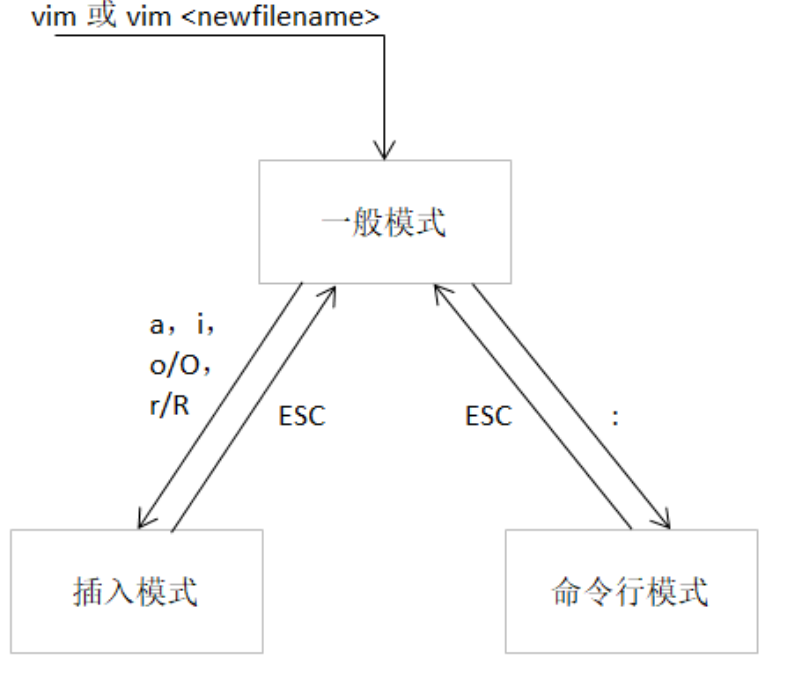

##### 6.2.1 插入模式

进入/退出插入模式的快捷键：

| 快捷键 | 功能描述                                           |
| :----: | -------------------------------------------------- |
|   i    | 在当前光标所在位置插入文本                         |
|   a    | 在当前光标所在位置的下一个字符插入文本             |
|   o    | 在光标所在位置后插入新行                           |
|   r    | 替换当前光标所在位置的字符                         |
|   R    | 可以替换当前光标所在位置之后的字符,按下“Esc”则退出 |
|  ESC   | 退出插入模式                                       |

##### 6.2.2 一般模式

在任意模式下按按键 `Esc` 可进入到一般模式。

一般模式快捷键：

|                          |        快捷键        | 功能描述                                                     |
| :----------------------: | :------------------: | ------------------------------------------------------------ |
|         光标移动         |        k / ↑         | 光标向上移动                                                 |
|                          |        j / ↓         | 光标向下移动                                                 |
|                          |        h / ←         | 光标向左移动                                                 |
|                          |        l / →         | 光标向右移动                                                 |
|                          |        PageUp        | 向上翻页                                                     |
|                          |       PageDown       | 向下翻页                                                     |
|                          |          nG          | 跳转到第 n 行                                                |
|      文本查找与替换      |        /word         | 在文件中搜索关键字 word                                      |
|                          |          n           | 查找下一个关键字                                             |
|                          |          N           | 查找上一个关键字                                             |
|                          | :1,$s/word1/word2/gc | 将文本中的所有关键字 word1 用 word2 进行替换，需要用户进行确认。（ 使用 `:1,$s/word1/word2/g` 则直接全部替换 ）。这实际是运行在命令模式。 |
|         撤销重做         |          u           | 撤销上一步的操作，等价于 Windows 的 `Ctrl+Z`                 |
|                          |       Ctrl + r       | 重做上一步的操作                                             |
| 删除、剪切、  复制、粘贴 |          d           | 删除光标所选的内容                                           |
|                          |          dd          | 删除当前行                                                   |
|                          |         ndd          | 删除光标后 n 行                                              |
|                          |          x           | 剪切光标选中的字符                                           |
|                          |          y           | 复制光标所选的内容                                           |
|                          |          yy          | 复制当前行                                                   |
|                          |         nyy          | 复制当前行后 n 行                                            |
|                          |          p           | 将复制的数据粘贴在当前行的下一行                             |
|                          |          P           | 将复制的数据粘贴在当前行的上一行                             |
|         区块操作         |          v           | 选择多个字符                                                 |
|                          |          V           | 可以选择多行                                                 |
|                          |       Ctrl + v       | 可以选择多列                                                 |

##### 6.2.3 命令行模式

在一般命令模式下，按下键盘的冒号键 `:` ，就可以进入命令行模式，继续输入要执行的命令按  回车即可执行。

命令行模式快捷键：

|    快捷键    | 功能描述                                            |
| :----------: | --------------------------------------------------- |
|      w       | 保存文档                                            |
| w <filename> | 另存为以 <filename> 为文件名的文档                  |
| r <filename> | 读取文件名为 <filename> 的文档                      |
|      q       | 直接退出软件，前提是文档未做任何修改                |
|      q!      | 不保存修改，直接退出软件                            |
|      wq      | 保存文档，并退出软件                                |
|    set nu    | 在行首加入行号                                      |
|   set nonu   | 不显示行号                                          |
| set hlsearch | 搜索结果高亮显示                                    |
|  ! command   | 回到终端窗口，执行 command 命令，按回车键可切回 vim |


#### 6.3 用 Vi/Vim 软件编写简单的 sh 脚本

在终端执行下列命令：

```shell
vim hello_world.sh
```

进入文件后输入以下内容：

```shell
echo "hello world,this is a script test!"
```

Vim 退出后回到终端，通过 `source` 命令运行刚刚编写的脚本文件：

```shell
sudo chmod u+x hello_world.sh
source hello_world.sh
```

### 7. Git 项目版本管理

#### 7.1 Git 安装与配置

1. 安装 Git，在终端输入下列命令：

    ```shell
    sudo apt-get install git -y
    ```

    - `-y` ：询问是否安装时默认选择 Yes

2. 用户配置，配置用户名和邮箱

    ```shell
    git config --global user.email xxx
    git config --global user.name xxx
    ```

    - `--global` ： 配置 `~/.gitconfig` 文件，对当前用户下的所有仓库有效
    - `--system` ：配置 `/etc/gitconfig` 文件，对当前系统下的所有用户有效
    - 无参数：配置 `.git/config` 文件，只对当前仓库有效

#### 7.2 Git 本地项目管理简单使用流程

1. 创建本地仓库

    ```shell
    git init [仓库名称]
    ```

2. 添加/修改文件

    ```shell
    cd [仓库名称]
    touch FILE1, FILE2, FILE3, ...
    vim FILE1
    ...
    ```

3. 将文件的修改变化保存到仓库的暂存区

    保存单个/多个文件修改：

    ```shell
    git add FILE1, FILE2
    ```

    保存全部修改：

    ```
    git add .
    ```

4. 将保存到暂存区的修改提交到本地仓库

    ```shell
    git commit -m "The changes you want to add"
    ```

    - `-m "MESSAGE"` ：提交信息

5. 查看提交历史

    ```shell
    git log
    ```

    - `git log` 页面按 `q` 退出

6. 根据提交的 ID 查看某一个提交的详细信息

    ```shell
    git show COMMIT_ID
    ```

#### 7.3 Git 线上托管项目管理简单使用流程

GitHub 和 Gitee 是一个基于 Git 的在线项目托管平台，它提供了 web 界面,，用户可以在上面创建远程仓库来存放自己的项目。所有的开发者可以基于这个远程仓库共同协作，不断地维护和完善该项目。

> 该节以 GitHub 为例，Gitee 同理

##### 7.3.1 GitHub 获取线上项目方式比较

在 GitHub 上克隆或者管理项目时，常用的方式一般有以下三种：


1. **HTTPS**
    - 简单易用，不需要额外配置，直接使用用户名和密码（或 token），但 GitHub 近期似乎不再支持使用用户名和密码进行身份验证，使用 Personal Access Token 进行替代。
    - GitHub 网速在国内受限，可能会出现多次下载失败的现象（需要科学上网）。
    - 安全性相对较低：密码可能被窃取，尤其在不安全的网络上。
    - 每次操作都需输入密码（如果未缓存）。
2. **SSH**
    - 安全性高，使用密钥对进行身份验证，避免密码泄露风险。
    - 方便，一旦设置好，推送和拉取时无需输入密码。
    - 相较于 HTTPS，在国内下载项目速度更快。
    - 初始配置较复杂，需要生成密钥并添加到 GitHub。
3. **ZIP 下载**
    - 简单直观，用户只需点击下载链接，操作非常简单，不需要安装 Git 或配置身份验证。
    - 缺乏版本控制，下载 ZIP 只会获取当前代码快照，不能方便地进行版本管理和更新。
    - 不能执行 Git 操作，无法进行常规的 Git 操作（如分支管理、合并等），需要手动管理文件。

总结比较：

- **SSH** 和 **HTTPS** 更适合需要频繁更新和版本控制的开发者，能够轻松进行 Git 操作。
- **ZIP 下载** 更适合不熟悉 Git 的用户或临时需要代码快照的情况，但不适合长期开发使用。

这里我们采用 SSH 方式。

##### 7.3.2 生成 SSH 密钥

终端输入以下命令：

```shell
ssh-keygen -t rsa -b 4096 -C "your_email@example.com"
```

在密钥生成过程中会出现以下询问：

```shell
Enter file in which to save the key (/home/username/.ssh/id_rsa): 
```

可以直接按 Enter 键，以使用默认的文件路径 `/home/username/.ssh/id_rsa` 保存 SSH 密钥。这样会在这个位置生成一个新的密钥文件。如果你希望使用不同的名称或路径，可以输入新的文件名，然后按 Enter 键。通常情况下，使用默认路径即可。

```shell
Enter passphrase (empty for no passphrase): 
```

在这个提示中，你可以选择输入一个密码短语（passphrase）来保护你的 SSH 密钥。这个密码短语在你每次使用密钥时会要求你输入，以增加安全性。如果你不想每次都输入密码短语，可以直接按 Enter 键留空。

生成密钥后，你会看到一个公钥文件 `id_rsa.pub`。记得将这个公钥添加到你的 GitHub 账户中，以便进行 SSH 连接。你可以用以下命令查看公钥内容：

```
cat ~/.ssh/id_rsa.pub
```

- 确保复制的内容包括开头的 `ssh-rsa`，后面是长字符串，最后是你的邮箱地址。

##### 7.3.3 GitHub 上添加 SSH 密钥

1. 点击右上角头像打开菜单栏，进入设置页面

    

2. 找到 SSH and GPG keys，点击 New SSH key

    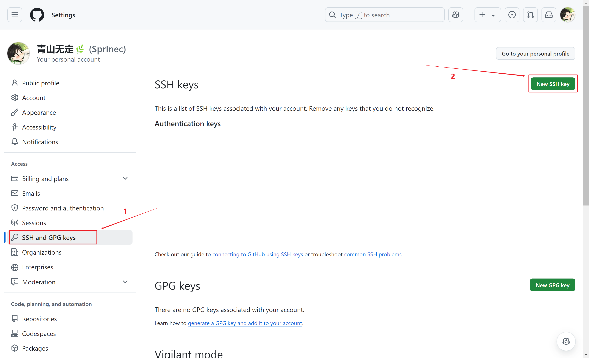

3. Title 任取，将 `id_rsa.pub` 中复制的密钥粘贴在 Key 栏中，后点击 Add SSH key 即可

    

4. 后续可在 SSH and GPG keys 页面管理自己的密钥

    


##### 7.3.4 通过 SSH 从线上仓库克隆项目

在 GitHub 或者 Gitee 网站上,找到需要下载的项目，复制该项目的 SSH 链接。


在终端 `cd` 到合适的目录运行下列命令：

```shell
git clone git@github.com:SprInec/LinuxLearn.git
```

第一次使用 SSH 克隆项目回车后可能会看到如下提示


这是 SSH 连接的安全提示，询问你是否信任 GitHub 的服务器。输入 `yes` 并按 Enter 键，系统将会将 GitHub 的主机密钥添加到你的 `~/.ssh/known_hosts` 文件中，之后就不会再出现这个提示。

继续后续操作，`git clone` 会开始下载仓库，稍作等待即可在当前目录下看到克隆的项目文件夹。

##### 7.3.5 进行项目更改及推送

下面的操作和在本地进行项目管理的操作基本一致，只是多了 `push` 和 `pull` 两个进行线上和本地同步的操作。

1. 进入项目仓库

    ```shell
    cd [仓库名称]
    ```

2. 拉取远程仓库的最新更改

    ```shell
    git pull
    ```

3. 添加/修改文件

    ```shell
    touch FILE1, FILE2, FILE3, ...
    vim FILE1
    ...
    ```
    
4. 将文件的修改变化保存到仓库的暂存区

    保存单个/多个文件修改：

    ```shell
    git add FILE1, FILE2
    ```

    保存全部修改：

    ```
    git add .
    ```

5. 将保存到暂存区的修改提交到本地仓库

    ```shell
    git commit -m "The changes you want to add"
    ```

    - `-m "MESSAGE"` ：提交信息

6. 再次拉取远程更新

    ```bash
    git pull
    ```


7. 将本地提交推送到远程仓库

    ```shell
    git push
    ```

8. 查看提交历史

    ```shell
    git log
    ```

    - `git log` 页面按 `q` 退出

9. 根据提交的 ID 查看某一个提交的详细信息

    ```shell
    git show COMMIT_ID
    ```

#### 7.4 Git 项目管理的一般步骤

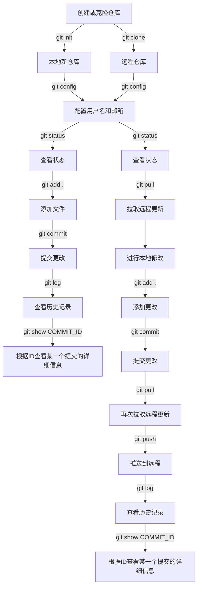
```mermaid
graph TD;
    A[创建或克隆仓库] -->|git init| B[本地新仓库]
    A -->|git clone| C[远程仓库]
    
    B -->|git config| E[配置用户名和邮箱]
    E -->|git status| F[查看状态]
    F -->|git add .| G[添加文件]
    G -->|git commit| H[提交更改]
    H --> |git log| R1[查看历史记录]
    R1 --> |git show COMMIT_ID| S1[根据ID查看某一个提交的详细信息]
    
    C -->|git config| E
    E -->|git status| L[查看状态]
    L -->|git pull| M[拉取远程更新]
    M --> N[进行本地修改]
    N -->|git add .| O[添加更改]
    O -->|git commit| P[提交更改]
    P --> |git pull| M2[再次拉取远程更新]
    M2 -->|git push| Q[推送到远程]
    Q -->|git log| R2[查看历史记录]
    R2 --> |git show COMMIT_ID| S2[根据ID查看某一个提交的详细信息]
```

**1. 创建或克隆仓库**

- 使用 `git init` 创建新的本地仓库。
- 使用 `git clone <repo-url>` 克隆现有的远程仓库。

**2. 配置用户信息**（如果是新仓库）

```bash
git config --global user.name "Your Name"
git config --global user.email "your_email@example.com"
```

**3. 查看状态**

使用 `git status` 查看当前工作区和暂存区的状态。

**4. 拉取远程更新**

使用 `git pull origin <branch-name>`  在进行本地修改之前，先拉取远程仓库的最新更改，以确保你的本地代码是最新的。这有助于避免后续推送时发生冲突。

**5. 添加更改**

使用 `git add <file>` 将更改添加到暂存区，或使用 `git add .` 添加所有更改。

**6. 提交更改**

使用 `git commit -m "Commit message"` 提交暂存区的更改。

**7. 再次拉取远程更新**

使用 `git pull` 再次拉取远程仓库更新。

**8. 推送到远程**

使用 `git push origin <branch-name>` 将本地提交推送到远程仓库。

**9. 处理分支**（可选）

- 创建新分支：`git branch <branch-name>`
- 切换分支：`git checkout <branch-name>`
- 合并分支：`git merge <branch-name>`

**10. 解决冲突**（如有）

在合并过程中可能会出现冲突，手动解决后，重新添加和提交。

**11. 查看历史记录**

使用 `git log` 查看提交历史，`git log`  页面按 `q` 退出。

**12. 根据某个 ID 查看详细的提交信息**

从`git log` 显示的信息中获取想要查看的 `COMMIT_ID` 使用  `git show COMMIT_ID` 命令进行查看。

#### 7.5 Git 本地项目上传到 GitHub

将本地通过 `git init` 创建的新仓库推送到 GitHub 的步骤如下：

##### 1. 创建 GitHub 仓库

- 登录到 GitHub，点击左上角的 `New` 图标。

    

- 输入仓库名称，选择是否公开或私有，最后点击 `Create repository`。

    

- 若没有勾选 `Add a README file` 创建好仓库后可能会显示以下页面

    

##### 2. 在本地仓库中添加远程仓库

在本地仓库中，使用以下命令将 GitHub 仓库设置为远程仓库：

```bash
git remote add origin git@github.com:你的用户名/仓库名.git
```

- 替换 `你的用户名` 和 `仓库名` 为你实际的 GitHub 用户名和创建的仓库名。

- `git@github.com:你的用户名/仓库名.git` 为 SSH 链接

##### 3. 添加文件并提交

如果还没有添加文件，可以按照以下步骤进行：

```bash
git add .
git commit -m "first commit"
```

##### 4. 查看当前所有分支

若不清楚当前仓库的分支情况，可使用以下命令查看当前仓库所有分支：

```bash
git branch
```

##### 5. 推送到 GitHub

使用以下命令将本地仓库的更改推送到 GitHub：

```bash
git push -u origin master
```

- `-u` ：它的作用是在首次推送一个分支时，建立本地分支与远程分支之间的跟踪关系。之后可以简单地使用 `git push` 和 `git pull` 而不用每次都指定远程仓库和分支名称，Git 会自动知道该推送或拉取到哪个分支。

如果使用的是 `main` 分支，替换为：

```bash
git push -u origin main
```

> **:bulb: NOTE**
>
> **1. 首次推送到新的远程分支：** 可以使用 `git push -u origin <分支名>`，这样会创建本地分支与远程分支之间的跟踪关系。
>
> ```bash
> git push -u origin feature-branch
> ```
>
> 之后，在这个分支上只需要输入 `git push` 就可以推送到远程的 `feature-branch`。
>
> **2. 仅推送一次到特定分支：** 如果不想建立长期跟踪关系，只想推送一次到远程分支，可以省略 `-u`，直接执行：
>
> ```bash
> git push origin feature-branch
> ```
>
> **3. 推送本地分支到远程不同名称的分支：** 如果本地分支和远程分支名称不同，可以使用以下命令：
>
> ```bash
> git push origin <本地分支名>:<远程分支名>
> ```
>
> 例如，将本地的 `dev-branch` 推送到远程的 `main` 分支：
>
> ```bash
> git push origin dev-branch:main
> ```

#### 7.6 常用 Git 命令

- `git init` ：初始化一个新的 Git 仓库

- `git clone <repo-url>` ：克隆一个远程仓库到本地

- `git status` ：查看当前工作区和暂存区的状态

- `git log` ：查看提交历史

- `git add <file>` ：将指定文件添加到暂存区

- `git add .` ：将当前目录及其所有子目录下的所有文件添加到暂存区
- `git add *`：将当前目录下的所有文件（不包括子目录中的文件）添加到暂存区

- `git commit -m "Commit message"` ：提交暂存区的更改，并附上提交信息

- `git branch` ：列出所有本地分支

- `git branch <branch-name>` ：创建一个新分支

- `git checkout <branch-name>` ：切换到指定分支

- `git merge <branch-name>` ：将指定分支合并到当前分支

- `git pull origin <branch-name>` ：从远程仓库拉取并合并指定分支的更新

- `git push origin <branch-name>` ：将本地分支的更改推送到远程仓库

- `git remote -v` ：查看当前配置的远程仓库

- `git rev-parse --abbrev-ref HEAD` ：查看当前所在的分支

- `git checkout -- <file>` ：撤销未暂存的修改

- `git reset HEAD~1` ：撤销最近一次提交（保留修改）

### 8. 程序编译

#### 8.1 GCC 编译工具链

GCC 编译工具链（toolchain）是指以 GCC 编译器为核心的一整套工具，用于把源代码转化成可  执行应用程序。它主要包含以下三部分内容:

- `gcc-core`：即 GCC 编译器,用于完成预处理和编译过程，例如把 C 代码转换成汇编代码。
- `Binutils`：除 GCC 编译器外的一系列小工具包括了链接器 `ld`，汇编器 `as`，目标文件格式查看器 `readelf` 等。
- `glibc`：包含了主要的 C 语言标准函数库，C 语言中常常使用的打印函数 `printf`、`malloc` 函数就在 `glibc` 库中

在很多场合下会直接用 GCC 编译器来指代整套 GCC 编译工具链。

##### 8.1.1 GCC 编译器

GCC（GNU Compiler Collection）是由 GNU 开发的编程语言编译器。是历史上最优秀的编译器，其执行效率与一般的编译器相比平均效率要高 20%~30%。

安装 gcc 编译器：

```bash
sudo apt install gcc
```

查看 gcc 版本及所在位置：

```bash
gcc -v
which gcc
```


- `Target: aarch64-linux-gnu` ：表示该 GCC 的目标平台为 ARM64 位架构，表示它编译生成的应用程序只适用于 ARM 板卡平台，不适用于 x86 架构。

- `gcc version 11.4.0` ：表明该 GCC 的版本为 11.4.0，部分程序可能会对编译器版本有要求，同样的，编译指定版本的 uboot、Linux 内核的时候可能会对 GCC 有版本要求。

##### 8.1.2 Binutils 工具集

Binutils（ bin utility ），是 GNU 二进制工具集，通常跟 GCC 编译器一起打包安装到系统，它的官方说明网站地址为:https://www.gnu.org/software/binutils/ 。

在进行程序开发的时候通常不会直接调用这些工具，而是在使用 GCC 编译指令的时候由 GCC 编  译器间接调用。下面是其中一些常用的工具：

- `as` ：**汇编器**，把汇编语言代码转化为机器码（目标文件）。
- `ld` ：**链接器**，把编译生成的多个目标文件组织成最终的可执行文件。
- `readelf` ：可用于查看目标文件或可执行程序文件的信息。
- `nm` ：可用于查看目标文件中出现的符号。
- `objcopy` ：可用于目标文件格式转换，如 `.bin` 转换为 `.elf` 、`.elf` 转换成 `.bin` 等。
- `objdump` ：可用于查看目标文件的信息，最主要的作用是**反汇编**。
- `size` ：可用于查看目标文件不同部分的尺寸和总尺寸，例如代码段大小、数据段大小、使用的静态内存、总大小等。

系统默认的 Binutils 工具集位于 `/usr/bin`  目录下，可使用如下命令查看系统中存在的 Binutils 工具集：

```bash
ls /usr/bin/ | grep linux-gnu-
```


图中列出的是 Binutils 工具的完整名字，在终端中使用时通常直接使用它们的别名即可。

##### 8.1.3 glibc 库

glibc 库是 GNU 组织为 GNU 系统以及 Linux 系统编写的 C 语言标准库，因为绝大部分 C 程序都依赖该函数库，该文件甚至会直接影响到系统的正常运行，例如常用的文件操作函数 `read`、`write`、  `open`，打印函数 `printf`、动态内存申请函数 `malloc` 等。

在 Ubuntu 系统下，`libc.so.6` 是 glibc 的库文件，可直接执行该库文件查看版本，在主机上执行如下命令:

```bash
# 以下是 Ubuntu 64 位机的 glibc 库文件路径, 可直接执行
/lib/aarch64-linux-gnu/libc.so.6
```

glibc 的官网地址为：https://www.gnu.org/software/libc/

#### 8.2 Hello World

##### 8.2.1 创建工作目录

使用以下命令构建工作目录结构：

```bash
mkdir base_linux
cd base_linux

mkdir hello
cd hello

mkdir hello hello_arg hello_opt
```

工作目录结构如下:

```bash
base_linux
└── hello <-当前位置
    ├── hello
    ├── hello_arg
    └── hello_opt
```

##### 8.2.2 编写代码文件

进入目标目录 `base_linux/hello/hello`：

```bash
cd hello
```

使用 Vim 新建一个名为 `hello.c` 的文件：

```bash
vim hello.c
```

输入以下代码并保存：

```c
#include "stdio.h"

int main()
{
        int i;
        printf("hello, world! This is a C program.\n");
        for (int i = 0; i < 10; i++){
                printf("output i=%d\n",i);
        }

        return 0;
}
```

##### 8.2.3 编译并执行

使用 gcc 把 `hello.c` 编译成 `hello` 程序

```bash
gcc hello.c -o hello
```

查看目录下文件：

```bash
ls
```


执行生成的 `hello` 程序：

```bash
./hello
```


#### 8.3 GCC 编译过程

##### 8.3.1 基本语法

GCC 命令语法如下：

```bash
gcc <option> <file_name>
```

常用选项 <option>：

- `-o` ：小写字母 `o`，指定生成的可执行文件的名字，不指定的话生成的可执行文件名为 `a.out`。
- `-E` ：只进行预处理，既不编译，也不汇编。
- `-S` ：只编译、不汇编。
- `-c` ：编译并汇编，但不进行链接。
- `-g` ：生成的可执行文件带调试信息，方便使用 `gdb` 进行调试。
- `-Ox` ：大写字母 `O` 加数字，设置程序的优化等级，如 `-O0`  `-O1`  `-O2`  `-O3`，数字越大代码的优化等级越高，编译出来的程序一般会越小，但有可能会导致程序不正常运行。

##### 8.3.2 编译过程

GCC 编译选项除了`-g` 和 `-Ox` 选项，其它选项实际上都是编译的分步骤，即只进行某些编译过程。

直接编译成可执行文件：

```bash
gcc hello.c -o hello
```

以上命令等价于执行以下全部操作：

1. **预处理**，可理解为把头文件的代码汇总成 C 代码，把 `*.c` 转换得到 `*.i` 文件

    ```bash
    gcc -E hello.c -o hello.i
    ```

2. **编译**，可理解为把 C 代码转换为汇编代码，把 `*.i` 转换得到 `*.s` 文件

    ```bash
    gcc -S hello.i -o hello.s
    ```

    也可直接以 C 文件作为输入进行编译，与上面的命令是等价的：

    ```bash
    gcc -S hello.c -o hello.s
    ```

3. **汇编**，可理解为把汇编代码转换为机器码，把 `*.s` 转换得到 `*.o`，即目标文件

    ```bash
    gcc -c hello.s -o hello.o
    ```

    也可以直接以 C 文件作为输入进行汇编，与上面的命令是等价的：

    ```bash
    gcc -c hello.c -o hello.o
    ```

    - `.o` 是为了让计算机阅读的，如果直接使用编辑器打开，只会看到乱码。

    - Linux 下生成的 `*.o` 目标文件、`*.so` 动态库文件以及下一小节链接阶段生成最终的可执行文件都是 `elf` 格式的，可以使用 `readelf` 工具来查看它们的内容。

        ```bash
        readelf -a hello.o
        ```

        从 readelf 的工具输出的信息，可以了解到目标文件包含 ELF 头、程序头、节等内容

4. **链接**，把不同文件之间的调用关系链接起来，把一个或多个 `*.o` 转换成最终的可执行文件

    ```bash
    gcc hello.o -o hello
    ```

GCC 编译工具链在编译一个 C 源文件时需要经过以下 4 步:

1. **预处理**：在预处理过程中，对源代码文件中的文件包含 (include)、预编译语句 (如宏定义  define 等) 进行展开，生成 `.i`  文件。可理解为把头文件的代码、宏之类的内容转换成更纯粹的 C 代码，不过生成的文件以 `.i` 为后缀。
2. **编译**：把预处理后的 `.i` 文件通过编译成为汇编语言，生成 `.s` 文件，即把代码从 C 语言转换成汇编语言，这是 GCC 编译器完成的工作。
3. **汇编**：将汇编语言文件经过汇编，生成目标文件`.o` 文件，每一个源文件都对应一个目标文件。即把汇编语言的代码转换成机器码，这是 `as` 汇编器完成的工作。
4. **链接**：最后将每个源文件对应的 `.o` 文件链接起来，就生成一个可执行程序文件，这是链接  器 `ld` 完成的工作。


##### 8.3.3 链接的两种类型

- **动态链接**：GCC 编译时的默认选项。动态是指在应用程序运行时才去加载外部的代码库,  例如 `printf` 函数的 C 标准代码库 `*.so` 文件存储在 Linux 系统的某个位置，`hello` 程序执行时调用库文件 `*.so` 中的内容，不同的程序可以共用代码库。所以动态链接生成的程序比较小，占用较少的内存。

    ```bash
    gcc hello.c -o hello
    ```

- **静态链接**：链接时使用选项 `–static`，它在编译阶段就会把所有用到的库打包到自己的可  执行程序中。所以静态链接的优点是具有较好的兼容性，不依赖外部环境，但是生成的程序比较大。

    ```bash
    gcc hello.c -o hello_static --static
    ```

    

在 Ubuntu 下，可以使用 `ldd` 工具查看动态文件的库依赖：

```bash
ldd hello
ldd hello_static
```


可以看到，动态链接生成的 `hello` 程序依赖于库文件 `linux-vdso.so.1`、`libc.so.6` 以及 `ld-linuxaarch64.so.1`，其中的 `libc.so.6` 就是 C 标准代码库，程序中调用了它的 `printf`  库函数。 

 静态链接生成的 `hello_static` 没有依赖外部库文件。

#### 8.4 Hello World Pro-1

main 函数传参：

```c
int main(int argc, char **argv)
```

例：命令端执行

```bash
./hello aaa bbb ccc
```

- `int argc` ：保存参数的个数，上例中 argc = 4
- `char **argv` ：保存传入的参数的指向字符串数组的指针
    1. argv[0] = ./hello
    2. argv[1] = aaa
    3. argv[2] = bbb
    4. argv[3] = ccc

进入目录 `base_linux/hello/hello_arg`

```bash
cd base_linux/hello/hello_arg
```

使用 Vim 创建并编辑文件 `hello_arg.c`

```bash
vim hello_arg.c
```

```C
#include <stdio.h>

int main(int argc, char **argv)
{       
        int i;
        if (argc >= 2)
        {
                printf("you enter: \"");
                for (i = 0; i < argc; i++)
                {
                        printf("%s", argv[i]);
                }
                printf("\"\n");
                printf("you enter %d strings\n", argc);
        }       
        else
        {       
                printf("hello, world! This is a C program.\n");
        }       

        return 0;
}
```

编译并执行文件：

```bash
gcc hello_arg.c -o hello_arg
```

```bash
./hello_arg 1 2 3 4 5
```


> :warning:**NOTICE​**
>
> 输入的参数都是以字符串的形式保存，如果输入数字的话，需要字符串转成数字类型才能使用

#### 8.5 Hello World Pro-2

增加选项配置，像我们平常用的 ls 命令，我们可以在后面加入不同的选项就可以实现不一样的  功能。

进入目录 `base_linux/hello/hello_opt` 

```bash
cd base_linux/hello/hello_opt
```

使用 Vim 创建并编辑文件 `hello_opt.c`

```bash
vim hello_opt.c
```

```c
#include <stdio.h>
#include <getopt.h>
#include <stdlib.h>
#include <string.h>

/**
 * @brief: 打印帮助信息
 */
void usage(const char *argv_0)
{
        printf("\nUsage %s: [-option] \n", argv_0);
        printf("[-a] hello!\n");
        printf("[-b] I am LubanCat\n");
        printf("[-c <str>] str\n");
        printf("[-d <num>] printf num of '*' (num<100)\n");
        printf("[-h] get help\n");
        exit(1);
}

/**
 * @brief: 打印 n 个 * 号
 */
void d_option(char *num_str)
{
        int num, i;
        int ge, shi;

        shi = (char)num_str[0] - 48;
        ge = (char)num_str[1] - 48;
        num = shi * 10 + ge;

        for (i = 0; i < num; i++)
        {
                printf("*");
        }
        printf("*\n");
}

int main(int argc, char **argv)
{
        int i;
        int opt;

        while ((opt = getopt(argc, argv, "c:d:abh")) != -1)
        {
                switch (opt)
                {
                        case 'a':
                                printf("hello!\n");
                                break;
                        case 'b':
                                printf("I am LubanCat\n");
                                break;
                        case 'c':
                                if (optarg)
                                {
                                        if (optarg[0] == '-')
                                        {
                                                usage(argv[0]);
                                        }
                                        else
                                        {
                                                printf("%s\n", optarg);
                                        }
                                }
                                else
                                {
                                        usage(argv[0]);
                                }
                                break;
                        case 'd':
                                if (optarg)
                                {
                                        if (optarg[0] == '-')
                                        {
                                                usage(argv[0]);
                                        }
                                        else
                                        {
                                                if (strlen(optarg))
                                                {
                                                        d_option(optarg);
                                                }
                                                else
                                                {
                                                        usage(argv[0]);
                                                }
                                        }
                                }
                                else
                                {
                                        usage(argv[0]);
                                }
                                break;
                        default: 
                                usage(argv[0]);
                                break;
                }
        }

        return 0;
}
```

编译并执行：

```bash
gcc hello_opt.c -o hello_opt
```

```bash
./hello_opt
./hello_opt -a
./hello_opt -b
./hello_opt -c helloworld
./hello_opt -d num
./hello_opt -abcd
./hello_opt -h
```

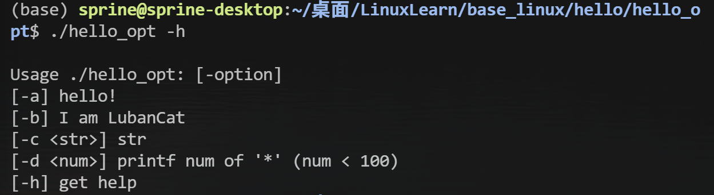

### 9. Linux 系统下的程序

#### 9.1 裸机下的 Hello World

单片机中 `hello_world` 程序的流程图：


- 第一步：进行源代码的编写，其中关键的点在于 `printf` 函数的实现，它需要依赖单片机的串口驱动程序。
- 第二步：借助一些集成开发环境进行程序的编译。一键编译，无需学习编译链接相关知识。
- 第三步：借助烧录工具烧录到具体芯片上。一键烧录，无需学习芯片的 flash 和各种各样启  动方式。
- 第四步：上电启动板卡，串口输出 “ Hello World ” 字符串。

#### 9.2 Linux 系统下的 Hello World

Linux 系统下， `hello_world` 程序的流程图如下：


- 第一部分，浅蓝色外框部分为程序的编译。
- 第二部分，浅黄色外框部分为 Linux 内核提供的服务。
- 第三部分，橘色外框部分为 `glibc` 库提供的服务。
- 第四部分，浅紫色外框部分，为用户程序。

针对每个子步骤的进一步讲解：

1. 预处理 `hello.c`，主要是处理程序里面的文件包含、处理宏定义、条件编译。

2. 把 c 文件编译成为汇编文件 (.s)，其中进行了词法分析，语法分析，语义分析、生成中间代  码、对代码进行优化等工作。

3. 把汇编文件 (.s) 编译成可重定位文件 (.o)。

4. 把可重定位文件 (.o) 链接成为可执行文件，其中链接可分为静态链接和动态链接。

    - **静态链接**：在编译阶段就会把所有用到的库打包到自己的可执行程序中，其优点是具有较好的兼容性，不依赖外部环境，但是生成的程序比较大。

    - **动态链接**：在应用程序运行时，链接器去加载外部的共享库，并完成共享库和动态编译程序之间的链接。不同的程序可以共用代码库，节省内存空间。

5. 控制台输入 `./hello`  命令后，Shell 会创建一个新的进程来执行该程序。`fork()` 函数就是用于创建一个新的进程的。这里的进程可以先简单理解为程序的容器。

6. `exeve()` 函数可以理解为向上一步新建的进程，填充一个可执行程序 (hello)。

7. `sys_execve()` 函数为 linux 系统调用，被 `exeve()` 函数调用，这里的系统调用可以理解为是操作系统系统开放给用户的最底层接口。

8. `do_exeve()` 函数是 `sys_execve()` 函数的核心。

9. `load_elf_binary()` 函数会去文件系统中读取 `hello`  程序到内存，然后判断它是否是动态链接的可执行程序，如果不是，则进一步判断是否是静态链接的文件。

10. `ld-linux-xx.so` 是 `glibc` 库中的动态连接器。如果 `hello` 程序是动态链接程序，该动态链接器会去加载共享库，并完成共享库和程序的链接工作，然后准备真正开始执行 `hello` 程序。

11. 相反，如果 `hello` 程序是静态编译的程序，则无需再加载链接共享库，直接开始准备执行  `hello` 程序。

    - 第 10 和 11 步分别执行之后，都会开始执行 `hello` 程序，`_start` 是程序的真正入口，而该符号在 `glibc` 中。也就是说程序的真正入口在 `glibc`。

12. `__libc_start_main()` 也是 `glibc` 中的函数，用于在执行用户程序前进行一些初始化工作。

13. 调用用户程序中的 `mian()` 函数,开始执行 `printf` 打印函数。

14. 程序执行完了之后，调用 `glibc` 库中的 `_exit()` 函数，来结束当前进程。

### 10. Makefile

#### 10.1 Makefile 是什么

在编译单个文件时，使用以下命令即可：

```bash
gcc hello.c -o hello
```

当一个工程中有很多 C 源文件和 H 头文件时，再直接使用编译器指令就非常麻烦了，如下例:

```bash
gcc hello.c aaa.c bbb.c -o hello
```

而且哪怕只是修改一个文件，也需要重新编译所有的文件，白白浪费了很多开发时间。

解决这个问题最好的方式就是把工程的编译规则写下来，让编译器自动加载该规则进行编译。解决方法就是使用 make 和 Makefile，这两个工具是搭配使用的：

- **make 工具**：可以帮助我们找出项目里面修改变更过的文件，并根据依赖关系，找出受修改影响的其他相关文件，然后对这些文件按照规则进行单独的编译，这样一来就能避免重新编译项目的所有的文件。
- **Makefile 文件**：上面提到的规则、依赖关系主要是定义在这个 Makefile 文件中的，在其中合理地定义好文件的依赖关系之后，make 工具就能精准地进行编译工作。


管理一个项目工程，实质上就是管理项目文件间的依赖关系。在学习和使用 Makefile 的时候，一定要牢牢抓住它这种面向依赖的思想，心里一定要谨记，**Makefile 中所有的复杂、晦涩的语法都是更好地为解决依赖问题而存在的**。

当工程复杂度再上一个台阶的时候，会觉得手写 Makefile 也很麻烦，那个时候可以用 CMake、autotools 等工具来帮忙生成 Makefile。


#### 10.2 常用的 Makefile 知识点


1. **基础语法** ：描述目标和依赖的特定格式，Makefile 的核心。
2. **变量**：记录特定的信息，避免重复输入原始信息，尤其是当需要手动输入的信息很长时。
3. **分支判断**：灵活控制多个不同的编译过程，方便兼容不同属性。
4. **头文件依赖**：监控头文件的变化，头文件也是程序的关键内容。
5. **隐含规则**：利用 Makefile 的一些默认规则，可以减少编写 Makefile 的工作量。
6. **自动化变量**：利用 Makefile 的默认的自动化变量，可以减少编写 Makefile 的工作量。
7. **模式规则**：灵活使用正则表达式，减少编写 Makefile 的工作量。
8. **函数**：使用 Makefile 的各种函数，可以更方便地实现 Makefile 的功能。

Makefile 的核心在于基础语法，用来描述目标和依赖的关系。其他语法的目的，是为了减少编写 Makefile 工作量，让开发人员能够以更加优雅、更加简洁、更好维护的方式来实现 Makefile 的功能。

#### 10.3 使用 Makefile 控制编译

使用以下命令安装 Makefile 工具:

```bash
sudo apt install make
```

本节的代码目录为 `./base_linux/makefile` 。

##### 10.3.1 Makefile 小实验

```makefile
# path: base_linux/makefile/test1/Makefile
targeta: targetc targetb
        ls -lh

targetb:
        touch test.txt

targetc: 
        pwd

targetd:
        rm -f test.txt
```

- 这个 Makefile 文件主要是定义了四个目标操作

- 第一个目标 `targeta`，是最终目标及 make 的默认目标

- `targeta: targetc targetb` ：目标 a，依赖于目标 `targetc` 和 `targetb`

    ` Tab ls -lh` ：目标要执行的 shell 命令 `ls -lh`，列出目录下的内容

- `targetb:` ：目标 b，无依赖

    `Tab touch test.txt` ：目标要执行的 shell 命令，使用 `touch` 创建 `test.txt` 文件

- `targetc:` ：目标 c，无依赖

    `Tab pwd` ：目标要执行的 shell 命令，`pwd` 显示当前路径

- `targetd` ：目标 d，无依赖

    由于 abc 目标都不依赖于目标 d，所以直接 make 时目标 d 不会被执行

    可以使用 `make targetd` 命令执行

make 程序会根据 Makefile 中描述的目标与依赖关系，执行达成目标需要的 shell 命令。简单来说，Makefile 就是用来指导 make 程序如何干某些事情的清单。

##### 10.3.2 使用 Makefile 编译程序

###### 10.3.2.1 使用 GCC 编译多个文件

使用 vim 在指定路径下创建并编写以下文件：

```c
// path: base_linux/makefile/test2/hello_main.c
#include "hello_func.h"

int main(void)
{
    hello_func();
    return 0;
}
```

```c
// path: base_linux/makefile/test2/hello_func.c
#include <stdio.h>
#include "hello_func.h"

void hello_func(void)
{
        printf("hello, world! This is a C program.\n");
        for (int i = 0; i < 10; i++)
        {
                printf("output i = %d\n", i);
        }
}
```

```c
// path: base_linux/makefile/test2/hello_func.h
void hello_func(void);
```

编写完成后在 `/makefile/test2/` 目录下使用 GCC 进行编译：

```bash
gcc hello_main.c hello_func.c -o hello_main -I .
```

- `-I .`  ：告诉编译器头文件路径，让它在编译时可以在 “.” (当前目录)寻找头文件

运行生成的 `hello_main` 程序：

```bash
./hello_main
```

 

###### 10.3.2.2 使用 Makefile 编译

使用 vim 创建 Makefile 文件并编写如下代码:

```makefile
# path: base_linux/makefile/test2/Makefile
hello_main: hello_main.c hello_func.c
	gcc -o hello_main hello_main.c hello_func.c -I .

clean:
	rm -f *.o hello_main
```

使用 `make` 命令编译程序：

```bash
rm hello_main # 移除上一节 gcc 编译的程序
ls

make # 使用 make 进行编译
ls

make # 再次使用 make 编译

touch hello_func.c # 更新 hello_func.c 文件时间为当前系统时间

make # 再次编译

make clean # 调用 make clean 清除程序
ls
```

- make 会对目标文件和依赖进行更新检查，当依赖文件有改动时，才会再次执行命令更新目标文件。


#### 10.4 目标与依赖

Makefile 中跟目标相关的语法：

```makefile
[目标 1]: [依赖]
	[命令 1]
	[命令 2]
[目标 2]: [依赖]
	[命令 1]
	[命令 2]
```

- **目标** ：指 make 要做的事情，可以是一个简单的代号，也可以是目标文件，需要顶格书写，  前面不能有空格或 Tab。

    一个 Makefile 可以有多个目标，写在最前面的第一个目标，会被  Make 程序确立为 *默认目标*，例如前面的 `targeta`、`hello_main`。

- **依赖** ：要达成目标需要依赖的某些文件或其它目标。例如前面的 `targeta` 依赖于 `targetb` 和  `targetc`，又如在编译的例子中，`hello_main` 依赖于 `hello_main.c`、`hello_func.c` 源文件，若这些文件更新了会重新进行编译。

- **命令 1，命令 2 ⋯ 命令 n** ：make 达成目标所需要的命令。只有当目标不存在或依赖文件的修改时间比目标文件还要新时，才会执行命令。要特别注意**命令的开头要用 `Tab` 键，不能使用空格代替**，有的编辑器会把 `Tab` 键自动转换成空格导致[出错](#make 编译报错 *** missing separator.  Stop.)，若出现这种情况请检查自己的编辑器配置。**OTHER - [VSCode 中将默认的空格缩进更改为 Tab 缩进](#VSCode 中将默认的空格缩进更改为 Tab 缩进)**

#### 10.5 伪目标

前面我们在 Makefile 中编写的目标，在 make 看来其实都是目标文件，例如 make 在执行的时候由于在目录找不到 `targeta` 文件，所以每次 `make targeta` 的时候，它都会去执行 `targeta` 的命令，期待执行后能得到名为 `targeta` 的同名文件。如果目录下真的有 `targeta`、`targetb`、`targetc` 的文件，即假如目标文件和依赖文件都存在且是最新的，那么 `make targeta` 就不会被正常执行了，这会引起误会。

Makefile 使用 **`.PHONY`** 前缀来区分目标代号和目标文件，并且这种目标代号被称为**伪目标**，phony 单词翻译过来本身就是假的意思。

也就是说，只要我们不期待生成目标文件，就应该把对应的目标定义成伪目标。

前面 [10.3.1](#10.3.1 Makefile 小实验) 的演示代码修改如下：

```makefile
 # path: base_linux/makefile/test1/Makefile
.PHONY: targeta
targeta: targetc targetb
	ls -lh

.PHONY: targetb
targetb:
	touch test.txt
	
.PHONY: targetc
targetc:
	pwd
	
.PHONY: targetd
targetd:
	rm -f test.txt
```

```bash
cd /base_linux/makefile/
cp -r test2 test3
cd test3
touch clean
```

[10.3.2.2](#10.3.2.2 使用 Makefile 编译) 的演示代码修改如下:

```makefile
# path: base_linux/makefile/test3/Makefile
hello_main: hello_main.c hello_func.c
	gcc -o hello_main hello_main.c hello_func.c -I .

.PHONY: clean
clean:
	rm -f *.o hello_main
```

如果以上代码中不写 `.PHONY:clean` 语句，并且在目录下创建一个名为 `clean` 的文件，那么当  执行 `make clean` 时，`clean` 的命令并不会被执行。

#### 10.6 默认规则

GCC 的整个编译过程包含如下步骤，make 在执行时也是使用同样的流程，不过在 Makefile 的实际应用中，通常会把编译和最终的链接过程分开。


```mermaid
graph LR;
	A[hello.c] --> |编译|B[hello.o] --> |链接|C[hello]
	B --> |make 默认依赖|A
	C --> |依赖|B
```


即我们的 `hello_main` 目标文件本质上并不是依赖 `hello_main.c` 和 `hello_func.c` 文件，而是依赖于 `hello_main.o` 和 `hello_func.o`，把这两个文件链接起来就能得到我们最终想要的 `hello_main`  目标文件。

make 有一条默认规则，当找不到 `xxx. o` 文件时，会查找目录下的同名  `xxx.c` 文件进行编译。根据这样的规则，我们可把 Makefile 改修改如下。

```makefile
# path: base_linux/makefile/test4/Makefile
hello_main: hello_main.o hello_func.o
	gcc -o hello_main hello_main.o hello_func.o

# 以下是 make 的默认规则，可以不写
#hello_main.o: hello_main.c
#	gcc -c hello_main.c
	
#hello_func.o: hello_func.c
#	gcc -c hello_func.c
```

最终使用 make 的编译结果如下：

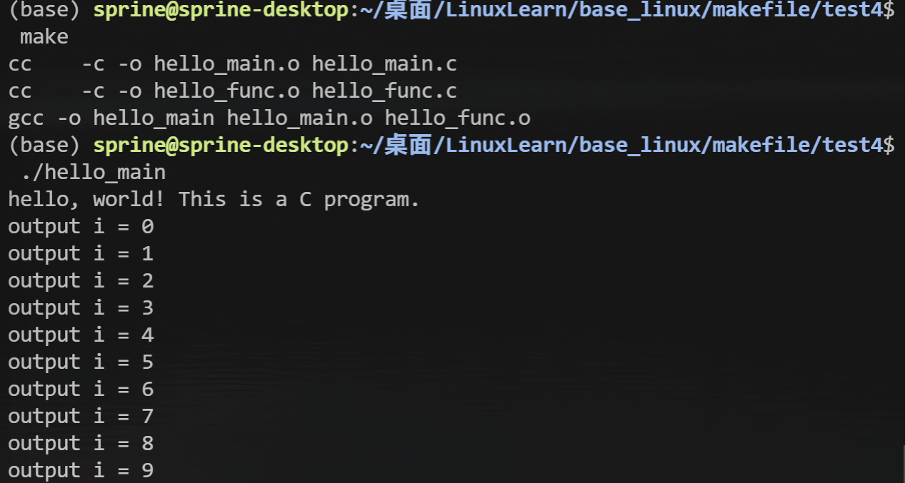

从 make 的输出可看到，它先执行了两条额外的 `cc` 编译命令，这是由 make 默认规则执行的，  它们把 C 代码编译生成了同名的 `.o` 文件，然后 make 根据 Makefile 的命令链接这两个文件得到最终目标文件 `hello_main`。

#### 10.7 使用变量

使用 C 自动编译成 `*.o` 的默认规则有个缺陷，由于没有显式地表示 `*.o` 依赖于`.h` 头文件，假如我们修改了头文件的内容，那么 `*.o` 并不会更新，这是不可接受的。并且默认规则使用固定的 `cc`  进行编译，假如我们想使用 ARM-GCC 进行交叉编译，那么系统默认的 `cc` 会导致编译错误。  要解决这些问题并且让 Makefile 变得更加通用，需要引入变量和分支进行处理。

##### 10.7.1 基本语法

在 Makefile 中的变量，有点像 C 语言的宏定义，在引用变量的地方使用变量值进行替换。变量的命名可以包含字符、数字、下划线,区分大小写，定义变量的方式有以下四种：

- `=` ：延时赋值，该变量只有在调用的时候，才会被赋值。
- `:=` ：直接赋值，与延时赋值相反，使用直接赋值的话，变量的值定义时就已经确定了。
- `?=` ：若变量的值为空，则进行赋值，通常用于设置默认值。
- `+=` ：追加赋值，可以往变量后面增加新的内容。

当我们想使用变量时，其语法如下：

```makefile
$(变量名)
```

实验代码：

```makefile
# path: base_linux/makefile/test5/Makefile
VAR_A = FILEA
VAR_B = $(VAR_A)
VAR_C := $(VAR_A)
VAR_A += FILEB
VAR_D ?= FILED

.PHONY: check
check:
	@echo "VAR_A:" $(VAR_A)
	@echo "VAR_B:" $(VAR_B)
	@echo "VAR_C:" $(VAR_C)
	@echo "VAR_D:" $(VAR_D)
```


执行完 make 命令后，只  有 VAR_C 是 `FILEA`。这是因为 VAR_B 采用的延时赋值，只有当调用时，才会进行赋值。当调  用 VAR_B 时，VAR_A 的值已经被修改为 `FILEA FILEB`，因此 VAR_B 的变量值也就等于 `FILEA  FILEB`。

##### 10.7.2 改造默认规则

下面使用变量对 [hello_main](#10.3.2.2 使用 Makefile 编译) 的 Makefile 进行大改造：

```makefile
# path: base_linux/makefile/test6/Makefile
# 定义变量
CC = gcc
CFLAGS = -I .
DEPS = hello_func.h

# 目标文件
hello_main: hello_main.o hello_func.o
	$(CC) -o hello_main hello_main.o hello_func.o
	
# *.o 文件的生成规则
%.o: %.c $(DEPS)
	$(CC) -c -o $@ $< $(CFLAGS)

# 伪目标
.PHONY: clean
clean:
	rm -f *.o hello_main
```

- 代码的 3~5 行：分别定义了 CC、CFLAGS、DEPS 变量，变量的值就是等号右侧的内容，定  义好的变量可通过 `$(变量名)` 的形式引用，如后面的 `$(CC)`、`$( CFLAGS)`、`$(DEPS)`  等价于定义时赋予的变量值 `gcc`、`-I.` 和 `hello_func.h`。

- 代码的第 9 行：使用 `$(CC)` 替代了 `gcc`，这样编写的 Makefile 非常容易更换不同的编译器，如要进行交叉编译，只要把开头的编译器名字修改掉即可。

- 代码的第 12 行：`%` 是一个通配符，功能类似 `*`，如 `%.o` 表示所有以 `.o` 结尾的文件。

    即等价于 o 文件依赖于 c 文件的默认规则。不过这行代码后面的 `$(DEPS)` 表示它除了依赖 c 文件，还依赖于变量 `$(DEPS)` 表示的头文件，所以当头文件修改的话 `.o` 文件也会被重新编译。

- 代码的第 13 行：这行代码出现了特殊的变量 `$@` 、`$<` ，可理解为 Makefile 文件保留的关键字，是系统保留的自动化变量:

    - `$@` 代表了目标文件
    - `$<` 代表了第一个依赖文件

    即 `$@` 表示 `%.o`，`$<` 表示 `%.c` ，所以当第 11 行的 `%` 匹配的字符为 `hello_func` 的话，第 13 行代码等价于：

    ```makefile
    $(CC) -c -o $@ $< $(CFLAGS)
    # 等价于
    gcc -c -o hello_func.o hello_func.c -I .
    ```

    也就是说 makefile 可以利用变量及自动化变量，来重写 `.o` 文件的默认生成规则，以及增加头文件的依赖。


##### 10.7.3 改造链接规则

与 *.o 文件的默认规则类似，我们也可以使用变量来修改生成最终目标文件的链接规则，具体参  考如下代码。

```makefile
# path: base_linux/makefile/test7/Makefile
# 定义变量
TARGET = hello_main
CC = gcc
CFLAGS = -I .
DEPS = hello_func.h
OBJS = hello_main.o hello_func.o

# 目标文件
$(TARGET): $(OBJS)
	$(CC) -o $@ $^ $(CFLAGS)

# *.o 文件的生成规则
%.o: %.c $(DEPS)
	$(CC) -c -o $@ $< $(CFLAGS)
	
# 伪目标
.PHONY: clean
clean:
	rm -f *.o hello_main
```

- 代码的第 3 行：定义了 `TARGET` 变量，它的值为目标文件名 `hello_main`。
- 代码的第 7 行：定义了 `OBJS` 变量，它的值为依赖的各个 o 文件，如 `hello_main.o`、`hello_func.o`  文件。
- 代码的第 10 行：使用 `TARGET` 和 `OBJS` 变量替换原来固定的内容。
- 代码的第 11 行：使用自动化变量 `$@` 表示目标文件 `$(TARGET)` ，使用自动化变量 `$^`  表示所有的依赖文件即 `$(OBJS)`。

以上代码中的 Makefile 把编译及链接的过程都通过变量表示出来了，非常通用。使用这样的 Makefile 可以针对不同的工程直接修改变量的内容就可以使用。

##### 10.7.4 其他自动化变量

| 符号 | 意义                                               |
| :--: | -------------------------------------------------- |
|  $@  | 匹配目标文件                                       |
|  $%  | 与 `$@` 类似，但 `$%` 仅匹配 “ 库 ” 类型的目标文件 |
|  $<  | 依赖中的第一个目标文件                             |
|  $^  | 所有的依赖目标，如果依赖中有重复的，只保留一份     |
|  $+  | 所有依赖的目标，即使依赖中有重复的也原样保留       |
|  $?  | 所有比目标要新的依赖目标                           |

#### 10.8 使用函数

在更复杂的工程中，头文件、源文件可能会放在二级目录，编译生成的 `*.o` 或可执行文件也放到  专门的编译输出目录方便整理，如下图所示。示例中 `*.h` 头文件放在 `includes` 目录下，`*.c` 文件放在 `sources` 目录下，编译输出存放在 `build` 中。

实现这些复杂的操作通常需要使用 Makefile 函数。


##### 10.8.1 函数格式及示例

在 Makefile 中调用函数的方法跟变量的使用类似，以 `$()` 或 `${}` 符号包含函数名和参数，具  体语法如下：

```makefile
$(函数名 参数)
# or
${函数名 参数}
```

###### 10.8.1.1 notdir 函数

**`notdir`** 函数用于去除文件路径中的目录部分，其格式如下：

```makefile
$(notdir 文件名)
```

例如输入参数 `./sources/hello_func.c`，函数执行后的输出为 `hell_func.c`，也就是说它会把输入中的 `./sources/` 路径部分去掉，保留文件名。使用范例如下:

```makefile
$(notdir ./source/hello_func.c)
```

上面的函数执行后会把路径中的 `./sources/` 部分去掉，输出为 `hello_func.c`

###### 10.8.1.2 wildcard 函数

**`wildcard`** 函数用于获取文件列表，并使用空格分隔开，其格式如下：

```makefile
$(wildcard 匹配规则)
```

例如函数调用 `$(wildcard *.c)` ，函数执行后会把当前目录的所有 c 文件列出。假设我们在  上图中的 Makefile 目录下执行该函数，使用范例如下:

```makefile
# 在 sources 目录下有 hello_func.c、hello_main.c、test.c 文件
$(wilecard sources/*.c)
# 函数的输出为：
sources/hello_func.c sources/hello_main.c sources/test.c
```

###### 10.8.1.3 patsubst 函数

**`patsubst`** 函数功能为模式字符串替换。它的格式如下:

```makefile
$(patsubst 匹配规则，替换规则，输入的字符串) 
```

当输入的字符串符合匹配规则，那么使用替换规则来替换字符串，当匹配规则中有 `%` 号时，替换规则也可以例程 `%` 号来提取 `%` 匹配的内容加入到最后替换的字符串中。示例如下：

```makefile
$(patsubst %.c, build_dir/%.o, hello_main.c)
# 函数的输出为:
build_dir/hello_main.o
# 执行如下函数
$(patsubst %.c, build_dir/%.o, hello_main.xxx)
# 由于 hello_main.xxx 不符合匹配规则 "%.c",所以函数没有输出
```

第一个函数调用中，由于 `hello_main.c` 符合 `%.c` 的匹配规则 ( `%` 在 Makefile 中的类似于 `*` 通配符 )，而且 `%` 从 `hello_main.c` 中提取出了 `hello_main` 字符，把这部分内容放到替换规  则 `build_dir/%.o` 的 `%` 号中，所以最终的输出为 `build_di r/hello_main.o`。 

 第二个函数调用中，由于由于 `hello_main.xxx` 不符合 `%.c` 的匹配规则，`.xxx` 与 `.c` 对  不上，所以不会进行替换，函数直接返回空的内容。

##### 10.8.2 多级结构工程的 Makefile

接下来我们使用上面三个函数修改我们的 Makefile，以适应包含多级目录的工程，修改后的内容如下所示：

```makefile
# path: base_linux/makefile/test8/Makefile
# Defining variables
TARGET = hello_main

# Path to store intermediate files
BUILD_DIR = build

# Path to store the source files
SRC_DIR = sources

# Path to store the include files
INC_DIR = includes .

# Source files
SRCS = $(wildcard $(SRC_DIR)/*.c)

# Object files (*.o)
OBJS = $(patsubst %.c, $(BUILD_DIR)/%.o, $(notdir $(SRCS)))

# Header files
DEPS = $(wildcard $(INC_DIR)/*.h)

# Specify the path to the header files
CFLAGS = $(patsubst %, -I %, $(INC_DIR))

# Target file
$(BUILD_DIR)/$(TARGET): $(OBJS)
	$(CC) -o $@ $^ $(CFLAGS)

# Generation rules for *.o files
$(BUILD_DIR)/%.o: $(SRC_DIR)/%.c $(DEPS)

# Create a compilation directory to store process files
# The command is preceded by '@', which means it will not be 
# output on the terminnal.
	@mkdir -p $(BUILD_DIR)
	$(CC) -c -o $@ $< $(CFLAGS)

# Phony target
.PHONY: clean cleanall

# Delete the output folder
clean: 
	rm -rf $(BUILD_DIR)
	
# Delete all
cleanall: 
	rm -rf $(BUILD_DIR)
```

目录结构如下：

```bash
.
├── includes
│   └── hello_func.h
├── Makefile
└── sources
    ├── hello_func.c
    └── hello_main.c
```


#### 10.9 使用分支

为方便直接切换 GCC 编译器，我们还可以使用条件分支增加切换编译器的功能。在 Makefile 中  的条件分支语法如下：

```makefile
ifeq (arg1, arg2)
分支 1
else
分支 2
endif
```

分支会比较括号内的参数 `arg1` 和 `arg2` 的值是否相同，如果相同，则为真，执行分支 1 的内容，否则的话，执行分支 2 的内容，参数 `arg1` 和 `arg2` 可以是变量或者是常量。

使用分支切换 GCC 编译器的 Makefile 如下所示：

```makefile
# path: base_linux/makefile/test9/Makefile
# Defining variables
# ARCH default to x86, using the gcc compiler
# Otherwise use the arm compiler
ARCH ?= arm
TARGET = hello_main

# Path to store intermediates files
BUILD_DIR = build_$(ARCH)

# Path to store the source files
SRC_DIR = sources

# Path to store the includes files
INC_DIR = includes .

# The source files
SRCS = $(wildcard $(SRC_DIR)/*.c)

# The objects files
OBJS = $(patsubst %.c, $(BUILD_DIR)/%.o, $(notdir $(SRCS)))

# The header files
DEPS = $(wildcard $(INC_DIR)/*.h)

# Specity the path to the header files
CFLAGS = $(patsubst %, -I %, $(INC_DIR))

# Select compiler based on input ARCH variable
# ARCH = arm, use gcc
# ARCH = aarch64, use arm-gcc
ifeq ($(ARCH), arm)
CC = gcc
else
CC = aarch64-linux-gnu-gcc
endif

# Target file
$(BUILD_DIR)/$(TARGET): $(OBJS)
	$(CC) -o $@ $^ $(CFLAGS)

# Generation rules for the *.o files
$(BUILD_DIR)/%.o: $(SRC_DIR)/%.c $(DEPS)
	@mkdir -p $(BUILD_DIR)
	$(CC) -c -o $@ $< $(CFLAGS)
	
# Phony targets
.PHONY: clean cleanall

# Delete by Schema
clean:
	rm -rf $(BUILD_DIR)
	
# Delete all
cleanall:
	rm -rf build_aarch64 build_arm
```

- arm 交叉编译工具链 `aarch64-linux-gnu-gcc` 的获取与配置见：**[五. Linux驱动开发 - 2.1 获取编译工具链](#2.1 获取编译工具链)**
- 本示例中的 Makefile 目前只支持使用一个源文件目录，如果有多个源文件目录还需要改进。


### 11. 文件操作与系统调用

在 Linux 系统中有一个重要的概念：一切皆文件，它把一切资源都看作是文件，包括硬件设备，  通常称为设备文件。

本节的代码目录为 `./base_linux/file_io`

#### 11.1 存储设备文件系统

为了高效地存储和管理数据，文件系统在存储介质上建立了一种组织结构，这些结构包括操作系  统引导区、目录和文件，就如同图书馆给不同类的书籍进行分类、编号，放在不同的书架上。不  同的管理理念引出了不同的文件系统标准，上述的 FAT32、NTFS、exFAT、ext2/3/4 就是指不同类型的标准，除此之外，还有专门针对 NAND 类型设备的文件系统 jffs2、yaffs2 等等。

各种不同标准文件系统的特性：

- **FAT32 格式**：兼容性好，STM32 等 MCU 也可以通过 Fatfs 支持 FAT32 文件系统，大部分  SD 卡或 U 盘出厂默认使用的就是 FAT32 文件系统。它的主要缺点是技术老旧，单个文件  不能超过 4GB，非日志型文件系统。
- **NTFS 格式**：单个文件最大支持 256TB、支持长文件名、服务器文件管理权限等，而且 NTFS  是日志型文件系统。但由于是日志型文件系统，会记录详细的读写操作，相对来说会加快 FLASH 存储器的损耗。文件系统的日志功能是指，它会把文件系统的操作记录在磁盘的某个分区，当系统发生故障时，能够尽最大的努力保证数据的完整性。
- **exFAT 格式**：基于 FAT32 改进而来，专为 FLASH 介质的存储器设计 ( 如 SD 卡、U 盘)，空  间浪费少。单个文件最大支持16EB，非日志文件系统。
- **ext2 格式**：简单,文件少时性能较好，单个文件不能超过 2TB，非日志文件系统。
- **ext3 格式**：相对于 ext2 主要增加了支持日志功能。
- **ext4 格式**：从 ext3 改进而来，ext3 实际是 ext4 的子集。它支持 1EB 的分区，单个文件最大支持 16TB，支持无限的子目录数量，使用延迟分配策略优化了文件的数据块分配，允许自主控制是否使用日志的功能。
- **jffs2 和 yaffs2 格式**：jffs2 和 yaffs2 是专为 FLASH 类型存储器设计的文件系统，它们针对  FLASH 存储器的特性加入了擦写平衡和掉电保护等特性。由于 Nor、NAND FLASH 类型存  储器的存储块的擦写次数是有限的 ( 通常为 10 万次 ) ，使用这些类型的文件系统可以减少  对存储器的损耗。

总的来说，在 Linux 下，ext2 适用于 U 盘 ( 但为了兼容，使用得比较多的还是 FAT32 或 exFAT），  日常应用推荐使用 ext4，而 ext3 使用的场景大概就只剩下对 ext4 格式的稳定性还有疑虑的用户了，但 ext4 从 2008 年就已结束实验期，进入稳定版了，可以放心使用。

Linux 内核本身也支持 FAT32 文件系统，而使用 NTFS 格式则需要安装额外的工具如 ntfs-3g。所以使用板卡出厂的默认 Linux 系统时，把 FAT32 格式的 U 盘直接插入到板卡是可以自动挂载的，而 NTFS 格式的则不支持。

主机上的 Ubuntu 对于 NTFS 或 FAT32 的 U 盘都能自动识别并挂载,  因为 U buntu 发行版安装了相应的支持。目前微软已公开 exFAT 文件系统的标准，且已把它开源至 Linux，未来 Linux 可能也默认支持 exFAT。

对于非常在意 FLASH 存储器损耗的场合，则可以考虑使用 jffs2 或 yaffs2 等文件系统。

在 Linux 下，可以通过如下命令查看系统当前存储设备使用的文件系统：

```bash
df -T
```


#### 11.2 伪文件系统

除了前面介绍的专门用于存储设备记录文件的文件系统外，Linux 内核还提供了 procfs、sysfs 和  devfs 等伪文件系统。

伪文件系统存在于内存中，通常不占用硬盘空间，它以文件的形式，向用户提供了访问系统内核  数据的接口。用户和应用程序可以通过访问这些数据接口，得到系统的信息，而且内核允许用户  修改内核的某些参数。

##### 11.2.1 procfs 文件系统

procfs 是 process filesystem 的缩写，所以它也被称为进程文件系统，procfs 通常会自动挂载在根目录下的/proc 文件夹。procfs 为用户提供内核状态和进程信息的接口，功能相当于 Windows 的任务管理器。

使用如下命令可以查看 proc 文件系统的内容：

- 查看 CPU 信息

    ```bash
    cat /proc/cpuinfo
    ```

    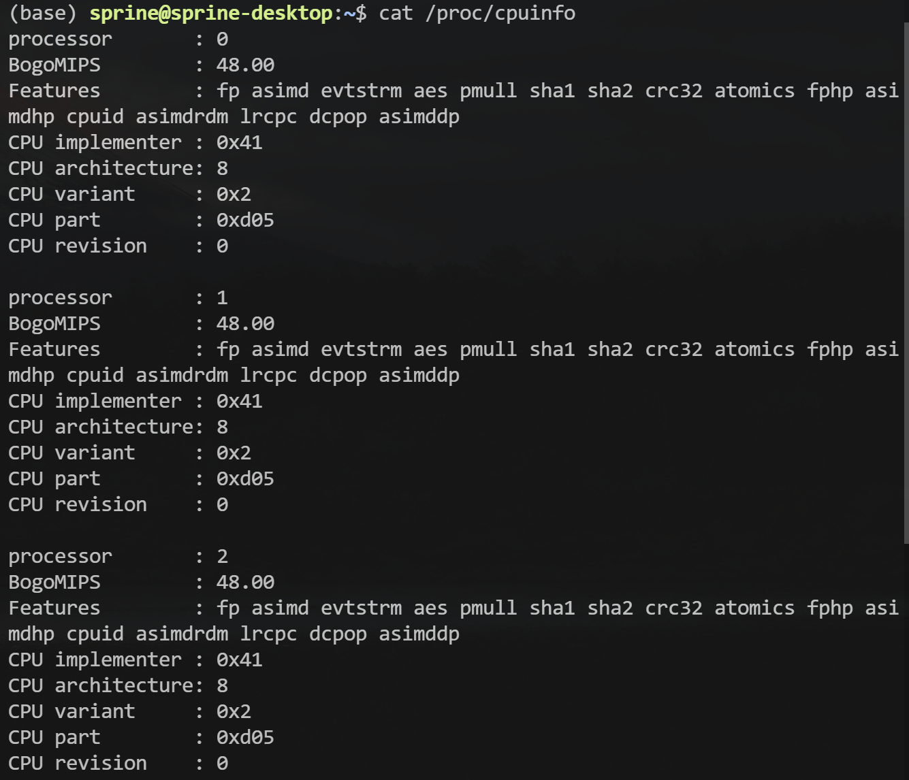

- 查看 proc 目录

    ```bash
    ls /proc
    ```

    

`ls /proc`  包含了非常多以数字命名的目录，这些数字就是进程的 PID 号，其它文件或目录的一些说明见下表：

`/proc` 各个文件的作用：

|   文件名    | 作用                                                         |
| :---------: | ------------------------------------------------------------ |
|    pid*     | * 表示的是进程的 PID 号，系统中当前运行的每一个进程都有对应的一个目录，用于记录进程所有相关信息。对于操作系统来说，一个应用程序就是一个进程。 |
|    self     | 该文件是一个软链接，指向了当前进程的目录，通过访问 `/proc/self/` 目录来获取当前进程的信息，就不用每次都获取 pid。 |
| threadself  | 该文件也是一个软链接，指向了当前线程，访问该文件，等价于访问 “ 当前进程 `pid/task/` 当前线程 `tid` ” 的内容。一个进程，可以包含多个线程，但至少需要一个进程，这些线程共同支撑进程的运行。 |
|   version   | 记录了当前运行的内核版本，通常可以使用命令 `uname –r` 。     |
|   cpuinfo   | 记录系统中 CPU 的提供商和相关配置信息。                      |
|   modules   | 记录了目前系统加载的模块信息。                               |
|   meminfo   | 记录系统中内存的使用情况，`free` 命令会访问该文件，来获取系统内存的空闲和已使用的数量。 |
| filesystems | 记录内核支持的文件系统类型，通常 `mount` 一个设备时，如果没有指定文件系统并且它无法确定文件系统类型时，mount 会尝试包含在该文件中的文件系统，除了那些标有 `nodev` 的文件系统。 |

使用如下命令来查看当前 `bash` 进程的 PID 号：

```bash
ps
```

每个人的计算机运行运行状况不一样，所以得到的进程号也是不一样，如下图所示，当前得到  `bash` 进程的 pid 是 `38006` :

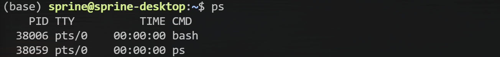

根据这个 pid 号，查看 `proc/38006` 目录的内容，它记录了进程运行过程的相关信息：

```bash
ls /proc/38006
```


该目录下的一些文件夹和文件的意义如下表：

|  文件名   | 文件内容                                                     |
| :-------: | ------------------------------------------------------------ |
|  cmdline  | 只读文件，记录了该进程的命令行信息，如命令以及命令参数       |
|   comm    | 记录了进程的名字                                             |
|  environ  | 进程使用的环境变量                                           |
|    exe    | 软连接文件，记录命令存放的绝对路径                           |
|    fd     | 记录进程打开文件的情况，以文件描述符作为目录名               |
|  fdinfo   | 记录进程打开文件的相关信息，包含访问权限以及挂载点，由其文件描述符命名 |
|    io     | 记录进程读取和写入情况                                       |
| map_files | 记录了内存中文件的映射情况，以对应内存区域起始和结束地址命名 |
|   maps    | 记录当前映射的内存区域，其访问权限以及文件路径               |
|   stack   | 记录当前进程的内核调用栈信息                                 |
|  status   | 记录进程的状态信息                                           |
|  syscall  | 显示当前进程正在执行的系统调用，第一列记录了系统调用号       |
|   task    | 记录了该进程的线程信息                                       |
|   wcham   | 记录当前进程处于睡眠状态，内核调用的相关函数                 |

如果是文件，可以直接使用 `cat` 命令输出对应文件的内容可查看，如查看进程名：

```bash
cat /proc/38006/comm
```


前面的 `ps` 命令也是通过 proc 文件系统获取到相关进程信息的。

##### 11.2.2 sysfs 文件系统

Linux 内核在 2.6 版本中引入了 sysfs 文件系统，sysfs 通常会自动挂载在根目录下的 `sys` 文件夹。

sys 目录下的文件/文件夹向用户提供了一些关于设备、内核模块、文件系统以及其他内核组件的  信息，如子目录 `block` 中存放了所有的块设备，而 `bus` 中存放了系统中所有的总线类型，有 `i2c`、  `usb`、`sdi o`、`pci` 等。

下图中的虚线表示软连接，可以看到所有跟设备有关的文件或文件夹都链接 到了 `device` 目录下，类似于将一个大类，根据某个特征分为了无数个种类，这样使得 `/sys` 文件夹的结构层次清晰明了：

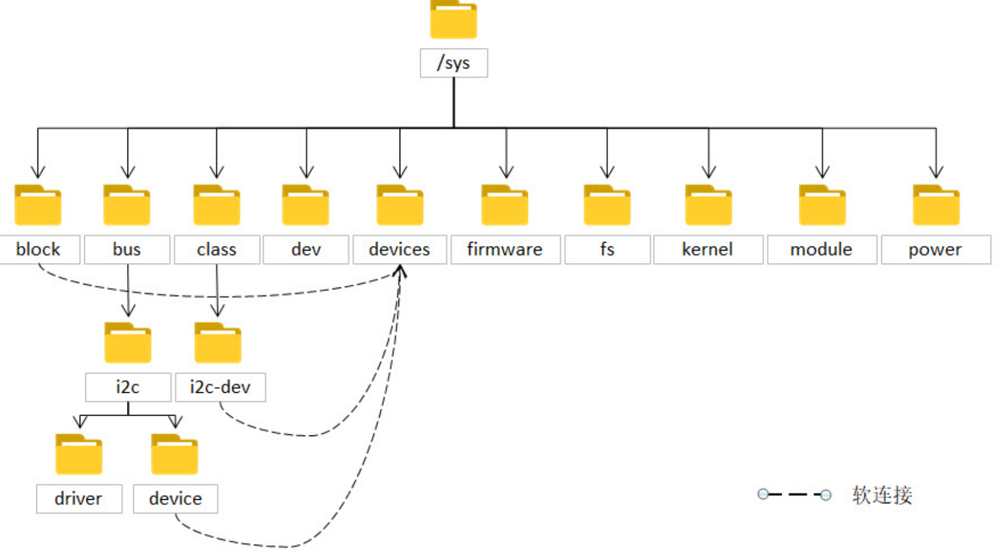

`/sys` 各个文件的作用：

| 文件名  | 作用                                                         |
| :-----: | ------------------------------------------------------------ |
|  block  | 记录所有在系统中注册的块设备，这些文件都是符号链接，都指向了`/sys/devices` 目录。 |
|   bus   | 该目录包含了系统中所有的总线类型，每个文件夹都是以每个总线的类型来进行命名。 |
|  class  | 包含了所有在系统中注册的设备类型，如块设备、声卡、网卡等。文件夹下的文件同样也是一些链接文件，指向了 `/sys/devices` 目录。 |
| devices | 包含了系统中所有的设备，到跟设备有关的文件/文件夹，最终都会指向该文件夹。 |
| module  | 该目录记录了系统加载的所有内核模块，每个文件夹名以模块命名。 |
|   fs    | 包含了系统中注册文件系统。                                   |

概括来说，sysfs 文件系统是内核加载驱动时，根据系统上的设备和总线构成导出的分级目录，它是系统上设备的直观反应，每个设备在 sysfs 下都有唯一的对应目录，用户可以通过具体设备目  录下的文件访问设备。

##### 11.2.3 devfs 文件系统

在 Linux 2.6 内核之前一直使用的是 devfs 文件系统管理设备，它通常挂载于 `/dev` 目录下。

devfs 中的每个文件都对应一个设备，用户也可以通过 `/dev` 目录下的文件访问硬件。在 sysfs 出现之前，devfs 是在制作根文件系统的时候就已经固定的，这不太方便使用，而当代的 devfs 通常会在系统运行时使用名为 `udev` 的工具根据 sysfs 目录生成 devfs 目录。在后面学习制作根文件系统时，就会接触到静态 devfs 以及使用 `udev` 动态生成 devfs 的选项。

#### 11.3 虚拟文件系统

除了前面提到的存储器文件系统 FAT32、ext4,伪文件系统/proc、/sys、/dev 外，还有内存文件系统  ramfs，网络文件系统 nfs 等等，不同的文件系统标准，需要使用不同的程序逻辑实现访问，对外提供的访问接口可能也稍有差异。但是我们在编写应用程序时，大都可以通过类似 `fopen`、`fread`、  `fwrite` 等 C 标准库函数访问文件，这都是虚拟文件系统的功劳。

Linux 内核包含了文件管理子系统组件，它主要实现了虚拟文件系统 ( Virtual File System , VFS)，虚拟文件系统屏蔽了各种硬件上的差异以及具体实现的细节，为所有的硬件设备提供统一的接口，从而达到设备无关性的目的，同时文件管理系统还为应用层提供统一的 API 接口。

在 Linux 下，一个与文件操作相关的应用程序结构如下图所示：


上图解构如下：

- 应用层指用户编写的程序，如我们的 `hello.c`。

- GNU C 库 ( glibc ) 即 C 语言标准库，例如在编译器章节介绍的 [`libc.so.6`](#8.1.3 glibc 库) 文件，它包含了

    `printf`、`malloc`，以及本章使用的 `fopen`、`fread`、`fwrite` 等文件操作函数。

- 用户程序和 glibc 库都是属于用户空间的，本质都是用户程序。
- 应用层的程序和 glibc 可能会调用到 “ 系统调用层 ( SCI ) ” 的函数，这些函数是 Linux 内核  对外提供的函数接口，用户通过这些函数向系统申请操作。例如 C  库的 `printf` 函数使用了  系统的 `vsprintf` 和 `write` 函数，C 库的 `fopen`、`fread`、`fwrite` 分别调用了系统的 `open`、`read`、`write` 函数，具体可以阅读 glibc 的源码了解。
- 由于文件系统种类非常多，跟文件操作相关的 `open`、`read`、`write` 等函数经过虚拟文件系统层，再访问具体的文件系统。

总的来说，为了使不同的文件系统共存，Linux 内核在用户层与具体文件系统之前增加了虚拟文  件系统中间层，它对复杂的系统进行抽象化，对用户提供了统一的文件操作接口。无论是 ext2/3/4、  FAT32、NTFS 存储的文件，还是 `/proc`、`/sys` 提供的信息还是硬件设备，无论内容是在本地还是网络上，都使用一样的 `open`、`read`、`write` 来访问，使得 “ 一切皆文件 ” 的理念被实现，这也正是软件中间层的魅力。

#### 11.4 Linux 系统调用

从上图可了解到，系统调用 ( System Call ) 是操作系统提供给用户程序调用的一组 “ 特殊 ” 函数  接口 API，文件操作就是其中一种类型。实际上，Linux 提供的系统调用包含以下内容：

- 进程控制：如 `fork`、`clone`、`exit` 、`setpriority` 等创建、中止、设置进程优先级的操作。
- 文件系统控制：如 `open`、`read`、`write` 等对文件的打开、读取、写入操作。
- 系统控制：如 `reboot`、`stime`、`init_module` 等重启、调整系统时间、初始化模块的系统操作。
- 内存管理：如 `mlock`、`mremap` 等内存页上锁重、映射虚拟内存操作。
- 网络管理：如 `sethostname`、`gethostname` 设置或获取本主机名操作。
- socket 控制：如 `socket`、`bind`、`send` 等进行 TCP、UDP 的网络通讯操作。
- 用户管理：如 `setuid`、`getuid` 等设置或获取用户 ID 的操作。
- 进程间通信：包含信号量、管道、共享内存等操作。

从逻辑上来说，系统调用可被看成是一个 Linux 内核与用户空间程序交互的中间人，它把用户进  程的请求传达给内核，待内核把请求处理完毕后再将处理结果送回给用户空间。它的存在就是为  了对用户空间与内核空间进行隔离，要求用户通过给定的方式访问系统资源，从而达到保护系统  的目的。

也就是说，我们心心念念的 Linux 应用程序与硬件驱动程序之间，就是各种各样的系统调用，所  以无论出于何种目的，系统调用是学习 Linux 开发绕不开的话题。

#### 11.5 文件操作（C 标准库）

本小节讲解使用通用的 C 标准库接口访问文件，标准库实际是对系统调用再次进行了封装。使  用 C 标准库编写的代码，能方便地在不同的系统上移植。

例如 Windows 系统打开文件操作的系统 API 为 `OpenFile`，Linux 则为 `open`，C 标准库都把它们封装为 `fopen`，Windows 下的 C 库会通过 `fopen` 调用 `OpenFile` 函数实现操作，而 Linux 下则通过 glibc  调用 `open` 打开文件。用户代码如果使用 `fopen`，那么只要根据不同的系统重新编译程序即可，而不需要修改对应的代码。

##### 11.5.1 常用文件操作（C 标准库）

在开发时，遇到不熟悉的库函数或系统调用，要**善用 man 手册**，而不要老是从网上查找。C 标准库提供的常用文件操作简介如下：

###### 11.5.1.1 fopen 函数

`fopen` 库函数用于打开或创建文件，返回相应的文件流。它的函数原型如下：

```c
#include <stdio.h>
FILE *fopen(const char *pathname, const char *mode);
```

- `pathname` 参数用于指定要打开或创建的文件名

- `mode` 参数用于指定文件的打开方式，注意该参数是一个字符串，输入时需要带双引号：
    - `"r"` ：以只读方式打开，文件指针位于文件的开头。
    - `“r+”` ：以读和写的方式打开，文件指针位于文件的开头。
    - `“w”` ：以写的方式打开，不管原文件是否有内容都把原内容清空掉，文件指针位于文件的开头。
    - `“w+”` ：同上，不过当文件不存在时，前面的 `“w”` 模式会返回错误，而此处的 `“w+”` 则会创建新文件。
    - `“a”` ：以追加内容的方式打开，若文件不存在会创建新文件，文件指针位于文件的末尾。与  `“w+”` 的区别是它不会清空原文件的内容而是追加。
    - `“a+”` ：以读和追加的方式打开，其它同上。
    - `fopen` 的返回值是 FILE 类型的文件文件流，当它的值不为 NULL 时表示正常，后续的 `fread`、 `fwrite` 等函数可通过文件流访问对应的文件。

###### 11.5.1.2 fread 函数

`fread` 库函数用于从文件流中读取数据。它的函数原型如下：

```c
#include <stdio.h>
size_t fread(void *ptr, size_t size, size_t nmemb, FILE *stream);
```

`stream` 是使用 `fopen` 打开的文件流，`fread` 通过它指定要访问的文件，它从该文件中读取 `nmemb` 项数据，每项的大小为 `size`，读取到的数据会被存储在 `ptr` 指向的数组中。`fread` 的返回值为成功读取的项数 ( 项的单位为 `size` ) 。

###### 11.5.1.3 fwrite 函数

`fwrite` 库函数用于把数据写入到文件流。它的函数原型如下：

```c
#include <stdio.h>
size_t fwrite(void *ptr, size_t size, size_t nmemb, FILE *stream);
```

 它的操作与 `fread` 相反，把 `ptr` 数组中的内容写入到 `stream` 文件流，写入的项数为 `nmemb`，每项大小为 `size`，返回值为成功写入的项数 ( 项的单位为 `size` ) 。

###### 11.5.1.4 fclose 函数

`fclose` 库函数用于关闭指定的文件流，关闭时它会把尚未写到文件的内容都写出。因为标准库会对数据进行缓冲，所以需要使用 `fclose` 来确保数据被写出。它的函数原型如下：

```c
#include <unistd.h>
int close(int fd);
```

###### 11.5.1.5 fflush 函数

`fflush` 函数用于把尚未写到文件的内容立即写出。常用于确保前面操作的数据被写入到磁盘上。  `fclose` 函数本身也包含了 `fflush` 的操作。`fflush` 的函数原型如下：

```c
#include <stdio.h>
int fflush(FILE *stream);
```

###### 11.5.1.6 fseek 函数

`fseek` 函数用于设置下一次读写函数操作的位置。它的函数原型如下：

```c
#include <stdio.h>
int fseek(FILE *stream, long offset, int whence);
```

其中的 `offset` 参数用于指定位置，`whence` 参数则定义了 `offset` 的意义，`whence` 的可取值如下：

- SEEK_SET：`offset` 是一个绝对位置。
- SEEK_END：`offset` 是以文件尾为参考点的相对位置。

- SEEK_CUR：`offset` 是以当前位置为参考点的相对位置。

##### 11.5.2 实验代码分析

```c
// path: base_linux/file_io/stdio/stdio.c
#include <stdio.h>
#include <string.h>

// The string to be written
const char buf[] = "filesystem_test: Hello World!\n";
//　File Descriptors
FILE *fp;
char str[100];

int main(void)
{
    // Create a file
    fp = fopen("filesystem_test.txt", "w+");
    // Return the file pointer normally
    // Exception returns NULL
    if (NULL == fp){
        printf("Fail to Open File\n");
        return 0;
    }
    // Write the contents of buf to a file
    // Write 1 byte at a time, the total length is given by strlen
    fwrite(buf, 1, strlen(buf), fp);
    
    // Writing to 'SprInec'
    // Write 1 byte at a time, the total length is given by strlen
    fwrite("SprInec\n", 1, strlen("SprInec\n"), fp);
    
    // Write the buffer data to the file immediately
    fflush(fp);
    
    // At this point, the file pointer is at the end of the file.
    // Use the `fseek` function to return the file pointer to the
    // beginning of the file.
    fseek(fp, 0, SEEK_SET);
    
    // Read the contents from the file into `str`
    // Read 100 bytes each time, read 1 time
    fread(str, 100, 1, fp);
    
    printf("File content: \n%s \n", str);
    
    fclose(fp);
    
    return 0;   
}
```

其中的 `fopen` 函数调用时使用了参数 `“w+”`，表示每次都创建新的空文件，且带上读权限打开，函数调用后得到文件描述符 `fp`，在它后面的 `fwrite`、`fread`、`fflush` 等函数都是通过这个 `fp` 文件描述符访问该文件的。

与下一小节中差异最大的就是此处 `fwrite` 和 `fread` 之间的 `fflush` 函数，C 标准库的文件系统带缓冲区，而系统调用的文件操作不带缓冲区，所以没有相应的 `flush` 函数。

##### 11.5.3 Makefile 说明

```makefile
# path: base_linux/file_io/stdio/Makefile
# Defining Variables
TARGET = stdio

# Defining the Compiler
CC = gcc

# Define the path of the header files
CFLAGS = -I .

# Define the header files
DEPS = 

# Define the object file
OBJS = $(TARGET).o

# Define the path of the object files
BUILD_DIR = build

# Target file
$(TARGET): $(OBJS)
        $(CC) -o $@ $^ $(CFLAGS)
# Create a compilation output folder
        @mkdir -p $(BUILD_DIR)
# Move the .o file to the output folder
        @mv *.o $(BUILD_DIR)
# Copy the executable program to the output folder
        @cp $(TARGET) $(BUILD_DIR)

# Generation rules for *.o files
%.o: %.c $(DEPS)
        $(CC) -c -o $@ $< $(CFLAGS)

# Phony target
.PHONY: clean

# make clean: Deleate the compilation results
clean:
# Delete the executable program
        rm -f $(TARGET)
# Delete the output folder
        rm -rf $(BUILD_DIR)
# Delete files created by program
        rm -f filesystem_test.txt 
```

##### 11.5.4 编译及测试

使用 make 编译程序：

```bash
make
```

执行程序：

```bash
./stdio
```

查看创建的文件：

```bash
cat filesystem_test.txt
```

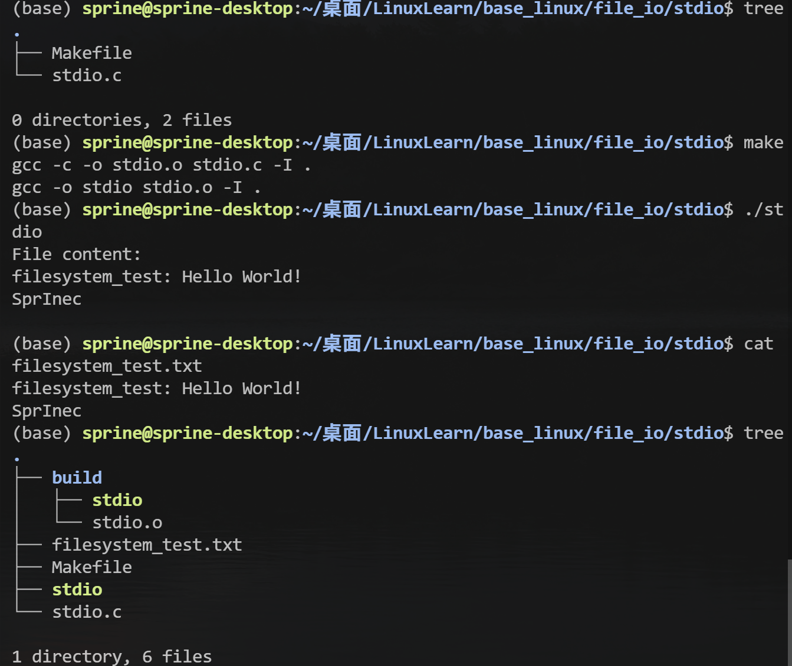

#### 11.6 文件操作（系统调用）

Linux 提供的文件操作系统调用常用的有 `open`、`write`、`read`、`lseek`、`close` 等。

##### 11.6.1 open 函数

```c
#include <sys/types.h>
#include <sys/stat.h>
#include <fcntl.h>
int open(const char *pathname, int flags);
int open(const char *pathname, int flags, mode_t mode);
```

Linux 使用 `open` 函数来打开文件，并返回该文件对应的文件描述符。函数参数的具体说明如下:

- `pathname` ：要打开或创建的文件名

- `flag` ：指定文件的打开方式，具体有以下参数：

    |  标志位  | 含义                                                         |
    | :------: | ------------------------------------------------------------ |
    | O_RDONLY | 以只读的方式打开文件，该参数与 `O_WRONLY` 和 `O_RDWR` 只能三选一 |
    | O_WRONLY | 以只写的方式打开文件                                         |
    |  O_RDWR  | 以读写的方式打开文件                                         |
    | O_CREAT  | 创建一个新文件                                               |
    | O_APPEND | 将数据写入到当前文件的结尾处                                 |
    | O_TRUNC  | 如果 `pathname` 文件存在，则清除文件内容                     |

C 库函数 `fopen` 的 `mode` 参数与系统调用 `open` 的 `flags` 参数有如下表中的等价关系：

| fopen 的 mode 参数 |       open 的 flags 参数        |
| :----------------: | :-----------------------------: |
|         r          |            O_RDONLY             |
|         w          | O_WRONLY \| O_CREAT \| O_TRUNC  |
|         a          | O_WRONLY \| O_CREAT \| O_APPEND |
|         r+         |             O_RDWR              |
|         w+         |   O_RDWR \|O_CREAT \| O_TRUNC   |
|         a+         |  O_RDWR \| O_CREAT \| O_APPEND  |

- `mode` ：当 `open` 函数的 `flag` 值设置为 `O_CREAT` 时，必须使用 `mode` 参数来设置文件与用户相关的权限。`mode` 可用的权限如下表所示，表中各个参数可使用 `|` 来组合:

    |     \      | 标志位  | 含义                                     |
    | :--------: | :-----: | ---------------------------------------- |
    |  当前用户  | S_IRUSR | 用户拥有读权限                           |
    |     \      | S_IWUSR | 用户拥有写权限                           |
    |     \      | S_IXUSR | 用户拥有执行权限                         |
    |     \      | S_IRWXU | 用户拥有读、写、执行权限                 |
    | 当前用户组 | S_IRGRP | 当前用户组的其他用户拥有读权限           |
    |     \      | S_IWGRP | 当前用户组的其他用户拥有写权限           |
    |     \      | S_IXGRP | 当前用户组的其他用户拥有执行权限         |
    |     \      | S_IRWXG | 当前用户组的其他用户拥有读、写、执行权限 |
    |  其他用户  | S_IROTH | 其他用户拥有读权限                       |
    |     \      | S_IWOTH | 其他用户拥有写权限                       |
    |     \      | S_IXOTH | 其他用户拥有执行权限                     |
    |     \      | S_IRWXO | 其他用户拥有读、写、执行权限             |

##### 11.6,2 read 函数

```c
#include <unistd.h>
ssize_t read(int fd, void *buf, size_t count);
```

`read` 函数用于从文件中读取若干个字节的数据，保存到数据缓冲区 `buf` 中，并返回实际读取的字节数,具体函数参数如下：

- `fd` ：文件对应的文件描述符，可以通过 `fopen` 函数获得。另外，当一个程序运行时，Linux  默认有 0、1、2 这三个已经打开的文件描述符，分别对应了标准输入、标准输出、标准错误输出，即可以直接访问这三种文件描述符
- `buf` ：指向数据缓冲区的指针
- `count` ：读取多少个字节的数据

##### 11.6.3 write 函数

```c
#include <unistd.h>
ssize_t write(int fd, const void *buf, size_t count);
```

`write` 函数用于往文件写入内容，并返回实际写入的字节长度，具体函数参数如下：

- `fd` ：文件对应的文件描述符，可以通过 `fopen` 函数获得
- `buf` ：指向数据缓冲区的指针
- `count` ：往文件中写入多少个字节

##### 11.6.4 close 函数

```c
int close(int fd);
```

当我们完成对文件的操作之后，想要关闭该文件，可以调用 `close` 函数，来关闭该 `fd` 文件描述符对应的文件。

##### 11.6.5 lseek 函数

`lseek` 函数可以用与设置文件指针的位置，并返回文件指针相对于文件头的位置。其函数原型如下：

```c
off_t lseek(int fd, off_t offset, int whence);
```

它的用法与 `flseek` 一样，其中的 `offset` 参数用于指定位置，`whence` 参数则定义了 `offset` 的意义，  `whence` 的可取值如下：

- SEEK_SET：`offset` 是一个绝对位置。
- SEEK_END：`offset` 是以文件尾为参考点的相对位置。
- SEEK_CUR：`offset` 是以当前位置为参考点的相对位置。

#### 11.7 实验代码分析（系统调用）

```c
// path: base_linux/file_io/systemcall/systemcall.c
#include <sys/stat.h>
#include <unistd.h>
#include <fcntl.h>
#include <stdio.h>
#include <string.h>

// File Descriptors
int fd;
char str[100];

int main(void)
{
    // Create a file
    fd = open("testscript.sh", O_RDWR|O_CREAT|O_TRUNC, S_IRWXU);
    // The file descriptor `fd` is a non-negative integer
    if (fd < 0){
        printf("Fail to Open File\n");
        return 0;
    }
    
    // Write string `pwd`
    write(fd, "pwd\n", strlen("pwd\n"));
    
    // Write string `ls`
    write(fd, "ls\n", strlen("ls\n"));
    
    // At this point, the file pointer is at the end of the file.
    // Use the `lseek` function to return the file pointer to the
    // beginning of the file.
    lseek(fd, 0, SEEK_SET);
    
    // Read 100 byte from file into str, this function returns the
    // number of bytes actually read
    read(fd, str, 100);
    
    printf("File content:\n%s \n", str);
    
    close(fd);
    
    return 0;
}
```

##### 11.7.1 执行流程

本实验与 C 库文件操作类似，也是创建文件、写入内容然后读出，不过此处使用的都是系统调用函数如 `open`、`write`、`lseek`、`read`、`close`，具体说明如下：

- 代码中先调用了 `open` 函数以可读写的方式打开一个文本文件，并且 `O_CREAT` 指定如果文  件不存在，则创建一个新的文件，文件的权限为 `S_IRWXU`，即当前用户可读可写可执行，当前用户组和其他用户没有任何权限。
- `open` 与 `fopen` 的返回值功能类似，都是文件描述符，不过 `open` 使用非负整数来表示正常，失败时返回 `-1`，而 `fopen` 失败时返回 `NULL`。
- 创建文件后调用 `write` 函数写入了 `”pwd\n“`、`“ls\n”` 这样的字符串，实际上就是简单的 Shell  命令。
- 使用 `read` 函数读取内容前，先调用 `lseek` 函数重置了文件指针至文件开头处读取。与 C 库文件操作的区别 `write` 和 `read` 之间不需要使用 `fflush` 确保缓冲区的内容并写入，因为系统调用的文件操作是没有缓冲区的。
- 最后关闭文件,释放文件描述符。

##### 11.7.2 头文件目录

在 Linux 中，大部分的头文件在系统的 `/usr/include` 目录下可以找到，它是系统自带的 GCC 编译器默认的头文件目录，如下图所示，如果把该目录下的 `stdio.h` 文件删除掉或更改名字 ( 想尝试请备份 ) ，那么使用 GCC 编译 `hello world` 的程序会因为找不到 `stdio.h` 文件而报错。


代码中一些头文件前包含了某个目录，比如 `sys/stat.h`，这些头文件可以在编译器文件夹中的目录下找到。我们通常可以使用 `locate` 命令来搜索，如：

安装 `locate` 工具：

```bash
sudo apt install locate
```

更新数据：

```bash
sudo updatedb
```

使用 `locate` 查找头文件路径：

```bash
locate sys/stat.h
```

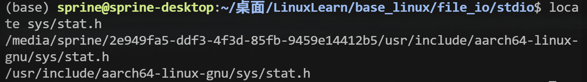

- `/media/sprine/2e949fa5-ddf3-4f3d-85fb-9459e14412b5/usr/include/aarch64-linux-gnu/sys/stat.h  `，该开发板自带 128G 的 emmc，出厂内置系统，该路径为 emmc 内置系统路径。
- `/usr/include/aarch64-linux-gnu/sys/stat.h `，该路径为本开发板目前使用的 64G tf卡内置系统路径。

##### 11.7.3 常用头文件

我们常常会用到以下头文件，此处进行简单说明，若想查看具体的头文件内容,  使用 `locate` 命令找到该文件目录后打开即可：

- `stdio.h` ：C 标准输入与输出 ( standard input & output ) 头文件，我们经常使用的打印  函数 `printf` 函数就位于该头文件中。
- `stdlib.h` ：C 标准库 ( standard library ) 头文件，该文件包含了常用的 `malloc` 函数、`free`  函数。
- `sys/stat.h` ：包含了关于文件权限定义，如 `S_IRWXU`、`S_IWUSR`，以及函数 `fstat` 用于  查询文件状态。涉及系统调用文件相关的操作，通常都需要用到 `sys/stat.h` 文件。
- `unistd.h` ：UNIX C 标准库头文件，unix，linux 系列的操作系统相关的 C 库，定义了  unix 类系统 POSIX 标准的符号常量头文件，比如 Linux 标准的输入文件描述符 ( STDIN ) ，标准输出文件描述符 ( STDOUT ) ，还有 `read`、`write` 等系统调用的声明。
- `fcntl.h` ：unix 标准中通用的头文件，其中包含的相关函数有 `open`，`fcntl`，`close` 等操作。
- `sys/types.h` ：包含了 Unix/Linux 系统的数据类型的头文件，常用的有 `size_t`，`time_t`，  `pid_t` 等类型。

#### 11.8 编译及测试（系统调用）

本实验使用的 Makefile 与 [C 标准库实验的 Makefile](#11.5.3 Makefile 说明) 几乎一模一样：

```makefile
# path: base_linex/file_io/systemcall/Makefile
# Defining Variables
TARGET = systemcall

# Defining the Compiler
CC = gcc

# Define the path of the header files
CFLAGS = -I .

# Define the header files
DEPS = 

# Define the object file
OBJS = $(TARGET).o

# Define the path of the object files
BUILD_DIR = build

# Target file
$(TARGET): $(OBJS)
        $(CC) -o $@ $^ $(CFLAGS)
# Create a compilation output folder
        @mkdir -p $(BUILD_DIR)
# Move the .o file to the output folder
        @mv *.o $(BUILD_DIR)
# Copy the executable program to the output folder
        @cp $(TARGET) $(BUILD_DIR)

# Generation rules for *.o files
%.o: %.c $(DEPS)
        $(CC) -c -o $@ $< $(CFLAGS)

# Phony target
.PHONY: clean

# make clean: Deleate the compilation results
clean:
# Delete the executable program
        rm -f $(TARGET)
# Delete the output folder
        rm -rf $(BUILD_DIR)
# Delete files created by program
        rm -f testscript.sh 
```

在终端输入以下命令进行编译与运行：

```bash
make
tree
./systemcall
ls
cat testscript.sh
./testscript.sh
```

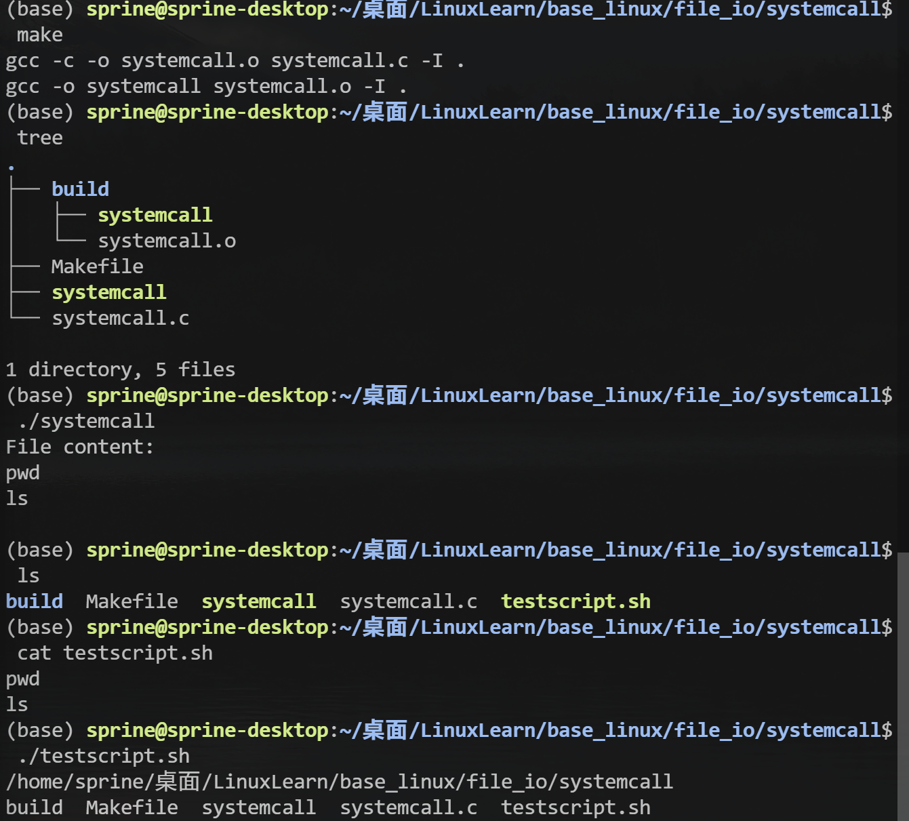

从上图可看到，`systemcall` 程序执行后，它创建的 `testscript.sh` 文件带有可执行权限，运行 `./testscript.sh` 可执行该脚本。

#### 11.9 如何抉择

既然 C 标准库和系统调用都能够操作文件，那么应该选择哪种操作呢？考虑的因素如下：

- 使用系统调用会影响系统的性能。执行系统调用时，Linux 需要从用户态切换至内核态，执  行完毕再返回用户代码，所以减少系统调用能减少这方面的开销。如库函数写入数据的文件操作 `fwrite` 最后也是执行了 `write` 系统调用，**如果是写少量数据的话，直接执行 `write` 可能会更高效，但如果是频繁的写入操作，由于 `fwrite` 的缓冲区可以减少调用 `write` 的次数,  这种情况下使用 `fwrite` 能更节省时间。**
- 硬件本身会限制系统调用本身每次读写数据块的大小。如针对某种存储设备的 `write` 函数每次可能必须写 4kB 的数据，那么当要写入的实际数据小于 4kB 时，`write` 也只能按 4kB 写入，浪费了部分空间，而带缓冲区的 `fwrite` 函数面对这种情况，会尽量在满足数据长度要求时才执行系统调用，减少空间开销。
- 也正是由于库函数带缓冲区，使得我们无法清楚地知道它何时才会真正地把内容写入到硬件上，所以在**需要对硬件进行确定的控制时，我们更倾向于执行系统调用**。

### 12. 调试工具

#### 12.1 gdb

经典的调试工具，功能很强大。

注意若要使用 gdb 调试，编译的时候需要增加 `-g` 选项,并用 `-Og` 进行优化。多线程下可以 `attach` 到进程来调试。  在命令行中输入 `gdb` 进入 gdb 命令行模式。 

gdb 具有大量命令调试，这里不能将其一一列举，介绍一些常用的基础命令：

表 12.1 - 1：

|   命令    | 缩写 |      用法       | 作用                                                         |
| :-------: | :--: | :-------------: | ------------------------------------------------------------ |
|   start   |      |      start      | 开始执行程序，在 `main` 函数的第一条语句前面停下来           |
|   file    |      |    file xxx     | 打开调试的文件                                               |
|    run    |  r   |       ru        | 运行程序（ 第一条语句开始运行 ）                             |
|   break   |  b   | 见下表 12.1 - 2 | 设置断点                                                     |
| continue  |  c   |        c        | 继续程序的运行，直到遇到下一个断点                           |
|   list    |  l   | 见下表 12.1 - 3 | 显示多行源代码                                               |
|   step    |  s   |        s        | 执行下一条语句，如果该语句为函数调用，则进入函数执行其中的第一条语句 |
|   next    |  n   |        n        | 执行下一条语句，如果该语句为函数调用，不会进入函数内部执行 ( 即不会一步步地调试函数内部语句 ) |
|  display  | disp |     disp n      | 跟踪查看某个变量，每次停下来都显示它的值                     |
|   print   |  p   |     p / p n     | 打印内部变量值                                               |
|   watch   |      |      watch      | 监视变量值的变化                                             |
| backtrace |  bt  |       bt        | 查看函数调用信息 (堆栈)                                      |
|   frame   |  f   |        f        | 查看栈帧                                                     |
|   quit    |  q   |        q        | 退出 GDB 环境                                                |
|   kill    |  k   |        k        | 终止正在调试的程序                                           |
| 设置变量  |      |   set var = x   | 设置变量的值                                                 |
|  return   |      |    return x     | 结束当前调用函数并返回指定值，到上一层函数调用处停止程序执行 |
|  finish   |  fi  |       fi        | 结束当前正在执行的函数，并在跳出函数后暂停程序的执行         |
|   jump    |  j   |       j x       | 结束当前调用函数井返回指定值，到上一层函数调用处停止程序执行 |

表 12.1 - 2：

|         命令         | 功能                                                     |
| :------------------: | -------------------------------------------------------- |
|       break n        | 设置第几行作为断点（ 搭配 `list` 使用 ）                 |
|   info breakpoints   | 列出所加的断点                                           |
| delete breakpoints n | 删除第 n 个断点 ( n 为 `info breakpoints` 获得的断点号 ) |
|   disable/enable n   | 表示使得编号为 n 的断点暂时失效或有效                    |

表 12.1 - 3：

|       命令        | 功能                                                         |
| :---------------: | ------------------------------------------------------------ |
|       list        | 默认情况下， 一次显示 10 行，第一次使用时，从代码其实位置显示 |
|      list n       | 显示以第 n 行为中心的 10 行代码                              |
| list functionname | 显示以 `functionname` 的函数为中心的 10 行代码               |
|      list -       | 显示刚才打印过的源代码之前的代码                             |

#### 12.2 strace

strace 是一个用来跟踪系统调用的简易工具。

它最简单的用途就是跟踪一个程序整个生命周期里所有的系统调用，并把调用参数和返回值以  文本的方式输出。Strace 还可以跟踪发给进程的信号，支持 `attach` 正在运行的进程 `strace -p <pid>`。

当多线程环境下，需要跟踪某个线程的系统调用，可以先 `ps -efL | grep <Process Name>`  查找出该进程下的线程，然后调用 `strace –p <pid>` 进行分析。

安装 strace 工具：

```bash
sudo apt install strace
```

下面是使用 strace 跟踪 [8.2 hello world](#8.2.2 编写代码文件) 程序的演示：

```bash
strace ./hello
```


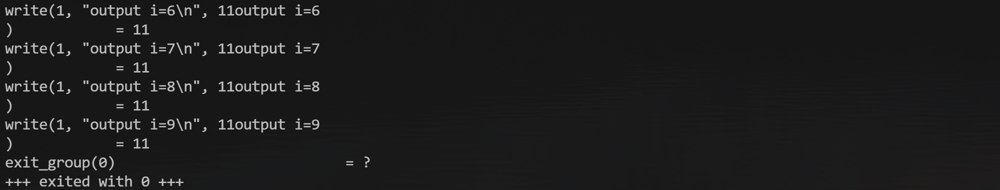

以下输出内容为配置程序的运行环境，以及调用相应的库：

```bash
execve("./hello", ["./hello"], 0xffffdb9e98a0 /* 47 vars */) = 0
brk(NULL)                               = 0xaaab239fb000
...
openat(AT_FDCWD, "/lib/aarch64-linux-gnu/libc.so.6", O_RDONLY|O_CLOEXEC)=3
...
getrandom("\xc0\x64\xf7\x77\xd5\x0a\xb0\x58", 8, GRND_NONBLOCK) = 8
brk(NULL)                               = 0xaaab239fb000
brk(0xaaab23a1c000)                     = 0xaaab23a1c000
```

- `/lib/aarch64-linux-gnu/libc.so.6` 就是我们前面章节所说的 glibc 的库文件，这些配置环境的操作，保护了我们的系统免受程序的干扰。

- 比如，有些软件想改写我们的系统文件或者破坏我们的系统，在这些保护环境下，系统不会允许程序运行超过系统规定的运行空间，即便是程序无意改写系统的文件 ( 超出了运行空间 ) ，系统会阻止它。如果程序进入死循环或崩溃了，系统可以依赖这些保护措施免受干扰并可以直接终止程序的运行。

以下是我们的程序主体部分：

```bash
write(1, "hello, world! This is a C progra"..., 35hello, world! This is a C program.
) = 35
write(1, "output i=0\n", 11output i=0
)            = 11
...
...
...
write(1, "output i=9\n", 11output i=9
)            = 11
exit_group(0)                           = ?
+++ exited with 0 +++
```

代码输出格式有误，可能是多线程导致格式有点问题，正确的格式如下：

```bash
write(1, "hello, world! This is a C program.\n", 35) = 35
hello, world! This is a C program.

write(1, "output i=0\n", 11) = 11
output i=0
```

- 为什么 `write(1, “hello, world! This is a C program.n”, 35)=35` 就可以向屏幕输出文字呢，因为 linux 系统把输出到命令行抽象成文件描述符，操作文件描述符就可以操作该设备。

    查看描述符：

    ```bash
    ls -l /dev/std*
    ```

    

    - `stdin` 标准输入 ​ `fd=0`  从终端设备输入内容
    - `stdout` 标准输出 `fd=1` 从终端设备输出内容
    - `stderr` 标准错误 `fd=2` 从终端设备输出命令的错误消息

    ```bash
    write(1, "output i=0\n", 11) = 11
    output i = 0
    ```

    - `write` ：写入东西
    - `1` ：文件描述符，这里表示标准输出，即向终端输出东西
    - `“output i=0\n”` ：要输出的内容
    - `11` ：输出内容的字节大小，加上空格和换行符刚好 11 个
    - `= 11` ：`write` 函数返回值，表示写入了多少个字节

我们也可以用 `write` 代替 `printf` 试试：

```c
// path: base_linux/hello/hello_sys/hello_sys.c
#include <unistd.h>

int main(void)
{
	write(1, "hello, world! This is a C program.\n", 35);
	write(1, "output i=0\n", 11);
	return 0;
}
```

```makefile
# path: base_linux/hello/hello_sys/Makefile
TARGET = hello_sys
CC = gcc
CFLAGS = -I .
DEPS = 
OBJS = $(TARGET).o
BUILD_DIR = build

$(TARGET): $(OBJS)
        $(CC) -o $@ $^ $(CFLAGS)
        @mkdir -p $(BUILD_DIR)
        @mv *.o $(BUILD_DIR)
        @cp $(TARGET) $(BUILD_DIR)

%.o: %.c $(DEPS)
        $(CC) -c -o $@ $< $(CFLAGS)

.PHONY: clean

clean:
        rm -f $(TARGET)
        rm -rf $(BUILD_DIR)
```

在终端输入命令进行编译与运行：

```bash
make
./hello_sys
tree
```

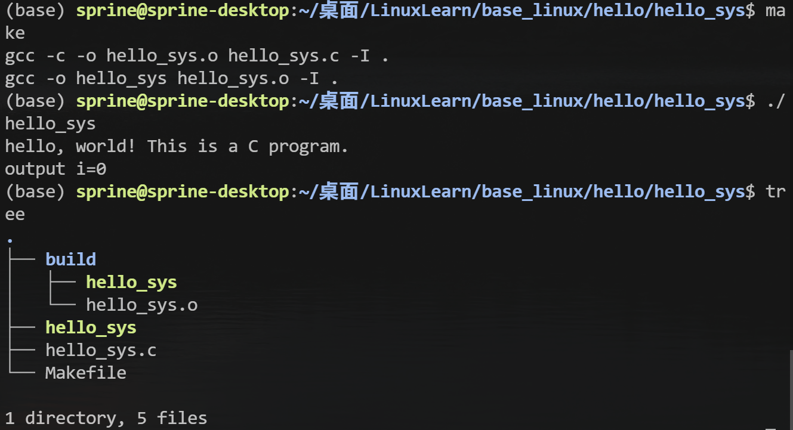

结果与 `printf` 一样。

### 13. GPIO 子系统

本节的代码目录为：`base_linux/gpio/`

LubanCat 4 RK3588S 的 40Pin 引脚对照表如下所示：


#### 13.1 GPIO 简介

GPIO 是 General Purpose I/O 的缩写，即通用输入输出端口，简单来说就是 MCU/CPU 可控制的引脚，这些引脚通常有多种功能，最基本的是高低电平输入检测和输出，部分引脚还会与主控器的片上外设绑定，如作为串口、I2C、网络、电压检测的通讯引脚。

Linux 提供了GPIO 子系统驱动框架，使用该驱动框架可以把 CPU 的 GPIO 引脚导出到用户空间，用户通过访问 `/sys` 文件系统进行控制，GPIO 子系统支持把引脚用于基本的输入输出功能，其中输入功能还支持中断检测。在 Linux 内核源码的 `Documentation/gpio` 目录可找到关于 GPIO 子系统的说明。

##### 13.1.1 GPIO 设备目录

GPIO 驱动子系统导出到用户空间的目录是 `/sys/class/gpio` 。

可使用以下命令查看：

切换到 root 用户：

```bash
sudo -i
```

导出 GPIO 到用户空间：

```bash
echo 42 > /sys/class/gpio/export
```

查看目录变化，增加了 `gpio42` 目录：

```bash
ls /sys/class/gpio/
```

把 `gpio42` 从用户空间取消导出：

```bash
echo 42 > /sys/class/gpio/unexport
```

查看目录变化， `gpio42` 目录消失了：

```bash
ls /sys/class/gpio/
```


- `export` ：导出GPIO，该文件只能写不能读，用户向该文件写入GPIO 的编号 N 可以向
    内核申请将该编号的 GPIO 导出到用户空间，若内核本身没有把该 GPIO 用于其它功能，那
    么在 `/sys/class/gpio` 目录下会新增一个对应编号的 `gpioN` 目录，如上图一导出了`gpio42`。
- `unexport` ：`export` 的相反操作，取消导出GPIO，该文件同样只能写不能读。上图演示
    了往 `unexport` 写入42 后，`gpio42` 目录消失了。

- `gpiochipX` ：该目录是指 GPIO 控制器外设。
- `gpioN` ：通过 `export` 导出的具体 GPIO 引脚的控制目录，如上图中的 `gpio42` 目录下会包含有控制该引脚的相应文件。

##### 13.1.2 GPIO 设备属性

`gpioN` 目录下相关的设备文件，可以使用以下命令查看：

```bash
echo 42 > /sys/class/gpio/export
cd /sys/class/gpio/gpio42

ls -lh
```


- **`direction`** ：表示GPIO 引脚的方向，它的可取值如下：
    1. `in` ：引脚为输入模式
    2. `out` ：引脚为输出模式，且默认输出电平为低
    3. `low` ：引脚为输出模式，且默认输出电平为低
    4. `high` ：引脚为输出模式，且默认输出电平为高

- **`value`** ：表示 GPIO 的电平，1 表示高电平，0 表示低电平。GPIO 被配置为输出模式，那么修改该文件的内容可以改变引脚的电平。
- **`edge`** ：用于配置 GPIO 的中断触发方式，当 GPIO 被配置为中断时，可以通过系统的 `poll` 函数监听。`edge` 文件可取如下的属性值：
    1. `none` ：没有使用中断模式
    2. `rising` ：表示引脚为中断输入模式，上升沿触发
    3. `falling` ：表示引脚为中断输入模式，下降沿触发
    4. `both` ：表示引脚为中断输入模式，边沿触发

如果该引脚会被设备占用，它的功能在用户空间是无法再被修改的，而使用 GPIO 子系统的设备则可以在用户空间灵活配置作为输入、输出或中断模式。

#### 13.2 引脚编号转换

Rockchip Pin 的 ID 按照控制器 ( bank ) + 端口 ( port ) + 索引序号 ( pin ) 组成。

- 控制器和GPIO 控制器数量一致
- 端口固定 A、B、C 和 D，每个端口仅有 8 个索引号，( A = 0, B = 1, C = 2, D = 3 )
- 索引序号固定 0、1、2、3、4、5、6、7

作为GPIO 功能时，端口行为由 GPIO 控制器寄存器配置。如 `gpio0_xx`，`gpio1_xx`，`gpio2_xx`，`gpio3_xx`，`gpio4_xx` 。

`GPIO1_A4` 表达的意思为第 1 组控制器，端口号为A，索引号为4。该引脚号的计算公式为 
$$
32 * 1 + 0 * 8 + 4 = 36
$$

> :warning: **NOTICE**
>
> 并不是所有的引脚都能通过 `export` 文件导出到用户空间的，在使用的引脚是不能被导出的
>
> 

#### 13.3 GPIO sysfs 接口控制 gpio

##### 13.3.1 命令行

在板卡上执行以下命令，执行时需确保当前用户为 root 用户：

```bash
# Enable pin
echo 42 > /sys/class/gpio/export

# Set the pin to input mode
echo in > /sys/class/gpio/gpio42/direction
# Read the value of the pin
cat /sys/class/gpio/gpio42/value

#　Set the pin to output mode
echo out > /sys/class/gpio/gpio42/direction
# Set the pin to low level
echo 0 > /sys/class/gpio/gpio42/value
# Set the pin to high level
echo 1 > /sys/class/gpio/gpio42/value

# Reset the pin
echo 42 > /sys/class/gpio/unexport
```


- 把 GPIO 的编号写入到 `export` 文件，导出 GPIO 设备。

- 修改 GPIO 设备属性 `direction` 文件值为 `out`，把 GPIO 设置为输出方向。

- 修改 GPIO 设备属性文件 `value` 的值为 1 或 0，控制 GPIO 高电平或低电平。

##### 13.3.2 程序编写

退出 root 账户：

```bash
exit
```

编写以下代码：

```c
// path: base_linux/gpio/gpio_sys/gpio_sys.c
#include <string.h>
#include <sys/stat.h>
#include <fcntl.h>
#include <unistd.h>
#include <stdio.h>

#define GPIO_INDEX "42"

static char gpio_path[75];

int gpio_init(char *name)
{
    int fd;
    // index config

    sprintf(gpio_path, "/sys/class/gpio/gpio%s", name);
    if (access("gpio_path", F_OK))
    {
        fd = open("/sys/class/gpio/export", O_WRONLY);
        if (fd < 0){
            return 1;
        }

        write(fd, name, strlen(name));
        close(fd);

        // direction config
        sprintf(gpio_path, "/sys/class/gpio/gpio%s/direction", name);
        fd = open(gpio_path, O_WRONLY);
        if (fd < 0){
            return 2;
        }

        write(fd, "out", strlen("out"));
        close(fd);
    }

    return 0;
}

int gpio_deinit(char *name)
{
    int fd;
    fd = open("/sys/class/gpio/unexport", O_WRONLY);
    if (fd < 0){
        return 1;
    }

    write(fd, name, strlen(name));
    close(fd);

    return 0;
}

int gpio_set(char *name, int value)
{
    int fd;
    sprintf(gpio_path, "/sys/class/gpio/gpio%s/value", name);
    if (fd < 0){
        printf("open %s wrong\n", gpio_path);
        return -1;
    }

    if (1 == value)
    {
        if (2 != write(fd, "1", sizeof("1"))){
            printf("wrong set\n");
        }
    }
    else if (0 == value)
    {
        if (2 != write(fd, "0", sizeof("0"))){
            printf("wrong set\n");
        }
    }
    close(fd);

    return 0;
}

int main(int argc, char *argv[])
{
    char buf[10];
    int res;

    // Verify the parameters
    if (2 != argc){
        printf("usage: %s <PinNum>\n", argv[0]);
        return -1;
    }

    res = gpio_init(argv[1]);
    if (res){
        printf("gpio init error, code = %d\n", res);
        return 0;
    }

    while(1){
        printf("Please input the value: 0--low 1--high q--exit\n");
        scanf("%10s", buf);

        switch (buf[0])
        {
        case '0':
            gpio_set(argv[1], 0);
            break;

        case '1':
            gpio_set(argv[1], 1);
            break;

        case 'q':
            gpio_deinit(argv[1]);
            printf("Exit\n");
            return 0;

        default:
            break;
        }
    }

    return 0;
}
```

本代码要特别注意的是 `export` 和 `unexport` 文件是只有写权限的，所以通过 `open` 打开时要使用 `O_WRONLY` 标志以写入方式打开，不能使用 `O_RDWR` 等带读模式的标志。

编写 Makefile 文件：

```makefile
# path: base_linux/gpio/gpio_sys/Makefile
TARGET = gpio_sys
CC = gcc
CFLAGS = -I .
DEPS = 
OBJS = $(TARGET).o
BUILD_DIR = build

$(TARGET): $(OBJS)
	$(CC) -o $@ $^ $(CFLAGS)
	@mkdir -p $(BUILD_DIR)
	@mv *.o $(BUILD_DIR)
	@cp $(TARGET) $(BUILD_DIR)

%.o: %.c $(DEPS)
	$(CC) -c -o $@ $< $(CFLAGS)

.PHONY: clean

clean:
	rm -f $(TARGET)
	rm -rf $(BUILD_DIR)
```

编译并运行程序：

```bash
make
sudo ./gpio_sys 36
```

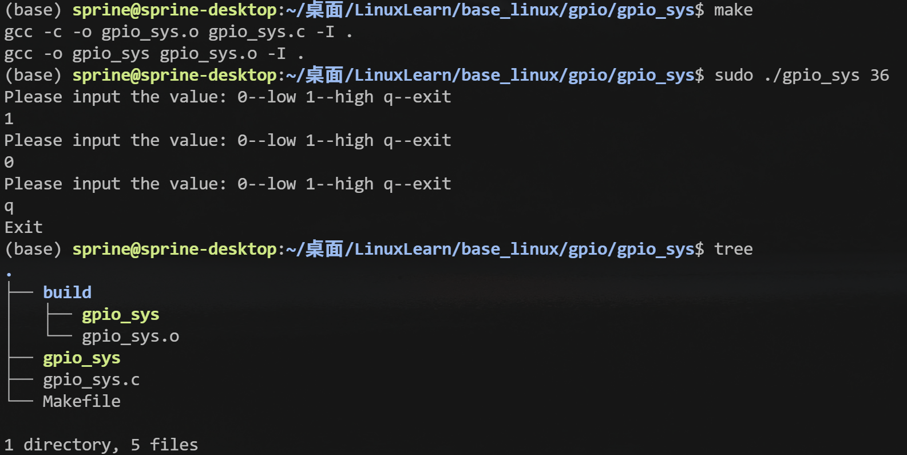

#### 13.4 使用 libgpiod 控制 IO

libgpiod 是一种字符设备接口，GPIO 访问控制是通过操作字符设备文件（ 如 `/dev/gpiodchip0` ）实现的，并通过 libgpiod 提供一些命令工具、c  库以及 python 封装。

想要使用 libgpiod，需要在板卡上安装 libgpiod 库。

```bash
# 安装 libgpiod 库及头文件
sudo apt install libgpiod-dev

# 安装 gpiod 命令行工具
sudo apt install gpiod
```

##### 13.4.1 命令行控制

常用的命令行如下，可使用 `-h` 查看命令相对应的使用说明（以 GPIO1_A4 为例）：

|    命令    | 作用                       |      使用举例      | 说明                                |
| :--------: | -------------------------- | :----------------: | ----------------------------------- |
| gpiodetect | 列出所有的 GPIO 控制器     | gpiodetect(无参数) | 列出所有的 GPIO 控制器              |
|  gpioinfo  | 列出 gpio 控制器的引脚情况 |     gpioinfo 1     | 列出第一组控制器引脚组情况          |
|  gpioset   | 设置 gpio                  |   gpioset 1 4=0    | 设置第一组控制器编号 4 引脚为低电平 |
|  gpioget   | 获取 gpio 引脚状态         |    gpioget 1 4     | 获取第一组控制器编号 4 的引脚状态   |
|  gpiomon   | 监控 gpio 的状态           |    gpiomon 1 4     | 监控第一组控制器编号 4 的引脚状态   |

> **:small_red_triangle_down:IMPORTANT**
>
> Rockchip Pin 的 ID 按照控制器 ( bank ) + 端口 ( port ) + 索引序号 ( pin ) 组成。其中端口号和索引号会合并成一个数值传入到 gpiod 里去并不是所有的引脚都能够使用 libgpiod 控制，例如 led 之类的一些已经被使用的引脚。

##### 13.4.2 使用 libgpiod 编程

可通过以下命令找到头文件：

```bash
dpkg -L libgpiod-dev
```


查找结果中的 `gpiod.h`、`libgpiod.so` 和 `libgpiod.a` 就是板卡使用的头文件、动态和静态链接库。

常用的 libgpiod API ( C 库 ) 如下所示：

```c
//成员变量
struct gpiod_chip; //GPIO 组句柄
struct gpiod_line; //GPIO 引脚句柄

//获取GPIO 控制器(GPIO 组)
struct gpiod_chip *gpiod_chip_open(const char *path);

//获取GPIO 引脚
struct gpiod_line *gpiod_chip_get_line(struct gpiod_chip *chip, unsigned
int offset);

//设置引脚方向为输入模式
int gpiod_line_request_input(struct gpiod_line *line,const char *consumer);

//设置引脚为输出模式
int gpiod_line_request_output(struct gpiod_line *line,const char *consumer, int default_val)

//设置引脚的高低电平
int gpiod_line_set_value(struct gpiod_line *line, int value);

//读取引脚状态
int gpiod_line_get_value(struct gpiod_line *line);

//释放GPIO 引脚
void gpiod_line_release(struct gpiod_line *line);

//关闭GPIO 组句柄并释放所有分配的资源。
void gpiod_chip_close(struct gpiod_chip *chip);
```

##### 13.4.3 程序编写

```c
// path: base_linux/gpio/gpio_lib/gpio_lib.c
#include <gpiod.h>
#include <stdio.h>
#include <unistd.h>
#include <stdlib.h>

int main(int argc, char **argv)
{
    int i;
    int ret;
    char buf[10];

    // GPIO Controller Handle
    struct gpiod_chip *chip;
    //  GPIO Pin Handle
    struct gpiod_line *line;

    // Get GPIO Controller
    chip = gpiod_chip_open("/dev/gpiochip1");
    if (NULL == chip){
        printf("gpiod_chip_open error\n");
        return -1;
    }

    // Get GPIO Pin
    line = gpiod_chip_get_line(chip, 8);
    if (NULL == line){
        printf("gpiod_chip_get_line error\n");
        goto release_line;
    }

    // Set GPIO to output mode
    ret = gpiod_line_request_output(line, "led", 0);
    if (ret < 0){
        printf("gpiod_line_request_output error\n");
        goto release_chip;
    }

    for (i = 0; i < 10; i++)
    {
        gpiod_line_set_value(line, 1);
        printf("set pin value to 1.\n");
        usleep(500000);
        printf("set pin value to 0.\n");
        gpiod_line_set_value(line, 0);
        usleep(500000);
    }

release_line: 
    // Release GPIO pin
    gpiod_line_release(line);
release_chip:
    // Release GPIO controller
    gpiod_chip_close(chip);

    return 0;
}
```

- `usleep()` ：是一个在 Linux 中用于暂停执行的函数，其功能是将当前线程挂起指定的微秒数。

安装 `pkg-config` 工具：

```bash
sudo apt install pkg-config
```

编写 Makefile 文件:

```makefile
# path: base_linux/gpio/gpio_lib/Makefile
# Defining variables
TARGET = gpio_lib

# Defining compiler
CC = gcc

# Defining the path of the header files
CFLAGS = -I .

# Defining the objects files
OBJS = $(TARGET).o

# Defining the include files
DEPS = 

# Defining the storage location of .o files
BUILD_DIR = build

# Adding additional libraries
LIBGPIOD = `pkg-config --cflags libgpiod` `pkg-config --libs libgpiod`

$(TARGET): $(OBJS)
	$(CC) -o $@ $^ $(CFLAGS) $(LIBGPIOD)
	@mkdir -p $(BUILD_DIR)
	@mv *.o $(BUILD_DIR)
	@cp $(TARGET) $(BUILD_DIR)

%.o: %.c $(DEPS)
	$(CC) -c -o $@ $< $(CFLAGS) $(LIBGPIOD)

.PHONY: clean

clean:
	rm -f $(TARGET)
	rm -rf $(BUILD_DIR)
```

编译并运行：

```bash
make
sudo ./gpio_lib
```

或者使用 `gcc` 命令编译：

```bash
gcc gpio_lib.c -o gpio_lib `pkg -config --cflags libgpiod` `pkg -config --libs libgpiod`
sudo ./gpio_lib
```

#### 13.5 systerm 编程

```c
// path: base_linux/gpio/gpio_system/gpio_system.c
#include <sys/types.h>
#include <unistd.h>
#include <stdio.h>
#include <stdlib.h>

int main(void)
{
    pid_t result;
    int i;
    for (i = 0; i < 10; i++)
    {
        result = system("gpioset 1 8=1");
        usleep(500000);
        result = system("gpioset 1 8=0");
        usleep(500000);
    }

    return result;
}
```

该代码的原理是在 C 程序中使用 `system()` 相当于在 shell 终端里使用命令，需要 root 权限执行。

缺点：这种方法控制 `io` 会涉及到内核的上下文切换，会影响到内核的处理。因此，不推荐使用
这种方法在短时间内多次操作 GPIO。如果对 GPIO 有多次操作，可以使用 [`gpio_lib.c`](#13.4.3 程序编写)，速度更快，效率更高。

Makefile 文件：

```makefile
# path: base_linux/gpio/gpio_system/Makefile
TARGET = gpio_system
CC = gcc
CFLAGS = -I .
DEPS = 
BUILD_DIR = build
OBJS = $(TARGET).o

$(TARGET): $(OBJS)
	$(CC) -o $@ $^ $(CFLAGS)
	@mkdir -p $(BUILD_DIR)
	@mv *.o $(BUILD_DIR)
	@cp $(TARGET) $(BUILD_DIR)

%.o: %.c $(DEPS)
	$(CC) -c -o $@ $< $(CFLAGS)

.PHONY: clean

clean:
	rm -f $(TARGET)
	rm -rf $(BUILD_DIR)
```

编译并执行:

```bash
make
sudo ./gpio_system
```

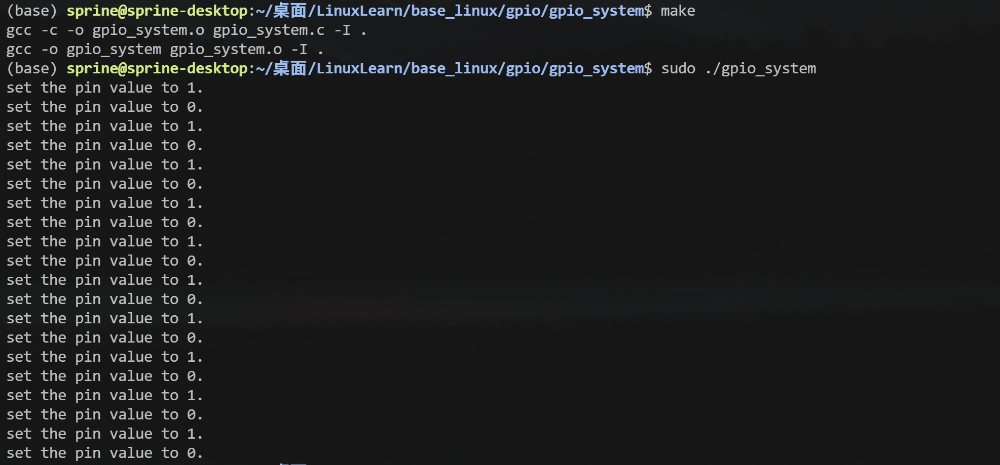

### 14. input 子系统

本节的代码目录为：`base_linux/ev_test`

#### 14.1 input 子系统简介

input 子系统是 Linux 对输入设备提供的统一驱动框架。

如按键、键盘、触摸屏和鼠标等输入设备的驱动方式是类似的，当出现按键、触摸等操作时，硬件产生中断，然后 CPU 直接读取引脚电平，或通过 SPI、I2C 等通讯方式从设备的寄存器读取具体的按键值或触摸坐标，然后把这些信息提交给内核。

使用 input 子系统驱动的输入设备可以通过统一的数据结构提交给内核，该数据结构包括输入的时间、类型、代号以及具体的键值或坐标，而内核则通过 `/dev/input` 目录下的文件接口传递给用户空间。

在Linux 内核源码的 `Documentation/input` 目录包含了input 子系统相关的说明。

在板卡默认的出厂镜像中，按键、触摸屏、鼠标、键盘都使用了 input 子系统驱动。

#### 14.2 input 事件目录

##### 14.2.1 使用 evtest 工具测试

在开发 input 子系统驱动时，常常会使用 `evtest` 工具进行测试，我们可以通过该工具来了解板卡上的输入设备。

```bash
sudo apt install evtest
sudo evtest
```


- 运行 `evtest` 工具，它列出了系统当前可用的 `/dev/input/event0~11` 输入事件文件，并且列出了这些事件对应的设备名。
- 输入要测试的设备编号后它列出了 `event9` 的一些设备信息，包括驱动版本、设备ID、设备名、支持的事件类型、事件代号以及输入值的取值范围。
- 移动 2.4G 鼠标，可以看到它输出了详细的事件信息。输出信息中每一行包含了鼠标上报事件的具体时间 `time`、事件类型 `type 2`（EV_REL）、事件代号 `code1` 或 `code0`（REL_Y  或 REL_X）和具体的值 `value`，该值就是鼠标 X/Y 的坐标。

##### 14.2.2 input 事件结构

evtest 工具的原理并不神秘，学习本章节后也可以尝试自己使用代码实现它的部分功能。列出可
用事件时，它就是通过查看目录 `/dev/input/` 实现的。本示例中主机的 `/dev/input` 目录的内容如下图所示。


可看到 `/dev/input` 目录下，有各种 `event` 设备暴露到用户空间的访问接口文件，读取这些文件的内容可获取到设备上报的信息。

在前面 GPIO 子系统中，`direction` 等设备文件直接使用字符串来记录具体的信息，所以使用 `cat` 命令输出文件的内容时，字符串的形式非常方便我们阅读。但是 `event` 文件包含的信息较多，使用字符串不方便其它程序处理，它**采用了纯粹的内核事件数据结构来记录内容，其它程序使用时应把读取到的内容按数据的结构进行格式化转换**，该数据结构定义如下所示：

```c
struct input_event 
{
	struct timeval time;
	__u16 type;
	__u16 code;
	__s32 value;
}
```

- `time` ：该变量用于记录事件产生的时间戳，既 `evtest` 输出的 `time` 值。

- `type` ：输入设备的事件类型。系统常用的默认类型有 `EV_KEY`、`EV_REL` 和 `EV_ABS`，分别用于表示按键状态改变事件、相对坐标改变事件及绝对坐标改变事件，特别地，`EV_SYN` 用于分隔事件，无特别意义。如果选择鼠标（本章第一个图）`evtest` 输出的 `type` 类型为`EV_ABS`。相关的枚举值可以参考内核文件 `include/uapi/linux/input-event-codes.h`。
- `code` ：事件代号，它以更精确的方式表示事件。例如在 `EV_KEY` 事件类型中，`code` 的值常用于表示键盘上具体的按键，其取值范围在0~127 之间，例如按键 Q 对应的是 KEY_Q，该枚举变量的值为16。如果选择鼠标，`evtest` 输出内容的 `code` 分别有 `ABS_X`/`ABS_Y`，表示上报的是X 或Y 坐标。

- `value` ：事件的值。对于 `EV_KEY` 事件类型，当按键按下时，该值为1；按键松开时，该值为0。如果选择鼠标，中 `evtest` 输出的内容里，ABS_X 事件类型中的 `value` 值表示X 坐标，ABS_Y 类型中的 `value` 值表示Y 坐标。

如果同样使用 `cat` 命令查看事件文件，当事件出现时，`cat` 把内容转化成字符串，会看到乱码，使用这样的方式可以简单地查看设备是否上报了事件。

可以使用以下方式进行测试：

```bash
sudo cat /dev/input/event9
```


与其它文件不同，通常 `cat` 命令读取文件内容后就会返回，而此处读取 `event` 文件时，命令会持续地等待输入。

我们还可以使用 `hexdump` 命令来查看输出的命令：

```bash
hexdump /dev/input/event9
```


二进制的数据可能会因为驱动的不一样而很难对其进行有效的分析。

##### 14.2.3 input 事件设备名

`/dev/input/event*` 的事件编号与设备的联系不是固定的，它通常按系统检测到设备的先后顺序安排 `event` 文件的编号，这对编写应用程序控制不太方便，我们可以通过 `/dev/input/by-id` 或 `/dev/input/by-path` 目录查看具体的硬件设备，如下图所示：


图中列出了 `by-path` 目录下的内容，该目录下的文件实际上都是链接，访问链接文件就是访问对应的事件设备，而且该文件名与硬件的关系是固定的，后面我们一般采用这样的方式。

由于 `/dev` 下的设备都是通过 `/sys` 导出的，所以也可以通过 `/sys/class/input`目录查看，如下图所示：


`/sys/class/input` 下包含了各个以事件命名的目录，其对应目录下的 `device/name` 文件包含了事件对应的设备名。

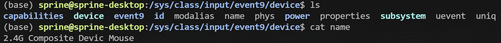

`evtest` 工具列出的事件与设备名的关系，就是从这里读取的。

#### 14.3 板卡按键检测实验

##### 14.3.1 实验代码分析

在输入事件检测的应用中，通常使用主线程直接循环读取 `/dev/input/event*` 设备文件获取事件的数据结构，然后通过消息队列通知其它子线程，从而响应输入操作。

```c
// path: base_linux/ev_test/ev_test.c
#include <stdio.h>
#include <unistd.h>
#include <stdlib.h>
#include <sys/types.h>
#include <sys/stat.h>
#include <fcntl.h>
#include <linux/input.h>
#include <linux/input-event-codes.h>

const char default_path[] = "/dev/input/by-path/platform-fc880000.usb-usb-0:1.3:1.0-event-kbd";

int main(int argc, char **argv)
{
    int fd;
    struct input_event event;
    char *path;

    printf("This is a input device demo.\n");

    // if not input parameters are given, the default
    // event device is used.
    if (argc > 1)
        path = argv[1];
    else
        path = (char *)default_path;

    fd = open(path, O_RDONLY);
    if (fd < 0){
        printf("Fail to open device: %s. \n "
               "Please confirm the path or you have permission to do this.\n", path);
        exit(1);
    }

    printf("Test device: %s.\nWatting for input...\n", path);

    while (1) {
        if (read(fd, &event, sizeof(event)) == sizeof(event))
        {
            if (event.type != EV_SYN){
                printf("Event: time %ld.%ld, type %d, code %d, value %d\n",
                       event.time.tv_sec, event.time.tv_usec,
                       event.type,
                       event.code,
                       event.value);
            }
        }
    }
    close(fd);

    return 0;
}
```

- `fd = open(path, O_RDONLY);`  ：使用 `O_RDONLY` 模式打开事件设备文件，`O_RDONLY` 模式默认是阻塞型的，而且**事件设备文件支持阻塞操作**，也就是说，若后面使用 `read` 函数读取时，它会等待事件上报，一直等待至读取成功或失败才会返回。
- 在 `while` 循环里通过 `read` 系统调用读取事件文件，读取到的内容存储在 `struct input_event` 类型的 `event` 变量中，`struct input_event` 类型就是前面介绍的内核事件数据结构。若成功读取，我们就可以通过该变量的结构体成员访问到事件的时间戳、类型、代号和值。
- 输出读取到的 `event` 变量的各个成员值，在上报的事件中，通常会有很多类型为 `EV_SYN` 的事件，这种事件是用于分隔的，无特别意义，所以代码中不输出这类型事件的内容。

值得思考的是，若没有上报事件，第 35 行的 `read` 读取事件设备文件操作会被阻塞，简单来说就是即使第 40 行的 `printf` 代码不注释掉，它也**不会在持续地在循环里输出**，而只有当出现了事件，触发 `read`退出，后面的 `printf` 函数才有机会被执行一次，然后重新 `read` 事件再次阻塞。**在这种阻塞的过程中，进程会休眠，释放它对 CPU 的占用。**

假如我们使用的是 GPIO 子系统框架来编写按键驱动程序，在应用层的操作中，需要使用 `/sys/class/gpio/gpio*/direction` 文件配置为输入方向，然后使用循环读取 `/sys/class/gpio/gpio*/value`文件的值来获得按键的状态，但由于**对 `value` 文件的 `read` 读取操作不会阻塞，所以进程会不停地读取文件内容来判断按键值，占用 CPU 宝贵的运算资源。**

由于 `read` 事件文件操作会阻塞，那么采用这种方式就无法同时检测两个输入设备了，这种时候
可以通过 `select` 或 `poll` 等 IO 多路复用的操作达成目的。

Makefile 文件：

```makefile
# path: base_linux/ev_test/Makefile
TARGET = ev_test
CC = gcc
CFLAGS = -I .
OBJS = $(TARGET).o
DEPS = 
BUILD_DIR = build

$(TARGET): $(OBJS)
	$(CC) -o $@ $^ $(CFLAGS)
	@mkdir -p $(BUILD_DIR)
	@mv *.o $(BUILD_DIR)
	@cp $(TARGET) $(BUILD_DIR)

%.o: %.c $(DEPS)
	$(CC) -c -o $@ $< $(CFLAGS)

.PHONY: clean

clean:
	rm -f $(TARGET)
	rm -rf $(BUILD_DIR)
```

编译并运行文件：

```bash
make
sudo ./ev_test
```


### 15. 串口通讯

通用异步收发器（Universal Asynchronous Receiver/Transmitter )，通常称作 UART，是一种串行、异步、全双工的通信协议，在嵌入式领域应用的非常广泛。

LubanCat-RK3588 系列板子的通用 uart 设备有1 个（如 15.1 图所示），除此之外其他的 GPIO 也可以复用成 uart 设备，需要自行根据引脚复用图去配置，LubanCat-4 的 40pin 引脚最大可支持 5 个 uart 接口使用。

LubanCat-RK 系列板卡的uart 控制器支持下列功能

- 支持5、6、7、8 bits 数据位
- 支持奇校验和偶校验，不支持 mark 校验和 space 校验
-  支持接收 FIFO 和发送 FIFO，一般为 32 字节或者 64 字节
-  支持最高 4M 波特率，实际支持波特率需要芯片时钟分频策略配合
-  支持中断传输模式和 DMA 传输模式
-  支持硬件自动流控，RTS + CTS

本节的代码目录为：`base_linux/uart`

#### 15.1 串口引脚关系

|  串口   | 引脚 |    功能    |
| :-----: | :--: | :--------: |
| **TXD** |  8   | 发送信号线 |
| **RXD** |  10  | 接受信号线 |

对应板卡的 40Pin 接口：


- LubanCat-4 使用的是 uart0

#### 15.2 使能串口接口

串口在默认情况是关闭状态的，需要使能才能使用。

##### 15.2.1 方法一

适用于 LubanCat Debian 系统。

进入工具配置：

```bash
sudo fire-config
```

移动键盘上下键选择 `外设` 后回车：

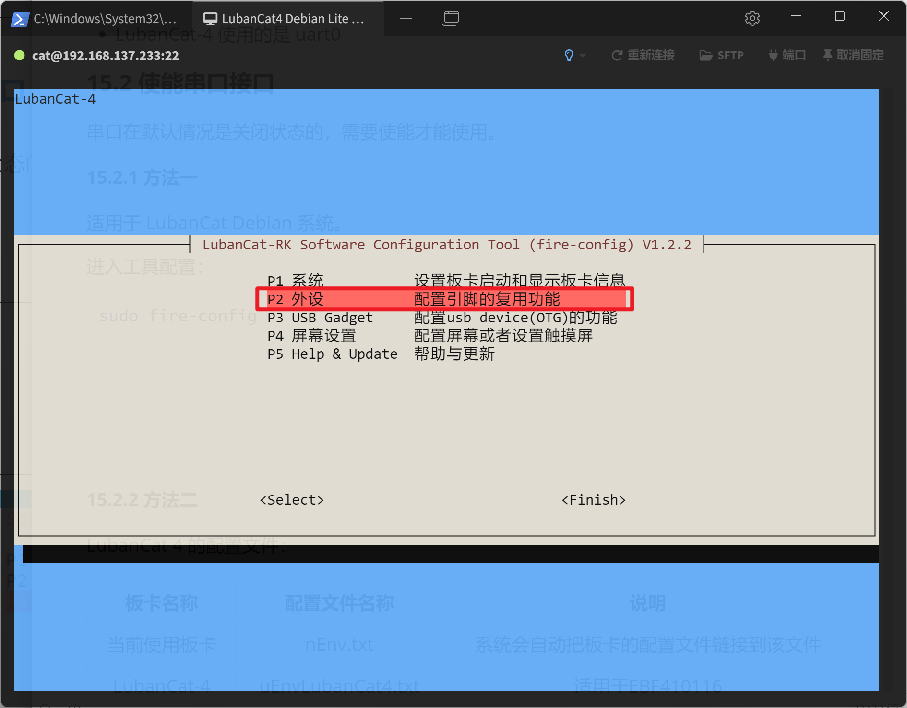

找到 `uart0-m2` ，单击空格键选中，然后按回车键

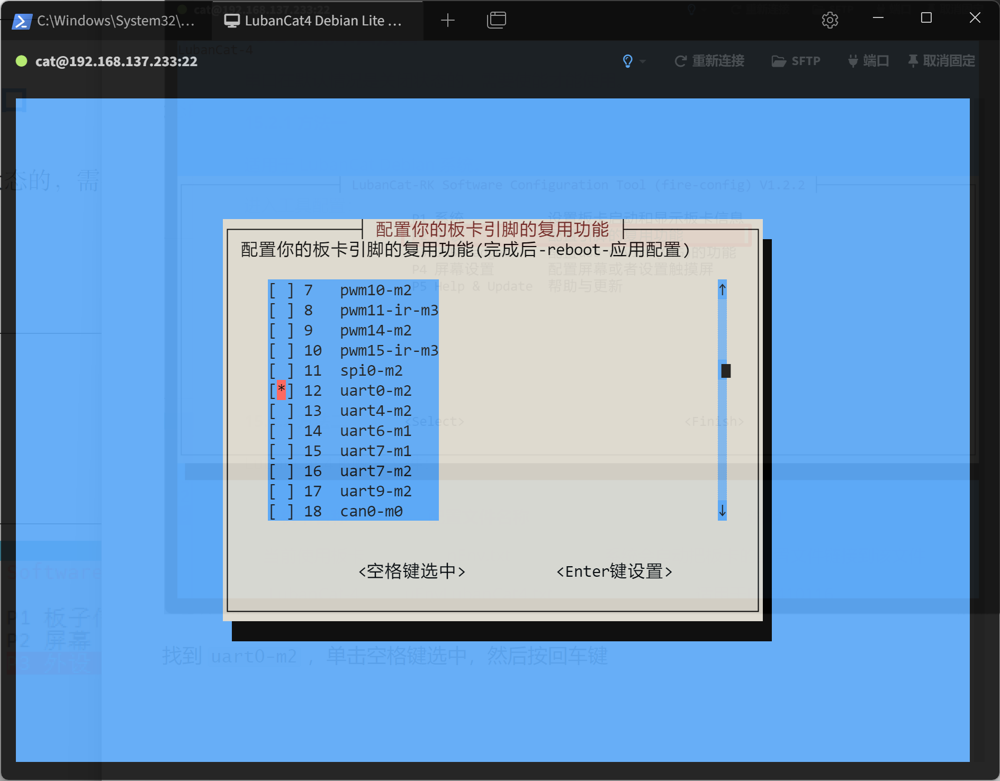

移动键盘左键到 <Finish> 后回车退出 fire-config 工具。

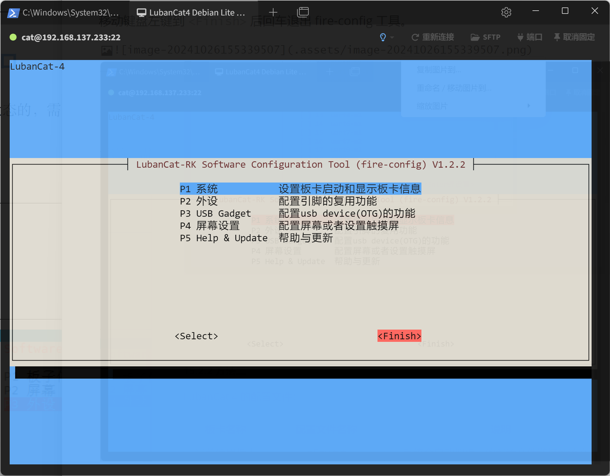

然后重启系统即可：

```bash
sudo reboot
```

##### 15.2.2 方法二

LubanCat 4 的配置文件：

|   板卡名称   |   配置文件名称    |                  说明                  |
| :----------: | :---------------: | :------------------------------------: |
| 当前使用板卡 |     nEnv.txt      | 系统会自动把板卡的配置文件链接到该文件 |
|  LubanCat-4  | uEnvLubanCat4.txt |            适用于EBF410116             |

可以通过打开 `/boot/uEnv/board.txt` （ `board` 是你所用的板子的名称），一般第一次启动已经初始化将板级 `uEnv.txt` 软连接到了 `/boot/uEnv/uEnv.txt`，可以直接修改该文件。

查看是否启用了 uart 相关设备设备树插件。编辑文件，将带有 uart 的那一行的注释符号去掉如下图：


然后保存退出后重启系统即可：

```bash
:wq
sudo reboot
```

#### 15.3 检查串口设备

查看串口是否成功使能：

```bash
ls /dev/tty*
```

LubanCat4 为 `ttyS0`：

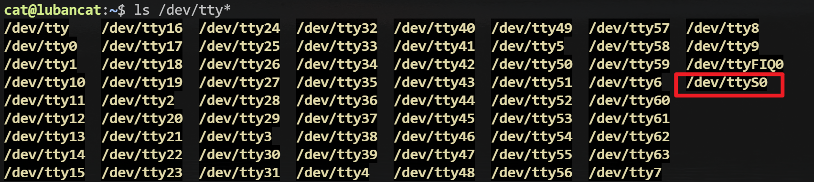

#### 15.4 串口通讯实验（Shell）

对 `tty` 的设备文件直接读写就可以控制设备通过串口接收或发送数据，下面我们使用板卡配合Windows 下的串口调试助手或 Linux 下的 minicom 进行测试。

##### 15.4.1 连接串口

实验前需要使用串口线或USB 转串口线把它与板卡与电脑连接起来。

-  板子  —  电脑
-  TXD  —   RXD
-  RXD  —   TXD
-  GND —  GND

##### 15.4.2 查询串口的通信参数

```bash
stty -F /dev/ttyS0
```


##### 15.4.3 修改串口波特率

```bash
stty -F /dev/ttyS0 ispeed 115200 ospeed 115200
```


##### 15.4.4 关闭回显

默认串口是开启回显的可以使用以下命令关闭回显：

```bash
stty -F /dev/ttyS0 -echo
```

##### 15.4.5 与 Windows 主机通讯

###### 15.4.5.1 串口通讯实验

```bash
echo hello! > /dev/ttyS0
echo "I'm SprIne." > /dev/ttyS0
```


可以看到，往 `/dev/ttyS0` 设备文件写入的内容会直接通过串口线发送至 Winodws 的主机。

读取设备文件则可接收 Winodws 主机发往板卡的内容，可以使用 `cat` 命令来读取：

```bash
cat /dev/ttyS0
```


###### 15.4.5.2 minicom 通讯

安装 `minicom` 软件包：

```bash
sudo apt install minicom
```

设置串口：

```bash
sudo minicom -s
```

1. 通过鼠标上下键移动到下图所示选项按回车选择进入配置页面：


2. 通过按各参数前面的字母跳转到对应参数进行配置，配置完成后单击回车跳转到底部 `Change which setting?` 选项再次回车保存并退出配置：

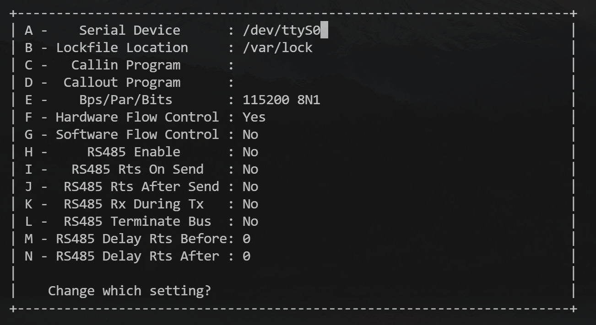

3. 通过键盘上下键移动到下图选项后回车将刚刚的设置保存为默认设置：


4. 移动到 `Exit` 选项后回车退出配置页面：


5. 进入通讯页面：

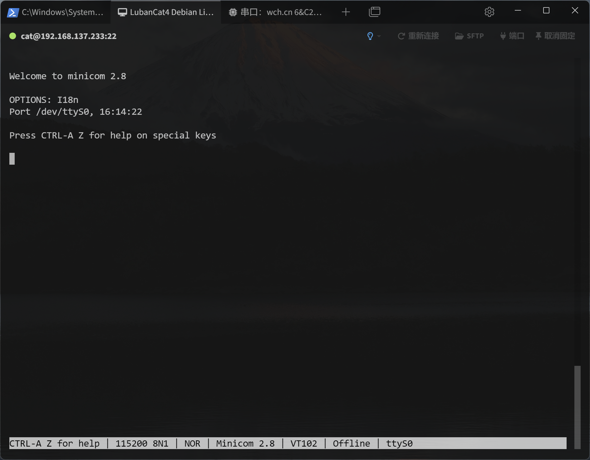

若输入字母屏幕上没有显示，可通过 `Ctrl+A` + `Z` 进入菜单：


按下 `E`  可打开回显。然后测试通信即可：

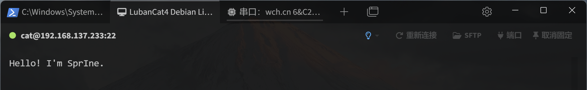


minicom 菜单命令：

| 命令 | 功能                                                   |
| :--: | ------------------------------------------------------ |
|  s   | 发送文件                                               |
|  p   | 设置通讯参数，包括一些预设的波特率，数据格式，数据位等 |
|  l   | 就可以将 log 信息保存到一个文件中了, 方便查看          |
|  t   | 设置终端参数，以及键位设置                             |
|  w   | 超出一行的数据后自动换行                               |
|  r   | 接收文件                                               |
|  a   | 换行发送时会增加时间戳                                 |
|  n   | 增加时间戳                                             |
|  c   | 清除屏幕                                               |
|  o   | 设置 minicom，相当于 `sudo minicom -s`                 |
|  j   | 休眠状态                                               |
|  x   | 退出的同时复位                                         |
|  q   | 退出                                                   |

也可以不用通过按 `ctrl + a` + `z` + `?` 的方式设置，而是直接使用 `ctrl + a` + `?`

#### 15.5 串口通讯实验（系统调用）

如果只是想通过串口终端设备收发数据，那么使用 `open`、`read`、`write` 等系统调用能轻易实现，操作的原理和前面的 `led`、`gpio`、`input` 设备并无区别，都是读写设备文件。但是 `led`、`gpio` 和 `input` 除了主设备文件，还有众多的属性文件配合用于设置设备的运行参数，如 `led` 的 `trigger` 文件，`gpio` 的 `direction` 文件，而终端设备却没有其它的属性文件，那么 `stty` 命令和 `minicom` 工具是如何配置终端设备参数的呢？

##### 15.5.1 实验

```c
// path: base_linux/uart/uart_t/uart_t.c
#include <stdio.h>
#include <stdlib.h>
#include <string.h>
#include <unistd.h>
#include <fcntl.h>
#include <termios.h>
#include <sys/stat.h>
#include <sys/types.h>
#include <sys/ioctl.h>

const char default_path[] = "/dev/ttyS0";

int main(int argc, char *argv[])
{
    int fd;
    int res;
    char *path;
    char buf[1024] = "tty send test.\n";

    // Get the device path from command line argument
    // If no argument, use default path
    if (argc > 1) {
        path = argv[1];
    } 
    else {
        path = default_path;
    }

    // Get the device file descriptor
    printf("This is tty/usart demo.\n");
    fd = open(path, O_RDWR);
    if (fd < 0){
        printf("Fail to Open %s device.\n", path);
        return 0;
    }

    struct termios opt;
    // Clear the UART buffer
    tcflush(fd, TCIOFLUSH);
    // Get the UART parameters opt
    tcgetattr(fd, &opt);
    // Set the baud rate to 9600
    cfsetispeed(&opt, B9600);
    cfsetospeed(&opt, B9600);

    // Set the data bits to 8
    opt.c_cflag &= ~CSIZE;
    opt.c_cflag |= CS8;
    // Set the parity bit to none
    opt.c_cflag &= ~PARENB;
    opt.c_cflag &= ~INPCK;
    // Set the stop bit to 1
    opt.c_cflag &= ~CSTOPB;
    // Update the UART parameters
    tcsetattr(fd, TCSANOW, &opt);
    printf("Device %s is set to 9600bps, 8N1.\n", path);

    do {
        // Send the data to the device
        write(fd, buf, strlen(buf));
        // Receive the data from the device
        res = read(fd, buf, 1024);
        if (res > 0) {
            // Add '\0' to the end of the string
            buf[res] = '\n';
            buf[res+1] = '\0';
            printf("Receive res = %d bytes data: %s", res, buf);
        }
    } while (res >= 0);

    printf("read error, res = %d", res);
    close(fd);
    return 0;
}
```

Makefile 文件：

```makefile
# path: base_linux/uart/uart_t/Makefile
TARGET = uart_t
CC = gcc
CFLAGS = -I .
OBJS = $(TARGET).o
BUILD_DIR = build
DEPS = 

$(TARGET): $(OBJS)
        $(CC) -o $@ $^ $(CFLAGS)
        @mkdir -p $(BUILD_DIR)
        @mv *.o $(BUILD_DIR)
        @cp $(TARGET) $(BUILD_DIR)

%.o: %.c $(DEPS)
        $(CC) -c -o $@ $< $(CFLAGS)

.PHONY: clean

clean:
        rm -rf $(BUILD_DIR) $(TARGET)
```

编译运行：

```bash
make
sudo ./uart_t
```

PC 端串口助手输入字符进行测试：


##### 15.5.2 代码分析

- **SECTION 1** ：定义了默认使用的串口终端设备路径及其它一些变量。
- **SECTION 2** ：根据 `main` 是否有输入参数确认使用哪个设备路径，并通过 `open` 的 `O_RDWR` 读写模式打开该设备。
- **SECTION 3** ：定义了一个结构体 `termios` 用于获取、设置终端设备的参数，包括波特率、数据位数、校验位等。
- **SECTION 4** ：在 `while` 循环中对终端设备使用 `read`  和 `write` 进行读写，从而控制串口收发数据。代码中在接收到的内容末尾加了 `’0’` 结束符，主要是为了方便使用字符串的方式处理内容。

###### 15.5.2.1 termios 结构体

SECTION 3，使用了 `termios` 结构体，它是在 POSIX 规范中定义的标准接口。Linux系统利用 `termios` 来设置串口的参数，它是在头文件 `<termios.h>` 包含的`<bits/termios.h>` 中定义的，该文件中还包含了各个结构体成员可使用的宏值，可使用 `locate` 命令查找该文件打开来阅读，关于 `termios` 结构体的定义摘录如下所示。

```c
// path: /usr/include/bits/termios.h
struct termios {
    tcflag_t c_iflag; /* input mode flags */
	tcflag_t c_oflag; /* output mode flags */
	tcflag_t c_cflag; /* control mode flags */
	tcflag_t c_lflag; /* local mode flags */
	cc_t c_line; /* line discipline */
	cc_t c_cc[NCCS]; /* control characters */
	speed_t c_ispeed; /* input speed */
	speed_t c_ospeed; /* output speed */
	#define _HAVE_STRUCT_TERMIOS_C_ISPEED 1
	#define _HAVE_STRUCT_TERMIOS_C_OSPEED 1
};
```

- `c_iflag` ：输入（ input ）模式标志，用于控制如何对串口输入的字符进行处理，常用的选项值见下表。

    | 选项值 | 作用                     |
    | :----: | :----------------------- |
    | INPCK  | 启用输入奇偶检测         |
    | IGNPAR | 忽略帧错误和奇偶检验错误 |
    | IGNCR  | 忽略输入中的回车         |
    |  IXON  | 开启 XON/XOFF 流控制     |
    | IXOFF  | 关闭 XON/XOFF 流控制     |

- `c_oflag` ：输出（ output ）模式标志，用于控制串口的输出模式，常用的选项值见下表。

    | 选项值 | 作用                                   |
    | :----: | :------------------------------------- |
    | ONCLR  | 将输出中的换行符 NL 映射为回车-换行 CR |
    | OCRNL  | 将输出的回车映射为换行符               |
    | ONLRET | 不输出回车                             |
    | OFILL  | 发送填充字符串                         |

- `c_cflag` ：控制（ control ）模式标志，用于控制串口的基本参数，如数据位、停止位等，常用配置见下表，特别地，`c_cflag` 结构体成员还包含了波特率的参数。

    | 选项值 | 作用                                           |
    | :----: | ---------------------------------------------- |
    | CSIZE  | 设置数据位长度，可以配置为CS5、CS6、CS7、CS8。 |
    | CSTOPB | 如果设置 CSTOPB 标志，则使用两位停止位         |
    | PARENB | 使能奇偶检验                                   |
    | PARODD | 设置为奇校验                                   |

- `c_lflag` ：本地（ local ）模式标志，主要用于控制驱动程序与用户的交互，在串口通信中，实际上用不到该成员变量。

    | 选项值 | 作用                                                         |
    | :----: | ------------------------------------------------------------ |
    |  ISIG  | 如果设置 ISIG 标志，当接收到字符 INTR、QUIT 等字符，系统会产生相应的信号。 |
    |  ECHO  | 是否需要回显字符。                                           |
    | ICANON | 若设置了 ICANON 标志，则表示终端处于规范式输入状态，允许使用特殊字符 EOF、KILL 等。 |
    | ECHONL | 若该标志位和 ICANON 标志位同时被设置，则回显换行符 NL。      |

- `c_cc[NCCS]` : 该数组包含了终端的所有特殊字符，可以修改特殊字符对应的键值（ Ctrl+C 产生的 ^C，ASCII 码为 0x03 ），部分内容如下表。

    | 数组的下标值 | 作用                                                         |
    | :----------: | ------------------------------------------------------------ |
    |    VINTR     | 中断字符，若接收到该字符时，会发送 `SIGINT` 信号。当设置了`c_lflag` 的 `ISIG` 标志位时，该字母不再作为输入传递。 |
    |    VERASE    | 删除字符，删除上一个字符。                                   |
    |     VIM      | 设置非标准模式读取的最小字节数                               |
    |     VTIM     | 设置非标准模式读取时的延时值，单位为十分之一秒。             |

- `c_ispeed` 和 `c_ospeed` ：记录串口的输入和输出波特率（ input speed 和 output speed ），部分可取值如下代码所示，宏定义中的数字以 `“0”` 开头，在 C 语言中这是表示 8 进制数字的方式。

```c
// 以 0 开头的数字在是 C 语言的 8 进制数字形式
#define B1200 000011
#define B1800 000012
#define B2400 000013
#define B4800 000014
#define B9600 000015
#define B19200 000016
#define B38400 000017
```

- `termios` ：结构体内部有 `_HAVE_STRUCT_TERMIOS_C_ISPEED` 和 `_HAVE_STRUCT_TERMIOS_C_OSPEED` 两个宏定义， 它们的宏值都为 1， 表示它支持 `c_ispeed` 和 `c_ospeed` 表示方式，部分标准中不支持使用这两个结构体成员表示波特率，而只使用 `c_cflag` 来表示。

直接看结构体的定义比较抽象，下面以修改串口波特率、数据位、校验位和停止位的代码进行讲解。接下来几个小节的代码，是从野火配套代码仓库 `/linux_app/tty/c_full/sources/bsp_uart.c` 文件截取的，该文件以比较完善的方式封装了串口的配置。

1. 配置串口波特率
2. 配置串口停止位
3. 配置串口校验位
4. 配置串口数据位


## 三. Linux 镜像构建与部署

> **参考书籍：** [[野火]《嵌入式Linux镜像构建与部署—基于LubanCat-RK系列板卡》](https://doc.embedfire.com/linux/rk356x/build_and_deploy/zh/latest/index.html)
>
> **使用板卡：** LubanCat 4 RK3588S


## 四. Linux Qt 应用开发

> **参考书籍：** [[野火]《嵌入式Qt应用开发指南-基于LubanCat-RK系列板卡》](https://doc.embedfire.com/linux/rk356x/Qt/zh/latest/index.html)
>
> **使用板卡：** LubanCat 4 RK3588S
>


## 五. Linux 驱动开发

> **参考书籍：** [[野火]《嵌入式Linux驱动开发实战指南—基于LubanCat RK系列板卡》](https://doc.embedfire.com/linux/rk356x/driver/zh/latest/index.html)
>
> **使用板卡：** LubanCat 4 RK3588S
>

### 1. 获取内核源码

#### 1.1 安装 git

```shell
sudo apt-get install git
```

#### 1.2 创建存放文件夹

```shell
mkdir LubanCat
cd LubanCat
```

#### 1.3 获取内核源码

##### 1.3.1 从GitHub获取

```shell
git clone -b develop-5.10 https://github.com/LubanCat/kernel.git
```

##### 1.3.2 从野火共享的网盘资料中获取压缩包

`LubanCat_Linux_rk3588_SDK_20240510.7z` 

1. 将压缩包下载到 windows 端之前设置的共享文件夹，在ubuntu中进入挂载目录进行拷贝

```shell
cd /mnt/hgfs/LinuxLearn
cp LubanCat_Linux_rk3588_SDK_20240510.7z ~/桌面/LubanCat/LubanCat4_RK3588_SDK
```

2. 安装 `7z`

```shell
sudo apt install p7zip-full
```

3. 进入拷贝目录，进行解压

```shell
cd ~/桌面/LubanCat/LubanCat4_RK3588_SDK
7z x LubanCat_Linux_rk3588_SDK_20240510.7z
```

4. 检出 *.repo* 目录下的 git 仓库

```shell
.repo/repo/repo sync -l
```

5. 进入 kernel 目录

```
ls
cd kernel
```

### 2. PC端编译内核

#### 2.1 获取编译工具链

```shell
cd ~/桌面/LubanCat
git clone https://github.com/LubanCat/gcc-linaro-6.3.1-2017.05-x86_64_aarch64-linux-gnu.git
```

导出环境变量

```shell
export PATH=~/桌面/LubanCat/gcc-linaro-6.3.1-2017.05-x86_64_aarch64-linux-gnu/bin:$PATH
```

查看编译工具链

```shell
aarch64-linux-gnu-gcc -v
```

#### 2.2 编译内核源码

1. 配置所需工具

- 安装 `make`

```shell
sudo apt-get update
sudo apt install make
```

- 安装 `GCC` 编译器

```shell
sudo apt-get install build-essential
```

- 创建符号链接 `python -> python3`

```shell
sudo ln -s /usr/bin/python3 /usr/bin/python
```

- 安装 `flex`

```shell
sudo apt-get install flex
```

- 安装 `bison`

```shell
sudo apt-get install bison
```

- 安装 `OpenSSL` 开发库

```shell
sudo apt-get install libssl-dev
```

2. 进入源码根目录

```shell
cd LubanCat/LubanCat4_RK3588_SDK/kernel
```

3. 清除之前生成的所有文件和配置

```shell
make mrproper
```

4. 加载 *lubancat_linux_rk3588_defconfig* 配置文件，rk3588 系列均是该配置文件

```shell
make ARCH=arm64 CROSS_COMPILE=aarch64-linux-gnu- lubancat_linux_rk3588_defconfig
```

5. 编译内核，指定交叉编译工具,使用 8 线程进行编译，线程可根据电脑性能自行确定

```shell
make ARCH=arm64 CROSS_COMPILE=aarch64-linux-gnu- -j8
```

### 8. Linux 设备树

Linux3.x 以后的版本才引入了设备树，设备树用于描述一个硬件平台的板级细节。

#### 8.1 设备树简介

设备树 ( Device Tree ) 的作用就是描述一个硬件平台的硬件资源，一般描述那些不能动态探测到的设备，可以被动态探测到的设备是不需要描述。设备树可以被 bootloader(uboot) 传递到内核，内核可以从设备树中获取硬件信息。


设备树描述硬件资源时有两个特点：

1. 以 “ 树状 ” 结构描述硬件资源。例如本地总线为树的 “ 主干 ” 在设备树里面称为 “ 根节点 ”，挂载到本地总线的 IIC 总线、SPI 总线、UART 总线为树的 “ 枝干 ” 在设备树里称为“ 根节点的子节点 ”，IIC 总线下的 IIC 设备不止一个，这些 “ 枝干 ” 又可以再分，除了根节点没有父节点外，其他节点都只有一个父节点。
2. 设备树源文件可以像头文件 ( `.h` 文件 ) 那样，一个设备树文件引用另外一个设备树文件，这样可以实现 “ 代码 ” 的重用。例如多个硬件平台都使用 rk 系列处理器作为主控芯片，那么我们可以将 rk 系列芯片的硬件资源写到一个单独的设备树文件里面一般使用 `.dtsi`后缀，其他板级设备树文件直接使用 `# include xxx.dtsi` 引用即可。

DTS、DTC 和 DTB 是文档中常见的几个缩写：

- **DTS** ：是指 `.dts` 格式的文件，是一种 ASII 文本格式的设备树描述，也是我们要编写的设备树源码，一般一个`.dts` 文件对应一个硬件平台，对应 arm 架构，源文件位于Linux 源码的`/arch/arm/boot/dts` 目录下。
- **DTC**  ：是指编译设备树源码的工具，一般情况下我们需要手动安装这个编译工具。

- **DTB** ：是设备树源码编译生成的文件，类似于我们C 语言中 `.c` 文件编译生成 `.bin` 文件。

#### 8.2 设备树框架

设备树 ( Device Tree ) 由一系列被命名的结点 ( node ) 和属性 ( property ) 组成。


## 六. 嵌入式AI应用开发

> **参考书籍：** [[野火]《嵌入式AI应用开发实战指南—基于LubanCat-RK系列板卡》](https://doc.embedfire.com/linux/rk356x/Ai/zh/latest/index.html)
>
> **PC 端系统** ：VMWare Ubuntu 20.04
>
> **使用板卡：** LubanCat 4 RK3588S
>
> **板卡系统**：Ubuntu 22.04.3 LTS (GNU/Linux 5.10.160-rockchip aarch64)


随着 AI 技术在各个行业快速发展，在云端部署到实际应用场景中存在隐私保护、通讯延时、成本等问题，将 AI 技术和嵌入式系统结合，构建边缘计算成为当前技术热点之一。

目前在嵌入式实现 AI 方式有：

- 基于现有的嵌入式处理器对算法进行优化
- 基于GPU 多处理器或者基于专门的运算加速单元等等

这些方式有各自的优缺点，根据实际应用领域选择不同方案。

rk3588S 处理器搭载了神经网络处理单元 ( NPU ) ，具备强大的算力，支持主流的深度学习框架，拥有功能丰富的开发工具和开发案例，同时硬件方面集成了GPU、VPU、RGA 等单元。

### 1. LubanCat 4 资源概览

#### 1.1 CPU

LubanCat-4 使用瑞芯微 rk3588 系列处理器，该系列处理器的特点：

- 8 核 64 位处理器，集成 4 核 Cortex-A76 和4 核 Cortex-A55 大小核架构，以及单独的NEON 协处理器
- 大核支持最高 2.4Ghz，小核最高支持 1.8Ghz
- 完整实现 ARM 架构 v8-A 指令集，ARM Neon Advanced SIMD（单指令、多数据）支持加速媒体和信号处理
- 支持 Trustzone 技术等等

#### 1.2 NPU（神经网络处理单元）

rk3588 都内置独立的 NPU，高达 6TOPS，支持整数8、整数16 卷积运算，支持深度学习框架：TensorFlow、TF-lite、Pytorch、Caffe、ONNX 等等。

NPU 是专门用于神经网络的处理单元，它旨在加速人工智能领域的神经网络算法，如机器视觉和自然语言处理。随着人工智能的应用范围正在扩大，目前提供各种领域的功能，包括面部跟踪、手势和身体跟踪、图像分类、视频监控、自动语音识别（ASR）以及高级驾驶员辅助系统（ADAS）等。

使用 RKNPU，瑞芯微官方提供了 RKNN 组件, 包括 RKNPU2、RKNN Toolkit2 、RKLLM-Toolkit
和 RKNPU 驱动等。

**RKNPU2** 开发套件有一个运行库（librknnrt.so 等），提供 c/c++ 编程接口，用来部署推理RKNN模型，接口适用于 Linux 或者 Android 系统。

**RKNN Toolkit2** 开发套件 ( Python 接口) 提供了在 PC，Rockchip NPU 平台上进行模型转换、量化功能、模型推理、性能和内存评估、量化精度分析、模型加密等功能。该套件中还有一个RKNNToolkit Lite2 ，它提供了一个 Python 编程接口，可以在板端部署 RKNN 模型。

其中 **RKNN 模型 **是瑞芯微为了加速模型推理而基于自身 NPU 硬件架构定义的一套模型格式，使用该格式定义的模型在 Rockchip NPU 上可以获得更高的性能。

**RKLLM-Toolkit**  是为用户提供在计算机上进行大语言模型（Large Language Model, LLM）的量化、转换的开发套件，支持将 Hugging Face 格式的大语言模型转换为 RKLLM 模型。

**RKNPU 驱动** 提供了 NPU 硬件接口程序，板卡系统固件都已经适配好。

### 2. 开发环境介绍

#### 2.1 RKNN 开发环境


- 在 PC 端主要是进行模型训练和模型转换等, 可以选择 Windows 系统，或者 Windows 上的虚拟机 ubuntu，Docker 的 linux 系统，或者云服务器等等。

- 在鲁班猫板卡上，系统使用 Ubuntu 或者 Debian，内核默认适配 rknn 驱动，其他 rknn 相关组件均包含。还有一些常用的相关软件和库安装，例如python，cmake，make，gcc，opencv 等等。

#### 2.2 RKNN 开发流程


```mermaid
graph LR;
	A[模型训练] --> B[模型转换] --> C[模型评估] --> D[模型部署]
```

- **模型训练** ：模型训练前需要根据具体项目问题， 选择模型， 数据采集， 然后使用适合的深度学习框架进行模型训练。

    RKNN 模型算子的支持：[RKNN_Compiler_Support_Operator_List](https://github.com/airockchip/rknn-toolkit2/tree/master/doc)

- **模型转换** ：将训练的深度学习模型会被转化为 RKNN 格式的模型。

- **模型评估** ：将使用 RKNN-Toolkit2 工具量化和分析模型性能，包括精度、连板推理性能和内存占用等关键指标，根据模型的评估尝试修改和优化模型。

    一些模型的优化可以参考：[RKNPU_User_Guide_RKNN_SDK](https://github.com/airockchip/rknn-toolkit2/tree/master/doc)

- **板端部署** ：将转换的 RKNN 模型部署到板卡上, 具体可以查看 rknpu 运行库和 [RKNNToolkit-lite2](https://github.com/airockchip/rknn-toolkit2/tree/master/rknn-toolkit-lite2) 的使用。

#### 2.3 相关软件安装

以下软件和工具都是在PC端安装。

##### 2.3.1 Anaconda 安装

Anaconda 是可以便捷获取包且对包能够进行管理，同时对环境可以统一管理的发行版本。Anaconda 包含了 conda、Python 在内的众多流行的科学计算、数据分析包。

Anaconda 安装可以从官网网页直接下载，根据系统选择不同的版本安装。这里选择的是适用于 ubuntu20.04 x86_64 的


## OTHER

### VMWare 删除虚拟机

> **参考博客：** [VMware 彻底删除虚拟机操作系统的方法](https://blog.csdn.net/qq_36761831/article/details/82351329)

方法一：

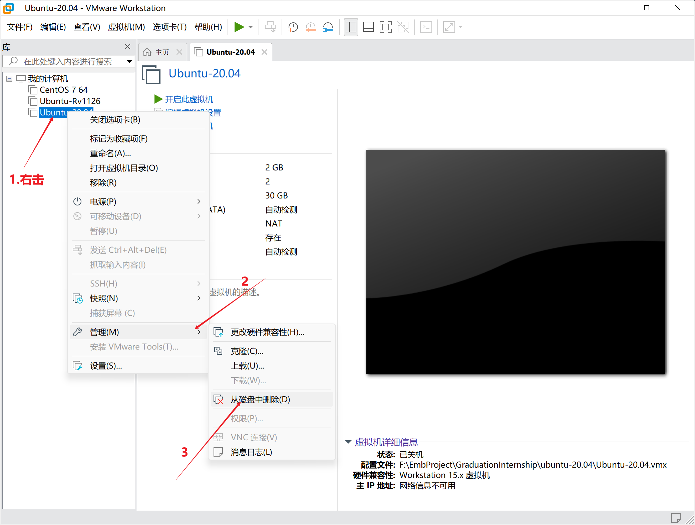

方法二：


### VMWare 与 Ubuntu 窗口大小适配

> 两种方法任选一种即可，均使用的话可能存在部分冲突

##### 方法一

1. 在菜单栏找到 虚拟机 -> 设置


2. 调整显示器的显示缩放比例，更改为拉伸模式


##### 方法二

打开终端，手动输入以下命令，等待安装完成后重启Ubuntu即可。

```shell
sudo apt-get install open-vm-tools-desktop
```

卸载（建议别卸载，容易出问题，见：**ERROR LOG** : VMWare 虚拟机共享文件夹不显示）

```shell
sudo apt-get remove --purge open-vm-tools-desktop
```

**`--purge`** : 这个选项会一起删除该软件包的配置文件，确保完全清除。


### Windows 与 VMWare-Ubuntu 跨系统复制粘贴

> **参考：** [copy-paste-and-dragdrop-not-working-in-vmware-machine-with-ubuntu](https://askubuntu.com/questions/691585/copy-paste-and-dragdrop-not-working-in-vmware-machine-with-ubuntu/824341#824341)

通过安装VMtools实现了Windows与Ubuntu跨系统复制粘贴，打开终端，手动输入以下命令，再重启ubuntu系统即可。

```shell
sudo apt-get autoremove open-vm-tools
sudo apt-get install open-vm-tools
sudo apt-get install open-vm-tools-desktop
```


### VSCode 配置 SSH 免密远程登陆

> **参考**：https://blog.csdn.net/qq_44571245/article/details/123031276

打开 PC 端的终端或 Power Shell，输入以下命令：

```bash
ssh-keygen -t rsa
```

连续回车直到结束，找到 `.ssh` 这个文件夹，用记事本打开 `id_rsa.pub` 这个文件，并复制里面的内容。

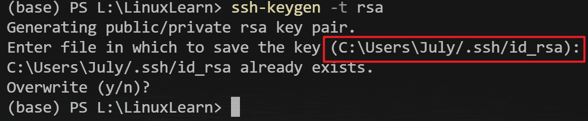

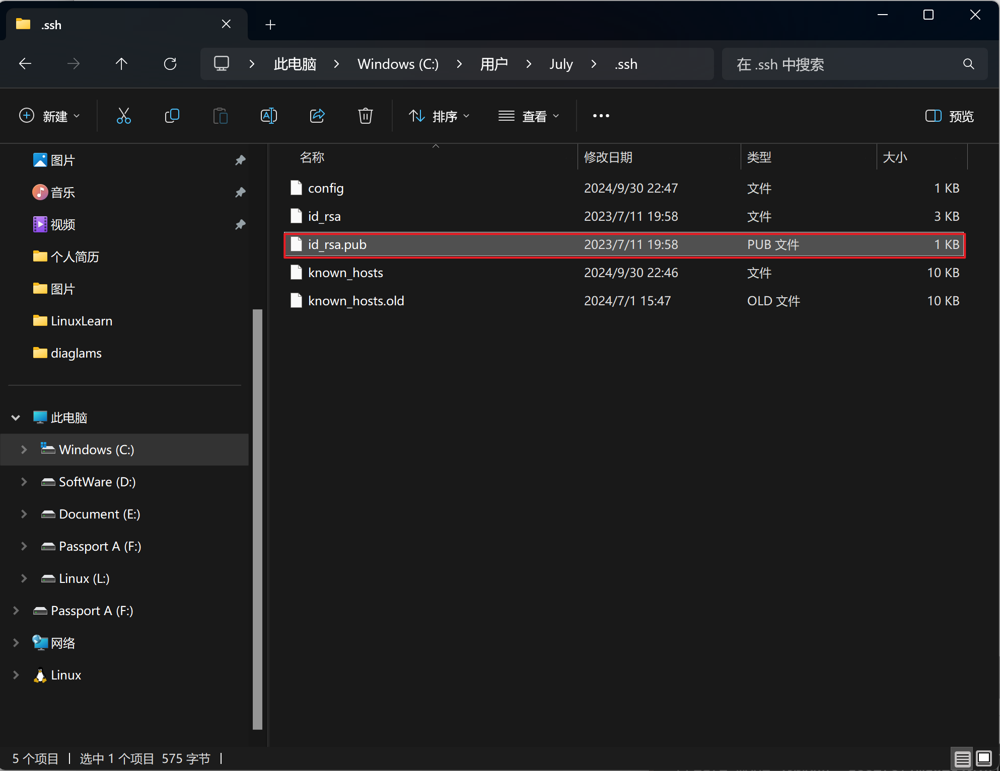

vscode 中通过 SSH 连接板卡，在板卡的命令行上输入以下内容：

```bash
ssh-keygen -t rsa
```

连续回车直到结束，可看到 `/hemo/sprine` 目录下会有 `.ssh` 文件夹：


然后进入该文件夹，就可以看到生成的公钥和私钥：


然后创建一个文件 `authorized_keys`，把刚刚从记事本上复制的内容粘贴到里面，然后保存退出即可配置完成。


### C 指针中使用 const 位置不同的区别

```c
const char *p;
```

- `p` 是一个指向 `const char` 的指针。
- 可以通过 `p` 修改指针的指向，但不能通过 `*p` 修改指向的内容。

```c
char * const p;
```

- `p` 是一个常量指针，指向 `char`。

- 不能修改指针 `p` 的指向，但可以通过 `*p` 修改指向的内容。

```c
char const *p;
```

- 这是 `const char *p;` 的另一种写法，含义相同。
- `p` 是一个指向 `const char` 的指针，不能通过 `*p` 修改指向的内容。

```c
const * char p;
```

- 这种写法是错误的，语法不正确。`const` 不能单独用于指针类型，应该放在类型前面或后面。

    

### VSCode 中将默认的空格缩进更改为 Tab 缩进

用 VSCode 打开任意文件，在窗口的底栏中找到 **`制表符长度: x`** 并单击：

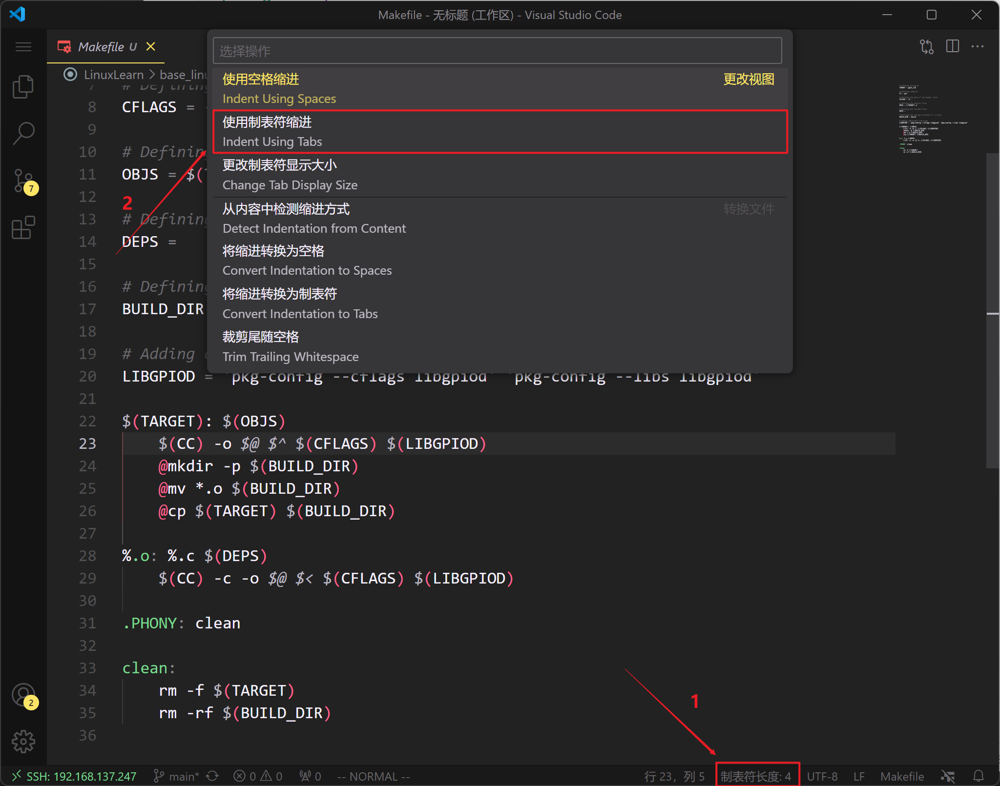

在弹出的菜单栏中选择 **`使用制表符缩进`**即可。


### VMWare Ubuntu 虚拟机扩容

> 参考 ：[vmware：ubuntu虚拟机如何扩容？](https://blog.csdn.net/qq_34160841/article/details/113058756)


## ERROR LOG

### VMWare 虚拟机共享文件夹不显示

- [x] 2024.10.15 22:57

> **参考博客：** [虚拟机设置共享文件夹添加不显示](https://blog.csdn.net/qq_41880069/article/details/86158454)

1. 确保 `open-vm-tools` 及 `open-vm-tools-desktop` 已安装

```shell
sudo apt-get install open-vm-tools
sudo apt-get install open-vm-tools-desktop
```

2. 进行挂载配置

```shell
sudo vmhgfs-fuse .host:/ /mnt/hgfs
```

3. 检查挂载

```shell
mount | grep hgfs
```

4. 确保挂载目录存在

```shell
sudo mkdir -p /mnt/hgfs
sudo chmod 755 /mnt/hgfs
```

5. 进行上述配置后可能会提示权限不足，输入以下命令更改权限

```shell
sudo umount /mnt/hgfs 
sudo vmhgfs-fuse .host:/ /mnt/hgfs -o allow_other,uid=$(id -u),gid=$(id -g)
```

6. 最后使用命令查看是否可以正常访问

```shell
cd /mnt/hgfs
ls
```


### Vim Ctrl+z 强制退出后再次进入显示 E325：注意

- [x] 2024.10.17 1:26

当使用 `Ctrl + z` 强制退出 Vim 后，再次进入出现以下界面


解决方法如下：

1. **退出 Vim**：在提示符中选择 `Q` 来退出 Vim。

2. **查找 Vim 交换文件**：在终端中，使用以下命令查找交换文件：

    ```shell
    ls -a
    ```

    如果交换文件的位置不在当前目录，可以用 `find` 命令查找它：

    ```shell
    find / -name ".test.txt.swp"
    ```

    这里的 `test.txt` 是之前使用 `Ctrl + z` 强制退出的文件名，根据具体情况更改。

3. **删除交换文件**： 在终端中，使用以下命令删除交换文件：

    ```shell
    rm .test.txt.swp
    ```

    确保路径正确，如果交换文件在其他位置，请相应调整路径。

4. **重新打开文件**： 可以重新打开 `test.txt` 文件，确认没有问题。

    

### make 编译报错 *** missing separator.  Stop.

- [x] 2024.10.23 18:42

```bash
Makefile:23: *** missing separator.  Stop.
```

这个错误通常是由于 Makefile 中的缩进问题导致的。Makefile 要求使用制表符（Tab）而不是空格来缩进命令。相关配置见 **OTHER - [VSCode 中将默认的空格缩进更改为 Tab 缩进](#VSCode 中将默认的空格缩进更改为 Tab 缩进)**


### apt 安装报错 E: Unable to locate package xxxx

- [x] 2024.10.26 15:24

```bash
cat@lubancat:/boot/uEnv$ sudo apt install neofetch
Reading package lists... Done
Building dependency tree... Done
Reading state information... Done
E: Unable to locate package neofetch
```

这个错误表明系统无法找到 `neofetch` 包。可能的原因有几个：

**首先尝试使用 `sudo apt update` 更新软件包列表**，更新完后尝试 apt 是否可用，若无法正常更新或者更新完后仍不可用，再查看以下两条方法。

1. **系统当前时间相较服务器端时间相差太大**，使用以下命令查看当前系统时间

    ```bash
    date
    ```

    如果返回的时间和现实时间相差过大，会导致 apt 安装报错，通过以下命令手动更新系统时间：

    ```bash
    sudo date -s "YYYY-MM-DD HH:MM:SS"
    ```

    然后再次尝试 apt 安装。

    当系统时间更改了可以正常 apt 安装程序后，推荐安装 NTP 服务自动同步时间：

    ```bash
    sudo apt install ntp
    ```

2. **软件源缺失或者不匹配**，手动编辑 `/etc/apt/sources.list` 文件，确保源列表中包含以下行（Debian 系统，其他系统如 Ubuntu/CentOS去网络搜索需要的软件源）：

    ```bash
    deb http://deb.debian.org/debian/ bullseye main contrib non-free
    deb http://deb.debian.org/debian/ bullseye-updates main contrib non-free
    deb http://deb.debian.org/debian-security bullseye-security main contrib non-free
    ```

    使用以下命令查看并编辑 `/etc/apt/sources.list` 文件：

    ```bash
    sudo vim /etc/apt/sources.list
    ```

    若文件缺失以上三行源，复制粘贴到文件后面后保存退出，使用 apt 再次尝试安装。
