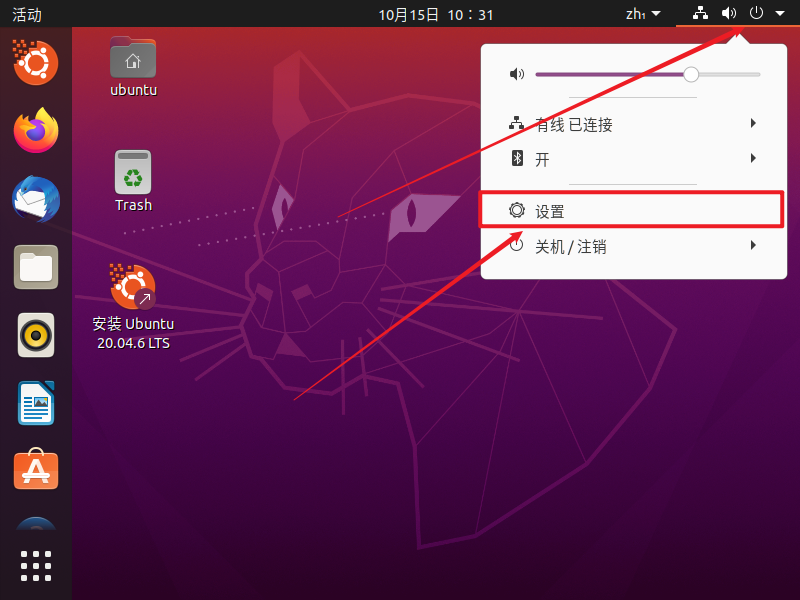
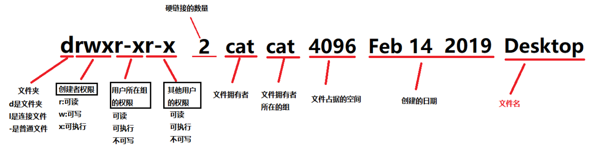
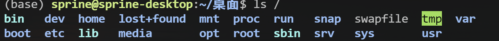

# README

 Linux learning record

[TOC]

## 一. VMWare 虚拟机安装

>  **所选系统：** Ubuntu20.04
>
>  **VMware 版本：** Workstation 17 Pro
>
>  **参考博客：** [VMware虚拟机安装Ubuntu20.04详细图文教程](https://blog.csdn.net/weixin_41805734/article/details/120698714)

### 1. 系统镜像下载

[Ubuntu 20.04.6](https://releases.ubuntu.com/focal/)


### 2. VMWare 安装 Ubuntu

#### 2.1 新建虚拟机及其相关配置


#### 2.2 Ubuntu系统安装

##### 2.2.1 启动虚拟机


##### 2.2.2 语言及键盘配置


##### 2.2.3 Ubuntu 显示分辨率调整

新启动的 Ubuntu 系统可能显示区域大小与 VMWare 窗口不匹配，通过以下方法调整。

1. 先退出安装窗口


2. 右上角打开设置页面



3. 找到显示器选项，更改为任意分辨率即可


##### 2.2.4 继续完成安装


重启后会停留在一个黑屏页面，显示一串英文 “Please remove ... , then press ENTER”，直接按回车键即可。

耐心等待重启后即可进入登陆页面，选中自己的账户，输入之前设置的密码，然后回车


显示以下界面即安装成功。


#### 2.3 更改 Ubuntu 软件源

Ubuntu 默认使用国外软件源，将其更改为国内软件源可提高下载速度


### 3. 设置共享文件夹

#### 3.1 添加共享文件夹

左上菜单栏找到 虚拟机 -> 设置，打开设置页面


点击添加后，根据引导完成设置即可。

#### 3.2 访问共享文件夹

**共享文件夹挂载位置：** `/mnt/hgfs`

1. 列出全部已共享文件夹 `ls /mnt/hgfs`

```shell
sprinec@sprinec-virtual-machine:/$ ls /mnt/hgfs
LinuxLearn
```

2. 进入共享文件夹

```shell
cd /mnt/hgfs/LinuxLearn
```

3. 复制虚拟机中文件到共享文件夹

```shell
cp -Rf /home/database/* /mnt/hgfs/LinuxLearn
```


## 二. Linux 基础与应用开发

> **参考书籍：** [野火]《Linux基础与应用开发实战指南—基于LubanCat-RK系列板卡》
>
> **使用板卡：** LubanCat 4 RK3588S

### 1. 配置网络

#### 1.1 WIFI连接

需使用无线串口WIFI或者安装网卡使用，硬件准备好后在 Ubuntu 桌面右上角点击找到 WIFI 连接选择连接的网络输入密码连接即可。

#### 1.2 网口连接

网线连接后PC端需进行配置共享网络

1. 打开设置，选择网络和 Internet ，按照下图指示进入高级网络设置页面


2. 选择 PC 端需共享的网络


3. 按如图所示操作，家庭网络连接项选择 Linux 板卡所连接的网络端口即可


配置好WIFI或者网口的任意网络后，可使用以下命令查看板卡 IP 地址，从而在 PC 端进行 ssh 连接：

```shell
ifconfig
```

- 有线网口显示为 `ethx` ，x 为 0，1， 2 ...

- 无线串口 WIFI 一般显示为 `wlanx` ，x 为 0，1， 2 ...
- 网卡一般显示为网卡的名称，如 `wlp4p65s0`

`inet` 后面跟的 xxx.xxx.xxx.xxx 即为板卡 IP 地址

### 2. Linux 命令行

**命令的格式：** `command [-options] [argument]`

#### 2.1 常用命令

- `ls` ：列出当前目录的文件
    - `ls [目录名]` ：列出其他文件的目录
    - `-a` ：显示所有文件及目录 (ls 内定将文件名或目录名称开头为“.”的视为隐藏档,不会列出)
    - `-l` ：除文件名称外,将文件型态、权限、拥有者、文件大小等信  息详细列出
    - `-t` ：将文件依建立时间之先后次序列出
    - `-A` ：同 -a ,但不列出 “ . ” (当前目录) 及 “ .. ” (父目录)
    - `-R` ：若目录下有文件,则该目录下的文件也会列出,即递归显示
- `pwd` ：列出当前目录的位置
- `cd` ：切换到家目录
    - `cd [目录名]` ：切换到指定目录
    - `cd -` ：切换上次切换的目录
    - `cd ~` ：切换到家目录
    - `cd ..` ：切换上一层目录
    - `cd /` ：切换到根目录
- `mkdir [name]` ：创建名为 name 的文件夹
    - `-p [name1/name2]` ：递归创建
- `touch [name1, name2, ...]` ：创建多个文件，命名分别为 name1, name2, ...
- `cp -r a b` ：复制 *a* 文件夹重命名为 *b*
    - `-R/r` ：递归处理
- `rm [-option] [一个或多个文件/文件夹名]` ：删除一个或多个文件或目录
    - `-R/r` ：递归处理
    - `-i` ：删除文件或文件夹前,终端会逐一询问确认
    - `-f` ：忽略不存在的文件,无需逐一确认
- `which [xxx]` ：查找并显示给定命令的绝对路径
- `echo` ：输出指定的字符串或者变量
- `cat [文件名]` ：连接多个文件并打印到标准输出
- `>`，`>>` ：输出重定向到文件
    - `命令 > 文件名` ：直接用输出覆盖原文件
    - `命令 >> 文件名` ：把输出追加到原文件的末尾
- `su [用户名]` ：用于切换用户
- `clear` ：清除当前屏幕终端上的任何信息
- `reboot` ：系统重启
- `poweroff` ：系统关机
- `chmod` ：用来变更文件或目录的权限


- `df` ：显示磁盘的相关信息
    - `-h` ：以可读性较高的方式来显示信息

- `id` ：查看当前用户的 UID 值


- `sudo` ：管理员权限
    - `sudo !!` ：使用 sudo 权限重新执行上一条指令
- `sudo apt update` ：更新软件
- `sudo apt upgrade` ：安装更新的软件
- `sudo apt install xxx` ：软件安装
- `sudo apt remove xxx` ：软件卸载

#### 2.2 其他软件

- `sudo nmtui` ： WiFi 连接图形化配置

### 3. 快捷键

#### Ubuntu 系统快捷键

- `Ctrl + Alt + t` ：打开终端（桌面系统适用）
- `Ctrl + c` ：取消输入的命令/中止命令

### 4. 用户与文件

#### 4.1 用户及用户组

在 Linux 中,每个用户都有一个特定的编号——UID，用于标识一个系统用户。

可通过 `id` 命令查看当前用户的 UID 值。

```shell
id
```


上图中的 gid 用于标识当前用户所在的分组(Group)，每个用户可以对应多个分组。

Linux 系统拥有多个分组,每个用户分组就相当社团，用户如果是多个用户组 的成员，就可以访问其他分组对应的文件，前提是该分组的文件允许其他用户访问，这就需要了  解另一个知识点：文件权限。


#### 4.2 文件

Linux 一切皆文件

**Linux 的文件属性：**可以分为读权限、写权限、执行权限。

**Linux 文件权限**分三种情况：文件拥有者(owner)，分组成员(groups)  以及其他分组成员(other)。

使用以下命令查看当前目录的文件权限

```shell
ls -l
```


可以看到文件和文件夹的开头都有一串字符字符，例如：

```shell
drwxr-xr-x 2 cat cat 4096 Feb 14 2019 Desktop
```

各个字段的说明如下：



- 第一字段：文件属性

    文件属性共有十个字符，第一个字符代表文件的类型

    - `-` ：表示该文件是一个普通文件
    - `d` ：dirtectory（目录）的首字符,表示该文件是一个目录
    - `I` ：表示该文件是个链接文件

    后面的九个字符，每三个为一组，分别表示**文件拥有者的权限**、**文件所属组拥有的权限**以及**其他用户拥有的权限**。

    - `r` ：读（ read ）权限
    - `w` ：写（ write）权限
    - `x` ：执行（execute）权限

- 第二字段：链接占用的节点/子目录的个数

    第二字段的含义，主要取决该文件的类型,如果是文件的话，则表示该文件所具有的硬连接数。某个文件的第二字段如果等于 1 的话，代表没有其他指向该文件的硬连接。

    根据 Linux 系统存储文件的特点，链接的方式可以分为两种，分别是**硬链接**和**软连接**（符号连接）。软链接，类似于 Windows 操作系统的快捷方式。而硬链接，则是相当于把该文件复制一份，同时加上自动更新。当我们修改了硬链接文件的内容，源文件也会被修改。当为  某个文件创建硬链接时，该字段的值便会加 1。可以使用 `ln` 命令创建软链接和硬链接。

    对于文件夹来说，第二字段则表示该文件夹下有多少个子目录。空文件夹的话，该值默认等于 2，这是因为包含了 “ . ” 和 “ .. ” 子目录。

- 第三字段和第四字段：文件拥有者和文件所在的组

#### 4.3 chmod 命令

文件的权限由三部分组成，每个部分都对应着三种文件权限，可读、可写、可执行

`rwx` 在二进制中的数值可以看成

- `r` ：100 - 4
- `w` ：010 - 2
- `x` ：001 - 1

因此，若文件的权限是 `rwx` ，它的数值表达式为 7，如果是 `rw-`，数值表达为 6，则有：

- `rwx` ：7 
- `rw-` ：6
- `r-x` ：5
- `r--` ：4
- `-wx` ：3
- `-w-` ：2
- `--x` ：1
- `---` ：0

若想要修改文件的所有权限则可使用以下命令：

```shell
sudo chmod xxx [文件名]
```

- `xxx = 777` 则文件权限变为了 `-rwxrwxrwx`
- `xxx = 666` 则文件权限变为了 `-rw-rw-rw-`

若要单独给用户，组，其他用户设置权限则使用以下命令

```shell
sudo chmod [ugoa][+-][rwx] [文件名]
```

- [ugoa]
    - `u` ：使用者
    - `g` ：用户所在的组
    - `o` ：其他用户
    - `a` ：所有用户

- [+-]
    - `+` ：增加权限
    - `-` ：移除权限

- [rwx]
    - `r` ：读
    - `w` ：写
    - `x` ：执行


举例：

```shell
# 给所有用户移除可执行的权限
sudo chmod a-x hello

# 给其他用户减少可写的权限
sudo chmod o-w hello

# 给 root 用户减少可写的权限
sudo chmod u-w hello

# 给 root 用户增加可写的权限
sudo chmod u+w hello													
```

### 5. Linux 文件目录

#### 5.1 根目录与家目录

**根目录**是 Linux 下所有文件和目录的起点，它的路径用斜杠符号 “ / ” 来表示。

```shell
ls /
```



当使用普通登陆用户（sprine）登陆时会默认进入**家目录** `/home/sprine`，当我们使用 root 用户登录时会进入 `/root` 目录，root 用户家目录就是 `/root`。


#### 5.2 根目录结构

整个 Linux 系统有且只有一棵从根目录开始的目录树，如下图所示。


|    目录    | 目录放置的内容                                               |
| :--------: | :----------------------------------------------------------- |
|    bin     | 存放系统命令的目录，如命令 `cat`，`cp`，`mkdir`              |
|    boot    | 存放开机启动过程所需的内容，如开机管理程序 grub2             |
|    dev     | 所有设备文件的目录（如声卡、硬盘、光驱）                     |
|    etc     | 系统的主要配置文件                                           |
|    home    | 用户家目录数据的存放目录                                     |
|    lib     | 存放 sbin 和 bin 目录下命令所需的库文件                      |
| lib32/ib64 | 存放二进制函数库，支持 32 位 / 64 位                         |
| lost+found | 在 EXT3/4 系统中，当系统意外崩溃或意外关机时，会产生一些碎片文件在这个目录下面，系统启动 fcsk 工具会检查这个目录，并修复已损坏的文件。 |
|   media    | 用于挂载光盘，软盘和 DVD 等设备                              |
|    mnt     | 同 media 作用一样，用于临时挂载存储设备                      |
|    opt     | 第三方软件安装存放目录                                       |
|    proc    | 进程及内核信息存放目录，不占用硬盘空间                       |
|    root    | root 用户的家目录                                            |
|    run     | 是一个临时文件系统，存储系统启动以来的信息。当系统重启时，这个目录下的文件应该被删掉或清除 |
|    sbin    | root 用户使用的命令存放目录                                  |
|    srv     | 一些网络服务所需要的数据文件                                 |
|    sys     | 同 proc 目录，用于记录 CPU 与系统硬件的相关信息              |
|    tmp     | 程序运行时产生的临时文件存放目录                             |
|    usr     | 系统存放程序的目录，类似于在 windows 下的文件夹 programefiles |
|    var     | 存放内容常变动的文件目录，如系统日志文件                     |

### 6. Vi/Vim 编辑器

大部分 Linux 系统中都会自带 Vi 编辑器已方便用户在终端上编辑文件，而 Vim 是 Vi 的升级版  本，它在 Vi 的基础上改进和增加了很多特性,是一个功能更强大、高度可定制的文本编辑器。

#### 6.1 Vim 使用演示

##### 6.1.1 安装 Vim

```shell
sudo apt install vim
```

##### 6.1.2 打开 Vi/Vim

```shell
vi
vi 文件名
```

```shell
vim
vim 文件名
```

##### 6.1.3 退出 Vi/Vim

1. `Ctrl + z` 直接强制退出

    该模式下退出后再次使用 vim 进入会报类似如下的提示

    

    具体处理方式请看 **ERROR LOG - Vim Ctrl+z 强制退出后再次进入显示 E325：注意**

2. 在**命令行模式**下输入退出命令退出

    1. 按下退出键 `Esc`，Vim 会进入到 *一般模式* 
    2. 输入英文冒号 `:` ，Vim 会进入到 *命令行模式* 

    3. 输入强制退出命令 `q!`  ，即字母 `q` 及英文叹号 `!` 

    4. 按回车执行命令，会退出 Vim，返回到终端

##### 6.1.4 输入内容

Vim 打开后默认是在**一般模式**，在该模式下的所有输入就如同在其它常用编辑器中按了快捷键。

可通过以下步骤进入到 **插入模式** 输入内容并保存文件：

1. 按下退出键 `Esc` 进入*一般模式*
2. 直接按字母 `i` ，进入*插入模式*
3. 输入内容
4. 按下退出键 `Esc` ，再次进入*一般模式*
5. 输入英文冒号 `:` ，Vim 会进入到 *命令行模式* 
6. 输入保存退出命令 `wq`
7. 按回车执行命令，会退出 Vim，返回到终端

#### 6.2 Vim 的三种模式

- **一般模式**（normal mode）：一般模式用来浏览文本，查找内容，但是不可以编辑，在该模式下的键盘输入会被当成快捷键，如复制粘贴等。打开 Vim 时，默认是工作在一般模式。
- **插入模式**（insert mode）：插入模式下具有普通编辑器的功能，该模式下的键盘输入会被当成文本内容。
- **命令行模式**（command-line mode）：命令行模式支持保存、退出、替换等命令，以及 Vim 的高级功能。

三种模式的切换图：


##### 6.2.1 插入模式

进入/退出插入模式的快捷键：

| 快捷键 | 功能描述                                           |
| :----: | -------------------------------------------------- |
|   i    | 在当前光标所在位置插入文本                         |
|   a    | 在当前光标所在位置的下一个字符插入文本             |
|   o    | 在光标所在位置后插入新行                           |
|   r    | 替换当前光标所在位置的字符                         |
|   R    | 可以替换当前光标所在位置之后的字符,按下“Esc”则退出 |
|  ESC   | 退出插入模式                                       |

##### 6.2.2 一般模式

在任意模式下按按键 `Esc` 可进入到一般模式。

一般模式快捷键：

|                          |        快捷键        | 功能描述                                                     |
| :----------------------: | :------------------: | ------------------------------------------------------------ |
|         光标移动         |        k / ↑         | 光标向上移动                                                 |
|                          |        j / ↓         | 光标向下移动                                                 |
|                          |        h / ←         | 光标向左移动                                                 |
|                          |        l / →         | 光标向右移动                                                 |
|                          |        PageUp        | 向上翻页                                                     |
|                          |       PageDown       | 向下翻页                                                     |
|                          |          nG          | 跳转到第 n 行                                                |
|      文本查找与替换      |        /word         | 在文件中搜索关键字 word                                      |
|                          |          n           | 查找下一个关键字                                             |
|                          |          N           | 查找上一个关键字                                             |
|                          | :1,$s/word1/word2/gc | 将文本中的所有关键字 word1 用 word2 进行替换，需要用户进行确认。（ 使用 `:1,$s/word1/word2/g` 则直接全部替换 ）。这实际是运行在命令模式。 |
|         撤销重做         |          u           | 撤销上一步的操作，等价于 Windows 的 `Ctrl+Z`                 |
|                          |       Ctrl + r       | 重做上一步的操作                                             |
| 删除、剪切、  复制、粘贴 |          d           | 删除光标所选的内容                                           |
|                          |          dd          | 删除当前行                                                   |
|                          |         ndd          | 删除光标后 n 行                                              |
|                          |          x           | 剪切光标选中的字符                                           |
|                          |          y           | 复制光标所选的内容                                           |
|                          |          yy          | 复制当前行                                                   |
|                          |         nyy          | 复制当前行后 n 行                                            |
|                          |          p           | 将复制的数据粘贴在当前行的下一行                             |
|                          |          P           | 将复制的数据粘贴在当前行的上一行                             |
|         区块操作         |          v           | 选择多个字符                                                 |
|                          |          V           | 可以选择多行                                                 |
|                          |       Ctrl + v       | 可以选择多列                                                 |

##### 6.2.3 命令行模式

在一般命令模式下，按下键盘的冒号键 `:` ，就可以进入命令行模式，继续输入要执行的命令按  回车即可执行。

命令行模式快捷键：

|    快捷键    | 功能描述                                            |
| :----------: | --------------------------------------------------- |
|      w       | 保存文档                                            |
| w <filename> | 另存为以 <filename> 为文件名的文档                  |
| r <filename> | 读取文件名为 <filename> 的文档                      |
|      q       | 直接退出软件，前提是文档未做任何修改                |
|      q!      | 不保存修改，直接退出软件                            |
|      wq      | 保存文档，并退出软件                                |
|    set nu    | 在行首加入行号                                      |
|   set nonu   | 不显示行号                                          |
| set hlsearch | 搜索结果高亮显示                                    |
|  ! command   | 回到终端窗口，执行 command 命令，按回车键可切回 vim |


#### 6.3 用 Vi/Vim 软件编写简单的 sh 脚本

在终端执行下列命令：

```shell
vim hello_world.sh
```

进入文件后输入以下内容：

```shell
echo "hello world,this is a script test!"
```

Vim 退出后回到终端，通过 `source` 命令运行刚刚编写的脚本文件：

```shell
sudo chmod u+x hello_world.sh
source hello_world.sh
```

### 7. Git 项目版本管理

#### 7.1 Git 安装与配置

1. 安装 Git，在终端输入下列命令：

    ```shell
    sudo apt-get install git -y
    ```

    - `-y` ：询问是否安装时默认选择 Yes

2. 用户配置，配置用户名和邮箱

    ```shell
    git config --global user.email xxx
    git config --global user.name xxx
    ```

    - `--global` ： 配置 `~/.gitconfig` 文件，对当前用户下的所有仓库有效
    - `--system` ：配置 `/etc/gitconfig` 文件，对当前系统下的所有用户有效
    - 无参数：配置 `.git/config` 文件，只对当前仓库有效

#### 7.2 Git 本地项目管理简单使用流程

1. 创建本地仓库

    ```shell
    git init [仓库名称]
    ```

2. 添加/修改文件

    ```shell
    cd [仓库名称]
    touch FILE1, FILE2, FILE3, ...
    vim FILE1
    ...
    ```

3. 将文件的修改变化保存到仓库的暂存区

    保存单个/多个文件修改：

    ```shell
    git add FILE1, FILE2
    ```

    保存全部修改：

    ```
    git add *
    ```

4. 将保存到暂存区的修改提交到本地仓库

    ```shell
    git commit -m "The changes you want to add"
    ```

    - `-m "MESSAGE"` ：提交信息

5. 查看提交历史

    ```shell
    git log
    ```

6. 根据提交的 ID 查看某一个提交的详细信息

    ```shell
    git show COMMIT_ID
    ```

#### 7.3 Git 线上托管项目管理简单使用流程

GitHub 和 Gitee 是一个基于 Git 的在线项目托管平台，它提供了 web 界面,，用户可以在上面创建远程仓库来存放自己的项目。所有的开发者可以基于这个远程仓库共同协作，不断地维护和完善该项目。

> 该节以 GitHub 为例，Gitee 同理

##### 7.3.1 GitHub 获取线上项目方式比较

在 GitHub 上克隆或者管理项目时，常用的方式一般有以下三种：


1. **HTTPS **
    - 简单易用，不需要额外配置，直接使用用户名和密码（或 token），但 GitHub 近期似乎不再支持使用用户名和密码进行身份验证，使用 Personal Access Token 进行替代。
    - GitHub 网速在国内受限，可能会出现多次下载失败的现象（需要科学上网）。
    - 安全性相对较低：密码可能被窃取，尤其在不安全的网络上。
    - 每次操作都需输入密码（如果未缓存）。
2. **SSH **
    - 安全性高，使用密钥对进行身份验证，避免密码泄露风险。
    - 方便，一旦设置好，推送和拉取时无需输入密码。
    - 相较于 HTTPS，在国内下载项目速度更快。
    - 初始配置较复杂，需要生成密钥并添加到 GitHub。
3. **ZIP 下载**
    - 简单直观，用户只需点击下载链接，操作非常简单，不需要安装 Git 或配置身份验证。
    - 缺乏版本控制，下载 ZIP 只会获取当前代码快照，不能方便地进行版本管理和更新。
    - 不能执行 Git 操作，无法进行常规的 Git 操作（如分支管理、合并等），需要手动管理文件。

总结比较：

- **SSH** 和 **HTTPS** 更适合需要频繁更新和版本控制的开发者，能够轻松进行 Git 操作。
- **ZIP 下载** 更适合不熟悉 Git 的用户或临时需要代码快照的情况，但不适合长期开发使用。

这里我们采用 SSH 方式。

##### 7.3.2 生成 SSH 密钥

终端输入以下命令：

```shell
ssh-keygen -t rsa -b 4096 -C "your_email@example.com"
```

在密钥生成过程中会出现以下询问：

```shell
Enter file in which to save the key (/home/username/.ssh/id_rsa): 
```

可以直接按 Enter 键，以使用默认的文件路径 `/home/username/.ssh/id_rsa` 保存 SSH 密钥。这样会在这个位置生成一个新的密钥文件。如果你希望使用不同的名称或路径，可以输入新的文件名，然后按 Enter 键。通常情况下，使用默认路径即可。

```shell
Enter passphrase (empty for no passphrase): 
```

在这个提示中，你可以选择输入一个密码短语（passphrase）来保护你的 SSH 密钥。这个密码短语在你每次使用密钥时会要求你输入，以增加安全性。如果你不想每次都输入密码短语，可以直接按 Enter 键留空。

生成密钥后，你会看到一个公钥文件 `id_rsa.pub`。记得将这个公钥添加到你的 GitHub 账户中，以便进行 SSH 连接。你可以用以下命令查看公钥内容：

```
cat ~/.ssh/id_rsa.pub
```

- 确保复制的内容包括开头的 `ssh-rsa`，后面是长字符串，最后是你的邮箱地址。

##### 7.3.3 GitHub 上添加 SSH 密钥

1. 点击右上角头像打开菜单栏，进入设置页面

    

2. 找到 SSH and GPG keys，点击 New SSH key

    

3. Title 任取，将 `id_rsa.pub` 中复制的密钥粘贴在 Key 栏中，后点击 Add SSH key 即可

    

4. 后续可在 SSH and GPG keys 页面管理自己的密钥

    


##### 7.3.4 通过 SSH 从线上仓库克隆项目

在 GitHub 或者 Gitee 网站上,找到需要下载的项目，复制该项目的 SSH 链接。


在终端 `cd` 到合适的目录运行下列命令：

```shell
git clone git@github.com:SprInec/LinuxLearn.git
```

第一次使用 SSH 克隆项目回车后可能会看到如下提示


这是 SSH 连接的安全提示，询问你是否信任 GitHub 的服务器。输入 `yes` 并按 Enter 键，系统将会将 GitHub 的主机密钥添加到你的 `~/.ssh/known_hosts` 文件中，之后就不会再出现这个提示。

继续后续操作，`git clone` 会开始下载仓库，稍作等待即可在当前目录下看到克隆的项目文件夹。

##### 7.3.5 在本地进行项目更改及推送

下面的操作和在本地进行项目管理的操作基本一致，只是多了 `push` 和 `pull` 两个进行线上和本地同步的操作。

1. 添加/修改文件

    ```shell
    cd [仓库名称]
    touch FILE1, FILE2, FILE3, ...
    vim FILE1
    ...
    ```

2. 将文件的修改变化保存到仓库的暂存区

    保存单个/多个文件修改：

    ```shell
    git add FILE1, FILE2
    ```

    保存全部修改：

    ```
    git add *
    ```

3. 将保存到暂存区的修改提交到本地仓库

    ```shell
    git commit -m "The changes you want to add"
    ```

    - `-m "MESSAGE"` ：提交信息


4. 

1. 查看提交历史

    ```shell
    git log
    ```

2. 根据提交的 ID 查看某一个提交的详细信息

    ```shell
    git show COMMIT_ID
    ```

#### 7.4 Git 项目管理的一般步骤

**1. 创建或克隆仓库**：

- 使用 `git init` 创建新的本地仓库。
- 使用 `git clone <repo-url>` 克隆现有的远程仓库。

**2. 配置用户信息**（如果是新仓库）：

```bash
git config --global user.name "Your Name"
git config --global user.email "your_email@example.com"
```

**3. 查看状态**：

- 使用 `git status` 查看当前工作区和暂存区的状态。

**4. 添加更改**：

- 使用 `git add <file>` 将更改添加到暂存区，或使用 `git add .` 添加所有更改。

**5. 提交更改**：

- 使用 `git commit -m "Commit message"` 提交暂存区的更改。

**6. 推送到远程**：

- 使用 `git push origin <branch-name>` 将本地提交推送到远程仓库。

**7. 拉取更新**：

- 使用 `git pull origin <branch-name>` 从远程仓库获取并合并最新的更改。

**8. 处理分支**（可选）：

- 创建新分支：`git branch <branch-name>`
- 切换分支：`git checkout <branch-name>`
- 合并分支：`git merge <branch-name>`

**9. 解决冲突**（如有）：

- 在合并过程中可能会出现冲突，手动解决后，重新添加和提交。

**10. 查看历史记录**：

- 使用 `git log` 查看提交历史。


## 三. Linux 镜像构建与部署

> **参考书籍：** [野火]《嵌入式Linux镜像构建与部署—基于LubanCat-RK系列板卡》
>
> **使用板卡：** LubanCat 4 RK3588S


## 四. Linux 驱动开发

> **参考书籍：** [野火]《嵌入式Linux驱动开发实战指南—基于LubanCat RK系列板卡》
>
> **使用板卡：** LubanCat 4 RK3588S

### 1. 获取内核源码

#### 1.1 安装 git

```shell
sudo apt-get install git
```

#### 1.2 创建存放文件夹

```shell
mkdir LubanCat
cd LubanCat
```

#### 1.3 获取内核源码

##### 1.3.1 从GitHub获取

```shell
git clone -b develop-5.10 https://github.com/LubanCat/kernel.git
```

##### 1.3.2 从野火共享的网盘资料中获取压缩包

`LubanCat_Linux_rk3588_SDK_20240510.7z` 

1. 将压缩包下载到 windows 端之前设置的共享文件夹，在ubuntu中进入挂载目录进行拷贝

```shell
cd /mnt/hgfs/LinuxLearn
cp LubanCat_Linux_rk3588_SDK_20240510.7z ~/桌面/LubanCat/LubanCat4_RK3588_SDK
```

2. 安装 `7z`

```shell
sudo apt install p7zip-full
```

3. 进入拷贝目录，进行解压

```shell
cd ~/桌面/LubanCat/LubanCat4_RK3588_SDK
7z x LubanCat_Linux_rk3588_SDK_20240510.7z
```

4. 检出 *.repo* 目录下的 git 仓库

```shell
.repo/repo/repo sync -l
```

5. 进入 kernel 目录

```
ls
cd kernel
```

### 2. PC端编译内核

#### 2.1 获取编译工具链

```shell
cd ~/桌面/LubanCat
git clone https://github.com/LubanCat/gcc-linaro-6.3.1-2017.05-x86_64_aarch64-linux-gnu.git
```

导出环境变量

```shell
export PATH=~/桌面/LubanCat/gcc-linaro-6.3.1-2017.05-x86_64_aarch64-linux-gnu/bin:$PATH
```

查看编译工具链

```shell
aarch64-linux-gnu-gcc -v
```

#### 2.2 编译内核源码

1. 配置所需工具

- 安装 `make`

```shell
sudo apt-get update
sudo apt install make
```

- 安装 `GCC` 编译器

```shell
sudo apt-get install build-essential
```

- 创建符号链接 `python -> python3`

```shell
sudo ln -s /usr/bin/python3 /usr/bin/python
```

- 安装 `flex`

```shell
sudo apt-get install flex
```

- 安装 `bison`

```shell
sudo apt-get install bison
```

- 安装 `OpenSSL` 开发库

```shell
sudo apt-get install libssl-dev
```

2. 进入源码根目录

```shell
cd LubanCat/LubanCat4_RK3588_SDK/kernel
```

3. 清除之前生成的所有文件和配置

```shell
make mrproper
```

4. 加载 *lubancat_linux_rk3588_defconfig* 配置文件，rk3588 系列均是该配置文件

```shell
make ARCH=arm64 CROSS_COMPILE=aarch64-linux-gnu- lubancat_linux_rk3588_defconfig
```

5. 编译内核，指定交叉编译工具,使用 8 线程进行编译，线程可根据电脑性能自行确定

```shell
make ARCH=arm64 CROSS_COMPILE=aarch64-linux-gnu- -j8
```


## OTHER

### VMWare 删除虚拟机

> **参考博客：** [VMware 彻底删除虚拟机操作系统的方法](https://blog.csdn.net/qq_36761831/article/details/82351329)

方法一：


方法二：


### VMWare 与 Ubuntu 窗口大小适配

> 两种方法任选一种即可，均使用的话可能存在部分冲突

##### 方法一

1. 在菜单栏找到 虚拟机 -> 设置


2. 调整显示器的显示缩放比例，更改为拉伸模式


##### 方法二

打开终端，手动输入以下命令，等待安装完成后重启Ubuntu即可。

```shell
sudo apt-get install open-vm-tools-desktop
```

卸载（建议别卸载，容易出问题，见：**ERROR LOG** : VMWare 虚拟机共享文件夹不显示）

```shell
sudo apt-get remove --purge open-vm-tools-desktop
```

**`--purge`** : 这个选项会一起删除该软件包的配置文件，确保完全清除。


### Windows 与 VMWare-Ubuntu 跨系统复制粘贴

> **参考：** [copy-paste-and-dragdrop-not-working-in-vmware-machine-with-ubuntu](https://askubuntu.com/questions/691585/copy-paste-and-dragdrop-not-working-in-vmware-machine-with-ubuntu/824341#824341)

通过安装VMtools实现了Windows与Ubuntu跨系统复制粘贴，打开终端，手动输入以下命令，再重启ubuntu系统即可。

```shell
sudo apt-get autoremove open-vm-tools
sudo apt-get install open-vm-tools
sudo apt-get install open-vm-tools-desktop
```


## ERROR LOG

### VMWare 虚拟机共享文件夹不显示

> **参考博客：** [虚拟机设置共享文件夹添加不显示](https://blog.csdn.net/qq_41880069/article/details/86158454)

1. 确保 `open-vm-tools` 及 `open-vm-tools-desktop` 已安装

```shell
sudo apt-get install open-vm-tools
sudo apt-get install open-vm-tools-desktop
```

2. 进行挂载配置

```shell
sudo vmhgfs-fuse .host:/ /mnt/hgfs
```

3. 检查挂载

```shell
mount | grep hgfs
```

4. 确保挂载目录存在

```shell
sudo mkdir -p /mnt/hgfs
sudo chmod 755 /mnt/hgfs
```

5. 进行上述配置后可能会提示权限不足，输入以下命令更改权限

```shell
sudo umount /mnt/hgfs 
sudo vmhgfs-fuse .host:/ /mnt/hgfs -o allow_other,uid=$(id -u),gid=$(id -g)
```

6. 最后使用命令查看是否可以正常访问

```shell
cd /mnt/hgfs
ls
```


### Vim Ctrl+z 强制退出后再次进入显示 E325：注意

当使用 `Ctrl + z` 强制退出 Vim 后，再次进入出现以下界面


解决方法如下：

1. **退出 Vim**：在提示符中选择 `Q` 来退出 Vim。

2. **查找 Vim 交换文件**：在终端中，使用以下命令查找交换文件：

    ```shell
    ls -a
    ```

    如果交换文件的位置不在当前目录，可以用 `find` 命令查找它：

    ```shell
    find / -name ".test.txt.swp"
    ```

    这里的 `test.txt` 是之前使用 `Ctrl + z` 强制退出的文件名，根据具体情况更改。

3. **删除交换文件**： 在终端中，使用以下命令删除交换文件：

    ```shell
    rm .test.txt.swp
    ```

    确保路径正确，如果交换文件在其他位置，请相应调整路径。

4. **重新打开文件**： 可以重新打开 `test.txt` 文件，确认没有问题。
